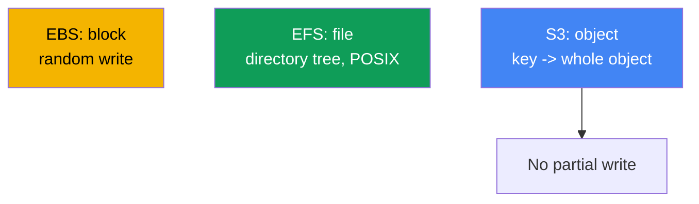
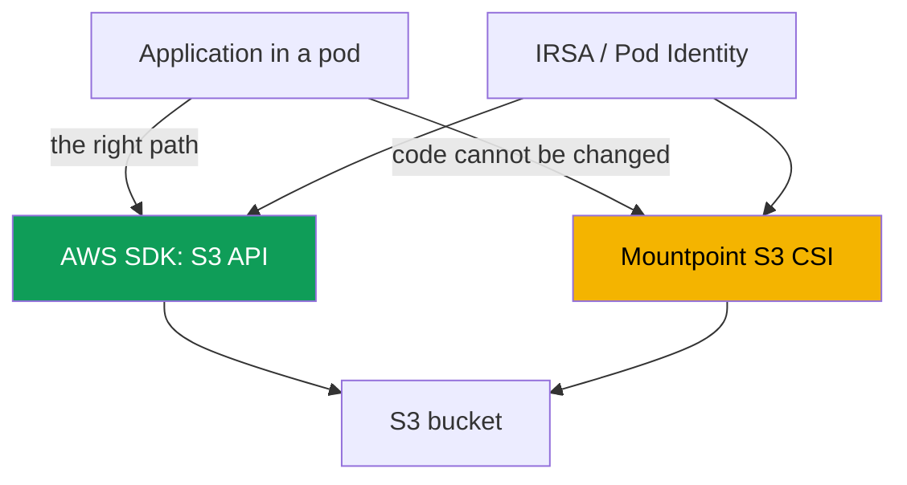

[Русская версия](ru.md) · [Versión en español](es.md) · [Version française](fr.md) · [Deutsche Version](de.md) · [ქართული ვერსია](ge.md) · [繁體中文版](tw.md) · [日本語版](jp.md)
# Chapter 25. S3 in applications: Mountpoint for Amazon S3 CSI and access patterns

> **What comes next.** Chapter 23 covered block EBS (a disk in one AZ, one writer), and chapter 24
> covered file access with EFS and FSx (network NFS, ReadWriteMany across zones). This chapter is
> about the third class: S3 object storage. It has a fundamentally different model: not a disk or a
> file system, but key-value storage. Mountpoint S3 can mount it as a volume, but with limitations,
> and that is the core of this chapter. Authorization through IRSA or Pod Identity is covered in
> chapters 16-17, FSx for Lustre with S3 integration is covered at a high level in chapter 24,
> private access through VPC endpoints is in chapter 31, and backup through AWS Backup is in
> chapter 41. We refer to them rather than repeat them.

## 25.1. "We mounted a bucket as a disk, and the application fails on rename"

A team is moving a service to EKS. The application wrote to a temporary directory: it created a
file with a `.tmp` suffix, wrote to it in parts, and finally renamed it to the final name. A
classic atomic write through `rename`. They decided to keep the directory in S3, mounted the
bucket through Mountpoint S3 CSI, the volume came up, and the pod started. Errors followed almost
immediately:

```bash
kubectl logs uploader-0
# rename('/data/report.tmp', '/data/report.csv'): Function not implemented
```

Then it got worse. Another service appended lines to a log through `O_APPEND` and received an
error on its very first append. A third tried to overwrite the middle of a configuration file in
place:

```bash
kubectl exec app-0 -- sh -c 'echo patched | dd of=/data/config.ini seek=10 conv=notrunc'
# dd: writing '/data/config.ini': Operation not permitted
```

The volume is mounted and reads work, but familiar filesystem operations, `rename`, `append`, and
writing in the middle of a file, fail. Their errno values are DIFFERENT, and that is the first
thing to notice: `rename` returns `ENOSYS` (`Function not implemented`), meaning the call does
not exist in the driver at all, while `append` and writing in the middle return `EPERM`
(`Operation not permitted`), meaning the operation exists but is forbidden. The distinction will
be useful in 25.7: settings cannot fix `ENOSYS`, while mount options can sometimes fix `EPERM`.
This is not a driver bug or a matter of POSIX permissions. The reason is deeper: S3 is object
storage, not a file system. Mountpoint provides a file **interface** to objects, but does not turn
S3 into a POSIX filesystem, and it explicitly rejects what cannot fit the object model. Let us see
why, and when Mountpoint is appropriate at all.

## 25.2. Object versus file and block storage: why S3 is not a filesystem

S3 uses a key-value model: an object is an immutable value (bytes plus metadata) under a string
key. There is neither a block device like EBS nor a directory tree like EFS. All the differences
that break filesystem expectations follow from this.



Four S3 properties matter for understanding Mountpoint:

- **No real directories.** The key space is flat. Prefixes imitate hierarchy: the key
  `logs/2024/app.log` looks like a path, but `logs/` and `2024/` are not directory objects, they
  are parts of the key string. A "directory" exists while an object with that prefix exists.
- **An object is whole and immutable.** A write is a `PutObject` of the entire object. You cannot
  change bytes in the middle, append to the end, or rename without rewriting. An update is a new
  `PutObject` under the same key, replacing the entire value.
- **Consistency model.** S3 provides strong read-after-write consistency: a new object is visible
  to every client immediately after a successful `PutObject`, and a read does not return partial
  data.
- **Storage classes and metadata.** An object has a storage class (Standard,
  Intelligent-Tiering, Glacier, and others) and metadata. Glacier objects must be restored before
  they can be read.

The restrictions in 25.1 arise directly from "an object is whole and immutable": `rename`,
`append`, and writing in the middle of a file cannot be implemented cheaply on the object model,
so Mountpoint does not emulate them.

## 25.3. Two patterns for accessing S3 from an application

There are two fundamentally different paths to S3 from a pod, and choosing between them matters
more than driver settings. The first is to work with S3 directly through the AWS SDK API. The
second is to mount a bucket as a volume through Mountpoint S3 CSI and access it as filesystem
paths.



**The SDK path is the right one for most applications.** Code calls `PutObject`, `GetObject`, and
`ListObjectsV2` directly, works honestly with the object model, and does not pretend there is a
filesystem. No CSI driver or volume is required. Authorization uses IRSA or EKS Pod Identity
(chapters 16-17): the pod receives an IAM role with bucket access, and the SDK picks up temporary
credentials itself. If the application is only being designed or can be modified, this is the
default choice.

**The Mountpoint path** is needed when the code cannot be rewritten for the SDK: it strictly uses
filesystem paths (a third-party binary, legacy software, or a tool that can only read files from
a disk). The bucket is then mounted as a volume, and the application sees objects as files, within
the limitations in 25.5.

| Criterion | AWS SDK (S3 API) | Mountpoint S3 CSI |
|---|---|---|
| Model for the application | object model, honest | file interface over objects |
| CSI and volume required | no | yes |
| Code changes | yes, SDK calls | no, work with paths |
| Completeness of operations | entire S3 API | filesystem subset (25.5) |
| When to choose | new or modifiable code | legacy, filesystem paths only |

Rule: first ask whether you can use the SDK. Mountpoint is a compromise for when rewriting the
application costs more than accepting the limitations of the file interface.

## 25.4. Mountpoint for Amazon S3 CSI driver in detail

The driver is built on Mountpoint for Amazon S3, a client that exposes bucket objects through a
file interface. In a cluster it runs as CSI with the **`s3.csi.aws.com`** provisioner and is
installed as the **managed addon** `aws-mountpoint-s3-csi-driver`:

```bash
aws eks create-addon --cluster-name demo --addon-name aws-mountpoint-s3-csi-driver \
  --service-account-role-arn arn:aws:iam::111122223333:role/AmazonEKS_S3_CSI_DriverRole
```

The driver needs an IAM role with bucket access, provided through IRSA or EKS Pod Identity
(chapters 16-17). The minimum set of actions recommended by Mountpoint is `s3:ListBucket` on the
bucket itself and `s3:GetObject`, `s3:PutObject`, `s3:AbortMultipartUpload` on objects;
`s3:DeleteObject` only if you allow deletion. There is also a ready-made managed policy,
`AmazonS3CSIDriverPolicy`. Without permissions, a pod hangs while mounting and operations fail
with `AccessDenied`.

By default, `authenticationSource: driver` is used: the entire cluster accesses S3 with the role
of the driver's service account. For multitenancy, `authenticationSource: pod` is available: the
volume uses the role of the pod's own service account (IRSA or Pod Identity), so different pods
receive different access.

**Static provisioning only.** There is no dynamic provisioning: the driver does not create
buckets or issue them through a StorageClass. The bucket is created in advance, and the PV is
described manually. The key fields are in `spec.csi`: `driver`, a unique `volumeHandle`, and
`bucketName` in `volumeAttributes`; the region is set in `mountOptions`.

```yaml
apiVersion: v1
kind: PersistentVolume
metadata: {name: s3-pv}
spec:
  capacity: {storage: 1200Gi}     # value is ignored, but required by the schema
  accessModes: ["ReadOnlyMany"]   # or ReadWriteMany
  storageClassName: ""            # empty: static provisioning
  claimRef:                       # hard-bind the PV to a specific PVC
    namespace: default
    name: s3-pvc
  mountOptions:
    - region eu-central-1
  csi:
    driver: s3.csi.aws.com
    volumeHandle: s3-csi-demo-volume   # must be unique
    volumeAttributes:
      bucketName: amzn-s3-demo-bucket
```

The PVC references this PV by name and also has an empty `storageClassName`:

```yaml
apiVersion: v1
kind: PersistentVolumeClaim
metadata: {name: s3-pvc}
spec:
  accessModes: ["ReadOnlyMany"]
  storageClassName: ""
  resources:
    requests: {storage: 1200Gi}   # value is ignored
  volumeName: s3-pv
```

| Field | Where | Purpose |
|---|---|---|
| `driver` | `csi` | always `s3.csi.aws.com` |
| `volumeHandle` | `csi` | unique volume ID; a duplicate will not work |
| `bucketName` | `volumeAttributes` | name of an existing bucket |
| `authenticationSource` | `volumeAttributes` | `driver` (default) or `pod` |
| `region ...` | `mountOptions` | bucket region |
| `cache` | `volumeAttributes` | local cache type: `emptyDir` or `ephemeral` |
| `metadata-ttl ...` | `mountOptions` | metadata cache TTL (seconds/`indefinite`) |
| `storageClassName: ""` | PV and PVC | required for static provisioning |

**Repeat-read cache.** Mountpoint can cache object data and metadata so repeated reads of one file
do not go to S3 again, which speeds up read-heavy workloads. In CSI driver v2, the local data
cache is configured not with a flag but with volume attributes: `cache: emptyDir` puts the cache
on a node-local volume, and `cacheEmptyDirSizeLimit` limits its size (you must set it, otherwise
the cache consumes the node disk). `cacheEmptyDirMedium: Memory` moves the cache to tmpfs (RAM)
for lower latency at the cost of node memory. The metadata cache is enabled separately with the
`metadata-ttl` option in `mountOptions`. For a cache on a dedicated volume (EBS or instance
store), use `cache: ephemeral` with `cacheEphemeralStorageClassName` and
`cacheEphemeralStorageResourceRequest`.

```yaml
    volumeAttributes:
      bucketName: amzn-s3-demo-bucket
      cache: emptyDir              # local data cache on the node
      cacheEmptyDirSizeLimit: 2Gi  # limit is required, or the cache takes the entire disk
```

In v1, the cache was set as a path through `cache` in `mountOptions`; in v2 this is deprecated,
the path is ignored, and the driver creates the `emptyDir` volume itself. Set the cache only with
volume attributes.

The typical access mode is `ReadOnlyMany` for datasets read by many pods. `ReadWriteMany` is
supported, but with the caveats in 25.5: concurrent writes to the same object are not coordinated,
and multiple pods must not write one key at the same time.

## 25.5. Mountpoint limitations: what breaks applications

This is the key section. Mountpoint intentionally does not emulate operations that would be
expensive with the object API or have no S3 equivalent. It **fails explicitly**, rather than
pretending an operation succeeded. For general purpose buckets, the list is as follows:

- **No writes in the middle of a file.** Writing is only sequential and from the beginning of the
  file, effectively constructing a new object. An offset inside an existing object is an error.
- **No `append` to an existing object.** Appending to the end is not supported on a regular bucket
  (`append` exists only for S3 Express One Zone directory buckets).
- **No `rename` / `mv`.** Renaming regular-bucket objects is not supported at all; renaming a
  directory is supported by neither bucket type. This is exactly what broke the service in 25.1.
- **No hard link or symlink.**
- **Limited POSIX semantics.** `chmod` and `chown` do not work: mode and owner are default values
  (`0644` for files, `0755` for directories) and can only be changed with mount flags. There are
  no extended attributes and no POSIX locks (`lockf`).
- **Directories are emulated** from key prefixes. You cannot delete or rename an existing
directory backed by objects in S3.
- **Deletion is disabled by default** and enabled with a flag; writing a new object becomes visible
to other clients only after the file is closed.

| Filesystem operation | Mountpoint (regular bucket) | Why |
|---|---|---|
| Reading, including random reads | yes | `GetObject`, including ranges |
| Create a new file | yes, sequentially | `PutObject` of an entire object |
| Overwrite existing content | whole object, with the overwrite flag | a new `PutObject` under the same key |
| Write in the middle | no | object is immutable |
| `append` | no (regular bucket) | no partial append |
| `rename` / `mv` | no (regular bucket) | no inexpensive operation in S3 |
| symlink / hardlink | no | no object-model equivalent |

Operational conclusion: any application that relies on `rename`, `append`, writing in the middle,
file locks, or changing POSIX permissions will not run on Mountpoint without rework. Use EFS
(chapter 24), not S3, for such shared file-access workloads.

## 25.6. When Mountpoint is appropriate

Mountpoint is optimized for high aggregate throughput when reading large objects, and for
sequential creation of new objects when writing. This gives it suitable scenarios:

- **Read-heavy: ML and analytics.** Many pods read large datasets from S3 (models, Parquet,
  media): `ReadOnlyMany`, parallel reads, and no application changes for the SDK.
- **Serving large static files.** A shared pool of large assets accessed only for reading.
- **Logs and artifacts as complete objects.** A job writes its result in full as a new object (a
  report, dump, or build artifact), which fits the "create a new object" model.

Mountpoint is not suitable for databases or any workload that modifies files in place, appends to
a log, or uses locks. Separately, for intensive parallel access to data from S3: if you need not
just a file interface but high-performance POSIX over the same S3 data, this is the domain of
**FSx for Lustre** (chapter 24), a parallel filesystem with S3 integration that provides fast
POSIX access to a dataset. Mountpoint is a lightweight file interface; Lustre is a high-performance
filesystem for HPC and ML.

### S3 Express One Zone (directory buckets) with Mountpoint

A special case is directory buckets in the **S3 Express One Zone** storage class. This is zonal
storage: data resides in one Availability Zone, close to compute (it can be colocated with EKS
nodes in the same AZ), which provides the lowest latency and high IOPS, hundreds of thousands of
requests per second per bucket. The trade-off is twofold. First, it is zonal: one AZ improves
latency rather than cross-zone durability, so data is unavailable if that zone fails. Second,
storage per gigabyte costs more than general purpose storage. There is also a scheduling
consequence: the volume is tied to the bucket's zone, so keep its pod in that AZ, otherwise the
point of colocation is lost and latency rises. It is not a replacement for general purpose S3 for
reliable long-term storage.

Directory buckets provide an important relaxation for Mountpoint: they support `append` to an
existing object, unlike regular general purpose buckets (25.5). Appending to the end of a file
works, so some POSIX limitations are removed. The other restrictions in 25.5 (no `rename`, no
writes in the middle, no symlink) remain; the object nature does not disappear.

Choose a directory bucket when low latency and high IOPS are critical, and the data can survive a
zone loss because it exists somewhere else (the source dataset in general purpose S3 or the
ability to regenerate it): ML training, interactive analytics, media processing. Choose general
purpose when you need cross-zone durability, long-term storage of the only copy, access from
multiple AZs, or writes without tying a pod to one zone. A directory bucket accelerates hot data;
it is not a location for the only copy.

## 25.7. Diagnosing common problems

The four most common situations are below.

| Symptom | Cause | What to check |
|---|---|---|
| Pod hangs and mounting does not start | no bucket role or permissions | role policy, `AccessDenied` in logs |
| `Function not implemented` on `rename` | the call does not exist in the driver (25.5) | application write pattern |
| `Operation not permitted` on `append`, overwrite, deletion | Mountpoint limitations and mount options (25.5) | write pattern, `allow-overwrite`, `allow-delete` |
| Object-access errors, bucket cannot be read | wrong bucket region | `region` in `mountOptions` |
| S3 timeouts in a private subnet | no route to S3 | VPC gateway endpoint (chapter 31) |

First, **permissions**. The driver role (or the pod role with `authenticationSource: pod`) must
allow `s3:ListBucket` on the bucket and `s3:GetObject`/`s3:PutObject` on objects. Check the
logs of driver pods in `kube-system` and look for `AccessDenied`:

```bash
kubectl get pods -n kube-system | grep s3-csi
kubectl logs -n kube-system -l app.kubernetes.io/name=aws-mountpoint-s3-csi-driver
```

Second, **failure on `rename`/`append`/partial write**. This is not an infrastructure incident;
it is application incompatibility with the object model (25.5). Look at errno: `ENOSYS` for
`rename` means "this does not exist in the driver and will not appear," while `EPERM` for
overwrite and deletion can be removed with `allow-overwrite` and `allow-delete` options if that
is a deliberate decision. Fix it either by moving to the SDK (25.3), or by moving to EFS
(chapter 24), not by configuring the driver.

Third, **region**. The bucket and `mountOptions: region` must match; the wrong region causes
object-access errors. Fourth, **private access**: in a private subnet without internet access, you
need a route to S3 through a **gateway endpoint** (the Gateway type for S3), or S3 API requests
will time out. A gateway endpoint also redirects S3 traffic away from the NAT Gateway, so reading
datasets is not charged as NAT traffic. Endpoints and private traffic are covered in chapter 31.

## 25.8. How this is used in production

- **SDK first, Mountpoint second.** By default, access S3 through the AWS SDK with an IRSA/Pod
  Identity role (chapters 16-17). Use Mountpoint only when the code cannot be moved to the SDK.
- **`ReadOnlyMany` for datasets.** Mount the volume read-only to read shared datasets; this is the
  safest and most common Mountpoint mode.
- **Minimum bucket permissions.** Give driver roles exactly the actions needed
  (`s3:ListBucket`, `s3:GetObject`, and for writes `s3:PutObject`, `s3:AbortMultipartUpload`),
  not `AmazonS3FullAccess`.
- **Multitenancy through `authenticationSource: pod`.** When different pods need different bucket
  access, use the pod service account's role rather than the shared driver role.
- **Private access through a gateway endpoint.** In private subnets, S3 traffic goes through the
  gateway endpoint, not a NAT Gateway: reads do not leave privately and are not charged as NAT
  traffic (chapter 31).
- **Local cache for repeated reads.** For read-heavy datasets, enable `cache: emptyDir` with
  `cacheEmptyDirSizeLimit`: repeated reads hit the node cache rather than S3. `metadata-ttl`
  caches metadata.
- **Bucket versioning.** If deletion or overwrite is enabled, Bucket Versioning protects against
  accidental loss of objects.

## 25.9. Mini glossary

- **Object storage**: a key-value model where an object (bytes plus metadata) is under a string
  key, is immutable, and is updated in full through `PutObject`.
- **Mountpoint for Amazon S3**: a client that exposes bucket objects through a file interface; the
  basis of the CSI driver.
- **Mountpoint S3 CSI driver**: `aws-mountpoint-s3-csi-driver`, a managed addon with the
  `s3.csi.aws.com` provisioner; static provisioning only.
- **Static provisioning**: a PV is described manually with `bucketName`; the driver has no dynamic
  provisioning or bucket creation.
- **`authenticationSource`**: source of a volume's credentials: `driver` (the shared driver role)
  or `pod` (the pod service account role).
- **Prefix**: the part of a key before `/`, from which Mountpoint emulates a directory; S3 has no
  real directories.
- **Local cache**: Mountpoint data cache on a node volume (`cache: emptyDir`/`ephemeral`) that
  speeds up repeat reads; the metadata cache is set by `metadata-ttl`.
- **Gateway endpoint**: a Gateway-type VPC endpoint for private S3 access without the internet
  (chapter 31).
- **S3 Express One Zone**: a zonal storage class (directory buckets) with low latency and high
  IOPS in one AZ; unlike general purpose buckets, it supports `append`.

## 25.10. Chapter summary

- S3 is object storage (key-value), not a filesystem or block disk. An object is whole and
  immutable, real directories do not exist, and prefixes imitate hierarchy.
- The object model causes the restrictions: no writes in the middle of a file, no `rename`, and no
  `append` to an existing object on regular buckets.
- There are two access paths: through the AWS SDK API (right for most cases, with an IRSA or Pod
  Identity role and no CSI) and through the Mountpoint S3 CSI file interface (when code cannot be
  rewritten for the SDK).
- The `s3.csi.aws.com` driver is installed as the `aws-mountpoint-s3-csi-driver` managed addon,
  with a role through IRSA/Pod Identity and bucket permissions (`s3:ListBucket`, `s3:GetObject`,
  `s3:PutObject`, `s3:AbortMultipartUpload`), or the `AmazonS3CSIDriverPolicy` managed policy.
  Provisioning is static only: a PV with `bucketName` in `volumeAttributes` and
  `storageClassName: ""`.
- Mountpoint limitations are explicit and strict: no partial write, `rename`, `append`,
  hard/symlink, or full POSIX (`chmod`/`chown` and locks are absent); directories are emulated.
  Any workload dependent on these operations will not run on Mountpoint.
- It is suitable for read-heavy workloads: ML/analytics reading large datasets (`ReadOnlyMany`),
  serving large static files, and writing logs and artifacts as whole objects. For intensive
  parallel POSIX access to S3 data, use FSx for Lustre (chapter 24).
- Local caching speeds repeat reads (`cache: emptyDir` with `cacheEmptyDirSizeLimit`,
  `metadata-ttl`), while a gateway endpoint redirects S3 traffic from private subnets around the
  NAT Gateway (chapter 31).
- Diagnose: bucket permissions for the role (`AccessDenied`), application failure on
  `rename`/partial write (incompatibility, not an outage), bucket region, and private access
  through a gateway endpoint.

## 25.11. How this helps in real work

On call, Mountpoint incidents divide into two groups. The first is infrastructure-related: a pod
does not mount the volume and the driver logs contain `AccessDenied`; check the role and its
permissions for the particular bucket, then the region in `mountOptions` and the S3 route in the
private subnet. The second, more deceptive group is an application failing on `rename` (`Function
not implemented`), `append`, or writing in the middle of a file (`Operation not permitted`). This
cannot be fixed with configuration: the application expects POSIX filesystem behavior from S3,
which object storage does not provide. The correct response is either to move the code to the AWS
SDK (then no CSI is needed at all), or, if actual shared file access with full semantics is
required, use EFS (chapter 24). When designing, keep the priority: first ask whether you can use
the SDK, and only if you cannot, assess whether the workload fits Mountpoint's limitations.

## 25.12. Self-check questions

1. How does the S3 object model differ from file (EFS) and block (EBS) storage?
2. Why does S3 have no real directories, and what is a prefix?
3. Why can you not write in the middle of an object or rename it on a regular bucket?
4. What two patterns exist for accessing S3 from a pod, and which is correct by default?
5. When is Mountpoint justified instead of AWS SDK access?
6. What are the managed addon and provisioner called for the Mountpoint S3 CSI driver?
7. Why does the driver need an IAM role, and what minimum bucket actions does it need?
8. How does `authenticationSource: driver` differ from `pod`, and when is the latter needed?
9. Why does Mountpoint only have static provisioning, and what does such a PV look like?
10. Which filesystem operations does Mountpoint not support, and why does it fail explicitly rather
    than silently?
11. Which workloads are suitable for Mountpoint, and where should you use EFS or FSx for Lustre
    instead?
12. A pod does not mount a Mountpoint volume: which causes do you check, and in what order?
13. Why does a private subnet need a gateway endpoint for S3, and how does it save NAT Gateway
    costs?
14. How do you enable Mountpoint's local data cache, and why set `cacheEmptyDirSizeLimit`?
15. What does S3 Express One Zone provide for Mountpoint, and what is the cost of zonality?

## Practice

The course lab for this topic: [lab 129: Mountpoint for S3: where file semantics break and why
there is no backup](../../labs/129/README.MD). It contains a static PV on a real bucket,
successful operations (a new object and reading), and three consecutive failures with errno
analysis, ending with why this PVC has no snapshot and what protects the data instead. The result
is checked with the `check_result` command.

Below is the same exercise on any cluster of your own. First look at the bucket from the AWS side:
`aws s3 ls` shows buckets, while `aws s3 ls s3://<bucket>/ --recursive` shows objects and their
"pseudo-directories" made of prefixes. Make sure the driver is installed: `aws eks list-addons
--cluster-name <cluster>` and `kubectl get pods -n kube-system | grep s3-csi`.

Next, reproduce the pain from 25.1. Create a static PV with `driver: s3.csi.aws.com`, your
bucket's `bucketName`, and `region` in `mountOptions`, bind a PVC, and start a pod with
`ReadWriteMany`. Use an image with a shell and utilities (`busybox`), or there will be nothing to
run with `kubectl exec`. In the pod, verify that reading and creating a new file work
(`kubectl exec ... -- cat /data/<key>` and writing a new key), then confirm that
`mv /data/a /data/b` fails with `Function not implemented`, while appending with
`echo x >> /data/existing` and writing in the middle through `dd ... seek=...` fail with
`Operation not permitted`. Also try overwriting and deleting a file: they too return `Operation
not permitted` until `allow-overwrite` and `allow-delete` are enabled. Compare with
`ReadOnlyMany`: mount the same bucket read-only and verify that many pods can read the dataset.
Separately test permissions: temporarily remove `s3:GetObject` from the driver role, recreate the
pod, and find `AccessDenied` in the driver pod logs (`kubectl logs -n kube-system -l
app.kubernetes.io/name=aws-mountpoint-s3-csi-driver`); restore the permission and confirm the
mount succeeds.

---
[Table of contents](../README.md) · [Chapter 24](../24/en.md) · [Chapter 26](../26/en.md)
