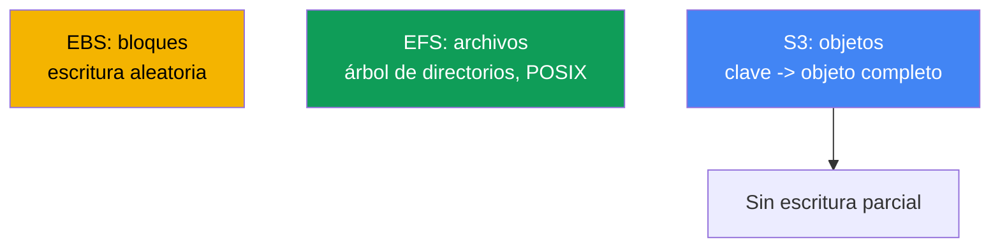
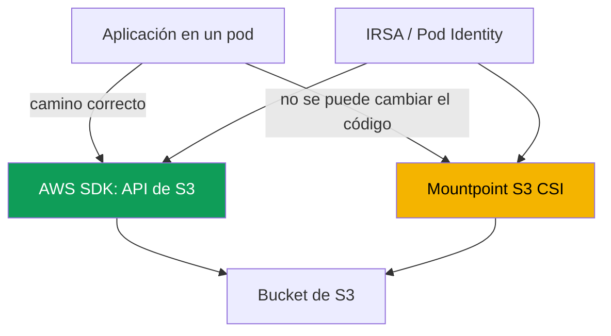

[Русская версия](ru.md) · [Eng version](en.md) · [Version française](fr.md) · [Deutsche Version](de.md) · [ქართული ვერსია](ge.md) · [繁體中文版](tw.md) · [日本語版](jp.md)
# Capítulo 25. S3 en aplicaciones: Mountpoint for Amazon S3 CSI y patrones de acceso

> **Qué sigue.** El capítulo 23 mostró EBS de bloques (un disco en una AZ, un escritor), el capítulo 24
> el acceso a archivos con EFS y FSx (NFS de red, ReadWriteMany entre zonas). Este capítulo trata
> la tercera clase: el almacenamiento de objetos S3. Tiene un modelo fundamentalmente distinto: no
> es un disco ni un sistema de archivos, sino un almacenamiento clave-valor. Mediante Mountpoint S3
> se puede montar como volumen, pero con limitaciones, y esto es el núcleo del capítulo. La
> autorización mediante IRSA o Pod Identity se cubre en los capítulos 16-17, FSx for Lustre con
> integración con S3 se trata de forma general en el capítulo 24, el acceso privado mediante VPC
> endpoints en el capítulo 31 y la copia de seguridad mediante AWS Backup en el capítulo 41. Se
> remite a ellos sin repetirlos.

## 25.1. «Montamos un bucket como disco, pero la aplicación falla en rename»

El equipo migra un servicio a EKS. La aplicación escribía en un directorio temporal: creaba un
archivo con el sufijo `.tmp`, le añadía contenido por partes y al final lo renombraba al nombre
final. El patrón clásico de escritura atómica mediante `rename`. Decidieron guardar el directorio
en S3, montaron el bucket mediante Mountpoint S3 CSI, el volumen se levantó y el pod arrancó. Y
casi de inmediato llegaron los errores:

```bash
kubectl logs uploader-0
# rename('/data/report.tmp', '/data/report.csv'): Function not implemented
```

Después fue peor. Otro servicio añadía líneas a un registro mediante `O_APPEND` y recibió un
error en el primer añadido. Un tercero intentó sobrescribir en el sitio la parte central de una
configuración:

```bash
kubectl exec app-0 -- sh -c 'echo patched | dd of=/data/config.ini seek=10 conv=notrunc'
# dd: writing '/data/config.ini': Operation not permitted
```

El volumen está montado, la lectura funciona, pero las operaciones habituales del sistema de
archivos, `rename`, `append` y escritura en mitad del archivo, fallan. Además, sus errno son
**DISTINTOS**, y es lo primero que conviene observar: `rename` devuelve `ENOSYS` (`Function not
implemented`), la llamada no existe en el controlador, mientras que `append` y la escritura en
medio devuelven `EPERM` (`Operation not permitted`), la operación existe pero está prohibida. La
diferencia será útil en 25.7: la configuración no soluciona `ENOSYS`; `EPERM` a veces se soluciona
con opciones de montaje. No es un bug del controlador ni una cuestión de permisos POSIX. La causa
es más profunda: S3 es almacenamiento de objetos, no un sistema de archivos. Mountpoint
proporciona una **interfaz** de archivos para los objetos, pero no convierte S3 en un sistema de
archivos POSIX, y rechaza honestamente aquello que no encaja en el modelo de objetos. Veamos por
qué y cuándo es adecuado usar Mountpoint.

## 25.2. Objetos frente a archivos y bloques: por qué S3 no es un sistema de archivos

S3 tiene un modelo clave-valor: un objeto es un valor inmutable (bytes más metadatos) bajo una
clave de cadena. No hay ni un dispositivo de bloques como EBS ni un árbol de directorios como
EFS. De ahí proceden todas las diferencias que rompen las expectativas de un sistema de archivos.



Cuatro propiedades de S3 importantes para comprender Mountpoint:

- **No hay directorios reales.** El espacio de claves es plano. Los prefijos simulan la jerarquía:
  la clave `logs/2024/app.log` parece una ruta, pero `logs/` y `2024/` no son objetos-directorio,
  sino parte de la cadena de clave. Un «directorio» existe mientras haya un objeto con ese prefijo.
- **El objeto es completo e inmutable.** Escribir es hacer `PutObject` de un objeto completo. No
  se pueden modificar bytes en el medio, añadir al final ni renombrar sin sobrescribir. Una
  actualización equivale a un nuevo `PutObject` bajo la misma clave, que sustituye el valor
  completo.
- **Modelo de consistencia.** S3 ofrece consistencia read-after-write fuerte: un objeto nuevo es
  visible de inmediato para todos los clientes tras un `PutObject` correcto, y la lectura no
  devuelve datos parciales.
- **Clases de almacenamiento y metadatos.** Un objeto tiene una clase de almacenamiento (Standard,
  Intelligent-Tiering, Glacier y otras) y metadatos. Los objetos en Glacier deben restaurarse
  antes de leerlos.

De «el objeto es completo e inmutable» nacen las prohibiciones de 25.1: `rename`, `append` y la
escritura en mitad de archivo no se pueden implementar de forma económica en el modelo de
objetos, por lo que Mountpoint no las emula.

## 25.3. Dos patrones para acceder a S3 desde una aplicación

Hay dos caminos fundamentalmente distintos hacia S3 desde un pod, y elegir entre ellos importa
más que la configuración del controlador. El primero es trabajar directamente con S3 mediante la
API usando AWS SDK. El segundo es montar un bucket como volumen mediante Mountpoint S3 CSI y
acceder a él como rutas de sistema de archivos.



**El camino mediante SDK es el correcto para la mayoría de las aplicaciones.** El código llama a
`PutObject`, `GetObject` y `ListObjectsV2` directamente, trabaja honestamente con el modelo de
objetos, sin la ilusión de un sistema de archivos. No hace falta ningún controlador CSI ni
volumen. La autorización se realiza mediante IRSA o EKS Pod Identity (capítulos 16-17): el pod
recibe un rol IAM con acceso al bucket y el SDK recoge automáticamente las credenciales
temporales. Si la aplicación se está diseñando o puede adaptarse, esta es la elección
predeterminada.

**El camino mediante Mountpoint** se necesita cuando no es posible reescribir el código para el
SDK: funciona rígidamente con rutas del sistema de archivos (un binario de terceros, software
heredado, una herramienta que solo sabe leer archivos de disco). Entonces se monta el bucket como
volumen y la aplicación ve los objetos como archivos, dentro de las limitaciones de 25.5.

| Criterio | AWS SDK (API de S3) | Mountpoint S3 CSI |
|---|---|---|
| Modelo para la aplicación | de objetos, honesto | interfaz de archivos sobre objetos |
| Requiere CSI y volumen | no | sí |
| Cambio de código | sí, llamadas al SDK | no, trabaja con rutas |
| Totalidad de operaciones | toda la API de S3 | subconjunto del sistema de archivos (25.5) |
| Cuándo elegirlo | código nuevo o modificable | legado, solo rutas de sistema de archivos |

Regla: primero pregunte si se puede ir por el SDK. Mountpoint es un compromiso para el caso en
que reescribir la aplicación cuesta más que aceptar las limitaciones de la interfaz de archivos.

## 25.4. Mountpoint for Amazon S3 CSI driver en detalle

El controlador se basa en Mountpoint for Amazon S3, un cliente que expone los objetos de un bucket
mediante una interfaz de archivos. En el clúster funciona como CSI con el provisionador
**`s3.csi.aws.com`** y se instala como el **managed addon** `aws-mountpoint-s3-csi-driver`:

```bash
aws eks create-addon --cluster-name demo --addon-name aws-mountpoint-s3-csi-driver \
  --service-account-role-arn arn:aws:iam::111122223333:role/AmazonEKS_S3_CSI_DriverRole
```

El controlador necesita un rol IAM con acceso al bucket, concedido mediante IRSA o EKS Pod
Identity (capítulos 16-17). El conjunto mínimo de acciones recomendado por Mountpoint es
`s3:ListBucket` sobre el propio bucket y `s3:GetObject`, `s3:PutObject`,
`s3:AbortMultipartUpload` sobre los objetos; `s3:DeleteObject` solo si permite eliminarlos.
También existe la política administrada lista para usar `AmazonS3CSIDriverPolicy`. Sin permisos,
el pod se queda bloqueado al montar y las operaciones fallan con `AccessDenied`.

De forma predeterminada se usa `authenticationSource: driver`: todo el clúster accede a S3 con el
rol de la cuenta de servicio del controlador. Para multitenencia existe `authenticationSource:
pod`: el volumen toma el rol de la cuenta de servicio del propio pod (IRSA o Pod Identity), y los
distintos pods reciben accesos diferentes.

**Solo aprovisionamiento estático.** No hay aprovisionamiento dinámico: el controlador no crea
buckets ni los asigna mediante StorageClass. El bucket se crea de antemano y el PV se describe
manualmente. Los campos clave están en `spec.csi`: `driver`, un `volumeHandle` único y
`bucketName` en `volumeAttributes`; la región se establece en `mountOptions`.

```yaml
apiVersion: v1
kind: PersistentVolume
metadata: {name: s3-pv}
spec:
  capacity: {storage: 1200Gi}     # el valor se ignora, pero el esquema lo exige
  accessModes: ["ReadOnlyMany"]   # o ReadWriteMany
  storageClassName: ""            # vacío: aprovisionamiento estático
  claimRef:                       # vínculo estricto del PV con un PVC concreto
    namespace: default
    name: s3-pvc
  mountOptions:
    - region eu-central-1
  csi:
    driver: s3.csi.aws.com
    volumeHandle: s3-csi-demo-volume   # debe ser único
    volumeAttributes:
      bucketName: amzn-s3-demo-bucket
```

El PVC hace referencia a este PV por nombre y también tiene `storageClassName` vacío:

```yaml
apiVersion: v1
kind: PersistentVolumeClaim
metadata: {name: s3-pvc}
spec:
  accessModes: ["ReadOnlyMany"]
  storageClassName: ""
  resources:
    requests: {storage: 1200Gi}   # el valor se ignora
  volumeName: s3-pv
```

| Campo | Dónde | Propósito |
|---|---|---|
| `driver` | `csi` | siempre `s3.csi.aws.com` |
| `volumeHandle` | `csi` | ID único del volumen; un duplicado no se procesará |
| `bucketName` | `volumeAttributes` | nombre del bucket existente |
| `authenticationSource` | `volumeAttributes` | `driver` (predeterminado) o `pod` |
| `region ...` | `mountOptions` | región del bucket |
| `cache` | `volumeAttributes` | tipo de caché local: `emptyDir` o `ephemeral` |
| `metadata-ttl ...` | `mountOptions` | TTL de la caché de metadatos (segundos/`indefinite`) |
| `storageClassName: ""` | PV y PVC | obligatorio para el modo estático |

**Caché de lecturas repetidas.** Mountpoint puede almacenar en caché los datos y los metadatos de
los objetos para que las lecturas repetidas del mismo archivo no vayan otra vez a S3, lo que
acelera las cargas con muchas lecturas. En el controlador CSI v2 la caché local de datos no se
configura con una opción sino mediante atributos de volumen: `cache: emptyDir` coloca la caché en
el volumen local del nodo, y `cacheEmptyDirSizeLimit` limita su tamaño (es obligatorio
establecerlo, de lo contrario la caché consumirá el disco del nodo). `cacheEmptyDirMedium: Memory`
lleva la caché a tmpfs (RAM) para obtener menor latencia a costa de la memoria del nodo. La caché
de metadatos se habilita por separado con la opción `metadata-ttl` en `mountOptions`. Para una
caché en un volumen dedicado (EBS o instance store), está el tipo `cache: ephemeral` con
`cacheEphemeralStorageClassName` y `cacheEphemeralStorageResourceRequest`.

```yaml
    volumeAttributes:
      bucketName: amzn-s3-demo-bucket
      cache: emptyDir              # caché local de datos en el nodo
      cacheEmptyDirSizeLimit: 2Gi  # el límite es obligatorio, o la caché ocupará todo el disco
```

En v1 la caché se establecía con una ruta mediante `cache` en `mountOptions`; en v2 está obsoleto,
la ruta se ignora y el controlador crea el volumen `emptyDir` por sí mismo. Especifique la caché
solo mediante atributos de volumen.

El modo de acceso típico es `ReadOnlyMany` para que muchos pods lean datasets. `ReadWriteMany` se
admite, pero con las salvedades de 25.5: la escritura paralela en un objeto no se coordina y no se
puede escribir simultáneamente una misma clave desde varios pods.

## 25.5. Limitaciones de Mountpoint: qué rompe las aplicaciones

Esta es la sección clave. Mountpoint no emula deliberadamente operaciones que serían costosas de
hacer sobre la API de objetos o que no tienen equivalente en S3. **Falla explícitamente**, en vez
de fingir que la operación tuvo éxito. Para los buckets normales (general purpose), la lista es la
siguiente:

- **No hay escritura en mitad de un archivo.** La escritura solo es secuencial y desde el inicio
  del archivo; en esencia, crea un objeto nuevo. Un desplazamiento hacia el interior de un objeto
  existente es un error.
- **No hay `append` a un objeto existente.** Añadir al final no se admite en un bucket normal
  (solo existe append en los directory buckets S3 Express One Zone).
- **No hay `rename` / `mv`.** El renombrado de objetos de un bucket normal no se admite en
  absoluto; el renombrado de un directorio no se admite en ningún tipo de bucket. Esto es
  precisamente lo que rompía el servicio de 25.1.
- **No hay hard link ni symlink.**
- **Semántica POSIX limitada.** `chmod` y `chown` no funcionan: los modos y el propietario son
  valores predeterminados (`0644` para archivos, `0755` para directorios), que solo cambian con
  opciones al montar. No hay atributos extendidos ni bloqueos POSIX (`lockf`).
- **Los directorios se emulan** a partir de prefijos de clave. No se puede eliminar ni renombrar
  un directorio existente respaldado por objetos en S3.
- **La eliminación está desactivada de forma predeterminada** y se habilita con una opción; la
  escritura de un objeto nuevo se hace visible a los demás clientes solo después de cerrar el
  archivo.

| Operación de sistema de archivos | Mountpoint (bucket normal) | Por qué |
|---|---|---|
| Lectura, incluida la aleatoria | sí | `GetObject`, incluso por rango |
| Crear archivo nuevo | sí, secuencialmente | `PutObject` del objeto completo |
| Sobrescribir existente | completo, con la opción overwrite | nuevo `PutObject` bajo la misma clave |
| Escritura en mitad | no | el objeto es inmutable |
| `append` | no (bucket normal) | no hay añadido parcial |
| `rename` / `mv` | no (bucket normal) | no hay operación económica en S3 |
| symlink / hardlink | no | no hay equivalente en el modelo de objetos |

Conclusión operativa: cualquier aplicación que dependa de `rename`, `append`, escritura en
mitad, bloqueos de archivos o cambios de permisos POSIX no funcionará con Mountpoint sin
rediseñarse. Para estas cargas de trabajo de acceso compartido a archivos, use EFS (capítulo 24),
no S3.

## 25.6. Cuándo es adecuado Mountpoint

Mountpoint está optimizado para un gran rendimiento total al leer objetos grandes y, al escribir,
para la creación secuencial de objetos nuevos. De ahí proceden sus casos de uso adecuados:

- **Muchas lecturas: ML y analítica.** Muchos pods leen datasets grandes desde S3 (modelos,
  parquet, medios): `ReadOnlyMany`, la lectura se paraleliza y la aplicación no cambia al SDK.
- **Distribución de grandes archivos estáticos.** Un conjunto compartido de grandes assets al que
  solo se accede en lectura.
- **Registros y artefactos como objetos completos.** Una tarea escribe el resultado íntegro como
  un objeto nuevo (informe, volcado, artefacto de compilación); esto encaja en el modelo de «crear
  un objeto nuevo».

Mountpoint no es adecuado para bases de datos ni para cualquier carga que modifique archivos en
el sitio, añada a un registro o use bloqueos. En particular, para acceso paralelo intensivo a
datos de S3: si no se necesita solo una interfaz de archivos sino alto rendimiento POSIX sobre los
mismos datos S3, el territorio es **FSx for Lustre** (capítulo 24), un sistema de archivos paralelo
integrado con S3 que proporciona acceso POSIX rápido al dataset. Mountpoint es una interfaz de
archivos ligera; Lustre es un sistema de archivos de alto rendimiento para HPC y ML.

### S3 Express One Zone (directory buckets) con Mountpoint

Un caso especial son los directory buckets de la clase de almacenamiento **S3 Express One Zone**.
Es almacenamiento zonal: los datos se encuentran en una zona de disponibilidad, cerca del compute
(se pueden colocar conjuntamente con nodos EKS en la misma AZ), lo que proporciona la menor
latencia y alto IOPS, cientos de miles de solicitudes por segundo por bucket. El coste es doble.
Primero, la zonalidad: una sola AZ favorece la latencia, no la durabilidad entre zonas; si la zona
falla, los datos no están disponibles. Segundo, el coste de almacenamiento por gigabyte es mayor
que en general purpose. Hay también una consecuencia de planificación: el volumen está vinculado
a la zona del bucket, por lo que el pod se mantiene en la misma AZ; de otro modo se pierde el
sentido de la colocación conjunta y aumenta la latencia. No es un reemplazo de S3 general purpose
para almacenamiento fiable a largo plazo.

Para Mountpoint, los directory buckets tienen una relajación importante: admiten `append` a un
objeto existente, algo que los buckets general purpose normales no admiten (25.5). Añadir al final
del archivo funciona, por lo que se elimina parte de las limitaciones POSIX. Las demás
prohibiciones de 25.5 (sin `rename`, sin escritura en mitad, sin symlink) permanecen; la
naturaleza de objeto no desaparece.

Cuándo usar un directory bucket: son críticos la baja latencia y el alto IOPS, y los datos pueden
sobrevivir a la pérdida de una zona porque también están en otro lugar (dataset fuente en S3
general purpose, posibilidad de regenerarlos): entrenamiento de ML, analítica interactiva,
procesamiento de medios. Cuándo usar general purpose: se necesita durabilidad entre zonas,
almacenamiento a largo plazo de la única copia, acceso desde varias AZ o escritura sin vincular el
pod a una sola zona. Un directory bucket es un acelerador para datos calientes, no el lugar de la
única copia.

## 25.7. Diagnóstico de problemas típicos

Cuatro situaciones que se encuentran con más frecuencia.

| Síntoma | Causa | Qué comprobar |
|---|---|---|
| El pod queda bloqueado, el montaje no avanza | no hay rol o permisos al bucket | política del rol, `AccessDenied` en los registros |
| `Function not implemented` en `rename` | la llamada no existe en el controlador (25.5) | patrón de escritura de la aplicación |
| `Operation not permitted` al hacer `append`, sobrescribir o eliminar | limitaciones de Mountpoint y opciones de montaje (25.5) | patrón de escritura, `allow-overwrite`, `allow-delete` |
| Errores de acceso a objetos, el bucket no se puede leer | región incorrecta del bucket | `region` en `mountOptions` |
| Timeouts a S3 en una subred privada | no hay ruta a S3 | VPC gateway endpoint (capítulo 31) |

Lo primero son los **permisos**. El rol del controlador (o el del pod con
`authenticationSource: pod`) debe conceder `s3:ListBucket` sobre el bucket y
`s3:GetObject`/`s3:PutObject` sobre los objetos. Se comprueba en los registros de los pods del
controlador en `kube-system` y por la presencia de `AccessDenied`:

```bash
kubectl get pods -n kube-system | grep s3-csi
kubectl logs -n kube-system -l app.kubernetes.io/name=aws-mountpoint-s3-csi-driver
```

Lo segundo es el **fallo en `rename`/`append`/partial write**. No es un incidente de
infraestructura, sino una incompatibilidad de la aplicación con el modelo de objetos (25.5). Mire
el errno: `ENOSYS` en `rename` significa «esto no está en el controlador y no aparecerá», mientras
que `EPERM` al sobrescribir y eliminar se elimina con las opciones `allow-overwrite` y
`allow-delete` si es una decisión consciente. La solución es migrar al SDK (25.3) o llevarlo a
EFS (capítulo 24), no configurar el controlador.

Lo tercero es la **región**. El bucket y `mountOptions: region` deben coincidir; una región
incorrecta causa errores de acceso a objetos. Lo cuarto es el **acceso privado**: en una subred
privada sin salida a Internet se necesita una ruta a S3 mediante un **gateway endpoint** (tipo
Gateway para S3); de lo contrario, las solicitudes a la API de S3 se bloquean por timeout. Además,
el gateway endpoint desvía el tráfico a S3 desde NAT Gateway, por lo que la lectura de datasets no
se cobra como tráfico NAT. Endpoints y tráfico privado se cubren en el capítulo 31.

## 25.8. Cómo se usa en producción

- **Primero SDK, después Mountpoint.** De forma predeterminada se accede a S3 mediante AWS SDK
  con un rol de IRSA/Pod Identity (capítulos 16-17). Mountpoint se usa solo cuando el código no se
  puede llevar al SDK.
- **`ReadOnlyMany` para datasets.** Para leer datasets compartidos, el volumen se monta solo en
  lectura; es el modo de Mountpoint más seguro y frecuente.
- **Permisos mínimos sobre el bucket.** A los roles del controlador se les conceden exactamente
  las acciones necesarias (`s3:ListBucket`, `s3:GetObject`, al escribir `s3:PutObject`,
  `s3:AbortMultipartUpload`), no `AmazonS3FullAccess`.
- **Multitenencia mediante `authenticationSource: pod`.** Cuando distintos pods necesitan
  distinto acceso a los buckets, el rol se toma de la cuenta de servicio del pod, no del
  controlador compartido.
- **Acceso privado mediante gateway endpoint.** En subredes privadas el tráfico a S3 va por el
  gateway endpoint, no por NAT Gateway: la lectura no sale al exterior y no se cobra como tráfico
  NAT (capítulo 31).
- **Caché local para lecturas repetidas.** Para datasets con muchas lecturas se habilita
  `cache: emptyDir` con `cacheEmptyDirSizeLimit`: las lecturas repetidas llegan a la caché del
  nodo, no a S3. `metadata-ttl` almacena en caché los metadatos.
- **Versionado del bucket.** Si se habilita la eliminación o la sobrescritura, Bucket Versioning
  protege contra la pérdida accidental de objetos.

## 25.9. Mini glosario

- **Almacenamiento de objetos**: modelo clave-valor, un objeto (bytes más metadatos) bajo una
  clave de cadena, inmutable, que se actualiza por completo mediante `PutObject`.
- **Mountpoint for Amazon S3**: cliente que expone los objetos de un bucket mediante una interfaz
  de archivos; la base del controlador CSI.
- **Controlador Mountpoint S3 CSI**: `aws-mountpoint-s3-csi-driver`, managed addon con el
  provisionador `s3.csi.aws.com`; solo aprovisionamiento estático.
- **aprovisionamiento estático**: el PV se describe manualmente con `bucketName`; el controlador
  no tiene aprovisionamiento dinámico ni creación de buckets.
- **`authenticationSource`**: fuente de credenciales del volumen: `driver` (rol compartido del
  controlador) o `pod` (rol de la cuenta de servicio del pod).
- **prefijo**: parte de la clave anterior a `/`, a partir de la que Mountpoint emula un directorio;
  en S3 no hay directorios reales.
- **caché local**: caché de datos de Mountpoint en el volumen del nodo (`cache: emptyDir`/
  `ephemeral`), que acelera lecturas repetidas; la caché de metadatos se establece con
  `metadata-ttl`.
- **gateway endpoint**: VPC endpoint de tipo Gateway para acceso privado a S3 sin Internet
  (capítulo 31).
- **S3 Express One Zone**: clase de almacenamiento zonal (directory buckets) con baja latencia y
  alto IOPS en una AZ; a diferencia de los buckets general purpose, admite `append`.

## 25.10. Resumen del capítulo

- S3 es almacenamiento de objetos (clave-valor), no un sistema de archivos ni un disco de
  bloques. El objeto es completo e inmutable, no hay directorios reales y los prefijos simulan la
  jerarquía.
- Del modelo de objetos proceden las prohibiciones: no hay escritura en mitad de archivo, no hay
  `rename`, ni `append` a un objeto existente en buckets normales.
- Hay dos vías de acceso: mediante AWS SDK por API (la correcta para la mayoría, con un rol IRSA o
  Pod Identity, sin CSI) y mediante la interfaz de archivos Mountpoint S3 CSI (cuando el código
  no se puede reescribir para SDK).
- El controlador `s3.csi.aws.com` se instala como el managed addon
  `aws-mountpoint-s3-csi-driver`, con un rol mediante IRSA/Pod Identity y permisos sobre el
  bucket (`s3:ListBucket`, `s3:GetObject`, `s3:PutObject`, `s3:AbortMultipartUpload`), y la
  política administrada `AmazonS3CSIDriverPolicy`. El aprovisionamiento es solo estático: PV con
  `bucketName` en `volumeAttributes`, `storageClassName: ""`.
- Las limitaciones de Mountpoint son honestas y estrictas: no hay partial write, `rename`,
  `append`, hard/symlink ni POSIX completo (sin `chmod`/`chown`, bloqueos), y los directorios se
  emulan. Cualquier carga de trabajo ligada a estas operaciones no funcionará con Mountpoint.
- Es adecuado para muchas lecturas: ML/analítica leen grandes datasets (`ReadOnlyMany`),
  distribución de grandes archivos estáticos y escritura de registros y artefactos como objetos
  completos. Para acceso POSIX paralelo intensivo a datos de S3, use FSx for Lustre (capítulo 24).
- Las lecturas repetidas se aceleran con caché local (`cache: emptyDir` con
  `cacheEmptyDirSizeLimit`, `metadata-ttl`), y el tráfico a S3 desde una subred privada se desvía
  al gateway endpoint sin pasar por NAT Gateway (capítulo 31).
- Diagnóstico: permisos del rol al bucket (`AccessDenied`), fallo de aplicación en
  `rename`/partial write (incompatibilidad, no avería), región del bucket y acceso privado por
  gateway endpoint.

## 25.11. Cómo resultará útil en el trabajo real

Durante una guardia, los incidentes de Mountpoint se dividen en dos grupos. El primero es de
infraestructura: el pod no monta el volumen y en los registros del controlador aparece
`AccessDenied`; revise el rol y sus permisos sobre el bucket concreto, después la región en
`mountOptions` y la ruta a S3 desde la subred privada. El segundo grupo, más insidioso, es que la
aplicación falla en `rename` (`Function not implemented`), en `append` o al escribir en mitad de
un archivo (`Operation not permitted`). Esto no se arregla con configuración: la aplicación
espera de S3 un comportamiento de sistema de archivos POSIX que el almacenamiento de objetos no
tiene. La respuesta correcta es migrar el código a AWS SDK (en cuyo caso CSI no hace falta en
absoluto) o, si se necesita precisamente acceso compartido a archivos con semántica completa,
usar EFS (capítulo 24). Al diseñar, mantenga la prioridad: primero pregunte si se puede usar SDK
y, solo si no, evalúe si la carga encaja en las limitaciones de Mountpoint.

## 25.12. Preguntas de autoevaluación

1. ¿En qué se diferencia el modelo de objetos de S3 del de archivos (EFS) y del de bloques (EBS)?
2. ¿Por qué S3 no tiene directorios reales y qué es un prefijo?
3. ¿Por qué no se puede añadir en mitad de un objeto ni renombrarlo en un bucket normal?
4. ¿Qué dos patrones de acceso a S3 desde un pod existen y cuál de ellos es correcto de forma predeterminada?
5. ¿Cuándo se justifica Mountpoint en lugar del acceso mediante AWS SDK?
6. ¿Cómo se llaman el managed addon y el provisionador del controlador Mountpoint S3 CSI?
7. ¿Por qué el controlador necesita un rol IAM y qué acciones mínimas necesita sobre el bucket?
8. ¿En qué se diferencia `authenticationSource: driver` de `pod` y cuándo se necesita el segundo?
9. ¿Por qué Mountpoint solo tiene aprovisionamiento estático y cómo es un PV de ese tipo?
10. ¿Qué operaciones de sistema de archivos no admite Mountpoint y por qué falla explícitamente en vez de hacerlo silenciosamente?
11. ¿Para qué cargas es adecuado Mountpoint y cuándo se usa EFS o FSx for Lustre en su lugar?
12. Un pod no monta un volumen Mountpoint: ¿qué causas comprueba y en qué orden?
13. ¿Por qué se necesita un gateway endpoint para S3 en una subred privada y cómo ahorra en NAT Gateway?
14. ¿Cómo se habilita la caché local de datos de Mountpoint y por qué se debe establecer `cacheEmptyDirSizeLimit`?
15. ¿Qué aporta S3 Express One Zone a Mountpoint y cuál es el precio de la zonalidad?

## Práctica

El laboratorio del curso para este tema: [laboratorio 129: Mountpoint for S3, dónde se rompe la
semántica de archivos y por qué no hay copia de seguridad](../../labs/129/README_ES.MD). Incluye
un PV estático sobre un bucket real, operaciones correctas (objeto nuevo y lectura) y tres fallos
consecutivos con análisis de errno, y termina explicando por qué dicho PVC no tiene snapshot y qué
protege los datos en su lugar. El resultado se comprueba con el comando `check_result`.

A continuación se muestra lo mismo en cualquier clúster propio. Primero examine el bucket desde
AWS: `aws s3 ls` mostrará los buckets, `aws s3 ls s3://<bucket>/ --recursive` los objetos y sus
«pseudodirectorios» a partir de prefijos. Asegúrese de que el controlador está instalado: `aws eks
list-addons --cluster-name <cluster>` y `kubectl get pods -n kube-system | grep s3-csi`.

A continuación reproduzca el problema de 25.1. Cree un PV estático con `driver: s3.csi.aws.com`,
`bucketName` de su bucket y `region` en `mountOptions`, vincule un PVC y levante un pod con
`ReadWriteMany`. Use una imagen con shell y utilidades (`busybox`), de lo contrario no habrá nada
que ejecutar con `kubectl exec`. En el pod compruebe que la lectura y la creación de un archivo
nuevo funcionan (`kubectl exec ... -- cat /data/<key>` y escritura de una clave nueva), y luego
confirme que `mv /data/a /data/b` falla con `Function not implemented`, y que añadir
`echo x >> /data/existing` y escribir en mitad mediante `dd ... seek=...` fallan con `Operation
not permitted`. Pruebe también a sobrescribir y eliminar un archivo: también dan `Operation not
permitted` hasta habilitar `allow-overwrite` y `allow-delete`. Compare con `ReadOnlyMany`: monte
el mismo bucket solo en lectura y confirme que muchos pods leen el dataset. Compruebe además los
permisos: elimine temporalmente `s3:GetObject` del rol del controlador, vuelva a crear el pod y
encuentre `AccessDenied` en los registros de los pods del controlador (`kubectl logs -n kube-system
-l app.kubernetes.io/name=aws-mountpoint-s3-csi-driver`); devuelva el permiso y confirme que el
montaje se completa.

---
[Índice](../README_ES.md) · [Capítulo 24](../24/es.md) · [Capítulo 26](../26/es.md)
