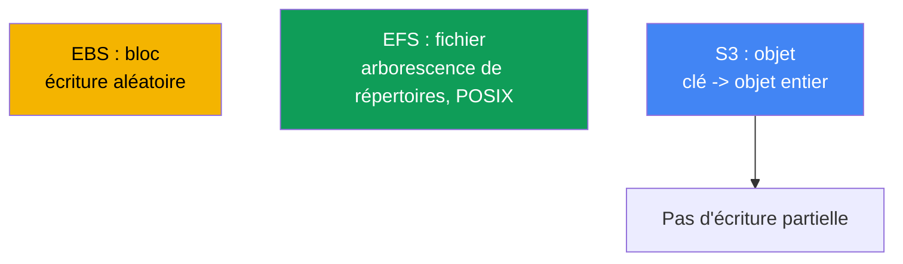
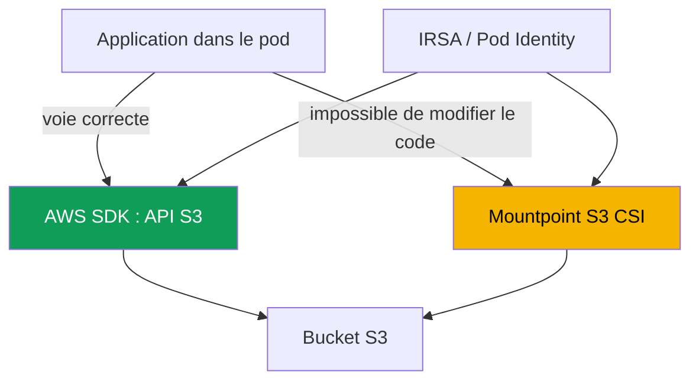

[Русская версия](ru.md) · [Eng version](en.md) · [Versión en español](es.md) · [Deutsche Version](de.md) · [ქართული ვერსია](ge.md) · [繁體中文版](tw.md) · [日本語版](jp.md)
# Chapitre 25. S3 dans les applications : Mountpoint for Amazon S3 CSI et modèles d'accès

> **La suite.** Le chapitre 23 a montré le stockage bloc EBS (un disque dans une seule AZ, un seul écrivain), le chapitre 24 l'accès fichier EFS et FSx (NFS réseau, ReadWriteMany entre zones). Ce chapitre porte sur une troisième classe : le stockage objet S3. Son modèle est fondamentalement différent : ce n'est ni un disque ni un système de fichiers, mais un stockage clé-valeur. Mountpoint S3 permet de le monter comme volume, avec des limites, et c'est le cœur du chapitre. L'autorisation via IRSA ou Pod Identity est traitée aux chapitres 16-17, FSx for Lustre avec son intégration S3 est abordé au chapitre 24, l'accès privé via les VPC endpoints au chapitre 31 et la sauvegarde avec AWS Backup au chapitre 41. Nous y renvoyons sans les répéter.

## 25.1. « Nous avons monté le bucket comme disque, et l'application échoue sur rename »

Une équipe migre un service vers EKS. L'application écrivait dans un répertoire temporaire : elle créait un fichier avec le suffixe `.tmp`, y ajoutait des données par morceaux, puis le renommait avec son nom final. C'est l'écriture atomique classique via `rename`. L'équipe décide de placer le répertoire dans S3, monte le bucket avec Mountpoint S3 CSI, le volume est disponible et le pod démarre. Puis les erreurs arrivent presque immédiatement :

```bash
kubectl logs uploader-0
# rename('/data/report.tmp', '/data/report.csv'): Function not implemented
```

La situation s'aggrave. Un autre service ajoutait des lignes dans un journal via `O_APPEND` et reçoit une erreur dès le premier ajout. Un troisième tente de réécrire le milieu d'une configuration sur place :

```bash
kubectl exec app-0 -- sh -c 'echo patched | dd of=/data/config.ini seek=10 conv=notrunc'
# dd: writing '/data/config.ini': Operation not permitted
```

Le volume est monté, la lecture fonctionne, mais les opérations de système de fichiers habituelles, `rename`, `append`, écriture au milieu d'un fichier, échouent. Leurs errno sont en outre **différents**, ce qui est la première chose à relever : `rename` renvoie `ENOSYS` (`Function not implemented`), l'appel n'existe tout simplement pas dans le pilote, tandis que `append` et l'écriture au milieu renvoient `EPERM` (`Operation not permitted`), l'opération existe mais est interdite. La différence servira en 25.7 : `ENOSYS` ne se corrige pas avec la configuration, `EPERM` peut parfois être corrigé avec des options de montage. Ce n'est ni un bogue du pilote ni une question de droits POSIX. La raison est plus profonde : S3 est un stockage objet, pas un système de fichiers. Mountpoint fournit une **interface** de fichiers vers les objets, mais ne transforme pas S3 en système de fichiers POSIX, et il refuse franchement ce qui ne s'adapte pas au modèle objet. Voyons pourquoi et quand Mountpoint est réellement approprié.

## 25.2. Objet contre fichier et bloc : pourquoi S3 n'est pas un système de fichiers

S3 suit un modèle clé-valeur : un objet est une valeur immuable (des octets plus des métadonnées) sous une clé chaîne. Il n'y a ni périphérique bloc comme EBS, ni arborescence de répertoires comme EFS. Toutes les différences qui brisent les attentes d'un système de fichiers en découlent.



Quatre propriétés de S3 sont importantes pour comprendre Mountpoint :

- **Il n'y a pas de véritables répertoires.** L'espace de clés est plat. Les préfixes simulent une hiérarchie : la clé `logs/2024/app.log` ressemble à un chemin, mais `logs/` et `2024/` ne sont pas des objets-répertoires, seulement des parties de la chaîne de clé. Un « répertoire » existe tant qu'il y a un objet avec ce préfixe.
- **L'objet est entier et immuable.** Une écriture est un `PutObject` de l'objet entier. Il est impossible de modifier des octets au milieu, d'ajouter à la fin ou de renommer sans réécrire. Une mise à jour est un nouveau `PutObject` sous la même clé, remplaçant la valeur entière.
- **Modèle de cohérence.** S3 offre une cohérence stricte read-after-write : un nouvel objet est immédiatement visible par tous les clients après un `PutObject` réussi, et une lecture ne renvoie pas de données partielles.
- **Classes de stockage et métadonnées.** Un objet a une classe de stockage (Standard, Intelligent-Tiering, Glacier et autres) et des métadonnées. Les objets Glacier doivent être restaurés avant lecture.

C'est précisément de « l'objet est entier et immuable » que viennent les interdictions de 25.1 : `rename`, `append` et l'écriture au milieu d'un fichier ne sont pas réalisables à faible coût avec le modèle objet, donc Mountpoint ne les émule pas.

## 25.3. Deux modèles d'accès à S3 depuis une application

Deux voies fondamentalement différentes relient un pod à S3, et le choix entre elles est plus important que les réglages du pilote. La première consiste à utiliser S3 directement par son API via l'AWS SDK. La seconde monte le bucket comme volume avec Mountpoint S3 CSI et y accède comme à des chemins de système de fichiers.



**La voie SDK est la bonne pour la plupart des applications.** Le code appelle directement `PutObject`, `GetObject`, `ListObjectsV2`, utilise honnêtement le modèle objet, sans illusion de système de fichiers. Aucun pilote CSI ni volume n'est nécessaire. L'autorisation passe par IRSA ou EKS Pod Identity (chapitres 16-17) : le pod reçoit un rôle IAM avec accès au bucket, et le SDK récupère lui-même les clés temporaires. Si l'application est seulement en conception ou peut être adaptée, c'est le choix par défaut.

**La voie Mountpoint** est nécessaire lorsque le code ne peut pas être réécrit pour le SDK : il travaille impérativement avec des chemins de système de fichiers (binaire tiers, application legacy, outil ne sachant lire que des fichiers sur disque). Le bucket est alors monté comme volume et l'application voit les objets comme des fichiers, dans les limites de 25.5.

| Critère | AWS SDK (API S3) | Mountpoint S3 CSI |
|---|---|---|
| Modèle pour l'application | objet, honnête | interface de fichiers sur les objets |
| CSI et volume nécessaires | non | oui |
| Modification du code | oui, appels SDK | non, travail avec des chemins |
| Exhaustivité des opérations | API S3 complète | sous-ensemble du système de fichiers (25.5) |
| Quand le choisir | code nouveau ou modifiable | legacy, chemins de système de fichiers uniquement |

Règle : demandez d'abord s'il est possible de passer par le SDK. Mountpoint est un compromis lorsque réécrire l'application coûte plus cher que d'accepter les limites de l'interface de fichiers.

## 25.4. Le pilote Mountpoint for Amazon S3 CSI en pratique

Le pilote est construit sur Mountpoint for Amazon S3, un client qui expose les objets d'un bucket par une interface de fichiers. Dans le cluster, il fonctionne comme CSI avec le provisioner **`s3.csi.aws.com`** et s'installe en tant que **managed addon** `aws-mountpoint-s3-csi-driver` :

```bash
aws eks create-addon --cluster-name demo --addon-name aws-mountpoint-s3-csi-driver \
  --service-account-role-arn arn:aws:iam::111122223333:role/AmazonEKS_S3_CSI_DriverRole
```

Le pilote a besoin d'un rôle IAM donnant accès au bucket, attribué avec IRSA ou EKS Pod Identity (chapitres 16-17). Le jeu minimal d'actions recommandé par Mountpoint est : `s3:ListBucket` sur le bucket lui-même, et `s3:GetObject`, `s3:PutObject`, `s3:AbortMultipartUpload` sur les objets ; `s3:DeleteObject` seulement si vous autorisez la suppression. Il existe aussi une managed policy prête à l'emploi, `AmazonS3CSIDriverPolicy`. Sans droits, le pod reste bloqué au montage et les opérations échouent avec `AccessDenied`.

Par défaut, `authenticationSource: driver` est utilisé : tout le cluster accède à S3 avec le rôle du service account du pilote. Pour le multitenant, il existe `authenticationSource: pod` : le volume utilise le rôle du service account du pod lui-même (IRSA ou Pod Identity), et différents pods reçoivent des accès différents.

**Provisioning statique uniquement.** Il n'y a pas de provisioning dynamique : le pilote ne crée pas de buckets et ne les attribue pas avec une StorageClass. Le bucket est créé à l'avance et le PV est décrit manuellement. Les champs clés sont dans `spec.csi` : `driver`, un `volumeHandle` unique et `bucketName` dans `volumeAttributes` ; la région est définie dans `mountOptions`.

```yaml
apiVersion: v1
kind: PersistentVolume
metadata: {name: s3-pv}
spec:
  capacity: {storage: 1200Gi}     # valeur ignorée, mais exigée par le schéma
  accessModes: ["ReadOnlyMany"]   # ou ReadWriteMany
  storageClassName: ""            # vide : provisioning statique
  claimRef:                       # liaison stricte du PV à un PVC précis
    namespace: default
    name: s3-pvc
  mountOptions:
    - region eu-central-1
  csi:
    driver: s3.csi.aws.com
    volumeHandle: s3-csi-demo-volume   # doit être unique
    volumeAttributes:
      bucketName: amzn-s3-demo-bucket
```

Le PVC référence ce PV par son nom et utilise lui aussi un `storageClassName` vide :

```yaml
apiVersion: v1
kind: PersistentVolumeClaim
metadata: {name: s3-pvc}
spec:
  accessModes: ["ReadOnlyMany"]
  storageClassName: ""
  resources:
    requests: {storage: 1200Gi}   # valeur ignorée
  volumeName: s3-pv
```

| Champ | Emplacement | Rôle |
|---|---|---|
| `driver` | `csi` | toujours `s3.csi.aws.com` |
| `volumeHandle` | `csi` | ID unique du volume ; un doublon ne sera pas traité |
| `bucketName` | `volumeAttributes` | nom du bucket existant |
| `authenticationSource` | `volumeAttributes` | `driver` (par défaut) ou `pod` |
| `region ...` | `mountOptions` | région du bucket |
| `cache` | `volumeAttributes` | type de cache local : `emptyDir` ou `ephemeral` |
| `metadata-ttl ...` | `mountOptions` | TTL du cache de métadonnées (secondes/`indefinite`) |
| `storageClassName: ""` | PV et PVC | obligatoire pour le mode statique |

**Cache des lectures répétées.** Mountpoint peut mettre en cache les données et métadonnées d'objets afin que les lectures répétées d'un même fichier ne retournent pas à S3, ce qui accélère les charges read-heavy. Dans le pilote CSI v2, le cache local de données n'est pas défini par un flag mais par les attributs de volume : `cache: emptyDir` place le cache sur le volume local du nœud, et `cacheEmptyDirSizeLimit` limite sa taille (il faut le définir impérativement, sans quoi le cache consommera le disque du nœud). `cacheEmptyDirMedium: Memory` place le cache dans tmpfs (RAM) pour réduire les latences, au prix de la mémoire du nœud. Le cache de métadonnées s'active séparément avec l'option `metadata-ttl` dans `mountOptions`. Pour un cache sur un volume dédié (EBS ou instance store), il existe le type `cache: ephemeral` avec `cacheEphemeralStorageClassName` et `cacheEphemeralStorageResourceRequest`.

```yaml
    volumeAttributes:
      bucketName: amzn-s3-demo-bucket
      cache: emptyDir              # cache local de données sur le nœud
      cacheEmptyDirSizeLimit: 2Gi  # limite obligatoire, sinon le cache occupe tout le disque
```

Dans v1, le cache était défini par un chemin via `cache` dans `mountOptions` ; dans v2, cela est obsolète, le chemin est ignoré et le pilote crée lui-même un volume `emptyDir`. Définissez le cache uniquement avec les attributs de volume.

Le mode d'accès habituel est `ReadOnlyMany` pour lire des jeux de données depuis de nombreux pods. `ReadWriteMany` est pris en charge, mais avec les réserves de 25.5 : les écritures parallèles dans un même objet ne sont pas coordonnées et plusieurs pods ne peuvent pas écrire simultanément la même clé.

## 25.5. Limites de Mountpoint : ce qui casse les applications

C'est la section clé. Mountpoint n'émule délibérément pas les opérations dont l'API objet exigerait une implémentation coûteuse ou qui n'ont pas d'équivalent dans S3. Il **échoue explicitement**, au lieu de prétendre que l'opération a réussi. Pour les buckets ordinaires (general purpose), la liste est la suivante :

- **Pas d'écriture au milieu d'un fichier.** L'écriture est uniquement séquentielle et depuis le début du fichier, c'est en substance la construction d'un nouvel objet. Un déplacement dans un objet existant est une erreur.
- **Pas d'`append` à un objet existant.** L'ajout en fin de fichier n'est pas pris en charge pour un bucket ordinaire (append n'existe que pour les directory buckets S3 Express One Zone).
- **Pas de `rename` / `mv`.** Le renommage des objets d'un bucket ordinaire n'est pas pris en charge du tout ; le renommage d'un répertoire ne l'est pour aucun type de bucket. C'est précisément ce qui cassait le service de 25.1.
- **Pas de hard link ni de symlink.**
- **Sémantique POSIX limitée.** `chmod` et `chown` ne fonctionnent pas : les modes et le propriétaire ont des valeurs par défaut (`0644` pour les fichiers, `0755` pour les répertoires), modifiables uniquement avec des flags de montage. Il n'y a ni extended attributes ni verrous POSIX (`lockf`).
- **Les répertoires sont émulés** depuis les préfixes de clés. Il est impossible de supprimer ou renommer un répertoire existant soutenu par des objets dans S3.
- **La suppression est désactivée par défaut** et s'active avec un flag ; l'écriture d'un nouvel objet n'est visible par les autres clients qu'après la fermeture du fichier.

| Opération de système de fichiers | Mountpoint (bucket ordinaire) | Pourquoi |
|---|---|---|
| Lecture, y compris aléatoire | oui | `GetObject`, y compris par plage |
| Créer un nouveau fichier | oui, séquentiellement | `PutObject` de l'objet entier |
| Écraser un existant | entièrement, avec le flag overwrite | nouveau `PutObject` sous la même clé |
| Écriture au milieu | non | objet immuable |
| `append` | non (bucket ordinaire) | pas d'ajout partiel |
| `rename` / `mv` | non (bucket ordinaire) | aucune opération bon marché dans S3 |
| symlink / hardlink | non | aucun équivalent dans le modèle objet |

Conclusion pour l'exploitation : toute application qui repose sur `rename`, `append`, l'écriture au milieu, les verrous de fichiers ou la modification des droits POSIX ne fonctionnera pas sur Mountpoint sans refonte. Pour de telles charges avec accès fichier partagé, utilisez EFS (chapitre 24), pas S3.

## 25.6. Quand Mountpoint est approprié

Mountpoint est optimisé pour un débit cumulé élevé lors de la lecture de gros objets et, en écriture, pour la création séquentielle de nouveaux objets. Ses bons cas d'usage en découlent :

- **Read-heavy : ML et analytique.** De nombreux pods lisent de grands jeux de données dans S3 (modèles, parquet, médias), `ReadOnlyMany`, la lecture est parallélisée et l'application n'est pas modifiée pour le SDK.
- **Distribution de gros fichiers statiques.** Un pool partagé de gros assets auquel on accède uniquement en lecture.
- **Logs et artefacts comme objets entiers.** Une tâche écrit son résultat entièrement dans un nouvel objet (rapport, dump, artefact de build), ce qui correspond au modèle « créer un nouvel objet ».

Mountpoint ne convient pas aux bases de données ni aux charges qui modifient des fichiers sur place, ajoutent à un journal ou utilisent des verrous. Pour l'accès parallèle intensif à des données S3, si vous avez besoin non seulement d'une interface de fichiers mais aussi de hautes performances POSIX sur les mêmes données S3, c'est le domaine de **FSx for Lustre** (chapitre 24), un système de fichiers parallèle relié à S3, fournissant un accès POSIX rapide au jeu de données. Mountpoint est une interface de fichiers légère, Lustre est un système de fichiers performant pour HPC et ML.

### S3 Express One Zone (directory buckets) avec Mountpoint

Les directory buckets de la classe de stockage **S3 Express One Zone** constituent un cas particulier. C'est du stockage zonal : les données résident dans une seule zone de disponibilité, près du compute (elles peuvent être colocalisées avec les nœuds EKS dans la même AZ), ce qui procure la plus faible latence et un IOPS élevé, des centaines de milliers de requêtes par seconde et par bucket. Le prix à payer est double. Premièrement, la zonalité : une seule AZ favorise la latence, pas la durabilité entre zones, et les données sont indisponibles si la zone tombe. Deuxièmement, le coût de stockage par gigaoctet est plus élevé que pour general purpose. Il y a aussi une conséquence de planification : le volume est lié à la zone du bucket, donc le pod qui l'utilise doit rester dans la même AZ, sinon l'intérêt de la colocalisation disparaît et la latence augmente. Ce n'est pas un remplacement de S3 general purpose pour le stockage fiable à long terme.

Pour Mountpoint, les directory buckets apportent un assouplissement important : ils prennent en charge `append` vers un objet existant, contrairement aux buckets general purpose ordinaires (25.5). L'ajout à la fin d'un fichier fonctionne, et une partie des limites POSIX disparaît donc. Les autres interdictions de 25.5 (pas de `rename`, pas d'écriture au milieu, pas de symlink) restent : la nature objet ne disparaît pas.

Utilisez un directory bucket lorsque la faible latence et un IOPS élevé sont critiques et que les données peuvent survivre à la perte d'une zone parce qu'elles existent aussi ailleurs (jeu de données source dans S3 general purpose, possibilité de régénération) : entraînement ML, analytique interactive, traitement de médias. Utilisez general purpose lorsqu'il faut de la durabilité entre zones, le stockage de long terme d'une copie unique, l'accès depuis plusieurs AZ ou l'écriture sans lier le pod à une zone. Un directory bucket est un accélérateur de données chaudes, pas l'emplacement d'une copie unique.

## 25.7. Diagnostic des problèmes courants

Les quatre situations les plus fréquentes.

| Symptôme | Cause | À vérifier |
|---|---|---|
| Le pod reste bloqué, le montage ne se fait pas | absence de rôle ou de droits vers le bucket | policy du rôle, `AccessDenied` dans les logs |
| `Function not implemented` sur `rename` | l'appel n'existe pas dans le pilote (25.5) | modèle d'écriture de l'application |
| `Operation not permitted` sur `append`, écrasement, suppression | limites Mountpoint et mount options (25.5) | modèle d'écriture, `allow-overwrite`, `allow-delete` |
| Erreurs d'accès aux objets, bucket illisible | mauvaise région du bucket | `region` dans `mountOptions` |
| Timeouts vers S3 dans un sous-réseau privé | pas de route vers S3 | VPC gateway endpoint (chapitre 31) |

Le premier point, ce sont les **droits**. Le rôle du pilote (ou celui du pod avec `authenticationSource: pod`) doit donner `s3:ListBucket` sur le bucket et `s3:GetObject`/`s3:PutObject` sur les objets. Vérifiez les logs des pods du pilote dans `kube-system` et la présence de `AccessDenied` :

```bash
kubectl get pods -n kube-system | grep s3-csi
kubectl logs -n kube-system -l app.kubernetes.io/name=aws-mountpoint-s3-csi-driver
```

Le deuxième point est l'**échec sur `rename`/`append`/partial write**. Ce n'est pas un incident d'infrastructure, mais une incompatibilité entre l'application et le modèle objet (25.5). Regardez errno : `ENOSYS` sur `rename` signifie « cette opération n'existe pas dans le pilote et n'apparaîtra pas », tandis que `EPERM` sur l'écrasement et la suppression est levé par les options `allow-overwrite` et `allow-delete`, si c'est une décision consciente. La solution est soit de passer au SDK (25.3), soit de migrer vers EFS (chapitre 24), pas de régler le pilote.

Le troisième point est la **région**. Le bucket et `mountOptions: region` doivent correspondre ; une région erronée produit des erreurs d'accès aux objets. Le quatrième est l'**accès privé** : dans un sous-réseau privé sans sortie Internet, il faut une route vers S3 via un **gateway endpoint** (type Gateway pour S3), sinon les requêtes vers l'API S3 expirent. Un gateway endpoint détourne aussi le trafic S3 du NAT Gateway, ainsi la lecture de jeux de données n'est pas facturée comme trafic NAT. Les endpoints et le trafic privé sont traités au chapitre 31.

## 25.8. Utilisation en production

- **D'abord SDK, puis Mountpoint.** Par défaut, l'accès à S3 passe par l'AWS SDK avec un rôle IRSA/Pod Identity (chapitres 16-17). Mountpoint n'est retenu que si le code ne peut pas être migré vers le SDK.
- **`ReadOnlyMany` pour les jeux de données.** Pour lire des jeux de données partagés, montez le volume en lecture seule ; c'est le mode Mountpoint le plus sûr et le plus fréquent.
- **Droits minimaux sur le bucket.** Donnez aux rôles du pilote exactement les actions nécessaires (`s3:ListBucket`, `s3:GetObject`, à l'écriture `s3:PutObject`, `s3:AbortMultipartUpload`), et non `AmazonS3FullAccess`.
- **Multitenant via `authenticationSource: pod`.** Lorsque différents pods ont besoin d'accès différents aux buckets, prenez le rôle du service account du pod, pas le rôle commun du pilote.
- **Accès privé via gateway endpoint.** Dans les sous-réseaux privés, le trafic vers S3 passe par un gateway endpoint, non par un NAT Gateway : la lecture ne sort pas et n'est pas facturée comme trafic NAT (chapitre 31).
- **Cache local pour les lectures répétées.** Pour les jeux de données read-heavy, activez `cache: emptyDir` avec `cacheEmptyDirSizeLimit` : les lectures répétées frappent le cache du nœud et non S3. `metadata-ttl` met les métadonnées en cache.
- **Versioning du bucket.** Si la suppression ou l'écrasement est activé, Bucket Versioning protège contre la perte accidentelle d'objets.

## 25.9. Mini-glossaire

- **Stockage objet** : modèle clé-valeur où un objet (octets plus métadonnées), sous une clé chaîne, est immuable et mis à jour entièrement avec `PutObject`.
- **Mountpoint for Amazon S3** : client qui expose les objets d'un bucket via une interface de fichiers ; fondement du pilote CSI.
- **Pilote Mountpoint S3 CSI** : `aws-mountpoint-s3-csi-driver`, managed addon avec le provisioner `s3.csi.aws.com` ; provisioning statique uniquement.
- **provisioning statique** : le PV est décrit manuellement avec `bucketName` ; le pilote ne propose ni provisioning dynamique ni création de buckets.
- **`authenticationSource`** : source des identifiants du volume, `driver` (rôle commun du pilote) ou `pod` (rôle du service account du pod).
- **préfixe** : partie de clé avant `/` dont Mountpoint émule un répertoire ; S3 ne possède pas de véritables répertoires.
- **cache local** : cache de données Mountpoint sur le volume du nœud (`cache: emptyDir`/`ephemeral`), qui accélère les lectures répétées ; le cache de métadonnées est défini par `metadata-ttl`.
- **gateway endpoint** : VPC endpoint de type Gateway pour l'accès privé à S3 sans Internet (chapitre 31).
- **S3 Express One Zone** : classe de stockage zonale (directory buckets) à faible latence et IOPS élevé dans une AZ ; à la différence des buckets general purpose, elle prend en charge `append`.

## 25.10. Bilan du chapitre

- S3 est du stockage objet (clé-valeur), pas un système de fichiers ni un disque bloc. Un objet est entier et immuable, il n'y a pas de vrais répertoires et les préfixes simulent la hiérarchie.
- Les interdictions viennent du modèle objet : pas d'écriture au milieu d'un fichier, pas de `rename`, pas d'`append` à un objet existant pour les buckets ordinaires.
- Deux voies d'accès existent : l'AWS SDK par API (la bonne pour la plupart des cas, avec un rôle IRSA ou Pod Identity, sans CSI) et l'interface de fichiers Mountpoint S3 CSI (quand le code ne peut pas être réécrit pour le SDK).
- Le pilote `s3.csi.aws.com` s'installe comme managed addon `aws-mountpoint-s3-csi-driver`, avec un rôle via IRSA/Pod Identity ayant des droits sur le bucket (`s3:ListBucket`, `s3:GetObject`, `s3:PutObject`, `s3:AbortMultipartUpload`) et la managed policy `AmazonS3CSIDriverPolicy`. Le provisioning est uniquement statique : PV avec `bucketName` dans `volumeAttributes`, `storageClassName: ""`.
- Les limites de Mountpoint sont honnêtes et strictes : pas de partial write, `rename`, `append`, hard/symlink, POSIX limité (pas de `chmod`/`chown`, ni verrous), répertoires émulés. Toute charge qui dépend de ces opérations ne fonctionnera pas sur Mountpoint.
- Il est adapté au read-heavy : ML/analytique lisant de gros jeux de données (`ReadOnlyMany`), distribution de gros fichiers statiques, écriture de logs et artefacts sous forme d'objets entiers. Pour un accès POSIX parallèle intensif aux données S3, utilisez FSx for Lustre (chapitre 24).
- Le cache local accélère les lectures répétées (`cache: emptyDir` avec `cacheEmptyDirSizeLimit`, `metadata-ttl`), et un gateway endpoint détourne le trafic S3 d'un sous-réseau privé autour du NAT Gateway (chapitre 31).
- Diagnostic : droits du rôle vers le bucket (`AccessDenied`), échec de l'application sur `rename`/partial write (incompatibilité, non panne), région du bucket, accès privé par gateway endpoint.

## 25.11. Utilité dans le travail réel

En astreinte, les incidents Mountpoint se divisent en deux groupes. Le premier est infrastructurel : le pod ne monte pas le volume, les logs du pilote affichent `AccessDenied`, vérifiez le rôle et ses droits sur le bucket précis, puis la région dans `mountOptions` et la route vers S3 dans le sous-réseau privé. Le second groupe, plus trompeur, survient lorsque l'application échoue sur `rename` (`Function not implemented`), sur `append` ou sur une écriture au milieu d'un fichier (`Operation not permitted`). Cela ne se corrige pas par la configuration : l'application attend de S3 un comportement de système de fichiers POSIX que le stockage objet n'a pas. La bonne réponse est soit de migrer le code vers l'AWS SDK (CSI devient alors inutile), soit, si un accès fichier partagé avec une sémantique complète est vraiment requis, d'utiliser EFS (chapitre 24). Lors de la conception, gardez cette priorité : demandez d'abord s'il est possible de passer par le SDK, et seulement sinon, évaluez si la charge respecte les limites de Mountpoint.

## 25.12. Questions d'auto-évaluation

1. En quoi le modèle objet S3 diffère-t-il des modèles fichier (EFS) et bloc (EBS) ?
2. Pourquoi S3 n'a-t-il pas de véritables répertoires et qu'est-ce qu'un préfixe ?
3. Pourquoi ne peut-on pas écrire au milieu d'un objet ni le renommer dans un bucket ordinaire ?
4. Quels sont les deux modèles d'accès à S3 depuis un pod et lequel est correct par défaut ?
5. Quand Mountpoint est-il justifié plutôt que l'accès par AWS SDK ?
6. Comment s'appellent le managed addon et le provisioner du pilote Mountpoint S3 CSI ?
7. Pourquoi le pilote a-t-il besoin d'un rôle IAM et quelles actions minimales sur le bucket lui faut-il ?
8. Quelle est la différence entre `authenticationSource: driver` et `pod`, et quand faut-il le second ?
9. Pourquoi Mountpoint n'a-t-il qu'un provisioning statique et à quoi ressemble un tel PV ?
10. Quelles opérations de système de fichiers Mountpoint ne prend-il pas en charge et pourquoi échoue-t-il explicitement plutôt que silencieusement ?
11. Pour quelles charges Mountpoint est-il approprié, et quand faut-il plutôt prendre EFS ou FSx for Lustre ?
12. Un pod ne monte pas un volume Mountpoint : quelles causes vérifiez-vous et dans quel ordre ?
13. Pourquoi un gateway endpoint S3 est-il nécessaire dans un sous-réseau privé et comment économise-t-il le NAT Gateway ?
14. Comment activer le cache local de données Mountpoint et pourquoi définir `cacheEmptyDirSizeLimit` ?
15. Que fournit S3 Express One Zone à Mountpoint et quel est le coût de la zonalité ?

## Pratique

Le labo du cours pour ce sujet : [labo 129 - Mountpoint for S3 : où la sémantique des fichiers casse et pourquoi il n'y a pas de backup](../../labs/129/README_FR.MD). Vous y trouverez un PV statique sur un vrai bucket, des opérations réussies (nouvel objet et lecture) et trois échecs successifs avec analyse des errno, puis, à la fin, pourquoi un tel PVC n'a pas de snapshot et ce qui protège les données à la place. Le résultat est vérifié avec la commande `check_result`.

Ci-dessous, vous pouvez faire de même sur n'importe lequel de vos clusters. Commencez par regarder le bucket côté AWS : `aws s3 ls` affiche les buckets, `aws s3 ls s3://<bucket>/ --recursive` les objets et leurs « pseudo-répertoires » issus des préfixes. Vérifiez que le pilote est installé : `aws eks list-addons --cluster-name <cluster>` et `kubectl get pods -n kube-system | grep s3-csi`.

Reproduisez ensuite le problème de 25.1. Créez un PV statique avec `driver: s3.csi.aws.com`, le `bucketName` de votre bucket et `region` dans `mountOptions`, liez-y un PVC et démarrez un pod avec `ReadWriteMany`. Prenez une image avec shell et utilitaires (`busybox`), sinon `kubectl exec` n'aura rien à lancer. Dans le pod, vérifiez que la lecture et la création d'un nouveau fichier fonctionnent (`kubectl exec ... -- cat /data/<key>` et l'écriture d'une nouvelle clé), puis vérifiez que `mv /data/a /data/b` échoue avec `Function not implemented`, et que l'ajout `echo x >> /data/existing` ainsi que l'écriture au milieu via `dd ... seek=...` échouent avec `Operation not permitted`. Essayez aussi d'écraser et de supprimer un fichier : cela échouera également avec `Operation not permitted` tant que `allow-overwrite` et `allow-delete` ne sont pas activés. Comparez avec `ReadOnlyMany` : montez le même bucket en lecture seule et vérifiez que plusieurs pods lisent le jeu de données. Vérifiez séparément les droits : retirez temporairement `s3:GetObject` du rôle du pilote, recréez le pod et trouvez `AccessDenied` dans les logs des pods du pilote (`kubectl logs -n kube-system -l app.kubernetes.io/name=aws-mountpoint-s3-csi-driver`) ; rétablissez le droit et vérifiez que le montage réussit.

---
[Sommaire](../README_FR.md) · [Chapitre 24](../24/fr.md) · [Chapitre 26](../26/fr.md)
