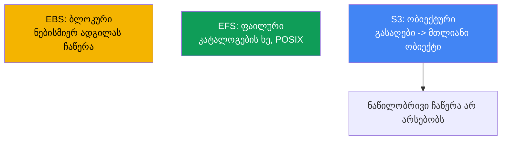
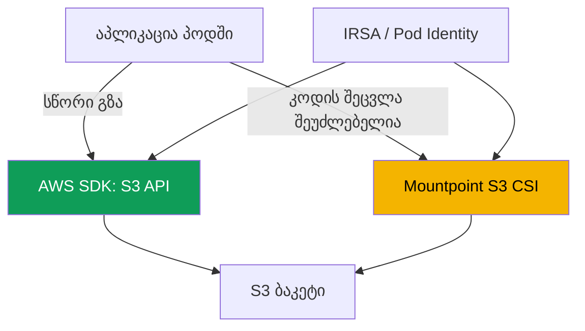

[Русская версия](ru.md) · [Eng version](en.md) · [Versión en español](es.md) · [Version française](fr.md) · [Deutsche Version](de.md) · [繁體中文版](tw.md) · [日本語版](jp.md)
# თავი 25. S3 აპლიკაციებში: Mountpoint for Amazon S3 CSI და წვდომის პატერნები

> **რა არის შემდეგ.** 23-ე თავმა აჩვენა ბლოკური EBS (დისკი ერთ AZ-ში, ერთი ჩამწერი), 24-ე თავმა კი
> ფაილური წვდომა EFS-სა და FSx-ზე (ქსელური NFS, ReadWriteMany ზონებს შორის). ეს თავი მესამე
> კლასს ეხება: S3 ობიექტურ საცავს. მას პრინციპულად განსხვავებული მოდელი აქვს: ის არც დისკია და
> არც ფაილური სისტემა, არამედ გასაღები-მნიშვნელობის საცავია. Mountpoint S3-ის მეშვეობით მისი
> ტომად მონტაჟი შეიძლება, თუმცა შეზღუდვებით, და სწორედ ეს არის თავის მთავარი თემა. ავტორიზაცია
> IRSA-ს ან Pod Identity-ის მეშვეობით განხილულია 16-17 თავებში, FSx for Lustre-ის S3-თან კავშირი
> მიმოხილულია 24-ე თავში, კერძო წვდომა VPC endpoints-ის მეშვეობით - 31-ე თავში, AWS Backup-ით
> ბექაპი კი 41-ე თავში. მათ მხოლოდ მივუთითებთ და აღარ გავიმეორებთ.

## 25.1. „ბაკეტი დისკივით დავამონტაჟეთ, აპლიკაცია კი `rename`-ზე ითიშება“

გუნდს სერვისი EKS-ში გადააქვს. აპლიკაცია დროებით კატალოგში წერდა: ქმნიდა ფაილს `.tmp`
სუფიქსით, ნაწილ-ნაწილ ავსებდა და ბოლოს საბოლოო სახელზე გადაარქმევდა. `rename`-ის მეშვეობით
ატომური ჩაწერის კლასიკური პატერნია. კატალოგის S3-ში შენახვა გადაწყვიტეს, ბაკეტი Mountpoint S3
CSI-ის მეშვეობით დაამონტაჟეს, ტომი აიწია და პოდი გაეშვა. თითქმის მაშინვე შეცდომები დაიწყო:

```bash
kubectl logs uploader-0
# rename('/data/report.tmp', '/data/report.csv'): Function not implemented
```

შემდეგ ვითარება გაუარესდა. სხვა სერვისი ჟურნალში სტრიქონებს `O_APPEND`-ის მეშვეობით ამატებდა
და პირველივე დამატებით ჩაწერაზე შეცდომა მიიღო. მესამე სერვისი კონფიგურაციის შუა ნაწილის
ადგილზევე გადაწერას ცდილობდა:

```bash
kubectl exec app-0 -- sh -c 'echo patched | dd of=/data/config.ini seek=10 conv=notrunc'
# dd: writing '/data/config.ini': Operation not permitted
```

ტომი დამონტაჟებულია და წაკითხვა მუშაობს, მაგრამ ფაილური სისტემისთვის ჩვეული ოპერაციები,
`rename`, `append`, ფაილის შუაში ჩაწერა, შეცდომით სრულდება. ამასთან, მათი errno-ები
**განსხვავებულია**, და ეს პირველივე საყურადღებო ნიშანია: `rename` აბრუნებს `ENOSYS`-ს
(`Function not implemented`), ანუ დრაივერში ასეთი გამოძახება საერთოდ არ არსებობს, ხოლო
`append` და შუაში ჩაწერა აბრუნებს `EPERM`-ს (`Operation not permitted`), ანუ ოპერაცია არსებობს,
მაგრამ აკრძალულია. ეს განსხვავება 25.7-ში გამოგვადგება: `ENOSYS` პარამეტრებით არ სწორდება,
`EPERM` კი ზოგჯერ მონტაჟის ოფციებით გვარდება. ეს არც დრაივერის ბაგია და არც POSIX უფლებების
საკითხი. მიზეზი უფრო ღრმაა: S3 ობიექტური საცავია და არა ფაილური სისტემა. Mountpoint ობიექტებზე
ფაილურ **ინტერფეისს** გვაძლევს, მაგრამ S3-ს POSIX ფაილურ სისტემად არ აქცევს და იმ ოპერაციებს,
რომლებიც ობიექტურ მოდელს არ ერგება, პირდაპირ უარყოფს. განვიხილოთ, რატომ ხდება ასე და როდის არის
Mountpoint საერთოდ მიზანშეწონილი.

## 25.2. ობიექტური, ფაილური და ბლოკური: რატომ არ არის S3 ფაილური სისტემა

S3-ს გასაღები-მნიშვნელობის მოდელი აქვს: ობიექტი უცვლელი მნიშვნელობაა (ბაიტები და მეტამონაცემები)
სტრიქონული გასაღების ქვეშ. მას არც EBS-ის მსგავსი ბლოკური მოწყობილობა აქვს და არც EFS-ის მსგავსი
კატალოგების ხე. აქედან გამომდინარეობს ყველა განსხვავება, რომელიც ფაილური სისტემის მიმართ
მოლოდინებს არღვევს.



Mountpoint-ის გასაგებად მნიშვნელოვანია S3-ის ოთხი თვისება:

- **ნამდვილი კატალოგები არ არსებობს.** გასაღებების სივრცე ბრტყელია. იერარქიის იმიტაცია
  პრეფიქსებით ხდება: გასაღები `logs/2024/app.log` ბილიკივით გამოიყურება, მაგრამ `logs/` და
  `2024/` კატალოგ-ობიექტები კი არა, გასაღები-სტრიქონის ნაწილებია. „კატალოგი“ არსებობს, სანამ
  ასეთი პრეფიქსის მქონე ობიექტი არსებობს.
- **ობიექტი მთლიანია და უცვლელი.** ჩაწერა მთელი ობიექტის `PutObject` ოპერაციაა. შუაში ბაიტების
  შეცვლა, ბოლოში დამატება ან გადაწერის გარეშე სახელის გადარქმევა შეუძლებელია. განახლება ნიშნავს
  იმავე გასაღების ქვეშ ახალ `PutObject`-ს, რომელიც მნიშვნელობას მთლიანად ცვლის.
- **კონსისტენტურობის მოდელი.** S3 უზრუნველყოფს მკაცრ read-after-write კონსისტენტურობას:
  წარმატებული `PutObject`-ის შემდეგ ახალი ობიექტი ყველა კლიენტისთვის დაუყოვნებლივ ჩანს, ხოლო
  წაკითხვა ნაწილობრივ მონაცემებს არ დააბრუნებს.
- **შენახვის კლასები და მეტამონაცემები.** ობიექტს აქვს შენახვის კლასი (Standard,
  Intelligent-Tiering, Glacier და სხვა) და მეტამონაცემები. Glacier-ში მოთავსებული ობიექტები
  წაკითხვამდე უნდა აღდგეს (restore).

25.1-ში ნანახი აკრძალვები სწორედ თვისებიდან „ობიექტი მთლიანია და უცვლელი“ გამომდინარეობს:
ობიექტურ მოდელში `rename`, `append` და ფაილის შუაში ჩაწერა იაფად ვერ ხორციელდება, ამიტომ
Mountpoint მათ ემულაციას არ აკეთებს.

## 25.3. აპლიკაციიდან S3-ზე წვდომის ორი პატერნი

პოდიდან S3-მდე ორი პრინციპულად განსხვავებული გზა მიდის და მათ შორის არჩევანი დრაივერის
პარამეტრებზე უფრო მნიშვნელოვანია. პირველი გზაა S3-თან უშუალოდ API-ით, AWS SDK-ის მეშვეობით
მუშაობა. მეორეა Mountpoint S3 CSI-ის მეშვეობით ბაკეტის ტომად მონტაჟი და მასთან ფაილური სისტემის
ბილიკებით მუშაობა.



**SDK-ის გზა აპლიკაციების უმეტესობისთვის სწორია.** კოდი პირდაპირ იძახებს `PutObject`,
`GetObject`, `ListObjectsV2` ოპერაციებს და ობიექტურ მოდელთან პატიოსნად, ფაილური სისტემის
ილუზიის გარეშე მუშაობს. CSI-დრაივერი და ტომი საჭირო არ არის. ავტორიზაცია IRSA-ს ან EKS Pod
Identity-ის მეშვეობით ხდება (თავები 16-17): პოდი ბაკეტზე წვდომის IAM-როლს იღებს, SDK კი
დროებით გასაღებებს ავტომატურად პოულობს. თუ აპლიკაცია ჯერ მხოლოდ იგეგმება ან მისი გადაკეთება
შესაძლებელია, ეს ნაგულისხმევი არჩევანია.

**Mountpoint-ის გზა** საჭიროა, როცა კოდის SDK-ზე გადაწერა შეუძლებელია: ის ფაილური სისტემის
ბილიკებზე მკაცრად არის დამოკიდებული (მესამე მხარის ბინარული ფაილი, legacy, ინსტრუმენტი, რომელსაც
მხოლოდ დისკიდან ფაილების წაკითხვა შეუძლია). ამ შემთხვევაში ბაკეტი ტომად მონტაჟდება და აპლიკაცია
ობიექტებს ფაილებად ხედავს, თუმცა მხოლოდ 25.5-ში განხილული შეზღუდვების ფარგლებში.

| კრიტერიუმი | AWS SDK (S3 API) | Mountpoint S3 CSI |
|---|---|---|
| მოდელი აპლიკაციისთვის | ობიექტური, რეალური | ფაილური ინტერფეისი ობიექტების თავზე |
| საჭიროა CSI და ტომი | არა | დიახ |
| კოდის შეცვლა | დიახ, SDK-ის გამოძახებები | არა, ბილიკებთან მუშაობა |
| ოპერაციების სისრულე | მთელი S3 API | ფაილური სისტემის ქვესიმრავლე (25.5) |
| როდის ავირჩიოთ | ახალი ან შეცვლადი კოდი | legacy, მხოლოდ ფაილური ბილიკები |

წესი: ჯერ იკითხეთ, შესაძლებელია თუ არა SDK-ის გამოყენება. Mountpoint კომპრომისია იმ შემთხვევისთვის,
როცა აპლიკაციის გადაწერა ფაილური ინტერფეისის შეზღუდვების მიღებაზე ძვირია.

## 25.4. Mountpoint for Amazon S3 CSI driver დეტალურად

დრაივერი აგებულია Mountpoint for Amazon S3-ზე, კლიენტზე, რომელიც ბაკეტის ობიექტებს ფაილური
ინტერფეისით გვაწვდის. კლასტერში ის მუშაობს როგორც CSI პროვიჟიონერით **`s3.csi.aws.com`** და
ყენდება როგორც **managed addon** `aws-mountpoint-s3-csi-driver`:

```bash
aws eks create-addon --cluster-name demo --addon-name aws-mountpoint-s3-csi-driver \
  --service-account-role-arn arn:aws:iam::111122223333:role/AmazonEKS_S3_CSI_DriverRole
```

დრაივერს სჭირდება ბაკეტზე წვდომის IAM-როლი, რომელიც IRSA-ს ან EKS Pod Identity-ის მეშვეობით
გაიცემა (თავები 16-17). Mountpoint-ის რეკომენდაციით მოქმედებების მინიმალური ნაკრებია
`s3:ListBucket` თავად ბაკეტზე და `s3:GetObject`, `s3:PutObject`, `s3:AbortMultipartUpload`
ობიექტებზე; `s3:DeleteObject` საჭიროა მხოლოდ მაშინ, თუ წაშლას უშვებთ. არსებობს მზა managed
პოლიტიკაც `AmazonS3CSIDriverPolicy`. უფლებების გარეშე პოდი მონტაჟზე იჭედება, ოპერაციები კი
`AccessDenied` შეცდომით სრულდება.

ნაგულისხმევად გამოიყენება `authenticationSource: driver`, ანუ მთელი კლასტერი S3-ს დრაივერის
სერვის-აკაუნტის როლით უკავშირდება. მულტიტენანტობისთვის არსებობს `authenticationSource: pod`:
ტომი თავად პოდის სერვის-აკაუნტის როლს იღებს (IRSA ან Pod Identity), ამიტომ სხვადასხვა პოდი
განსხვავებულ წვდომას იღებს.

**მხოლოდ სტატიკური პროვიჟიონინგი.** დინამიკური პროვიჟიონინგი არ არსებობს: დრაივერი ბაკეტებს არ
ქმნის და მათ StorageClass-ის მოთხოვნით არ გასცემს. ბაკეტი წინასწარ იქმნება, PV კი ხელით
აღიწერება. ძირითადი ველები `spec.csi`-შია: `driver`, უნიკალური `volumeHandle` და
`volumeAttributes`-ში `bucketName`; რეგიონი `mountOptions`-ში მიეთითება.

```yaml
apiVersion: v1
kind: PersistentVolume
metadata: {name: s3-pv}
spec:
  capacity: {storage: 1200Gi}     # მნიშვნელობა იგნორირდება, მაგრამ სქემას სჭირდება
  accessModes: ["ReadOnlyMany"]   # ან ReadWriteMany
  storageClassName: ""            # ცარიელია: სტატიკური პროვიჟიონინგი
  claimRef:                       # PV-ის მკაცრი მიბმა კონკრეტულ PVC-ზე
    namespace: default
    name: s3-pvc
  mountOptions:
    - region eu-central-1
  csi:
    driver: s3.csi.aws.com
    volumeHandle: s3-csi-demo-volume   # უნიკალური უნდა იყოს
    volumeAttributes:
      bucketName: amzn-s3-demo-bucket
```

PVC ამ PV-ს სახელით მიმართავს და მასაც ცარიელი `storageClassName` აქვს:

```yaml
apiVersion: v1
kind: PersistentVolumeClaim
metadata: {name: s3-pvc}
spec:
  accessModes: ["ReadOnlyMany"]
  storageClassName: ""
  resources:
    requests: {storage: 1200Gi}   # მნიშვნელობა იგნორირდება
  volumeName: s3-pv
```

| ველი | მდებარეობა | დანიშნულება |
|---|---|---|
| `driver` | `csi` | ყოველთვის `s3.csi.aws.com` |
| `volumeHandle` | `csi` | ტომის უნიკალური ID; დუბლიკატი არ დამუშავდება |
| `bucketName` | `volumeAttributes` | არსებული ბაკეტის სახელი |
| `authenticationSource` | `volumeAttributes` | `driver` (ნაგულისხმევად) ან `pod` |
| `region ...` | `mountOptions` | ბაკეტის რეგიონი |
| `cache` | `volumeAttributes` | ლოკალური კეშის ტიპი: `emptyDir` ან `ephemeral` |
| `metadata-ttl ...` | `mountOptions` | მეტამონაცემების კეშის TTL (წამები/`indefinite`) |
| `storageClassName: ""` | PV და PVC | აუცილებელია სტატიკური პროვიჟიონინგისთვის |

**განმეორებითი წაკითხვის კეში.** Mountpoint-ს მონაცემებისა და ობიექტების მეტამონაცემების კეშირება
შეუძლია, რათა ერთი ფაილის განმეორებითი წაკითხვისას S3-ს თავიდან აღარ მიმართოს, რაც read-heavy
დატვირთვებს აჩქარებს. CSI-დრაივერის v2-ში მონაცემების ლოკალური კეში არა flag-ით, არამედ ტომის
ატრიბუტებით მიეთითება: `cache: emptyDir` კეშს ნოდის ლოკალურ ტომზე ათავსებს, ხოლო
`cacheEmptyDirSizeLimit` მის ზომას ზღუდავს (მითითება აუცილებელია, წინააღმდეგ შემთხვევაში კეში
ნოდის დისკს შეავსებს). `cacheEmptyDirMedium: Memory` კეშს tmpfs-ში (RAM) გადაიტანს, რაც ნოდის
მეხსიერების ხარჯზე დაყოვნებას ამცირებს. მეტამონაცემების კეში ცალკე, `mountOptions`-ის
`metadata-ttl` ოფციით ირთვება. გამოყოფილ ტომზე (EBS ან instance store) კეშისთვის არსებობს ტიპი
`cache: ephemeral` პარამეტრებით `cacheEphemeralStorageClassName` და
`cacheEphemeralStorageResourceRequest`.

```yaml
    volumeAttributes:
      bucketName: amzn-s3-demo-bucket
      cache: emptyDir              # მონაცემების ლოკალური კეში ნოდზე
      cacheEmptyDirSizeLimit: 2Gi  # ლიმიტი აუცილებელია, თორემ კეში მთელ დისკს დაიკავებს
```

v1-ში კეშის ბილიკი `mountOptions`-ის `cache`-ით მიეთითებოდა; v2-ში ეს მოძველებულია, ბილიკი
იგნორირდება და დრაივერი `emptyDir` ტომს თავად ქმნის. კეში მხოლოდ ტომის ატრიბუტებით მიუთითეთ.

წვდომის ტიპური რეჟიმი მრავალი პოდის მიერ dataset-ების წასაკითხად `ReadOnlyMany` არის.
`ReadWriteMany` მხარდაჭერილია, თუმცა 25.5-ის დათქმებით: ერთ ობიექტში პარალელური ჩაწერა არ
კოორდინირდება და ერთ გასაღებში რამდენიმე პოდიდან ერთდროულად ჩაწერა არ შეიძლება.

## 25.5. Mountpoint-ის შეზღუდვები: რა აფუჭებს აპლიკაციებს

ეს საკვანძო განყოფილებაა. Mountpoint შეგნებულად არ აკეთებს იმ ოპერაციების ემულაციას, რომელთა
ობიექტური API-ით შესრულებაც ძვირი იქნებოდა ან რომელთა ანალოგიც S3-ში არ არსებობს. ის **აშკარა
შეცდომით სრულდება** და თავს არ გვაჩვენებს, თითქოს ოპერაცია წარმატებული იყო. ჩვეულებრივი
ბაკეტებისთვის (general purpose) სია ასეთია:

- **ფაილის შუაში ჩაწერა არ არსებობს.** ჩაწერა მხოლოდ მიმდევრობით და ფაილის დასაწყისიდან არის
  შესაძლებელი, რაც არსებითად ახალი ობიექტის შექმნაა. არსებული ობიექტის შიგნით offset-ზე ჩაწერა
  შეცდომაა.
- **არსებულ ობიექტზე `append` არ არსებობს.** ჩვეულებრივ ბაკეტში ბოლოში დამატება მხარდაჭერილი არ
  არის (`append` მხოლოდ S3 Express One Zone-ის directory buckets-ში არსებობს).
- **`rename` / `mv` არ არსებობს.** ჩვეულებრივი ბაკეტის ობიექტების სახელის გადარქმევა საერთოდ არ
  არის მხარდაჭერილი; კატალოგის სახელის გადარქმევა კი არც ერთი ტიპის ბაკეტში არ შეიძლება. სწორედ
  ამან გააფუჭა 25.1-ის სერვისი.
- **hard link და symlink არ არსებობს.**
- **შეზღუდული POSIX სემანტიკა.** `chmod`, `chown` არ მუშაობს: რეჟიმები და მფლობელი ნაგულისხმევი
  მნიშვნელობებია (`0644` ფაილებისთვის, `0755` კატალოგებისთვის), რომელთა შეცვლაც მხოლოდ მონტაჟის
  flag-ებით შეიძლება. extended attributes და POSIX-ბლოკირებები (`lockf`) არ არსებობს.
- **კატალოგები ემულირდება** გასაღებების პრეფიქსებიდან. S3-ში ობიექტებით გამყარებული არსებული
  კატალოგის წაშლა ან სახელის გადარქმევა შეუძლებელია.
- **წაშლა ნაგულისხმევად გამორთულია** და flag-ით ირთვება; ახალი ობიექტის ჩაწერა სხვა კლიენტებისთვის
  მხოლოდ ფაილის დახურვის შემდეგ ხდება ხილული.

| ფაილური სისტემის ოპერაცია | Mountpoint (ჩვეულებრივი ბაკეტი) | მიზეზი |
|---|---|---|
| წაკითხვა, მათ შორის შემთხვევითი | დიახ | `GetObject`, მათ შორის დიაპაზონით |
| ახალი ფაილის შექმნა | დიახ, მიმდევრობით | მთელი ობიექტის `PutObject` |
| არსებულის გადაწერა | მთლიანად, overwrite flag-ით | ახალი `PutObject` იმავე გასაღების ქვეშ |
| შუაში ჩაწერა | არა | ობიექტი უცვლელია |
| `append` | არა (ჩვეულებრივი ბაკეტი) | ნაწილობრივი დამატება არ არსებობს |
| `rename` / `mv` | არა (ჩვეულებრივი ბაკეტი) | S3-ში იაფი ოპერაცია არ არსებობს |
| symlink / hardlink | არა | ობიექტურ მოდელში ანალოგი არ არსებობს |

საექსპლუატაციო დასკვნა: აპლიკაცია, რომელიც ეყრდნობა `rename`, `append`, შუაში ჩაწერას, ფაილის
ბლოკირებებს ან POSIX უფლებების შეცვლას, გადაკეთების გარეშე Mountpoint-ზე ვერ იმუშავებს. ასეთი
დატვირთვების საერთო ფაილური წვდომისთვის საჭიროა EFS (თავი 24) და არა S3.

## 25.6. როდის არის Mountpoint მიზანშეწონილი

Mountpoint ოპტიმიზებულია დიდი ობიექტების წაკითხვის მაღალი ჯამური გამტარუნარიანობისთვის, ჩაწერისას
კი ახალი ობიექტების მიმდევრობით შესაქმნელად. აქედან გამომდინარეობს მისი წარმატებული სცენარები:

- **Read-heavy: ML და ანალიტიკა.** მრავალი პოდი S3-დან დიდ dataset-ებს (მოდელები, parquet,
  მედია) კითხულობს, გამოიყენება `ReadOnlyMany`, წაკითხვა პარალელდება და აპლიკაციას SDK-ზე
  გადაკეთება არ სჭირდება.
- **დიდი სტატიკური ფაილების გავრცელება.** დიდი asset-ების საერთო პული, რომელსაც მხოლოდ
  წასაკითხად მიმართავენ.
- **ლოგები და არტეფაქტები, როგორც მთლიანი ობიექტები.** ამოცანა შედეგს მთლიანად ახალ ობიექტად
  წერს (ანგარიში, dump, build-ის არტეფაქტი), რაც „ახალი ობიექტის შექმნის“ მოდელს ერგება.

Mountpoint არ გამოდგება მონაცემთა ბაზებისთვის და არც ისეთი დატვირთვებისთვის, რომლებიც ფაილებს
ადგილზე ცვლიან, ჟურნალში ამატებენ ან ბლოკირებებს იყენებენ. ცალკე საკითხია S3-ის მონაცემებზე
ინტენსიური პარალელური წვდომა: თუ მხოლოდ ფაილური ინტერფეისი კი არა, იმავე S3 მონაცემებზე მაღალი
წარმადობის POSIX არის საჭირო, ეს **FSx for Lustre**-ის სფეროა (თავი 24), ანუ S3-თან დაკავშირებული
პარალელური ფაილური სისტემის, რომელიც dataset-ზე სწრაფ POSIX-წვდომას გვაძლევს. Mountpoint მსუბუქი
ფაილური ინტერფეისია, Lustre კი HPC-სა და ML-ის წარმადობაზე ორიენტირებული ფაილური სისტემა.

### S3 Express One Zone (directory buckets) Mountpoint-თან

განსაკუთრებული შემთხვევაა **S3 Express One Zone** შენახვის კლასის directory buckets. ეს
ზონალური საცავია: მონაცემები ხელმისაწვდომობის ერთ ზონაში, compute-თან ახლოს ინახება (შესაძლებელია
იმავე AZ-ში EKS ნოდებთან კოლოკაცია), რაც უმცირეს დაყოვნებას და მაღალ IOPS-ს, თითო ბაკეტზე წამში
ასობით ათას მოთხოვნას, გვაძლევს. ამის საფასური ორმაგია. პირველი ზონალურობაა: ერთი AZ დაყოვნების
შემცირებას ემსახურება და არა ზონებს შორის durability-ს, ამიტომ ზონის მწყობრიდან გამოსვლისას
მონაცემები მიუწვდომელია. მეორეა general purpose-თან შედარებით ერთ გიგაბაიტზე შენახვის უფრო მაღალი
ღირებულება. დაგეგმვის შედეგიც არსებობს: ტომი ბაკეტის ზონაზეა მიბმული, ამიტომ მასთან მომუშავე პოდი
იმავე AZ-ში უნდა დარჩეს, წინააღმდეგ შემთხვევაში კოლოკაციის აზრი იკარგება და დაყოვნება იზრდება.
ეს საიმედო გრძელვადიანი შენახვისთვის general purpose S3-ის შემცვლელი არ არის.

Mountpoint-ისთვის directory buckets-ს მნიშვნელოვანი გამონაკლისი აქვს: ისინი მხარს უჭერენ არსებულ
ობიექტზე `append`-ს, რაც ჩვეულებრივ general purpose ბაკეტებში არ არსებობს (25.5). ფაილის ბოლოში
დამატება მუშაობს, ანუ POSIX შეზღუდვების ნაწილი იხსნება. 25.5-ის დანარჩენი აკრძალვები (`rename` და
შუაში ჩაწერა არ არსებობს, symlink არ არსებობს) ძალაში რჩება, რადგან ობიექტური ბუნება არ ქრება.

როდის ავირჩიოთ directory bucket: დაბალი დაყოვნება და მაღალი IOPS კრიტიკულია, მონაცემები კი ზონის
დაკარგვას გადაიტანს, რადგან სხვაგანაც ინახება (საწყისი dataset general purpose S3-შია ან მისი
ხელახლა გენერირება შეიძლება), მაგალითად ML-ის სწავლება, ინტერაქტიული ანალიტიკა, მედიის დამუშავება.
როდის ავირჩიოთ general purpose: საჭიროა ზონებს შორის durability, ერთადერთი ასლის გრძელვადიანი
შენახვა, რამდენიმე AZ-დან წვდომა ან პოდის ერთ ზონაზე მიბმის გარეშე ჩაწერა. Directory bucket ცხელი
მონაცემების ამაჩქარებელია და არა ერთადერთი ასლის შესანახი ადგილი.

## 25.7. ტიპური პრობლემების დიაგნოსტიკა

ოთხი სიტუაცია, რომლებიც ყველაზე ხშირად გვხვდება.

| სიმპტომი | მიზეზი | რა შევამოწმოთ |
|---|---|---|
| პოდი იჭედება, მონტაჟი არ სრულდება | ბაკეტის როლი ან უფლებები არ არსებობს | როლის პოლიტიკა, `AccessDenied` ლოგებში |
| `Function not implemented` `rename`-ზე | დრაივერში გამოძახება არ არსებობს (25.5) | აპლიკაციის ჩაწერის პატერნი |
| `Operation not permitted` `append`-ზე, გადაწერაზე, წაშლაზე | Mountpoint-ის შეზღუდვები და mount options (25.5) | ჩაწერის პატერნი, `allow-overwrite`, `allow-delete` |
| ობიექტებზე წვდომის შეცდომები, ბაკეტი არ იკითხება | ბაკეტის არასწორი რეგიონი | `region` `mountOptions`-ში |
| S3 timeout-ები კერძო subnet-ში | S3-მდე მარშრუტი არ არსებობს | VPC gateway endpoint (თავი 31) |

პირველი არის **უფლებები**. დრაივერის როლი (ან პოდის როლი `authenticationSource: pod`-ის დროს)
ბაკეტზე `s3:ListBucket`-ს, ობიექტებზე კი `s3:GetObject`/`s3:PutObject`-ს უნდა იძლეოდეს. შეამოწმეთ
`kube-system`-ში დრაივერის პოდების ლოგები და `AccessDenied`-ის არსებობა:

```bash
kubectl get pods -n kube-system | grep s3-csi
kubectl logs -n kube-system -l app.kubernetes.io/name=aws-mountpoint-s3-csi-driver
```

მეორე არის **შეცდომა `rename`/`append`/partial write-ზე**. ეს ინფრასტრუქტურული ინციდენტი კი არა,
აპლიკაციის ობიექტურ მოდელთან შეუთავსებლობაა (25.5). დააკვირდით errno-ს: `rename`-ის `ENOSYS`
ნიშნავს, რომ ეს დრაივერში არ არის და არც გამოჩნდება, ხოლო გადაწერისა და წაშლის `EPERM` შეიძლება
მოიხსნას `allow-overwrite` და `allow-delete` ოფციებით, თუ ეს გააზრებული გადაწყვეტილებაა. გამოსავალია
ან SDK-ზე გადასვლა (25.3), ან EFS-ზე გადატანა (თავი 24) და არა დრაივერის პარამეტრის შეცვლა.

მესამე არის **რეგიონი**. ბაკეტი და `mountOptions: region` ერთმანეთს უნდა ემთხვეოდეს; არასწორი
რეგიონი ობიექტებზე წვდომის შეცდომებს იწვევს. მეოთხეა **კერძო წვდომა**: ინტერნეტში გასასვლელის
გარეშე კერძო subnet-ში S3-მდე მარშრუტი **gateway endpoint**-ის (S3-ისთვის Gateway ტიპი)
მეშვეობით არის საჭირო, წინააღმდეგ შემთხვევაში S3 API-ის მოთხოვნები timeout-ით იჭედება. ამასთან,
gateway endpoint S3-ის ტრაფიკს NAT Gateway-ს აცდენს, ამიტომ dataset-ების წაკითხვა NAT-ტრაფიკად
არ ტარიფდება. Endpoints და კერძო ტრაფიკი განხილულია 31-ე თავში.

## 25.8. როგორ იყენებენ ამას production-ში

- **ჯერ SDK, შემდეგ Mountpoint.** ნაგულისხმევად S3-ზე წვდომა AWS SDK-ის მეშვეობით ხდება,
  IRSA/Pod Identity-ის როლით (თავები 16-17). Mountpoint გამოიყენება მხოლოდ მაშინ, როცა კოდის
  SDK-ზე გადაყვანა შეუძლებელია.
- **`ReadOnlyMany` dataset-ებისთვის.** საერთო dataset-ების წასაკითხად ტომს მხოლოდ წაკითხვის
  რეჟიმში ამონტაჟებენ; ეს Mountpoint-ის ყველაზე უსაფრთხო და გავრცელებული რეჟიმია.
- **ბაკეტზე მინიმალური უფლებები.** დრაივერის როლებს მხოლოდ საჭირო მოქმედებებს აძლევენ
  (`s3:ListBucket`, `s3:GetObject`, ჩაწერისას `s3:PutObject`, `s3:AbortMultipartUpload`) და არა
  `AmazonS3FullAccess`-ს.
- **მულტიტენანტობა `authenticationSource: pod`-ის მეშვეობით.** როცა სხვადასხვა პოდს ბაკეტებზე
  განსხვავებული წვდომა სჭირდება, როლს პოდის სერვის-აკაუნტიდან იღებენ და არა საერთო დრაივერიდან.
- **კერძო წვდომა gateway endpoint-ის მეშვეობით.** კერძო subnet-ებში S3-ის ტრაფიკი gateway
  endpoint-ის გავლით მიდის და არა NAT Gateway-ით: წაკითხვა გარეთ არ გადის და NAT-ტრაფიკად არ
  ტარიფდება (თავი 31).
- **ლოკალური კეში განმეორებითი წაკითხვისთვის.** Read-heavy dataset-ებისთვის რთავენ
  `cache: emptyDir`-ს `cacheEmptyDirSizeLimit`-ით: განმეორებითი წაკითხვა ნოდის კეშს მიმართავს და
  არა S3-ს. მეტამონაცემებს `metadata-ttl` აკეშირებს.
- **ბაკეტის ვერსიონირება.** თუ წაშლა ან გადაწერა ჩართულია, Bucket Versioning ობიექტებს შემთხვევითი
  დაკარგვისგან იცავს.

## 25.9. მინი-ლექსიკონი

- **ობიექტური საცავი** - გასაღები-მნიშვნელობის მოდელი: ობიექტი (ბაიტები და მეტამონაცემები)
  სტრიქონული გასაღების ქვეშ, უცვლელი, მთლიანად ახლდება `PutObject`-ის მეშვეობით.
- **Mountpoint for Amazon S3** - კლიენტი, რომელიც ბაკეტის ობიექტებს ფაილური ინტერფეისით
  გვაწვდის; CSI-დრაივერის საფუძველი.
- **Mountpoint S3 CSI-დრაივერი** - `aws-mountpoint-s3-csi-driver`, managed addon პროვიჟიონერით
  `s3.csi.aws.com`; მხოლოდ სტატიკური პროვიჟიონინგი.
- **სტატიკური პროვიჟიონინგი** - PV ხელით აღიწერება `bucketName`-ით; დრაივერს დინამიკური
  პროვიჟიონინგი და ბაკეტების შექმნა არ შეუძლია.
- **`authenticationSource`** - ტომის სააღრიცხვო მონაცემების წყარო: `driver` (დრაივერის საერთო
  როლი) ან `pod` (პოდის სერვის-აკაუნტის როლი).
- **პრეფიქსი** - გასაღების ნაწილი `/`-მდე, რომლისგანაც Mountpoint კატალოგის ემულაციას აკეთებს;
  S3-ში ნამდვილი კატალოგები არ არსებობს.
- **ლოკალური კეში** - Mountpoint-ის მონაცემების კეში ნოდის ტომზე (`cache: emptyDir`/`ephemeral`),
  რომელიც განმეორებით წაკითხვას აჩქარებს; მეტამონაცემების კეში `metadata-ttl`-ით მიეთითება.
- **gateway endpoint** - Gateway ტიპის VPC-endpoint ინტერნეტის გარეშე S3-ზე კერძო წვდომისთვის
  (თავი 31).
- **S3 Express One Zone** - ზონალური შენახვის კლასი (directory buckets) დაბალი დაყოვნებითა და
  მაღალი IOPS-ით ერთ AZ-ში; general purpose ბაკეტებისგან განსხვავებით `append`-ს უჭერს მხარს.

## 25.10. თავის შეჯამება

- S3 ობიექტური საცავია (გასაღები-მნიშვნელობა) და არა ფაილური სისტემა ან ბლოკური დისკი. ობიექტი
  მთლიანია და უცვლელი, ნამდვილი კატალოგები არ არსებობს, იერარქიის იმიტაციას პრეფიქსები აკეთებს.
- აკრძალვები ობიექტური მოდელიდან გამომდინარეობს: ფაილის შუაში ჩაწერა და `rename` არ არსებობს,
  ჩვეულებრივ ბაკეტებში კი არსებულ ობიექტზე `append` შეუძლებელია.
- წვდომის ორი გზა არსებობს: AWS SDK-ის მეშვეობით API-ზე (უმეტესობისთვის სწორი გზა, IRSA ან Pod
  Identity როლით, CSI-ის გარეშე) და Mountpoint S3 CSI-ის ფაილური ინტერფეისით (როცა კოდის SDK-ზე
  გადაწერა შეუძლებელია).
- დრაივერი `s3.csi.aws.com` ყენდება როგორც managed addon `aws-mountpoint-s3-csi-driver`, როლი
  ბაკეტის უფლებებით (`s3:ListBucket`, `s3:GetObject`, `s3:PutObject`,
  `s3:AbortMultipartUpload`) IRSA/Pod Identity-ის მეშვეობით გაიცემა; managed პოლიტიკაა
  `AmazonS3CSIDriverPolicy`. პროვიჟიონინგი მხოლოდ სტატიკურია: PV `volumeAttributes`-ში
  `bucketName`-ით და `storageClassName: ""`-ით.
- Mountpoint-ის შეზღუდვები აშკარა და მკაცრია: არ არსებობს partial write, `rename`, `append`,
  hard/symlink; POSIX შეზღუდულია (`chmod`/`chown` და ბლოკირებები არ არსებობს), კატალოგები
  ემულირდება. ამ ოპერაციებზე დამოკიდებული დატვირთვა Mountpoint-ზე ვერ იმუშავებს.
- Mountpoint გამოდგება read-heavy სცენარებისთვის: ML/ანალიტიკა დიდ dataset-ებს კითხულობს
  (`ReadOnlyMany`), დიდი სტატიკური ფაილები ვრცელდება, ლოგები და არტეფაქტები მთლიანი ობიექტებით
  იწერება. S3-ის მონაცემებზე ინტენსიური პარალელური POSIX-წვდომისთვის გამოიყენება FSx for Lustre
  (თავი 24).
- განმეორებით წაკითხვას აჩქარებს ლოკალური კეში (`cache: emptyDir` პარამეტრით
  `cacheEmptyDirSizeLimit`, `metadata-ttl`), კერძო subnet-იდან S3-ის ტრაფიკი კი gateway endpoint-ით
  NAT Gateway-ის გვერდის ავლით მიდის (თავი 31).
- დიაგნოსტიკა: ბაკეტზე როლის უფლებები (`AccessDenied`), აპლიკაციის შეცდომა `rename`/partial
  write-ზე (შეუთავსებლობა და არა მწყობრიდან გამოსვლა), ბაკეტის რეგიონი, კერძო წვდომა gateway
  endpoint-ის მეშვეობით.

## 25.11. როგორ გამოგადგებათ ეს რეალურ სამუშაოში

მორიგეობისას Mountpoint-ის ინციდენტები ორ ჯგუფად იყოფა. პირველი ინფრასტრუქტურულია: პოდი ტომს ვერ
ამონტაჟებს, დრაივერის ლოგებში `AccessDenied` ჩანს. შეამოწმეთ როლი და მისი უფლებები კონკრეტულ
ბაკეტზე, შემდეგ `mountOptions`-ში რეგიონი და კერძო subnet-იდან S3-მდე მარშრუტი. მეორე, უფრო
მზაკვრული ჯგუფია: აპლიკაცია `rename`-ზე (`Function not implemented`), `append`-ზე ან ფაილის
შუაში ჩაწერაზე (`Operation not permitted`) ითიშება. ეს პარამეტრით არ სწორდება: აპლიკაცია S3-ისგან
POSIX ფაილური სისტემის ქცევას ელის, რომელიც ობიექტურ საცავს არ აქვს. სწორი პასუხია ან კოდის AWS
SDK-ზე გადაყვანა (მაშინ CSI საერთოდ არ არის საჭირო), ან, თუ სრულფასოვანი სემანტიკის მქონე საერთო
ფაილური წვდომა გჭირდებათ, EFS-ის გამოყენება (თავი 24). პროექტირებისას პრიორიტეტი დაიცავით: ჯერ
იკითხეთ, შესაძლებელია თუ არა SDK-ის გამოყენება, და მხოლოდ უარყოფითი პასუხის შემთხვევაში შეაფასეთ,
ეტევა თუ არა დატვირთვა Mountpoint-ის შეზღუდვებში.

## 25.12. თვითშემოწმების კითხვები

1. რით განსხვავდება S3-ის ობიექტური მოდელი ფაილური (EFS) და ბლოკური (EBS) მოდელებისგან?
2. რატომ არ არსებობს S3-ში ნამდვილი კატალოგები და რა არის პრეფიქსი?
3. რატომ არ შეიძლება ჩვეულებრივ ბაკეტში ობიექტის შუაში დამატება ან მისი სახელის გადარქმევა?
4. პოდიდან S3-ზე წვდომის რომელი ორი პატერნი არსებობს და რომელია ნაგულისხმევად სწორი?
5. როდის არის AWS SDK-ის ნაცვლად Mountpoint-ის გამოყენება გამართლებული?
6. რა ჰქვია Mountpoint S3 CSI-დრაივერის managed addon-სა და პროვიჟიონერს?
7. რატომ სჭირდება დრაივერს IAM-როლი და მინიმუმ რომელი მოქმედებები სჭირდება ბაკეტზე?
8. რით განსხვავდება `authenticationSource: driver` და `pod`, და როდის არის საჭირო მეორე?
9. რატომ აქვს Mountpoint-ს მხოლოდ სტატიკური პროვიჟიონინგი და როგორ გამოიყურება ასეთი PV?
10. ფაილური სისტემის რომელ ოპერაციებს არ უჭერს Mountpoint მხარს და რატომ სრულდება ის აშკარა
    შეცდომით და არა ჩუმად?
11. რომელი დატვირთვებისთვის გამოდგება Mountpoint და როდის უნდა გამოიყენოთ მის ნაცვლად EFS ან
    FSx for Lustre?
12. პოდი Mountpoint ტომს ვერ ამონტაჟებს. რომელ მიზეზებს და რა თანმიმდევრობით შეამოწმებთ?
13. რატომ არის კერძო subnet-ში S3-ისთვის gateway endpoint საჭირო და როგორ ზოგავს ის NAT Gateway-ის
    ხარჯს?
14. როგორ ირთვება Mountpoint-ის მონაცემების ლოკალური კეში და რატომ უნდა მიუთითოთ
    `cacheEmptyDirSizeLimit`?
15. რას აძლევს S3 Express One Zone Mountpoint-ს და რა არის ზონალურობის საფასური?

## პრაქტიკა

კურსის ლაბა ამ თემაზე: [ლაბა 129 - Mountpoint for S3: სად ირღვევა ფაილების სემანტიკა და რატომ
არ არსებობს ბექაპი](../../labs/129/README_GE.MD). მასში არის სტატიკური PV რეალურ ბაკეტზე,
წარმატებული ოპერაციები (ახალი ობიექტი და წაკითხვა), შემდეგ კი სამი თანმიმდევრული უარყოფა errno-ს
განხილვით; ბოლოს ახსნილია, რატომ არ აქვს ასეთ PVC-ს სნეპშოტი და რა იცავს მონაცემებს მის ნაცვლად.
შედეგი მოწმდება `check_result` ბრძანებით.

ქვემოთ იგივე მოქმედებებია ნებისმიერ საკუთარ კლასტერზე. ჯერ ბაკეტს AWS-ის მხრიდან შეხედეთ:
`aws s3 ls` ბაკეტებს აჩვენებს, `aws s3 ls s3://<bucket>/ --recursive` კი ობიექტებს და პრეფიქსებით
შექმნილ მათ „ფსევდოკატალოგებს“. დარწმუნდით, რომ დრაივერი დაყენებულია: `aws eks list-addons
--cluster-name <cluster>` და `kubectl get pods -n kube-system | grep s3-csi`.

შემდეგ 25.1-ის პრობლემა გაიმეორეთ. შექმენით სტატიკური PV `driver: s3.csi.aws.com`-ით, თქვენი
ბაკეტის `bucketName`-ით და `mountOptions`-ში `region`-ით, მიაბით PVC და გაუშვით პოდი
`ReadWriteMany`-ით. აიღეთ shell-ისა და უტილიტების მქონე image (`busybox`), წინააღმდეგ შემთხვევაში
`kubectl exec`-ს გასაშვები არაფერი ექნება. პოდში შეამოწმეთ, რომ წაკითხვა და ახალი ფაილის შექმნა
მუშაობს (`kubectl exec ... -- cat /data/<key>` და ახალი გასაღების ჩაწერა), შემდეგ დარწმუნდით, რომ
`mv /data/a /data/b` სრულდება `Function not implemented` შეცდომით, ხოლო დამატებითი ჩაწერა
`echo x >> /data/existing` და `dd ... seek=...`-ით შუაში ჩაწერა სრულდება `Operation not permitted`
შეცდომით. ასევე სცადეთ ფაილის გადაწერა და წაშლა: სანამ `allow-overwrite` და `allow-delete` არ
ჩაგირთავთ, ისინიც `Operation not permitted` შეცდომით დასრულდება. შეადარეთ `ReadOnlyMany`-ს:
იგივე ბაკეტი მხოლოდ წაკითხვის რეჟიმში დაამონტაჟეთ და დარწმუნდით, რომ dataset-ს მრავალი პოდი
კითხულობს. ცალკე შეამოწმეთ უფლებები: დრაივერის როლიდან დროებით ამოიღეთ `s3:GetObject`, თავიდან
შექმენით პოდი და დრაივერის პოდების ლოგებში იპოვეთ `AccessDenied` (`kubectl logs -n kube-system -l
app.kubernetes.io/name=aws-mountpoint-s3-csi-driver`); დააბრუნეთ უფლება და დარწმუნდით, რომ მონტაჟი
წარმატებით სრულდება.

---
[სარჩევი](../README_GE.md) · [თავი 24](../24/ge.md) · [თავი 26](../26/ge.md)
