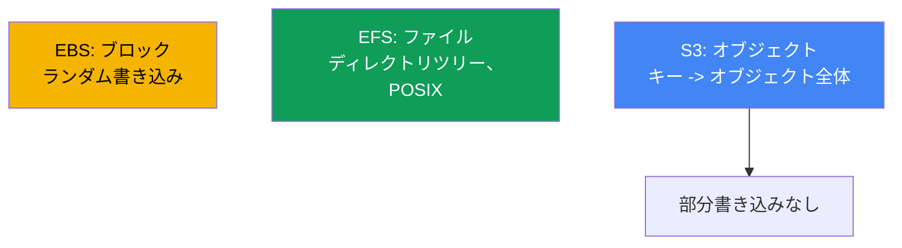
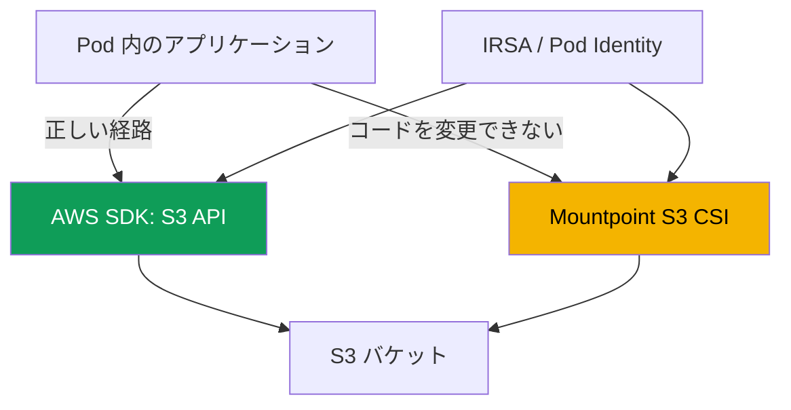

[ロシア語版](ru.md) · [英語版](en.md) · [スペイン語版](es.md) · [フランス語版](fr.md) · [ドイツ語版](de.md) · [ジョージア語版](ge.md) · [繁体字中国語版](tw.md)
# 第25章. アプリケーションでの S3: Mountpoint for Amazon S3 CSI とアクセスパターン

> **次は何か。** 第23章ではブロック EBS（1つの AZ 内のディスク、1ライター）、第24章では
> ファイルアクセスの EFS と FSx（ネットワーク NFS、ゾーン間の ReadWriteMany）を扱いました。この章は第3の
> クラスであるオブジェクトストレージ S3 を扱います。S3 は根本的に異なるモデルです。ディスクでもファイル
> システムでもなく、キー・バリューストアです。Mountpoint S3 を通じてボリュームとしてマウントできますが、
> 制限があり、これがこの章の中心です。IRSA または Pod Identity による認可は第16-17章、S3 と連携する
> FSx for Lustre は第24章で概説済み、VPC endpoints によるプライベートアクセスは第31章、AWS Backup による
> バックアップは第41章です。ここでは繰り返さず、それらを参照します。

## 25.1. 「バケットをディスクとしてマウントしたら、アプリケーションが rename で落ちた」

チームがサービスを EKS に移行しています。アプリケーションは一時ディレクトリに書き込んでいました。`.tmp`
接尾辞を持つファイルを作成し、部分ごとに追記して、最後に最終名へリネームしていました。`rename` による
原子的書き込みの定番です。このディレクトリを S3 に置くことにし、Mountpoint S3 CSI でバケットをマウントしました。
ボリュームは起動し、Pod も開始しました。すると、ほぼ直後にエラーが出始めました。

```bash
kubectl logs uploader-0
# rename('/data/report.tmp', '/data/report.csv'): Function not implemented
```

さらに悪いことに、別のサービスは `O_APPEND` でログに行を追記しており、最初の追記でエラーになりました。
3つ目のサービスは、設定ファイルの途中をインプレースで書き換えようとしました。

```bash
kubectl exec app-0 -- sh -c 'echo patched | dd of=/data/config.ini seek=10 conv=notrunc'
# dd: writing '/data/config.ini': Operation not permitted
```

ボリュームはマウントされ、読み取りは機能するのに、通常のファイルシステム操作である `rename`、`append`、
ファイル途中への書き込みは失敗します。しかも errno は**異なります**。ここが最初に注目すべき点です。
`rename` は `ENOSYS`（`Function not implemented`）を返します。これはドライバーに呼び出し自体がありません。
一方、`append` と途中への書き込みは `EPERM`（`Operation not permitted`）を返します。操作は存在しますが、
禁止されています。この違いは25.7で役に立ちます。`ENOSYS` は設定では直らず、`EPERM` はマウントオプションで
直る場合があります。これはドライバーのバグでも POSIX 権限の問題でもありません。原因はもっと深いものです。
S3 はファイルシステムではなくオブジェクトストレージです。Mountpoint はオブジェクトへのファイル**インターフェース**を
提供しますが、S3 を POSIX ファイルシステムに変換するわけではありません。オブジェクトモデルに適合しないものは、
正直に拒否します。なぜそうなのか、また Mountpoint が適切なのはどのような場合かを見ていきます。

## 25.2. オブジェクト対ファイル・ブロック: なぜ S3 はファイルシステムではないのか

S3 はキー・バリューのモデルです。オブジェクトは、文字列キーの下にある不変の値（バイト列とメタデータ）です。
EBS のようなブロックデバイスも、EFS のようなディレクトリツリーもありません。ここから、ファイルシステムに
期待する動作を壊すすべての相違が生じます。



Mountpoint を理解するうえで重要な S3 の4つの性質です。

- **本物のディレクトリがない。** キー空間はフラットです。階層はプレフィックスで模倣されます。キー
  `logs/2024/app.log` はパスのように見えますが、`logs/` と `2024/` はディレクトリオブジェクトではなく、
  キー文字列の一部です。「ディレクトリ」は、そのプレフィックスを持つオブジェクトが存在する間だけ存在します。
- **オブジェクトは全体で不変。** 書き込みはオブジェクト全体の `PutObject` です。途中のバイトを変更したり、
  末尾に追記したり、再書き込みなしにリネームしたりはできません。更新は、同じキーで新しい `PutObject` を実行して
  値全体を置き換えることです。
- **整合性モデル。** S3 は強い read-after-write 整合性を提供します。成功した `PutObject` の後、新しいオブジェクトは
  直ちにすべてのクライアントから見え、読み取りが部分的なデータを返すことはありません。
- **ストレージクラスとメタデータ。** オブジェクトにはストレージクラス（Standard、
  Intelligent-Tiering、Glacier など）とメタデータがあります。Glacier 内のオブジェクトは読み取り前に
  復元（restore）する必要があります。

25.1 の禁止事項は、まさに「オブジェクトは全体で不変」という性質から生じます。`rename`、`append`、
ファイル途中への書き込みはオブジェクトモデル上で安価に実装できないため、Mountpoint はそれらをエミュレートしません。

## 25.3. アプリケーションから S3 へアクセスする2つのパターン

Pod から S3 へ至る道は根本的に2つあり、その選択はドライバーの設定より重要です。1つ目は AWS SDK を通じて
S3 API を直接使用すること、2つ目は Mountpoint S3 CSI でバケットをボリュームとしてマウントし、ファイル
システムのパスとしてアクセスすることです。



**SDK 経由の経路は、ほとんどのアプリケーションにとって正しい選択です。** コードは `PutObject`、
`GetObject`、`ListObjectsV2` を直接呼び出し、ファイルシステムの幻想なしにオブジェクトモデルを正直に扱います。
CSI ドライバーもボリュームも必要ありません。認可は IRSA または EKS Pod Identity（第16-17章）で行います。
Pod はバケットへのアクセスを持つ IAM ロールを取得し、SDK は一時的な認証情報を自動的に取得します。
アプリケーションをこれから設計する、または変更できるなら、これがデフォルトの選択です。

**Mountpoint 経由の経路**は、SDK 向けにコードを書き換えられない場合に必要です。ファイルシステムのパスを
固定的に扱うもの（サードパーティのバイナリ、レガシー、ディスク上のファイルしか読めないツール）が該当します。
この場合、バケットをボリュームとしてマウントし、アプリケーションは25.5の制限の範囲でオブジェクトを
ファイルとして見ます。

| 基準 | AWS SDK (S3 API) | Mountpoint S3 CSI |
|---|---|---|
| アプリケーション向けモデル | オブジェクト、正直なモデル | オブジェクト上のファイルインターフェース |
| CSI とボリュームが必要か | いいえ | はい |
| コード変更 | はい、SDK 呼び出し | 不要、パスを操作 |
| 操作の完全性 | S3 API 全体 | ファイルシステムの部分集合（25.5） |
| 選ぶとき | 新規または変更可能なコード | レガシー、ファイルシステムのパスのみ |

ルールは、まず SDK 経由にできるかを問うことです。Mountpoint は、アプリケーションの書き換えよりもファイル
インターフェースの制限を受け入れるコストが低い場合の妥協策です。

## 25.4. Mountpoint for Amazon S3 CSI driver の詳細

このドライバーは Mountpoint for Amazon S3、すなわちバケットのオブジェクトをファイルインターフェースで
提供するクライアント上に構築されています。クラスター内では、プロビジョナー **`s3.csi.aws.com`** を持つ CSI として
動作し、**managed addon** の `aws-mountpoint-s3-csi-driver` としてインストールされます。

```bash
aws eks create-addon --cluster-name demo --addon-name aws-mountpoint-s3-csi-driver \
  --service-account-role-arn arn:aws:iam::111122223333:role/AmazonEKS_S3_CSI_DriverRole
```

ドライバーには、IRSA または EKS Pod Identity（第16-17章）で付与したバケットへのアクセス権を持つ IAM ロールが
必要です。Mountpoint の推奨における最小アクションセットは、バケット自体への `s3:ListBucket`、オブジェクトへの
`s3:GetObject`、`s3:PutObject`、`s3:AbortMultipartUpload` です。削除を許可する場合にのみ `s3:DeleteObject` を
追加します。用意された managed ポリシー `AmazonS3CSIDriverPolicy` もあります。権限がないと、Pod はマウント中に
停止するか、操作が `AccessDenied` で失敗します。

デフォルトでは `authenticationSource: driver` が使われます。クラスター全体がドライバーのサービスアカウントの
ロールで S3 にアクセスします。マルチテナンシーには `authenticationSource: pod` があり、ボリュームは Pod 自身の
サービスアカウントのロール（IRSA または Pod Identity）を使うため、異なる Pod に異なるアクセス権を付与できます。

**静的プロビジョニングのみです。** 動的プロビジョニングはありません。ドライバーはバケットを作成せず、
StorageClass 経由で提供もしません。バケットは事前に作成し、PV を手動で記述します。主なフィールドは
`spec.csi` の `driver`、一意の `volumeHandle`、`volumeAttributes` の `bucketName` です。リージョンは
`mountOptions` で設定します。

```yaml
apiVersion: v1
kind: PersistentVolume
metadata: {name: s3-pv}
spec:
  capacity: {storage: 1200Gi}     # 値は無視されるが、スキーマで必須
  accessModes: ["ReadOnlyMany"]   # または ReadWriteMany
  storageClassName: ""            # 空: 静的プロビジョニング
  claimRef:                       # PV を特定の PVC に固定バインド
    namespace: default
    name: s3-pvc
  mountOptions:
    - region eu-central-1
  csi:
    driver: s3.csi.aws.com
    volumeHandle: s3-csi-demo-volume   # 一意でなければならない
    volumeAttributes:
      bucketName: amzn-s3-demo-bucket
```

PVC は名前でこの PV を参照し、同じく空の `storageClassName` を使用します。

```yaml
apiVersion: v1
kind: PersistentVolumeClaim
metadata: {name: s3-pvc}
spec:
  accessModes: ["ReadOnlyMany"]
  storageClassName: ""
  resources:
    requests: {storage: 1200Gi}   # 値は無視される
  volumeName: s3-pv
```

| フィールド | 場所 | 目的 |
|---|---|---|
| `driver` | `csi` | 常に `s3.csi.aws.com` |
| `volumeHandle` | `csi` | 一意のボリューム ID。重複は処理されない |
| `bucketName` | `volumeAttributes` | 既存バケットの名前 |
| `authenticationSource` | `volumeAttributes` | `driver`（デフォルト）または `pod` |
| `region ...` | `mountOptions` | バケットのリージョン |
| `cache` | `volumeAttributes` | ローカルキャッシュの種類: `emptyDir` または `ephemeral` |
| `metadata-ttl ...` | `mountOptions` | メタデータキャッシュの TTL（秒/`indefinite`） |
| `storageClassName: ""` | PV と PVC | 静的方式で必須 |

**再読み取りキャッシュ。** Mountpoint はオブジェクトのデータとメタデータをキャッシュできるため、同一ファイルへの
再読み取りで毎回 S3 にアクセスする必要がなくなり、read-heavy ワークロードを高速化します。CSI ドライバー v2 では、
ローカルデータキャッシュはフラグではなくボリューム属性で設定します。`cache: emptyDir` はキャッシュをノードの
ローカルボリュームに置き、`cacheEmptyDirSizeLimit` はそのサイズを制限します（必ず設定します。設定しないと
キャッシュがノードディスクを使い尽くします）。`cacheEmptyDirMedium: Memory` は、ノードメモリを使う代わりに
低レイテンシーを実現するため、キャッシュを tmpfs (RAM) に置きます。メタデータキャッシュは別途、`mountOptions` の
`metadata-ttl` オプションで有効にします。専用ボリューム（EBS または instance store）のキャッシュには、
`cache: ephemeral` と `cacheEphemeralStorageClassName`、`cacheEphemeralStorageResourceRequest` を使います。

```yaml
    volumeAttributes:
      bucketName: amzn-s3-demo-bucket
      cache: emptyDir              # ノード上のローカルデータキャッシュ
      cacheEmptyDirSizeLimit: 2Gi  # 必須の上限。なければキャッシュがディスク全体を占有
```

v1 ではキャッシュを `mountOptions` の `cache` でパスとして設定しました。v2 ではこれは非推奨で、パスは無視され、
ドライバーが `emptyDir` ボリュームを自動作成します。キャッシュはボリューム属性だけで指定してください。

典型的なアクセスモードは、多数の Pod がデータセットを読むための `ReadOnlyMany` です。`ReadWriteMany` も
サポートされますが、25.5の注意点があります。同じオブジェクトへの並行書き込みは調整されないため、複数の Pod から
同時に1つのキーへ書き込むことはできません。

## 25.5. Mountpoint の制限: アプリケーションを壊すもの

ここが重要な節です。Mountpoint は、オブジェクト API 上で高コストになる操作や S3 に対応物がない操作を、
意図的にエミュレートしません。操作が成功したふりをせず、**明示的に失敗します**。通常のバケット（general purpose）では、
一覧は次のとおりです。

- **ファイル途中への書き込みはない。** 書き込みはファイル先頭からの逐次書き込みだけです。実質的には、新しい
  オブジェクトを構成することです。既存オブジェクトの内部オフセットはエラーになります。
- **既存オブジェクトへの `append` はない。** 通常のバケットでは末尾への追記はサポートされません（append は
  S3 Express One Zone の directory buckets でのみ使用できます）。
- **`rename` / `mv` はない。** 通常のバケットのオブジェクトのリネームはまったくサポートされません。
  ディレクトリのリネームはいかなるバケットタイプでもサポートされません。これが25.1のサービスを壊した操作です。
- **hard link と symlink はない。**
- **限定された POSIX セマンティクス。** `chmod`、`chown` は機能しません。モードと所有者はデフォルト値
  （ファイルは `0644`、ディレクトリは `0755`）であり、マウント時のフラグでしか変更できません。extended attributes も
  POSIX ロック（`lockf`）もありません。
- **ディレクトリはエミュレートされる**もので、キーのプレフィックスから作られます。S3 内のオブジェクトによって
  裏付けられている既存ディレクトリは、削除もリネームもできません。
- **削除はデフォルトで無効**であり、フラグで有効化します。新しいオブジェクトへの書き込みは、ファイルを閉じた後にのみ
  他のクライアントに見えます。

| ファイルシステム操作 | Mountpoint（通常のバケット） | 理由 |
|---|---|---|
| 読み取り、ランダムアクセスを含む | はい | `GetObject`、範囲指定を含む |
| 新規ファイル作成 | はい、逐次的に | オブジェクト全体の `PutObject` |
| 既存ファイルの上書き | 全体、overwrite フラグ付き | 同じキーへの新しい `PutObject` |
| 途中への書き込み | いいえ | オブジェクトは不変 |
| `append` | いいえ（通常のバケット） | 部分追記がない |
| `rename` / `mv` | いいえ（通常のバケット） | S3 に安価な操作がない |
| symlink / hardlink | いいえ | オブジェクトモデルに対応物がない |

運用上の結論です。`rename`、`append`、途中への書き込み、ファイルロック、POSIX 権限の変更に依存する
アプリケーションは、作り直さずに Mountpoint で動作しません。このような共有ファイルアクセスのワークロードには、
S3 ではなく EFS（第24章）を使います。

## 25.6. Mountpoint が適切な場合

Mountpoint は大きなオブジェクトの読み取りにおける高い合計スループットと、書き込みでは新しいオブジェクトの
逐次作成に最適化されています。ここから、適したシナリオが導かれます。

- **Read-heavy: ML と分析。** 多くの Pod が S3 の大きなデータセット（モデル、Parquet、メディア）を読みます。
  `ReadOnlyMany` を使い、読み取りは並列化され、アプリケーションを SDK 向けに変更する必要がありません。
- **大きな静的ファイルの配信。** 読み取り専用でアクセスする、大きなアセットの共有プールです。
- **オブジェクト全体としてのログとアーティファクト。** ジョブが結果（レポート、ダンプ、ビルドアーティファクト）を
  新しいオブジェクトとして丸ごと書き込みます。これは「新しいオブジェクトを作る」モデルに適合します。

Mountpoint が適さないのは、データベース、インプレースでのファイル変更、ログへの追記、ロックを伴うあらゆる
ワークロードです。S3 からのデータへの高頻度な並行アクセスについては、単なるファイルインターフェースではなく、
同じ S3 データ上で高性能な POSIX が必要なら、**FSx for Lustre**（第24章）の領域です。これは S3 と連携し、
データセットへの高速 POSIX アクセスを提供する並列ファイルシステムです。Mountpoint は軽量なファイル
インターフェース、Lustre は HPC と ML 向けの高性能ファイルシステムです。

### Mountpoint による S3 Express One Zone (directory buckets)

特別なケースが、ストレージクラス **S3 Express One Zone** の directory buckets です。これはゾーン型ストレージです。
データは compute の近くの1つのアベイラビリティーゾーンにあり（同じ AZ の EKS ノードとコロケーション可能）、
最小のレイテンシーと高い IOPS、バケットごとに毎秒数十万リクエストを実現します。その代償は2つあります。
第一にゾーン性です。1つの AZ は低レイテンシーのためであり、ゾーン間の durability のためではありません。ゾーンが
障害になるとデータにアクセスできません。第二に、ギガバイトあたりのストレージコストは general purpose より高くなります。
スケジューリング上の帰結もあります。ボリュームはバケットのゾーンに結び付くため、Pod は同じ AZ に置きます。
そうでなければコロケーションの意味が失われ、レイテンシーが増えます。これは信頼できる長期ストレージのための
general purpose S3 の代替ではありません。

Mountpoint では、directory buckets に重要な緩和があります。通常の general purpose バケットにない既存オブジェクトへの
`append` をサポートします（25.5）。ファイル末尾への追記は機能するため、POSIX の制限の一部が取り除かれます。
25.5 の他の禁止事項（`rename` なし、途中への書き込みなし、symlink なし）は残ります。オブジェクトとしての性質は
変わらないためです。

低レイテンシーと高 IOPS が重要で、データが別の場所にも存在するためゾーン喪失に耐えられる場合に directory bucket を
選びます（general purpose S3 に元データセットがある、再生成できるなど）。ML トレーニング、インタラクティブな分析、
メディア処理が該当します。ゾーン間の durability、唯一のコピーの長期保管、複数 AZ からのアクセス、または Pod を
1つのゾーンに縛らない書き込みが必要なら general purpose を選びます。Directory bucket はホットデータのアクセラレーターであり、
唯一のコピーを置く場所ではありません。

## 25.7. 典型的な問題の診断

最もよく遭遇する4つの状況です。

| 症状 | 原因 | 確認すること |
|---|---|---|
| Pod が停止し、マウントが進まない | バケットへのロールまたは権限がない | ロールポリシー、ログの `AccessDenied` |
| `rename` で `Function not implemented` | ドライバーに呼び出しがない（25.5） | アプリケーションの書き込みパターン |
| `append`、上書き、削除で `Operation not permitted` | Mountpoint の制限と mount options（25.5） | 書き込みパターン、`allow-overwrite`、`allow-delete` |
| オブジェクトアクセスのエラー、バケットを読めない | バケットのリージョンが違う | `mountOptions` の `region` |
| プライベートサブネットから S3 へのタイムアウト | S3 へのルートがない | VPC gateway endpoint（第31章） |

最初は**権限**です。ドライバーのロール（または `authenticationSource: pod` 時の Pod のロール）は、バケットへの
`s3:ListBucket` と、オブジェクトへの `s3:GetObject`/`s3:PutObject` を許可する必要があります。`kube-system` の
ドライバー Pod のログと `AccessDenied` の存在を確認します。

```bash
kubectl get pods -n kube-system | grep s3-csi
kubectl logs -n kube-system -l app.kubernetes.io/name=aws-mountpoint-s3-csi-driver
```

2つ目は**`rename`/`append`/partial write での失敗**です。これはインフラストラクチャのインシデントではなく、
アプリケーションとオブジェクトモデルの非互換性です（25.5）。errno を確認してください。`rename` の `ENOSYS` は
「ドライバーに存在せず、今後も追加されない」ことを意味します。上書きと削除の `EPERM` は、意識的な判断であれば
`allow-overwrite` と `allow-delete` オプションで解除できます。解決策は SDK への移行（25.3）または EFS（第24章）への
移行であり、ドライバー設定ではありません。

3つ目は**リージョン**です。バケットと `mountOptions: region` は一致しなければなりません。リージョンが違うと
オブジェクトアクセスエラーになります。4つ目は**プライベートアクセス**です。インターネット出口のないプライベート
サブネットには、S3 へのルートとして **gateway endpoint**（S3 用の Gateway タイプ）が必要です。なければ S3 API への
リクエストはタイムアウトで停止します。また gateway endpoint は S3 トラフィックを NAT Gateway から外すため、
データセットの読み取りは NAT トラフィックとして課金されません。Endpoints とプライベートトラフィックは第31章を参照してください。

## 25.8. 本番環境での適用方法

- **最初に SDK、次に Mountpoint。** デフォルトでは、S3 には IRSA/Pod Identity（第16-17章）のロールを持つ AWS SDK
  経由でアクセスします。Mountpoint はコードを SDK に移せない場合だけ選びます。
- **データセットには `ReadOnlyMany`。** 共有データセットを読むためのボリュームは読み取り専用でマウントします。
  これは Mountpoint で最も安全かつ頻繁に使われるモードです。
- **バケットに最小権限。** ドライバーのロールには、`AmazonS3FullAccess` ではなく必要な操作だけ
  （`s3:ListBucket`、`s3:GetObject`、書き込み時は `s3:PutObject`、`s3:AbortMultipartUpload`）を付与します。
- **`authenticationSource: pod` によるマルチテナンシー。** 異なる Pod に異なるバケットアクセスが必要な場合、
  共通のドライバーロールではなく Pod のサービスアカウントのロールを使います。
- **gateway endpoint によるプライベートアクセス。** プライベートサブネットでは S3 トラフィックを NAT Gateway
  ではなく gateway endpoint に通します。読み取りは外部に出ず、NAT トラフィックとして課金されません（第31章）。
- **再読み取りにはローカルキャッシュ。** read-heavy のデータセットには `cache: emptyDir` と
  `cacheEmptyDirSizeLimit` を有効にします。再読み取りは S3 ではなくノードキャッシュにヒットします。メタデータは
  `metadata-ttl` がキャッシュします。
- **バケットのバージョニング。** 削除または上書きを有効にする場合、Bucket Versioning はオブジェクトの誤消失から
  保護します。

## 25.9. ミニ用語集

- **オブジェクトストレージ**: 文字列キーの下にオブジェクト（バイト列とメタデータ）を置くキー・バリューモデルです。
  オブジェクトは不変であり、`PutObject` により全体を更新します。
- **Mountpoint for Amazon S3**: バケットのオブジェクトをファイルインターフェースで提供するクライアントです。
  CSI ドライバーの基盤です。
- **Mountpoint S3 CSI driver**: `aws-mountpoint-s3-csi-driver`、プロビジョナー `s3.csi.aws.com` を持つ managed addon です。
  静的プロビジョニングのみです。
- **静的プロビジョニング**: PV を `bucketName` とともに手動で記述する方式です。ドライバーには動的プロビジョニングも
  バケット作成もありません。
- **`authenticationSource`**: ボリュームの認証情報のソースです。`driver`（共有ドライバーロール）または `pod`
  （サービスアカウントのロール）です。
- **プレフィックス**: Mountpoint がディレクトリをエミュレートする、`/` より前のキーの部分です。S3 に本物の
  ディレクトリはありません。
- **ローカルキャッシュ**: ノードボリューム上の Mountpoint データキャッシュ（`cache: emptyDir`/`ephemeral`）です。
  再読み取りを高速化します。メタデータキャッシュは `metadata-ttl` で設定します。
- **gateway endpoint**: インターネットなしに S3 へプライベートアクセスする Gateway タイプの VPC endpoint です（第31章）。
- **S3 Express One Zone**: 1つの AZ で低レイテンシーと高 IOPS を提供するゾーン型ストレージクラス（directory buckets）です。
  general purpose バケットと異なり `append` をサポートします。

## 25.10. 章のまとめ

- S3 はファイルシステムでもブロックディスクでもなく、オブジェクトストレージ（キー・バリュー）です。オブジェクトは
  全体で不変であり、本物のディレクトリはなく、階層はプレフィックスで模倣します。
- オブジェクトモデルから制限が生じます。ファイル途中への書き込み、`rename`、通常のバケットで既存オブジェクトへの
  `append` はありません。
- アクセスには2つの経路があります。API を通じた AWS SDK（大半に正しく、IRSA または Pod Identity のロールを使用し、
  CSI は不要）と、Mountpoint S3 CSI のファイルインターフェース（SDK 向けにコードを書き換えられない場合）です。
- ドライバー `s3.csi.aws.com` は managed addon `aws-mountpoint-s3-csi-driver` としてインストールします。IRSA/Pod Identity
  経由のロールには、バケットに対する `s3:ListBucket`、`s3:GetObject`、`s3:PutObject`、`s3:AbortMultipartUpload` の権限と、
  managed ポリシー `AmazonS3CSIDriverPolicy` があります。プロビジョニングは静的のみで、PV の `volumeAttributes` に
  `bucketName`、`storageClassName: ""` を指定します。
- Mountpoint の制限は正直で厳格です。partial write、`rename`、`append`、hard/symlink はなく、POSIX は限定的です
  （`chmod`/`chown`、ロックなし）。ディレクトリはエミュレートされます。これらの操作に依存するワークロードは
  Mountpoint で動作しません。
- 適しているのは read-heavy です。ML/分析で大きなデータセットを読む（`ReadOnlyMany`）、大きな静的ファイルを配信する、
  ログとアーティファクトをオブジェクト全体として書き込む場合です。S3 データへの集中的な並列 POSIX アクセスには
  FSx for Lustre（第24章）を使います。
- 再読み取りはローカルキャッシュ（`cache: emptyDir` と `cacheEmptyDirSizeLimit`、`metadata-ttl`）で高速化し、プライベート
  サブネットからの S3 トラフィックは NAT Gateway を経由せず gateway endpoint に送ります（第31章）。
- 診断対象は、バケットに対するロールの権限（`AccessDenied`）、アプリケーションの `rename`/partial write での失敗
  （障害ではなく非互換性）、バケットリージョン、gateway endpoint によるプライベートアクセスです。

## 25.11. 実務での役立て方

オンコール時の Mountpoint インシデントは2つのグループに分かれます。1つ目はインフラストラクチャです。Pod が
ボリュームをマウントせず、ドライバーのログに `AccessDenied` がある場合、特定のバケットに対するロールと権限を確認し、
次に `mountOptions` のリージョンとプライベートサブネット内の S3 へのルートを確認します。2つ目の、より厄介な
グループは、アプリケーションが `rename`（`Function not implemented`）、`append`、またはファイル途中への書き込み
（`Operation not permitted`）で落ちることです。これは設定では直りません。アプリケーションが S3 に、オブジェクト
ストレージにはない POSIX ファイルシステムの振る舞いを期待しています。正しい答えは、コードを AWS SDK に移す
（その場合 CSI は不要）か、完全なセマンティクスを持つ共有ファイルアクセスが必要なら EFS（第24章）を選ぶことです。
設計時の優先順位を守ってください。まず SDK 経由にできるかを問い、できない場合だけ、ワークロードが Mountpoint の
制限に収まるかを評価します。

## 25.12. 理解度チェックの質問

1. S3 のオブジェクトモデルは、ファイル（EFS）およびブロック（EBS）モデルとどう異なりますか？
2. S3 に本物のディレクトリがないのはなぜですか？ プレフィックスとは何ですか？
3. 通常のバケットでオブジェクトの途中に追記したり、リネームしたりできないのはなぜですか？
4. Pod から S3 にアクセスする2つのパターンは何ですか？ デフォルトで正しいのはどちらですか？
5. AWS SDK 経由のアクセスではなく Mountpoint が正当化されるのはいつですか？
6. Mountpoint S3 CSI ドライバーの managed addon とプロビジョナーの名前は何ですか？
7. ドライバーに IAM ロールが必要なのはなぜですか？ バケットに必要な最小アクションは何ですか？
8. `authenticationSource: driver` と `pod` はどう異なり、後者はいつ必要ですか？
9. Mountpoint が静的プロビジョニングのみなのはなぜですか？ そのような PV はどのようなものですか？
10. Mountpoint がサポートしないファイルシステム操作は何ですか？ なぜ黙ってではなく明示的に失敗しますか？
11. Mountpoint が適したワークロードは何ですか？ どのような場合に代わりに EFS または FSx for Lustre を使いますか？
12. Pod が Mountpoint ボリュームをマウントしません。どの原因をどの順番で確認しますか？
13. プライベートサブネットで S3 用 gateway endpoint が必要なのはなぜですか？ NAT Gateway のコストをどう節約しますか？
14. Mountpoint のローカルデータキャッシュを有効にするにはどうしますか？ `cacheEmptyDirSizeLimit` を設定するのはなぜですか？
15. S3 Express One Zone は Mountpoint に何をもたらし、ゾーン性の代償は何ですか？

## 実践

このトピックに対応するコースラボ: [ラボ129 - Mountpoint for S3: ファイルセマンティクスが壊れる場所と、なぜ
バックアップがないのか](../../labs/129/README_JP.MD)。実在するバケット上の静的 PV、成功する操作（新規オブジェクトと
読み取り）、errno を分析する3つの連続した失敗、そして最後に、この PVC にスナップショットがなく、代わりに何がデータを
保護するかを扱います。結果は `check_result` コマンドで検証します。

以下は、自分の任意のクラスターで同じことを行う手順です。まず AWS 側からバケットを確認します。`aws s3 ls` は
バケットを表示し、`aws s3 ls s3://<bucket>/ --recursive` はオブジェクトとプレフィックスによる「疑似ディレクトリ」を
表示します。ドライバーがインストール済みであることを確認してください。`aws eks list-addons
--cluster-name <cluster>` と `kubectl get pods -n kube-system | grep s3-csi` を使います。

次に、25.1 の問題を再現します。`driver: s3.csi.aws.com`、自分のバケットの `bucketName`、`mountOptions` の `region` を
持つ静的 PV を作成し、PVC をバインドして `ReadWriteMany` の Pod を起動します。シェルとユーティリティを含む
イメージ（`busybox`）を使ってください。そうしないと `kubectl exec` で実行するものがありません。Pod 内で、読み取りと
新規ファイル作成が機能すること（`kubectl exec ... -- cat /data/<key>` と新しいキーへの書き込み）を確認し、次に
`mv /data/a /data/b` が `Function not implemented` で失敗し、追記 `echo x >> /data/existing` と
`dd ... seek=...` による途中への書き込みが `Operation not permitted` で失敗することを確認します。さらにファイルの
上書きと削除も試してください。`allow-overwrite` と `allow-delete` を有効にするまで、これらも `Operation not permitted`
になります。`ReadOnlyMany` と比較します。同じバケットを読み取り専用でマウントし、多くの Pod からデータセットを
読めることを確認します。権限も個別に確認してください。ドライバーロールから一時的に `s3:GetObject` を外し、Pod を
再作成して、ドライバー Pod のログで `AccessDenied` を見つけます（`kubectl logs -n kube-system -l
app.kubernetes.io/name=aws-mountpoint-s3-csi-driver`）。権限を戻し、マウントが成功することを確認します。

---
[目次](../README_JP.md) · [第24章](../24/jp.md) · [第26章](../26/jp.md)
