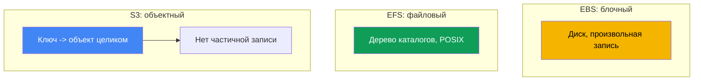
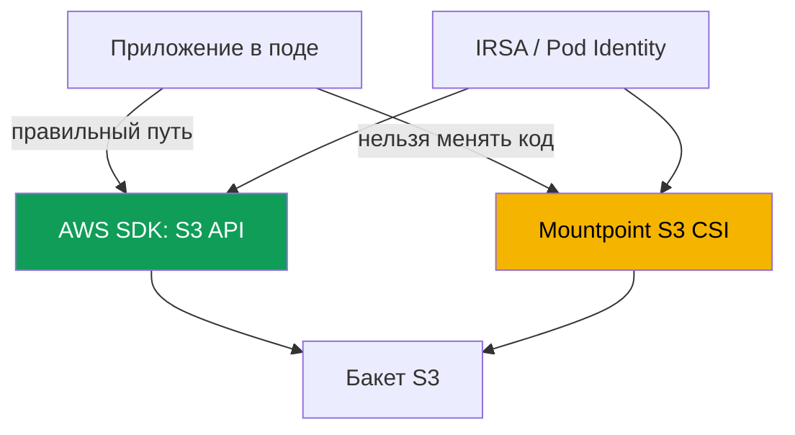

# Глава 25. S3 в приложениях: Mountpoint for Amazon S3 CSI и паттерны доступа

> **Что дальше.** Глава 23 показала блочный EBS (диск в одной AZ, один писатель), глава 24 -
> файловый доступ EFS и FSx (сетевой NFS, ReadWriteMany между зонами). Эта глава - про третий
> класс: объектное хранилище S3. У него принципиально другая модель: не диск и не файловая
> система, а хранилище ключ-значение. Через Mountpoint S3 его можно смонтировать как том, но с
> ограничениями, и это ядро главы. Авторизация через IRSA или Pod Identity - главы 16-17, FSx
> for Lustre со связкой с S3 обзорно разобран в главе 24, приватный доступ через VPC endpoints
> - глава 31, бэкап через AWS Backup - глава 41. На них ссылаемся, не повторяя.

## 25.1. «Смонтировали бакет как диск, а приложение падает на rename»

Команда переносит сервис в EKS. Приложение писало во временный каталог: создавало файл с
суффиксом `.tmp`, дописывало в него частями, в конце переименовывало в финальное имя. Классика
атомарной записи через `rename`. Каталог решили держать в S3 - смонтировали бакет через
Mountpoint S3 CSI, том поднялся, под стартовал. И почти сразу пошли ошибки:

```bash
kubectl logs uploader-0
# rename('/data/report.tmp', '/data/report.csv'): Operation not permitted
```

Дальше - хуже. Другой сервис дописывал строки в журнал через `O_APPEND` и получил ошибку при
первой же дозаписи. Третий пытался переписать середину конфига на месте:

```bash
kubectl exec app-0 -- sh -c 'echo patched | dd of=/data/config.ini seek=10 conv=notrunc'
# dd: writing '/data/config.ini': Operation not permitted
```

Том смонтирован, чтение работает, а привычные операции ФС - `rename`, `append`, запись в
середину файла - валятся с `Operation not permitted`. Это не баг драйвера и не вопрос прав
POSIX. Причина глубже: S3 - объектное хранилище, а не файловая система. Mountpoint даёт
файловый **интерфейс** к объектам, но не превращает S3 в POSIX-ФС, и то, что не ложится на
объектную модель, он честно отклоняет. Разберём, почему так, и когда Mountpoint вообще уместен.

## 25.2. Объектное против файлового и блочного: почему S3 не ФС

У S3 модель ключ-значение: объект - это неизменяемое значение (байты плюс метаданные) под
ключом-строкой. Нет ни блочного устройства, как у EBS, ни дерева каталогов, как у EFS. Отсюда
все различия, которые ломают ожидания от файловой системы.



Четыре свойства S3, важные для понимания Mountpoint:

- **Нет настоящих каталогов.** Пространство ключей плоское. Иерархию имитируют префиксы: ключ
  `logs/2024/app.log` выглядит как путь, но `logs/` и `2024/` - не объекты-каталоги, а часть
  строки-ключа. «Каталог» существует, пока есть объект с таким префиксом.
- **Объект целен и неизменяем.** Запись - это `PutObject` целого объекта. Нельзя изменить байты
  в середине, дописать в конец или переименовать без перезаписи. Обновление = новый `PutObject`
  под тем же ключом, заменяющий значение целиком.
- **Модель консистентности.** S3 даёт строгую read-after-write консистентность: новый объект
  сразу виден всем клиентам после успешного `PutObject`, чтение не вернёт частичных данных.
- **Классы хранения и метаданные.** У объекта есть класс хранения (Standard,
  Intelligent-Tiering, Glacier и другие) и метаданные. Объекты в Glacier до чтения надо
  восстановить (restore).

Именно из «объект целен и неизменяем» растут запреты из 25.1: `rename`, `append` и запись в
середину файла на объектной модели дёшево не реализуются, поэтому Mountpoint их не эмулирует.

## 25.3. Два паттерна доступа к S3 из приложения

К S3 из пода ведут две принципиально разные дороги, и выбор между ними важнее, чем настройки
драйвера. Первая - работать с S3 напрямую по API через AWS SDK. Вторая - смонтировать бакет как
том через Mountpoint S3 CSI и обращаться к нему как к путям файловой системы.



**Путь через SDK - правильный для большинства приложений.** Код вызывает `PutObject`,
`GetObject`, `ListObjectsV2` напрямую, работает с объектной моделью честно, без иллюзии
файловой системы. Никакого CSI-драйвера и тома не нужно. Авторизация - через IRSA или EKS Pod
Identity (главы 16-17): под получает IAM-роль с доступом к бакету, SDK сам подхватывает
временные ключи. Если приложение только проектируется или его можно доработать - это выбор по
умолчанию.

**Путь через Mountpoint** нужен, когда код переписать под SDK нельзя: он жёстко работает с
путями файловой системы (сторонний бинарник, легаси, инструмент, который умеет только читать
файлы с диска). Тогда бакет монтируется как том, и приложение видит объекты как файлы - в
пределах ограничений из 25.5.

| Критерий | AWS SDK (S3 API) | Mountpoint S3 CSI |
|---|---|---|
| Модель для приложения | объектная, честная | файловый интерфейс поверх объектов |
| Нужен CSI и том | нет | да |
| Правка кода | да, вызовы SDK | не нужна, работа с путями |
| Полнота операций | весь S3 API | подмножество ФС (25.5) |
| Когда выбирать | новый или изменяемый код | легаси, только пути ФС |

Правило: сначала спросите, можно ли пойти через SDK. Mountpoint - это компромисс для случая,
когда переписать приложение дороже, чем принять ограничения файлового интерфейса.

## 25.4. Mountpoint for Amazon S3 CSI driver предметно

Драйвер построен на Mountpoint for Amazon S3 - клиенте, который отдаёт объекты бакета через
файловый интерфейс. В кластере он работает как CSI с провизионером **`s3.csi.aws.com`** и
ставится как **managed addon** `aws-mountpoint-s3-csi-driver`:

```bash
aws eks create-addon --cluster-name demo --addon-name aws-mountpoint-s3-csi-driver \
  --service-account-role-arn arn:aws:iam::111122223333:role/AmazonEKS_S3_CSI_DriverRole
```

Драйверу нужна IAM-роль с доступом к бакету, выданная через IRSA или EKS Pod Identity (главы
16-17). Минимальный набор действий по рекомендации Mountpoint: `s3:ListBucket` на сам бакет и
`s3:GetObject`, `s3:PutObject`, `s3:AbortMultipartUpload` на объекты; `s3:DeleteObject` -
только если разрешаете удаление. Есть и готовая managed-политика `AmazonS3CSIDriverPolicy`. Без
прав под виснет на монтировании, а операции падают с `AccessDenied`.

По умолчанию используется `authenticationSource: driver` - весь кластер ходит в S3 под ролью
сервис-аккаунта драйвера. Для мультитенантности есть `authenticationSource: pod`: том берёт
роль сервис-аккаунта самого пода (IRSA или Pod Identity), и разные поды получают разный доступ.

**Только статический провижининг.** Динамического нет: драйвер не создаёт бакеты и не выдаёт их
по StorageClass. Бакет создаётся заранее, а PV описывается вручную. Ключевые поля - в
`spec.csi`: `driver`, уникальный `volumeHandle` и `bucketName` в `volumeAttributes`; регион
задаётся в `mountOptions`.

```yaml
apiVersion: v1
kind: PersistentVolume
metadata: {name: s3-pv}
spec:
  capacity: {storage: 1200Gi}     # значение игнорируется, но требуется схемой
  accessModes: ["ReadOnlyMany"]   # или ReadWriteMany
  storageClassName: ""            # пусто: статический провижининг
  claimRef:                       # жёсткая привязка PV к конкретному PVC
    namespace: default
    name: s3-pvc
  mountOptions:
    - region eu-central-1
  csi:
    driver: s3.csi.aws.com
    volumeHandle: s3-csi-demo-volume   # должен быть уникальным
    volumeAttributes:
      bucketName: amzn-s3-demo-bucket
```

PVC ссылается на этот PV по имени и тоже с пустым `storageClassName`:

```yaml
apiVersion: v1
kind: PersistentVolumeClaim
metadata: {name: s3-pvc}
spec:
  accessModes: ["ReadOnlyMany"]
  storageClassName: ""
  resources:
    requests: {storage: 1200Gi}   # значение игнорируется
  volumeName: s3-pv
```

| Поле | Где | Назначение |
|---|---|---|
| `driver` | `csi` | всегда `s3.csi.aws.com` |
| `volumeHandle` | `csi` | уникальный ID тома; дубликат не обработается |
| `bucketName` | `volumeAttributes` | имя существующего бакета |
| `authenticationSource` | `volumeAttributes` | `driver` (по умолчанию) или `pod` |
| `region ...` | `mountOptions` | регион бакета |
| `storageClassName: ""` | PV и PVC | обязателен для статики |

Типовой режим доступа - `ReadOnlyMany` для чтения датасетов многими подами. `ReadWriteMany`
поддерживается, но с оговорками из 25.5: параллельная запись в один объект не координируется, и
писать один ключ из нескольких подов одновременно нельзя.

## 25.5. Ограничения Mountpoint: что ломает приложения

Это ключевой раздел. Mountpoint сознательно не эмулирует операции, которые на объектном API
пришлось бы делать дорого или которые не имеют аналога в S3. Он **падает явно**, а не делает
вид, что операция удалась. Для обычных бакетов (general purpose) список такой:

- **Нет записи в середину файла.** Запись только последовательная и с начала файла - это, по
  сути, формирование нового объекта. Смещение внутрь существующего объекта - ошибка.
- **Нет `append` к существующему объекту.** Дозапись в конец на обычном бакете не
  поддерживается (append есть лишь у directory buckets S3 Express One Zone).
- **Нет `rename` / `mv`.** Переименование объектов обычного бакета не поддерживается вовсе;
  переименование каталога - ни на одном типе бакетов. Именно это ломало сервис из 25.1.
- **Нет hard link и symlink.**
- **Ограниченная семантика POSIX.** `chmod`, `chown` не работают: режимы и владелец - значения
  по умолчанию (`0644` для файлов, `0755` для каталогов), меняются только флагами при монтаже.
  Нет extended attributes, нет POSIX-блокировок (`lockf`).
- **Каталоги эмулируются** из префиксов ключей. Удалить или переименовать существующий каталог,
  подкреплённый объектами в S3, нельзя.
- **Удаление выключено по умолчанию** и включается флагом; запись нового объекта видна другим
  клиентам только после закрытия файла.

| Операция ФС | Mountpoint (обычный бакет) | Почему |
|---|---|---|
| Чтение, в т.ч. случайное | да | `GetObject`, в т.ч. по диапазону |
| Создать новый файл | да, последовательно | `PutObject` целого объекта |
| Перезапись существующего | целиком, с флагом overwrite | новый `PutObject` под тем же ключом |
| Запись в середину | нет | объект неизменяем |
| `append` | нет (обычный бакет) | нет частичного дописывания |
| `rename` / `mv` | нет (обычный бакет) | нет дешёвой операции в S3 |
| symlink / hardlink | нет | нет аналога в объектной модели |

Вывод для эксплуатации: любое приложение, которое опирается на `rename`, `append`, запись в
середину, блокировки файлов или изменение прав POSIX, на Mountpoint не поедет без переделки.
Для таких нагрузок общего файлового доступа - EFS (глава 24), а не S3.

## 25.6. Когда Mountpoint уместен

Mountpoint оптимизирован под высокую суммарную пропускную способность на чтении больших
объектов, а на запись - под последовательное создание новых объектов. Отсюда его удачные
сценарии:

- **Read-heavy: ML и аналитика.** Много подов читают большие датасеты из S3 (модели, паркет,
  медиа) - `ReadOnlyMany`, чтение параллелится, приложение не меняется под SDK.
- **Раздача крупных статических файлов.** Общий пул больших ассетов, к которому обращаются
  только на чтение.
- **Логи и артефакты как целые объекты.** Задача пишет результат целиком новым объектом (отчёт,
  дамп, артефакт сборки) - это ложится на модель «создать новый объект».

Где Mountpoint не подходит: базы данных, любые нагрузки с изменением файлов на месте, дозаписью
в журнал, блокировками. Отдельно про интенсивный параллельный доступ к данным из S3: если нужен
не просто файловый интерфейс, а высокая производительность POSIX над теми же данными S3, это
территория **FSx for Lustre** (глава 24) - параллельная ФС со связкой с S3, дающая быстрый
POSIX-доступ к датасету. Mountpoint - это лёгкий файловый интерфейс, Lustre - производительная
ФС для HPC и ML.

## 25.7. Диагностика типовых проблем

Четыре ситуации, которые встречаются чаще всего.

| Симптом | Причина | Что проверить |
|---|---|---|
| Под виснет, монтаж не идёт | нет роли или прав к бакету | политика роли, `AccessDenied` в логах |
| `Operation not permitted` на `rename`/`append` | ограничения Mountpoint (25.5) | паттерн записи приложения |
| Ошибки доступа к объектам, бакет не читается | не тот регион бакета | `region` в `mountOptions` |
| Таймауты к S3 в приватной подсети | нет маршрута к S3 | VPC gateway endpoint (глава 31) |

Первое - **права**. Роль драйвера (или пода при `authenticationSource: pod`) должна давать
`s3:ListBucket` на бакет и `s3:GetObject`/`s3:PutObject` на объекты. Проверяют по логам подов
драйвера в `kube-system` и наличию `AccessDenied`:

```bash
kubectl get pods -n kube-system | grep s3-csi
kubectl logs -n kube-system -l app.kubernetes.io/name=aws-mountpoint-s3-csi-driver
```

Второе - **падение на `rename`/`append`/partial write**. Это не инцидент инфраструктуры, а
несовместимость приложения с объектной моделью (25.5). Лечится либо переходом на SDK (25.3),
либо переносом на EFS (глава 24), а не настройкой драйвера.

Третье - **регион**. Бакет и `mountOptions: region` должны совпадать; неверный регион даёт
ошибки доступа к объектам. Четвёртое - **приватный доступ**: в приватной подсети без выхода в
интернет нужен маршрут к S3 через **gateway endpoint** (тип Gateway для S3), иначе запросы к
S3 API виснут по таймауту. Endpoints и приватный трафик - глава 31.

## 25.8. Как это применяют в продакшене

- **Сначала SDK, потом Mountpoint.** По умолчанию доступ к S3 - через AWS SDK с ролью IRSA/Pod
  Identity (главы 16-17). Mountpoint берут, только когда код нельзя перевести на SDK.
- **`ReadOnlyMany` для датасетов.** Для чтения общих датасетов монтируют том только на чтение;
  это самый безопасный и частый режим Mountpoint.
- **Минимальные права на бакет.** Роли драйвера дают ровно нужные действия
  (`s3:ListBucket`, `s3:GetObject`, при записи `s3:PutObject`, `s3:AbortMultipartUpload`), а не
  `AmazonS3FullAccess`.
- **Мультитенантность через `authenticationSource: pod`.** Когда разным подам нужен разный
  доступ к бакетам, роль берут с сервис-аккаунта пода, а не общую драйверную.
- **Приватный доступ через gateway endpoint.** В приватных подсетях трафик к S3 идёт через
  gateway endpoint без выхода в интернет (глава 31).
- **Версионирование бакета.** Если включено удаление или перезапись, Bucket Versioning защищает
  от случайной потери объектов.

## 25.9. Мини-глоссарий

- **Объектное хранилище** - модель ключ-значение: объект (байты плюс метаданные) под
  строкой-ключом, неизменяемый, обновляется целиком через `PutObject`.
- **Mountpoint for Amazon S3** - клиент, отдающий объекты бакета через файловый интерфейс;
  основа CSI-драйвера.
- **Mountpoint S3 CSI-драйвер** - `aws-mountpoint-s3-csi-driver`, managed addon с провизионером
  `s3.csi.aws.com`; только статический провижининг.
- **статический провижининг** - PV описывается вручную с `bucketName`; динамического и создания
  бакетов у драйвера нет.
- **`authenticationSource`** - источник учётных данных тома: `driver` (общая роль драйвера) или
  `pod` (роль сервис-аккаунта пода).
- **префикс** - часть ключа до `/`, из которой Mountpoint эмулирует каталог; настоящих
  каталогов в S3 нет.
- **gateway endpoint** - VPC-endpoint типа Gateway для приватного доступа к S3 без интернета
  (глава 31).

## 25.10. Итоги главы

- S3 - объектное хранилище (ключ-значение), а не файловая система и не блочный диск. Объект
  целен и неизменяем, настоящих каталогов нет, иерархию имитируют префиксы.
- Из объектной модели растут запреты: нет записи в середину файла, нет `rename`, нет `append`
  к существующему объекту на обычных бакетах.
- Два пути доступа: через AWS SDK по API (правильный для большинства, с ролью IRSA или Pod
  Identity, без CSI) и через файловый интерфейс Mountpoint S3 CSI (когда код нельзя переписать
  под SDK).
- Драйвер `s3.csi.aws.com` ставится как managed addon `aws-mountpoint-s3-csi-driver`, роль
  через IRSA/Pod Identity с правами на бакет (`s3:ListBucket`, `s3:GetObject`, `s3:PutObject`,
  `s3:AbortMultipartUpload`), managed-политика `AmazonS3CSIDriverPolicy`. Провижининг только
  статический: PV с `bucketName` в `volumeAttributes`, `storageClassName: ""`.
- Ограничения Mountpoint честные и жёсткие: нет partial write, `rename`, `append`,
  hard/symlink, ограниченный POSIX (нет `chmod`/`chown`, блокировок), каталоги эмулируются.
  Любая нагрузка,
  завязанная на эти операции, на Mountpoint не поедет.
- Уместен для read-heavy: ML/аналитика читают большие датасеты (`ReadOnlyMany`), раздача
  крупных статических файлов, запись логов и артефактов целыми объектами. Для интенсивного
  параллельного POSIX-доступа к данным S3 - FSx for Lustre (глава 24).
- Диагностика: права роли к бакету (`AccessDenied`), падение приложения на `rename`/partial
  write (несовместимость, а не сбой), регион бакета, приватный доступ через gateway endpoint.

## 25.11. Как это пригодится в реальной работе

На дежурстве Mountpoint-инциденты делятся на две группы. Первая - инфраструктурные: под не
монтирует том, в логах драйвера `AccessDenied` - смотрите роль и её права на конкретный бакет,
затем регион в `mountOptions` и маршрут к S3 в приватной подсети. Вторая, и более коварная,
группа - приложение падает с `Operation not permitted` на `rename`, `append` или записи в
середину файла. Это не чинится настройкой: приложение ждёт от S3 поведения POSIX-ФС, которого у
объектного хранилища нет. Правильный ответ - либо перевести код на AWS SDK (и тогда CSI вообще
не нужен), либо, если нужен именно общий файловый доступ с полноценной семантикой, взять EFS
(глава 24). При проектировании держите приоритет: сначала спросите, можно ли пойти через SDK, и
только если нет - оценивайте, укладывается ли нагрузка в ограничения Mountpoint.

## 25.12. Вопросы для самопроверки

1. Чем объектная модель S3 отличается от файловой (EFS) и блочной (EBS)?
2. Почему в S3 нет настоящих каталогов и что такое префикс?
3. Почему нельзя дописать в середину объекта или переименовать его на обычном бакете?
4. Какие два паттерна доступа к S3 из пода есть и какой из них правильный по умолчанию?
5. Когда оправдан Mountpoint вместо доступа через AWS SDK?
6. Как называется managed addon и провизионер Mountpoint S3 CSI-драйвера?
7. Зачем драйверу IAM-роль и какие действия на бакет ему нужны минимально?
8. Чем `authenticationSource: driver` отличается от `pod` и когда нужен второй?
9. Почему у Mountpoint только статический провижининг и как выглядит такой PV?
10. Какие операции ФС Mountpoint не поддерживает и почему он падает явно, а не молча?
11. Для каких нагрузок Mountpoint уместен, а где вместо него берут EFS или FSx for Lustre?
12. Под не монтирует том Mountpoint - какие причины проверяете и в каком порядке?
13. Зачем в приватной подсети нужен gateway endpoint для S3 и какая глава про это?

## Практика

Своей лабы у главы пока нет, но всё проверяется на живом кластере. Сначала посмотрите на бакет
со стороны AWS: `aws s3 ls` покажет бакеты, `aws s3 ls s3://<bucket>/ --recursive` - объекты и
их «псевдокаталоги» из префиксов. Убедитесь, что стоит драйвер: `aws eks list-addons
--cluster-name <cluster>` и `kubectl get pods -n kube-system | grep s3-csi`.

Дальше воспроизведите боль из 25.1. Создайте статический PV с `driver: s3.csi.aws.com`,
`bucketName` вашего бакета и `region` в `mountOptions`, привяжите PVC и поднимите под с
`ReadWriteMany`. В поде проверьте, что чтение и создание нового файла работают
(`kubectl exec ... -- cat /data/<key>` и запись нового ключа), а затем убедитесь, что
`mv /data/a /data/b`, дозапись `echo x >> /data/existing` и запись в середину через `dd ...
seek=...` падают с `Operation not permitted`. Сравните с `ReadOnlyMany`: смонтируйте тот же
бакет только на чтение и убедитесь, что датасет читается многими подами. Отдельно проверьте
права: временно уберите `s3:GetObject` из роли драйвера, пересоздайте под и найдите
`AccessDenied` в логах подов драйвера (`kubectl logs -n kube-system -l
app.kubernetes.io/name=aws-mountpoint-s3-csi-driver`); верните
право и убедитесь, что монтаж проходит.

---
[Оглавление](../README_RU.md) · [Глава 24](../24/ru.md) · [Глава 26](../26/ru.md)
