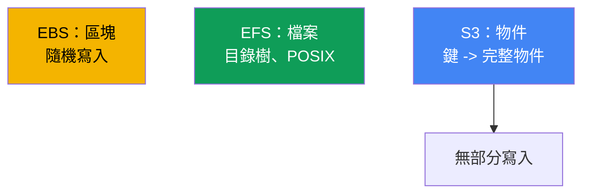
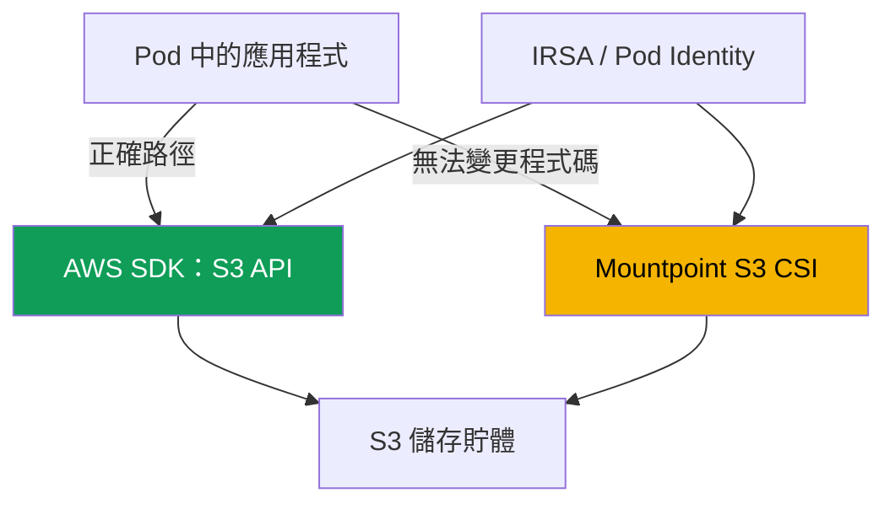

[Русская версия](ru.md) · [Eng version](en.md) · [Versión en español](es.md) · [Version française](fr.md) · [Deutsche Version](de.md) · [ქართული ვერსია](ge.md) · [日本語版](jp.md)
# 第 25 章。應用程式中的 S3：Mountpoint for Amazon S3 CSI 與存取模式

> **接下來。** 第 23 章介紹了區塊式 EBS（一個 AZ 中的一個磁碟、一個寫入者），第 24 章則介紹
> EFS 與 FSx 的檔案存取（網路 NFS、跨區域的 ReadWriteMany）。本章討論第三種類型：S3
> 物件儲存。它的模型根本不同：不是磁碟，也不是檔案系統，而是鍵值儲存。可透過 Mountpoint S3
> 將它掛載為磁碟區，但有其限制，這正是本章的核心。透過 IRSA 或 Pod Identity 授權請見第 16-17
> 章，與 S3 整合的 FSx for Lustre 在第 24 章已有概要說明，透過 VPC endpoints 的私有存取請見第
> 31 章，透過 AWS Backup 備份請見第 41 章。本章僅引用它們，不重複說明。

## 25.1.「我們把儲存貯體掛載成磁碟，應用程式卻在 rename 時失敗」

團隊正在將服務遷移至 EKS。應用程式寫入暫存目錄：建立帶有 `.tmp` 後綴的檔案，分段寫入，最後
將其重新命名為最終名稱。這是透過 `rename` 進行原子寫入的經典模式。他們決定將目錄放在 S3，
透過 Mountpoint S3 CSI 掛載儲存貯體，磁碟區已啟動，Pod 也已啟動。錯誤幾乎立即出現：

```bash
kubectl logs uploader-0
# rename('/data/report.tmp', '/data/report.csv'): Function not implemented
```

接著情況更糟。另一個服務透過 `O_APPEND` 對日誌附加行，卻在第一次附加時就收到錯誤。第三個服務
嘗試就地覆寫組態檔中間的內容：

```bash
kubectl exec app-0 -- sh -c 'echo patched | dd of=/data/config.ini seek=10 conv=notrunc'
# dd: writing '/data/config.ini': Operation not permitted
```

磁碟區已掛載，讀取也能運作，但熟悉的檔案系統操作 `rename`、`append` 以及寫入檔案中間卻都失敗。
而且它們的 errno **不同**，這是首先應注意的事：`rename` 回傳 `ENOSYS`（`Function not implemented`），
表示驅動程式根本沒有此呼叫；`append` 與寫入中間則回傳 `EPERM`（`Operation not permitted`），表示
操作存在但被禁止。這個差異會在 25.7 派上用場：設定無法修復 `ENOSYS`，但 mount options 有時可修復
`EPERM`。這不是驅動程式的 bug，也不是 POSIX 權限問題。原因更深層：S3 是物件儲存，不是檔案系統。
Mountpoint 為物件提供檔案**介面**，但不會把 S3 轉變成 POSIX 檔案系統，凡是不符合物件模型的操作，
它都會明確拒絕。以下說明原因，以及 Mountpoint 究竟適用於何時。

## 25.2. 物件、檔案與區塊儲存：為何 S3 不是檔案系統

S3 使用鍵值模型：物件是位於字串鍵下的不可變值（位元組加上中繼資料）。它既沒有像 EBS 的區塊裝置，
也沒有像 EFS 的目錄樹。所有打破檔案系統預期的差異，都源自於此。



理解 Mountpoint 時，S3 有四項重要特性：

- **沒有真正的目錄。** 鍵空間是平坦的。前綴會模擬階層：鍵
  `logs/2024/app.log` 看似路徑，但 `logs/` 與 `2024/` 並非目錄物件，而是鍵字串的一部分。只要
  存在具有此前綴的物件，「目錄」就存在。
- **物件完整且不可變。** 寫入是整個物件的 `PutObject`。無法變更中間的位元組、附加至結尾，或不經
  重寫便重新命名。更新是在同一鍵下建立新的 `PutObject`，完全取代原有值。
- **一致性模型。** S3 提供強式 read-after-write 一致性：成功 `PutObject` 後，新物件立即對所有用戶端
  可見，讀取不會回傳部分資料。
- **儲存類別與中繼資料。** 物件具有儲存類別（Standard、Intelligent-Tiering、Glacier 等）與中繼資料。
  Glacier 中的物件必須先還原（restore）才能讀取。

25.1 的限制直接源於「物件完整且不可變」：在物件模型上，`rename`、`append` 與寫入檔案中間無法以
低成本實作，因此 Mountpoint 不會模擬它們。

## 25.3. 從應用程式存取 S3 的兩種模式

從 Pod 前往 S3 有兩條根本不同的路徑，兩者之間的選擇比驅動程式設定更重要。第一條是透過 AWS SDK
直接使用 S3 API。第二條是透過 Mountpoint S3 CSI 將儲存貯體掛載為磁碟區，並將其當作檔案系統路徑
存取。



**透過 SDK 的路徑是大多數應用程式的正確選擇。** 程式碼直接呼叫 `PutObject`、`GetObject`、
`ListObjectsV2`，誠實地處理物件模型，不會有檔案系統的假象。不需要 CSI 驅動程式與磁碟區。授權透過
IRSA 或 EKS Pod Identity（第 16-17 章）進行：Pod 取得能存取儲存貯體的 IAM 角色，SDK 自行取得
暫時性金鑰。若應用程式仍在設計，或可加以修改，這就是預設選擇。

**透過 Mountpoint 的路徑** 適用於無法將程式碼改寫為 SDK 的情況：它嚴格使用檔案系統路徑（第三方
二進位檔、舊版應用程式、僅能從磁碟讀取檔案的工具）。此時會將儲存貯體掛載為磁碟區，應用程式在
25.5 的限制範圍內將物件視為檔案。

| 準則 | AWS SDK (S3 API) | Mountpoint S3 CSI |
|---|---|---|
| 應用程式模型 | 物件模型，如實處理 | 物件上的檔案介面 |
| 需要 CSI 與磁碟區 | 否 | 是 |
| 修改程式碼 | 是，呼叫 SDK | 否，使用路徑 |
| 操作完整性 | 完整 S3 API | 檔案系統子集（25.5） |
| 選用時機 | 新程式碼或可修改的程式碼 | 舊版程式碼、僅有檔案系統路徑 |

規則是：先問是否能走 SDK。Mountpoint 是在改寫應用程式成本高於接受檔案介面限制時的折衷方案。

## 25.4. Mountpoint for Amazon S3 CSI 詳解

此驅動程式建構於 Mountpoint for Amazon S3，這個用戶端透過檔案介面提供儲存貯體物件。在叢集中，
它以 provisioner **`s3.csi.aws.com`** 的 CSI 運作，並以 **managed addon**
`aws-mountpoint-s3-csi-driver` 安裝：

```bash
aws eks create-addon --cluster-name demo --addon-name aws-mountpoint-s3-csi-driver \
  --service-account-role-arn arn:aws:iam::111122223333:role/AmazonEKS_S3_CSI_DriverRole
```

驅動程式需要透過 IRSA 或 EKS Pod Identity（第 16-17 章）授予、具備儲存貯體存取權的 IAM 角色。
Mountpoint 建議的最小動作集合為：對儲存貯體本身授予 `s3:ListBucket`，對物件授予 `s3:GetObject`、
`s3:PutObject`、`s3:AbortMultipartUpload`；只有允許刪除時才需要 `s3:DeleteObject`。也有現成的
managed policy `AmazonS3CSIDriverPolicy`。沒有權限時，Pod 會卡在掛載階段，操作則會因 `AccessDenied`
失敗。

預設使用 `authenticationSource: driver`，整個叢集以驅動程式服務帳戶的角色存取 S3。若需要多租戶，
可使用 `authenticationSource: pod`：磁碟區採用 Pod 本身服務帳戶的角色（IRSA 或 Pod Identity），不同
Pod 因而可取得不同存取權。

**僅限靜態佈建。** 不支援動態佈建：驅動程式不會建立儲存貯體，也不會透過 StorageClass 配發它們。
儲存貯體須預先建立，PV 則手動描述。關鍵欄位位於 `spec.csi`：`driver`、唯一的 `volumeHandle`，以及
`volumeAttributes` 中的 `bucketName`；區域則透過 `mountOptions` 設定。

```yaml
apiVersion: v1
kind: PersistentVolume
metadata: {name: s3-pv}
spec:
  capacity: {storage: 1200Gi}     # 此值會被忽略，但 schema 要求
  accessModes: ["ReadOnlyMany"]   # 或 ReadWriteMany
  storageClassName: ""            # 空值：靜態佈建
  claimRef:                       # 將 PV 硬性繫結到特定 PVC
    namespace: default
    name: s3-pvc
  mountOptions:
    - region eu-central-1
  csi:
    driver: s3.csi.aws.com
    volumeHandle: s3-csi-demo-volume   # 必須唯一
    volumeAttributes:
      bucketName: amzn-s3-demo-bucket
```

PVC 依名稱參照此 PV，且同樣使用空的 `storageClassName`：

```yaml
apiVersion: v1
kind: PersistentVolumeClaim
metadata: {name: s3-pvc}
spec:
  accessModes: ["ReadOnlyMany"]
  storageClassName: ""
  resources:
    requests: {storage: 1200Gi}   # 此值會被忽略
  volumeName: s3-pv
```

| 欄位 | 位置 | 用途 |
|---|---|---|
| `driver` | `csi` | 一律為 `s3.csi.aws.com` |
| `volumeHandle` | `csi` | 唯一的磁碟區 ID；無法處理重複值 |
| `bucketName` | `volumeAttributes` | 既有儲存貯體的名稱 |
| `authenticationSource` | `volumeAttributes` | `driver`（預設）或 `pod` |
| `region ...` | `mountOptions` | 儲存貯體的區域 |
| `cache` | `volumeAttributes` | 本機快取類型：`emptyDir` 或 `ephemeral` |
| `metadata-ttl ...` | `mountOptions` | 中繼資料快取 TTL（秒數/`indefinite`） |
| `storageClassName: ""` | PV 與 PVC | 靜態佈建必填 |

**重複讀取快取。** Mountpoint 可快取物件資料與中繼資料，使同一檔案的重複讀取不必再次存取 S3，從而
加速 read-heavy 工作負載。在 CSI 驅動程式 v2 中，本機資料快取不是用旗標設定，而是使用磁碟區屬性：
`cache: emptyDir` 將快取放在節點本機磁碟區，`cacheEmptyDirSizeLimit` 則限制其大小（必須設定，否則
快取會吃掉節點磁碟）。`cacheEmptyDirMedium: Memory` 會將快取移至 tmpfs（RAM），以節點記憶體為代價
降低延遲。中繼資料快取另行啟用，使用 `mountOptions` 中的 `metadata-ttl` 選項。若要在專用磁碟區
（EBS 或 instance store）快取，使用 `cache: ephemeral`，並設定
`cacheEphemeralStorageClassName` 與 `cacheEphemeralStorageResourceRequest`。

```yaml
    volumeAttributes:
      bucketName: amzn-s3-demo-bucket
      cache: emptyDir              # 節點上的本機資料快取
      cacheEmptyDirSizeLimit: 2Gi  # 必須設定限制，否則快取會占滿整個磁碟
```

在 v1 中，快取是透過 `mountOptions` 內的 `cache` 路徑設定；v2 已淘汰此方式，該路徑會被忽略，驅動程式
會自行建立 `emptyDir` 磁碟區。僅應透過磁碟區屬性設定快取。

典型存取模式是讓多個 Pod 讀取資料集的 `ReadOnlyMany`。`ReadWriteMany` 亦受支援，但須注意 25.5 的
警告：不會協調對同一物件的平行寫入，不能讓多個 Pod 同時寫入同一鍵。

## 25.5. Mountpoint 的限制：哪些應用程式會失效

這是關鍵章節。Mountpoint 有意不模擬那些在物件 API 上會很昂貴，或在 S3 中沒有對應項目的操作。它會
**明確失敗**，而不是假裝操作成功。對於一般用途（general purpose）儲存貯體，清單如下：

- **不支援寫入檔案中間。** 僅能從檔案開頭連續寫入，本質上是在建立新的物件。位移至既有物件內部會出錯。
- **不支援對既有物件使用 `append`。** 一般儲存貯體不支援結尾附加（僅 S3 Express One Zone 的 directory
  buckets 支援 append）。
- **不支援 `rename` / `mv`。** 一般儲存貯體完全不支援物件重新命名；任何類型的儲存貯體都不支援目錄
  重新命名。這正是 25.1 中服務失敗的原因。
- **不支援 hard link 與 symlink。**
- **POSIX 語義有限。** `chmod`、`chown` 無法運作：模式與擁有者是預設值（檔案為 `0644`，目錄為 `0755`），
  只能於掛載時透過旗標變更。沒有 extended attributes，也沒有 POSIX locks（`lockf`）。
- **目錄由前綴模擬。** 無法刪除或重新命名由 S3 物件支撐的既有目錄。
- **預設停用刪除**，並須以旗標啟用；新物件的寫入只會在關閉檔案後才對其他用戶端可見。

| 檔案系統操作 | Mountpoint（一般儲存貯體） | 原因 |
|---|---|---|
| 讀取，包括隨機讀取 | 是 | `GetObject`，包括範圍讀取 |
| 建立新檔案 | 是，連續寫入 | 完整物件的 `PutObject` |
| 覆寫既有檔案 | 完整覆寫，須使用 overwrite 旗標 | 同一鍵下新的 `PutObject` |
| 寫入中間 | 否 | 物件不可變 |
| `append` | 否（一般儲存貯體） | 不支援部分附加 |
| `rename` / `mv` | 否（一般儲存貯體） | S3 中沒有低成本操作 |
| symlink / hardlink | 否 | 物件模型中沒有對應項目 |

營運結論：任何仰賴 `rename`、`append`、寫入中間、檔案鎖定或變更 POSIX 權限的應用程式，未經改造都無法
在 Mountpoint 上運作。若這類工作負載需要共用檔案存取，應使用 EFS（第 24 章），而不是 S3。

## 25.6. Mountpoint 的適用時機

Mountpoint 針對大型物件讀取的高總吞吐量最佳化，對寫入則針對連續建立新物件最佳化。因此適合的情境是：

- **Read-heavy：ML 與分析。** 許多 Pod 從 S3 讀取大型資料集（模型、Parquet、媒體），使用
  `ReadOnlyMany`，讀取可平行化，且不必將應用程式改為 SDK。
- **提供大型靜態檔案。** 只讀取的共享大型資產集區。
- **將日誌與成品作為完整物件。** 工作將結果完整寫成新物件（報告、傾印、建置成品），這符合「建立新物件」
  模型。

Mountpoint 不適用於資料庫、所有就地修改檔案的工作負載、向日誌附加內容或使用鎖定的工作負載。關於從 S3
密集平行存取資料，若不只是需要檔案介面，而是需要同一份 S3 資料上的高效能 POSIX，這便是 **FSx for
Lustre**（第 24 章）的領域，它是與 S3 整合的平行檔案系統，可為資料集提供快速 POSIX 存取。
Mountpoint 是輕量的檔案介面，Lustre 則是用於 HPC 與 ML 的高效能檔案系統。

### 以 Mountpoint 使用 S3 Express One Zone（directory buckets）

特殊情況是儲存類別為 **S3 Express One Zone** 的 directory buckets。這是區域性儲存：資料位於一個
可用區中，接近 compute（可與相同 AZ 的 EKS 節點共置），可提供最低延遲與高 IOPS，每個儲存貯體每秒可達
數十萬個請求。代價有兩項。第一是區域性：單一 AZ 是為延遲而設，而非跨 AZ durability，若該 AZ 故障，
資料便無法使用。第二是每 GB 儲存成本高於 general purpose。這也造成排程影響：磁碟區綁定儲存貯體的
區域，因此使用它的 Pod 必須留在同一 AZ，否則共置的意義會喪失，延遲也會增加。它不是可靠長期儲存的
general purpose S3 替代品。

對 Mountpoint 而言，directory buckets 有一項重要放寬：它們支援對既有物件使用 `append`，而一般
general purpose 儲存貯體不支援此功能（25.5）。可以在檔案末端附加，因此部分 POSIX 限制得以解除。
25.5 的其餘限制（不支援 `rename`、無法寫入中間、無 symlink）仍然存在，物件本質並未改變。

何時使用 directory bucket：低延遲與高 IOPS 至關重要，且資料能承受可用區遺失，因為資料也存於其他地方
（general purpose S3 中的原始資料集、可重新產生）時，例如 ML 訓練、互動式分析、媒體處理。何時使用
 general purpose：需要跨 AZ durability、唯一副本的長期儲存、從多個 AZ 存取，或寫入而不想將 Pod 綁定至
單一 AZ 時。Directory bucket 是熱資料加速器，而不是存放唯一副本的地方。

## 25.7. 常見問題診斷

最常見的四種情況如下。

| 症狀 | 原因 | 檢查項目 |
|---|---|---|
| Pod 卡住，無法掛載 | 沒有儲存貯體角色或權限 | 角色政策、日誌中的 `AccessDenied` |
| `rename` 出現 `Function not implemented` | 驅動程式中沒有此呼叫（25.5） | 應用程式寫入模式 |
| `append`、覆寫、刪除出現 `Operation not permitted` | Mountpoint 限制與 mount options（25.5） | 寫入模式、`allow-overwrite`、`allow-delete` |
| 物件存取錯誤，無法讀取儲存貯體 | 儲存貯體區域錯誤 | `mountOptions` 中的 `region` |
| 私有子網路中 S3 逾時 | 沒有通往 S3 的路由 | VPC gateway endpoint（第 31 章） |

第一項是**權限**。驅動程式角色（或在 `authenticationSource: pod` 時的 Pod 角色）必須對儲存貯體提供
`s3:ListBucket`，並對物件提供 `s3:GetObject`/`s3:PutObject`。可透過 `kube-system` 中驅動程式 Pod 的
日誌及 `AccessDenied` 進行檢查：

```bash
kubectl get pods -n kube-system | grep s3-csi
kubectl logs -n kube-system -l app.kubernetes.io/name=aws-mountpoint-s3-csi-driver
```

第二項是 **`rename`/`append`/partial write 失敗**。這不是基礎設施事件，而是應用程式與物件模型不相容
（25.5）。請檢視 errno：`rename` 的 `ENOSYS` 表示「驅動程式沒有此功能，也不會有」；若有意識地做出
決定，覆寫與刪除的 `EPERM` 可透過 `allow-overwrite` 與 `allow-delete` 選項解除。解法是改用 SDK（25.3），
或遷移到 EFS（第 24 章），而不是調整驅動程式。

第三項是**區域**。儲存貯體與 `mountOptions: region` 必須相符；錯誤的區域會導致物件存取錯誤。第四項是
**私有存取**：私有子網路若無網際網路出口，則需要透過 S3 的 **gateway endpoint**（S3 的 Gateway 類型）
建立通往 S3 的路由，否則 S3 API 請求將逾時。此外，gateway endpoint 會讓 S3 流量避開 NAT Gateway，
因此讀取資料集不會被計費為 NAT 流量。Endpoints 與私有流量請見第 31 章。

## 25.8. 生產環境的使用方式

- **先 SDK，後 Mountpoint。** 預設透過具有 IRSA/Pod Identity 角色的 AWS SDK（第 16-17 章）存取 S3。
  只有無法將程式碼轉為 SDK 時才使用 Mountpoint。
- **資料集使用 `ReadOnlyMany`。** 讀取共享資料集時以唯讀方式掛載磁碟區；這是最安全且最常見的
  Mountpoint 模式。
- **儲存貯體最小權限。** 驅動程式角色只授予所需動作（`s3:ListBucket`、`s3:GetObject`，寫入時為
  `s3:PutObject`、`s3:AbortMultipartUpload`），而非 `AmazonS3FullAccess`。
- **透過 `authenticationSource: pod` 實現多租戶。** 當不同 Pod 需要不同的儲存貯體存取權時，使用 Pod
  服務帳戶的角色，而非共用驅動程式角色。
- **透過 gateway endpoint 進行私有存取。** 在私有子網路中，S3 流量應走 gateway endpoint，而非 NAT
  Gateway：讀取不會離開私有網路，也不會被計費為 NAT 流量（第 31 章）。
- **為重複讀取使用本機快取。** 對 read-heavy 資料集啟用含 `cacheEmptyDirSizeLimit` 的 `cache: emptyDir`：
  重複讀取會命中節點快取，而不是 S3。中繼資料由 `metadata-ttl` 快取。
- **儲存貯體版本控制。** 若已啟用刪除或覆寫，Bucket Versioning 可防止物件意外遺失。

## 25.9. 迷你詞彙表

- **物件儲存**：鍵值模型，物件（位元組加中繼資料）位於字串鍵下，不可變，並透過 `PutObject` 整體更新。
- **Mountpoint for Amazon S3**：透過檔案介面提供儲存貯體物件的用戶端，也是 CSI 驅動程式的基礎。
- **Mountpoint S3 CSI 驅動程式**：`aws-mountpoint-s3-csi-driver`，帶有 provisioner `s3.csi.aws.com`
  的 managed addon；僅支援靜態佈建。
- **靜態佈建**：以 `bucketName` 手動描述 PV；驅動程式不支援動態佈建與建立儲存貯體。
- **`authenticationSource`**：磁碟區的認證來源：`driver`（共用驅動程式角色）或 `pod`（Pod 服務帳戶角色）。
- **前綴**：鍵中 `/` 之前的部分，Mountpoint 從中模擬目錄；S3 中沒有真正的目錄。
- **本機快取**：節點磁碟區上 Mountpoint 的資料快取（`cache: emptyDir`/`ephemeral`），可加速重複讀取；
  中繼資料快取由 `metadata-ttl` 設定。
- **gateway endpoint**：用於私有存取 S3、無需網際網路的 Gateway 類型 VPC endpoint（第 31 章）。
- **S3 Express One Zone**：具備單一 AZ 中低延遲與高 IOPS 的區域性儲存類別（directory buckets）；不同於
  general purpose 儲存貯體，它支援 `append`。

## 25.10. 本章摘要

- S3 是物件儲存（鍵值），不是檔案系統或區塊磁碟。物件完整且不可變，沒有真正目錄，階層由前綴模擬。
- 物件模型導致限制：無法寫入檔案中間、無 `rename`、一般儲存貯體無法對既有物件使用 `append`。
- 有兩種存取路徑：透過 API 的 AWS SDK（適用於大多數情況，搭配 IRSA 或 Pod Identity 角色，無需 CSI）與
  Mountpoint S3 CSI 檔案介面（無法將程式碼改寫為 SDK 時使用）。
- 驅動程式 `s3.csi.aws.com` 以 managed addon `aws-mountpoint-s3-csi-driver` 安裝，透過 IRSA/Pod Identity
  取得角色，並需要儲存貯體權限（`s3:ListBucket`、`s3:GetObject`、`s3:PutObject`、
  `s3:AbortMultipartUpload`），也可使用 managed policy `AmazonS3CSIDriverPolicy`。僅有靜態佈建：PV 的
  `volumeAttributes` 中包含 `bucketName`，`storageClassName: ""`。
- Mountpoint 的限制如實且嚴格：沒有 partial write、`rename`、`append`、hard/symlink，POSIX 功能有限
  （沒有 `chmod`/`chown`、鎖定），目錄則被模擬。依賴這些操作的工作負載無法在 Mountpoint 上運作。
- 它適用於 read-heavy：ML/分析讀取大型資料集（`ReadOnlyMany`）、提供大型靜態檔案，以及將日誌與成品
  寫成完整物件。若需要密集平行的 S3 資料 POSIX 存取，使用 FSx for Lustre（第 24 章）。
- 本機快取可透過 `cache: emptyDir` 加上 `cacheEmptyDirSizeLimit` 與 `metadata-ttl` 加速重複讀取；私有
  子網路通往 S3 的流量則透過 gateway endpoint 繞過 NAT Gateway（第 31 章）。
- 診斷項目包括：角色對儲存貯體的權限（`AccessDenied`）、應用程式在 `rename`/partial write 的失敗
  （不相容而非故障）、儲存貯體區域，以及透過 gateway endpoint 的私有存取。

## 25.11. 這在實際工作中的用途

值班時，Mountpoint 事件分為兩類。第一類是基礎設施問題：Pod 無法掛載磁碟區、驅動程式日誌顯示
`AccessDenied`，請檢查角色及其對特定儲存貯體的權限，然後檢查 `mountOptions` 中的區域與私有子網路中
通往 S3 的路由。第二類更為棘手，是應用程式在 `rename`（`Function not implemented`）、`append` 或寫入
檔案中間（`Operation not permitted`）時失敗。這無法透過設定修復：應用程式期待 S3 具有物件儲存並不具備的
POSIX 檔案系統行為。正確的解法是將程式碼改用 AWS SDK（如此就完全不需要 CSI），或若確實需要具有完整
語義的共用檔案存取，則使用 EFS（第 24 章）。設計時請遵循優先順序：先問能否走 SDK，只有無法使用時，
才評估工作負載是否符合 Mountpoint 的限制。

## 25.12. 自我檢核問題

1. S3 的物件模型與檔案（EFS）及區塊（EBS）模型有何不同？
2. 為何 S3 沒有真正的目錄？前綴是什麼？
3. 為何一般儲存貯體無法在物件中間追加或重新命名物件？
4. 從 Pod 存取 S3 有哪兩種模式？哪一種預設是正確選擇？
5. 何時使用 Mountpoint 取代透過 AWS SDK 的存取是合理的？
6. Mountpoint S3 CSI 驅動程式的 managed addon 與 provisioner 分別叫什麼？
7. 為何驅動程式需要 IAM 角色？它最少需要哪些儲存貯體動作？
8. `authenticationSource: driver` 與 `pod` 有何不同？何時需要後者？
9. 為何 Mountpoint 僅有靜態佈建？這樣的 PV 長什麼樣子？
10. Mountpoint 不支援哪些檔案系統操作？為何它明確失敗而非靜默處理？
11. 哪些工作負載適合 Mountpoint？何時應改用 EFS 或 FSx for Lustre？
12. Pod 無法掛載 Mountpoint 磁碟區，應依何順序檢查哪些原因？
13. 為何私有子網路需要 S3 的 gateway endpoint？它如何節省 NAT Gateway 成本？
14. 如何啟用 Mountpoint 的本機資料快取？為何要設定 `cacheEmptyDirSizeLimit`？
15. S3 Express One Zone 為 Mountpoint 帶來什麼？區域性的代價是什麼？

## 實作練習

本課程對應實驗：[lab 129：Mountpoint for S3，檔案語義在哪裡失效，以及為何沒有備份](../../labs/129/README_TW.MD)。
其中有指向真實儲存貯體的靜態 PV、成功操作（新物件與讀取）及三個接連失敗操作並分析 errno，最後說明為何
此類 PVC 沒有 snapshot，以及什麼機制保護資料。使用 `check_result` 指令驗證結果。

接下來可在任何自有叢集上重現相同情況。先從 AWS 的角度檢視儲存貯體：`aws s3 ls` 會顯示儲存貯體，
`aws s3 ls s3://<bucket>/ --recursive` 會顯示物件及其以此前綴形成的「虛擬目錄」。確認驅動程式已安裝：
`aws eks list-addons --cluster-name <cluster>` 與 `kubectl get pods -n kube-system | grep s3-csi`。

接著重現 25.1 的痛點。建立靜態 PV，使用 `driver: s3.csi.aws.com`、您儲存貯體的 `bucketName`，並在
`mountOptions` 中設定 `region`，繫結 PVC，然後以 `ReadWriteMany` 啟動 Pod。請選用含 shell 與工具的
映像（`busybox`），否則沒有可供 `kubectl exec` 執行的內容。在 Pod 中確認讀取與建立新檔案正常運作
（`kubectl exec ... -- cat /data/<key>` 與寫入新鍵），再確認 `mv /data/a /data/b` 會以
`Function not implemented` 失敗，對 `echo x >> /data/existing` 的附加，以及透過 `dd ... seek=...`
寫入中間，皆會以 `Operation not permitted` 失敗。同時嘗試覆寫與刪除檔案：在尚未啟用
`allow-overwrite` 與 `allow-delete` 前，它們也會顯示 `Operation not permitted`。再與 `ReadOnlyMany`
比較：以唯讀方式掛載同一儲存貯體，確認許多 Pod 都能讀取資料集。也請單獨檢查權限：暫時從驅動程式角色
移除 `s3:GetObject`，重新建立 Pod，並在驅動程式 Pod 日誌中尋找 `AccessDenied`（`kubectl logs -n
kube-system -l app.kubernetes.io/name=aws-mountpoint-s3-csi-driver`）；恢復權限並確認掛載成功。

---
[目錄](../README_TW.md) · [第 24 章](../24/tw.md) · [第 26 章](../26/tw.md)
