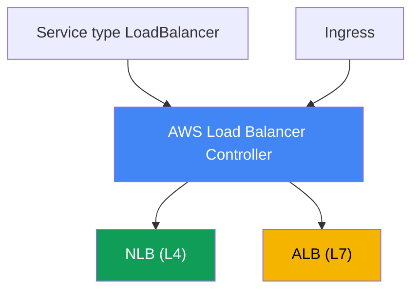
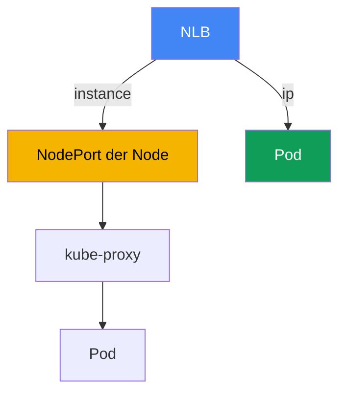

[Русская версия](ru.md) · [Eng version](en.md) · [Versión en español](es.md) · [Version française](fr.md) · [ქართული ვერსია](ge.md) · [繁體中文版](tw.md) · [日本語版](jp.md)
# Kapitel 26. AWS Load Balancer Controller und Service vom Typ LoadBalancer: NLB

> **Wie es weitergeht.** Dies ist der Beginn von Teil 5, der sich mit Netzwerk und Traffic befasst. Die Teile 3 und 4 behandelten Identität, Sicherheit und Speicher; nun sehen wir uns an, wie externer Traffic in den Cluster gelangt. Die erste Schicht ist der Load Balancer vor den Pods. Dieses Kapitel behandelt L4-Load-Balancing über einen Network Load Balancer und einen Service vom Typ LoadBalancer. L7-Routing über Ingress und ALB behandelt Kapitel 27, Gateway API und VPC Lattice Kapitel 28, DNS und Zertifikate (external-dns, ACM, cert-manager) Kapitel 29. Wie ein Pod eine IP im VPC erhält (VPC CNI), behandelt Kapitel 8, die Rolle für den Controller über IRSA oder Pod Identity die Kapitel 16-17. Auf sie wird verwiesen, ohne sie zu wiederholen.

## 26.1. „LoadBalancer angefordert, alten Classic Load Balancer erhalten“

Ein Engineer veröffentlicht einen Service auf die für Kubernetes übliche Weise nach außen: mit einem Service vom Typ LoadBalancer:

```yaml
apiVersion: v1
kind: Service
metadata:
  name: web
spec:
  type: LoadBalancer
  selector: {app: web}
  ports:
    - port: 80
      targetPort: 8080
```

Er wendet ihn an, wartet auf die externe Adresse und sieht nach, was erstellt wurde:

```bash
kubectl get svc web
# NAME  TYPE           EXTERNAL-IP                             PORT(S)
# web   LoadBalancer   a1b2...elb.eu-central-1.amazonaws.com   80:31842/TCP
```

Die Adresse ist zugewiesen, der Service ist erreichbar. Doch in der EC2-Konsole findet sich hinter diesem DNS-Namen ein **Classic Load Balancer**, ein Load Balancer der vorherigen Generation, den AWS seit Langem nicht weiterentwickelt. Er wurde durch den integrierten in-tree cloud provider erstellt, der in die Kubernetes-Komponenten eingebaut ist. Der Engineer benötigt jedoch einen Network Load Balancer: statische IPs, UDP-Unterstützung, hohe L4-Performance und Targets auf Pod-IPs. Außerdem möchte er Health Checks und Target Groups deklarativ aus dem Manifest statt durch Klicks in der Konsole verwalten.

Das Problem geht über einen einzelnen Load-Balancer-Typ hinaus. Der in-tree provider kann wenig, bietet nur spärliche Konfiguration, ist an den Lebenszyklus von Kubernetes gebunden und faktisch eingefroren. NLB und Target Groups manuell in der Konsole oder mit Terraform am Cluster vorbei zu erstellen, skaliert nicht: Bei jeder Änderung der Nodes oder Pods müssen Targets von Hand erneut registriert werden und weichen vom tatsächlichen Zustand des Clusters ab. Es wird ein Controller benötigt, der im Cluster lebt, Services und Endpoints sieht und NLB sowie Target Groups selbstständig in Übereinstimmung bringt. Das ist der AWS Load Balancer Controller, mit dem der gesamte Netzwerkteil des Kurses beginnt.

## 26.2. AWS Load Balancer Controller: Was er ist und wie er installiert wird

Der AWS Load Balancer Controller (kurz LBC) ist ein Kubernetes-Controller, der Cluster-Ressourcen beobachtet und dafür Elastic Load Balancing erstellt. Er deckt zwei Szenarien ab:

- Einen **Service vom Typ LoadBalancer** wandelt er in einen **Network Load Balancer** (NLB, L4) um. Das ist das Thema dieses Kapitels.
- Einen **Ingress** wandelt er in einen **Application Load Balancer** (ALB, L7) um. Das ist das Thema von Kapitel 27 und wird hier nur erwähnt.



Der Controller wird **über Helm** installiert, nicht als managed EKS-Addon. Das offizielle Chart liegt im Repository `eks` (`https://aws.github.io/eks-charts`):

```bash
helm repo add eks https://aws.github.io/eks-charts
helm repo update
helm install aws-load-balancer-controller eks/aws-load-balancer-controller \
  -n kube-system \
  --set clusterName=<cluster-name> \
  --set serviceAccount.create=false \
  --set serviceAccount.name=aws-load-balancer-controller
```

Der Controller handelt im Namen von AWS: Er erstellt und verändert NLB, Target Groups, Listener und Regeln für Security Groups. Er benötigt daher eine **IAM-Rolle**, die seinem ServiceAccount zugeordnet ist. Die Rolle wird über **IRSA** oder **EKS Pod Identity** vergeben (Kapitel 16-17). Deshalb steht im obigen Beispiel `serviceAccount.create=false`: Der Service Account mit der Annotation für die Rolle wird vorher erstellt.

Die Berechtigungen sind im vorgefertigten Richtliniendokument `iam_policy.json` aus dem Controller-Repository beschrieben. Daraus wird eine IAM-Richtlinie erstellt (nach Konvention des Dokuments heißt sie `AWSLoadBalancerControllerIAMPolicy`) und an die Controller-Rolle gebunden:

```bash
curl -o iam_policy.json https://raw.githubusercontent.com/kubernetes-sigs/\
aws-load-balancer-controller/main/docs/install/iam_policy.json
aws iam create-policy --policy-name AWSLoadBalancerControllerIAMPolicy \
  --policy-document file://iam_policy.json
```

Ohne Rolle oder mit einer eingeschränkten Richtlinie startet der Controller, kann jedoch keinen Load Balancer erstellen: Der Service bleibt bei `<pending>`, und in den Controller-Logs ist `AccessDenied` zu sehen.

## 26.3. In-tree cloud provider gegenüber LB Controller und Modus external

Sehen wir uns an, weshalb in 26.1 ein Classic Load Balancer erschien. Historisch verarbeitete der **integrierte in-tree cloud provider** Services vom Typ LoadBalancer: AWS-Code innerhalb von `kube-controller-manager` (später in `cloud-controller-manager` ausgelagert). Standardmäßig reconciliert genau dieser Service vom Typ LoadBalancer und erstellt dafür einen CLB. Seine Fähigkeiten sind begrenzt, die Entwicklung wurde eingestellt, und AWS empfiehlt, diese Aufgabe an LBC zu übergeben.

Damit LBC das Reconciliation übernimmt, wird der Service mit einer Annotation markiert:

```yaml
service.beta.kubernetes.io/aws-load-balancer-type: external
```

Der Wert `external` signalisiert dem in-tree provider: „Diesen Service nicht anfassen, ein externer Controller übernimmt ihn.“ LBC sieht die Annotation und erstellt einen NLB. Es gibt einen zweiten, neueren Weg: das Feld `spec.loadBalancerClass: service.k8s.aws/nlb`; es tut auf cloud-provider-unabhängige Weise dasselbe. In aktuellen LBC-Versionen setzt ein mutating webhook `loadBalancerClass` automatisch und macht den Controller damit faktisch zum Standard-Handler für neue Services vom Typ LoadBalancer.

Eine wichtige Betriebsregel: **Die Annotation `aws-load-balancer-type` wird nicht zu einem bereits vorhandenen Service hinzugefügt oder an ihm geändert.** Das Wechseln des Handlers an einem laufenden Service führt zu Inkonsistenzen: Zuvor erstellte AWS-Ressourcen können verloren gehen oder ein NLB wird unerwartet im Internet veröffentlicht. Der Handler-Typ wird bei der Erstellung des Service festgelegt.

| Eigenschaft | In-tree cloud provider | AWS Load Balancer Controller |
|---|---|---|
| Erstellung für Service LB | Classic Load Balancer | Network Load Balancer |
| Ort | innerhalb der Kubernetes-Komponenten | separater Controller im Cluster |
| Installation | integriert | Helm, eigene IAM-Rolle |
| Entwicklung | eingefroren | aktiv, von AWS empfohlen |
| LBC aktivieren | - | `aws-load-balancer-type: external` |

## 26.4. NLB über einen Service vom Typ LoadBalancer: zentrale Annotationen

Das Verhalten des NLB wird über Annotationen am Service konfiguriert. Die Namen sind lang, folgen jedoch alle dem Präfix `service.beta.kubernetes.io/aws-load-balancer-`. Die Grundausstattung:

- **`aws-load-balancer-type: external`**: Den Service dem LBC-Controller übergeben (26.3).
- **`aws-load-balancer-nlb-target-type`**: Target-Typ, `instance` oder `ip` (26.5).
- **`aws-load-balancer-scheme`**: `internal` oder `internet-facing`. Standardmäßig erstellt der Controller seit Version v2.2.0 einen **`internal`** NLB; für einen öffentlichen NLB muss das Scheme ausdrücklich gesetzt werden. Das schützt vor einer versehentlichen Veröffentlichung eines Service nach außen.
- **`aws-load-balancer-healthcheck-*`**: Health-Check-Parameter der Target Group: `-protocol`, `-port`, `-path`, `-interval`, `-timeout`, `-healthy-threshold`, `-unhealthy-threshold`, `-success-codes`.

Ein typisches Manifest für einen öffentlichen NLB mit Targets auf Pod-IPs:

```yaml
apiVersion: v1
kind: Service
metadata:
  name: web
  annotations:
    service.beta.kubernetes.io/aws-load-balancer-type: external
    service.beta.kubernetes.io/aws-load-balancer-nlb-target-type: ip
    service.beta.kubernetes.io/aws-load-balancer-scheme: internet-facing
    service.beta.kubernetes.io/aws-load-balancer-healthcheck-protocol: http
    service.beta.kubernetes.io/aws-load-balancer-healthcheck-path: /healthz
spec:
  type: LoadBalancer
  selector: {app: web}
  ports:
    - port: 80
      targetPort: 8080
      protocol: TCP
```

| Annotation | Werte | Standard |
|---|---|---|
| `aws-load-balancer-type` | `external` | wird durch in-tree verarbeitet |
| `aws-load-balancer-nlb-target-type` | `instance`, `ip` | `instance` |
| `aws-load-balancer-scheme` | `internal`, `internet-facing` | `internal` |
| `aws-load-balancer-healthcheck-protocol` | `tcp`, `http`, `https` | `tcp` (Cluster) |
| `aws-load-balancer-healthcheck-interval` | Sekunden | `10` |
| `aws-load-balancer-healthcheck-healthy-threshold` | Zahl | `3` |

Die Standardwerte für Health Checks (Intervall `10`, Timeout `10`, Schwellenwerte `3`, Codes `200-399`) werden vom Controller vorgegeben; sie werden nur bei Bedarf überschrieben. Weitere nützliche Annotationen sind `aws-load-balancer-name`, `aws-load-balancer-subnets`, `aws-load-balancer-ssl-cert` (TLS-Terminierung mit einem Zertifikat aus ACM) und `aws-load-balancer-attributes` (NLB-Attribute, beispielsweise cross-zone).

Zwei Annotationen sind besonders hilfreich in der Produktion. `aws-load-balancer-eip-allocations` bindet zuvor reservierte Elastic IPs an einen öffentlichen NLB (eine Allocation je Subnetz); die externen Adressen des Service werden statisch und überdauern die Neuerstellung des NLB. `aws-load-balancer-target-group-attributes` setzt Target-Group-Attribute mit einer Zeichenfolge der Form `Schlüssel=Wert`; mit dem Schlüssel `deregistration_delay.timeout_seconds` (zum Beispiel `15` oder `30` statt des Standardwerts `300`) wird die Wartezeit beim Entfernen eines Targets aus der Gruppe verkürzt, sodass der NLB bei einem Deployment TCP-Sitzungen kontrolliert auslaufen lassen kann, ohne einen Pod beim Draining unnötig viele Minuten zu halten (graceful deregistration).

**Zonenübergreifendes Load Balancing.** Bei einem NLB ist cross-zone load balancing standardmäßig auf Target-Group-Ebene **deaktiviert** (anders als bei einem ALB, wo es immer aktiviert ist): Der NLB in jeder Zone sendet Traffic nur an Targets in seiner Zone. Wenn Pods asymmetrisch über AZs verteilt sind, fällt die Last auf die Replikate ungleichmäßig aus. Aktiviert wird es über dieselben `target-group-attributes`: `cross_zone.load_balancing.enabled=true`. Der Kompromiss ist FinOps: Lastverteilung auf alle Pods in allen Zonen gegen Kosten für zonenübergreifenden Traffic (cross-AZ data transfer wird berechnet). Dies interagiert mit `externalTrafficPolicy` (Abschnitt 26.6): `Local` hält Traffic ebenfalls innerhalb der Node und verstärkt die Schieflage bei asymmetrischer Platzierung.

**Security Groups und IaC-Drift.** Seit Version v2.6.0 kann LBC selbst eine Frontend Security Group für den NLB erstellen und Backend-SG-Regeln auf Nodes und Pods ändern. Wenn das gesamte Netzwerk und die SGs über Terraform oder Terragrunt verwaltet werden, verursachen diese automatischen Änderungen Zustandsdrift: `plan` zeigt Regeländerungen, die nicht im Code enthalten sind. Dies wird mit zwei Annotationen gesteuert: `aws-load-balancer-manage-backend-security-group-rules: "false"` übergibt die Backend-SG-Regeln an Ihr IaC, und `aws-load-balancer-security-groups` bindet an den NLB zuvor in Terraform erstellte Frontend-Gruppen statt sie automatisch erstellen zu lassen. So hat eine SG nur einen Eigentümer und es gibt keine Drift.

## 26.5. target-type: instance gegenüber ip

Die zentrale Entscheidung bei der Arbeit mit einem NLB ist, wohin der Load Balancer Traffic sendet. Es gibt zwei Modi.

**`instance`**: Das Target der Gruppe ist eine EC2-Node, genauer ihr `NodePort`. Der NLB sendet Pakete an den `NodePort` einer beliebigen Cluster-Node, danach leitet `kube-proxy` auf dieser Node den Traffic anhand der iptables- oder IPVS-Regeln an den Pod weiter. Der Pod kann sich auf einer anderen Node befinden; dann kommt ein zusätzlicher Netzwerkhop zwischen Nodes hinzu, und das Ergebnis hängt von `externalTrafficPolicy` (26.6) ab. Der Service muss dabei den Typ `NodePort` oder `LoadBalancer` haben.

**`ip`**: Das Target ist die **IP des Pods selbst**. Das ist möglich, weil VPC CNI dem Pod eine echte Adresse aus dem VPC zuweist (Kapitel 8), die im AWS-Netzwerk routbar ist. Der NLB sendet den Traffic direkt an den Pod, umgeht `NodePort` und `kube-proxy`, benötigt einen Hop weniger und ist unabhängig davon, auf welcher Node der Pod lebt. Der Modus `ip` ist für **Fargate obligatorisch**, da es dort weder gewöhnliche EC2-Nodes noch `NodePort` gibt.



Für den Modus `ip` bestehen Netzwerkanforderungen: Der Pod muss eine VPC-Adresse erhalten (VPC CNI, Kapitel 8), und Security Groups sowie Subnetze müssen dem NLB den Zugriff auf den Pod-Port erlauben. Seit Version v2.6.0 erstellt und bindet der Controller Frontend- und Backend-Security-Groups am NLB selbst und ändert Zugriffsregeln; in älteren Versionen fügte er inbound-Regeln zur Security Group der Nodes hinzu.

| Kriterium | `instance` | `ip` |
|---|---|---|
| Target | `NodePort` der Node | IP des Pods direkt |
| Traffic-Pfad | NLB -> NodePort -> kube-proxy -> Pod | NLB -> Pod |
| Zusätzlicher Hop zwischen Nodes | möglich | nein |
| Service-Typ | `NodePort` oder `LoadBalancer` | beliebiger mit VPC CNI |
| Fargate | funktioniert nicht | obligatorisch |
| Client source IP | abhängig von `externalTrafficPolicy` | abhängig vom Target-Group-Attribut |
| Anforderungen | offener `NodePort` | VPC CNI, Erreichbarkeit von SG/Subnetz |

Praktische Regel: Auf EC2 mit VPC CNI wird standardmäßig `ip` verwendet, weil es weniger Hops gibt und die Client-IP einfacher erhalten bleibt. `instance` wird gewählt, wenn ausdrücklich ein Eingang über `NodePort` benötigt wird oder ein bestimmtes Netzwerkschema es verlangt.

## 26.6. externalTrafficPolicy: Cluster gegenüber Local

Das Feld `spec.externalTrafficPolicy` eines Service steuert, wie die Node mit externem Traffic umgeht, und ist besonders wichtig im Modus `instance`.

**`Cluster`** (der Standardwert): Traffic, der auf dem `NodePort` einer beliebigen Node eintrifft, kann von `kube-proxy` an einen Pod auf **einer anderen** Node weitergeleitet werden. Die Verteilung über alle Pods ist gleichmäßig, jedoch entsteht ein zusätzlicher Hop zwischen Nodes und es wird SNAT ausgeführt: Die **Quell-IP des Clients geht verloren**, der Pod sieht die Adresse der Node. Alle Cluster-Nodes antworten auf Health Checks, auch Nodes ohne den benötigten Pod.

**`Local`**: Eine Node sendet Traffic **nur an ihre lokalen Pods** und leitet ihn nicht weiter. Der zusätzliche Hop entfällt und die **Client source IP bleibt erhalten**. Der Preis: Befindet sich kein Service-Pod auf der Node, wird ihr Health Check unhealthy und der NLB sendet keinen Traffic mehr an sie; bei ungleichmäßiger Verteilung der Pods über Nodes ist auch das Load Balancing ungleichmäßig. Für das korrekte Funktionieren von Local ist eine sinnvolle Verteilung der Pods auf Nodes wichtig (topology spread, Kapitel 40).

Dies steht in direktem Zusammenhang mit dem Health Check aus 26.4. Der Controller berücksichtigt die Richtlinie: Bei `Cluster` ist das Standardprotokoll für den Health Check `tcp`, bei `Local` wird `http` über `spec.healthCheckNodePort` empfohlen; `tcp` sollte für `Local` nicht verwendet werden, weil es eine Node mit Pod nicht von einer Node ohne Pod unterscheidet.

| Aspekt | `Cluster` | `Local` |
|---|---|---|
| Weiterleitung an Pod auf anderer Node | ja | nein |
| Zusätzlicher Hop | möglich | nein |
| Client source IP | geht verloren (SNAT) | bleibt erhalten |
| Health-Check-Antworten | alle Nodes | nur Nodes mit Pod |
| Verteilung | gleichmäßig | abhängig von der Pod-Platzierung |

Im Modus `ip` ist das Bild anders: Der Traffic geht ohnehin direkt an den Pod, und das Erhalten der Client-IP steuert das Target-Group-Attribut `preserve_client_ip` (für `ip` ist es standardmäßig deaktiviert, für `instance` aktiviert). Wird die ursprüngliche IP des Clients in der Anwendung benötigt, muss dies separat geprüft werden: über die Richtlinie bei `instance` oder über das Target-Group-Attribut bei `ip`.

## 26.7. NLB gegenüber ALB: Wann welcher

LBC kann beide Load Balancer, und die Wahl zwischen ihnen ist eine Entscheidung über die Ebene des OSI-Modells. Kurz und ohne Kapitel 27 zu duplizieren, das ALB ausführlich behandelt.

- **NLB ist L4.** Er arbeitet auf TCP- und UDP-Ebene und interpretiert HTTP nicht. Daraus ergeben sich seine Stärken: sehr hohe Performance und geringe Latenz, UDP-Unterstützung, statische IPs je Subnetz und die Möglichkeit, Elastic IPs zu binden. Er wird für Nicht-HTTP-Protokolle (gRPC über TCP, UDP-Spieleservices, Datenbanken, Broker) und überall dort verwendet, wo reines L4 ohne Request-Interpretation benötigt wird.
- **ALB ist L7.** Er versteht HTTP und HTTPS: Routing nach Host und Path, Header, Redirects, Authentifizierung und WAF-Integration. Dies ist die Wahl für Web-Anwendungen und APIs, die inhaltsbasiertes Routing benötigen. In EKS wird ein ALB üblicherweise aus einem Ingress erstellt (Kapitel 27).

NLB ist die einzige Wahl für Anwendungen auf **UDP** (DNS, Media-Streaming, Spieleserver) und für **QUIC (HTTP/3)** über UDP: ALB arbeitet nur mit TCP, HTTP, HTTPS und HTTP/2, nicht mit UDP oder QUIC. Wenn die Anwendung eingehend HTTP/3 benötigt, wird es am NLB terminiert (oder an einem eigenen Proxy hinter dem NLB), nicht am ALB.

Eine grobe Regel: HTTP-Routing nach Pfaden und Hosts bedeutet ALB über Ingress (Kapitel 27); reines L4, UDP, QUIC, statische IPs oder maximaler Durchsatz bedeutet NLB über einen Service vom Typ LoadBalancer, wie in diesem Kapitel.

## 26.8. gRPC und Service Mesh: Warum L4 keine Streams ausbalanciert

Ein Teil des Backends kommuniziert per gRPC (über HTTP/2), und nach einem Scale-out verteilt sich die Last nicht: Ein Replikat ist überlastet, neue bleiben ungenutzt. Der Grund ist, dass der gRPC-Client **eine langlebige HTTP/2-connection** öffnet und alle RPCs darüber multiplexed. Service und NLB arbeiten auf L4 (connection-level): Sie balancieren Verbindungen, nicht Requests. Da nur eine Verbindung besteht, klebt der gesamte Client-Traffic an einem Pod, während hinzugefügte Replikate ungenutzt bleiben. Dasselbe geschieht bei allen persistenten Verbindungen (Datenbanken, Brokern, WebSocket).

kube-proxy und NLB sehen die TCP-Verbindung als Einheit für das Load Balancing und interpretieren nicht, dass darin Hunderte unabhängiger Requests laufen. Um die Last **nach Requests** zu verteilen, ist L7 mit HTTP/2-Verständnis nötig. Es gibt drei Optionen.

**Option 1: L7-Load-Balancer für north-south gRPC.** Externes gRPC wird über ALB geführt: Der Ingress erhält `alb.ingress.kubernetes.io/backend-protocol-version: GRPC`, und ALB balanciert auf Request-Ebene und kann zudem gRPC-Healthchecks durchführen. ALB und Ingress behandelt Kapitel 27; hier ist wichtig, dass L7 das Kleben für eingehendes gRPC aufhebt.

**Option 2: Client-seitiges Load Balancing.** Ein Headless Service (`clusterIP: None`) liefert dem Client nicht einen VIP, sondern alle Pod-Adressen. Der gRPC-Client verteilt RPCs selbst mit der Richtlinie `round_robin` auf sie. Der Preis ist, dass der Client client-side LB unterstützen und beim Scale-out DNS erneut auflösen muss, sonst gelangen neue Pods nicht in den Pool.

**Option 3: Service Mesh für east-west.** Für Service-zu-Service-Kommunikation wird Istio oder Linkerd eingesetzt: Neben dem Pod erscheint ein Sidecar-Proxy (Istio bietet auch einen Ambient-Modus ohne Sidecar), der L7-Load-Balancing per Request für gRPC und HTTP/2 ausführt. Nebenbei liefert das Mesh mTLS, Retries, Timeouts, Circuit Breaking, Traffic-Lokalität und Observability (golden signals). Istio wird vertieft in einem eigenen ICA-Kurs behandelt.

Der ehrliche Preis eines Mesh auf EKS: Sidecar-Proxys erhöhen CPU- und Speicherverbrauch sowie die Latenz leicht; das Mesh hat seinen eigenen Lebenszyklus und eigene Upgrades (es ist kein managed Addon); die Diagnose wird komplexer; die Schnittstelle zu VPC CNI und NetworkPolicy (Kapitel 30) muss beachtet werden. Istio Ambient reduziert einen Teil des Overheads, indem es den Sidecar pro Pod entfernt.

Wann was: Für ein oder zwei externe gRPC-Services gilt ALB mit GRPC (Kapitel 27); bei vielen internen Services mit Bedarf an mTLS, Retries und Observability gilt ein Mesh. Ein Mesh nur für das Balancing eines einzigen gRPC einzuführen, lohnt sich nicht: Die Komplexität zahlt sich nicht aus.

| Ansatz | Was wird balanciert | Was er bietet | Preis |
|---|---|---|---|
| NLB / Service (L4) | Verbindungen | einfaches L4, hoher Durchsatz | gRPC klebt am Pod |
| ALB gRPC (L7) | north-south Requests | per-request LB, gRPC-Healthcheck | nur HTTP/2, externer Eingang |
| headless + client-side LB | Requests durch den Client | ohne Proxy, minimale Hops | Client-Unterstützung, erneutes DNS-Auflösen |
| Service Mesh Istio/Linkerd | east-west Requests | per-request LB, mTLS, Retries, Metriken | Overhead, eigene Upgrades |

## 26.9. Wie dies in der Produktion eingesetzt wird

- **LBC als Standard, in-tree wird nicht verwendet.** Der Controller wird einmal über Helm mit einer IRSA-/Pod-Identity-Rolle installiert, und alle externen Services laufen über ihn; die Erstellung von CLB durch den eingebauten Provider gilt als veraltetes Szenario.
- **`ip` als Standard auf EC2 mit VPC CNI.** Targets auf Pod-IPs liefern weniger Hops und vereinfachen den Umgang mit der Client-IP; `instance` bleibt für Fälle, in denen der Eingang über `NodePort` erforderlich ist.
- **`scheme` wird ausdrücklich gesetzt.** Ein öffentlicher NLB wird nur mit `internet-facing` und dem Bewusstsein erstellt, dass der Service im Internet offen ist; standardmäßig erstellt der Controller `internal`, und das ist der richtige Standard.
- **Minimale IAM-Richtlinie und eng eingegrenzte Quellen.** Rollen erhalten genau die Berechtigungen aus `iam_policy.json`, und der Zugriff auf den NLB wird über `spec.loadBalancerSourceRanges` eingeschränkt, statt `0.0.0.0/0` zu belassen.
- **Handler-Typ bei der Erstellung festlegen.** Die Annotation `aws-load-balancer-type` wird an einem laufenden Service nicht geändert, um Ressourcenverlust oder unerwartete Veröffentlichung eines NLB zu vermeiden.
- **Statische IPs und kontrollierte Deployments.** Ein öffentlicher NLB erhält Elastic IPs über `aws-load-balancer-eip-allocations`, und `deregistration_delay.timeout_seconds` in `aws-load-balancer-target-group-attributes` wird reduziert, damit ein Deployment TCP-Sitzungen nicht abbricht.

## 26.10. Mini-Glossar

- **AWS Load Balancer Controller (LBC)**: Controller im Cluster, der NLB für Services vom Typ LoadBalancer und ALB für Ingress erstellt; wird über Helm installiert und benötigt eine IAM-Rolle.
- **in-tree cloud provider**: AWS-Code, der in Kubernetes-Komponenten integriert ist und standardmäßig einen Classic Load Balancer für Services vom Typ LoadBalancer erstellt.
- **NLB (Network Load Balancer)**: L4-Load-Balancer (TCP/UDP) mit hoher Performance und statischen IPs; wird durch LBC aus einem Service vom Typ LoadBalancer erstellt.
- **Modus external**: Wert der Annotation `aws-load-balancer-type`, der das Reconciliation des Service dem externen LBC-Controller statt dem in-tree provider übergibt.
- **target-type**: Typ des NLB-Targets: `instance` (über den `NodePort` der Node) oder `ip` (direkt an die IP des Pods; erfordert VPC CNI, bei Fargate obligatorisch).
- **externalTrafficPolicy**: Service-Richtlinie: `Cluster` (Weiterleitung an jede Node, SNAT) oder `Local` (nur lokale Pods, Erhaltung der Client-IP).
- **preserve_client_ip**: NLB-Target-Group-Attribut, das das Erhalten der ursprünglichen Client-IP im Modus `ip` steuert.

## 26.11. Zusammenfassung des Kapitels

- Ein Service vom Typ LoadBalancer wird standardmäßig durch den integrierten in-tree cloud provider verarbeitet und erstellt einen veralteten Classic Load Balancer mit minimalen Konfigurationsmöglichkeiten.
- AWS Load Balancer Controller ist ein Controller im Cluster, der NLB für Services vom Typ LoadBalancer und ALB für Ingress erstellt (Ingress behandelt Kapitel 27). Er wird über Helm installiert, nicht als managed Addon, und benötigt eine IAM-Rolle über IRSA oder Pod Identity (Kapitel 16-17) mit der Richtlinie aus `iam_policy.json`.
- Das Reconciliation des Service wird dem Controller mit der Annotation `service.beta.kubernetes.io/aws-load-balancer-type: external` (oder über `loadBalancerClass: service.k8s.aws/nlb`) übergeben; der Handler-Typ wird bei der Erstellung festgelegt und nicht an einem laufenden Service geändert.
- Das Verhalten des NLB wird durch Annotationen bestimmt: `nlb-target-type`, `scheme` (standardmäßig `internal`) und die Familie `healthcheck-*`. Ein öffentlicher NLB erfordert ausdrücklich `internet-facing`.
- `instance` sendet Traffic an den `NodePort` der Node und danach über `kube-proxy` zum Pod (zusätzlicher Hop möglich); `ip` sendet ihn über VPC CNI direkt an die Pod-IP (Kapitel 8), mit weniger Hops und obligatorisch bei Fargate.
- `externalTrafficPolicy: Cluster` verteilt gleichmäßig, verliert jedoch die Client-IP und fügt einen Hop hinzu; `Local` erhält die Client-IP und entfernt den Hop, aber Health Checks passieren nur auf Nodes mit Pod.
- NLB ist L4 (TCP/UDP, statische IPs, Performance); ALB ist L7 (HTTP-Routing) und wird ausführlich in Kapitel 27 behandelt.

## 26.12. Wie dies in der praktischen Arbeit hilft

Bei Netzwerkvorfällen mit NLB lassen sich die Ursachen im Bereitschaftsdienst meist auf einige wenige zurückführen. Bleibt ein Service bei `<pending>` und erhält keine externe Adresse, prüfen Sie, ob der Controller installiert ist, ob seine Rolle Berechtigungen besitzt (`AccessDenied` in den Logs) und ob die Annotation `external` gesetzt wurde. Der Load Balancer ist erstellt, aber Targets sind `unhealthy`: Untersuchen Sie den Health Check (Protokoll und Port unter `externalTrafficPolicy`) sowie im Modus `ip` die Erreichbarkeit des Pod-Ports durch die Security Groups. Die Anwendung sieht die ursprüngliche IP des Clients nicht: Das ist kein Bug, sondern Folge von `Cluster` im Modus `instance` oder von deaktiviertem `preserve_client_ip` im Modus `ip`. Treffen Sie bei der Planung zwei Entscheidungen vorab: target-type (standardmäßig `ip` auf EC2 mit VPC CNI) und Scheme (`internal`, wenn der Service nicht im Internet sichtbar sein soll). Und denken Sie an die Unumkehrbarkeit: Handler-Typ und viele Parameter werden bei Erstellung des Service festgelegt, deshalb ist Design einfacher als eine Änderung unter Live-Traffic.

## 26.13. Fragen zur Selbstkontrolle

1. Warum erstellt ein gewöhnlicher Service vom Typ LoadBalancer in EKS standardmäßig einen Classic Load Balancer?
2. Was ist der AWS Load Balancer Controller und welche zwei Arten von Load Balancern erstellt er?
3. Warum wird LBC über Helm und nicht als managed Addon installiert, und wozu benötigt er eine IAM-Rolle?
4. Wie wird die Rolle dem Controller zugewiesen, und woher stammt seine IAM-Richtlinie?
5. Was bewirkt die Annotation `aws-load-balancer-type: external`, und warum wird sie später nicht geändert?
6. Welche zentralen Annotationen konfigurieren einen NLB, und welches Scheme wird standardmäßig erstellt?
7. Worin unterscheiden sich `target-type: instance` und `ip` hinsichtlich Traffic-Pfad und Anzahl der Hops?
8. Warum benötigt Fargate `target-type: ip`, und was hat VPC CNI (Kapitel 8) damit zu tun?
9. Wie beeinflussen `externalTrafficPolicy: Cluster` und `Local` die Client source IP und die Hops?
10. Warum passieren bei `Local` nicht alle Nodes den Health Check, und welche Gefahr entsteht dadurch für die Verteilung?
11. Wie kann die ursprüngliche IP des Clients im Modus `ip` erhalten werden, und wie unterscheidet sich das vom Modus `instance`?
12. Wann wird NLB und wann ALB gewählt, und welches Kapitel behandelt ALB?
13. Ein Service bleibt ohne externe Adresse bei `<pending>`: Was prüfen Sie und in welcher Reihenfolge?
14. Wie erhält ein öffentlicher NLB statische Adressen und wie werden TCP-Sitzungsabbrüche bei einem Deployment entschärft?

## Praxis

Das Kurs-Lab zu diesem Thema: [Lab 108: AWS Load Balancer Controller: NLB für Service vom Typ LoadBalancer](../../labs/108/README_DE.MD). Darüber hinaus wird alles auf einem Live-Cluster geprüft. Stellen Sie zunächst sicher, dass der Controller installiert und gesund ist, und sehen Sie sich dann seinen Service Account und die gebundene Rolle an:

```bash
kubectl get deploy -n kube-system aws-load-balancer-controller
kubectl get pods -n kube-system | grep load-balancer
kubectl get sa -n kube-system aws-load-balancer-controller -o yaml
```

Reproduzieren Sie anschließend den Unterschied zwischen den Modi. Erstellen Sie einen Service vom Typ LoadBalancer mit den Annotationen `aws-load-balancer-type: external`, `aws-load-balancer-nlb-target-type: ip` und `aws-load-balancer-scheme: internal`, warten Sie auf die Adresse (`kubectl get svc web -w`) und suchen Sie den erstellten NLB auf AWS-Seite: `aws elbv2 describe-load-balancers` zeigt den Load Balancer und sein `Scheme`, `aws elbv2 describe-target-groups` die Target Groups und `aws elbv2 describe-target-health --target-group-arn <arn>`, was als Target registriert ist. Im Modus `ip` sehen Sie die IPs der Pods in den Targets; wechseln Sie auf `instance` (in einem neuen Service, ohne den vorhandenen zu ändern) und vergleichen Sie: Die Nodes mit `NodePort` werden zu den Targets.

Sehen Sie sich separat Health Check und Client-IP an: Wechseln Sie `externalTrafficPolicy` zwischen `Cluster` und `Local` und verfolgen Sie, wie sich die Menge gesunder Targets ändert und ob die ursprüngliche IP des Clients in den Anwendungslogs sichtbar ist. Prüfen Sie abschließend die Berechtigungen: Schränken Sie die Richtlinie der Rolle vorübergehend ein, erstellen Sie den Service neu und suchen Sie in den Logs nach `AccessDenied` (`kubectl logs -n kube-system deploy/aws-load-balancer-controller`); stellen Sie die Richtlinie danach wieder her.

---
[Inhaltsverzeichnis](../README_DE.md) · [Kapitel 25](../25/de.md) · [Kapitel 27](../27/de.md)
