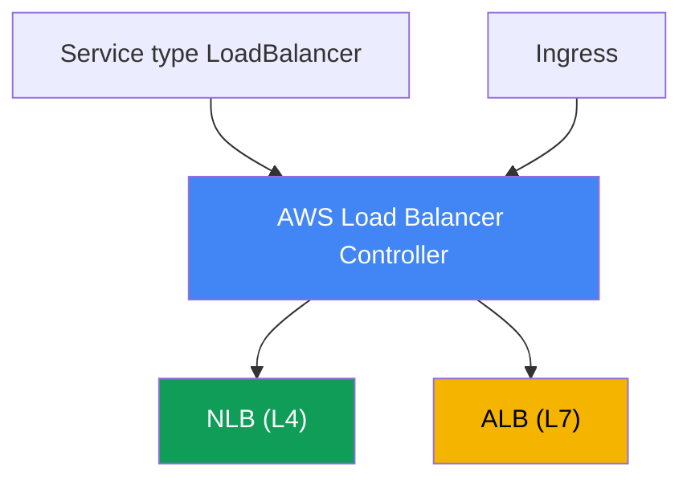
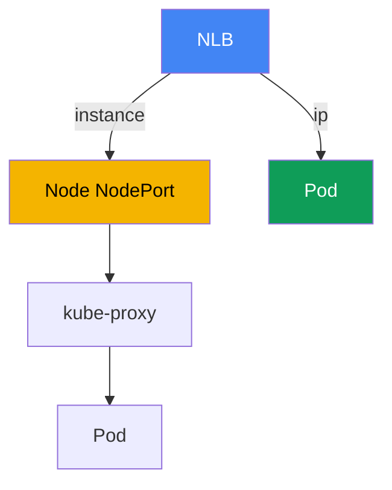

[Русская версия](ru.md) · [Versión en español](es.md) · [Version française](fr.md) · [Deutsche Version](de.md) · [ქართული ვერსია](ge.md) · [繁體中文版](tw.md) · [日本語版](jp.md)
# Chapter 26. AWS Load Balancer Controller and a LoadBalancer Service: NLB

> **What comes next.** This begins Part 5, about networking and traffic. Parts 3 and 4 covered
> identity, security, and storage; now we examine how outside traffic reaches the cluster. The first
> layer is a load balancer in front of the pods. This chapter covers L4 load balancing through a
> Network Load Balancer and a LoadBalancer Service. L7 routing through Ingress and ALB is chapter
> 27, Gateway API and VPC Lattice are chapter 28, DNS and certificates (external-dns, ACM,
> cert-manager) are chapter 29. How a pod receives an IP in the VPC (VPC CNI) is covered in chapter
> 8, and the controller role through IRSA or Pod Identity is covered in chapters 16-17. We refer to
> them rather than repeat them.

## 26.1. "I requested a LoadBalancer and got an old Classic Load Balancer"

An engineer exposes a service using the customary Kubernetes approach, a LoadBalancer Service:

```yaml
apiVersion: v1
kind: Service
metadata:
  name: web
spec:
  type: LoadBalancer
  selector: {app: web}
  ports:
    - port: 80
      targetPort: 8080
```

They apply it, wait for the external address, and inspect what was created:

```bash
kubectl get svc web
# NAME  TYPE           EXTERNAL-IP                             PORT(S)
# web   LoadBalancer   a1b2...elb.eu-central-1.amazonaws.com   80:31842/TCP
```

An address was issued and the service is reachable. But in the EC2 console, that DNS name turns
out to be a **Classic Load Balancer**, a previous-generation load balancer that AWS no longer
actively develops. It was created by the built-in in-tree cloud provider, embedded in Kubernetes
components. The engineer needs a Network Load Balancer instead: static IPs, UDP support,
high-performance L4 operation, and pod IP targets. They also want to manage health checks and
target groups declaratively from a manifest, rather than through clicks in the console.

The problem runs deeper than one load balancer type. The in-tree provider can do little, has sparse
configuration, is tied to the Kubernetes lifecycle, and is effectively frozen. Manually creating
NLBs and target groups in the console or through Terraform outside the cluster does not scale: every
change to the set of nodes or pods requires manual target re-registration, and those targets drift
from the cluster's actual state. A controller is needed that lives in the cluster, sees Services and
Endpoints, and itself brings NLBs and target groups into alignment. That controller is the AWS Load
Balancer Controller, and the networking part of this course begins with it.

## 26.2. AWS Load Balancer Controller: what it is and how to install it

AWS Load Balancer Controller (LBC for short) is a Kubernetes controller that watches cluster
resources and creates Elastic Load Balancing resources for them. It covers two scenarios:

- It turns a **LoadBalancer Service** into a **Network Load Balancer** (NLB, L4). This is the
  subject of this chapter.
- It turns an **Ingress** into an **Application Load Balancer** (ALB, L7). This is the subject of
  chapter 27 and is only mentioned here.



The controller is installed **through Helm**, not as an EKS managed add-on. The official chart is
in the `eks` repository (`https://aws.github.io/eks-charts`):

```bash
helm repo add eks https://aws.github.io/eks-charts
helm repo update
helm install aws-load-balancer-controller eks/aws-load-balancer-controller \
  -n kube-system \
  --set clusterName=<cluster-name> \
  --set serviceAccount.create=false \
  --set serviceAccount.name=aws-load-balancer-controller
```

The controller operates with AWS permissions: it creates and changes NLBs, target groups,
listeners, and security-group rules. It therefore needs an **IAM role** associated with its
ServiceAccount. The role is granted through **IRSA** or **EKS Pod Identity** (chapters 16-17),
which is why the preceding example specifies `serviceAccount.create=false`: the service account
with the role annotation is created in advance.

Permissions are described by the ready-made `iam_policy.json` policy document from the controller
repository. It is used to create an IAM policy (the document conventionally calls it
`AWSLoadBalancerControllerIAMPolicy`) and attach it to the controller role:

```bash
curl -o iam_policy.json https://raw.githubusercontent.com/kubernetes-sigs/\
aws-load-balancer-controller/main/docs/install/iam_policy.json
aws iam create-policy --policy-name AWSLoadBalancerControllerIAMPolicy \
  --policy-document file://iam_policy.json
```

Without a role, or with a restricted policy, the controller starts but cannot create a load
balancer: the Service remains in `<pending>`, and the controller logs show `AccessDenied`.

## 26.3. In-tree cloud provider versus LB Controller and external mode

Let us examine why a Classic Load Balancer appeared in 26.1. Historically, a LoadBalancer Service
was handled by the **built-in in-tree cloud provider**, AWS code inside
`kube-controller-manager` (later moved into `cloud-controller-manager`). By default, it is the
component that reconciles LoadBalancer Services and creates a CLB for them. Its capabilities are
limited, its development has stopped, and AWS recommends handing this work to LBC.

To make LBC take over reconciliation, mark the Service with this annotation:

```yaml
service.beta.kubernetes.io/aws-load-balancer-type: external
```

The value `external` signals to the in-tree provider: "do not touch this Service; an external
controller will handle it." LBC sees the annotation and creates an NLB. There is also a second,
newer approach, the `spec.loadBalancerClass: service.k8s.aws/nlb` field. It does the same thing in
a cloud-provider-independent way. In recent LBC versions, a mutating webhook automatically sets
`loadBalancerClass`, effectively making the controller the default handler for new LoadBalancer
Services.

One important operational rule: **do not add or change the `aws-load-balancer-type` annotation on
an existing Service**. Changing the handler on a live service leads to desynchronization: it can
leak previously created AWS resources or, conversely, suddenly expose an NLB to the internet. Set
the handler type when the Service is created.

| Property | In-tree cloud provider | AWS Load Balancer Controller |
|---|---|---|
| What it creates for an LB Service | Classic Load Balancer | Network Load Balancer |
| Where it runs | inside Kubernetes components | separate controller in the cluster |
| Installation | built in | Helm, its own IAM role |
| Development | frozen | active, recommended by AWS |
| How to enable LBC | - | `aws-load-balancer-type: external` |

## 26.4. NLB through a LoadBalancer Service: key annotations

NLB behavior is configured through Service annotations. The names are long, but all use the prefix
`service.beta.kubernetes.io/aws-load-balancer-`. The basic set is:

- **`aws-load-balancer-type: external`**: hand the Service to LBC (26.3).
- **`aws-load-balancer-nlb-target-type`**: target type, `instance` or `ip` (26.5).
- **`aws-load-balancer-scheme`**: `internal` or `internet-facing`. Since v2.2.0, the controller
  creates an **`internal`** NLB by default; specify the scheme explicitly to create a public one.
  This prevents accidentally exposing a service externally.
- **`aws-load-balancer-healthcheck-*`**: target-group health-check parameters: `-protocol`,
  `-port`, `-path`, `-interval`, `-timeout`, `-healthy-threshold`, `-unhealthy-threshold`, and
  `-success-codes`.

A typical manifest for a public NLB with pod IP targets:

```yaml
apiVersion: v1
kind: Service
metadata:
  name: web
  annotations:
    service.beta.kubernetes.io/aws-load-balancer-type: external
    service.beta.kubernetes.io/aws-load-balancer-nlb-target-type: ip
    service.beta.kubernetes.io/aws-load-balancer-scheme: internet-facing
    service.beta.kubernetes.io/aws-load-balancer-healthcheck-protocol: http
    service.beta.kubernetes.io/aws-load-balancer-healthcheck-path: /healthz
spec:
  type: LoadBalancer
  selector: {app: web}
  ports:
    - port: 80
      targetPort: 8080
      protocol: TCP
```

| Annotation | Values | Default |
|---|---|---|
| `aws-load-balancer-type` | `external` | handled by in-tree |
| `aws-load-balancer-nlb-target-type` | `instance`, `ip` | `instance` |
| `aws-load-balancer-scheme` | `internal`, `internet-facing` | `internal` |
| `aws-load-balancer-healthcheck-protocol` | `tcp`, `http`, `https` | `tcp` (Cluster) |
| `aws-load-balancer-healthcheck-interval` | seconds | `10` |
| `aws-load-balancer-healthcheck-healthy-threshold` | number | `3` |

The controller defines default health-check values (interval `10`, timeout `10`, thresholds `3`,
and codes `200-399`); override them only when necessary. Other useful annotations include
`aws-load-balancer-name`, `aws-load-balancer-subnets`, `aws-load-balancer-ssl-cert` (TLS
termination with an ACM certificate), and `aws-load-balancer-attributes` (NLB attributes, such as
cross-zone).

Two annotations are especially useful in production. `aws-load-balancer-eip-allocations` associates
preallocated Elastic IPs with a public NLB (one allocation per subnet), making the service's
external addresses static and able to survive NLB recreation. Meanwhile,
`aws-load-balancer-target-group-attributes` sets target-group attributes as a `key=value` string.
The `deregistration_delay.timeout_seconds` key (for example, `15` or `30` instead of the default
`300`) shortens the pause before a target is removed from the group, so during a deployment the NLB
can gracefully drain TCP sessions without keeping a pod in draining for unnecessary minutes
(graceful deregistration).

**Cross-zone load balancing.** NLB cross-zone load balancing is **disabled** by default at the
target-group level (unlike ALB, where it is always enabled): an NLB in each zone sends traffic only
to targets in its own zone. If pods are unevenly distributed across AZs, the load on replicas is
uneven. Enable it through the same `target-group-attributes`:
`cross_zone.load_balancing.enabled=true`. The trade-off is FinOps: distributing load across all
pods in all zones versus the cost of inter-zone traffic (cross-AZ data transfer is billed). It
interacts with `externalTrafficPolicy` (section 26.6): `Local` also keeps traffic within the node
and amplifies skew when placement is asymmetric.

**Security groups and IaC drift.** Since v2.6.0, LBC can create a frontend security group for an
NLB itself and modify backend SG rules on nodes and pods. If all networking and SGs are managed
through Terraform or Terragrunt, these automatic changes create state drift: `plan` shows rule
changes that are not in the code. Manage this with two annotations:
`aws-load-balancer-manage-backend-security-group-rules: "false"` puts backend SG rules under your
IaC's control, while `aws-load-balancer-security-groups` associates existing Terraform-created
frontend groups with the NLB instead of creating them automatically. Then each SG has one owner and
there is no drift.

## 26.5. target-type: instance versus ip

The key decision when using an NLB is where the load balancer sends traffic. There are two modes.

**`instance`**: an EC2 node, specifically its `NodePort`, is the target in the group. The NLB sends
packets to the `NodePort` of any cluster node, and `kube-proxy` on that node then delivers traffic
to the pod using iptables or IPVS rules. The pod may be on another node, which adds an extra
inter-node network hop, and the result depends on `externalTrafficPolicy` (26.6). The Service must
be of type `NodePort` or `LoadBalancer`.

**`ip`**: the target is the **pod's own IP**. This is possible because VPC CNI gives the pod a real
VPC address (chapter 8), routable in the AWS network. The NLB sends traffic directly to the pod,
bypassing `NodePort` and `kube-proxy`: one fewer hop and no dependency on the node where the pod
runs. The `ip` mode is **required for Fargate**, which simply has no ordinary EC2 nodes or
`NodePort`.



The `ip` mode has network requirements: the pod must receive a VPC address (VPC CNI, chapter 8),
and security groups and subnets must allow the NLB to reach the pod port. Since v2.6.0, the
controller itself creates and associates frontend and backend security groups with the NLB and
modifies access rules; in earlier versions, it added inbound rules to the node security group.

| Criterion | `instance` | `ip` |
|---|---|---|
| Target | node `NodePort` | pod IP directly |
| Traffic path | NLB -> NodePort -> kube-proxy -> pod | NLB -> pod |
| Extra inter-node hop | possible | none |
| Service type | `NodePort` or `LoadBalancer` | any with VPC CNI |
| Fargate | does not work | required |
| Client source IP | depends on `externalTrafficPolicy` | depends on target-group attribute |
| Requirements | open `NodePort` | VPC CNI, reachable SG/subnet |

As a practical rule, use `ip` by default on EC2 with VPC CNI: there are fewer hops and preserving
the client IP is simpler. Choose `instance` when ingress through `NodePort` is specifically needed
or a particular network design requires it.

## 26.6. externalTrafficPolicy: Cluster versus Local

The `spec.externalTrafficPolicy` field on a Service controls how a node handles external traffic and
is particularly important in `instance` mode.

**`Cluster`** (the default): `kube-proxy` can forward traffic that arrived at the `NodePort` of any
node to a pod on **another** node. Load balancing is even across all pods, but an additional
inter-node hop is added and SNAT occurs, so the **client's source IP is lost**: the pod sees the
node address. All cluster nodes respond to health checks, including those without the required pod.

**`Local`**: a node sends traffic **only to its own local pods** and does not forward it further.
There is no extra hop, and the **client source IP is preserved**. The cost is that if a node has no
Service pod, its health check becomes unhealthy and the NLB stops sending it traffic; when pods are
unevenly distributed across nodes, load balancing becomes uneven. Correct operation with Local
requires reasonably spreading pods across nodes (topology spread, chapter 40).

This is directly connected to the health checks in 26.4. The controller considers the policy: with
`Cluster`, the default health-check protocol is `tcp`; with `Local`, `http` through
`spec.healthCheckNodePort` is recommended, and `tcp` should not be used with `Local` because it
does not distinguish a node with a pod from one without it.

| Aspect | `Cluster` | `Local` |
|---|---|---|
| Forwarding to a pod on another node | yes | no |
| Extra hop | possible | none |
| Client source IP | lost (SNAT) | preserved |
| Health checks answered by | all nodes | only nodes with pods |
| Distribution | even | depends on placement |

In `ip` mode, the picture differs: traffic already goes directly to the pod, and preserving the
client IP is controlled by the `preserve_client_ip` target-group attribute (it is disabled by
default for `ip` and enabled for `instance`). If the application needs the client's source IP,
verify it separately: through the policy for `instance`, or through the target-group attribute for
`ip`.

## 26.7. NLB versus ALB: when to use which

LBC supports both load balancers, and choosing between them means choosing an OSI model layer. This
is brief, without duplicating chapter 27, where ALB is covered in detail.

- **NLB is L4.** It operates at the TCP and UDP level and does not parse HTTP. This gives it its
  strengths: very high performance and low latency, UDP support, static IPs per subnet, and the
  ability to associate Elastic IPs. Use it for non-HTTP protocols (gRPC over TCP, UDP game
  services, databases, brokers) and wherever bare L4 without request parsing is needed.
- **ALB is L7.** It understands HTTP and HTTPS: host- and path-based routing, headers, redirects,
  authentication, and WAF integration. It is the choice for web applications and APIs that need
  content-based routing. In EKS, an ALB is usually created from an Ingress (chapter 27).

NLB is the only option for applications using **UDP** (DNS, media streaming, game servers) and for
**QUIC (HTTP/3)** over UDP: ALB works only with TCP, HTTP, HTTPS, and HTTP/2, not UDP or QUIC. If
an application needs inbound HTTP/3, terminate it at an NLB (or at its own proxy behind an NLB),
not an ALB.

A rough rule: use ALB through Ingress (chapter 27) for HTTP routing by paths and hosts; use NLB
through a LoadBalancer Service, as in this chapter, for pure L4, UDP, QUIC, static IPs, or maximum
throughput.

## 26.8. gRPC and service mesh: why L4 does not balance streams

Part of the backend communicates over gRPC (HTTP/2), and after scaling, load does not spread: one
replica is overloaded while new ones sit idle. The reason is that a gRPC client opens **one
long-lived HTTP/2 connection** and multiplexes all RPCs over it. Service and NLB operate at L4
(connection level): they balance connections, not requests. Since there is one connection, all of a
client's traffic sticks to one pod, while added replicas sit idle. The same occurs with any
persistent connections (databases, brokers, WebSockets).

`kube-proxy` and NLB see a TCP connection as the unit of balancing and do not parse the hundreds of
independent requests inside it. To distribute load **per request**, an L7 layer that understands
HTTP/2 is needed. There are three options.

**Option 1: an L7 load balancer for north-south gRPC.** Route external gRPC through ALB: set
`alb.ingress.kubernetes.io/backend-protocol-version: GRPC` on the Ingress, and ALB balances at the
request level while also supporting gRPC health checks. ALB and Ingress are covered in chapter 27;
the key point here is that L7 removes sticking for incoming gRPC.

**Option 2: client-side balancing.** A Headless Service (`clusterIP: None`) gives the client not one
VIP, but all pod addresses. The gRPC client itself distributes RPCs among them with the
`round_robin` policy. The price is that the client must support client-side LB and re-resolve DNS
on scale changes, otherwise new pods will not enter the pool.

**Option 3: service mesh for east-west traffic.** For service-to-service communication, deploy Istio
or Linkerd: a sidecar proxy appears beside the pod (Istio also has an ambient mode without a
sidecar), providing L7 per-request balancing for gRPC and HTTP/2. The mesh also provides mTLS,
retries, timeouts, circuit breaking, traffic locality, and observability (golden signals). Istio is
covered in depth in a separate ICA course.

The honest cost of a mesh on EKS: sidecar proxies add CPU and memory consumption and some latency;
the mesh has its own lifecycle and upgrades (it is not a managed add-on); diagnostics become more
complex; and integration with VPC CNI and NetworkPolicy (chapter 30) must be considered. Istio
ambient removes part of the overhead by eliminating the per-pod sidecar.

Which to use: for one or two external gRPC services, use ALB with GRPC (chapter 27); for many
internal services that need mTLS, retries, and observability, use a mesh. Do not bring in a mesh
only to balance one gRPC service: the complexity will not pay off.

| Approach | What it balances | What it provides | Cost |
|---|---|---|---|
| NLB / Service (L4) | connections | simple L4, high throughput | gRPC sticks to a pod |
| ALB gRPC (L7) | north-south requests | per-request LB, gRPC health check | HTTP/2 only, inbound external traffic |
| headless + client-side LB | client requests | no proxy, minimal hops | client support, re-resolve |
| Istio/Linkerd service mesh | east-west requests | per-request LB, mTLS, retries, metrics | overhead, its own upgrades |

## 26.9. How this is used in production

- **LBC is the standard; in-tree is not used.** Install the controller once through Helm with an
  IRSA/Pod Identity role, and route all external services through it; treat CLB creation by the
  built-in provider as a legacy scenario.
- **`ip` by default on EC2 with VPC CNI.** Pod IP targets mean fewer hops and simpler client IP
  handling; reserve `instance` for cases that require ingress through `NodePort`.
- **Set `scheme` explicitly.** Create a public NLB only with `internet-facing` and with awareness
  that the service is exposed to the internet; the controller defaults to `internal`, and that is
  the right default.
- **Minimal IAM policy and narrow sources.** Grant roles exactly the permissions from
  `iam_policy.json`, and restrict access to the NLB through `spec.loadBalancerSourceRanges` rather
  than leave `0.0.0.0/0`.
- **Set the handler type at creation.** Do not change `aws-load-balancer-type` on a live Service, to
  avoid resource leaks or unexpectedly exposing an NLB.
- **Static IPs and graceful deployment.** Give a public NLB Elastic IPs through
  `aws-load-balancer-eip-allocations`, and reduce `deregistration_delay.timeout_seconds` in
  `aws-load-balancer-target-group-attributes` so deployments do not break TCP sessions.

## 26.10. Mini glossary

- **AWS Load Balancer Controller (LBC)**: a controller in the cluster that creates NLBs for
  LoadBalancer Services and ALBs for Ingress; installed through Helm and requires an IAM role.
- **in-tree cloud provider**: AWS code built into Kubernetes components that creates a Classic Load
  Balancer for LoadBalancer Services by default.
- **NLB (Network Load Balancer)**: an L4 (TCP/UDP) load balancer with high performance and static
  IPs; created by LBC from a LoadBalancer Service.
- **external mode**: the `aws-load-balancer-type` annotation value that hands Service
  reconciliation to the external LBC controller instead of the in-tree provider.
- **target-type**: an NLB target type: `instance` (through a node `NodePort`) or `ip` (directly to
  a pod IP; requires VPC CNI and is mandatory on Fargate).
- **externalTrafficPolicy**: a Service policy: `Cluster` (forwarding to any node, SNAT) or `Local`
  (local pods only, preserves client IP).
- **preserve_client_ip**: an NLB target-group attribute that controls preservation of the client's
  source IP in `ip` mode.

## 26.11. Chapter summary

- A LoadBalancer Service is handled by the built-in in-tree cloud provider by default and creates a
  legacy Classic Load Balancer with minimal configuration.
- AWS Load Balancer Controller is a controller in the cluster that creates NLBs for LoadBalancer
  Services and ALBs for Ingress (Ingress is chapter 27). It is installed through Helm, not as a
  managed add-on, and requires an IAM role through IRSA or Pod Identity (chapters 16-17), with the
  policy from `iam_policy.json`.
- Hand Service reconciliation to the controller with the
  `service.beta.kubernetes.io/aws-load-balancer-type: external` annotation (or
  `loadBalancerClass: service.k8s.aws/nlb`); set the handler type at creation and do not change it
  on a live Service.
- NLB behavior is configured with annotations: `nlb-target-type`, `scheme` (defaults to
  `internal`), and the `healthcheck-*` family. A public NLB requires explicit
  `internet-facing`.
- `instance` sends traffic to a node `NodePort` and then through `kube-proxy` to the pod (an extra
  hop is possible); `ip` sends it directly to a pod IP through VPC CNI (chapter 8), with fewer
  hops, and is mandatory on Fargate.
- `externalTrafficPolicy: Cluster` balances evenly but loses the client IP and adds a hop; `Local`
  preserves the client IP and removes the hop, but only nodes with pods pass health checks.
- NLB is L4 (TCP/UDP, static IPs, performance); ALB is L7 (HTTP routing), and it is covered in
  detail in chapter 27.

## 26.12. How this helps in real work

On call, NLB network incidents usually come down to a few causes. If a Service is stuck in
`<pending>` with no external address, check whether the controller is installed, whether its role
has permissions (`AccessDenied` in logs), and whether the `external` annotation is set. If the load
balancer exists but targets are `unhealthy`, investigate the health check (protocol and port under
`externalTrafficPolicy`) and security-group access to the pod port in `ip` mode. If the application
does not see the client's source IP, that is not a bug but a consequence of `Cluster` in `instance`
mode or disabled `preserve_client_ip` in `ip` mode. When planning, decide two things in advance:
target type (`ip` by default on EC2 with VPC CNI) and scheme (`internal` if the service must not be
exposed to the internet). Remember the irreversibility: handler type and many parameters are fixed
when a Service is created, so designing is easier than rebuilding under live traffic.

## 26.13. Self-check questions

1. Why does a normal LoadBalancer Service in EKS create a Classic Load Balancer by default?
2. What is AWS Load Balancer Controller, and which two kinds of load balancers does it create?
3. Why is LBC installed through Helm rather than as a managed add-on, and why does it need an IAM role?
4. How is the controller role granted, and where does its IAM policy come from?
5. What does the `aws-load-balancer-type: external` annotation do, and why is it not changed later?
6. Which key annotations configure an NLB, and which scheme is created by default?
7. How does `target-type: instance` differ from `ip` in the traffic path and number of hops?
8. Why does Fargate require `target-type: ip`, and what does VPC CNI (chapter 8) have to do with it?
9. How do `externalTrafficPolicy: Cluster` and `Local` affect the client source IP and hops?
10. Why do not all nodes pass health checks with `Local`, and how can this affect distribution?
11. How can you preserve the client's source IP in `ip` mode, and how does this differ from `instance` mode?
12. When should you choose NLB versus ALB, and which chapter covers ALB?
13. A Service is stuck in `<pending>` without an external address. What do you check, and in what order?
14. How can you give a public NLB static addresses and reduce TCP session breaks during deployment?

## Practice

The course lab for this topic is [lab 108: AWS Load Balancer Controller: NLB for a LoadBalancer
Service](../../labs/108/README.MD). Apart from it, everything is checked on a live cluster. First,
make sure the controller is installed and healthy, then inspect its service account and associated
role:

```bash
kubectl get deploy -n kube-system aws-load-balancer-controller
kubectl get pods -n kube-system | grep load-balancer
kubectl get sa -n kube-system aws-load-balancer-controller -o yaml
```

Next, reproduce the difference between modes. Create a LoadBalancer Service with the annotations
`aws-load-balancer-type: external`, `aws-load-balancer-nlb-target-type: ip`, and
`aws-load-balancer-scheme: internal`, wait for an address (`kubectl get svc web -w`), and find the
created NLB on the AWS side: `aws elbv2 describe-load-balancers` shows the load balancer and its
`Scheme`, `aws elbv2 describe-target-groups` shows the target groups, and `aws elbv2
describe-target-health --target-group-arn <arn>` shows what is registered as a target. In `ip`
mode, the targets will be pod IPs; switch to `instance` (in a new Service, without changing the
existing one) and compare: the targets will become nodes with `NodePort`.

Also examine health checks and the client IP: change `externalTrafficPolicy` between `Cluster` and
`Local` and observe how the set of healthy targets changes and whether the application's logs show
the client's source IP. Finally, verify permissions: temporarily restrict the role policy, recreate
the Service, and find `AccessDenied` in the logs
(`kubectl logs -n kube-system deploy/aws-load-balancer-controller`), then restore the policy.

---
[Table of contents](../README.md) · [Chapter 25](../25/en.md) · [Chapter 27](../27/en.md)
