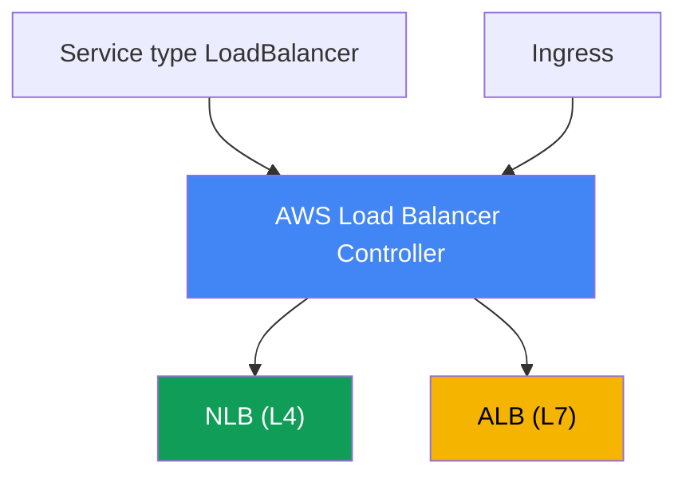
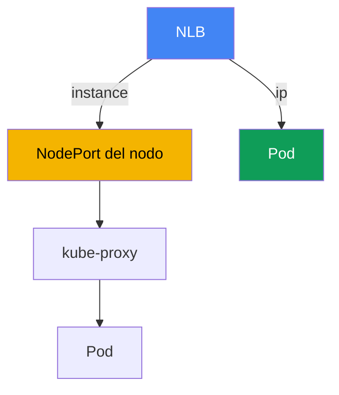

[English version](en.md) · [Русская версия](ru.md) · [Version française](fr.md) · [Deutsche Version](de.md) · [ქართული ვერსია](ge.md) · [繁體中文版](tw.md) · [日本語版](jp.md)
# Capítulo 26. AWS Load Balancer Controller y Service de tipo LoadBalancer: NLB

> **Qué sigue.** Este es el inicio de la Parte 5, sobre red y tráfico. Las partes 3 y 4 cubrieron
> identidad, seguridad y almacenamiento; ahora veremos cómo el tráfico externo llega al clúster.
> La primera capa es el balanceador delante de los pods. Este capítulo cubre el balanceo L4 mediante
> Network Load Balancer y Service de tipo LoadBalancer. El enrutamiento L7 mediante Ingress y ALB se
> trata en el capítulo 27, Gateway API y VPC Lattice en el capítulo 28, y DNS y certificados
> (external-dns, ACM, cert-manager) en el capítulo 29. Cómo un pod recibe una IP en la VPC (VPC CNI)
> se explica en el capítulo 8, y el rol del controlador mediante IRSA o Pod Identity en los capítulos
> 16-17. Se hará referencia a ellos sin repetirlos.

## 26.1. «Pedí LoadBalancer y recibí un antiguo Classic Load Balancer»

Un ingeniero publica un servicio mediante la forma habitual de Kubernetes, un Service de tipo
LoadBalancer:

```yaml
apiVersion: v1
kind: Service
metadata:
  name: web
spec:
  type: LoadBalancer
  selector: {app: web}
  ports:
    - port: 80
      targetPort: 8080
```

Lo aplica, espera una dirección externa y observa qué se ha creado:

```bash
kubectl get svc web
# NAME  TYPE           EXTERNAL-IP                             PORT(S)
# web   LoadBalancer   a1b2...elb.eu-central-1.amazonaws.com   80:31842/TCP
```

Se asignó la dirección y el servicio es accesible. Pero en la consola de EC2, bajo ese nombre DNS,
resulta haber un **Classic Load Balancer**, un balanceador de la generación anterior que AWS hace
mucho dejó de desarrollar. Lo creó el in-tree cloud provider integrado en los componentes de
Kubernetes. Sin embargo, el ingeniero necesita un Network Load Balancer: IP estáticas, soporte de
UDP, alto rendimiento L4 y targets en las IP de los pods. Además, quiere gestionar los health check
y los target groups de forma declarativa, desde el manifiesto, no con clics en la consola.

El problema va más allá de un tipo de balanceador. El proveedor in-tree ofrece poco, tiene pocas
opciones de configuración, está ligado al ciclo de vida de Kubernetes y, en la práctica, está
congelado. Crear manualmente NLB y target groups en la consola o con Terraform fuera del clúster no
escala: en cada cambio del conjunto de nodos o pods hay que volver a registrar los targets a mano, y
estos divergen del estado real del clúster. Se necesita un controlador que viva en el clúster, vea
los Service y Endpoints, y mantenga NLB y target groups acordes con ellos. Ese controlador es AWS
Load Balancer Controller, y con él comienza toda la sección de red del curso.

## 26.2. AWS Load Balancer Controller: qué es y cómo se instala

AWS Load Balancer Controller (abreviado LBC) es un controlador de Kubernetes que observa los
recursos del clúster y crea Elastic Load Balancing para ellos. Cubre dos casos:

- Para un **Service de tipo LoadBalancer**, crea un **Network Load Balancer** (NLB, L4). Es el tema
  de este capítulo.
- Para un **Ingress**, crea un **Application Load Balancer** (ALB, L7). Es el tema del capítulo 27;
  aquí solo se menciona.



El controlador se instala **mediante Helm**, no como un managed addon de EKS. El chart oficial se
encuentra en el repositorio `eks` (`https://aws.github.io/eks-charts`):

```bash
helm repo add eks https://aws.github.io/eks-charts
helm repo update
helm install aws-load-balancer-controller eks/aws-load-balancer-controller \
  -n kube-system \
  --set clusterName=<cluster-name> \
  --set serviceAccount.create=false \
  --set serviceAccount.name=aws-load-balancer-controller
```

El controlador actúa en AWS: crea y modifica NLB, target groups, listeners y reglas de security
groups. Por tanto, necesita un **rol de IAM** asociado a su ServiceAccount. El rol se concede
mediante **IRSA** o **EKS Pod Identity** (capítulos 16-17), de ahí que en el ejemplo anterior
`serviceAccount.create=false`: el service account con la anotación del rol se crea previamente.

Los permisos están definidos en el documento de política listo para usar `iam_policy.json` del
repositorio del controlador. A partir de él se crea una política de IAM (por convención del documento
se llama `AWSLoadBalancerControllerIAMPolicy`) y se asocia al rol del controlador:

```bash
curl -o iam_policy.json https://raw.githubusercontent.com/kubernetes-sigs/\
aws-load-balancer-controller/main/docs/install/iam_policy.json
aws iam create-policy --policy-name AWSLoadBalancerControllerIAMPolicy \
  --policy-document file://iam_policy.json
```

Sin el rol, o con una política recortada, el controlador se inicia pero no puede crear el
balanceador: el Service queda en `<pending>` y en los logs del controlador aparece `AccessDenied`.

## 26.3. In-tree cloud provider frente a LB Controller y modo external

Veamos por qué apareció un Classic Load Balancer en 26.1. Históricamente, un Service de tipo
LoadBalancer era procesado por el **in-tree cloud provider integrado**, código de AWS dentro de
`kube-controller-manager` (más adelante trasladado a `cloud-controller-manager`). Por defecto, es
este quien reconcilia el Service de tipo LoadBalancer y crea un CLB para él. Sus capacidades son
limitadas, su desarrollo está detenido y AWS recomienda delegar este trabajo en LBC.

Para que LBC asuma la reconciliación, el Service se marca con una anotación:

```yaml
service.beta.kubernetes.io/aws-load-balancer-type: external
```

El valor `external` indica al proveedor in-tree «no toques este Service, lo gestionará un
controlador externo». LBC detecta la anotación y crea un NLB. Existe una segunda forma más moderna,
el campo `spec.loadBalancerClass: service.k8s.aws/nlb`; hace lo mismo de manera independiente del
Cloud Provider. En versiones recientes, LBC instala un mutating webhook que establece
`loadBalancerClass` automáticamente, haciendo que el controlador sea de facto el gestor
predeterminado de los nuevos Service de tipo LoadBalancer.

Una regla operativa importante: **la anotación `aws-load-balancer-type` no se agrega ni se modifica
en un Service existente**. Cambiar el gestor en un servicio activo causa desincronización: puede
filtrar recursos de AWS previamente creados o, por el contrario, publicar inesperadamente un NLB en
Internet. El tipo de gestor se fija al crear el Service.

| Propiedad | In-tree cloud provider | AWS Load Balancer Controller |
|---|---|---|
| Qué crea para un Service LB | Classic Load Balancer | Network Load Balancer |
| Dónde se ejecuta | dentro de los componentes de Kubernetes | controlador independiente en el clúster |
| Instalación | integrado | Helm, su propio rol de IAM |
| Desarrollo | congelado | activo, recomendado por AWS |
| Cómo habilitar LBC | - | `aws-load-balancer-type: external` |

## 26.4. NLB mediante Service de tipo LoadBalancer: anotaciones clave

El comportamiento de NLB se configura mediante anotaciones en el Service. Sus nombres son largos,
pero obedecen al mismo prefijo `service.beta.kubernetes.io/aws-load-balancer-`. El conjunto básico:

- **`aws-load-balancer-type: external`**: delega el Service al controlador LBC (26.3).
- **`aws-load-balancer-nlb-target-type`**: tipo de target, `instance` o `ip` (26.5).
- **`aws-load-balancer-scheme`**: `internal` o `internet-facing`. De forma predeterminada, desde la
  versión v2.2.0 el controlador crea NLB **`internal`**; para obtener uno público, el esquema debe
  indicarse explícitamente. Es una protección frente a publicar accidentalmente un servicio.
- **`aws-load-balancer-healthcheck-*`**: parámetros del health check del target group: `-protocol`,
  `-port`, `-path`, `-interval`, `-timeout`, `-healthy-threshold`, `-unhealthy-threshold`,
  `-success-codes`.

Un manifiesto típico de un NLB público con targets en las IP de los pods:

```yaml
apiVersion: v1
kind: Service
metadata:
  name: web
  annotations:
    service.beta.kubernetes.io/aws-load-balancer-type: external
    service.beta.kubernetes.io/aws-load-balancer-nlb-target-type: ip
    service.beta.kubernetes.io/aws-load-balancer-scheme: internet-facing
    service.beta.kubernetes.io/aws-load-balancer-healthcheck-protocol: http
    service.beta.kubernetes.io/aws-load-balancer-healthcheck-path: /healthz
spec:
  type: LoadBalancer
  selector: {app: web}
  ports:
    - port: 80
      targetPort: 8080
      protocol: TCP
```

| Anotación | Valores | Predeterminado |
|---|---|---|
| `aws-load-balancer-type` | `external` | lo procesa in-tree |
| `aws-load-balancer-nlb-target-type` | `instance`, `ip` | `instance` |
| `aws-load-balancer-scheme` | `internal`, `internet-facing` | `internal` |
| `aws-load-balancer-healthcheck-protocol` | `tcp`, `http`, `https` | `tcp` (Cluster) |
| `aws-load-balancer-healthcheck-interval` | segundos | `10` |
| `aws-load-balancer-healthcheck-healthy-threshold` | número | `3` |

Los valores predeterminados del health check (intervalo `10`, timeout `10`, umbrales `3`, códigos
`200-399`) los define el controlador; solo se deben sobrescribir cuando sea necesario. Otras
anotaciones útiles son: `aws-load-balancer-name`, `aws-load-balancer-subnets`,
`aws-load-balancer-ssl-cert` (terminación TLS con un certificado de ACM) y
`aws-load-balancer-attributes` (atributos de NLB, por ejemplo cross-zone).

Dos anotaciones ayudan especialmente en producción. `aws-load-balancer-eip-allocations` asocia a un
NLB público Elastic IP asignadas previamente (una allocation por subred): las direcciones externas
del servicio se vuelven estáticas y sobreviven a la recreación del NLB. Por su parte,
`aws-load-balancer-target-group-attributes` establece los atributos del target group como una cadena
`clave=valor`; con la clave `deregistration_delay.timeout_seconds` (por ejemplo `15` o `30` en vez
del valor predeterminado `300`) se acorta la espera para retirar un target del grupo, para que,
durante un despliegue, NLB permita completar las sesiones TCP sin mantener un pod en draining
minutos de más (graceful deregistration).

**Balanceo entre zonas.** En NLB, cross-zone load balancing está **desactivado** por defecto a nivel
del target group (a diferencia de ALB, donde siempre está activado): NLB en cada zona envía tráfico
solo a los targets de su propia zona. Si los pods se distribuyen de forma asimétrica entre AZ, la
carga sobre las réplicas queda desequilibrada. Se activa con los mismos `target-group-attributes`:
`cross_zone.load_balancing.enabled=true`. El compromiso es de FinOps: equilibrar la carga entre
todos los pods de todas las zonas frente al coste del tráfico entre zonas (cross-AZ data transfer se
factura). Interactúa con `externalTrafficPolicy` (sección 26.6): `Local` también mantiene el
tráfico dentro del nodo y acentúa el desequilibrio cuando la distribución es asimétrica.

**Security groups y deriva de IaC.** Desde la versión v2.6.0, LBC puede crear por sí mismo un
frontend security group para NLB y modificar las reglas del backend SG de nodos y pods. Si toda la
red y los SG se gestionan con Terraform o Terragrunt, estos cambios automáticos generan deriva de
estado: `plan` muestra cambios en reglas que no están en el código. Se controla con dos anotaciones:
`aws-load-balancer-manage-backend-security-group-rules: "false"` deja las reglas del backend SG bajo
control de tu IaC, y `aws-load-balancer-security-groups` asocia a NLB grupos frontend creados antes
con Terraform en lugar de crearlos automáticamente. Así cada SG tiene un único propietario y no hay
deriva.

## 26.5. target-type: instance frente a ip

La elección clave al trabajar con NLB es a dónde envía tráfico el balanceador. Hay dos modos.

**`instance`**: el target del grupo es un nodo EC2, más exactamente su `NodePort`. NLB envía
paquetes al `NodePort` de cualquier nodo del clúster; después, `kube-proxy` de ese nodo entrega el
tráfico al pod según reglas de iptables o IPVS. El pod puede estar en otro nodo, lo que añade un hop
de red entre nodos, y el resultado depende de `externalTrafficPolicy` (26.6). El Service debe ser de
tipo `NodePort` o `LoadBalancer`.

**`ip`**: el target es la **IP del propio pod**. Esto es posible porque VPC CNI da al pod una
dirección real de la VPC (capítulo 8), enrutable en la red de AWS. NLB envía tráfico directamente
al pod, evitando `NodePort` y `kube-proxy`: un hop menos y sin depender de en qué nodo viva el pod.
El modo `ip` es **obligatorio para Fargate**, donde no hay nodos EC2 convencionales ni `NodePort`.



El modo `ip` tiene requisitos de red: el pod debe recibir una dirección de VPC (VPC CNI, capítulo
8), y los security groups y subredes deben permitir que NLB alcance el puerto del pod. Desde la
versión v2.6.0, el controlador crea y asocia por sí mismo frontend y backend security groups al NLB,
y ajusta las reglas de acceso; en versiones anteriores añadía reglas inbound al security group de
los nodos.

| Criterio | `instance` | `ip` |
|---|---|---|
| Target | `NodePort` del nodo | IP del pod directamente |
| Ruta del tráfico | NLB -> NodePort -> kube-proxy -> pod | NLB -> pod |
| Hop adicional entre nodos | posible | no |
| Tipo de Service | `NodePort` o `LoadBalancer` | cualquiera con VPC CNI |
| Fargate | no funciona | obligatorio |
| Client source IP | depende de `externalTrafficPolicy` | depende del atributo del target group |
| Requisitos | `NodePort` abierto | VPC CNI, accesibilidad de SG/subred |

Regla práctica: en EC2 con VPC CNI, normalmente se elige `ip`: menos hops y más facilidad para
preservar la IP del cliente. Se elige `instance` cuando se necesita específicamente la entrada por
`NodePort` o lo requiere una arquitectura de red concreta.

## 26.6. externalTrafficPolicy: Cluster frente a Local

El campo `spec.externalTrafficPolicy` de un Service controla cómo trata un nodo el tráfico externo y
es especialmente importante en modo `instance`.

**`Cluster`** (valor predeterminado): el tráfico que llega al `NodePort` de cualquier nodo puede ser
reenviado por `kube-proxy` a un pod en **otro** nodo. El balanceo se reparte uniformemente entre
todos los pods, pero aparece un hop adicional entre nodos y se realiza SNAT: **se pierde la IP de
origen del cliente**, el pod ve la dirección del nodo. Todos los nodos del clúster responden a los
health check, incluso los que no tienen el pod requerido.

**`Local`**: un nodo envía tráfico **solo a sus pods locales** y no lo reenvía más allá. No hay hop
adicional y **se conserva la client source IP**. El coste es que, si un nodo no tiene ningún pod del
servicio, su health check pasa a unhealthy y NLB deja de enviarle tráfico; si los pods se distribuyen
de forma irregular entre nodos, el balanceo también resulta irregular. Para que Local funcione bien,
es importante repartir razonablemente los pods entre nodos (topology spread, capítulo 40).

Esto se relaciona directamente con el health check de 26.4. El controlador tiene en cuenta la
política: con `Cluster`, el protocolo de health check predeterminado es `tcp`; con `Local`, se
recomienda `http` mediante `spec.healthCheckNodePort`, y no conviene usar `tcp` con `Local`, pues no
distingue un nodo con pod de uno sin él.

| Aspecto | `Cluster` | `Local` |
|---|---|---|
| Reenvío a un pod de otro nodo | sí | no |
| Hop adicional | posible | no |
| Client source IP | se pierde (SNAT) | se conserva |
| Responden al health check | todos los nodos | solo los nodos con pods |
| Distribución | uniforme | depende de la ubicación de los pods |

En modo `ip`, el panorama es distinto: el tráfico ya va directamente al pod, y conservar la IP del
cliente se controla mediante el atributo `preserve_client_ip` del target group (en `ip` está
desactivado por defecto; en `instance`, activado). Si la aplicación necesita la IP de origen del
cliente, debe verificarse por separado: mediante la política en `instance` o el atributo del target
group en `ip`.

## 26.7. NLB frente a ALB: cuándo usar cada uno

LBC admite ambos balanceadores, y la elección entre ellos es una elección del nivel del modelo OSI.
En resumen, sin duplicar el capítulo 27, donde se explica ALB en detalle.

- **NLB es L4.** Trabaja en TCP y UDP, no interpreta HTTP. De ahí sus puntos fuertes: rendimiento
  muy alto y baja latencia, soporte de UDP, IP estáticas por subred y posibilidad de asociar Elastic
  IP. Se usa para protocolos no HTTP (gRPC sobre TCP, servicios UDP de juegos, bases de datos,
  brokers) y donde se necesita L4 puro sin interpretar las solicitudes.
- **ALB es L7.** Entiende HTTP y HTTPS: enrutamiento por host y path, cabeceras, redirect,
  autenticación e integración con WAF. Es la elección para aplicaciones web y API que necesitan
  enrutamiento por contenido. En EKS, ALB suele crearse desde Ingress (capítulo 27).

NLB es la única elección para aplicaciones sobre **UDP** (DNS, streaming de medios, servidores de
juegos) y para **QUIC (HTTP/3)** sobre UDP: ALB solo funciona con TCP, HTTP, HTTPS y HTTP/2, no con
UDP ni QUIC. Si una aplicación necesita HTTP/3 de entrada, se termina en NLB (o en su propio proxy
detrás de NLB), no en ALB.

Una regla aproximada: enrutamiento HTTP por paths y hosts, ALB mediante Ingress (capítulo 27); L4
puro, UDP, QUIC, IP estáticas o máximo throughput, NLB mediante Service de tipo LoadBalancer, como
en este capítulo.

## 26.8. gRPC y service mesh: por qué L4 no balancea flujos

Parte del backend se comunica mediante gRPC (sobre HTTP/2) y, tras escalar, la carga no se reparte:
una réplica está sobrecargada y las nuevas permanecen inactivas. La razón es que el cliente gRPC abre
**una única conexión HTTP/2 de larga duración** y multiplexa todos los RPC sobre ella. Service y NLB
trabajan en L4 (a nivel de conexión): balancean conexiones, no solicitudes. Puesto que solo hay una
conexión, todo el tráfico del cliente queda adherido a un pod y las réplicas añadidas permanecen
inactivas. Lo mismo ocurre con cualquier conexión persistente (bases de datos, brokers, websocket).

kube-proxy y NLB ven la conexión TCP como la unidad de balanceo y no interpretan que dentro viajan
cientos de solicitudes independientes. Para repartir carga **por solicitud**, se necesita L7 que
entienda HTTP/2. Hay tres opciones.

**Opción 1: balanceador L7 para gRPC north-south.** El gRPC externo entra mediante ALB: en Ingress
se establece `alb.ingress.kubernetes.io/backend-protocol-version: GRPC`, y ALB balancea a nivel de
solicitud y admite gRPC healthcheck. ALB e Ingress se tratan en el capítulo 27; aquí importa que L7
elimina la adherencia para gRPC entrante.

**Opción 2: balanceo en el cliente.** Un Headless Service (`clusterIP: None`) entrega al cliente no
un solo VIP, sino todas las direcciones de los pods. El cliente gRPC reparte los RPC entre ellas con
la política `round_robin`. El coste es que el cliente debe admitir client-side LB y hacer re-resolve
de DNS al escalar; de otro modo, los nuevos pods no entrarán en el pool.

**Opción 3: service mesh para east-west.** Para la comunicación servicio a servicio se instala Istio
o Linkerd: junto al pod aparece un proxy sidecar (Istio también tiene modo ambient sin sidecar) que
realiza balanceo L7 per-request para gRPC y HTTP/2. Además, el mesh proporciona mTLS, retries,
timeouts, circuit breaking, localidad de tráfico y observabilidad (golden signals). Istio se aborda
en profundidad en un curso ICA independiente.

El coste real de un mesh en EKS: los proxies sidecar añaden consumo de CPU y memoria y algo de
latencia; el mesh tiene su propio ciclo de vida y actualizaciones (no es un managed addon); el
diagnóstico se complica; y hay que considerar su interacción con VPC CNI y NetworkPolicy (capítulo
30). Istio ambient reduce parte de la sobrecarga al eliminar el sidecar por pod.

Cuándo usar cada uno: uno o dos servicios gRPC hacia el exterior, ALB con GRPC (capítulo 27); muchos
servicios internos y necesidad de mTLS, retries y observabilidad, mesh. No conviene incorporar un
mesh solo para balancear un único gRPC: la complejidad no se amortiza.

| Enfoque | Qué balancea | Qué aporta | Coste |
|---|---|---|---|
| NLB / Service (L4) | conexiones | L4 sencillo, alto throughput | gRPC queda adherido al pod |
| ALB gRPC (L7) | solicitudes north-south | LB per-request, gRPC healthcheck | solo HTTP/2, entrada externa |
| headless + client-side LB | solicitudes por el cliente | sin proxy, mínimo de hops | soporte en el cliente, re-resolve |
| service mesh Istio/Linkerd | solicitudes east-west | LB per-request, mTLS, retries, métricas | sobrecarga, sus propias actualizaciones |

## 26.9. Cómo se aplica en producción

- **LBC como estándar, no se usa in-tree.** El controlador se instala una vez mediante Helm con un
  rol de IRSA/Pod Identity, y todos los servicios externos pasan por él; crear CLB con el proveedor
  integrado se considera un escenario obsoleto.
- **`ip` por defecto en EC2 con VPC CNI.** Los targets en las IP de los pods reducen los hops y
  simplifican el uso de client IP; `instance` se reserva para casos que necesitan entrada por
  `NodePort`.
- **`scheme` se establece explícitamente.** Un NLB público se crea solo con `internet-facing` y
  entendiendo que el servicio queda abierto a Internet; por defecto el controlador crea `internal`,
  y es el valor predeterminado correcto.
- **Política de IAM mínima y orígenes restringidos.** A los roles se les conceden solo los permisos
  de `iam_policy.json`, y el acceso a NLB se restringe con `spec.loadBalancerSourceRanges`, sin
dejar `0.0.0.0/0`.
- **El tipo de gestor se fija al crear.** La anotación `aws-load-balancer-type` no se modifica en un
  Service activo, para evitar filtración de recursos o publicación inesperada de NLB.
- **IP estáticas y despliegue fluido.** A un NLB público se le dan Elastic IP mediante
  `aws-load-balancer-eip-allocations`, y se reduce `deregistration_delay.timeout_seconds` en
  `aws-load-balancer-target-group-attributes` para que el despliegue no rompa sesiones TCP.

## 26.10. Miniglosario

- **AWS Load Balancer Controller (LBC)**: controlador del clúster que crea NLB para Service de tipo
  LoadBalancer y ALB para Ingress; se instala mediante Helm y requiere un rol de IAM.
- **in-tree cloud provider**: código de AWS integrado en los componentes de Kubernetes que, por
defecto, crea un Classic Load Balancer para Service de tipo LoadBalancer.
- **NLB (Network Load Balancer)**: balanceador L4 (TCP/UDP), de alto rendimiento e IP estáticas;
  LBC lo crea desde un Service de tipo LoadBalancer.
- **modo external**: valor de la anotación `aws-load-balancer-type` que delega la reconciliación del
  Service al controlador externo LBC en lugar del proveedor in-tree.
- **target-type**: tipo de target de NLB: `instance` (mediante `NodePort` del nodo) o `ip`
  (directamente a la IP del pod, requiere VPC CNI y es obligatorio en Fargate).
- **externalTrafficPolicy**: política del Service: `Cluster` (reenvío a cualquier nodo, SNAT) o
  `Local` (solo pods locales, conservación de client IP).
- **preserve_client_ip**: atributo del target group de NLB que controla la conservación de la IP de
  origen del cliente en modo `ip`.

## 26.11. Resumen del capítulo

- Un Service de tipo LoadBalancer se procesa por defecto con el in-tree cloud provider integrado y
  crea un Classic Load Balancer obsoleto con pocas opciones de configuración.
- AWS Load Balancer Controller es un controlador del clúster que crea NLB para Service de tipo
  LoadBalancer y ALB para Ingress (Ingress se trata en el capítulo 27). Se instala con Helm, no
  como managed addon, y requiere un rol de IAM mediante IRSA o Pod Identity (capítulos 16-17) con la
  política de `iam_policy.json`.
- La reconciliación del Service se delega al controlador mediante la anotación
  `service.beta.kubernetes.io/aws-load-balancer-type: external` (o con
  `loadBalancerClass: service.k8s.aws/nlb`); el tipo de gestor se fija al crear y no se modifica en
  un Service activo.
- El comportamiento de NLB se establece con anotaciones: `nlb-target-type`, `scheme` (por defecto
  `internal`) y la familia `healthcheck-*`. Un NLB público exige `internet-facing` explícito.
- `instance` envía tráfico al `NodePort` del nodo y después, mediante `kube-proxy`, al pod (puede
  haber un hop adicional); `ip` lo envía directamente a la IP del pod mediante VPC CNI (capítulo 8),
  con menos hops y obligatorio en Fargate.
- `externalTrafficPolicy: Cluster` balancea uniformemente, pero pierde client IP y añade un hop;
  `Local` conserva client IP y elimina el hop, pero los health check solo los superan nodos con pods.
- NLB es L4 (TCP/UDP, IP estáticas, rendimiento); ALB es L7 (enrutamiento HTTP) y se explica en
detalle en el capítulo 27.

## 26.12. Cómo será útil en el trabajo real

Durante una guardia, los incidentes de red con NLB normalmente se reducen a unas pocas causas. Si un
Service queda en `<pending>` y no se asigna dirección externa, comprueba si el controlador está
instalado, si su rol tiene permisos (`AccessDenied` en los logs) y si la anotación `external` está
establecida. Si el balanceador se creó pero los targets están `unhealthy`, revisa el health check
(protocolo y puerto según `externalTrafficPolicy`) y la accesibilidad del puerto del pod mediante
security groups en modo `ip`. Si la aplicación no ve la IP de origen del cliente, no es un bug: es
consecuencia de `Cluster` en modo `instance` o de `preserve_client_ip` desactivado en modo `ip`. Al
planificar, toma de antemano dos decisiones: target-type (por defecto `ip` en EC2 con VPC CNI) y el
esquema (`internal` si el servicio no debe exponerse a Internet). Y recuerda la irreversibilidad: el
tipo de gestor y muchos parámetros se fijan al crear el Service, por lo que diseñar es más sencillo
que rehacerlo con tráfico activo.

## 26.13. Preguntas de autoevaluación

1. ¿Por qué un Service de tipo LoadBalancer normal en EKS crea un Classic Load Balancer de forma predeterminada?
2. ¿Qué es AWS Load Balancer Controller y qué dos tipos de balanceadores crea?
3. ¿Por qué LBC se instala mediante Helm y no como managed addon, y para qué necesita un rol de IAM?
4. ¿Cómo se concede el rol al controlador y de dónde se obtiene su política de IAM?
5. ¿Qué hace la anotación `aws-load-balancer-type: external` y por qué no se modifica después?
6. ¿Qué anotaciones clave configuran NLB y qué esquema se crea por defecto?
7. ¿En qué se diferencia `target-type: instance` de `ip` en la ruta del tráfico y el número de hops?
8. ¿Por qué Fargate requiere `target-type: ip` y qué relación tiene con VPC CNI (capítulo 8)?
9. ¿Cómo afectan `externalTrafficPolicy: Cluster` y `Local` a la client source IP y a los hops?
10. ¿Por qué con `Local` los health check no los superan todos los nodos y cómo afecta a la distribución?
11. ¿Cómo conservar la IP de origen del cliente en modo `ip` y en qué se diferencia de modo `instance`?
12. ¿Cuándo se elige NLB y cuándo ALB, y en qué capítulo se explica ALB?
13. Un Service queda en `<pending>` sin dirección externa: ¿qué compruebas y en qué orden?
14. ¿Cómo dar direcciones estáticas a un NLB público y cómo mitigar la interrupción de sesiones TCP durante un despliegue?

## Práctica

El laboratorio del curso para este tema: [laboratorio 108 - AWS Load Balancer Controller: NLB para
Service de tipo LoadBalancer](../../labs/108/README_ES.MD). Además, todo se comprueba en un clúster
en funcionamiento. Primero asegúrate de que el controlador está instalado y sano; después revisa su
service account y el rol asociado:

```bash
kubectl get deploy -n kube-system aws-load-balancer-controller
kubectl get pods -n kube-system | grep load-balancer
kubectl get sa -n kube-system aws-load-balancer-controller -o yaml
```

A continuación, reproduce la diferencia entre modos. Crea un Service de tipo LoadBalancer con las
anotaciones `aws-load-balancer-type: external`, `aws-load-balancer-nlb-target-type: ip` y
`aws-load-balancer-scheme: internal`, espera la dirección (`kubectl get svc web -w`) y localiza el
NLB creado en AWS: `aws elbv2 describe-load-balancers` mostrará el balanceador y su `Scheme`, `aws
elbv2 describe-target-groups` los target groups, y `aws elbv2 describe-target-health --target-group-arn <arn>`
mostrará lo registrado como target. En modo `ip`, verás las IP de los pods en los targets; cambia a
`instance` (en un Service nuevo, sin modificar el existente) y compáralo: los targets pasarán a ser
los nodos con `NodePort`.

Revisa también el health check y client IP: cambia `externalTrafficPolicy` entre `Cluster` y `Local`
y observa cómo cambia el conjunto de targets healthy y si la IP de origen del cliente aparece en los
logs de la aplicación. Por último, comprueba los permisos: reduce temporalmente la política del rol,
recrea el Service y localiza `AccessDenied` en los logs
(`kubectl logs -n kube-system deploy/aws-load-balancer-controller`), después restaura la política.

---
[Índice](../README_ES.md) · [Capítulo 25](../25/es.md) · [Capítulo 27](../27/es.md)
