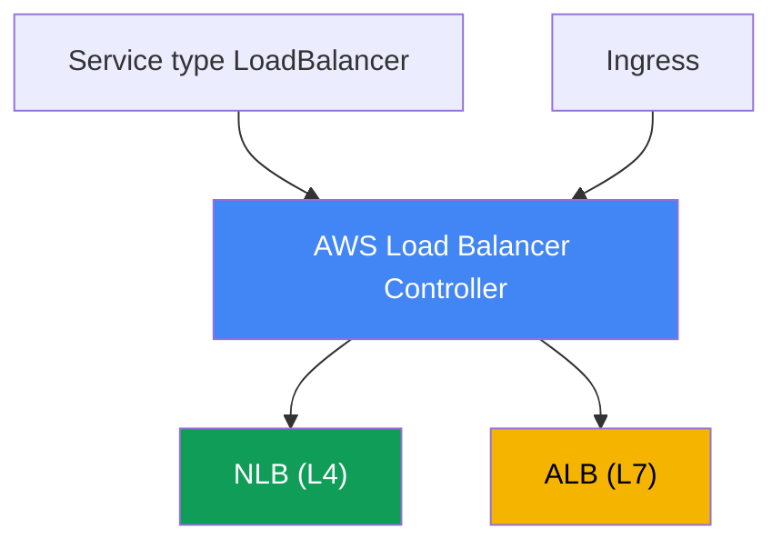
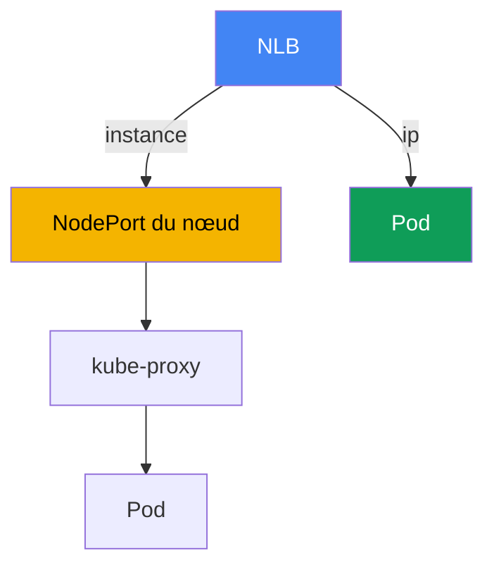

[English version](en.md) · [Русская версия](ru.md) · [Versión en español](es.md) · [Deutsche Version](de.md) · [ქართული ვერსია](ge.md) · [繁體中文版](tw.md) · [日本語版](jp.md)
# Chapitre 26. AWS Load Balancer Controller et Service de type LoadBalancer : NLB

> **La suite.** C'est le début de la partie 5, consacrée au réseau et au trafic. Les parties 3 et 4 ont traité
> l'identité, la sécurité et le stockage ; nous examinons maintenant comment le trafic extérieur atteint le cluster.
> La première couche est un équilibrage de charge devant les pods. Ce chapitre couvre l'équilibrage L4 via un
> Network Load Balancer et un Service de type LoadBalancer. Le routage L7 par Ingress et ALB est traité au
> chapitre 27, Gateway API et VPC Lattice au chapitre 28, DNS et certificats (external-dns, ACM, cert-manager)
> au chapitre 29. Le mode d'attribution d'une IP VPC à un pod (VPC CNI) est expliqué au chapitre 8, et le rôle
> du contrôleur via IRSA ou Pod Identity aux chapitres 16-17. Nous y renvoyons sans les répéter.

## 26.1. « J'ai demandé LoadBalancer et reçu un ancien Classic Load Balancer »

Un ingénieur expose un service avec la méthode Kubernetes habituelle, un Service de type
LoadBalancer :

```yaml
apiVersion: v1
kind: Service
metadata:
  name: web
spec:
  type: LoadBalancer
  selector: {app: web}
  ports:
    - port: 80
      targetPort: 8080
```

Il l'applique, attend une adresse externe et observe ce qui a été créé :

```bash
kubectl get svc web
# NAME  TYPE           EXTERNAL-IP                             PORT(S)
# web   LoadBalancer   a1b2...elb.eu-central-1.amazonaws.com   80:31842/TCP
```

Une adresse a été attribuée et le service est accessible. Mais dans la console EC2, ce nom DNS
correspond à un **Classic Load Balancer**, un équilibrage de charge de la génération précédente,
qu'AWS ne développe plus activement. Il a été créé par le cloud provider in-tree intégré aux
composants Kubernetes. L'ingénieur a besoin d'un Network Load Balancer : IP statiques, prise en
charge d'UDP, hautes performances L4, cibles sur les IP de pods. Il veut aussi gérer les health
checks et les target groups de façon déclarative depuis un manifeste, plutôt que par des clics dans
la console.

Le problème est plus profond qu'un seul type d'équilibreur. Le provider in-tree fait peu de choses,
se configure sommairement, est lié au cycle de vie de Kubernetes et est de fait figé. Créer des NLB
et des target groups manuellement dans la console ou avec Terraform hors du cluster ne passe pas à
l'échelle : à chaque changement du jeu de nœuds ou de pods, il faut réenregistrer les cibles à la
main, et elles divergent de l'état réel du cluster. Il faut un contrôleur qui vit dans le cluster,
voit les Service et Endpoints, et aligne lui-même les NLB et target groups. C'est AWS Load Balancer
Controller, et toute la partie réseau du cours commence avec lui.

## 26.2. AWS Load Balancer Controller : ce qu'il est et comment l'installer

AWS Load Balancer Controller (abrégé LBC) est un contrôleur Kubernetes qui surveille les ressources
du cluster et crée les Elastic Load Balancing correspondants. Il couvre deux scénarios :

- Il transforme un **Service de type LoadBalancer** en **Network Load Balancer** (NLB, L4). C'est
  le sujet de ce chapitre.
- Il transforme un **Ingress** en **Application Load Balancer** (ALB, L7). C'est le sujet du
  chapitre 27, seulement mentionné ici.



Le contrôleur s'installe **avec Helm**, et non comme managed addon EKS. Le chart officiel se trouve
dans le dépôt `eks` (`https://aws.github.io/eks-charts`) :

```bash
helm repo add eks https://aws.github.io/eks-charts
helm repo update
helm install aws-load-balancer-controller eks/aws-load-balancer-controller \
  -n kube-system \
  --set clusterName=<cluster-name> \
  --set serviceAccount.create=false \
  --set serviceAccount.name=aws-load-balancer-controller
```

Le contrôleur agit au nom d'AWS : il crée et modifie des NLB, target groups, listeners et règles de
security groups. Il lui faut donc un **rôle IAM** associé à son ServiceAccount. Le rôle est attribué
via **IRSA** ou **EKS Pod Identity** (chapitres 16-17) ; l'exemple ci-dessus utilise donc
`serviceAccount.create=false` : le service account portant l'annotation de rôle est créé au
préalable.

Les autorisations sont décrites dans le document de politique prêt à l'emploi `iam_policy.json` du
dépôt du contrôleur. On crée à partir de lui une politique IAM (la convention du document la nomme
`AWSLoadBalancerControllerIAMPolicy`) et on l'associe au rôle du contrôleur :

```bash
curl -o iam_policy.json https://raw.githubusercontent.com/kubernetes-sigs/\
aws-load-balancer-controller/main/docs/install/iam_policy.json
aws iam create-policy --policy-name AWSLoadBalancerControllerIAMPolicy \
  --policy-document file://iam_policy.json
```

Sans rôle, ou avec une politique réduite, le contrôleur démarre mais ne peut pas créer
l'équilibreur : le Service reste en `<pending>` et les logs du contrôleur affichent `AccessDenied`.

## 26.3. Cloud provider in-tree contre LB Controller et mode external

Voyons pourquoi la section 26.1 a produit un Classic Load Balancer. Historiquement, un Service de
type LoadBalancer était géré par le **cloud provider in-tree intégré** : le code AWS était dans
`kube-controller-manager` (puis déplacé dans `cloud-controller-manager`). Par défaut, c'est lui qui
réconcilie le Service de type LoadBalancer et crée un CLB. Ses possibilités sont limitées, son
développement est arrêté, et AWS recommande de confier cette tâche à LBC.

Pour que LBC prenne en charge la réconciliation, on marque le Service avec l'annotation :

```yaml
service.beta.kubernetes.io/aws-load-balancer-type: external
```

La valeur `external` indique au provider in-tree « ne touche pas à ce Service, un contrôleur
externe s'en occupe ». LBC voit l'annotation et crée un NLB. Il existe une seconde méthode plus
récente : le champ `spec.loadBalancerClass: service.k8s.aws/nlb` ; il fait la même chose de façon
indépendante du Cloud Provider. Dans les versions récentes, LBC installe un mutating webhook qui
renseigne automatiquement `loadBalancerClass`, ce qui fait effectivement du contrôleur le
traitant par défaut des nouveaux Service de type LoadBalancer.

Une règle importante d'exploitation : **n'ajoutez ni ne modifiez l'annotation
`aws-load-balancer-type` sur un Service existant**. Changer de traitant sur un service actif mène à
des désynchronisations : des ressources AWS créées auparavant peuvent fuir ou, à l'inverse, un NLB
peut soudain être publié sur Internet. Le type de traitant est fixé à la création du Service.

| Propriété | Cloud provider in-tree | AWS Load Balancer Controller |
|---|---|---|
| Ce qu'il crée pour un Service LB | Classic Load Balancer | Network Load Balancer |
| Où il vit | dans les composants Kubernetes | contrôleur distinct dans le cluster |
| Installation | intégré | Helm, rôle IAM propre |
| Développement | figé | actif, recommandé par AWS |
| Comment activer LBC | - | `aws-load-balancer-type: external` |

## 26.4. NLB via un Service de type LoadBalancer : annotations clés

Le comportement du NLB se configure par des annotations sur le Service. Leurs noms sont longs,
mais suivent tous le préfixe `service.beta.kubernetes.io/aws-load-balancer-`. Ensemble de base :

- **`aws-load-balancer-type: external`** : confie le Service au contrôleur LBC (26.3).
- **`aws-load-balancer-nlb-target-type`** : type de cible, `instance` ou `ip` (26.5).
- **`aws-load-balancer-scheme`** : `internal` ou `internet-facing`. Par défaut depuis la version
  v2.2.0, le contrôleur crée un NLB **`internal`** ; pour en obtenir un public, il faut indiquer
  explicitement le schéma. C'est une protection contre la publication accidentelle d'un service.
- **`aws-load-balancer-healthcheck-*`** : paramètres du health check du target group : `-protocol`,
  `-port`, `-path`, `-interval`, `-timeout`, `-healthy-threshold`, `-unhealthy-threshold`,
  `-success-codes`.

Manifeste type d'un NLB public avec des cibles sur les IP de pods :

```yaml
apiVersion: v1
kind: Service
metadata:
  name: web
  annotations:
    service.beta.kubernetes.io/aws-load-balancer-type: external
    service.beta.kubernetes.io/aws-load-balancer-nlb-target-type: ip
    service.beta.kubernetes.io/aws-load-balancer-scheme: internet-facing
    service.beta.kubernetes.io/aws-load-balancer-healthcheck-protocol: http
    service.beta.kubernetes.io/aws-load-balancer-healthcheck-path: /healthz
spec:
  type: LoadBalancer
  selector: {app: web}
  ports:
    - port: 80
      targetPort: 8080
      protocol: TCP
```

| Annotation | Valeurs | Valeur par défaut |
|---|---|---|
| `aws-load-balancer-type` | `external` | géré par in-tree |
| `aws-load-balancer-nlb-target-type` | `instance`, `ip` | `instance` |
| `aws-load-balancer-scheme` | `internal`, `internet-facing` | `internal` |
| `aws-load-balancer-healthcheck-protocol` | `tcp`, `http`, `https` | `tcp` (Cluster) |
| `aws-load-balancer-healthcheck-interval` | secondes | `10` |
| `aws-load-balancer-healthcheck-healthy-threshold` | nombre | `3` |

Les valeurs de health check par défaut (intervalle `10`, délai d'attente `10`, seuils `3`, codes
`200-399`) sont définies par le contrôleur ; ne les redéfinissez que lorsque c'est nécessaire.
Parmi les autres annotations utiles figurent : `aws-load-balancer-name`,
`aws-load-balancer-subnets`, `aws-load-balancer-ssl-cert` (terminaison TLS avec un certificat
ACM) et `aws-load-balancer-attributes` (attributs NLB, par exemple cross-zone).

Deux annotations sont particulièrement utiles en production. `aws-load-balancer-eip-allocations`
associe à un NLB public des Elastic IP réservées à l'avance (une allocation par subnet) : les
adresses externes du service deviennent statiques et survivent à la recréation du NLB. De son côté,
`aws-load-balancer-target-group-attributes` définit les attributs du target group sous la forme
`clé=valeur` ; avec la clé `deregistration_delay.timeout_seconds` (par exemple `15` ou `30` au
lieu des `300` par défaut), on réduit le délai de retrait d'une cible du groupe pour qu'au déploiement
le NLB permette aux sessions TCP de se terminer proprement, sans conserver le pod en draining
inutilement pendant plusieurs minutes (graceful deregistration).

**Équilibrage inter-zone.** Par défaut, le cross-zone load balancing de NLB est **désactivé** au
niveau du target group (à la différence d'ALB où il est toujours activé) : le NLB de chaque zone
envoie le trafic seulement vers les cibles de sa zone. Si les pods sont répartis de façon asymétrique
entre AZ, les répliques reçoivent une charge inégale. Activez-le avec le même
`target-group-attributes` : `cross_zone.load_balancing.enabled=true`. C'est un compromis FinOps :
équilibrer la charge sur tous les pods de toutes les zones ou payer le trafic inter-zone (le
cross-AZ data transfer est facturé). Il interagit avec `externalTrafficPolicy` (section 26.6) :
`Local` maintient aussi le trafic dans le nœud et accentue le déséquilibre si le placement est
asymétrique.

**Security groups et dérive IaC.** À partir de la version v2.6.0, LBC sait créer lui-même un
frontend security group pour un NLB et modifier les règles backend SG sur les nœuds et les pods. Si
l'ensemble du réseau et des SG est géré par Terraform ou Terragrunt, ces modifications automatiques
provoquent une dérive d'état : `plan` affiche des changements de règles absents du code. Deux
annotations permettent de la gérer : `aws-load-balancer-manage-backend-security-group-rules: "false"`
laisse les règles backend SG sous le contrôle de votre IaC, et
`aws-load-balancer-security-groups` associe au NLB des frontend groups créés à l'avance dans
Terraform au lieu de les créer automatiquement. Ainsi, chaque SG a un seul propriétaire et il n'y a
pas de dérive.

## 26.5. target-type : instance contre ip

Le choix essentiel avec un NLB est la destination du trafic envoyé par l'équilibreur. Il existe deux
modes.

**`instance`** : la cible du groupe est un nœud EC2, ou plus précisément son `NodePort`. Le NLB
envoie les paquets vers le `NodePort` de n'importe quel nœud du cluster, puis `kube-proxy` de ce
nœud les délivre au pod selon les règles iptables ou IPVS. Le pod peut être sur un autre nœud : un
saut réseau inter-nœuds s'ajoute alors, et le résultat dépend de `externalTrafficPolicy` (26.6). Le
Service doit dans ce cas être de type `NodePort` ou `LoadBalancer`.

**`ip`** : la cible est l'**IP du pod lui-même**. C'est possible parce que VPC CNI attribue au pod
une adresse réelle du VPC (chapitre 8), routable dans le réseau AWS. Le NLB envoie le trafic
directement au pod, sans passer par `NodePort` ni `kube-proxy` : il y a un saut de moins et aucune
dépendance au nœud où vit le pod. Le mode `ip` est **obligatoire pour Fargate**, qui ne dispose ni
de nœuds EC2 ordinaires ni de `NodePort`.



Le mode `ip` impose des exigences réseau : le pod doit recevoir une adresse VPC (VPC CNI,
chapitre 8), et les security groups et subnets doivent permettre au NLB d'atteindre le port du pod.
Depuis la version v2.6.0, le contrôleur crée et associe lui-même des frontend et backend security
groups au NLB et ajuste les règles d'accès ; dans les versions précédentes, il ajoutait des règles
inbound au security group des nœuds.

| Critère | `instance` | `ip` |
|---|---|---|
| Cible | `NodePort` du nœud | IP du pod directement |
| Chemin du trafic | NLB -> NodePort -> kube-proxy -> pod | NLB -> pod |
| Saut inter-nœuds supplémentaire | possible | non |
| Type de Service | `NodePort` ou `LoadBalancer` | tout type avec VPC CNI |
| Fargate | ne fonctionne pas | obligatoire |
| Client source IP | dépend de `externalTrafficPolicy` | dépend de l'attribut du target group |
| Exigences | `NodePort` ouvert | VPC CNI, accessibilité SG/subnet |

Règle pratique : sur EC2 avec VPC CNI, choisissez `ip` par défaut : moins de sauts et une gestion
plus simple de la client IP. Choisissez `instance` lorsqu'une entrée par `NodePort` est requise ou
lorsqu'une architecture réseau particulière l'impose.

## 26.6. externalTrafficPolicy : Cluster contre Local

Le champ `spec.externalTrafficPolicy` d'un Service détermine comment le nœud traite le trafic
externe, ce qui est particulièrement important en mode `instance`.

**`Cluster`** (valeur par défaut) : le trafic arrivé sur le `NodePort` de n'importe quel nœud peut
être transmis par `kube-proxy` à un pod situé sur **un autre** nœud. L'équilibrage est uniforme sur
tous les pods, mais un saut inter-nœuds supplémentaire apparaît et un SNAT est réalisé : **l'IP
source du client est perdue**, le pod voit l'adresse du nœud. Tous les nœuds du cluster répondent aux
health checks, même ceux qui n'hébergent pas le pod concerné.

**`Local`** : le nœud envoie le trafic **uniquement vers ses pods locaux** et ne le transmet pas
plus loin. Il n'y a pas de saut supplémentaire et la **client source IP est préservée**. En échange,
si un nœud ne contient aucun pod du service, son health check devient unhealthy et le NLB cesse de
lui envoyer du trafic ; si les pods sont répartis inégalement entre les nœuds, l'équilibrage est
inégal. Le bon fonctionnement de Local demande une dispersion raisonnable des pods entre les nœuds
(topology spread, chapitre 40).

Cela est directement lié aux health checks de 26.4. Le contrôleur tient compte de la politique :
avec `Cluster`, le protocole de health check par défaut est `tcp` ; avec `Local`, `http` est
recommandé sur `spec.healthCheckNodePort`, et il ne faut pas utiliser `tcp` avec `Local`, car il ne
distingue pas un nœud avec un pod d'un nœud sans pod.

| Aspect | `Cluster` | `Local` |
|---|---|---|
| Transmission à un pod d'un autre nœud | oui | non |
| Saut supplémentaire | possible | non |
| Client source IP | perdue (SNAT) | préservée |
| Nœuds répondant au health check | tous les nœuds | seulement les nœuds avec pod |
| Répartition | uniforme | dépend du placement des pods |

En mode `ip`, la situation est différente : le trafic atteint déjà directement le pod, et la
préservation de la client IP est contrôlée par l'attribut de target group `preserve_client_ip` (il
est désactivé par défaut pour `ip`, activé pour `instance`). Si l'application doit connaître l'IP
source du client, vérifiez-le séparément : par la politique en `instance` ou par l'attribut du target
group en `ip`.

## 26.7. NLB contre ALB : lequel choisir

LBC gère les deux équilibreurs, et choisir entre eux revient à choisir le niveau du modèle OSI.
Voici un résumé sans dupliquer le chapitre 27, qui examine ALB en détail.

- **NLB est L4.** Il fonctionne au niveau TCP et UDP et n'analyse pas HTTP. D'où ses atouts : très
  hautes performances, faible latence, prise en charge d'UDP, IP statiques par subnet et possibilité
  d'associer des Elastic IP. Utilisez-le pour les protocoles non HTTP (gRPC sur TCP, services UDP de
  jeu, bases de données, brokers) et là où un L4 brut sans analyse des requêtes est nécessaire.
- **ALB est L7.** Il comprend HTTP et HTTPS : routage par host et path, en-têtes, redirect,
  authentification et intégration WAF. C'est le choix pour les applications web et API nécessitant
  un routage selon le contenu. Dans EKS, ALB est habituellement créé depuis un Ingress (chapitre 27).

NLB est le seul choix pour les applications en **UDP** (DNS, streaming média, serveurs de jeu) et
pour **QUIC (HTTP/3)** sur UDP : ALB ne gère que TCP, HTTP, HTTPS et HTTP/2, mais pas UDP ni QUIC.
Si une application requiert HTTP/3 en entrée, terminez-le sur un NLB (ou sur son propre proxy
derrière le NLB), pas sur un ALB.

Règle approximative : routage HTTP par chemins et hosts, ALB par Ingress (chapitre 27) ; L4 pur,
UDP, QUIC, IP statiques ou débit maximal, NLB par un Service de type LoadBalancer comme dans ce
chapitre.

## 26.8. gRPC et service mesh : pourquoi L4 n'équilibre pas les flux

Une partie du backend communique par gRPC (sur HTTP/2), et après le scale la charge ne se répartit
pas : une réplique est surchargée, les nouvelles restent inactives. La raison est qu'un client gRPC
ouvre **une connexion HTTP/2 longue durée** et multiplexe tous les RPC dessus. Service et NLB
fonctionnent au niveau L4 (connection-level) : ils équilibrent les connexions, pas les requêtes.
Comme il n'y a qu'une connexion, tout le trafic du client reste collé à un pod et les répliques
ajoutées restent inutilisées. La même chose arrive avec toute connexion persistante (bases de
données, brokers, websocket).

kube-proxy et NLB considèrent une connexion TCP comme l'unité d'équilibrage et n'analysent pas les
centaines de requêtes indépendantes qui la traversent. Pour répartir la charge **par requête**, il
faut du L7 comprenant HTTP/2. Trois options existent.

**Option 1 : équilibreur L7 pour le gRPC north-south.** Le gRPC externe passe par ALB : sur
l'Ingress, définissez `alb.ingress.kubernetes.io/backend-protocol-version: GRPC`, et ALB équilibre
au niveau des requêtes tout en gérant le gRPC healthcheck. ALB et Ingress sont traités au chapitre
27 ; ici, l'essentiel est que L7 élimine le collage pour le gRPC entrant.

**Option 2 : équilibrage côté client.** Un Headless Service (`clusterIP: None`) renvoie au client
non pas un seul VIP, mais toutes les adresses des pods. Le client gRPC répartit lui-même les RPC
selon la politique `round_robin`. Le coût est que le client doit prendre en charge le client-side LB
et effectuer un re-resolve DNS lors du scale, sinon les nouveaux pods n'entrent pas dans le pool.

**Option 3 : service mesh pour east-west.** Pour les communications service à service, déployez
Istio ou Linkerd : un proxy sidecar apparaît à côté du pod (Istio offre aussi un mode ambient sans
sidecar), et réalise un équilibrage L7 per-request pour gRPC et HTTP/2. Le mesh apporte également
mTLS, retries, timeouts, circuit breaking, localité du trafic et observabilité (golden signals).
Istio est étudié plus en profondeur dans un cours ICA distinct.

Le coût réel d'un mesh sur EKS est le suivant : les proxy sidecar ajoutent de la consommation CPU et
mémoire ainsi qu'un peu de latence ; le mesh a son propre cycle de vie et ses mises à niveau (ce
n'est pas un managed addon) ; le diagnostic se complique ; et il faut prendre en compte son
interaction avec VPC CNI et NetworkPolicy (chapitre 30). Istio ambient retire une partie de ces
coûts en supprimant le sidecar par pod.

Quel choix faire : un ou deux services gRPC exposés vers l'extérieur, ALB avec GRPC (chapitre 27) ;
nombreux services internes nécessitant mTLS, retries et observabilité, mesh. Ne déployez pas un
mesh uniquement pour équilibrer un seul gRPC : la complexité ne le justifie pas.

| Approche | Ce qui est équilibré | Ce qu'elle apporte | Coût |
|---|---|---|---|
| NLB / Service (L4) | connexions | L4 simple, haut débit | gRPC reste collé au pod |
| ALB gRPC (L7) | requêtes north-south | LB per-request, gRPC healthcheck | seulement HTTP/2, entrée externe |
| headless + client-side LB | requêtes par le client | sans proxy, minimum de sauts | support client, re-resolve |
| service mesh Istio/Linkerd | requêtes east-west | LB per-request, mTLS, retries, métriques | surcharge, mises à niveau propres |

## 26.9. Application en production

- **LBC comme standard, pas de in-tree.** Installez le contrôleur une fois avec Helm et un rôle
  IRSA/Pod Identity ; tous les services externes passent par lui, tandis que la création d'un CLB
  par le provider intégré est considérée comme obsolète.
- **`ip` par défaut sur EC2 avec VPC CNI.** Les cibles sur IP de pods réduisent les sauts et
  simplifient la gestion de la client IP ; réservez `instance` aux cas qui nécessitent une entrée
  par `NodePort`.
- **Définissez `scheme` explicitement.** Créez un NLB public uniquement avec `internet-facing` et
  en sachant que le service est ouvert à Internet ; par défaut le contrôleur crée `internal`, ce qui
  est le bon défaut.
- **Politique IAM minimale et sources restreintes.** N'accordez aux rôles que les droits de
  `iam_policy.json`, et limitez l'accès au NLB avec `spec.loadBalancerSourceRanges`, sans laisser
  `0.0.0.0/0`.
- **Fixez le type de traitant à la création.** Ne changez pas l'annotation
  `aws-load-balancer-type` sur un Service actif afin d'éviter une fuite de ressources ou la
  publication inattendue d'un NLB.
- **IP statiques et déploiement fluide.** Donnez au NLB public des Elastic IP avec
  `aws-load-balancer-eip-allocations`, et réduisez `deregistration_delay.timeout_seconds` dans
  `aws-load-balancer-target-group-attributes` pour que le déploiement ne coupe pas les sessions TCP.

## 26.10. Mini-glossaire

- **AWS Load Balancer Controller (LBC)** : contrôleur du cluster qui crée des NLB pour les Service
  de type LoadBalancer et des ALB pour les Ingress ; il s'installe avec Helm et exige un rôle IAM.
- **cloud provider in-tree** : code AWS intégré aux composants Kubernetes, qui crée par défaut un
  Classic Load Balancer pour un Service de type LoadBalancer.
- **NLB (Network Load Balancer)** : équilibrage L4 (TCP/UDP), hautes performances, IP statiques ;
  créé par LBC depuis un Service de type LoadBalancer.
- **mode external** : valeur de l'annotation `aws-load-balancer-type` qui confie la réconciliation
  du Service au contrôleur LBC externe plutôt qu'au provider in-tree.
- **target-type** : type de cible NLB : `instance` (via le `NodePort` du nœud) ou `ip` (directement
  vers l'IP du pod, nécessite VPC CNI et est obligatoire sur Fargate).
- **externalTrafficPolicy** : politique Service : `Cluster` (transmission à tout nœud, SNAT) ou
  `Local` (pods locaux seulement, préservation de la client IP).
- **preserve_client_ip** : attribut de target group NLB contrôlant la préservation de l'IP source
  du client en mode `ip`.

## 26.11. Résumé du chapitre

- Un Service de type LoadBalancer est traité par défaut par le cloud provider in-tree et crée un
  Classic Load Balancer obsolète avec un minimum de réglages.
- AWS Load Balancer Controller est un contrôleur du cluster qui crée des NLB pour les Service de
  type LoadBalancer et des ALB pour les Ingress (Ingress, chapitre 27). Il s'installe avec Helm,
  pas comme managed addon, et requiert un rôle IAM via IRSA ou Pod Identity (chapitres 16-17) avec
  la politique de `iam_policy.json`.
- Confiez la réconciliation du Service au contrôleur avec l'annotation
  `service.beta.kubernetes.io/aws-load-balancer-type: external` (ou avec
  `loadBalancerClass: service.k8s.aws/nlb`) ; fixez le type de traitant à la création et ne le
  changez pas sur un Service actif.
- Le comportement du NLB se configure avec les annotations : `nlb-target-type`, `scheme` (par
  défaut `internal`), et la famille `healthcheck-*`. Un NLB public requiert explicitement
  `internet-facing`.
- `instance` envoie le trafic vers le `NodePort` du nœud puis au pod via `kube-proxy` (un saut
  supplémentaire est possible) ; `ip` l'envoie directement à l'IP du pod via VPC CNI (chapitre 8),
  avec moins de sauts, et est obligatoire sur Fargate.
- `externalTrafficPolicy: Cluster` équilibre uniformément mais perd la client IP et ajoute un saut ;
  `Local` préserve la client IP et retire ce saut, mais seuls les nœuds avec pod passent le health
  check.
- NLB est L4 (TCP/UDP, IP statiques, performances) ; ALB est L7 (routage HTTP) et est traité en
  détail au chapitre 27.

## 26.12. Utilité dans le travail réel

En astreinte, les incidents réseau avec un NLB se ramènent le plus souvent à quelques causes.
Un Service reste en `<pending>` et aucune adresse externe n'est fournie : vérifiez que le contrôleur
est installé, que son rôle a les droits (`AccessDenied` dans les logs) et que l'annotation `external`
est présente. L'équilibreur est créé, mais les cibles sont `unhealthy` : examinez le health check
(protocole et port selon `externalTrafficPolicy`) ainsi que l'accès au port du pod par les security
groups en mode `ip`. L'application ne voit pas l'IP source du client : ce n'est pas un bug, mais la
conséquence de `Cluster` en mode `instance` ou de `preserve_client_ip` désactivé en mode `ip`.

Lors de la planification, prenez deux décisions à l'avance : le target-type (`ip` par défaut sur EC2
avec VPC CNI) et le schéma (`internal` si le service ne doit pas être exposé sur Internet). Souvenez-
vous aussi de l'irréversibilité : le type de traitant et de nombreux paramètres sont fixés à la
création du Service, il est donc plus simple de concevoir avant que de transformer du trafic actif.

## 26.13. Questions d'auto-évaluation

1. Pourquoi un Service de type LoadBalancer ordinaire crée-t-il par défaut un Classic Load Balancer dans EKS ?
2. Qu'est-ce qu'AWS Load Balancer Controller et quels deux types d'équilibreurs crée-t-il ?
3. Pourquoi installe-t-on LBC avec Helm plutôt que comme managed addon, et pourquoi lui faut-il un rôle IAM ?
4. Comment attribue-t-on le rôle au contrôleur et d'où provient sa politique IAM ?
5. Que fait l'annotation `aws-load-balancer-type: external` et pourquoi ne la modifie-t-on pas ensuite ?
6. Quelles annotations clés configurent un NLB et quel schéma est créé par défaut ?
7. En quoi `target-type: instance` diffère-t-il de `ip` pour le chemin du trafic et le nombre de sauts ?
8. Pourquoi Fargate nécessite-t-il `target-type: ip`, et quel est le rôle de VPC CNI (chapitre 8) ?
9. Comment `externalTrafficPolicy: Cluster` et `Local` affectent-ils la client source IP et les sauts ?
10. Pourquoi tous les nœuds ne passent-ils pas le health check avec `Local`, et quel risque cela pose-t-il ?
11. Comment préserver l'IP source du client en mode `ip`, et en quoi cela diffère-t-il du mode `instance` ?
12. Quand choisir NLB, quand choisir ALB, et dans quel chapitre ALB est-il traité ?
13. Un Service reste en `<pending>` sans adresse externe : que vérifiez-vous et dans quel ordre ?
14. Comment donner des adresses statiques à un NLB public et limiter les coupures TCP pendant un déploiement ?

## Pratique

Le laboratoire du cours pour ce sujet : [laboratoire 108 - AWS Load Balancer Controller : NLB pour
un Service de type LoadBalancer](../../labs/108/README_FR.MD). En dehors de celui-ci, tout se
vérifie sur un cluster actif. Commencez par vérifier que le contrôleur est installé et sain, puis
examinez son service account et le rôle associé :

```bash
kubectl get deploy -n kube-system aws-load-balancer-controller
kubectl get pods -n kube-system | grep load-balancer
kubectl get sa -n kube-system aws-load-balancer-controller -o yaml
```

Reproduisez ensuite la différence entre les modes. Créez un Service de type LoadBalancer avec les
annotations `aws-load-balancer-type: external`, `aws-load-balancer-nlb-target-type: ip` et
`aws-load-balancer-scheme: internal`, attendez son adresse (`kubectl get svc web -w`) et trouvez le
NLB créé côté AWS : `aws elbv2 describe-load-balancers` affichera l'équilibreur et son `Scheme`,
`aws elbv2 describe-target-groups` les target groups, et `aws elbv2 describe-target-health
--target-group-arn <arn>` les cibles enregistrées. En mode `ip`, vous verrez les IP des pods dans
les cibles ; passez à `instance` (dans un nouveau Service, sans modifier celui qui existe) et
comparez : les cibles deviennent les nœuds avec `NodePort`.

Examinez séparément le health check et la client IP : faites varier `externalTrafficPolicy` entre
`Cluster` et `Local`, puis observez comment le jeu de cibles healthy change et si l'IP source du
client est visible dans les logs de l'application. Enfin, vérifiez les droits : réduisez
temporairement la politique du rôle, recréez le Service et recherchez `AccessDenied` dans les logs
(`kubectl logs -n kube-system deploy/aws-load-balancer-controller`), puis restaurez la politique.

---
[Table des matières](../README_FR.md) · [Chapitre 25](../25/fr.md) · [Chapitre 27](../27/fr.md)
