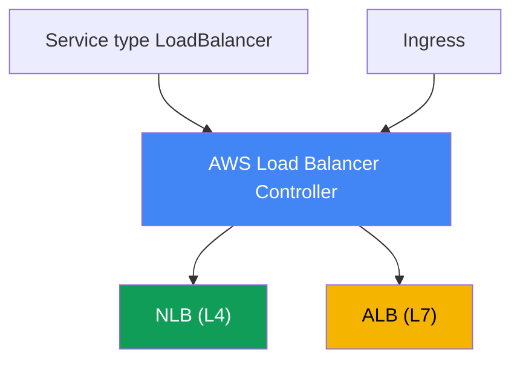
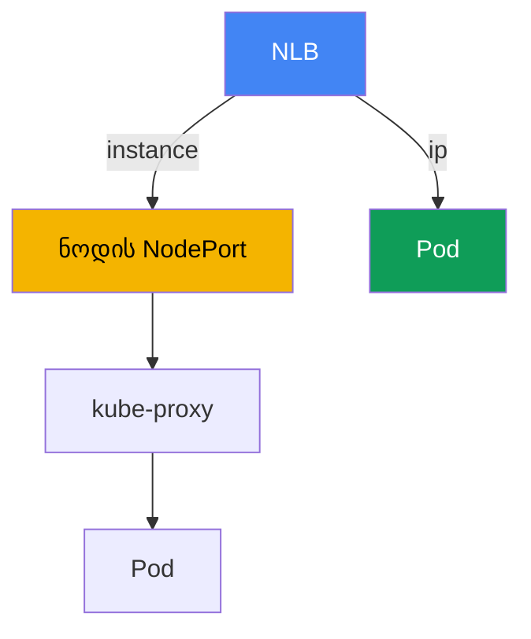

[Русская версия](ru.md) · [Eng version](en.md) · [Versión en español](es.md) · [Version française](fr.md) · [Deutsche Version](de.md) · [繁體中文版](tw.md) · [日本語版](jp.md)
# თავი 26. AWS Load Balancer Controller და LoadBalancer ტიპის Service: NLB

> **რა არის შემდეგ.** ეს მე-5 ნაწილის დასაწყისია, რომელიც ქსელსა და ტრაფიკს ეხება. მე-3 და მე-4
> ნაწილებში იდენტობა, უსაფრთხოება და საცავი განვიხილეთ; ახლა გავარკვევთ, როგორ ხვდება გარე
> ტრაფიკი კლასტერში. პირველი შრე პოდების წინ განთავსებული ბალანსირებელია. ამ თავში განვიხილავთ
> L4 ბალანსირებას Network Load Balancer-ისა და LoadBalancer ტიპის Service-ის მეშვეობით. L7
> მარშრუტიზაცია Ingress-ისა და ALB-ის მეშვეობით განხილულია 27-ე თავში, Gateway API და VPC Lattice
> 28-ე თავში, DNS და სერტიფიკატები (external-dns, ACM, cert-manager) 29-ე თავში. როგორ იღებს
> პოდი IP-ს VPC-ში (VPC CNI), განხილულია მე-8 თავში, ხოლო კონტროლერის როლი IRSA-ს ან Pod
> Identity-ის მეშვეობით მე-16-17 თავებში. მათ მივუთითებთ და აღარ გავიმეორებთ.

## 26.1. „LoadBalancer მოვითხოვე, ძველი Classic Load Balancer მივიღე“

ინჟინერი სერვისს გარეთ Kubernetes-ისთვის ჩვეული გზით, LoadBalancer ტიპის Service-ის
მეშვეობით აქვეყნებს:

```yaml
apiVersion: v1
kind: Service
metadata:
  name: web
spec:
  type: LoadBalancer
  selector: {app: web}
  ports:
    - port: 80
      targetPort: 8080
```

იყენებს მანიფესტს, ელოდება გარე მისამართს და ამოწმებს, რა შეიქმნა:

```bash
kubectl get svc web
# NAME  TYPE           EXTERNAL-IP                             PORT(S)
# web   LoadBalancer   a1b2...elb.eu-central-1.amazonaws.com   80:31842/TCP
```

მისამართი გაცემულია და სერვისი ხელმისაწვდომია. მაგრამ EC2 კონსოლში ამ DNS სახელის ქვეშ
აღმოჩნდება **Classic Load Balancer**, წინა თაობის ბალანსირებელი, რომელსაც AWS დიდი ხანია აღარ
ავითარებს. ის Kubernetes-ის კომპონენტებში ჩაშენებულმა in-tree cloud provider-მა შექმნა.
ინჟინერს კი Network Load Balancer სჭირდება: სტატიკური IP-ები, UDP-ის მხარდაჭერა, მაღალი L4
წარმადობა და პოდების IP-ებზე მიმართული ტარგეტები. გარდა ამისა, მას health check-ებისა და
ტარგეტ-ჯგუფების დეკლარაციულად, მანიფესტიდან მართვა სურს და არა კონსოლში დაწკაპუნებით.

პრობლემა ერთი ტიპის ბალანსირებელზე უფრო ღრმაა. In-tree პროვაიდერს ცოტა რამ შეუძლია, მწირი
პარამეტრები აქვს, Kubernetes-ის სასიცოცხლო ციკლზეა მიბმული და ფაქტობრივად გაყინულია. NLB-ისა
და ტარგეტ-ჯგუფების კლასტრის გვერდის ავლით, კონსოლში ან Terraform-ში ხელით შექმნა არ
მასშტაბირდება: ნოდების ან პოდების ნაკრების ყოველი ცვლილებისას ტარგეტები ხელით უნდა
დარეგისტრირდეს თავიდან და ისინი კლასტერის რეალურ მდგომარეობას სცილდება. საჭიროა კონტროლერი,
რომელიც კლასტერში მუშაობს, ხედავს Service-სა და Endpoints-ს და თავად შეუსაბამებს NLB-სა და
ტარგეტ-ჯგუფებს მათ მდგომარეობას. ეს არის AWS Load Balancer Controller და სწორედ აქედან იწყება
კურსის მთელი ქსელური ნაწილი.

## 26.2. AWS Load Balancer Controller: რა არის და როგორ ყენდება

AWS Load Balancer Controller (შემოკლებით LBC) არის Kubernetes-ის კონტროლერი, რომელიც
კლასტერის რესურსებს აკვირდება და მათთვის Elastic Load Balancing-ს ქმნის. ის ორ სცენარს
ფარავს:

- **LoadBalancer ტიპის Service** გარდაქმნის **Network Load Balancer-ად** (NLB, L4). ეს
  მიმდინარე თავის თემაა.
- **Ingress** გარდაქმნის **Application Load Balancer-ად** (ALB, L7). ეს 27-ე თავის თემაა და
  აქ მხოლოდ ვახსენებთ.



კონტროლერი ყენდება **Helm-ის მეშვეობით** და არა როგორც EKS managed addon. ოფიციალური chart
განთავსებულია `eks` რეპოზიტორიაში (`https://aws.github.io/eks-charts`):

```bash
helm repo add eks https://aws.github.io/eks-charts
helm repo update
helm install aws-load-balancer-controller eks/aws-load-balancer-controller \
  -n kube-system \
  --set clusterName=<cluster-name> \
  --set serviceAccount.create=false \
  --set serviceAccount.name=aws-load-balancer-controller
```

კონტროლერი AWS-ის სახელით მუშაობს: ქმნის და ცვლის NLB-ებს, ტარგეტ-ჯგუფებს, listener-ებსა და
security groups-ის წესებს. შესაბამისად, მას თავის ServiceAccount-ზე მიბმული **IAM როლი**
სჭირდება. როლი გაიცემა **IRSA**-ს ან **EKS Pod Identity**-ის მეშვეობით (მე-16-17 თავები),
ამიტომ ზემოთ მოცემულ მაგალითში მითითებულია `serviceAccount.create=false`: როლის ანოტაციის
მქონე სერვის-ანგარიში წინასწარ იქმნება.

უფლებები აღწერილია კონტროლერის რეპოზიტორიაში არსებული მზა `iam_policy.json` პოლიტიკის
დოკუმენტით. მისგან ქმნიან IAM პოლიტიკას (დოკუმენტში მიღებული შეთანხმებით მას
`AWSLoadBalancerControllerIAMPolicy` ეწოდება) და კონტროლერის როლს აბამენ:

```bash
curl -o iam_policy.json https://raw.githubusercontent.com/kubernetes-sigs/\
aws-load-balancer-controller/main/docs/install/iam_policy.json
aws iam create-policy --policy-name AWSLoadBalancerControllerIAMPolicy \
  --policy-document file://iam_policy.json
```

როლის გარეშე ან შეკვეცილი პოლიტიკით კონტროლერი ეშვება, მაგრამ ბალანსირებელს ვერ ქმნის:
Service რჩება `<pending>` მდგომარეობაში, კონტროლერის ჟურნალებში კი ჩანს `AccessDenied`.

## 26.3. In-tree cloud provider LB Controller-ის წინააღმდეგ და external რეჟიმი

განვიხილოთ, რატომ გამოჩნდა Classic Load Balancer 26.1-ში. ისტორიულად LoadBalancer ტიპის
Service-ს ამუშავებდა **ჩაშენებული in-tree cloud provider**, ანუ AWS-ის კოდი
`kube-controller-manager`-ის შიგნით (მოგვიანებით ის `cloud-controller-manager`-ში გაიტანეს).
ნაგულისხმევად სწორედ ის უკეთებს რეკონსილაციას LoadBalancer ტიპის Service-ს და მისთვის CLB-ს
ქმნის. მისი შესაძლებლობები შეზღუდულია, განვითარება შეჩერებულია და AWS ამ სამუშაოს LBC-ისთვის
გადაცემას გვირჩევს.

იმისთვის, რომ რეკონსილაცია LBC-მ გადაიბაროს, Service-ს ანოტაციას უმატებენ:

```yaml
service.beta.kubernetes.io/aws-load-balancer-type: external
```

`external` მნიშვნელობა in-tree პროვაიდერს ეუბნება: „ამ Service-ს არ შეეხო, მას გარე
კონტროლერი მიხედავს“. LBC ხედავს ანოტაციას და NLB-ს ქმნის. არსებობს მეორე, უფრო ახალი გზაც,
ველი `spec.loadBalancerClass: service.k8s.aws/nlb`; ის იმავეს Cloud Provider-ისგან
დამოუკიდებელი გზით აკეთებს. LBC-ის ახალ ვერსიებში ყენდება mutating webhook, რომელიც
`loadBalancerClass`-ს ავტომატურად უთითებს და კონტროლერს ახალი LoadBalancer ტიპის Service-ების
ნაგულისხმევ დამმუშავებლად ფაქტობრივად აქცევს.

ექსპლუატაციის ერთი მნიშვნელოვანი წესი: **`aws-load-balancer-type` ანოტაციას უკვე არსებულ
Service-ზე არ ამატებენ და არ ცვლიან**. მოქმედ სერვისზე დამმუშავებლის შეცვლა სინქრონიზაციის
დარღვევას იწვევს: შესაძლოა ადრე შექმნილი AWS რესურსები დარჩეს, ან პირიქით, NLB მოულოდნელად
გამოქვეყნდეს ინტერნეტში. დამმუშავებლის ტიპს Service-ის შექმნისას აფიქსირებენ.

| თვისება | In-tree cloud provider | AWS Load Balancer Controller |
|---|---|---|
| რას ქმნის Service LB-სთვის | Classic Load Balancer | Network Load Balancer |
| სად მუშაობს | Kubernetes-ის კომპონენტების შიგნით | ცალკე კონტროლერი კლასტერში |
| ინსტალაცია | ჩაშენებულია | Helm, საკუთარი IAM როლი |
| განვითარება | გაყინულია | აქტიურია, AWS-ის მიერ რეკომენდებული |
| როგორ ჩაირთოს LBC | - | `aws-load-balancer-type: external` |

## 26.4. NLB LoadBalancer ტიპის Service-ის მეშვეობით: ძირითადი ანოტაციები

NLB-ის ქცევა Service-ის ანოტაციებით იმართება. სახელები გრძელია, მაგრამ ყველას ერთი პრეფიქსი
აქვს: `service.beta.kubernetes.io/aws-load-balancer-`. საბაზისო ნაკრები:

- **`aws-load-balancer-type: external`** - Service-ის LBC კონტროლერისთვის გადაცემა (26.3).
- **`aws-load-balancer-nlb-target-type`** - ტარგეტის ტიპი: `instance` ან `ip` (26.5).
- **`aws-load-balancer-scheme`** - `internal` ან `internet-facing`. v2.2.0 ვერსიიდან
  ნაგულისხმევად კონტროლერი **`internal`** NLB-ს ქმნის; საჯარო ბალანსირებლის მისაღებად სქემა
  ცხადად უნდა მიეთითოს. ეს სერვისის გარეთ შემთხვევით გამოქვეყნებისგან გვიცავს.
- **`aws-load-balancer-healthcheck-*`** - ტარგეტ-ჯგუფის health check-ის პარამეტრები:
  `-protocol`, `-port`, `-path`, `-interval`, `-timeout`, `-healthy-threshold`,
  `-unhealthy-threshold`, `-success-codes`.

პოდების IP-ებზე მიმართული ტარგეტების მქონე საჯარო NLB-ის ტიპური მანიფესტი:

```yaml
apiVersion: v1
kind: Service
metadata:
  name: web
  annotations:
    service.beta.kubernetes.io/aws-load-balancer-type: external
    service.beta.kubernetes.io/aws-load-balancer-nlb-target-type: ip
    service.beta.kubernetes.io/aws-load-balancer-scheme: internet-facing
    service.beta.kubernetes.io/aws-load-balancer-healthcheck-protocol: http
    service.beta.kubernetes.io/aws-load-balancer-healthcheck-path: /healthz
spec:
  type: LoadBalancer
  selector: {app: web}
  ports:
    - port: 80
      targetPort: 8080
      protocol: TCP
```

| ანოტაცია | მნიშვნელობები | ნაგულისხმევი მნიშვნელობა |
|---|---|---|
| `aws-load-balancer-type` | `external` | ამუშავებს in-tree |
| `aws-load-balancer-nlb-target-type` | `instance`, `ip` | `instance` |
| `aws-load-balancer-scheme` | `internal`, `internet-facing` | `internal` |
| `aws-load-balancer-healthcheck-protocol` | `tcp`, `http`, `https` | `tcp` (Cluster) |
| `aws-load-balancer-healthcheck-interval` | წამები | `10` |
| `aws-load-balancer-healthcheck-healthy-threshold` | რიცხვი | `3` |

health check-ის ნაგულისხმევი მნიშვნელობები (ინტერვალი `10`, timeout `10`, ზღვრები `3`, კოდები
`200-399`) კონტროლერის მიერ არის განსაზღვრული; მათ მხოლოდ საჭიროების შემთხვევაში ცვლიან. სხვა
სასარგებლო ანოტაციებია: `aws-load-balancer-name`, `aws-load-balancer-subnets`,
`aws-load-balancer-ssl-cert` (TLS-ის ტერმინაცია ACM-ის სერტიფიკატით) და
`aws-load-balancer-attributes` (NLB-ის ატრიბუტები, მაგალითად cross-zone).

ორი ანოტაცია განსაკუთრებით სასარგებლოა production-ში. `aws-load-balancer-eip-allocations`
საჯარო NLB-ს წინასწარ გამოყოფილ Elastic IP-ებს აბამს (თითო allocation თითო subnet-ზე), ამიტომ
სერვისის გარე მისამართები სტატიკური ხდება და NLB-ის თავიდან შექმნასაც უძლებს. ხოლო
`aws-load-balancer-target-group-attributes` target group-ის ატრიბუტებს `გასაღები=მნიშვნელობა`
სახის სტრიქონით განსაზღვრავს; `deregistration_delay.timeout_seconds` გასაღებით (მაგალითად `15`
ან `30`, ნაგულისხმევი `300`-ის ნაცვლად) ჯგუფიდან ტარგეტის გამოყვანის დაყოვნებას ამცირებენ, რათა
დეპლოისას NLB-მ TCP სესიებს დასრულების საშუალება შეუფერხებლად მისცეს და პოდი draining
მდგომარეობაში ზედმეტი წუთებით არ დატოვოს (graceful deregistration).

**ზონათაშორისი ბალანსირება.** NLB-ში cross-zone load balancing ნაგულისხმევად **გამორთულია**
target group-ის დონეზე (ALB-ისგან განსხვავებით, სადაც ის ყოველთვის ჩართულია): თითოეულ ზონაში
NLB ტრაფიკს მხოლოდ თავისი ზონის ტარგეტებს უგზავნის. თუ პოდები AZ-ებს შორის ასიმეტრიულადაა
განაწილებული, რეპლიკების დატვირთვაც არათანაბარი გამოდის. ის იმავე
`target-group-attributes`-ით ირთვება: `cross_zone.load_balancing.enabled=true`. კომპრომისი
FinOps-ს უკავშირდება: ყველა ზონის ყველა პოდზე დატვირთვის გათანაბრება ზონათაშორისი ტრაფიკის
საფასურის სანაცვლოდ (cross-AZ data transfer ფასიანია). ის `externalTrafficPolicy`-სთანაც
ურთიერთქმედებს (განყოფილება 26.6): `Local` ასევე ნოდის ფარგლებში ტოვებს ტრაფიკს და
ასიმეტრიული განთავსებისას დისბალანსს აძლიერებს.

**Security groups და IaC drift.** v2.6.0 ვერსიიდან LBC-ს შეუძლია NLB-ისთვის თავად შექმნას
frontend security group და ნოდებსა და პოდებზე backend SG-ის წესები შეცვალოს. თუ მთელი ქსელი
და SG-ები Terraform-ით ან Terragrunt-ით იმართება, ეს ავტომატური ცვლილებები მდგომარეობის drift-ს
იწვევს: `plan` აჩვენებს წესების ცვლილებებს, რომლებიც კოდში არ არის. ამას ორი ანოტაციით მართავენ:
`aws-load-balancer-manage-backend-security-group-rules: "false"` backend SG-ის წესებს თქვენი
IaC-ის კონტროლს გადასცემს, ხოლო `aws-load-balancer-security-groups` NLB-ს Terraform-ში წინასწარ
შექმნილ frontend ჯგუფებს აბამს ავტომატურად შექმნილის ნაცვლად. ამგვარად SG-ს ერთი მფლობელი ჰყავს
და drift აღარ წარმოიქმნება.

## 26.5. target-type: instance ip-ის წინააღმდეგ

NLB-სთან მუშაობისას მთავარი არჩევანია, სად აგზავნის ბალანსირებელი ტრაფიკს. არსებობს ორი რეჟიმი.

**`instance`** - ჯგუფის ტარგეტი EC2 ნოდია, უფრო ზუსტად კი მისი `NodePort`. NLB პაკეტს
კლასტერის ნებისმიერი ნოდის `NodePort`-ზე აგზავნის, შემდეგ ამ ნოდზე `kube-proxy` iptables-ის ან
IPVS-ის წესებით ტრაფიკს პოდამდე მიიტანს. პოდი შეიძლება სხვა ნოდზე აღმოჩნდეს, რის გამოც ნოდებს
შორის ერთი ზედმეტი ქსელური hop ემატება, საბოლოო შედეგი კი `externalTrafficPolicy`-ზეა
დამოკიდებული (26.6). ამ შემთხვევაში Service უნდა იყოს `NodePort` ან `LoadBalancer` ტიპის.

**`ip`** - ტარგეტი **თავად პოდის IP-ია**. ეს შესაძლებელია, რადგან VPC CNI პოდს VPC-დან ნამდვილ,
AWS ქსელში მარშრუტიზებად მისამართს აძლევს (მე-8 თავი). NLB ტრაფიკს პირდაპირ პოდს უგზავნის,
`NodePort`-ისა და `kube-proxy`-ის გვერდის ავლით, ანუ ერთი hop-ით ნაკლებია და არ არის
დამოკიდებული იმაზე, რომელ ნოდზე მუშაობს პოდი. `ip` რეჟიმი **სავალდებულოა Fargate-ისთვის**,
სადაც ჩვეულებრივი EC2 ნოდები და `NodePort` უბრალოდ არ არსებობს.



`ip` რეჟიმს ქსელთან დაკავშირებული მოთხოვნები აქვს: პოდმა VPC მისამართი უნდა მიიღოს (VPC CNI,
მე-8 თავი), ხოლო security groups-მა და subnet-ებმა NLB-ს პოდის პორტთან დაკავშირების საშუალება
უნდა მისცეს. v2.6.0 ვერსიიდან კონტროლერი თავად ქმნის და NLB-ს აბამს frontend და backend
security groups-ს და წვდომის წესებს ცვლის; ძველ ვერსიებში ის ნოდების security group-ს inbound
წესებს უმატებდა.

| კრიტერიუმი | `instance` | `ip` |
|---|---|---|
| ტარგეტი | ნოდის `NodePort` | პირდაპირ პოდის IP |
| ტრაფიკის გზა | NLB -> NodePort -> kube-proxy -> პოდი | NLB -> პოდი |
| ზედმეტი hop ნოდებს შორის | შესაძლებელია | არა |
| Service-ის ტიპი | `NodePort` ან `LoadBalancer` | ნებისმიერი VPC CNI-ით |
| Fargate | არ მუშაობს | სავალდებულოა |
| Client source IP | დამოკიდებულია `externalTrafficPolicy`-ზე | დამოკიდებულია target group-ის ატრიბუტზე |
| მოთხოვნები | ღია `NodePort` | VPC CNI, SG/subnet-ის ხელმისაწვდომობა |

პრაქტიკული წესი: EC2-ზე VPC CNI-ით ნაგულისხმევად `ip`-ს ირჩევენ, რადგან ნაკლები hop აქვს და
client IP-ის შენარჩუნებაც უფრო მარტივია. `instance`-ს მაშინ ირჩევენ, როდესაც შესვლა სწორედ
`NodePort`-ის მეშვეობითაა საჭირო ან ამას კონკრეტული ქსელური სქემა მოითხოვს.

## 26.6. externalTrafficPolicy: Cluster Local-ის წინააღმდეგ

Service-ის `spec.externalTrafficPolicy` ველი განსაზღვრავს, როგორ ამუშავებს ნოდი გარე ტრაფიკს და
განსაკუთრებით მნიშვნელოვანია `instance` რეჟიმში.

**`Cluster`** (ნაგულისხმევი მნიშვნელობა) - ნებისმიერი ნოდის `NodePort`-ზე მისული ტრაფიკი
`kube-proxy`-მ შეიძლება **სხვა** ნოდზე მდებარე პოდს გადაუგზავნოს. ყველა პოდზე ბალანსირება
თანაბარია, მაგრამ ნოდებს შორის დამატებითი hop ჩნდება და ამასთან სრულდება SNAT, ამიტომ
**კლიენტის საწყისი IP იკარგება** და პოდი ნოდის მისამართს ხედავს. health check-ს კლასტერის ყველა
ნოდი პასუხობს, მათ შორის ისინიც, რომლებზეც საჭირო პოდი არ არის.

**`Local`** - ნოდი ტრაფიკს **მხოლოდ თავის ლოკალურ პოდებს** უგზავნის და სხვაგან აღარ
გადაამისამართებს. ზედმეტი hop არ არის და **client source IP შენარჩუნებულია**. ამის საფასური ისაა,
რომ თუ ნოდზე სერვისის არც ერთი პოდი არ არის, მისი health check unhealthy ხდება და NLB მასზე
ტრაფიკის გაგზავნას წყვეტს; პოდების ნოდებზე არათანაბარი განაწილებისას ბალანსირებაც არათანაბარია.
Local-ის გამართულად მუშაობისთვის მნიშვნელოვანია პოდების გონივრული განაწილება ნოდებზე (topology
spread, მე-40 თავი).

ეს პირდაპირ უკავშირდება 26.4-ში განხილულ health check-ს. კონტროლერი პოლიტიკას ითვალისწინებს:
`Cluster`-ის შემთხვევაში health check-ის ნაგულისხმევი პროტოკოლია `tcp`, `Local`-ის შემთხვევაში კი
რეკომენდებულია `http` `spec.healthCheckNodePort`-ის მიხედვით, ხოლო `Local`-თან `tcp` არ უნდა
გამოიყენოთ, რადგან ის პოდიან ნოდს უპოდო ნოდისგან ვერ განასხვავებს.

| ასპექტი | `Cluster` | `Local` |
|---|---|---|
| სხვა ნოდის პოდზე გადაგზავნა | დიახ | არა |
| ზედმეტი hop | შესაძლებელია | არა |
| Client source IP | იკარგება (SNAT) | შენარჩუნებულია |
| Health check-ს პასუხობს | ყველა ნოდი | მხოლოდ პოდიანი ნოდები |
| განაწილება | თანაბარი | დამოკიდებულია პოდების განთავსებაზე |

`ip` რეჟიმში სურათი განსხვავებულია: ტრაფიკი ისედაც პირდაპირ პოდზე მიდის, client IP-ის
შენარჩუნება კი target group-ის `preserve_client_ip` ატრიბუტით იმართება (`ip`-ისთვის ის
ნაგულისხმევად გამორთულია, `instance`-ისთვის კი ჩართულია). თუ აპლიკაციას კლიენტის საწყისი IP
სჭირდება, ამას ცალკე ამოწმებენ: `instance` რეჟიმში პოლიტიკით, `ip` რეჟიმში კი target group-ის
ატრიბუტით.

## 26.7. NLB ALB-ის წინააღმდეგ: როდის რომელი

LBC-ს ორივე ბალანსირებლის მართვა შეუძლია და მათ შორის არჩევანი OSI მოდელის შრის არჩევაა.
მოკლედ განვიხილოთ, 27-ე თავის დუბლირების გარეშე, სადაც ALB დეტალურადაა აღწერილი.

- **NLB არის L4.** მუშაობს TCP და UDP დონეზე და HTTP-ს არ აანალიზებს. აქედან მოდის მისი
  უპირატესობები: ძალიან მაღალი წარმადობა და დაბალი დაყოვნება, UDP-ის მხარდაჭერა, თითო subnet-ზე
  სტატიკური IP-ები და Elastic IP-ის მიბმის შესაძლებლობა. მას არა-HTTP პროტოკოლებისთვის (gRPC
  TCP-ის ზემოთ, სათამაშო UDP სერვისები, მონაცემთა ბაზები, ბროკერები) და იქ იყენებენ, სადაც
  მოთხოვნების ანალიზის გარეშე სუფთა L4 არის საჭირო.
- **ALB არის L7.** ესმის HTTP და HTTPS: მარშრუტიზაცია host-ისა და path-ის მიხედვით, headers,
  redirect, ავთენტიფიკაცია, WAF-თან ინტეგრაცია. ის გამოიყენება ვებ-აპლიკაციებისა და API-ებისთვის,
  სადაც კონტენტზე დაფუძნებული მარშრუტიზაციაა საჭირო. EKS-ში ALB ჩვეულებრივ Ingress-იდან იქმნება
  (27-ე თავი).

NLB ერთადერთი არჩევანია **UDP** აპლიკაციებისთვის (DNS, მედია streaming, სათამაშო სერვერები) და
UDP-ზე მომუშავე **QUIC (HTTP/3)**-ისთვის: ALB მხოლოდ TCP-თან, ანუ HTTP, HTTPS და HTTP/2-თან
მუშაობს, მაგრამ არა UDP-სა და QUIC-თან. თუ აპლიკაციას შემავალ მხარეს HTTP/3 სჭირდება, მას NLB-ზე
(ან NLB-ის უკან საკუთარ proxy-ზე) წყვეტენ და არა ALB-ზე.

უხეში წესი: HTTP მარშრუტიზაცია path-ებისა და host-ების მიხედვით ნიშნავს ALB-ს Ingress-ის
მეშვეობით (27-ე თავი); სუფთა L4, UDP, QUIC, სტატიკური IP-ები ან მაქსიმალური გამტარუნარიანობა
ნიშნავს NLB-ს LoadBalancer ტიპის Service-ის მეშვეობით, როგორც ამ თავში.

## 26.8. gRPC და service mesh: რატომ არ აბალანსებს L4 ნაკადებს

backend-ის ნაწილი gRPC-ით (HTTP/2-ის ზემოთ) ურთიერთობს და მასშტაბირების შემდეგ დატვირთვა არ
ნაწილდება: ერთი რეპლიკა გადატვირთულია, ახალი რეპლიკები კი უმოქმედოდაა. მიზეზი ისაა, რომ gRPC
კლიენტი ხსნის **ერთ ხანგრძლივ HTTP/2 connection-ს** და ყველა RPC-ს მასში მულტიპლექსირებს.
Service და NLB L4 დონეზე (connection-level) მუშაობს: აბალანსებს კავშირებს და არა მოთხოვნებს.
რადგან კავშირი ერთია, კლიენტის მთელი ტრაფიკი ერთ პოდს ეკვრის, დამატებული რეპლიკები კი
უმოქმედოდ რჩება. იგივე ხდება ნებისმიერი persistent კავშირის შემთხვევაში (მონაცემთა ბაზები,
ბროკერები, websocket).

kube-proxy და NLB TCP კავშირს ბალანსირების ერთეულად ხედავს და არ აანალიზებს, რომ მის შიგნით
ასობით დამოუკიდებელი მოთხოვნა გადაიცემა. დატვირთვის **მოთხოვნების მიხედვით** გასანაწილებლად
საჭიროა L7, რომელსაც HTTP/2 ესმის. სამი ვარიანტი არსებობს.

**ვარიანტი 1 - L7 ბალანსირებელი north-south gRPC-სთვის.** გარე gRPC ALB-ის მეშვეობით შეჰყავთ:
Ingress-ზე უთითებენ `alb.ingress.kubernetes.io/backend-protocol-version: GRPC`-ს, ALB კი
მოთხოვნების დონეზე აბალანსებს და gRPC healthcheck-იც შეუძლია. ALB და Ingress 27-ე თავშია
განხილული; აქ მთავარია, რომ L7 შემომავალი gRPC-ის მიწებებას ხსნის.

**ვარიანტი 2 - კლიენტის მხარეს ბალანსირება.** Headless Service (`clusterIP: None`) კლიენტს
ერთი VIP-ის ნაცვლად ყველა პოდის მისამართს აძლევს. gRPC კლიენტი `round_robin` პოლიტიკით თავად
ანაწილებს RPC-ებს მათ შორის. ამის საფასურია, რომ კლიენტს client-side LB-ის მხარდაჭერა და
მასშტაბირებისას DNS-ის ხელახლა resolve უნდა შეეძლოს, წინააღმდეგ შემთხვევაში ახალი პოდები pool-ში
ვერ მოხვდება.

**ვარიანტი 3 - service mesh east-west ტრაფიკისთვის.** სერვისებს შორის კავშირისთვის Istio-ს ან
Linkerd-ს აყენებენ: პოდის გვერდით ჩნდება sidecar proxy (Istio-ს sidecar-ის გარეშე ambient რეჟიმიც
აქვს), რომელიც gRPC-სა და HTTP/2-სთვის L7 per-request ბალანსირებას ასრულებს. ამასთან ერთად mesh
უზრუნველყოფს mTLS-ს, retries-ს, timeouts-ს, circuit breaking-ს, ტრაფიკის ლოკალურობასა და
დაკვირვებადობას (golden signals). Istio სიღრმისეულად ICA-ს ცალკე კურსში განიხილება.

mesh-ის რეალური ფასი EKS-ზე: sidecar proxy-ები CPU-სა და მეხსიერებას მოიხმარს და მცირე
დაყოვნებას ამატებს; mesh-ს საკუთარი სასიცოცხლო ციკლი და განახლებები აქვს (ეს managed addon არ
არის); დიაგნოსტიკა რთულდება; გასათვალისწინებელია VPC CNI-სა და NetworkPolicy-სთან გადაკვეთა
(30-ე თავი). Istio ambient per-pod sidecar-ის მოცილებით ზედნადები ხარჯის ნაწილს ამცირებს.

როდის რომელი: გარეთ გამოტანილი ერთი-ორი gRPC სერვისისთვის გამოიყენეთ ALB GRPC-ით (27-ე თავი);
ბევრი შიდა სერვისისა და mTLS-ის, retries-ისა და დაკვირვებადობის საჭიროებისას გამოიყენეთ mesh.
მხოლოდ ერთი gRPC სერვისის ბალანსირებისთვის mesh-ის შემოტანა არ ღირს, რადგან სირთულე თავს არ
ამართლებს.

| მიდგომა | რას აბალანსებს | რას უზრუნველყოფს | რას იხდით |
|---|---|---|---|
| NLB / Service (L4) | კავშირებს | მარტივი L4, მაღალი გამტარუნარიანობა | gRPC პოდს ეკვრის |
| ALB gRPC (L7) | north-south მოთხოვნებს | per-request LB, gRPC healthcheck | მხოლოდ HTTP/2, გარედან შესვლა |
| headless + client-side LB | კლიენტის მიერ მოთხოვნებს | proxy-ის გარეშე, მინიმალური hop-ები | კლიენტის მხარდაჭერა, ხელახალი resolve |
| service mesh Istio/Linkerd | east-west მოთხოვნებს | per-request LB, mTLS, retries, მეტრიკები | ზედნადები ხარჯი, საკუთარი განახლებები |

## 26.9. როგორ გამოიყენება production-ში

- **LBC როგორც სტანდარტი, in-tree არ გამოიყენება.** კონტროლერს ერთხელ აყენებენ Helm-ის მეშვეობით
  IRSA/Pod Identity როლით და ყველა გარე სერვისი მისით მუშაობს; ჩაშენებული პროვაიდერის მიერ CLB-ის
  შექმნა მოძველებულ სცენარად ითვლება.
- **`ip` ნაგულისხმევად EC2-ზე VPC CNI-ით.** პოდების IP-ებზე მიმართული ტარგეტები ნაკლებ hop-ს
  იძლევა და client IP-სთან მუშაობაც უფრო მარტივია; `instance` რჩება იმ შემთხვევებისთვის, სადაც
  `NodePort`-ის მეშვეობით შესვლაა საჭირო.
- **`scheme` ცხადად მიეთითება.** საჯარო NLB მხოლოდ `internet-facing`-ით და იმის გაცნობიერებით
  იქმნება, რომ სერვისი ინტერნეტისთვის ღიაა; ნაგულისხმევად კონტროლერი `internal`-ს ქმნის და ეს
  სწორი ნაგულისხმევი არჩევანია.
- **მინიმალური IAM პოლიტიკა და შეზღუდული წყაროები.** როლებს ზუსტად `iam_policy.json`-ში მოცემულ
  უფლებებს აძლევენ, NLB-ზე წვდომას კი `spec.loadBalancerSourceRanges`-ით ზღუდავენ და
  `0.0.0.0/0`-ს არ ტოვებენ.
- **დამმუშავებლის ტიპი შექმნისას ფიქსირდება.** `aws-load-balancer-type` ანოტაციას მოქმედ Service-ზე
  არ ცვლიან, რათა რესურსის დაკარგვა ან NLB-ის მოულოდნელი გამოქვეყნება არ მიიღონ.
- **სტატიკური IP-ები და შეუფერხებელი დეპლოი.** საჯარო NLB-ს Elastic IP-ებს
  `aws-load-balancer-eip-allocations`-ით აძლევენ, ხოლო
  `aws-load-balancer-target-group-attributes`-ში `deregistration_delay.timeout_seconds`-ს ამცირებენ,
  რათა დეპლოიმ TCP სესიები არ გაწყვიტოს.

## 26.10. მინი-ლექსიკონი

- **AWS Load Balancer Controller (LBC)** - კლასტერში მომუშავე კონტროლერი, რომელიც LoadBalancer
  ტიპის Service-ისთვის NLB-ს, Ingress-ისთვის კი ALB-ს ქმნის; ყენდება Helm-ით და IAM როლს
  მოითხოვს.
- **in-tree cloud provider** - Kubernetes-ის კომპონენტებში ჩაშენებული AWS კოდი, რომელიც
  ნაგულისხმევად LoadBalancer ტიპის Service-ისთვის Classic Load Balancer-ს ქმნის.
- **NLB (Network Load Balancer)** - L4 (TCP/UDP) ბალანსირებელი, მაღალი წარმადობითა და სტატიკური
  IP-ებით; LBC მას LoadBalancer ტიპის Service-იდან ქმნის.
- **external რეჟიმი** - `aws-load-balancer-type` ანოტაციის მნიშვნელობა, რომელიც Service-ის
  რეკონსილაციას in-tree პროვაიდერის ნაცვლად გარე LBC კონტროლერს გადასცემს.
- **target-type** - NLB ტარგეტის ტიპი: `instance` (ნოდის `NodePort`-ის მეშვეობით) ან `ip`
  (პირდაპირ პოდის IP-ზე, სჭირდება VPC CNI და სავალდებულოა Fargate-ზე).
- **externalTrafficPolicy** - Service-ის პოლიტიკა: `Cluster` (ნებისმიერ ნოდზე გადაგზავნა, SNAT)
  ან `Local` (მხოლოდ ლოკალური პოდები, client IP-ის შენარჩუნება).
- **preserve_client_ip** - NLB target group-ის ატრიბუტი, რომელიც `ip` რეჟიმში კლიენტის საწყისი
  IP-ის შენარჩუნებას მართავს.

## 26.11. თავის შეჯამება

- LoadBalancer ტიპის Service-ს ნაგულისხმევად ჩაშენებული in-tree cloud provider ამუშავებს და
  მინიმალური პარამეტრების მქონე მოძველებულ Classic Load Balancer-ს ქმნის.
- AWS Load Balancer Controller არის კლასტერში მომუშავე კონტროლერი, რომელიც LoadBalancer ტიპის
  Service-ისთვის NLB-ს, Ingress-ისთვის კი ALB-ს ქმნის (Ingress განხილულია 27-ე თავში). ის ყენდება
  Helm-ის მეშვეობით და არა როგორც managed addon და მოითხოვს IAM როლს IRSA-ს ან Pod Identity-ის
  მეშვეობით (მე-16-17 თავები), `iam_policy.json`-ში მოცემული პოლიტიკით.
- Service-ის რეკონსილაცია კონტროლერს გადაეცემა
  `service.beta.kubernetes.io/aws-load-balancer-type: external` ანოტაციით (ან
  `loadBalancerClass: service.k8s.aws/nlb`-ით); დამმუშავებლის ტიპი შექმნისას ფიქსირდება და მოქმედ
  Service-ზე არ იცვლება.
- NLB-ის ქცევა ანოტაციებით განისაზღვრება: `nlb-target-type`, `scheme` (ნაგულისხმევად `internal`),
  `healthcheck-*` ოჯახი. საჯარო NLB ცხადად მითითებულ `internet-facing`-ს მოითხოვს.
- `instance` ტრაფიკს ნოდის `NodePort`-ზე, შემდეგ კი `kube-proxy`-ის მეშვეობით პოდზე აგზავნის
  (შესაძლებელია ზედმეტი hop); `ip` ტრაფიკს VPC CNI-ის მეშვეობით პირდაპირ პოდის IP-ზე აგზავნის
  (მე-8 თავი), ნაკლები hop აქვს და Fargate-ზე სავალდებულოა.
- `externalTrafficPolicy: Cluster` თანაბრად აბალანსებს, მაგრამ client IP-ს კარგავს და hop-ს
  ამატებს; `Local` client IP-ს ინარჩუნებს და hop-ს აცილებს, მაგრამ health check-ს მხოლოდ პოდიანი
  ნოდები გადის.
- NLB არის L4 (TCP/UDP, სტატიკური IP-ები, წარმადობა); ALB არის L7 (HTTP მარშრუტიზაცია) და
  დეტალურად 27-ე თავში განიხილება.

## 26.12. როგორ გამოგადგებათ ეს რეალურ სამუშაოში

მორიგეობისას NLB-სთან დაკავშირებული ქსელური ინციდენტების უმეტესობა რამდენიმე ძირითად მიზეზამდე
დადის. Service `<pending>` მდგომარეობაშია და გარე მისამართი არ გაცემულა: შეამოწმეთ, დაყენებულია
თუ არა კონტროლერი, აქვს თუ არა მის როლს უფლებები (ჟურნალებში `AccessDenied`) და მითითებულია თუ
არა `external` ანოტაცია. ბალანსირებელი შექმნილია, მაგრამ ტარგეტები `unhealthy` მდგომარეობაშია:
შეამოწმეთ health check (`externalTrafficPolicy`-ის შესაბამისი პროტოკოლი და პორტი) და `ip` რეჟიმში
security groups-ის გავლით პოდის პორტის ხელმისაწვდომობა. აპლიკაცია კლიენტის საწყის IP-ს ვერ ხედავს:
ეს შეცდომა კი არა, `instance` რეჟიმში `Cluster`-ის ან `ip` რეჟიმში გამორთული
`preserve_client_ip`-ის შედეგია. დაგეგმვისას წინასწარ მიიღეთ ორი გადაწყვეტილება: target-type
(ნაგულისხმევად `ip` EC2-ზე VPC CNI-ით) და სქემა (`internal`, თუ სერვისი ინტერნეტში არ უნდა
ჩანდეს). გახსოვდეთ შეუქცევადობაც: დამმუშავებლის ტიპი და ბევრი პარამეტრი Service-ის შექმნისას
ფიქსირდება, ამიტომ დაპროექტება მოქმედ ტრაფიკზე გადაკეთებაზე მარტივია.

## 26.13. თვითშემოწმების კითხვები

1. რატომ ქმნის EKS-ში ჩვეულებრივი LoadBalancer ტიპის Service ნაგულისხმევად Classic Load Balancer-ს?
2. რა არის AWS Load Balancer Controller და რომელი ორი ტიპის ბალანსირებელს ქმნის?
3. რატომ ყენდება LBC Helm-ის მეშვეობით და არა როგორც managed addon და რისთვის სჭირდება IAM როლი?
4. როგორ გადაეცემა კონტროლერს როლი და საიდან იღებენ მის IAM პოლიტიკას?
5. რას აკეთებს `aws-load-balancer-type: external` ანოტაცია და რატომ აღარ ცვლიან მას შემდეგ?
6. რომელი ძირითადი ანოტაციები აკონფიგურირებს NLB-ს და რომელი სქემა იქმნება ნაგულისხმევად?
7. რით განსხვავდება `target-type: instance` და `ip` ტრაფიკის გზისა და hop-ების რაოდენობის მიხედვით?
8. რატომ სჭირდება Fargate-ს `target-type: ip` და რა კავშირი აქვს ამას VPC CNI-სთან (მე-8 თავი)?
9. როგორ მოქმედებს `externalTrafficPolicy: Cluster` და `Local` client source IP-სა და hop-ებზე?
10. რატომ ვერ გადის `Local` რეჟიმში ყველა ნოდი health check-ს და როგორ აისახება ეს განაწილებაზე?
11. როგორ შევინარჩუნოთ კლიენტის საწყისი IP `ip` რეჟიმში და რით განსხვავდება ეს `instance` რეჟიმისგან?
12. როდის ირჩევენ NLB-ს, როდის ALB-ს და რომელ თავში განიხილება ALB?
13. Service გარე მისამართის გარეშე `<pending>` მდგომარეობაშია: რას ამოწმებთ და რა თანმიმდევრობით?
14. როგორ მივანიჭოთ საჯარო NLB-ს სტატიკური მისამართები და როგორ შევამციროთ დეპლოისას TCP სესიების გაწყვეტა?

## პრაქტიკა

ამ თემის კურსის ლაბა: [ლაბა 108 - AWS Load Balancer Controller: NLB LoadBalancer ტიპის
Service-ისთვის](../../labs/108/README_GE.MD). დანარჩენი ყველაფერი მოქმედ კლასტერზე მოწმდება.
თავდაპირველად დარწმუნდით, რომ კონტროლერი დაყენებული და გამართულია, შემდეგ კი შეამოწმეთ მისი
სერვის-ანგარიში და მიბმული როლი:

```bash
kubectl get deploy -n kube-system aws-load-balancer-controller
kubectl get pods -n kube-system | grep load-balancer
kubectl get sa -n kube-system aws-load-balancer-controller -o yaml
```

შემდეგ რეჟიმებს შორის განსხვავება გაიმეორეთ. შექმენით LoadBalancer ტიპის Service ანოტაციებით
`aws-load-balancer-type: external`, `aws-load-balancer-nlb-target-type: ip` და
`aws-load-balancer-scheme: internal`, დაელოდეთ მისამართს (`kubectl get svc web -w`) და AWS-ის
მხრიდან იპოვეთ შექმნილი NLB: `aws elbv2 describe-load-balancers` აჩვენებს ბალანსირებელსა და მის
`Scheme`-ს, `aws elbv2 describe-target-groups` ტარგეტ-ჯგუფებს, ხოლო `aws elbv2
describe-target-health --target-group-arn <arn>` აჩვენებს, რა არის ტარგეტად რეგისტრირებული. `ip`
რეჟიმში ტარგეტებში პოდების IP-ებს დაინახავთ; გადადით `instance` რეჟიმზე (ახალ Service-ში, არსებულის
შეცვლის გარეშე) და შეადარეთ: ტარგეტები `NodePort`-ის მქონე ნოდები გახდება.

ცალკე შეამოწმეთ health check და client IP: შეცვალეთ `externalTrafficPolicy` `Cluster`-სა და
`Local`-ს შორის და დააკვირდით, როგორ იცვლება healthy ტარგეტების ნაკრები და ჩანს თუ არა აპლიკაციის
ჟურნალებში კლიენტის საწყისი IP. ბოლოს უფლებებიც შეამოწმეთ: დროებით შეზღუდეთ როლის პოლიტიკა,
თავიდან შექმენით Service და ჟურნალებში იპოვეთ `AccessDenied`
(`kubectl logs -n kube-system deploy/aws-load-balancer-controller`), შემდეგ კი პოლიტიკა აღადგინეთ.

---
[სარჩევი](../README_GE.md) · [თავი 25](../25/ge.md) · [თავი 27](../27/ge.md)
