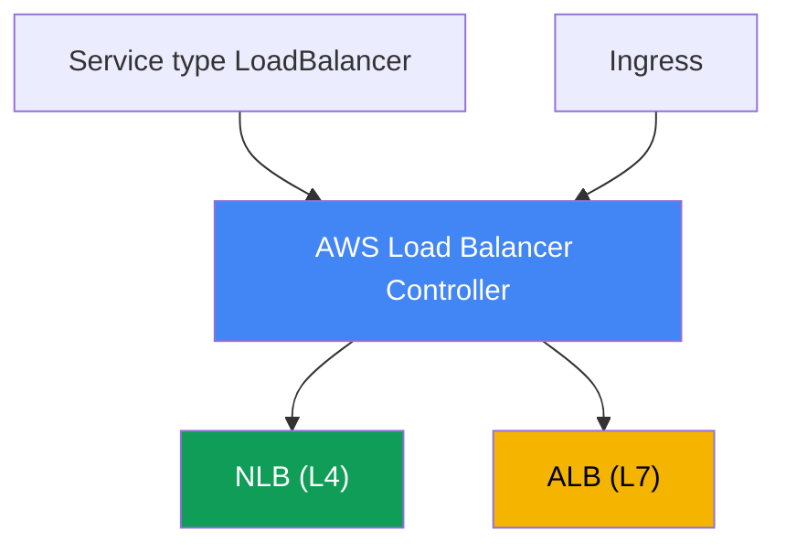
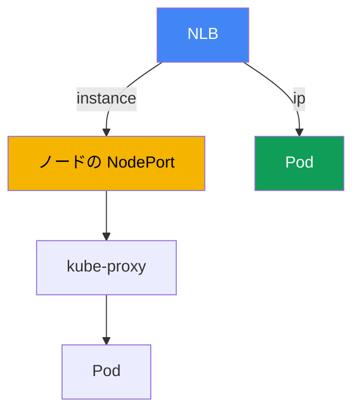

[Eng version](en.md) · [Versión en español](es.md) · [Version française](fr.md) · [Deutsche Version](de.md) · [Русская версия](ru.md) · [ქართული ვერსია](ge.md) · [繁體中文版](tw.md)
# 第26章. AWS Load Balancer Controller と LoadBalancer 型 Service: NLB

> **次は何か。** ここから第5部、ネットワークとトラフィックです。第3部と第4部で
> アイデンティティ、セキュリティ、ストレージを扱いました。ここからは外部トラフィックがどのように
> クラスターへ届くかを確認します。最初の層は Pod の前にあるロードバランサーです。本章では Network Load
> Balancer と LoadBalancer 型 Service による L4 負荷分散を扱います。Ingress と ALB による L7 ルーティングは
> 第27章、Gateway API と VPC Lattice は第28章、DNS と証明書（external-dns、ACM、cert-manager）は第29章です。
> Pod が VPC 内で IP を取得する仕組み（VPC CNI）は第8章、IRSA または Pod Identity によるコントローラー用の
> ロールは第16-17章で扱います。本章では繰り返さず参照します。

## 26.1. 「LoadBalancer を要求したら、古い Classic Load Balancer が来た」

エンジニアが、Kubernetes でおなじみの方法でサービスを外部公開します。LoadBalancer 型の Service です。

```yaml
apiVersion: v1
kind: Service
metadata:
  name: web
spec:
  type: LoadBalancer
  selector: {app: web}
  ports:
    - port: 80
      targetPort: 8080
```

適用して外部アドレスを待ち、作成されたものを確認します。

```bash
kubectl get svc web
# NAME  TYPE           EXTERNAL-IP                             PORT(S)
# web   LoadBalancer   a1b2...elb.eu-central-1.amazonaws.com   80:31842/TCP
```

アドレスは割り当てられ、サービスにも到達できます。しかし EC2 コンソールでこの DNS 名を見ると、そこにあるのは
**Classic Load Balancer** です。これは AWS が長年開発していない旧世代のロードバランサーです。これを作成したのは
Kubernetes コンポーネントに組み込まれた in-tree cloud provider です。エンジニアが必要としているのは Network
Load Balancer です。静的 IP、UDP のサポート、高性能な L4、Pod IP へのターゲットを備えています。さらに、コンソールを
クリックするのではなく、マニフェストから health check と target group を宣言的に管理したいと考えています。

問題はロードバランサーの種類だけではありません。In-tree provider の機能は限られ、設定も乏しく、Kubernetes の
ライフサイクルに結び付けられており、実質的に凍結されています。クラスターを介さずコンソールまたは Terraform で
NLB と target group を手動作成する方法はスケールしません。ノードまたは Pod の集合が変わるたびに、ターゲットを
手動で再登録する必要があり、実際のクラスター状態と乖離します。必要なのはクラスター内で動作し、Service と
Endpoints を監視して、NLB と target group をそれらに一致する状態へ自ら収束させるコントローラーです。それが
AWS Load Balancer Controller であり、コースのネットワーク部分はここから始まります。

## 26.2. AWS Load Balancer Controller: これは何で、どうインストールするか

AWS Load Balancer Controller（略称 LBC）は、クラスターリソースを監視し、それに対応する Elastic Load Balancing を
作成する Kubernetes コントローラーです。2つのシナリオを扱います。

- **LoadBalancer 型 Service** を **Network Load Balancer**（NLB、L4）に変換します。これが本章のテーマです。
- **Ingress** を **Application Load Balancer**（ALB、L7）に変換します。これは第27章のテーマであり、ここでは
  言及のみです。



コントローラーは EKS managed addon ではなく、**Helm 経由**でインストールします。公式チャートは `eks`
リポジトリ（`https://aws.github.io/eks-charts`）にあります。

```bash
helm repo add eks https://aws.github.io/eks-charts
helm repo update
helm install aws-load-balancer-controller eks/aws-load-balancer-controller \
  -n kube-system \
  --set clusterName=<cluster-name> \
  --set serviceAccount.create=false \
  --set serviceAccount.name=aws-load-balancer-controller
```

コントローラーは AWS のアイデンティティで動作します。NLB、target group、listener、security groups のルールを
作成・変更します。したがって、ServiceAccount に関連付けた **IAM ロール**が必要です。ロールは **IRSA** または
**EKS Pod Identity**（第16-17章）で付与します。上の例で `serviceAccount.create=false` としているのはこのためです。
ロールのアノテーションを持つ service account はあらかじめ作成します。

権限は、コントローラーのリポジトリにある既成のポリシードキュメント `iam_policy.json` に定義されています。
これから IAM ポリシーを作成し（ドキュメントの慣例では `AWSLoadBalancerControllerIAMPolicy` と名付けます）、
コントローラーのロールに関連付けます。

```bash
curl -o iam_policy.json https://raw.githubusercontent.com/kubernetes-sigs/\
aws-load-balancer-controller/main/docs/install/iam_policy.json
aws iam create-policy --policy-name AWSLoadBalancerControllerIAMPolicy \
  --policy-document file://iam_policy.json
```

ロールがない、またはポリシーが削られている場合、コントローラーは起動してもロードバランサーを作成できません。
Service は `<pending>` のままとなり、コントローラーのログには `AccessDenied` が表示されます。

## 26.3. In-tree cloud provider 対 LB Controller と external モード

26.1 で Classic Load Balancer が出現した理由を見ていきましょう。歴史的に、LoadBalancer 型 Service は
**組み込みの in-tree cloud provider** によって処理されていました。これは `kube-controller-manager` 内の AWS コードで、
後に `cloud-controller-manager` へ切り出されました。デフォルトではこれが LoadBalancer 型 Service を reconcile して
CLB を作成します。機能は限られ、開発も停止しており、AWS はこの処理を LBC に任せることを推奨しています。

LBC に reconciliation を引き継がせるには、Service に次のアノテーションを付けます。

```yaml
service.beta.kubernetes.io/aws-load-balancer-type: external
```

`external` は、in-tree provider に対する「この Service には触れないで、外部コントローラーが処理する」というシグナルです。
LBC はこのアノテーションを検出して NLB を作成します。もう1つのより新しい方法は
`spec.loadBalancerClass: service.k8s.aws/nlb` フィールドです。これは cloud provider 非依存の形で同じことをします。
新しい LBC バージョンでは mutating webhook が `loadBalancerClass` を自動設定し、実質的に新しい LoadBalancer 型
Service のデフォルトハンドラーをコントローラーにします。

運用上の重要なルールが1つあります。**`aws-load-balancer-type` アノテーションを、すでに存在する Service に追加または
変更してはいけません**。稼働中サービスのハンドラーを切り替えると不整合が発生します。以前作成した AWS リソースの
リーク、または意図しない NLB のインターネット公開が起こり得ます。ハンドラーの種類は Service 作成時に固定します。

| プロパティ | In-tree cloud provider | AWS Load Balancer Controller |
|---|---|---|
| Service LB に対して作成するもの | Classic Load Balancer | Network Load Balancer |
| 動作場所 | Kubernetes コンポーネント内部 | クラスター内の個別コントローラー |
| インストール | 組み込み | Helm、専用 IAM ロール |
| 開発状況 | 凍結 | 活発、AWS 推奨 |
| LBC を有効にする方法 | - | `aws-load-balancer-type: external` |

## 26.4. LoadBalancer 型 Service による NLB: 主要なアノテーション

NLB の動作は Service 上のアノテーションで設定します。名前は長いですが、すべて
`service.beta.kubernetes.io/aws-load-balancer-` という接頭辞に従います。基本セットは次のとおりです。

- **`aws-load-balancer-type: external`**: Service を LBC コントローラーへ渡す（26.3）。
- **`aws-load-balancer-nlb-target-type`**: ターゲットの種類。`instance` または `ip`（26.5）。
- **`aws-load-balancer-scheme`**: `internal` または `internet-facing`。v2.2.0 以降、コントローラーはデフォルトで
  **`internal`** NLB を作成します。パブリックにするには scheme を明示的に指定します。これはサービスの誤った外部公開を
  防ぐためです。
- **`aws-load-balancer-healthcheck-*`**: target group の health check パラメーター。
  `-protocol`、`-port`、`-path`、`-interval`、`-timeout`、`-healthy-threshold`、`-unhealthy-threshold`、
  `-success-codes`。

Pod IP をターゲットにするパブリック NLB の一般的なマニフェストです。

```yaml
apiVersion: v1
kind: Service
metadata:
  name: web
  annotations:
    service.beta.kubernetes.io/aws-load-balancer-type: external
    service.beta.kubernetes.io/aws-load-balancer-nlb-target-type: ip
    service.beta.kubernetes.io/aws-load-balancer-scheme: internet-facing
    service.beta.kubernetes.io/aws-load-balancer-healthcheck-protocol: http
    service.beta.kubernetes.io/aws-load-balancer-healthcheck-path: /healthz
spec:
  type: LoadBalancer
  selector: {app: web}
  ports:
    - port: 80
      targetPort: 8080
      protocol: TCP
```

| アノテーション | 値 | デフォルト |
|---|---|---|
| `aws-load-balancer-type` | `external` | in-tree が処理 |
| `aws-load-balancer-nlb-target-type` | `instance`, `ip` | `instance` |
| `aws-load-balancer-scheme` | `internal`, `internet-facing` | `internal` |
| `aws-load-balancer-healthcheck-protocol` | `tcp`, `http`, `https` | `tcp` (Cluster) |
| `aws-load-balancer-healthcheck-interval` | 秒 | `10` |
| `aws-load-balancer-healthcheck-healthy-threshold` | 数値 | `3` |

health check のデフォルト値（間隔 `10`、タイムアウト `10`、しきい値 `3`、コード `200-399`）は
コントローラーによって設定されます。必要な場合のみ上書きしてください。ほかに有用なアノテーションは
`aws-load-balancer-name`、`aws-load-balancer-subnets`、`aws-load-balancer-ssl-cert`（ACM の証明書による TLS 終端）、
`aws-load-balancer-attributes`（cross-zone などの NLB 属性）です。

2つのアノテーションは本番環境で特に役立ちます。`aws-load-balancer-eip-allocations` は、あらかじめ確保した Elastic IP を
パブリック NLB に関連付けます（サブネットごとに1つの allocation）。これによりサービスの外部アドレスは静的になり、
NLB を再作成しても維持されます。`aws-load-balancer-target-group-attributes` は target group の属性を
`key=value` 形式の文字列で設定します。`deregistration_delay.timeout_seconds` キー（デフォルトの `300` ではなく
`15` または `30` など）を使うと、ターゲットをグループから除外するまでの待機時間を短縮できます。これによりデプロイ中、
NLB は TCP セッションを適切に終了させながら、Pod を不要に何分も draining 状態に保持しません（graceful deregistration）。

**ゾーン間負荷分散。** NLB の cross-zone load balancing は、target group レベルではデフォルトで**無効**です
（常に有効な ALB とは異なります）。各ゾーンの NLB は同じゾーンのターゲットにだけトラフィックを送ります。Pod の
AZ 間の配置が非対称であれば、レプリカへの負荷が不均等になります。これも `target-group-attributes` で有効にします。
`cross_zone.load_balancing.enabled=true`。トレードオフは FinOps です。全ゾーンの全 Pod に負荷を均等化することと、
ゾーン間トラフィックの料金（cross-AZ data transfer は課金対象）の比較になります。これは
`externalTrafficPolicy`（26.6）とも相互作用します。`Local` もトラフィックをノード内に留め、非対称な配置時の偏りを
強めます。

**Security groups と IaC ドリフト。** v2.6.0 以降の LBC は、NLB 用の frontend security group を自ら作成し、
ノードと Pod の backend SG ルールを変更できます。ネットワークとすべての SG を Terraform または Terragrunt で
管理している場合、この自動変更は状態ドリフトを起こします。`plan` にはコードにないルール変更が表示されます。
これは2つのアノテーションで管理します。`aws-load-balancer-manage-backend-security-group-rules: "false"` は
backend SG ルールを自分の IaC の管理下に置き、`aws-load-balancer-security-groups` は自動作成の代わりに Terraform で
事前作成した frontend group を NLB に関連付けます。これなら SG の所有者は1つになり、ドリフトは発生しません。

## 26.5. target-type: instance 対 ip

NLB を使う際の重要な選択は、ロードバランサーがトラフィックをどこへ送るかです。モードは2つあります。

**`instance`** では、グループのターゲットは EC2 ノード、より正確にはその `NodePort` です。NLB はクラスター内の
任意のノードの `NodePort` にパケットを送り、そのノードの `kube-proxy` が iptables または IPVS のルールに従って
Pod までトラフィックを配信します。Pod が別のノードにある場合は、ノード間の余分なネットワークホップが加わります。
結果は `externalTrafficPolicy`（26.6）に依存します。この場合、Service は `NodePort` または `LoadBalancer` 型で
なければなりません。

**`ip`** では、ターゲットは **Pod 自身の IP** です。VPC CNI が AWS ネットワーク内でルーティング可能な実際の VPC
アドレスを Pod に付与するため、これが可能になります（第8章）。NLB は `NodePort` と `kube-proxy` を経由せず直接
Pod にトラフィックを送ります。そのためホップが1つ少なく、Pod がどのノードで動いているかにも依存しません。
`ip` モードは通常の EC2 ノードも `NodePort` も存在しない **Fargate では必須**です。



`ip` モードにはネットワーク要件があります。Pod が VPC アドレスを取得していること（VPC CNI、第8章）、および
security groups とサブネットが NLB から Pod ポートへの到達を許可していることです。v2.6.0 以降、コントローラーは
frontend と backend の security groups を自ら作成して NLB に付与し、アクセスルールを変更します。より古い
バージョンでは、ノードの security group に inbound ルールを追加していました。

| 基準 | `instance` | `ip` |
|---|---|---|
| ターゲット | ノードの `NodePort` | Pod IP に直接 |
| トラフィック経路 | NLB -> NodePort -> kube-proxy -> Pod | NLB -> Pod |
| ノード間の余分なホップ | あり得る | なし |
| Service の型 | `NodePort` または `LoadBalancer` | VPC CNI を持つ任意の型 |
| Fargate | 動作しない | 必須 |
| Client source IP | `externalTrafficPolicy` に依存 | target group 属性に依存 |
| 要件 | `NodePort` が開いていること | VPC CNI、SG/サブネットの到達性 |

実践的なルールとして、VPC CNI を使う EC2 ではデフォルトで `ip` を選びます。ホップが少なく、client IP の保持も
簡単です。特に `NodePort` 経由の入口が必要な場合、または特定のネットワーク構成が必要とする場合に `instance` を選びます。

## 26.6. externalTrafficPolicy: Cluster 対 Local

Service の `spec.externalTrafficPolicy` フィールドは、ノードが外部トラフィックをどのように扱うかを制御します。
特に `instance` モードで重要です。

**`Cluster`**（デフォルト値）では、任意のノードの `NodePort` に到着したトラフィックを、`kube-proxy` が**別の**
ノード上の Pod に転送できます。すべての Pod に均等に負荷分散されますが、ノード間の追加ホップが生じ、同時に SNAT が
行われます。つまり、**クライアントの送信元 IP は失われ**、Pod からはノードのアドレスに見えます。必要な Pod が
存在しないノードも含め、クラスターのすべてのノードが health check に応答します。

**`Local`** では、ノードはトラフィックを**自分のローカル Pod にだけ**送信し、別の場所へ転送しません。余分なホップが
なくなり、**client source IP が保持されます**。その対価として、ノードにその Service の Pod が1つもなければ health
check は unhealthy となり、NLB はそのノードへトラフィックを送らなくなります。Pod のノード間配置が不均等なら、
負荷分散も不均等になります。Local を正しく動作させるには、Pod をノード間に適切に分散することが重要です
（topology spread、第40章）。

これは 26.4 の health check と直接関係します。コントローラーはポリシーを考慮します。`Cluster` では health check
のデフォルトプロトコルは `tcp` です。`Local` では `spec.healthCheckNodePort` に対する `http` が推奨され、`Local` で
`tcp` を使うべきではありません。Pod があるノードとないノードを区別できないためです。

| 観点 | `Cluster` | `Local` |
|---|---|---|
| 別ノードの Pod への転送 | はい | いいえ |
| 余分なホップ | あり得る | なし |
| Client source IP | 失われる（SNAT） | 保持される |
| Health check に応答するもの | すべてのノード | Pod があるノードのみ |
| 分散 | 均等 | Pod 配置に依存 |

`ip` モードでは状況が異なります。トラフィックはすでに直接 Pod へ送られ、client IP の保持は target group 属性
`preserve_client_ip` で制御します（`ip` ではデフォルトで無効、`instance` では有効です）。アプリケーションで
クライアントの送信元 IP が必要な場合は、別途確認します。`instance` ではポリシー、`ip` では target group 属性で
確認します。

## 26.7. NLB 対 ALB: どちらをいつ使うか

LBC はどちらのロードバランサーも扱えます。それらの選択は OSI モデルのレイヤーを選択することです。ALB を詳しく
扱う第27章との重複を避け、ここでは簡潔に説明します。

- **NLB は L4 です。** TCP と UDP のレイヤーで動作し、HTTP を解析しません。これが強みにつながります。非常に高い
  性能と低レイテンシ、UDP サポート、サブネットごとの静的 IP、Elastic IP の関連付けです。非 HTTP プロトコル
  （TCP 上の gRPC、ゲーム用 UDP サービス、データベース、ブローカー）や、リクエスト解析なしの純粋な L4 が必要な
  場合に使います。
- **ALB は L7 です。** HTTP と HTTPS を理解します。host と path によるルーティング、ヘッダー、redirect、認証、
  WAF 統合が可能です。コンテンツベースのルーティングを必要とする Web アプリケーションと API に適しています。
  EKS では、通常 ALB は Ingress から作成されます（第27章）。

NLB は **UDP** 上のアプリケーション（DNS、メディアストリーミング、ゲームサーバー）と、UDP 上の
**QUIC（HTTP/3）** で唯一の選択肢です。ALB は TCP のみで動作し、HTTP、HTTPS、HTTP/2 は扱えますが UDP と QUIC は
扱えません。アプリケーションが入口で HTTP/3 を必要とするなら、ALB ではなく NLB（または NLB の背後にある独自の
プロキシ）で終端します。

大まかなルールはこうです。path と host による HTTP ルーティングは Ingress 経由の ALB（第27章）、純粋な L4、UDP、
QUIC、静的 IP、または最大のスループットには、本章のように LoadBalancer 型 Service 経由の NLB を選びます。

## 26.8. gRPC と service mesh: なぜ L4 はストリームを負荷分散しないのか

バックエンドの一部が gRPC（HTTP/2 上）で通信しており、スケール後に負荷が分散しません。1つのレプリカが過負荷なのに、
新しいレプリカはアイドルです。その理由は、gRPC クライアントが**1つの長寿命 HTTP/2 connection**を開き、その上で
すべての RPC を多重化するためです。Service と NLB は L4（connection-level）で動作し、リクエストではなく接続を
負荷分散します。接続が1つなら、クライアントのすべてのトラフィックは1つの Pod に固定され、追加したレプリカは
アイドルのままです。同じことは persistent connection（データベース、ブローカー、websocket）でも起こります。

kube-proxy と NLB は TCP connection を負荷分散の単位として見ており、内部を数百の独立したリクエストが流れていることを
解析しません。**リクエスト単位**で負荷を分散するには、HTTP/2 を理解する L7 が必要です。選択肢は3つあります。

**選択肢1: north-south gRPC 用 L7 ロードバランサー。** 外部 gRPC は ALB 経由にします。Ingress に
`alb.ingress.kubernetes.io/backend-protocol-version: GRPC` を設定すると、ALB はリクエストレベルで負荷分散し、
gRPC healthcheck も扱えます。ALB と Ingress は第27章で扱います。ここで重要なのは、L7 が受信 gRPC の固定化を
解消する点です。

**選択肢2: クライアント側負荷分散。** Headless Service（`clusterIP: None`）はクライアントに単一の VIP ではなく
すべての Pod アドレスを返します。gRPC クライアントは `round_robin` ポリシーで、それらに RPC を自ら分散します。
ただしクライアントが client-side LB をサポートし、スケール時に DNS を re-resolve しなければ、新しい Pod はプールへ
入りません。

**選択肢3: east-west 用 service mesh。** サービス間通信には Istio または Linkerd を導入します。Pod の隣に
sidecar proxy が現れ（Istio には sidecar を使わない ambient モードもあります）、gRPC と HTTP/2 に対する
per-request の L7 負荷分散を実行します。加えて mesh は mTLS、retries、timeouts、circuit breaking、トラフィックの
局所性、可観測性（golden signals）を提供します。Istio の詳細は別コース ICA で扱います。

EKS で mesh を使う正直なコストは次のとおりです。sidecar proxy は CPU とメモリを消費し、少しレイテンシも増やします。
mesh 独自のライフサイクルとアップグレードがあり（managed addon ではありません）、診断が複雑になり、VPC CNI と
NetworkPolicy（第30章）との接続点を考慮する必要があります。Istio ambient は per-pod sidecar をなくすことで、
オーバーヘッドの一部を軽減します。

使い分けはこうです。外部公開する gRPC サービスが1つか2つなら GRPC を使う ALB（第27章）、多くの内部サービスで
mTLS、retries、可観測性が必要なら mesh です。1つの gRPC の負荷分散だけのために mesh を導入すべきではありません。
複雑さに見合いません。

| アプローチ | 負荷分散するもの | 得られるもの | 支払うコスト |
|---|---|---|---|
| NLB / Service (L4) | 接続 | シンプルな L4、高スループット | gRPC が Pod に固定される |
| ALB gRPC (L7) | north-south リクエスト | per-request LB、gRPC healthcheck | HTTP/2 のみ、外部からの入口 |
| headless + client-side LB | クライアントによるリクエスト | プロキシ不要、最小のホップ数 | クライアントのサポート、re-resolve |
| service mesh Istio/Linkerd | east-west リクエスト | per-request LB、mTLS、retries、メトリクス | オーバーヘッド、独自アップグレード |

## 26.9. 本番環境での適用方法

- **LBC を標準とし、in-tree は使わない。** コントローラーを IRSA/Pod Identity ロールとともに Helm で一度だけ
  インストールし、すべての外部サービスをそれ経由にします。組み込み provider による CLB 作成は古いシナリオとみなします。
- **VPC CNI を使う EC2 ではデフォルトで `ip`。** Pod IP をターゲットにするとホップが少なく、client IP の扱いも
  簡単です。`instance` は `NodePort` 経由の入口が必要な場合に残します。
- **`scheme` を明示的に設定する。** パブリック NLB は、サービスがインターネットに公開されることを理解した上で、
  `internet-facing` を明示した場合にのみ作成します。コントローラーのデフォルトである `internal` は正しいデフォルトです。
- **最小 IAM ポリシーと狭い送信元。** ロールには `iam_policy.json` の権限だけを与え、`0.0.0.0/0` を残さず
  `spec.loadBalancerSourceRanges` で NLB へのアクセスを制限します。
- **ハンドラーの種類を作成時に固定する。** リソースリークや予期しない NLB の公開を避けるため、稼働中の Service で
  `aws-load-balancer-type` アノテーションを変更しません。
- **静的 IP と滑らかなデプロイ。** パブリック NLB には `aws-load-balancer-eip-allocations` を介して Elastic IP を
  与え、`aws-load-balancer-target-group-attributes` 内の `deregistration_delay.timeout_seconds` を下げて、
  デプロイ時に TCP セッションが切断されないようにします。

## 26.10. ミニ用語集

- **AWS Load Balancer Controller (LBC)**: クラスター内のコントローラー。LoadBalancer 型 Service 用の NLB と
  Ingress 用の ALB を作成する。Helm 経由でインストールし、IAM ロールが必要。
- **in-tree cloud provider**: Kubernetes コンポーネントに組み込まれた AWS コード。デフォルトでは LoadBalancer 型
  Service に対して Classic Load Balancer を作成する。
- **NLB (Network Load Balancer)**: L4（TCP/UDP）のロードバランサー。高性能、静的 IP を持つ。LBC が
  LoadBalancer 型 Service から作成する。
- **external モード**: `aws-load-balancer-type` アノテーションの値。in-tree provider ではなく外部 LBC
  コントローラーに Service の reconciliation を任せる。
- **target-type**: NLB のターゲット種別。`instance`（ノードの `NodePort` 経由）または `ip`（Pod IP に直接、VPC CNI が
  必要、Fargate では必須）。
- **externalTrafficPolicy**: Service のポリシー。`Cluster`（任意ノードへ転送、SNAT）または `Local`（ローカル Pod のみ、
  client IP を保持）。
- **preserve_client_ip**: `ip` モードでクライアントの送信元 IP を保持するかを制御する NLB target group 属性。

## 26.11. 章のまとめ

- LoadBalancer 型 Service はデフォルトで組み込みの in-tree cloud provider によって処理され、設定が最小限の古い
  Classic Load Balancer を作成します。
- AWS Load Balancer Controller は、LoadBalancer 型 Service に対して NLB、Ingress に対して ALB を作成する
  クラスター内コントローラーです（Ingress は第27章）。Helm 経由でインストールし、managed addon ではありません。
  `iam_policy.json` のポリシーとともに、IRSA または Pod Identity（第16-17章）を介した IAM ロールが必要です。
- Service の reconciliation は、`service.beta.kubernetes.io/aws-load-balancer-type: external` アノテーション
  （または `loadBalancerClass: service.k8s.aws/nlb`）によってコントローラーに渡します。ハンドラー種別は作成時に
  固定し、稼働中の Service では変更しません。
- NLB の動作は、`nlb-target-type`、`scheme`（デフォルトは `internal`）、`healthcheck-*` ファミリーの
  アノテーションで設定します。パブリック NLB には明示的な `internet-facing` が必要です。
- `instance` はノードの `NodePort` へ送信し、そこから `kube-proxy` を経由して Pod に届けます（余分なホップの可能性）。
  `ip` は VPC CNI 経由で直接 Pod IP に送信します（第8章）。ホップが少なく、Fargate では必須です。
- `externalTrafficPolicy: Cluster` は均等に負荷分散しますが client IP を失い、ホップを追加します。`Local` は client IP を
  保持してホップをなくしますが、health check を通るのは Pod があるノードだけです。
- NLB は L4（TCP/UDP、静的 IP、性能）、ALB は L7（HTTP ルーティング）です。ALB は第27章で詳しく扱います。

## 26.12. 実務での活用方法

オンコール時の NLB ネットワークインシデントは、ほとんどがいくつかの原因に集約されます。Service が `<pending>` のままで
外部アドレスが割り当てられない場合は、コントローラーがインストールされているか、ロールに権限があるか（ログの
`AccessDenied`）、`external` アノテーションが付いているかを確認します。ロードバランサーは作成されたがターゲットが
`unhealthy` なら、health check（`externalTrafficPolicy` に合わせたプロトコルとポート）と、`ip` モードでの security
groups による Pod ポートの到達性を調べます。アプリケーションがクライアントの送信元 IP を見られないなら、それは
バグではなく、`instance` モードの `Cluster`、または `ip` モードで `preserve_client_ip` が無効な結果です。計画時には
あらかじめ2つの決定をしておきます。target-type（VPC CNI を使う EC2 ではデフォルトで `ip`）と、scheme（サービスを
インターネットへ出すべきでないなら `internal`）です。また、不可逆性を忘れないでください。ハンドラー種別と多くの
パラメーターは Service 作成時に固定されるため、稼働中トラフィックで作り直すより設計段階で決める方が容易です。

## 26.13. 自己確認の質問

1. EKS の通常の LoadBalancer 型 Service がデフォルトで Classic Load Balancer を作成するのはなぜですか？
2. AWS Load Balancer Controller とは何で、どの2種類のロードバランサーを作成しますか？
3. LBC を managed addon ではなく Helm でインストールする理由と、IAM ロールが必要な理由は何ですか？
4. コントローラーにはどのようにロールを付与し、その IAM ポリシーはどこから取得しますか？
5. `aws-load-balancer-type: external` アノテーションは何をし、後から変更してはいけないのはなぜですか？
6. NLB を設定する主要なアノテーションは何で、デフォルトではどの scheme が作成されますか？
7. トラフィック経路とホップ数において、`target-type: instance` と `ip` はどう異なりますか？
8. Fargate で `target-type: ip` が必要なのはなぜで、VPC CNI（第8章）とはどう関係しますか？
9. `externalTrafficPolicy: Cluster` と `Local` は、client source IP とホップにどう影響しますか？
10. `Local` ではすべてのノードが health check を通らないのはなぜで、分散にはどのような影響がありますか？
11. `ip` モードでクライアントの送信元 IP を保持する方法と、`instance` モードとの違いは何ですか？
12. NLB と ALB はいつ選び分け、ALB はどの章で扱いますか？
13. Service が外部アドレスなしで `<pending>` のままです。何をどの順に確認しますか？
14. パブリック NLB に静的アドレスを付ける方法と、デプロイ時の TCP セッション切断を緩和する方法は何ですか？

## Practice

このテーマに対応するコースラボ: [ラボ108: AWS Load Balancer Controller: LoadBalancer 型 Service 用 NLB](../../labs/108/README_JP.MD)。
それ以外はすべて稼働中のクラスターで確認します。まずコントローラーがインストール済みで正常であることを確認し、
その service account と関連付けられたロールを見ます。

```bash
kubectl get deploy -n kube-system aws-load-balancer-controller
kubectl get pods -n kube-system | grep load-balancer
kubectl get sa -n kube-system aws-load-balancer-controller -o yaml
```

続いてモードの違いを再現します。`aws-load-balancer-type: external`、
`aws-load-balancer-nlb-target-type: ip`、`aws-load-balancer-scheme: internal` のアノテーションを持つ
LoadBalancer 型 Service を作成し、アドレスを待機します（`kubectl get svc web -w`）。その後、AWS 側で作成された NLB を
見つけます。`aws elbv2 describe-load-balancers` はロードバランサーとその `Scheme`、`aws elbv2 describe-target-groups` は
ターゲットグループ、`aws elbv2 describe-target-health --target-group-arn <arn>` はターゲットとして登録されているものを
表示します。`ip` モードではターゲットに Pod IP が見えます。`instance` に切り替え（既存の Service は変更せず、新しい
Service で行います）、比較してください。ターゲットは `NodePort` を持つノードになります。

health check と client IP も別途確認します。`externalTrafficPolicy` を `Cluster` と `Local` の間で変更し、healthy
ターゲットの集合がどう変化するか、アプリケーションログにクライアントの送信元 IP が見えるかを追跡します。最後に権限を
確認します。ロールのポリシーを一時的に狭め、Service を再作成して、ログに `AccessDenied` を見つけます
（`kubectl logs -n kube-system deploy/aws-load-balancer-controller`）。その後、ポリシーを戻します。

---
[目次](../README_JP.md) · [第25章](../25/jp.md) · [第27章](../27/jp.md)
