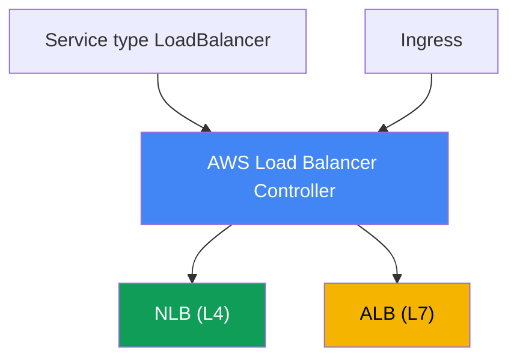
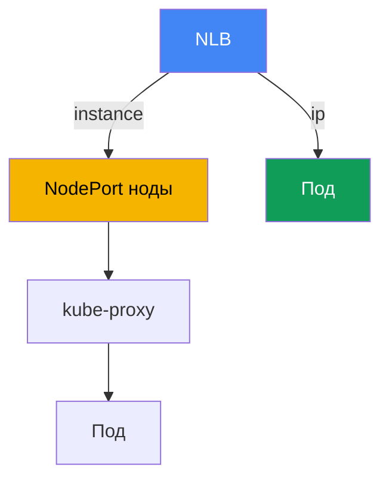

# Глава 26. AWS Load Balancer Controller и Service типа LoadBalancer: NLB

> **Что дальше.** Это начало Части 5 - про сеть и трафик. Части 3 и 4 закрыли
> идентичность, безопасность и хранение; теперь разбираем, как трафик снаружи попадает
> в кластер. Первый слой - балансировщик перед подами. В этой главе - L4-балансировка
> через Network Load Balancer и Service типа LoadBalancer. L7-роутинг через Ingress и ALB
> - глава 27, Gateway API и VPC Lattice - глава 28, DNS и сертификаты (external-dns, ACM,
> cert-manager) - глава 29. Как под получает IP в VPC (VPC CNI) - глава 8, а роль для
> контроллера через IRSA или Pod Identity - главы 16-17. На них ссылаемся, не повторяя.

## 26.1. «Просил LoadBalancer, получил старый Classic Load Balancer»

Инженер выкатывает сервис наружу привычным для Kubernetes способом - Service типа
LoadBalancer:

```yaml
apiVersion: v1
kind: Service
metadata:
  name: web
spec:
  type: LoadBalancer
  selector: {app: web}
  ports:
    - port: 80
      targetPort: 8080
```

Применяет, ждёт внешний адрес и смотрит, что создалось:

```bash
kubectl get svc web
# NAME  TYPE           EXTERNAL-IP                             PORT(S)
# web   LoadBalancer   a1b2...elb.eu-central-1.amazonaws.com   80:31842/TCP
```

Адрес выдан, сервис доступен. Но в консоли EC2 под этим DNS-именем оказывается **Classic
Load Balancer** - балансировщик прошлого поколения, который AWS давно не развивает. Его
создал встроенный in-tree cloud provider, зашитый в компоненты Kubernetes. Инженеру же
нужен Network Load Balancer: статические IP, поддержка UDP, высокая производительность L4,
таргеты на IP подов. А ещё он хочет управлять health check и таргет-группами декларативно,
из манифеста, а не кликами в консоли.

Проблема глубже одного типа балансировщика. In-tree провайдер умеет мало, настраивается
скупо, привязан к жизненному циклу Kubernetes и по факту заморожен. Ручное создание NLB и
таргет-групп в консоли или Terraform в обход кластера не масштабируется: при каждом
изменении набора нод или подов таргеты надо перерегистрировать руками, и они разъезжаются
с реальным состоянием кластера. Нужен контроллер, который живёт в кластере, видит Service и
Endpoints и сам приводит NLB и таргет-группы в соответствие. Это AWS Load Balancer
Controller, и с него начинается вся сетевая часть курса.

## 26.2. AWS Load Balancer Controller: что это и как ставится

AWS Load Balancer Controller (сокращённо LBC) - это контроллер Kubernetes, который следит
за ресурсами кластера и создаёт под них Elastic Load Balancing. Он закрывает два сценария:

- **Service типа LoadBalancer** он превращает в **Network Load Balancer** (NLB, L4). Это
  тема текущей главы.
- **Ingress** он превращает в **Application Load Balancer** (ALB, L7). Это тема главы 27,
  здесь только упоминаем.



Контроллер ставится **через Helm**, а не как managed addon EKS. Официальный чарт лежит в
репозитории `eks` (`https://aws.github.io/eks-charts`):

```bash
helm repo add eks https://aws.github.io/eks-charts
helm repo update
helm install aws-load-balancer-controller eks/aws-load-balancer-controller \
  -n kube-system \
  --set clusterName=<cluster-name> \
  --set serviceAccount.create=false \
  --set serviceAccount.name=aws-load-balancer-controller
```

Контроллер работает от имени AWS: создаёт и меняет NLB, таргет-группы, listener'ы, правила
security groups. Значит, ему нужна **IAM-роль**, привязанная к его ServiceAccount. Роль
выдаётся через **IRSA** или **EKS Pod Identity** (главы 16-17) - в примере выше поэтому
`serviceAccount.create=false`: сервис-аккаунт с аннотацией роли создаётся заранее.

Права описаны готовым документом политики `iam_policy.json` из репозитория контроллера.
Из него создают IAM-политику (по соглашению из документа её называют
`AWSLoadBalancerControllerIAMPolicy`) и привязывают к роли контроллера:

```bash
curl -o iam_policy.json https://raw.githubusercontent.com/kubernetes-sigs/\
aws-load-balancer-controller/main/docs/install/iam_policy.json
aws iam create-policy --policy-name AWSLoadBalancerControllerIAMPolicy \
  --policy-document file://iam_policy.json
```

Без роли или с урезанной политикой контроллер стартует, но не может создать балансировщик:
Service остаётся в `<pending>`, а в логах контроллера видно `AccessDenied`.

## 26.3. In-tree cloud provider против LB Controller и режим external

Разберём, почему в 26.1 появился Classic Load Balancer. Исторически Service типа
LoadBalancer обрабатывал **встроенный in-tree cloud provider** - код AWS внутри
`kube-controller-manager` (позже вынесенный в `cloud-controller-manager`). По умолчанию
именно он реконсилит Service типа LoadBalancer и создаёт под него CLB. Возможности его
ограничены, развитие остановлено, и AWS рекомендует отдавать эту работу LBC.

Чтобы LBC забрал реконсиляцию себе, Service помечают аннотацией:

```yaml
service.beta.kubernetes.io/aws-load-balancer-type: external
```

Значение `external` - сигнал in-tree провайдеру «не трогай этот Service, им займётся
внешний контроллер». LBC видит аннотацию и создаёт NLB. Есть и второй, более новый способ
- поле `spec.loadBalancerClass: service.k8s.aws/nlb`; оно делает то же самое
Cloud-Provider-независимым образом. В свежих версиях LBC ставит mutating webhook, который
проставляет `loadBalancerClass` автоматически, фактически делая контроллер обработчиком по
умолчанию для новых Service типа LoadBalancer.

Одно важное правило эксплуатации: **аннотацию `aws-load-balancer-type` не добавляют и не
меняют на уже существующем Service**. Смена обработчика на живом сервисе ведёт к
рассинхронизации: возможны утечка ранее созданных ресурсов AWS или, наоборот, внезапная
публикация NLB в интернет. Тип обработчика фиксируют при создании Service.

| Свойство | In-tree cloud provider | AWS Load Balancer Controller |
|---|---|---|
| Что создаёт для Service LB | Classic Load Balancer | Network Load Balancer |
| Где живёт | внутри компонентов Kubernetes | отдельный контроллер в кластере |
| Установка | встроен | Helm, своя IAM-роль |
| Развитие | заморожено | активное, рекомендуется AWS |
| Как включить LBC | - | `aws-load-balancer-type: external` |

## 26.4. NLB через Service типа LoadBalancer: ключевые аннотации

Поведение NLB настраивается аннотациями на Service. Имена длинные, но подчиняются одному
префиксу `service.beta.kubernetes.io/aws-load-balancer-`. Базовый набор:

- **`aws-load-balancer-type: external`** - отдать Service контроллеру LBC (26.3).
- **`aws-load-balancer-nlb-target-type`** - тип таргета: `instance` или `ip` (26.5).
- **`aws-load-balancer-scheme`** - `internal` или `internet-facing`. По умолчанию с версии
  v2.2.0 контроллер создаёт **`internal`** NLB; чтобы получить публичный, схему указывают
  явно. Это защита от случайной публикации сервиса наружу.
- **`aws-load-balancer-healthcheck-*`** - параметры health check таргет-группы: `-protocol`,
  `-port`, `-path`, `-interval`, `-timeout`, `-healthy-threshold`, `-unhealthy-threshold`,
  `-success-codes`.

Типовой манифест публичного NLB с таргетами на IP подов:

```yaml
apiVersion: v1
kind: Service
metadata:
  name: web
  annotations:
    service.beta.kubernetes.io/aws-load-balancer-type: external
    service.beta.kubernetes.io/aws-load-balancer-nlb-target-type: ip
    service.beta.kubernetes.io/aws-load-balancer-scheme: internet-facing
    service.beta.kubernetes.io/aws-load-balancer-healthcheck-protocol: http
    service.beta.kubernetes.io/aws-load-balancer-healthcheck-path: /healthz
spec:
  type: LoadBalancer
  selector: {app: web}
  ports:
    - port: 80
      targetPort: 8080
      protocol: TCP
```

| Аннотация | Значения | По умолчанию |
|---|---|---|
| `aws-load-balancer-type` | `external` | обрабатывает in-tree |
| `aws-load-balancer-nlb-target-type` | `instance`, `ip` | `instance` |
| `aws-load-balancer-scheme` | `internal`, `internet-facing` | `internal` |
| `aws-load-balancer-healthcheck-protocol` | `tcp`, `http`, `https` | `tcp` (Cluster) |
| `aws-load-balancer-healthcheck-interval` | секунды | `10` |
| `aws-load-balancer-healthcheck-healthy-threshold` | число | `3` |

Значения health check по умолчанию (интервал `10`, таймаут `10`, пороги `3`, коды
`200-399`) заданы контроллером; переопределяют их только при необходимости. Из других
полезных аннотаций: `aws-load-balancer-name`, `aws-load-balancer-subnets`,
`aws-load-balancer-ssl-cert` (терминация TLS сертификатом из ACM) и
`aws-load-balancer-attributes` (атрибуты NLB, например cross-zone).

Две аннотации особенно выручают в проде. `aws-load-balancer-eip-allocations` привязывает к
публичному NLB заранее выделенные Elastic IP (по одному allocation на подсеть) - внешние
адреса сервиса становятся статическими и переживают пересоздание NLB. А
`aws-load-balancer-target-group-attributes` задаёт атрибуты target group строкой вида
`ключ=значение`; ключом `deregistration_delay.timeout_seconds` (например `15` или `30`
вместо дефолтных `300`) укорачивают паузу вывода таргета из группы, чтобы при деплое NLB
плавно допускал завершение TCP-сессий, не держа под draining лишние минуты (graceful
deregistration).

## 26.5. target-type: instance против ip

Ключевой выбор при работе с NLB - куда балансировщик шлёт трафик. Два режима.

**`instance`** - таргетом в группе выступает EC2-нода, а точнее её `NodePort`. NLB шлёт
пакет на `NodePort` любой ноды кластера, дальше `kube-proxy` на этой ноде по правилам
iptables или IPVS доставляет трафик до пода. Под может оказаться на другой ноде - тогда
добавляется лишний сетевой хоп между нодами, и итог зависит от `externalTrafficPolicy`
(26.6). Service при этом должен быть типа `NodePort` или `LoadBalancer`.

**`ip`** - таргетом выступает **IP самого пода**. Это возможно потому, что VPC CNI выдаёт
поду настоящий адрес из VPC (глава 8), маршрутизируемый в сети AWS. NLB шлёт трафик прямо
на под, минуя `NodePort` и `kube-proxy`, - на один хоп меньше и без зависимости от того, на
какой ноде под живёт. Режим `ip` **обязателен для Fargate**, где обычных EC2-нод и
`NodePort` попросту нет.



Для режима `ip` есть требования по сети: под должен получать VPC-адрес (VPC CNI, глава 8),
а security groups и подсети - позволять NLB достучаться до порта пода. С версии v2.6.0
контроллер сам создаёт и вешает на NLB frontend- и backend-security groups и правит правила
доступа; в более старых версиях он добавлял inbound-правила на security group нод.

| Критерий | `instance` | `ip` |
|---|---|---|
| Таргет | `NodePort` ноды | IP пода напрямую |
| Путь трафика | NLB -> NodePort -> kube-proxy -> под | NLB -> под |
| Лишний хоп между нодами | возможен | нет |
| Тип Service | `NodePort` или `LoadBalancer` | любой с VPC CNI |
| Fargate | не работает | обязателен |
| Client source IP | зависит от `externalTrafficPolicy` | зависит от атрибута target group |
| Требования | открытый `NodePort` | VPC CNI, доступность SG/подсети |

Практическое правило: на EC2 с VPC CNI по умолчанию берут `ip` - меньше хопов и проще с
сохранением client IP. `instance` выбирают, когда нужен именно вход через `NodePort` или
этого требует конкретная сетевая схема.

## 26.6. externalTrafficPolicy: Cluster против Local

Поле `spec.externalTrafficPolicy` у Service управляет тем, как нода поступает с внешним
трафиком, и особенно важно в режиме `instance`.

**`Cluster`** (значение по умолчанию) - трафик, пришедший на `NodePort` любой ноды,
`kube-proxy` может переслать на под на **другой** ноде. Балансировка ровная по всем подам,
но появляется дополнительный межнодовый хоп, и при этом выполняется SNAT - **исходный IP
клиента теряется**, под видит адрес ноды. Все ноды кластера отвечают на health check, даже
те, где нужного пода нет.

**`Local`** - нода отправляет трафик **только своим локальным подам** и не пересылает его
дальше. Лишнего хопа нет, и **client source IP сохраняется**. Плата за это: если на ноде
нет ни одного пода сервиса, её health check становится unhealthy и NLB перестаёт слать на
неё трафик; при неравномерном распределении подов по нодам балансировка получается
неровной. Для корректной работы Local важен разумный разброс подов по нодам (topology
spread, глава 40).

Это напрямую связано с health check из 26.4. Контроллер учитывает политику: при `Cluster`
протокол health check по умолчанию `tcp`, при `Local` рекомендуется `http` по
`spec.healthCheckNodePort`, а `tcp` для `Local` использовать не стоит - он не отличает ноду
с подом от ноды без него.

| Аспект | `Cluster` | `Local` |
|---|---|---|
| Пересылка на под другой ноды | да | нет |
| Лишний хоп | возможен | нет |
| Client source IP | теряется (SNAT) | сохраняется |
| Health check отвечают | все ноды | только ноды с подом |
| Распределение | ровное | зависит от размещения подов |

В режиме `ip` картина иная: трафик и так идёт прямо на под, а сохранение client IP
управляется атрибутом target group `preserve_client_ip` (для `ip` он по умолчанию выключен,
для `instance` включён). Если нужен исходный IP клиента в приложении, это проверяют
отдельно: политикой при `instance` или атрибутом target group при `ip`.

## 26.7. NLB против ALB: когда что

LBC умеет оба балансировщика, и выбор между ними - это выбор уровня модели OSI. Кратко, без
дублирования главы 27, где ALB разбирается подробно.

- **NLB - это L4.** Работает на уровне TCP и UDP, не разбирает HTTP. Отсюда его сильные
  стороны: очень высокая производительность и низкая задержка, поддержка UDP, статические IP
  на подсеть и возможность привязать Elastic IP. Берут его для не-HTTP протоколов (gRPC поверх
  TCP, игровые UDP-сервисы, базы, брокеры) и там, где нужен голый L4 без разбора запросов.
- **ALB - это L7.** Понимает HTTP и HTTPS: маршрутизация по host и path, заголовки,
  redirect, аутентификация, интеграция с WAF. Это выбор для веб-приложений и API, где нужен
  контентный роутинг. В EKS ALB обычно создаётся из Ingress (глава 27).

Грубое правило: HTTP-роутинг по путям и хостам - ALB через Ingress (глава 27); чистый L4,
UDP, статические IP или максимальная пропускная способность - NLB через Service типа
LoadBalancer, как в этой главе.

## 26.8. gRPC и service mesh: почему L4 не балансирует потоки

Часть бэкенда общается по gRPC (поверх HTTP/2), и после скейла нагрузка не расходится:
одна реплика перегружена, новые простаивают. Причина в том, что gRPC-клиент открывает
**одну долгоживущую HTTP/2-connection** и мультиплексирует по ней все RPC. Service и NLB
работают на L4 (connection-level): балансируют соединения, а не запросы. Раз соединение
одно, весь трафик клиента прилипает к одному поду, а добавленные реплики простаивают. То же
случается с любыми persistent-соединениями (базы, брокеры, websocket).

kube-proxy и NLB видят TCP-соединение как единицу балансировки и не разбирают, что внутри
летят сотни независимых запросов. Чтобы раскладывать нагрузку **по запросам**, нужен L7,
понимающий HTTP/2. Вариантов три.

**Вариант 1 - L7-балансировщик для north-south gRPC.** Внешний gRPC заводят через ALB: у
Ingress выставляют `alb.ingress.kubernetes.io/backend-protocol-version: GRPC`, и ALB
балансирует на уровне запросов плюс умеет gRPC healthcheck. ALB и Ingress разбираются в
главе 27; здесь важно, что L7 снимает прилипание для входящего gRPC.

**Вариант 2 - клиентская балансировка.** Headless Service (`clusterIP: None`) отдаёт клиенту
не один VIP, а все адреса подов. gRPC-клиент сам раскладывает RPC по ним политикой
`round_robin`. Платите тем, что клиент должен уметь client-side LB и делать ре-resolve DNS
при скейле, иначе новые поды в пул не попадут.

**Вариант 3 - service mesh для east-west.** Для связи сервис-сервис ставят Istio или
Linkerd: рядом с подом появляется sidecar-прокси (у Istio есть и ambient-режим без
sidecar), который делает L7-балансировку per-request для gRPC и HTTP/2. Попутно меш даёт
mTLS, retries, timeouts, circuit breaking, локальность трафика и наблюдаемость (golden
signals). Углублённо Istio разбирается в отдельном курсе ICA.

Честная цена меша на EKS: sidecar-прокси добавляют расход CPU и памяти и немного латентности;
у меша свой жизненный цикл и апгрейды (это не managed addon); усложняется диагностика; надо
учитывать стык с VPC CNI и NetworkPolicy (глава 30). Istio ambient часть накладных расходов
снимает, убирая per-pod sidecar.

Когда что: один-два gRPC-сервиса наружу - ALB с GRPC (глава 27); много внутренних сервисов,
нужны mTLS, retries и наблюдаемость - меш. Тащить меш только ради балансировки одного gRPC
не стоит: сложность не окупится.

| Подход | Что балансирует | Что даёт | Чем платите |
|---|---|---|---|
| NLB / Service (L4) | соединения | простой L4, высокая пропускная способность | gRPC прилипает к поду |
| ALB gRPC (L7) | запросы north-south | per-request LB, gRPC healthcheck | только HTTP/2, вход извне |
| headless + client-side LB | запросы клиентом | без прокси, минимум хопов | поддержка в клиенте, ре-resolve |
| service mesh Istio/Linkerd | запросы east-west | per-request LB, mTLS, retries, метрики | накладные расходы, свои апгрейды |

## 26.9. Как это применяют в продакшене

- **LBC как стандарт, in-tree не используют.** Контроллер ставят один раз через Helm с
  ролью IRSA/Pod Identity, и все внешние сервисы идут через него; создание CLB встроенным
  провайдером считают устаревшим сценарием.
- **`ip` по умолчанию на EC2 с VPC CNI.** Таргеты на IP подов дают меньше хопов и проще с
  client IP; `instance` оставляют для случаев, где нужен вход через `NodePort`.
- **`scheme` задают явно.** Публичный NLB создают только с `internet-facing` и осознанием,
  что сервис открыт в интернет; по умолчанию контроллер делает `internal`, и это верный дефолт.
- **Минимальная IAM-политика и узкие источники.** Роли дают ровно права из `iam_policy.json`,
  а доступ к NLB сужают через `spec.loadBalancerSourceRanges`, не оставляя `0.0.0.0/0`.
- **Тип обработчика фиксируют при создании.** Аннотацию `aws-load-balancer-type` не меняют
  на живом Service, чтобы не словить утечку ресурсов или неожиданную публикацию NLB.
- **Статические IP и плавный деплой.** Публичному NLB дают Elastic IP через
  `aws-load-balancer-eip-allocations`, а `deregistration_delay.timeout_seconds` в
  `aws-load-balancer-target-group-attributes` снижают, чтобы деплой не рвал TCP-сессии.

## 26.10. Мини-глоссарий

- **AWS Load Balancer Controller (LBC)** - контроллер в кластере, создающий NLB для Service
  типа LoadBalancer и ALB для Ingress; ставится через Helm, требует IAM-роли.
- **in-tree cloud provider** - встроенный в компоненты Kubernetes код AWS, по умолчанию
  создающий Classic Load Balancer для Service типа LoadBalancer.
- **NLB (Network Load Balancer)** - балансировщик L4 (TCP/UDP), высокая производительность,
  статические IP; создаётся LBC из Service типа LoadBalancer.
- **режим external** - значение аннотации `aws-load-balancer-type`, отдающее реконсиляцию
  Service внешнему контроллеру LBC вместо in-tree провайдера.
- **target-type** - тип таргета NLB: `instance` (через `NodePort` ноды) или `ip` (прямо на
  IP пода, нужен VPC CNI, обязателен на Fargate).
- **externalTrafficPolicy** - политика Service: `Cluster` (пересылка на любую ноду, SNAT) или
  `Local` (только локальные поды, сохранение client IP).
- **preserve_client_ip** - атрибут target group NLB, управляющий сохранением исходного IP
  клиента в режиме `ip`.

## 26.11. Итоги главы

- Service типа LoadBalancer по умолчанию обрабатывает встроенный in-tree cloud provider и
  создаёт устаревший Classic Load Balancer с минимумом настроек.
- AWS Load Balancer Controller - контроллер в кластере, который создаёт NLB для Service типа
  LoadBalancer и ALB для Ingress (Ingress - глава 27). Ставится через Helm, а не как managed
  addon, и требует IAM-роли через IRSA или Pod Identity (главы 16-17) с политикой из
  `iam_policy.json`.
- Реконсиляцию Service отдают контроллеру аннотацией
  `service.beta.kubernetes.io/aws-load-balancer-type: external` (или через
  `loadBalancerClass: service.k8s.aws/nlb`); тип обработчика фиксируют при создании и не
  меняют на живом Service.
- Поведение NLB задаётся аннотациями: `nlb-target-type`, `scheme` (по умолчанию `internal`),
  семейство `healthcheck-*`. Публичный NLB требует явного `internet-facing`.
- `instance` шлёт трафик на `NodePort` ноды и дальше через `kube-proxy` до пода (возможен
  лишний хоп); `ip` шлёт прямо на IP пода через VPC CNI (глава 8), меньше хопов, обязателен
  на Fargate.
- `externalTrafficPolicy: Cluster` балансирует ровно, но теряет client IP и добавляет хоп;
  `Local` сохраняет client IP и убирает хоп, но health check проходят только ноды с подом.
- NLB - это L4 (TCP/UDP, статические IP, производительность); ALB - это L7 (HTTP-роутинг),
  и он подробно разбирается в главе 27.

## 26.12. Как это пригодится в реальной работе

На дежурстве сетевые инциденты с NLB чаще всего сводятся к нескольким корням. Service висит
в `<pending>` и внешний адрес не выдан - смотрите, установлен ли контроллер, есть ли у его
роли права (`AccessDenied` в логах) и проставлена ли аннотация `external`. Балансировщик
создан, но таргеты `unhealthy` - разбирайте health check (протокол и порт под
`externalTrafficPolicy`) и доступность порта пода по security groups в режиме `ip`.
Приложение не видит исходный IP клиента - это не баг, а следствие `Cluster` в режиме
`instance` или выключенного `preserve_client_ip` в режиме `ip`. При планировании держите два
решения заранее: target-type (по умолчанию `ip` на EC2 с VPC CNI) и схему (`internal`, если
сервис не должен светиться в интернет). И помните про необратимость: тип обработчика и многие
параметры фиксируются при создании Service, поэтому проектировать проще, чем переделывать на
живом трафике.

## 26.13. Вопросы для самопроверки

1. Почему обычный Service типа LoadBalancer в EKS по умолчанию создаёт Classic Load Balancer?
2. Что такое AWS Load Balancer Controller и какие два вида балансировщиков он создаёт?
3. Почему LBC ставят через Helm, а не как managed addon, и зачем ему IAM-роль?
4. Как выдаётся роль контроллеру и из чего берут её IAM-политику?
5. Что делает аннотация `aws-load-balancer-type: external` и почему её не меняют потом?
6. Какие ключевые аннотации настраивают NLB и какая схема создаётся по умолчанию?
7. Чем `target-type: instance` отличается от `ip` по пути трафика и числу хопов?
8. Почему для Fargate нужен `target-type: ip` и при чём тут VPC CNI (глава 8)?
9. Как `externalTrafficPolicy: Cluster` и `Local` влияют на client source IP и на хопы?
10. Почему при `Local` health check проходят не все ноды и чем это грозит распределению?
11. Как сохранить исходный IP клиента в режиме `ip` и чем это отличается от режима `instance`?
12. Когда выбирают NLB, а когда ALB, и в какой главе разбирается ALB?
13. Service висит в `<pending>` без внешнего адреса - что проверяете и в каком порядке?
14. Как дать публичному NLB статические адреса и как смягчить обрыв TCP-сессий при деплое?

## Практика

Своей лабы у главы пока нет, но всё проверяется на живом кластере. Сначала убедитесь, что
контроллер установлен и здоров, а затем посмотрите его сервис-аккаунт и привязанную роль:

```bash
kubectl get deploy -n kube-system aws-load-balancer-controller
kubectl get pods -n kube-system | grep load-balancer
kubectl get sa -n kube-system aws-load-balancer-controller -o yaml
```

Дальше воспроизведите разницу режимов. Создайте Service типа LoadBalancer с аннотациями
`aws-load-balancer-type: external`, `aws-load-balancer-nlb-target-type: ip` и
`aws-load-balancer-scheme: internal`, дождитесь адреса (`kubectl get svc web -w`) и найдите
созданный NLB со стороны AWS: `aws elbv2 describe-load-balancers` покажет балансировщик и его
`Scheme`, `aws elbv2 describe-target-groups` - таргет-группы, а `aws elbv2
describe-target-health --target-group-arn <arn>` - что зарегистрировано как таргет. В режиме
`ip` в таргетах вы увидите IP подов; переключите на `instance` (в новом Service, не меняя
существующий) и сравните - таргетами станут ноды с `NodePort`.

Отдельно посмотрите на health check и client IP: поменяйте `externalTrafficPolicy` между
`Cluster` и `Local` и проследите, как меняется набор healthy-таргетов и виден ли в логах
приложения исходный IP клиента. Наконец, проверьте права - временно сузьте политику роли,
пересоздайте Service и найдите `AccessDenied` в логах
(`kubectl logs -n kube-system deploy/aws-load-balancer-controller`), затем верните политику.

---
[Оглавление](../README_RU.md) · [Глава 25](../25/ru.md) · [Глава 27](../27/ru.md)
