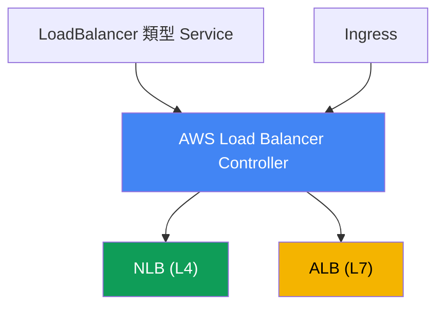
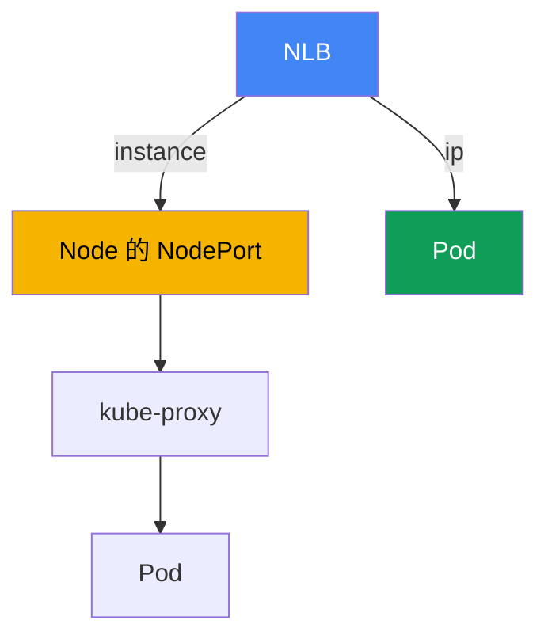

[Русская версия](ru.md) · [Eng version](en.md) · [Versión en español](es.md) · [Version française](fr.md) · [Deutsche Version](de.md) · [ქართული ვერსია](ge.md) · [日本語版](jp.md)
# 第 26 章。AWS Load Balancer Controller 與 LoadBalancer 類型的 Service：NLB

> **接下來。** 這是第 5 部分的開始，主題為網路與流量。第 3 和第 4 部分已涵蓋身分、
> 安全性與儲存；現在將探討外部流量如何進入叢集。第一層是位於 Pod 前方的負載平衡器。本章討論透過
> Network Load Balancer 與 LoadBalancer 類型 Service 實現的 L4 負載平衡。透過 Ingress 與 ALB 的
> L7 路由在第 27 章，Gateway API 與 VPC Lattice 在第 28 章，DNS 與憑證（external-dns、ACM、
> cert-manager）在第 29 章。Pod 如何在 VPC 中取得 IP（VPC CNI）請見第 8 章，而透過 IRSA 或 Pod
> Identity 指派控制器角色請見第 16-17 章。本章會引用這些內容，不再重複說明。

## 26.1.「我要求 LoadBalancer，卻得到舊的 Classic Load Balancer」

工程師以 Kubernetes 慣用的方式將服務對外公開，也就是建立 LoadBalancer 類型的 Service：

```yaml
apiVersion: v1
kind: Service
metadata:
  name: web
spec:
  type: LoadBalancer
  selector: {app: web}
  ports:
    - port: 80
      targetPort: 8080
```

套用後等待外部位址，並查看建立了什麼：

```bash
kubectl get svc web
# NAME  TYPE           EXTERNAL-IP                             PORT(S)
# web   LoadBalancer   a1b2...elb.eu-central-1.amazonaws.com   80:31842/TCP
```

位址已指派，服務也可連線。但在 EC2 主控台中，該 DNS 名稱對應的卻是 **Classic Load Balancer**，
這是 AWS 早已不再積極發展的上一代負載平衡器。它是由內建在 Kubernetes 元件中的 in-tree cloud
provider 所建立。工程師需要的是 Network Load Balancer：靜態 IP、UDP 支援、高效能 L4，以及以 Pod IP
為 target。此外，他還想從 manifest 以宣告式方式管理 health check 與 target group，而不是在主控台中點選。

問題不只在一種負載平衡器。in-tree provider 能做的很少、設定選項有限、與 Kubernetes 的生命週期緊密
耦合，且實際上已凍結。手動在主控台建立 NLB 和 target group，或透過叢集外的 Terraform 建立，無法擴展：
每次節點或 Pod 集合變更，都必須手動重新註冊 target，且它們會與叢集的實際狀態產生漂移。需要一個住在
叢集內、能看見 Service 與 Endpoints，並自行讓 NLB 與 target group 維持一致的控制器。這個控制器就是
AWS Load Balancer Controller，本課程的網路部分便從它開始。

## 26.2. AWS Load Balancer Controller：它是什麼，以及如何安裝

AWS Load Balancer Controller（簡稱 LBC）是一個監看叢集資源並為其建立 Elastic Load Balancing 資源的
Kubernetes 控制器。它涵蓋兩種情境：

- 它會將 **LoadBalancer 類型的 Service** 轉換為 **Network Load Balancer**（NLB，L4）。這是本章的主題。
- 它會將 **Ingress** 轉換為 **Application Load Balancer**（ALB，L7）。這是第 27 章的主題，本章僅提及。



控制器是**透過 Helm**安裝，而不是作為 EKS managed add-on。官方 chart 位於 `eks` 儲存庫
（`https://aws.github.io/eks-charts`）：

```bash
helm repo add eks https://aws.github.io/eks-charts
helm repo update
helm install aws-load-balancer-controller eks/aws-load-balancer-controller \
  -n kube-system \
  --set clusterName=<cluster-name> \
  --set serviceAccount.create=false \
  --set serviceAccount.name=aws-load-balancer-controller
```

控制器以 AWS 權限執行：建立並變更 NLB、target group、listener 與 security group 規則。因此，它需要
與其 ServiceAccount 關聯的 **IAM role**。角色透過 **IRSA** 或 **EKS Pod Identity**（第 16-17 章）授與，
這也是上述範例設定 `serviceAccount.create=false` 的原因：具有角色 annotation 的 service account 會預先建立。

權限由控制器儲存庫內現成的 `iam_policy.json` policy document 描述。用它建立 IAM policy（該文件慣例上
將其命名為 `AWSLoadBalancerControllerIAMPolicy`），並將它附加至控制器角色：

```bash
curl -o iam_policy.json https://raw.githubusercontent.com/kubernetes-sigs/\
aws-load-balancer-controller/main/docs/install/iam_policy.json
aws iam create-policy --policy-name AWSLoadBalancerControllerIAMPolicy \
  --policy-document file://iam_policy.json
```

若沒有角色或 policy 遭到裁減，控制器會啟動，但無法建立負載平衡器：Service 會停留在 `<pending>`，且控制器
日誌中會出現 `AccessDenied`。

## 26.3. In-tree cloud provider 對比 LB Controller 與 external 模式

以下說明為何 26.1 會出現 Classic Load Balancer。歷史上，LoadBalancer 類型的 Service 是由**內建的
in-tree cloud provider**處理，也就是 `kube-controller-manager` 內的 AWS 程式碼（後來移至
`cloud-controller-manager`）。預設情況下，正是它會 reconcile LoadBalancer 類型的 Service，並為其建立
CLB。它的能力有限、開發已停止，AWS 建議將此工作交由 LBC。

要讓 LBC 接管 reconcile，需以 annotation 標記 Service：

```yaml
service.beta.kubernetes.io/aws-load-balancer-type: external
```

值 `external` 是傳給 in-tree provider 的訊號：「不要處理這個 Service，外部控制器會接手。」LBC 看見
annotation 後便建立 NLB。還有第二種較新的方式，即欄位
`spec.loadBalancerClass: service.k8s.aws/nlb`；它以不依賴 Cloud Provider 的方式達成相同結果。在較新的
LBC 版本中，mutating webhook 會自動設定 `loadBalancerClass`，實際上使控制器成為新的 LoadBalancer 類型
Service 的預設處理者。

有一項重要的作業規則：**不要在既有的 Service 新增或變更 `aws-load-balancer-type` annotation**。在運作中
Service 上切換處理者會導致不同步：可能遺留先前建立的 AWS 資源，反之也可能突然將 NLB 公開到網際網路。
處理者類型必須在建立 Service 時固定。

| 屬性 | In-tree cloud provider | AWS Load Balancer Controller |
|---|---|---|
| 為 Service LB 建立的資源 | Classic Load Balancer | Network Load Balancer |
| 執行位置 | Kubernetes 元件內 | 叢集中的獨立控制器 |
| 安裝方式 | 內建 | Helm、專屬 IAM role |
| 發展狀態 | 已凍結 | 持續開發，AWS 建議使用 |
| 如何啟用 LBC | - | `aws-load-balancer-type: external` |

## 26.4. 透過 LoadBalancer 類型 Service 建立 NLB：關鍵 annotations

NLB 的行為透過 Service 上的 annotations 設定。名稱雖長，但都遵循同一前綴
`service.beta.kubernetes.io/aws-load-balancer-`。基本集合如下：

- **`aws-load-balancer-type: external`**：將 Service 交給 LBC 控制器處理（26.3）。
- **`aws-load-balancer-nlb-target-type`**：target 類型，`instance` 或 `ip`（26.5）。
- **`aws-load-balancer-scheme`**：`internal` 或 `internet-facing`。自 v2.2.0 起，控制器預設建立
  **`internal`** NLB；若要公開，須明確指定 scheme。這可防止服務意外公開到外部。
- **`aws-load-balancer-healthcheck-*`**：target group 的 health check 參數：`-protocol`、`-port`、
  `-path`、`-interval`、`-timeout`、`-healthy-threshold`、`-unhealthy-threshold`、`-success-codes`。

含有 Pod IP target 的典型公開 NLB manifest：

```yaml
apiVersion: v1
kind: Service
metadata:
  name: web
  annotations:
    service.beta.kubernetes.io/aws-load-balancer-type: external
    service.beta.kubernetes.io/aws-load-balancer-nlb-target-type: ip
    service.beta.kubernetes.io/aws-load-balancer-scheme: internet-facing
    service.beta.kubernetes.io/aws-load-balancer-healthcheck-protocol: http
    service.beta.kubernetes.io/aws-load-balancer-healthcheck-path: /healthz
spec:
  type: LoadBalancer
  selector: {app: web}
  ports:
    - port: 80
      targetPort: 8080
      protocol: TCP
```

| Annotation | 值 | 預設值 |
|---|---|---|
| `aws-load-balancer-type` | `external` | 由 in-tree 處理 |
| `aws-load-balancer-nlb-target-type` | `instance`、`ip` | `instance` |
| `aws-load-balancer-scheme` | `internal`、`internet-facing` | `internal` |
| `aws-load-balancer-healthcheck-protocol` | `tcp`、`http`、`https` | `tcp`（Cluster） |
| `aws-load-balancer-healthcheck-interval` | 秒 | `10` |
| `aws-load-balancer-healthcheck-healthy-threshold` | 數字 | `3` |

預設 health check 值（interval `10`、timeout `10`、threshold `3`、codes `200-399`）由控制器設定；
只有在需要時才覆寫。其他實用 annotations 包括：`aws-load-balancer-name`、`aws-load-balancer-subnets`、
`aws-load-balancer-ssl-cert`（使用 ACM 憑證進行 TLS termination），以及
`aws-load-balancer-attributes`（NLB attributes，例如 cross-zone）。

有兩個 annotations 在生產環境尤其有用。`aws-load-balancer-eip-allocations` 將預先配置的 Elastic IP
繫結至公開 NLB（每個 subnet 一個 allocation），使服務的外部位址成為靜態位址，即使 NLB 重建仍可保留。
而 `aws-load-balancer-target-group-attributes` 則以 `key=value` 格式設定 target group attributes；透過
`deregistration_delay.timeout_seconds` key（例如用 `15` 或 `30` 取代預設 `300`）可縮短將 target 從群組
移除前的等待時間，讓 NLB 在部署時能優雅地結束 TCP sessions，而不會讓 Pod 維持 draining 多餘的分鐘數
（graceful deregistration）。

**跨可用區負載平衡。** NLB 的 cross-zone load balancing 預設在 target group 層級為**停用**（不同於 ALB
始終啟用）：每個 zone 中的 NLB 僅將流量傳送至同一 zone 的 target。若 Pod 在 AZ 中的分布不對稱，replica
承受的負載就會不均。透過相同的 `target-group-attributes` 啟用：
`cross_zone.load_balancing.enabled=true`。取捨是 FinOps：所有 zone 中所有 Pod 的負載平衡，對比跨 zone
流量費用（cross-AZ data transfer 計費）。它會與 `externalTrafficPolicy`（26.6 節）互動：`Local` 同樣會將
流量保留在節點內，並在分布不對稱時加劇偏斜。

**Security groups 與 IaC 漂移。** 自 v2.6.0 起，LBC 能自行為 NLB 建立 frontend security group，並修改節點
與 Pod 上的 backend SG 規則。若整個網路與 SG 都透過 Terraform 或 Terragrunt 管理，這些自動變更會造成
state drift：`plan` 會顯示程式碼中沒有的規則變更。可透過兩個 annotations 管理：
`aws-load-balancer-manage-backend-security-group-rules: "false"` 將 backend SG 規則交由您的 IaC 控制，
而 `aws-load-balancer-security-groups` 會將 Terraform 預先建立的 frontend groups 繫結至 NLB，而非自動建立。
如此 SG 就只有一個擁有者，不會產生漂移。

## 26.5. target-type：instance 對比 ip

使用 NLB 時的關鍵選擇是負載平衡器將流量傳送到哪裡。有兩種模式。

**`instance`**：群組中的 target 是 EC2 node，更精確地說是它的 `NodePort`。NLB 將封包傳送至叢集中任何
node 的 `NodePort`，之後該 node 上的 `kube-proxy` 依據 iptables 或 IPVS 規則將流量送達 Pod。Pod 可能位於
另一個 node，因此會多出一個 node 間的網路 hop，最終行為取決於 `externalTrafficPolicy`（26.6）。在此模式中，
Service 必須為 `NodePort` 或 `LoadBalancer` 類型。

**`ip`**：target 是**Pod 自身的 IP**。這之所以可行，是因為 VPC CNI 會為 Pod 指派來自 VPC、可在 AWS 網路中
路由的真實位址（第 8 章）。NLB 直接將流量傳至 Pod，略過 `NodePort` 與 `kube-proxy`，少一個 hop，且不依賴
Pod 所在的 node。`ip` 模式對 **Fargate 是必要的**，因為那裡沒有一般 EC2 node，也就沒有 `NodePort`。



`ip` 模式有網路需求：Pod 必須取得 VPC 位址（VPC CNI，第 8 章），且 security groups 與 subnets 必須允許 NLB
連線至 Pod port。自 v2.6.0 起，控制器會自行建立並附加 frontend 與 backend security groups 至 NLB，並修改
存取規則；在較舊版本中，它會將 inbound 規則加入 node 的 security group。

| 準則 | `instance` | `ip` |
|---|---|---|
| 目標 | 節點的 `NodePort` | 直接使用 Pod IP |
| 流量路徑 | NLB -> NodePort -> kube-proxy -> Pod | NLB -> Pod |
| 額外的 node 間 hop | 可能 | 無 |
| Service 類型 | `NodePort` 或 `LoadBalancer` | 使用 VPC CNI 時任意類型 |
| Fargate | 無法運作 | 必要 |
| Client source IP | 取決於 `externalTrafficPolicy` | 取決於 target group attribute |
| 要求 | 開放的 `NodePort` | VPC CNI、可達的 SG/subnet |

實務規則：EC2 搭配 VPC CNI 預設選擇 `ip`，hop 較少且較容易保留 client IP。只有在確實需要透過 `NodePort`
進入，或特定網路架構要求時，才選擇 `instance`。

## 26.6. externalTrafficPolicy：Cluster 對比 Local

Service 的 `spec.externalTrafficPolicy` 欄位管理 node 如何處理外部流量，並且在 `instance` 模式中尤其重要。

**`Cluster`**（預設值）：抵達任何 node `NodePort` 的流量，`kube-proxy` 都可轉送至**另一個** node 上的 Pod。
流量會在所有 Pod 間平均平衡，但會多一個 node 間 hop，且會執行 SNAT：**client 的來源 IP 會遺失**，Pod 看到的
是 node 位址。叢集中的所有 node 都會回應 health check，即使其中沒有目標 Pod。

**`Local`**：node 僅將流量送往**本機 Pod**，不再繼續轉送。沒有額外 hop，且**client source IP 得以保留**。
代價是：若 node 上沒有任何該 Service 的 Pod，其 health check 會變成 unhealthy，NLB 將停止向它傳送流量；若
Pod 在 nodes 上分布不均，負載平衡就會不均。要讓 Local 正常運作，Pod 必須合理分散至各 node（topology spread，
第 40 章）。

這與 26.4 的 health check 直接相關。控制器會考量此 policy：使用 `Cluster` 時，預設 health check protocol 是
`tcp`；使用 `Local` 時，建議對 `spec.healthCheckNodePort` 使用 `http`，不應在 `Local` 使用 `tcp`，因為它無法
區分有 Pod 的 node 與沒有 Pod 的 node。

| 面向 | `Cluster` | `Local` |
|---|---|---|
| 轉送至另一 node 的 Pod | 是 | 否 |
| 額外 hop | 可能 | 無 |
| Client source IP | 遺失（SNAT） | 保留 |
| 回應 health check 的節點 | 所有 node | 僅有 Pod 的 node |
| 分布 | 平均 | 取決於 Pod placement |

在 `ip` 模式中情況不同：流量原本就直接前往 Pod，而 client IP 的保留由 target group attribute
`preserve_client_ip` 管理（在 `ip` 中預設停用，在 `instance` 中預設啟用）。若應用程式需要 client 原始 IP，
必須分別驗證：在 `instance` 模式檢查 policy，或在 `ip` 模式檢查 target group attribute。

## 26.7. NLB 對比 ALB：何時使用哪一種

LBC 支援兩種負載平衡器，而兩者之間的選擇是 OSI 模型層級的選擇。以下簡述，不重複第 27 章對 ALB 的詳細說明。

- **NLB 是 L4。** 它在 TCP 與 UDP 層級運作，不解析 HTTP。由此而來的優勢包括：極高效能與低延遲、UDP 支援、
  每個 subnet 的靜態 IP，以及可附加 Elastic IP。它適用於非 HTTP protocols（TCP 上的 gRPC、遊戲 UDP services、
  databases、brokers），以及需要不解析請求之純 L4 的情況。
- **ALB 是 L7。** 它理解 HTTP 與 HTTPS：依 host 和 path 路由、headers、redirect、authentication，以及與
  WAF 整合。它適用於需要內容路由的 web applications 與 API。在 EKS 中，ALB 通常由 Ingress 建立（第 27 章）。

NLB 是使用 **UDP** 的應用程式（DNS、media streaming、game servers），以及透過 UDP 的 **QUIC (HTTP/3)**
唯一選擇：ALB 僅支援 TCP 上的 HTTP、HTTPS 與 HTTP/2，不支援 UDP 或 QUIC。若應用程式需要入口 HTTP/3，應在
NLB（或 NLB 後的自有 proxy）終止連線，而不是在 ALB。

粗略規則：依 paths 與 hosts 的 HTTP routing 使用透過 Ingress 的 ALB（第 27 章）；純 L4、UDP、QUIC、靜態 IP
或最大吞吐量使用如本章所述，透過 LoadBalancer 類型 Service 的 NLB。

## 26.8. gRPC 與 service mesh：為何 L4 不平衡 streams

部分 backend 使用 gRPC（基於 HTTP/2）通訊，擴展後負載卻沒有分散：一個 replica 過載，新增的則閒置。原因是
gRPC client 會開啟**一條長壽命 HTTP/2 connection**，並在其上 multiplex 所有 RPC。Service 與 NLB 在 L4
（connection-level）運作：它們平衡 connections，而不是 requests。既然只有一條 connection，該 client 的所有
流量都會黏在同一個 Pod，上新增的 replicas 便會閒置。所有 persistent connections（databases、brokers、
websocket）也會有相同情況。

kube-proxy 與 NLB 將 TCP connection 視為平衡單位，不解析其中可能有數百個獨立 requests。若要**依 request**
分散負載，便需要理解 HTTP/2 的 L7。有三種選項。

**選項 1：南北向 gRPC 使用 L7 負載平衡器。** 外部 gRPC 透過 ALB 進入：在 Ingress 設定
`alb.ingress.kubernetes.io/backend-protocol-version: GRPC`，ALB 會在請求層級進行平衡，並支援 gRPC
healthcheck。第 27 章介紹 ALB 與 Ingress；本章的重點是 L7 能解除進入流量的黏著。

**選項 2：client-side balancing。** Headless Service（`clusterIP: None`）不會提供 client 單一 VIP，而是提供
所有 Pod 位址。gRPC client 自己以 `round_robin` policy 將 RPC 分配到這些位址。代價是 client 必須支援
client-side LB，且在擴展時重新 resolve DNS，否則新的 Pods 不會加入 pool。

**選項 3：東西向使用服務網格。** 服務對服務的通訊採用 Istio 或 Linkerd：Pod 旁會出現 sidecar proxy
（Istio 也有不使用 sidecar 的 ambient mode），為 gRPC 和 HTTP/2 實現 per-request L7 balancing。同時，mesh
也提供 mTLS、retries、timeouts、circuit breaking、traffic locality 與 observability（golden signals）。
Istio 的深入內容在獨立的 ICA 課程中說明。

EKS 上 mesh 的實際代價：sidecar proxies 會增加 CPU、memory 與少許 latency 使用量；mesh 有自己的生命週期與
upgrades（它不是 managed add-on）；診斷更加複雜；還必須考量與 VPC CNI 和 NetworkPolicy（第 30 章）的交界。
Istio ambient 藉由移除 per-pod sidecar，可減少部分 overhead。

何時使用何者：對外的一兩個 gRPC services 使用支援 GRPC 的 ALB（第 27 章）；大量內部 services，且需要 mTLS、
retries 與 observability 時使用 mesh。不要只為平衡一個 gRPC 而引入 mesh：其複雜度不會帶來回報。

| 方法 | 平衡的對象 | 提供的能力 | 付出的代價 |
|---|---|---|---|
| NLB / Service (L4) | connections | 簡單 L4、高吞吐量 | gRPC 黏在 Pod 上 |
| ALB gRPC (L7) | 南北向請求 | 每請求負載平衡、gRPC 健康檢查 | 僅 HTTP/2、外部入口 |
| headless + 用戶端負載平衡 | 用戶端請求 | 無 Proxy、最少跳點 | 用戶端支援、重新解析 |
| 服務網格 Istio/Linkerd | 東西向請求 | 每請求負載平衡、mTLS、重試、指標 | 額外負荷、各自的升級 |

## 26.9. 生產環境中的使用方式

- **LBC 作為標準，不使用 in-tree。** 控制器透過 Helm 搭配 IRSA/Pod Identity role 安裝一次，所有外部服務皆經由它；
  將 CLB 由內建 provider 建立視為過時情境。
- **EC2 搭配 VPC CNI 預設使用 `ip`。** 以 Pod IP 為 target 的 hops 更少，也更容易處理 client IP；`instance`
  保留給需要透過 `NodePort` 進入的情況。
- **明確設定 `scheme`。** 僅在指定 `internet-facing` 並清楚知道服務會公開到網際網路時建立 public NLB；控制器
  預設建立 `internal`，這是正確的預設值。
- **最小 IAM policy 與受限來源。** role 僅授予 `iam_policy.json` 中的權限，並透過
  `spec.loadBalancerSourceRanges` 限縮對 NLB 的存取，不留下 `0.0.0.0/0`。
- **建立時固定處理者類型。** 不要在運作中的 Service 變更 `aws-load-balancer-type` annotation，以免導致資源
  洩漏或意外公開 NLB。
- **靜態 IP 與平滑部署。** 透過 `aws-load-balancer-eip-allocations` 為 public NLB 指派 Elastic IP，並降低
  `aws-load-balancer-target-group-attributes` 中的 `deregistration_delay.timeout_seconds`，避免部署中斷 TCP
  sessions。

## 26.10. 迷你詞彙表

- **AWS Load Balancer Controller (LBC)**：叢集中的控制器，為 LoadBalancer 類型 Service 建立 NLB，為 Ingress
  建立 ALB；透過 Helm 安裝，需要 IAM role。
- **in-tree cloud provider**：內建在 Kubernetes 元件中的 AWS 程式碼，預設為 LoadBalancer 類型 Service 建立
  Classic Load Balancer。
- **NLB (Network Load Balancer)**：L4（TCP/UDP）負載平衡器，具高效能與靜態 IP；由 LBC 從 LoadBalancer
  類型 Service 建立。
- **external 模式**：`aws-load-balancer-type` annotation 的值，將 Service reconciliation 交給外部 LBC
  控制器，而非 in-tree provider。
- **target-type**：NLB target 類型：`instance`（經由 node 的 `NodePort`）或 `ip`（直接前往 Pod IP，需要
  VPC CNI，Fargate 必要）。
- **externalTrafficPolicy**：Service policy：`Cluster`（轉送至任意 node、SNAT）或 `Local`（僅本機 Pods、
  保留 client IP）。
- **preserve_client_ip**：NLB target group attribute，用來管理在 `ip` 模式中是否保留 client 原始 IP。

## 26.11. 本章總結

- LoadBalancer 類型 Service 預設由內建 in-tree cloud provider 處理，並建立設定最少、已過時的 Classic Load
  Balancer。
- AWS Load Balancer Controller 是叢集中的控制器，會為 LoadBalancer 類型 Service 建立 NLB，為 Ingress 建立
  ALB（Ingress 請見第 27 章）。它透過 Helm 安裝，而非 managed add-on，並需要透過 IRSA 或 Pod Identity
  （第 16-17 章）取得 IAM role，以及來自 `iam_policy.json` 的 policy。
- 將 Service reconciliation 交給控制器的方式是 annotation
  `service.beta.kubernetes.io/aws-load-balancer-type: external`（或透過
  `loadBalancerClass: service.k8s.aws/nlb`）；處理者類型應在建立時固定，不要在運作中的 Service 變更。
- NLB 行為由 annotations 設定：`nlb-target-type`、`scheme`（預設 `internal`）及 `healthcheck-*` 系列。
  Public NLB 必須明確指定 `internet-facing`。
- `instance` 將流量傳送至 node 的 `NodePort`，再由 `kube-proxy` 前往 Pod（可能多一個 hop）；`ip` 透過 VPC
  CNI（第 8 章）直接傳送至 Pod IP，hops 較少，且 Fargate 必要。
- `externalTrafficPolicy: Cluster` 平均分配流量，但遺失 client IP 並增加 hop；`Local` 保留 client IP 並移除
  hop，但只有具有 Pod 的 nodes 能通過 health check。
- NLB 是 L4（TCP/UDP、靜態 IP、效能）；ALB 是 L7（HTTP routing），第 27 章將詳細說明。

## 26.12. 這在實際工作中的用途

在值班時，涉及 NLB 的網路事件通常可歸結為幾個原因。Service 停留在 `<pending>` 且未取得外部位址時，請檢查
控制器是否已安裝、其 role 是否有權限（日誌中的 `AccessDenied`），以及是否已設定 `external` annotation。
負載平衡器已建立但 targets 為 `unhealthy` 時，檢查 health check（在 `externalTrafficPolicy` 下的 protocol 與
port）以及 `ip` 模式中 security groups 對 Pod port 的可達性。應用程式看不到 client 原始 IP 時，這不是 bug，
而是 `instance` 模式下 `Cluster` 的結果，或是 `ip` 模式下停用 `preserve_client_ip` 的結果。規劃時預先確定兩個
決策：target-type（EC2 搭配 VPC CNI 預設 `ip`）與 scheme（若服務不該暴露到網際網路，則用 `internal`）。也請
記住不可逆性：處理者類型與許多參數在建立 Service 時即固定，因此比起在帶有即時流量的情況下改造，事先設計更容易。

## 26.13. 自我檢查問題

1. 為什麼 EKS 中一般的 LoadBalancer 類型 Service 預設會建立 Classic Load Balancer？
2. AWS Load Balancer Controller 是什麼？它會建立哪兩種負載平衡器？
3. 為什麼 LBC 透過 Helm 安裝而非作為 managed add-on？為什麼它需要 IAM role？
4. 如何將 role 授予控制器？它的 IAM policy 從哪裡取得？
5. `aws-load-balancer-type: external` annotation 有何作用？為什麼之後不應變更它？
6. 哪些關鍵 annotations 用於設定 NLB？預設建立哪個 scheme？
7. `target-type: instance` 與 `ip` 在流量路徑與 hops 數量上有何不同？
8. 為什麼 Fargate 需要 `target-type: ip`？這與 VPC CNI（第 8 章）有何關係？
9. `externalTrafficPolicy: Cluster` 與 `Local` 如何影響 client source IP 與 hops？
10. 為什麼使用 `Local` 時不是所有 nodes 都能通過 health check？這對分布有何風險？
11. 如何在 `ip` 模式中保留 client 原始 IP？這與 `instance` 模式有何不同？
12. 何時選擇 NLB、何時選擇 ALB？ALB 在哪一章說明？
13. Service 停在 `<pending>` 且沒有外部位址時，應依什麼順序檢查哪些事項？
14. 如何為 public NLB 提供靜態位址？如何減輕部署時 TCP sessions 中斷的問題？

## 實作

本課程與此主題相關的 lab：[lab 108 - AWS Load Balancer Controller：用於 LoadBalancer 類型
Service 的 NLB](../../labs/108/README_TW.MD)。除此之外，所有內容都可在即時叢集上驗證。首先確認控制器
已安裝且健康，然後查看它的 service account 與關聯 role：

```bash
kubectl get deploy -n kube-system aws-load-balancer-controller
kubectl get pods -n kube-system | grep load-balancer
kubectl get sa -n kube-system aws-load-balancer-controller -o yaml
```

接著重現模式差異。建立具有 `aws-load-balancer-type: external`、
`aws-load-balancer-nlb-target-type: ip` 與 `aws-load-balancer-scheme: internal` annotations 的
LoadBalancer 類型 Service，等待位址出現（`kubectl get svc web -w`），並從 AWS 端尋找建立的 NLB：
`aws elbv2 describe-load-balancers` 會顯示負載平衡器及其 `Scheme`，`aws elbv2 describe-target-groups`
會顯示 target groups，而 `aws elbv2 describe-target-health --target-group-arn <arn>` 會顯示註冊為 target 的
項目。在 `ip` 模式中，targets 會顯示 Pod IP；切換至 `instance`（建立新的 Service，勿變更既有的 Service）並
比較，targets 會變成具有 `NodePort` 的 nodes。

另外檢視 health check 與 client IP：在 `Cluster` 與 `Local` 間變更 `externalTrafficPolicy`，觀察 healthy
targets 集合如何改變，以及 application logs 中是否可看到 client 原始 IP。最後驗證權限：暫時縮減 role policy，
重建 Service，並在日誌中尋找 `AccessDenied`
（`kubectl logs -n kube-system deploy/aws-load-balancer-controller`），然後還原 policy。

---
[目錄](../README_TW.md) · [第 25 章](../25/tw.md) · [第 27 章](../27/tw.md)
