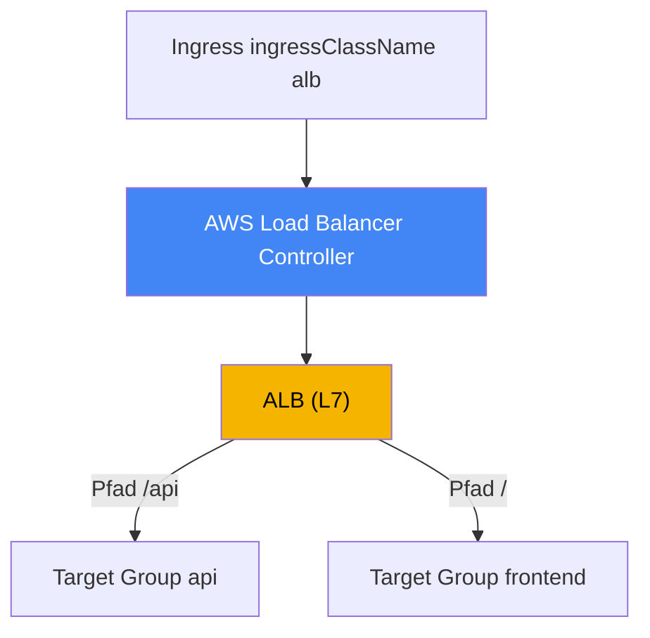
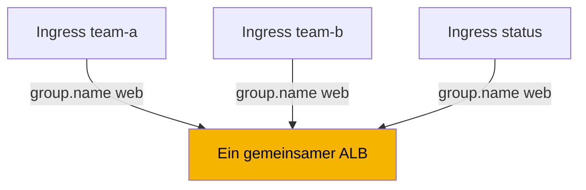
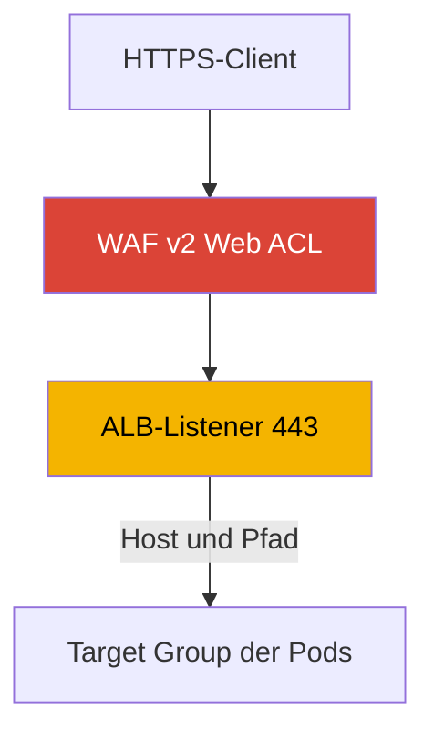

[Eng version](en.md) · [Versión en español](es.md) · [Version française](fr.md) · [Русская версия](ru.md) · [ქართული ვერსია](ge.md) · [繁體中文版](tw.md) · [日本語版](jp.md)
# Kapitel 27. Ingress über ALB: target-type, Annotationen, TLS und ACM, WAF

> **Wie es weitergeht.** Kapitel 26 behandelte L4-Load-Balancing: einen Service vom Typ LoadBalancer und einen Network Load Balancer über den AWS Load Balancer Controller. Hier ist der Controller derselbe, aber auf L7: Aus einem Ingress erstellt er einen Application Load Balancer mit Routing nach Host und Pfad, TLS-Terminierung und WAF-Schutz. NLB und Services vom Typ LoadBalancer bleiben in Kapitel 26 und werden dort behandelt. Gateway API und VPC Lattice sind Thema von Kapitel 28, external-dns, Route 53 und cert-manager von Kapitel 29. Wie ein Pod eine IP im VPC erhält (VPC CNI), behandelt Kapitel 8, und die Rolle des Controllers über IRSA oder Pod Identity die Kapitel 16-17. Auf diese Themen wird verwiesen, ohne sie zu wiederholen.

## 27.1. „Fünf Services, fünf Load Balancer und kein Ort für ein Zertifikat“

Ein Team veröffentlicht eine öffentliche Webanwendung aus mehreren Services: Frontend, API und Statusseite. Mit dem vertrauten Ansatz aus Kapitel 26 erhält jeder Service einen eigenen Service vom Typ LoadBalancer und damit einen eigenen NLB:

```bash
kubectl get svc
# NAME       TYPE           EXTERNAL-IP                              PORT(S)
# frontend   LoadBalancer   a1b2...elb.eu-central-1.amazonaws.com    80:31111/TCP
# api        LoadBalancer   c3d4...elb.eu-central-1.amazonaws.com    80:31222/TCP
# status     LoadBalancer   e5f6...elb.eu-central-1.amazonaws.com    80:31333/TCP
```

Drei Services bedeuten drei Load Balancer, drei DNS-Namen, drei Rechnungen für dieselbe Website, und jeder neue Service fügt einen weiteren hinzu. Das Problem ist jedoch nicht einmal die Anzahl der Load Balancer. Ein NLB arbeitet auf L4: Er analysiert kein HTTP und kann daher weder nach Pfad routen (`/api` zu einem Service, `/` zu einem anderen) noch nach Host. Es gibt keinen einheitlichen Einstiegspunkt. Vor allem lässt sich TLS-Terminierung mit Weiterleitung von 80 auf 443 auf einem NLB nicht sinnvoll konfigurieren: Dafür muss HTTP verstanden werden, was L4 nicht tut.

Der Engineer benötigt etwas anderes: einen Einstiegspunkt, hinter dem der Traffic durch Host- und Pfadregeln auf unterschiedliche Services verteilt wird, ein Zertifikat aus ACM, eine automatische HTTPS-Weiterleitung und Filterung durch WAF. All das ist die Aufgabe eines L7-Load-Balancers. In AWS ist dies ein Application Load Balancer, und in Kubernetes wird er durch das vertraute Ingress-Objekt beschrieben. Derselbe AWS Load Balancer Controller, der in Kapitel 26 NLBs aus Services erstellt hat, erstellt den ALB aus einem Ingress.

## 27.2. ALB über Ingress: IngressClass alb und derselbe Controller

Die Mechanik entspricht Kapitel 26, aber der Einstiegspunkt ist nun ein Ingress-Objekt. Der Controller überwacht Ingress-Ressourcen mit dem erforderlichen `ingressClassName` und gleicht den ALB, seine Listener, Target Groups und Regeln ab. Damit ein Ingress zum LBC gehört, besitzt der Cluster eine IngressClass mit dem Controller `ingress.k8s.aws/alb`:

```yaml
apiVersion: networking.k8s.io/v1
kind: IngressClass
metadata:
  name: alb
spec:
  controller: ingress.k8s.aws/alb
```

Anschließend wird am Ingress selbst `spec.ingressClassName: alb` gesetzt, und das ALB-Verhalten wird mit Annotationen des Präfixes `alb.ingress.kubernetes.io/` konfiguriert. Dies ist ein minimaler öffentlicher Ingress mit Pfad-Routing:

```yaml
apiVersion: networking.k8s.io/v1
kind: Ingress
metadata:
  name: web
  annotations:
    alb.ingress.kubernetes.io/scheme: internet-facing
    alb.ingress.kubernetes.io/target-type: ip
spec:
  ingressClassName: alb
  rules:
    - http:
        paths:
          - path: /api
            pathType: Prefix
            backend:
              service:
                name: api
                port: {number: 80}
          - path: /
            pathType: Prefix
            backend:
              service:
                name: frontend
                port: {number: 80}
```



Wie in Kapitel 26 agiert der Controller in AWS und benötigt eine IAM-Rolle für seinen ServiceAccount (IRSA oder Pod Identity, Kapitel 16-17). Berechtigungen für ALBs, Target Groups, Listener sowie WAF und Shield sind im selben Richtliniendokument `iam_policy.json` enthalten, das für NLB installiert wurde. Ein separater Controller für ALB ist nicht erforderlich: Es gibt einen LBC, und er verarbeitet sowohl Services als auch Ingresses.

## 27.3. target-type: instance gegenüber ip

Die Wahl des Targets für einen ALB ist derselbe Mechanismus wie bei einem NLB (Kapitel 26), daher bleibt dieser Abschnitt kurz. Die Annotation `alb.ingress.kubernetes.io/target-type` akzeptiert `instance` oder `ip`; der Standardwert lautet `instance`.

- **`instance`**: Die Target Group registriert Nodes über ihren `NodePort`; der Service muss vom Typ `NodePort` oder `LoadBalancer` sein. Der ALB sendet Traffic an den `NodePort`, dann liefert `kube-proxy` ihn an den Pod aus, gegebenenfalls mit einem zusätzlichen Hop zwischen Nodes.
- **`ip`**: Die Target Group registriert die IPs der Pods selbst. Das funktioniert, weil VPC CNI dem Pod eine routbare VPC-Adresse zuweist (Kapitel 8). Es hat weniger Hops und ist auf Fargate erforderlich.

Die Praxis ist dieselbe wie für NLB: Auf EC2 mit VPC CNI wird standardmäßig `ip` verwendet. Für ALB ist der Modus `ip` zusätzlich für Sticky Sessions erforderlich, die eine Sitzung an ein Target binden. Der vollständige Vergleich von Traffic-Pfaden, Hops und Netzwerkanforderungen steht in Kapitel 26 und wird hier nicht wiederholt.

| target-type | Was wird registriert | Service-Typ | Fargate |
|---|---|---|---|
| `instance` | Nodes über `NodePort` | `NodePort` oder `LoadBalancer` | funktioniert nicht |
| `ip` | Pod-IPs direkt | beliebig mit VPC CNI | erforderlich |

## 27.4. IngressGroup: ein ALB für mehrere Ingresses

Standardmäßig erzeugt jeder Ingress einen eigenen ALB. Damit kehren wir zum Problem aus 27.1 zurück, nur auf L7: Zehn Teams mit zehn Ingresses erhalten zehn ALBs. Die Lösung ist **IngressGroup**: Mehrere Ingresses werden zu einer Gruppe kombiniert und von **einem** gemeinsamen ALB bedient. Der Controller führt alle Ingress-Regeln der Gruppe zu einem Satz von Listenern und Regeln zusammen.

Eine Gruppe wird mit der Annotation `alb.ingress.kubernetes.io/group.name` festgelegt. Alle Ingresses mit demselben Wert treten einer Gruppe bei und teilen sich den Load Balancer:

```yaml
metadata:
  annotations:
    alb.ingress.kubernetes.io/group.name: my-team.web
    alb.ingress.kubernetes.io/group.order: '10'
```



Die Reihenfolge der Regeln innerhalb einer Gruppe wird durch `alb.ingress.kubernetes.io/group.order` gesteuert, eine ganze Zahl von -1000 bis 1000 (Standardwert 0). Je kleiner die Zahl, desto früher wird die Regel ausgewertet; bei gleichen Werten wird die Reihenfolge durch `namespace/name` des Ingress bestimmt. Das ist wichtig, wenn mehrere Ingresses überlappende Pfade definieren und eine explizite Priorität erforderlich ist.

IngressGroup birgt ein wichtiges Risiko, das der Controller ausdrücklich als Sicherheitsrisiko kennzeichnet. Jeder Benutzer mit RBAC-Berechtigung zum Erstellen eines Ingress kann denselben `group.name` angeben und eigene Regeln zum gemeinsamen ALB hinzufügen oder die Regeln eines anderen Teams mit höherer Priorität überschreiben. Ein Gruppenname ist daher eine Vertrauensgrenze: Erstellen Sie Gruppen nur innerhalb eines vertrauenswürdigen Teamkreises, beschränken Sie die Mitgliedschaft über `IngressClassParams` (`namespaceSelector`) oder deaktivieren Sie den Beitritt anhand von Annotationen mit einem Controller-Flag. Mischen Sie ohne solche Kontrollen keine Ingresses verschiedener Teams in einer Gruppe.

## 27.5. TLS und ACM: Zertifikat, Weiterleitung, Ports

TLS-Terminierung ist ein zentraler Grund, einen ALB vor eine Anwendung zu setzen. Der ALB bezieht sein Zertifikat aus dem **AWS Certificate Manager (ACM)**; der private Schlüssel verlässt den Load Balancer nie und bleibt auf dessen Seite. Es gibt zwei Möglichkeiten, ein Zertifikat anzugeben.

Explizit verwenden Sie die Annotation `alb.ingress.kubernetes.io/certificate-arn` mit der ARN des ACM-Zertifikats. Das erste Zertifikat in der Liste wird zum Standardzertifikat, die übrigen kommen in die SNI-Liste:

```yaml
metadata:
  annotations:
    alb.ingress.kubernetes.io/scheme: internet-facing
    alb.ingress.kubernetes.io/listen-ports: '[{"HTTP": 80}, {"HTTPS": 443}]'
    alb.ingress.kubernetes.io/certificate-arn: arn:aws:acm:eu-central-1:111122223333:certificate/abc
    alb.ingress.kubernetes.io/ssl-redirect: '443'
spec:
  ingressClassName: alb
  tls:
    - hosts: ["app.example.com"]
  rules:
    - host: app.example.com
      http:
        paths:
          - path: /
            pathType: Prefix
            backend:
              service: {name: frontend, port: {number: 80}}
```

Die zweite Möglichkeit ist die **automatische Zertifikatserkennung**. Wenn `certificate-arn` nicht angegeben ist, übernimmt der Controller Hosts aus `spec.tls[].hosts` (und `host` in Regeln) und sucht in ACM nach einem passenden Zertifikat für den Domainnamen. Die Manifestdatei benötigt dann keine ARN: Ein TLS-Host genügt.

Die Annotation `alb.ingress.kubernetes.io/listen-ports` listet die Ports und Protokolle der ALB-Listener auf. Standardmäßig lautet sie `'[{"HTTP": 80}]'`; falls `certificate-arn` gesetzt ist, lautet sie `'[{"HTTPS": 443}]'`. Um sowohl HTTP als auch HTTPS anzunehmen, geben Sie beide Ports explizit an, wie im vorhergehenden Beispiel.

Eine HTTP-zu-HTTPS-Weiterleitung wird mit `alb.ingress.kubernetes.io/ssl-redirect` aktiviert; ihr Wert ist der Zielport, gewöhnlich `'443'`. Jeder HTTP-Listener erhält dann eine Standardaktion, die nach HTTPS weiterleitet, und seine übrigen Regeln werden ignoriert. Der `ssl-redirect`-Port muss in `listen-ports` enthalten sein. `alb.ingress.kubernetes.io/ssl-policy` legt die Richtlinie für Protokolle und Chiffren fest (Standardwert `ELBSecurityPolicy-2016-08`).

| Annotation | Zweck | Hinweis |
|---|---|---|
| `certificate-arn` | ARN eines ACM-Zertifikats | erstes ist Standard, weitere SNI |
| (ohne `certificate-arn`) | automatische Erkennung über Host aus TLS | ARN wird im Manifest nicht benötigt |
| `listen-ports` | Listener-Ports und -Protokolle | Standard: HTTP 80 oder HTTPS 443 |
| `ssl-redirect` | Weiterleitung von 80 auf 443 | Port muss in `listen-ports` stehen |
| `ssl-policy` | TLS-Protokoll- und Chiffrenmenge | Standard: `ELBSecurityPolicy-2016-08` |

## 27.6. WAF und Shield: Filterung auf L7

Da ein ALB HTTP versteht, kann Request-Filterung an ihn angehängt werden. Eine Web ACL aus **AWS WAF v2** wird mit `alb.ingress.kubernetes.io/wafv2-acl-arn` und der ARN der Web ACL verknüpft:

```yaml
metadata:
  annotations:
    alb.ingress.kubernetes.io/wafv2-acl-arn: arn:aws:wafv2:eu-central-1:111122223333:regional/webacl/my-acl/abc
```

Eine Web ACL mit Regeln für Schutz vor SQL-Injection, Rate Limiting, geografische Filterung und IP-Filter wirkt auf eingehenden Traffic, bevor er die Pods erreicht. Nur Regional WAFv2 wird unterstützt. Fehlt die Annotation, ändert der Controller die WAF-Einstellung nicht; um eine Web ACL zu entfernen, setzen Sie ihren Wert ausdrücklich auf `none`. Für das veraltete WAF Classic gibt es `waf-acl-id`, für neue Workloads wird jedoch WAFv2 verwendet. DDoS-Schutz wird mit der Annotation `alb.ingress.kubernetes.io/shield-advanced-protection: 'true'` aktiviert; sie aktiviert AWS Shield Advanced am Load Balancer und erfordert ein Shield-Advanced-Abonnement.



Beachten Sie die IngressGroup aus 27.4: WAF und Shield werden auf Ebene des gesamten ALB konfiguriert und gelten daher für die ganze Gruppe. Auf einem gemeinsamen ALB kann jedes Gruppenmitglied den Schutz mit seiner Annotation ändern. Fixieren Sie daher in Mandantengruppen die WAF-Konfiguration über `IngressClassParams` (das Feld `WAFv2ACLArn`), statt sie einzelnen Ingresses zu überlassen.

## 27.7. Routing: Regeln, Aktionen, Health Checks

Grundlegendes ALB-Routing wird durch die Standardfelder von Ingress beschrieben: `host`, `path` und `pathType` (`Prefix`, `Exact`, `ImplementationSpecific`). Das genügt für „nach Host und Pfad zum richtigen Service“. Für komplexere Szenarien stehen Annotationen zur Verfügung.

**Benutzerdefinierte Aktionen**: `alb.ingress.kubernetes.io/actions.${action-name}`. Setzen Sie den Aktionsnamen als `service.name` in einer Regel ein und geben Sie als `port` `use-annotation` an. Damit wird Funktionalität beschrieben, die nicht Teil des Standard-Ingress ist:

- `redirect`: Weiterleitung zu einer anderen URL oder einem anderen Host;
- `fixed-response`: eine feste Antwort zurückgeben, zum Beispiel 503 für eine Wartungsseite;
- `forward`: an mehrere Target Groups mit Gewichtungen weiterleiten (Weighted Routing) und Sticky Sessions konfigurieren.

**Zusätzliche Bedingungen**: `alb.ingress.kubernetes.io/conditions.${conditions-name}` fügt einer Regel über Host und Pfad hinaus Prüfungen für einen HTTP-Header (`http-header`), eine Methode (`http-request-method`), einen Query-String (`query-string`) oder die Quell-IP (`source-ip`) hinzu.

Beispiel: Eine Wartungsseite mit fester Antwort. Die Aktion wird mit einer Annotation definiert und in der Regel über `service.name` und `port: use-annotation` referenziert:

```yaml
metadata:
  annotations:
    alb.ingress.kubernetes.io/actions.maintenance: >
      {"type":"fixed-response","fixedResponseConfig":
      {"contentType":"text/plain","statusCode":"503","messageBody":"under maintenance"}}
# in rules: backend.service.name: maintenance, port.name: use-annotation
```

**Health Checks** für Target Groups werden durch die Annotationsfamilie `healthcheck-*` konfiguriert: `healthcheck-protocol` (Standard `HTTP`), `healthcheck-port` (`traffic-port`), `healthcheck-path` (`/`), `healthcheck-interval-seconds` (`15`), `healthcheck-timeout-seconds` (`5`), `healthy-threshold-count` und `unhealthy-threshold-count` (`2`) sowie `success-codes` (`200`). Der Controller definiert diese Standardwerte, die bei Bedarf überschrieben werden können.

**Backend-Protokoll** für HTTP-Workloads wird durch `alb.ingress.kubernetes.io/backend-protocol-version` festgelegt: `HTTP1` (Standard), `HTTP2` oder `GRPC`. Der Wert gilt nur bei einem HTTP- oder HTTPS-Backend-Protokoll und ändert das Anwendungsprotokoll der Target Group. Setzen Sie `GRPC` für einen gRPC-Service, damit ALB gRPC-Aufrufe über HTTP/2 an Pods weiterleitet; verwenden Sie `HTTP2` für ein gewöhnliches HTTP/2-Backend. Ohne diese Einstellung kommuniziert ALB mit Targets über HTTP/1.1, und gRPC wird nicht durchgeleitet:

```yaml
metadata:
  annotations:
    alb.ingress.kubernetes.io/backend-protocol-version: GRPC
```

**Load-Balancer-Schema** wird durch `alb.ingress.kubernetes.io/scheme` festgelegt: `internal` (Standard) oder `internet-facing`. Wie bei NLB wird ein öffentlicher ALB nur mit explizitem `internet-facing` erstellt. Das Schema eines laufenden Ingress zu ändern, ist nicht kostenlos: Der ALB kann nicht direkt umgestellt werden, daher erstellt der Controller einen neuen Load Balancer. Planen Sie dies als Traffic-Migration.

**Authentifizierung** ist in ALB integriert: `alb.ingress.kubernetes.io/auth-type` mit dem Wert `cognito` oder `oidc` delegiert die Benutzerprüfung an Amazon Cognito oder einen externen OIDC-Provider (`auth-idp-cognito`, `auth-idp-oidc`). Sie funktioniert nur auf HTTPS-Listenern. Damit lässt sich eine interne Konsole per Login schützen, ohne die Anwendung selbst zu ändern.

## 27.8. ALB (Ingress) gegenüber NLB (Service): wann welcher verwendet wird

Ein Controller erstellt beide Load Balancer; die Wahl richtet sich nach der Ebene des OSI-Modells und dem Kubernetes-Objekttyp. NLB wird in Kapitel 26 ausführlich behandelt; dies ist die abschließende Abgrenzung.

| Kriterium | ALB (Ingress) | NLB (Service type LoadBalancer) |
|---|---|---|
| Ebene | L7 (HTTP/HTTPS) | L4 (TCP/UDP) |
| Kubernetes-Objekt | Ingress | Service |
| Routing nach Host und Pfad | ja | nein |
| TLS-Terminierung | ACM am Listener | ACM, aber ohne HTTP-Logik |
| HTTPS-Weiterleitung, WAF, OIDC | ja | nein |
| Ein LB für viele Services | ja, IngressGroup | nein, ein Service bedeutet einen NLB |
| UDP, statische IPs | nein | ja |
| Annotationspräfix | `alb.ingress.kubernetes.io/` | `service.beta.kubernetes.io/aws-load-balancer-` |

Eine grobe Regel: HTTP-Routing, TLS mit Weiterleitung, WAF und ein zentraler Einstiegspunkt bedeuten ALB über Ingress; reines L4, UDP, statische IPs oder maximaler Durchsatz bedeuten NLB über Service (Kapitel 26).

## 27.9. Einsatz in der Produktion

- **IngressGroup statt eines ALB pro Ingress.** Fassen Sie Services einer Anwendung oder eines Teams über `group.name` für einen Einstiegspunkt und weniger Load Balancer zusammen; beschränken Sie die Mitgliedschaft, denn ein gemeinsamer ALB birgt ein Sicherheitsrisiko.
- **TLS über ACM mit automatischer Erkennung.** Bewahren Sie Zertifikate in ACM auf und lassen Sie Ingresses die automatische Erkennung aus `spec.tls`-Hosts verwenden, statt ARNs über Manifeste zu verteilen; aktivieren Sie die HTTPS-Weiterleitung mit `ssl-redirect`.
- **`scheme` und `target-type` bewusst wählen.** Ein öffentlicher ALB muss explizit `internet-facing` sein; auf EC2 mit VPC CNI verwenden Sie standardmäßig `target-type: ip`.
- **WAF am Perimeter.** Hängen Sie eine WAFv2 Web ACL an öffentliche ALBs; fixieren Sie sie in Mandantengruppen über `IngressClassParams`, damit ein Gruppenmitglied den Schutz nicht entfernen kann.
- **Schema und LB-Namen nicht im laufenden Betrieb ändern.** Eine Änderung von `scheme` erstellt den ALB neu; planen Sie diese Parameter im Voraus und ändern Sie sie als Traffic-Migration.

## 27.10. Mini-Glossar

- **Application Load Balancer (ALB)**: ein L7-Load-Balancer (HTTP/HTTPS) mit Routing nach Host und Pfad, TLS-Terminierung, WAF und Authentifizierung; in EKS erstellt LBC ihn aus einem Ingress.
- **IngressClass alb**: eine Klasse mit dem Controller `ingress.k8s.aws/alb`; AWS Load Balancer Controller verarbeitet einen Ingress mit `ingressClassName: alb`.
- **IngressGroup**: kombiniert mehrere Ingresses mit `group.name` in einem gemeinsamen ALB; `group.order` legt die Priorität der Regeln fest.
- **target-type**: ALB-Target-Typ: `instance` (Nodes über `NodePort`) oder `ip` (Pod-IPs, benötigt VPC CNI); ausführlich in Kapitel 26 behandelt.
- **ACM (AWS Certificate Manager)**: Quelle der TLS-Zertifikate für einen ALB-Listener; der Schlüssel verlässt den Load Balancer nicht.
- **ssl-redirect**: Annotation, die eine HTTP-zu-HTTPS-Weiterleitung zum angegebenen Listener-Port aktiviert.
- **wafv2-acl-arn**: Annotation, die eine AWS WAF v2 Web ACL zur Request-Filterung mit einem ALB verknüpft.
- **actions / conditions**: Annotationen für benutzerdefinierte Aktionen (redirect, fixed-response, gewichtetes forward) und zusätzliche Routing-Bedingungen (Header, Methode, Query, Quell-IP).
- **backend-protocol-version**: Anwendungsprotokoll der Target Group: `HTTP1`, `HTTP2` oder `GRPC`; nötig, damit ALB gRPC und HTTP/2 zu Pods weiterleitet, statt HTTP/1.1 zu verwenden.

## 27.11. Zusammenfassung des Kapitels

- Mehrere Services vom Typ LoadBalancer erzeugen einen NLB pro Service, können kein HTTP-Routing nach Host und Pfad ausführen und bieten keine TLS-Terminierung mit Weiterleitung; L7 erfordert ALB über Ingress.
- Derselbe AWS Load Balancer Controller (Kapitel 26) erstellt einen ALB aus einem Ingress mit `ingressClassName: alb` (IngressClass-Controller `ingress.k8s.aws/alb`); Annotationen unter `alb.ingress.kubernetes.io/` steuern sein Verhalten. Der Controller benötigt eine IAM-Rolle (Kapitel 16-17).
- `target-type` `instance` gegenüber `ip` ist derselbe Mechanismus wie für NLB (Kapitel 26): Auf EC2 mit VPC CNI wird standardmäßig `ip` verwendet; es ist für Fargate und Sticky Sessions erforderlich.
- IngressGroup (`group.name`) kombiniert mehrere Ingresses in einem ALB, und `group.order` legt die Priorität der Regeln fest; ein gemeinsamer ALB ist ein Sicherheitsrisiko, daher muss die Mitgliedschaft eingeschränkt werden.
- TLS wird auf dem ALB mit einem ACM-Zertifikat terminiert: `certificate-arn` oder automatische Erkennung aus einem Host in `spec.tls`; `ssl-redirect` aktiviert die Weiterleitung von 80 auf 443, und `listen-ports` legt Listener fest.
- WAF wird mit `wafv2-acl-arn` und Shield Advanced mit `shield-advanced-protection` verknüpft; fixieren Sie den Schutz über `IngressClassParams` in einer gemeinsamen Gruppe.
- Ingress-Regeln beschreiben Routing, während komplexe Szenarien Annotationen `actions.*` (redirect, fixed-response, gewichtetes forward) und `conditions.*` verwenden; konfigurieren Sie Health Checks über `healthcheck-*` und Authentifizierung mit `auth-type` (Cognito oder OIDC) auf HTTPS. Setzen Sie für gRPC und HTTP/2 zu einem Backend `backend-protocol-version` (`GRPC` oder `HTTP2`).

## 27.12. Nutzen in der Praxis

Bei Bereitschaftseinsätzen haben L7-Vorfälle mit ALB meist wenige Ursachen. Wenn ein Ingress keinen ALB erstellt und keine Adresse hat, prüfen Sie `ingressClassName`, ob der Controller installiert ist und ob seine Rolle Berechtigungen besitzt (`AccessDenied` in den Logs), wie in Kapitel 26 für NLB. Wenn Targets `unhealthy` sind, untersuchen Sie `healthcheck-*` (Protokoll, Pfad, Codes) und die Erreichbarkeit des Pod-Ports im Modus `ip`. Wenn ein Client den falschen Service oder 404 erhält, prüfen Sie die Regelreihenfolge, `group.order` innerhalb einer IngressGroup und Pfadüberschneidungen zwischen Ingresses verschiedener Teams in einer gemeinsamen Gruppe. Bei TLS-Fehlern prüfen Sie, ob das Zertifikat gefunden wurde (ARN oder automatische Erkennung aus einem Host in `spec.tls`) und ob HTTPS in `listen-ports` vorhanden ist.

Legen Sie bei der Planung drei Entscheidungen im Voraus fest: das Schema (`internal`, wenn der Einstiegspunkt nicht öffentlich ist), den Target-Typ (`ip` standardmäßig auf EC2) und die Grenzen der IngressGroup: Welche Teams teilen einen ALB und wer verantwortet WAF. Denken Sie an die nicht direkte Änderung: Eine Änderung von `scheme` erstellt den ALB neu, daher werden diese Details geplant und nicht auf Live-Traffic umgestellt.

## 27.13. Fragen zur Selbstkontrolle

1. Warum sind mehrere Services vom Typ LoadBalancer eine schlechte Methode, eine Website zu veröffentlichen?
2. Was genau kann ein NLB (L4) nicht, weshalb für eine HTTP-Website ein ALB (L7) erforderlich ist?
3. Wie gelangt ein Ingress zum LBC, und welcher Controller ist in IngressClass alb angegeben?
4. Ist ein separater Controller für ALB notwendig, wenn im Cluster bereits LBC für NLB vorhanden ist (Kapitel 26)?
5. Worin unterscheidet sich `target-type: instance` von `ip`, und warum wird `ip` für Sticky Sessions benötigt?
6. Was bewirkt IngressGroup, und wie beeinflussen `group.name` und `group.order` einen gemeinsamen ALB?
7. Welches Sicherheitsrisiko birgt ein gemeinsamer ALB in IngressGroup, und wie wird es eingeschränkt?
8. Wie geben Sie ein ALB-Zertifikat über ACM an, und wie funktioniert die automatische Erkennung aus einem Host in `spec.tls`?
9. Was bewirken `ssl-redirect` und `listen-ports`, und wie hängen sie zusammen?
10. Wie verknüpfen Sie eine WAFv2 Web ACL mit einem ALB, und warum wird sie in einer Gruppe über IngressClassParams fixiert?
11. Wofür dienen die Annotationen `actions.*` und `conditions.*`, und wie hängen sie mit Regeln zusammen?
12. Warum wird die Änderung von `scheme` auf einem laufenden Ingress als Traffic-Migration geplant?
13. Wann wählen Sie ALB über Ingress und wann NLB über Service (Kapitel 26)?
14. Warum wird `backend-protocol-version` benötigt, und welcher Wert wird für ein gRPC-Backend gesetzt?

## Praxis

Das Kurs-Lab zu diesem Thema: [Lab 109: Ingress über ALB mit ACM-Zertifikat, external-dns und Route 53](../../labs/109/README_DE.MD). Außerdem kann alles auf einem Live-Cluster überprüft werden. Der Controller ist derselbe wie in Kapitel 26. Stellen Sie daher zunächst sicher, dass er fehlerfrei läuft, und prüfen Sie die verfügbare IngressClass:

```bash
kubectl get deploy -n kube-system aws-load-balancer-controller
kubectl get ingressclass
kubectl get ingressclass alb -o yaml   # controller muss ingress.k8s.aws/alb sein
```

Erstellen Sie einen Ingress mit `ingressClassName: alb`, den Annotationen `alb.ingress.kubernetes.io/scheme: internal` und `alb.ingress.kubernetes.io/target-type: ip` sowie zwei Pfadregeln für verschiedene Services. Warten Sie auf seine Adresse (`kubectl get ingress web -w`) und suchen Sie den ALB in AWS: `aws elbv2 describe-load-balancers` zeigt den Load Balancer sowie `Type` (`application`) und `Scheme`; `aws elbv2 describe-listeners --load-balancer-arn <arn>` zeigt Listener und Ports; `aws elbv2 describe-rules --listener-arn <arn>` zeigt Pfad-Routing-Regeln; und `aws elbv2 describe-target-health --target-group-arn <arn>` zeigt die registrierten Targets. Im Modus `ip` sind die Targets Pod-IPs.

Fügen Sie dann TLS hinzu: Erstellen Sie ein Zertifikat in ACM, geben Sie `certificate-arn` an (oder prüfen Sie die automatische Erkennung über einen `spec.tls`-Host), fügen Sie `listen-ports` mit HTTP und HTTPS sowie `ssl-redirect: '443'` hinzu und prüfen Sie anschließend, ob ein HTTPS-Listener erschienen ist und eine HTTP-Anfrage weitergeleitet wird. Kombinieren Sie schließlich zwei Ingresses mit der Annotation `group.name` zu einer Gruppe und bestätigen Sie, dass es einen ALB für beide gibt. Sehen Sie die Controller-Logs wie in Kapitel 26 an:
`kubectl logs -n kube-system deploy/aws-load-balancer-controller`.

---
[Inhaltsverzeichnis](../README_DE.md) · [Kapitel 26](../26/de.md) · [Kapitel 28](../28/de.md)
