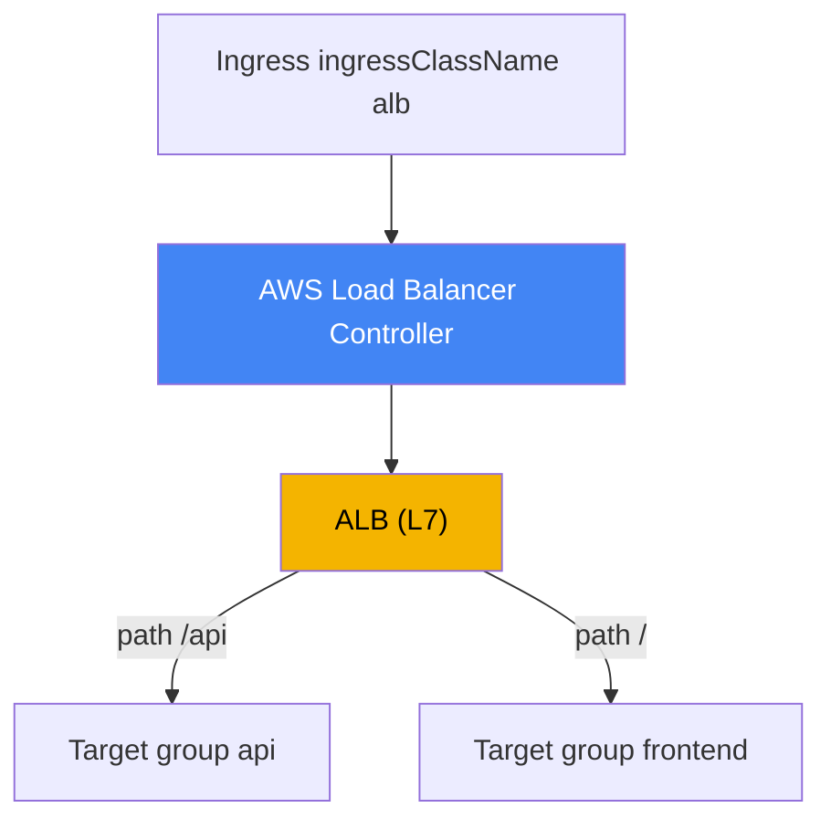
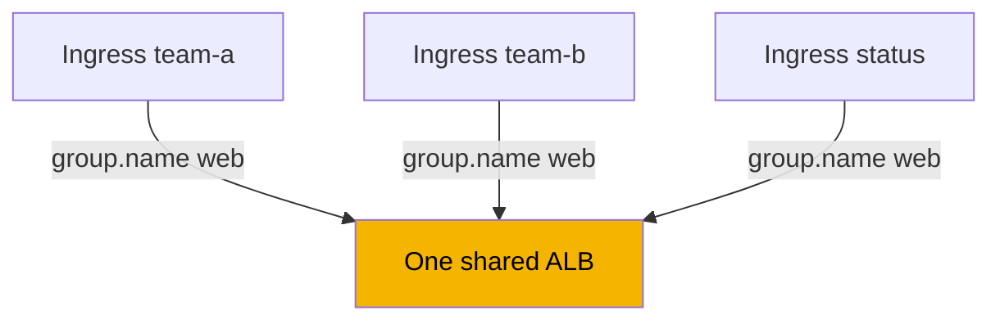
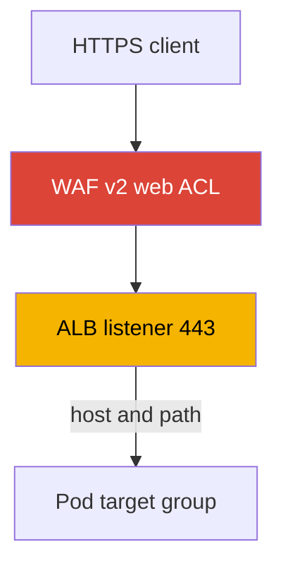

[Русская версия](ru.md) · [Versión en español](es.md) · [Version française](fr.md) · [Deutsche Version](de.md) · [ქართული ვერსია](ge.md) · [繁體中文版](tw.md) · [日本語版](jp.md)
# Chapter 27. Ingress through ALB: target-type, annotations, TLS and ACM, WAF

> **What comes next.** Chapter 26 covered L4 load balancing: a LoadBalancer Service and Network
> Load Balancer through AWS Load Balancer Controller. Here the controller is the same, but at L7:
> it creates an Application Load Balancer from an Ingress, with host and path routing, TLS
> termination, and WAF protection. NLB and LoadBalancer Services remain in chapter 26 and are
> referenced there. Gateway API and VPC Lattice are chapter 28; external-dns, Route 53, and
> cert-manager are chapter 29. How a pod gets an IP in the VPC (VPC CNI) is chapter 8, and the
> controller role through IRSA or Pod Identity is chapters 16-17. We refer to, rather than repeat,
> those topics.

## 27.1. "Five services, five load balancers, and nowhere to attach a certificate"

A team deploys a public web application made of several services: frontend, API, and a status page.
Using the familiar approach from chapter 26, each service receives its own LoadBalancer Service,
and therefore its own NLB:

```bash
kubectl get svc
# NAME       TYPE           EXTERNAL-IP                              PORT(S)
# frontend   LoadBalancer   a1b2...elb.eu-central-1.amazonaws.com    80:31111/TCP
# api        LoadBalancer   c3d4...elb.eu-central-1.amazonaws.com    80:31222/TCP
# status     LoadBalancer   e5f6...elb.eu-central-1.amazonaws.com    80:31333/TCP
```

Three services mean three load balancers, three DNS names, three bills for the same site, and each
new service adds another one. But the problem is not even the number of load balancers. An NLB
operates at L4: it does not parse HTTP, so it cannot route by path (`/api` to one service and `/`
to another) or host, and there is no single entry point. Most importantly, TLS termination with an
80-to-443 redirect cannot be configured properly on an NLB: that requires understanding HTTP,
which L4 does not do.

The engineer needs something else: one entry point, with traffic distributed to different services by
host and path rules, an ACM certificate, an automatic HTTPS redirect, and WAF filtering. All of
that is the work of an L7 load balancer. In AWS, that is an Application Load Balancer, and in
Kubernetes it is described by the familiar Ingress object. The same AWS Load Balancer Controller
that created NLBs from Services in chapter 26 creates the ALB from an Ingress.

## 27.2. ALB through Ingress: IngressClass alb and the same controller

The mechanism repeats chapter 26, but the Ingress object is now the entry point. The controller
watches Ingress resources with the required `ingressClassName` and reconciles the ALB, its
listeners, target groups, and rules. For an Ingress to belong to LBC, the cluster has an
IngressClass with controller `ingress.k8s.aws/alb`:

```yaml
apiVersion: networking.k8s.io/v1
kind: IngressClass
metadata:
  name: alb
spec:
  controller: ingress.k8s.aws/alb
```

Then `spec.ingressClassName: alb` is set on the Ingress itself, and ALB behavior is configured with
annotations prefixed `alb.ingress.kubernetes.io/`. This is a minimal public Ingress with path
routing:

```yaml
apiVersion: networking.k8s.io/v1
kind: Ingress
metadata:
  name: web
  annotations:
    alb.ingress.kubernetes.io/scheme: internet-facing
    alb.ingress.kubernetes.io/target-type: ip
spec:
  ingressClassName: alb
  rules:
    - http:
        paths:
          - path: /api
            pathType: Prefix
            backend:
              service:
                name: api
                port: {number: 80}
          - path: /
            pathType: Prefix
            backend:
              service:
                name: frontend
                port: {number: 80}
```



As in chapter 26, the controller acts in AWS and requires an IAM role on its ServiceAccount (IRSA
or Pod Identity, chapters 16-17). Permissions for ALBs, target groups, listeners, WAF, and Shield
are included in the same `iam_policy.json` policy document that was installed for NLB. No separate
controller for ALB is needed: there is one LBC, and it handles both Services and Ingresses.

## 27.3. target-type: instance versus ip

The target choice for an ALB is the same mechanism as for an NLB (chapter 26), so this section is
brief. The `alb.ingress.kubernetes.io/target-type` annotation accepts `instance` or `ip`; its
default is `instance`.

- **`instance`**: the target group registers nodes by their `NodePort`; the Service must be type
  `NodePort` or `LoadBalancer`. The ALB sends traffic to the `NodePort`, then `kube-proxy`
  delivers it to the pod, potentially with an additional inter-node hop.
- **`ip`**: the target group registers pod IPs themselves. It works because VPC CNI assigns the pod
  a routable VPC address (chapter 8). It has fewer hops and is required on Fargate.

The practice is the same as for NLB: on EC2 with VPC CNI, use `ip` by default. For ALB, `ip` mode
is also required for sticky sessions, which keep a session bound to a target. The full comparison
of traffic paths, hops, and networking requirements is in chapter 26 and is not duplicated here.

| target-type | What is registered | Service type | Fargate |
|---|---|---|---|
| `instance` | nodes by `NodePort` | `NodePort` or `LoadBalancer` | does not work |
| `ip` | pod IPs directly | any with VPC CNI | required |

## 27.4. IngressGroup: one ALB for multiple Ingresses

By default, every Ingress creates its own ALB. That returns us to the pain in 27.1, just at L7:
ten teams with ten Ingresses get ten ALBs. The solution is **IngressGroup**: multiple Ingresses are
combined into a group and served by **one** shared ALB. The controller merges all Ingress rules in
the group into one set of listeners and rules.

A group is set by the `alb.ingress.kubernetes.io/group.name` annotation. All Ingresses with the
same value join one group and share the load balancer:

```yaml
metadata:
  annotations:
    alb.ingress.kubernetes.io/group.name: my-team.web
    alb.ingress.kubernetes.io/group.order: '10'
```



The rule order within a group is controlled by `alb.ingress.kubernetes.io/group.order`, an integer
from -1000 to 1000 (default 0). The lower the number, the earlier the rule is evaluated; for equal
values, the order is determined by the Ingress `namespace/name`. This matters when several
Ingresses define overlapping paths and an explicit priority is needed.

IngressGroup has an important risk that the controller explicitly marks as a security risk. Any user
with RBAC permission to create an Ingress can specify the **same** `group.name` and add their rules
to the shared ALB, or override another team's rules with higher priority. A group name is therefore
a trust boundary: create groups only within a trusted set of teams, restrict membership through
`IngressClassParams` (`namespaceSelector`), or disable annotation-based joining with a controller
flag. Do not mix Ingresses from different teams in one group without those controls.

## 27.5. TLS and ACM: certificate, redirect, ports

TLS termination is a key reason to put an ALB in front of an application. The ALB obtains its
certificate from **AWS Certificate Manager (ACM)**; the private key never leaves the load
balancer and remains on the load balancer side. There are two ways to specify a certificate.

Explicitly, use the `alb.ingress.kubernetes.io/certificate-arn` annotation with the ACM certificate
ARN. The first certificate in the list becomes the default certificate and the rest join the SNI
list:

```yaml
metadata:
  annotations:
    alb.ingress.kubernetes.io/scheme: internet-facing
    alb.ingress.kubernetes.io/listen-ports: '[{"HTTP": 80}, {"HTTPS": 443}]'
    alb.ingress.kubernetes.io/certificate-arn: arn:aws:acm:eu-central-1:111122223333:certificate/abc
    alb.ingress.kubernetes.io/ssl-redirect: '443'
spec:
  ingressClassName: alb
  tls:
    - hosts: ["app.example.com"]
  rules:
    - host: app.example.com
      http:
        paths:
          - path: /
            pathType: Prefix
            backend:
              service: {name: frontend, port: {number: 80}}
```

The second way is **certificate auto-discovery**. If `certificate-arn` is not specified, the
controller takes hosts from `spec.tls[].hosts` (and `host` in rules) and looks in ACM for a matching
certificate by domain name. The manifest then does not need an ARN: a TLS host is enough.

The `alb.ingress.kubernetes.io/listen-ports` annotation lists ALB listener ports and protocols. By
default it is `'[{"HTTP": 80}]'`; if `certificate-arn` is set, it is `'[{"HTTPS": 443}]'`. To
accept both HTTP and HTTPS, explicitly specify both ports, as in the preceding example.

An HTTP-to-HTTPS redirect is enabled with `alb.ingress.kubernetes.io/ssl-redirect`, whose value is
the target port (normally `'443'`). Every HTTP listener then receives a default action that redirects
to HTTPS, and its other rules are ignored. The `ssl-redirect` port must exist in `listen-ports`.
`alb.ingress.kubernetes.io/ssl-policy` sets the protocol and cipher policy (default
`ELBSecurityPolicy-2016-08`).

| Annotation | Purpose | Note |
|---|---|---|
| `certificate-arn` | ARN of an ACM certificate | first is default, then SNI |
| (without `certificate-arn`) | auto-discovery by host from TLS | ARN is not needed in the manifest |
| `listen-ports` | listener ports and protocols | default HTTP 80 or HTTPS 443 |
| `ssl-redirect` | redirect 80 to 443 | port must be in `listen-ports` |
| `ssl-policy` | TLS protocol and cipher set | default `ELBSecurityPolicy-2016-08` |

## 27.6. WAF and Shield: L7 filtering

Because an ALB understands HTTP, request filtering can be attached to it. A **AWS WAF v2** web ACL
is associated using `alb.ingress.kubernetes.io/wafv2-acl-arn` with the web ACL's ARN:

```yaml
metadata:
  annotations:
    alb.ingress.kubernetes.io/wafv2-acl-arn: arn:aws:wafv2:eu-central-1:111122223333:regional/webacl/my-acl/abc
```

A web ACL with rules for SQL injection protection, rate limiting, geographic filtering, and IP
filters acts on incoming traffic before it reaches the pods. Only Regional WAFv2 is supported. If
the annotation is absent, the controller does not alter the WAF setting; to disassociate a web ACL,
explicitly set its value to `none`. The legacy WAF Classic has `waf-acl-id`, but use WAFv2 for new
workloads. DDoS protection is enabled by the
`alb.ingress.kubernetes.io/shield-advanced-protection: 'true'` annotation, which enables AWS Shield
Advanced on the load balancer (and requires a Shield Advanced subscription).



Note the IngressGroup in 27.4: WAF and Shield are configured at the entire ALB level, therefore for
the whole group. On a shared ALB, any group member can change protection with their annotation. In
multi-tenant groups, therefore, fix the WAF configuration through `IngressClassParams` (the
`WAFv2ACLArn` field) rather than leaving it to individual Ingresses.

## 27.7. Routing: rules, actions, health checks

Basic ALB routing is described by standard Ingress fields: `host`, `path`, and `pathType`
(`Prefix`, `Exact`, `ImplementationSpecific`). That is enough for "by host and path, to the right
service." Annotations are available for more complex scenarios.

**Custom actions**: `alb.ingress.kubernetes.io/actions.${action-name}`. Substitute the action name
as `service.name` in a rule and specify `use-annotation` as `port`. This describes functionality
that is not in standard Ingress:

- `redirect`: redirect to another URL or host;
- `fixed-response`: return a fixed response, for example 503 for a maintenance page;
- `forward`: forward to multiple target groups with weights (weighted routing) and sticky-session
  configuration.

**Additional conditions**: `alb.ingress.kubernetes.io/conditions.${conditions-name}` adds checks
to a rule beyond host and path: an HTTP header (`http-header`), method (`http-request-method`),
query string (`query-string`), or source IP (`source-ip`).

Example: a maintenance page with a fixed response. The action is defined with an annotation and is
referenced in the rule through `service.name` and `port: use-annotation`:

```yaml
metadata:
  annotations:
    alb.ingress.kubernetes.io/actions.maintenance: >
      {"type":"fixed-response","fixedResponseConfig":
      {"contentType":"text/plain","statusCode":"503","messageBody":"under maintenance"}}
# in rules: backend.service.name: maintenance, port.name: use-annotation
```

**Health checks** for target groups are configured by the `healthcheck-*` annotation family:
`healthcheck-protocol` (default `HTTP`), `healthcheck-port` (`traffic-port`), `healthcheck-path`
(`/`), `healthcheck-interval-seconds` (`15`), `healthcheck-timeout-seconds` (`5`),
`healthy-threshold-count` and `unhealthy-threshold-count` (`2`), and `success-codes` (`200`).
The controller defines these defaults, which can be overridden when necessary.

**Backend protocol** for HTTP workloads is specified by
`alb.ingress.kubernetes.io/backend-protocol-version`: `HTTP1` (default), `HTTP2`, or `GRPC`. The
value applies only with an HTTP or HTTPS backend protocol and changes the target group's
application protocol. Set `GRPC` for a gRPC service, so ALB proxies gRPC calls over HTTP/2 to pods;
use `HTTP2` for an ordinary HTTP/2 backend. Without it, ALB communicates with targets over HTTP/1.1
and gRPC does not pass through:

```yaml
metadata:
  annotations:
    alb.ingress.kubernetes.io/backend-protocol-version: GRPC
```

**Load balancer scheme** is set by `alb.ingress.kubernetes.io/scheme`: `internal` (default) or
`internet-facing`. As with NLB, create a public ALB only with explicit `internet-facing`. Changing
the scheme on a live Ingress is not free: the ALB cannot be switched in place, so the controller
creates a new load balancer. Plan this as a traffic migration.

**Authentication** is built into ALB: `alb.ingress.kubernetes.io/auth-type` with value `cognito` or
`oidc` delegates user verification to Amazon Cognito or an external OIDC provider
(`auth-idp-cognito`, `auth-idp-oidc`). It works only on HTTPS listeners. It is useful for protecting
an internal console behind login without changing the application itself.

## 27.8. ALB (Ingress) versus NLB (Service): when to use each

One controller creates both load balancers; the choice is the OSI model level and the Kubernetes
object type. NLB is covered in detail in chapter 26; this is the final distinction.

| Criterion | ALB (Ingress) | NLB (Service type LoadBalancer) |
|---|---|---|
| Layer | L7 (HTTP/HTTPS) | L4 (TCP/UDP) |
| Kubernetes object | Ingress | Service |
| Routing by host and path | yes | no |
| TLS termination | ACM on the listener | ACM, but no HTTP logic |
| HTTPS redirect, WAF, OIDC | yes | no |
| One LB for many services | yes, IngressGroup | no, one Service means one NLB |
| UDP, static IPs | no | yes |
| Annotation prefix | `alb.ingress.kubernetes.io/` | `service.beta.kubernetes.io/aws-load-balancer-` |

A rough rule: HTTP routing, TLS with a redirect, WAF, and a single entry point mean ALB through
Ingress; pure L4, UDP, static IPs, or maximum throughput mean NLB through Service (chapter 26).

## 27.9. How this is used in production

- **IngressGroup instead of an ALB per Ingress.** Group services of one application or team through
  `group.name` for one entry point and fewer load balancers; restrict membership because a shared
  ALB has a security risk.
- **TLS through ACM with auto-discovery.** Keep certificates in ACM and let Ingresses use
  auto-discovery from `spec.tls` hosts rather than distributing ARNs through manifests; enable the
  HTTPS redirect with `ssl-redirect`.
- **Choose `scheme` and `target-type` deliberately.** A public ALB must explicitly be
  `internet-facing`; use `target-type: ip` by default on EC2 with VPC CNI.
- **WAF at the perimeter.** Attach a WAFv2 web ACL to public ALBs; in multi-tenant groups, fix it
  through `IngressClassParams` so a group member cannot remove the protection.
- **Do not change the scheme and LB name while live.** Changing `scheme` recreates the ALB; design
  those parameters in advance and change them as a traffic migration.

## 27.10. Mini-glossary

- **Application Load Balancer (ALB)**: an L7 (HTTP/HTTPS) load balancer with host and path
  routing, TLS termination, WAF, and authentication; in EKS, LBC creates it from an Ingress.
- **IngressClass alb**: a class with controller `ingress.k8s.aws/alb`; AWS Load Balancer Controller
  processes an Ingress with `ingressClassName: alb`.
- **IngressGroup**: combines multiple Ingresses with `group.name` into one shared ALB;
  `group.order` sets rule priority.
- **target-type**: ALB target type: `instance` (nodes by `NodePort`) or `ip` (pod IPs, requiring
  VPC CNI); covered in detail in chapter 26.
- **ACM (AWS Certificate Manager)**: source of TLS certificates for an ALB listener; the key does
  not leave the load balancer.
- **ssl-redirect**: annotation that enables an HTTP-to-HTTPS redirect to the specified listener
  port.
- **wafv2-acl-arn**: annotation that associates an AWS WAF v2 web ACL with an ALB for request
  filtering.
- **actions / conditions**: annotations for custom actions (redirect, fixed-response, weighted
  forward) and extra routing conditions (headers, method, query, source IP).
- **backend-protocol-version**: target group application protocol: `HTTP1`, `HTTP2`, or `GRPC`;
  needed for ALB to proxy gRPC and HTTP/2 to pods rather than using HTTP/1.1.

## 27.11. Chapter summary

- Multiple LoadBalancer Services create an NLB per service, cannot perform HTTP routing by host and
  path, and do not provide TLS termination with a redirect; L7 requires ALB through Ingress.
- The same AWS Load Balancer Controller (chapter 26) creates an ALB from an Ingress with
  `ingressClassName: alb` (IngressClass controller `ingress.k8s.aws/alb`); annotations under
  `alb.ingress.kubernetes.io/` control its behavior. The controller requires an IAM role
  (chapters 16-17).
- `target-type` `instance` versus `ip` is the same mechanism as NLB (chapter 26): use `ip` by
  default on EC2 with VPC CNI; it is required on Fargate and for sticky sessions.
- IngressGroup (`group.name`) combines multiple Ingresses into one ALB, and `group.order` sets
  rule priority; a shared ALB is a security risk, so restrict membership.
- TLS terminates on the ALB with an ACM certificate: `certificate-arn` or auto-discovery from a
  host in `spec.tls`; `ssl-redirect` enables the 80-to-443 redirect and `listen-ports` sets
  listeners.
- WAF is associated with `wafv2-acl-arn` and Shield Advanced with
  `shield-advanced-protection`; fix protection through `IngressClassParams` in a shared group.
- Ingress rules describe routing, while complex scenarios use `actions.*` annotations (redirect,
  fixed-response, weighted forward) and `conditions.*`; configure health checks through
  `healthcheck-*` and authentication with `auth-type` (Cognito or OIDC) on HTTPS. For gRPC and
  HTTP/2 to a backend, set `backend-protocol-version` (`GRPC` or `HTTP2`).

## 27.12. How this helps in real work

During on-call work, L7 incidents with ALB usually have a few causes. If an Ingress does not bring
up an ALB and has no address, check the `ingressClassName`, whether the controller is installed,
and whether its role has permissions (`AccessDenied` in logs), as in chapter 26 for NLB. If targets
are `unhealthy`, examine `healthcheck-*` (protocol, path, codes) and pod-port reachability in `ip`
mode. If a client receives the wrong service or 404, examine rule order, `group.order` within an
IngressGroup, and path overlaps among Ingresses from different teams on a shared group. For TLS
errors, check whether the certificate was found (ARN or auto-discovery from a host in `spec.tls`)
and whether HTTPS exists in `listen-ports`.

During planning, decide three things in advance: the scheme (`internal` if the entry point is not
public), target type (`ip` by default on EC2), and IngressGroup boundaries: which teams share an
ALB and who owns WAF. Remember the non-in-place change: changing `scheme` recreates the ALB, so
these details are designed, not switched on live traffic.

## 27.13. Self-check questions

1. Why are multiple LoadBalancer Services a poor way to publish one website?
2. What exactly can NLB (L4) not do that makes ALB (L7) necessary for an HTTP site?
3. How does an Ingress reach LBC, and which controller is specified in IngressClass alb?
4. Is a separate controller for ALB needed when the cluster already has LBC for NLB (chapter 26)?
5. How does `target-type: instance` differ from `ip`, and why is `ip` needed for sticky sessions?
6. What does IngressGroup do, and how do `group.name` and `group.order` affect a shared ALB?
7. What is the security risk of a shared ALB in IngressGroup, and how is it constrained?
8. How do you specify an ALB certificate through ACM, and how does auto-discovery from a host in
   `spec.tls` work?
9. What do `ssl-redirect` and `listen-ports` do, and how are they related?
10. How do you associate a WAFv2 web ACL with an ALB, and why is it fixed through
    IngressClassParams in a group?
11. What are `actions.*` and `conditions.*` annotations for, and how do they relate to rules?
12. Why is changing `scheme` on a live Ingress planned as a traffic migration?
13. When do you choose ALB through Ingress, and when NLB through Service (chapter 26)?
14. Why is `backend-protocol-version` needed, and which value is set for a gRPC backend?

## Practice

The course lab for this topic is [lab 109: Ingress through ALB with an ACM certificate, external-dns,
and Route 53](../../labs/109/README.MD). In addition, everything can be verified on a live cluster.
The controller is the same as in chapter 26, so first make sure it is healthy and inspect the
available IngressClass:

```bash
kubectl get deploy -n kube-system aws-load-balancer-controller
kubectl get ingressclass
kubectl get ingressclass alb -o yaml   # controller must be ingress.k8s.aws/alb
```

Create an Ingress with `ingressClassName: alb`, annotations
`alb.ingress.kubernetes.io/scheme: internal` and `alb.ingress.kubernetes.io/target-type: ip`, and
two path rules to different services. Wait for its address (`kubectl get ingress web -w`) and find
the ALB from AWS: `aws elbv2 describe-load-balancers` shows the load balancer and its `Type`
(`application`) and `Scheme`; `aws elbv2 describe-listeners --load-balancer-arn <arn>` shows
listeners and ports; `aws elbv2 describe-rules --listener-arn <arn>` shows path-routing rules; and
`aws elbv2 describe-target-health --target-group-arn <arn>` shows what is registered. In `ip` mode,
the targets are pod IPs.

Then add TLS: create a certificate in ACM, specify `certificate-arn` (or verify auto-discovery
through a `spec.tls` host), add `listen-ports` with HTTP and HTTPS and `ssl-redirect: '443'`, then
check that an HTTPS listener appeared and an HTTP request is redirected. Finally, combine two
Ingresses into one group with the `group.name` annotation and confirm that there is one ALB for
both. View controller logs as in chapter 26:
`kubectl logs -n kube-system deploy/aws-load-balancer-controller`.

---
[Table of contents](../README.md) · [Chapter 26](../26/en.md) · [Chapter 28](../28/en.md)
