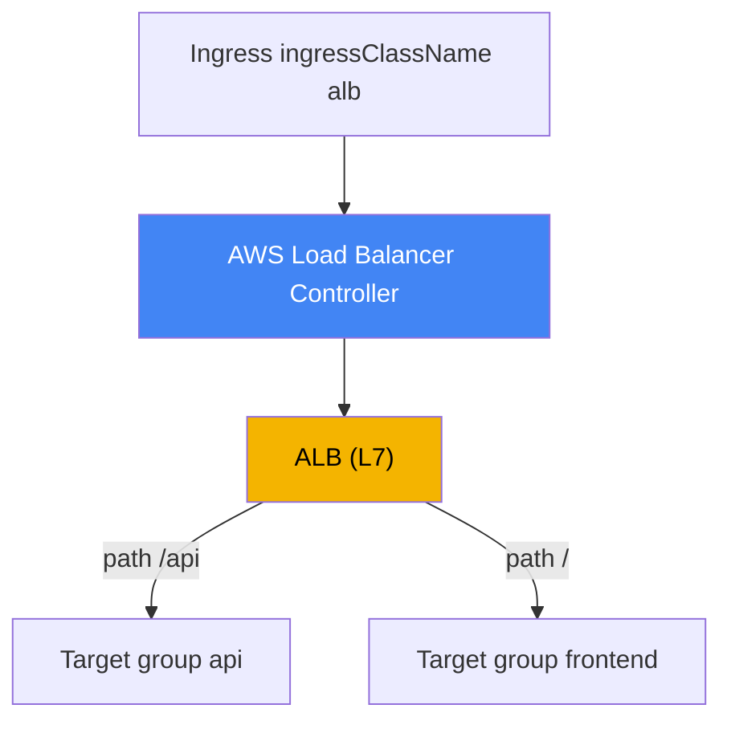
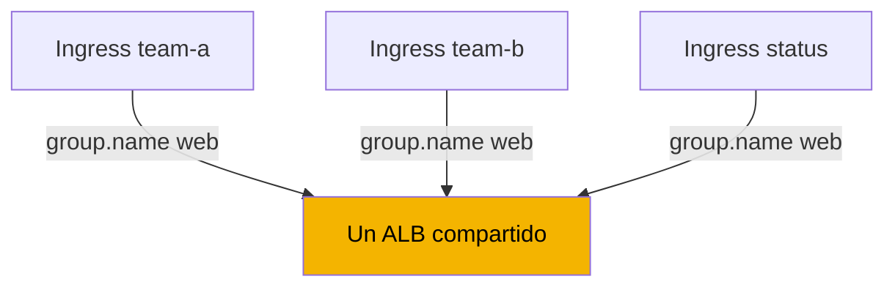
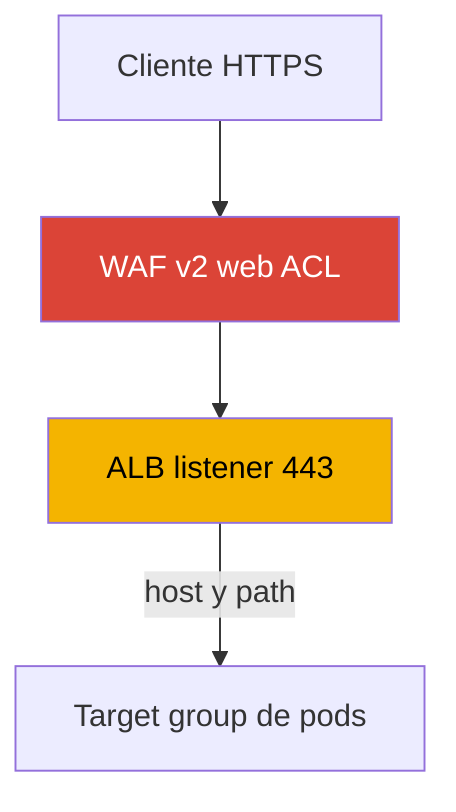

[English version](en.md) · [Русская версия](ru.md) · [Version française](fr.md) · [Deutsche Version](de.md) · [ქართული ვერსია](ge.md) · [繁體中文版](tw.md) · [日本語版](jp.md)
# Capítulo 27. Ingress mediante ALB: target-type, anotaciones, TLS y ACM, WAF

> **Qué sigue.** El capítulo 26 mostró el balanceo L4: Service de tipo LoadBalancer y Network
> Load Balancer mediante AWS Load Balancer Controller. Aquí el controlador es el mismo, pero el nivel es L7:
> a partir de un Ingress crea un Application Load Balancer con enrutamiento por host y path, terminación
> de TLS y protección WAF. NLB y Service de tipo LoadBalancer permanecen en el capítulo 26, al que se
> hace referencia. Gateway API y VPC Lattice son el capítulo 28; external-dns, Route 53 y cert-manager
> son el capítulo 29. Cómo un pod obtiene una IP en la VPC (VPC CNI) se explica en el capítulo 8, y el
> rol del controlador mediante IRSA o Pod Identity, en los capítulos 16-17. Se hace referencia a esos
> temas sin repetirlos.

## 27.1. «Cinco servicios, cinco balanceadores y ningún lugar para asociar un certificado»

Un equipo despliega públicamente una aplicación web formada por varios servicios: frontend, API y una
página de estado. Mediante el enfoque habitual del capítulo 26, cada servicio recibe su propio Service
de tipo LoadBalancer y, por tanto, su propio NLB:

```bash
kubectl get svc
# NAME       TYPE           EXTERNAL-IP                              PORT(S)
# frontend   LoadBalancer   a1b2...elb.eu-central-1.amazonaws.com    80:31111/TCP
# api        LoadBalancer   c3d4...elb.eu-central-1.amazonaws.com    80:31222/TCP
# status     LoadBalancer   e5f6...elb.eu-central-1.amazonaws.com    80:31333/TCP
```

Tres servicios significan tres balanceadores, tres nombres DNS, tres facturas por el mismo sitio y cada
servicio nuevo añade otro. Pero el problema ni siquiera es el número de balanceadores. Un NLB opera en
L4: no analiza HTTP, de modo que no puede enrutar por path (`/api` a un servicio y `/` a otro) ni por
host, y no existe un punto de entrada único. Lo más importante es que no se puede configurar
correctamente en un NLB la terminación de TLS con redirección de 80 a 443: para ello se debe entender
HTTP, algo que L4 no hace.

El ingeniero necesita algo distinto: un único punto de entrada tras el cual el tráfico se distribuya a
distintos servicios mediante reglas de host y path, un certificado de ACM, una redirección automática a
HTTPS y filtrado mediante WAF. Todo ello es trabajo de un balanceador L7. En AWS es un Application Load
Balancer, y en Kubernetes se describe mediante el conocido objeto Ingress. El mismo AWS Load Balancer
Controller que creó NLB a partir de Service en el capítulo 26 crea el ALB a partir de un Ingress.

## 27.2. ALB mediante Ingress: IngressClass alb y el mismo controlador

El mecanismo repite el capítulo 26, pero ahora el punto de entrada es el objeto Ingress. El controlador
observa los recursos Ingress con el `ingressClassName` requerido y reconcilia el ALB, sus listeners,
target groups y reglas. Para que un Ingress sea gestionado por LBC, el clúster tiene un IngressClass con
el controlador `ingress.k8s.aws/alb`:

```yaml
apiVersion: networking.k8s.io/v1
kind: IngressClass
metadata:
  name: alb
spec:
  controller: ingress.k8s.aws/alb
```

Después se establece `spec.ingressClassName: alb` en el propio Ingress y se configura el comportamiento
del ALB con anotaciones que tienen el prefijo `alb.ingress.kubernetes.io/`. Este es un Ingress público
mínimo con enrutamiento por paths:

```yaml
apiVersion: networking.k8s.io/v1
kind: Ingress
metadata:
  name: web
  annotations:
    alb.ingress.kubernetes.io/scheme: internet-facing
    alb.ingress.kubernetes.io/target-type: ip
spec:
  ingressClassName: alb
  rules:
    - http:
        paths:
          - path: /api
            pathType: Prefix
            backend:
              service:
                name: api
                port: {number: 80}
          - path: /
            pathType: Prefix
            backend:
              service:
                name: frontend
                port: {number: 80}
```



Como en el capítulo 26, el controlador actúa en AWS y requiere un rol de IAM en su ServiceAccount (IRSA
o Pod Identity, capítulos 16-17). Los permisos para ALB, target groups, listeners, WAF y Shield se
incluyen en el mismo documento de política `iam_policy.json` que se instaló para NLB. No se necesita un
controlador independiente para ALB: hay un único LBC y gestiona tanto Service como Ingress.

## 27.3. target-type: instance frente a ip

La elección del target para un ALB es el mismo mecanismo que para un NLB (capítulo 26), por lo que esta
sección es breve. La anotación `alb.ingress.kubernetes.io/target-type` acepta `instance` o `ip`; el valor
predeterminado es `instance`.

- **`instance`**: el target group registra nodos mediante su `NodePort`; el Service debe ser de tipo
  `NodePort` o `LoadBalancer`. El ALB envía tráfico al `NodePort` y después `kube-proxy` lo entrega al
  pod, con la posibilidad de un salto adicional entre nodos.
- **`ip`**: el target group registra las IP de los propios pods. Funciona porque VPC CNI asigna al pod
  una dirección VPC enrutable (capítulo 8). Tiene menos saltos y es obligatorio en Fargate.

La práctica es la misma que para NLB: en EC2 con VPC CNI, se usa `ip` de forma predeterminada. Para ALB,
el modo `ip` también es necesario para sticky sessions, que mantienen una sesión asociada a un target. La
comparación completa de rutas de tráfico, saltos y requisitos de red está en el capítulo 26 y no se
repite aquí.

| target-type | Qué se registra | Tipo de Service | Fargate |
|---|---|---|---|
| `instance` | nodos mediante `NodePort` | `NodePort` o `LoadBalancer` | no funciona |
| `ip` | IP de pods directamente | cualquiera con VPC CNI | obligatorio |

## 27.4. IngressGroup: un ALB para varios Ingress

De forma predeterminada, cada Ingress crea su propio ALB. Esto devuelve el problema de 27.1, solo que en
L7: diez equipos con diez Ingress obtienen diez ALB. La solución es **IngressGroup**: varios Ingress se
combinan en un grupo y son atendidos por **un** ALB compartido. El controlador fusiona las reglas de todos
los Ingress del grupo en un conjunto de listeners y reglas.

Un grupo se establece mediante la anotación `alb.ingress.kubernetes.io/group.name`. Todos los Ingress con
el mismo valor se unen a un grupo y comparten el balanceador:

```yaml
metadata:
  annotations:
    alb.ingress.kubernetes.io/group.name: my-team.web
    alb.ingress.kubernetes.io/group.order: '10'
```



El orden de las reglas dentro de un grupo se controla mediante `alb.ingress.kubernetes.io/group.order`, un
número entero de -1000 a 1000 (el valor predeterminado es 0). Cuanto menor sea el número, antes se evalúa
la regla; con valores iguales, el orden lo determina el `namespace/name` del Ingress. Esto importa cuando
varios Ingress definen paths que se solapan y se necesita una prioridad explícita.

IngressGroup tiene un riesgo importante que el controlador marca explícitamente como security risk.
Cualquier usuario con permiso RBAC para crear un Ingress puede especificar el **mismo** `group.name` y
añadir sus reglas al ALB compartido, o sobrescribir reglas de otro equipo con una prioridad superior. Por
tanto, el nombre de grupo es un límite de confianza: cree grupos solo dentro de un conjunto confiable de
equipos, restrinja la pertenencia mediante `IngressClassParams` (`namespaceSelector`) o desactive la unión
basada en anotaciones con una opción del controlador. No mezcle Ingress de equipos diferentes en un grupo
sin esos controles.

## 27.5. TLS y ACM: certificado, redirección, puertos

La terminación de TLS es una razón clave para colocar un ALB delante de una aplicación. El ALB obtiene su
certificado de **AWS Certificate Manager (ACM)**; la clave privada nunca sale del balanceador y permanece
en su lado. Hay dos formas de especificar un certificado.

De forma explícita, use la anotación `alb.ingress.kubernetes.io/certificate-arn` con el ARN del
certificado de ACM. El primer certificado de la lista se convierte en el certificado predeterminado y el
resto se incorpora a la lista SNI:

```yaml
metadata:
  annotations:
    alb.ingress.kubernetes.io/scheme: internet-facing
    alb.ingress.kubernetes.io/listen-ports: '[{"HTTP": 80}, {"HTTPS": 443}]'
    alb.ingress.kubernetes.io/certificate-arn: arn:aws:acm:eu-central-1:111122223333:certificate/abc
    alb.ingress.kubernetes.io/ssl-redirect: '443'
spec:
  ingressClassName: alb
  tls:
    - hosts: ["app.example.com"]
  rules:
    - host: app.example.com
      http:
        paths:
          - path: /
            pathType: Prefix
            backend:
              service: {name: frontend, port: {number: 80}}
```

La segunda forma es la **detección automática de certificados**. Si no se especifica `certificate-arn`, el
controlador toma los hosts de `spec.tls[].hosts` (y el `host` de las reglas) y busca en ACM un certificado
coincidente por nombre de dominio. Así, el manifiesto no necesita un ARN: basta un host TLS.

La anotación `alb.ingress.kubernetes.io/listen-ports` enumera los puertos y protocolos de los listeners
del ALB. De forma predeterminada es `'[{"HTTP": 80}]'`; si se establece `certificate-arn`, es
`'[{"HTTPS": 443}]'`. Para aceptar tanto HTTP como HTTPS, especifique ambos puertos de forma explícita,
como en el ejemplo anterior.

Una redirección de HTTP a HTTPS se habilita con `alb.ingress.kubernetes.io/ssl-redirect`, cuyo valor es el
puerto de destino (normalmente `'443'`). Cada listener HTTP recibe entonces una acción predeterminada que
redirige a HTTPS y se ignoran sus demás reglas. El puerto de `ssl-redirect` debe existir en `listen-ports`.
`alb.ingress.kubernetes.io/ssl-policy` establece la política de protocolos y cifrados (predeterminada:
`ELBSecurityPolicy-2016-08`).

| Anotación | Finalidad | Nota |
|---|---|---|
| `certificate-arn` | ARN de un certificado de ACM | el primero es predeterminado, después SNI |
| (sin `certificate-arn`) | detección automática por host de TLS | el ARN no es necesario en el manifiesto |
| `listen-ports` | puertos y protocolos de listeners | HTTP 80 o HTTPS 443 predeterminado |
| `ssl-redirect` | redirección de 80 a 443 | el puerto debe estar en `listen-ports` |
| `ssl-policy` | conjunto de protocolos y cifrados TLS | predeterminado `ELBSecurityPolicy-2016-08` |

## 27.6. WAF y Shield: filtrado L7

Puesto que un ALB entiende HTTP, se le puede asociar filtrado de solicitudes. Una web ACL de **AWS WAF v2**
se asocia mediante `alb.ingress.kubernetes.io/wafv2-acl-arn` con el ARN de esa web ACL:

```yaml
metadata:
  annotations:
    alb.ingress.kubernetes.io/wafv2-acl-arn: arn:aws:wafv2:eu-central-1:111122223333:regional/webacl/my-acl/abc
```

Una web ACL con reglas para protección contra inyección SQL, rate limiting y filtros geográficos y de IP
actúa sobre el tráfico entrante antes de que llegue a los pods. Solo se admite WAFv2 Regional. Si falta la
anotación, el controlador no modifica la configuración de WAF; para desasociar una web ACL, establezca
explícitamente su valor en `none`. El WAF Classic heredado tiene `waf-acl-id`, pero para cargas de trabajo
nuevas use WAFv2. La protección contra DDoS se habilita con la anotación
`alb.ingress.kubernetes.io/shield-advanced-protection: 'true'`, que habilita AWS Shield Advanced en el
balanceador (requiere una suscripción a Shield Advanced).



Tenga en cuenta IngressGroup de 27.4: WAF y Shield se configuran en el nivel de todo el ALB y, por tanto,
para todo el grupo. En un ALB compartido, cualquier miembro del grupo puede cambiar la protección con su
anotación. Por ello, en grupos multiinquilino fije la configuración de WAF mediante
`IngressClassParams` (el campo `WAFv2ACLArn`) en vez de dejarla en manos de Ingress individuales.

## 27.7. Enrutamiento: reglas, acciones, health checks

El enrutamiento básico de ALB se describe mediante los campos estándar de Ingress: `host`, `path` y
`pathType` (`Prefix`, `Exact`, `ImplementationSpecific`). Es suficiente para «por host y path, al
servicio correcto». Hay anotaciones disponibles para escenarios más complejos.

**Acciones personalizadas**: `alb.ingress.kubernetes.io/actions.${action-name}`. Sustituya el nombre de
la acción como `service.name` en una regla y especifique `use-annotation` como `port`. Así se describe
funcionalidad que no está en el Ingress estándar:

- `redirect`: redirigir a otra URL o host;
- `fixed-response`: devolver una respuesta fija, por ejemplo 503 en una página de mantenimiento;
- `forward`: reenviar a varios target groups con pesos (weighted routing) y configuración de sticky
  sessions.

**Condiciones adicionales**: `alb.ingress.kubernetes.io/conditions.${conditions-name}` agrega
comprobaciones a una regla más allá de host y path: una cabecera HTTP (`http-header`), método
(`http-request-method`), query string (`query-string`) o IP de origen (`source-ip`).

Ejemplo: una página de mantenimiento con una respuesta fija. La acción se define con una anotación y se
referencia en la regla mediante `service.name` y `port: use-annotation`:

```yaml
metadata:
  annotations:
    alb.ingress.kubernetes.io/actions.maintenance: >
      {"type":"fixed-response","fixedResponseConfig":
      {"contentType":"text/plain","statusCode":"503","messageBody":"under maintenance"}}
# en rules: backend.service.name: maintenance, port.name: use-annotation
```

Los **health checks** de target groups se configuran mediante la familia de anotaciones `healthcheck-*`:
`healthcheck-protocol` (predeterminado `HTTP`), `healthcheck-port` (`traffic-port`),
`healthcheck-path` (`/`), `healthcheck-interval-seconds` (`15`), `healthcheck-timeout-seconds` (`5`),
`healthy-threshold-count` y `unhealthy-threshold-count` (`2`), y `success-codes` (`200`). El
controlador define estos valores predeterminados, que se pueden sobrescribir cuando sea necesario.

El **protocolo de backend** para cargas HTTP se especifica mediante
`alb.ingress.kubernetes.io/backend-protocol-version`: `HTTP1` (predeterminado), `HTTP2` o `GRPC`. El
valor solo se aplica con un protocolo de backend HTTP o HTTPS y cambia el protocolo de aplicación del
target group. Establezca `GRPC` para un servicio gRPC, de modo que ALB proxifique llamadas gRPC sobre
HTTP/2 a los pods; use `HTTP2` para un backend HTTP/2 normal. Sin ello, ALB se comunica con los targets
mediante HTTP/1.1 y gRPC no pasa:

```yaml
metadata:
  annotations:
    alb.ingress.kubernetes.io/backend-protocol-version: GRPC
```

El **esquema del balanceador** se establece mediante `alb.ingress.kubernetes.io/scheme`: `internal`
(predeterminado) o `internet-facing`. Como con NLB, cree un ALB público solo con un
`internet-facing` explícito. Cambiar el esquema en un Ingress activo no es gratuito: el ALB no se puede
cambiar en el mismo lugar, por lo que el controlador crea un balanceador nuevo. Planifíquelo como una
migración de tráfico.

La **autenticación** está integrada en ALB: `alb.ingress.kubernetes.io/auth-type` con el valor `cognito` u
`oidc` delega la verificación del usuario a Amazon Cognito o a un proveedor OIDC externo
(`auth-idp-cognito`, `auth-idp-oidc`). Solo funciona en listeners HTTPS. Resulta útil para proteger un
panel interno con inicio de sesión sin modificar la propia aplicación.

## 27.8. ALB (Ingress) frente a NLB (Service): cuándo usar cada uno

Un controlador crea ambos balanceadores; la elección depende del nivel del modelo OSI y del tipo de objeto
Kubernetes. NLB se cubre en detalle en el capítulo 26; esta es la distinción final.

| Criterio | ALB (Ingress) | NLB (Service type LoadBalancer) |
|---|---|---|
| Nivel | L7 (HTTP/HTTPS) | L4 (TCP/UDP) |
| Objeto Kubernetes | Ingress | Service |
| Enrutamiento por host y path | sí | no |
| Terminación de TLS | ACM en el listener | ACM, pero sin lógica HTTP |
| Redirección HTTPS, WAF, OIDC | sí | no |
| Un LB para muchos servicios | sí, IngressGroup | no, un Service significa un NLB |
| UDP, IP estáticas | no | sí |
| Prefijo de anotación | `alb.ingress.kubernetes.io/` | `service.beta.kubernetes.io/aws-load-balancer-` |

Una regla general: enrutamiento HTTP, TLS con redirección, WAF y un único punto de entrada implican ALB
mediante Ingress; L4 puro, UDP, IP estáticas o rendimiento máximo implican NLB mediante Service
(capítulo 26).

## 27.9. Cómo se usa esto en producción

- **IngressGroup en lugar de un ALB por Ingress.** Agrupe servicios de una aplicación o equipo mediante
  `group.name` para tener un punto de entrada y menos balanceadores; restrinja la pertenencia porque un
  ALB compartido tiene un security risk.
- **TLS mediante ACM con detección automática.** Mantenga certificados en ACM y deje que los Ingress usen
  detección automática a partir de hosts de `spec.tls`, en vez de distribuir ARN por los manifiestos;
  habilite la redirección HTTPS con `ssl-redirect`.
- **Elija `scheme` y `target-type` deliberadamente.** Un ALB público debe ser explícitamente
  `internet-facing`; use `target-type: ip` de forma predeterminada en EC2 con VPC CNI.
- **WAF en el perímetro.** Asocie una web ACL WAFv2 a ALB públicos; en grupos multiinquilino, fíjela
  mediante `IngressClassParams` para que un miembro del grupo no pueda eliminar la protección.
- **No cambie el esquema ni el nombre del LB mientras esté activo.** Cambiar `scheme` recrea el ALB;
  diseñe esos parámetros por adelantado y cámbielos como una migración de tráfico.

## 27.10. Miniglosario

- **Application Load Balancer (ALB)**: balanceador L7 (HTTP/HTTPS) con enrutamiento por host y path,
  terminación de TLS, WAF y autenticación; en EKS, LBC lo crea a partir de un Ingress.
- **IngressClass alb**: clase con el controlador `ingress.k8s.aws/alb`; AWS Load Balancer Controller
  procesa un Ingress con `ingressClassName: alb`.
- **IngressGroup**: combina varios Ingress con `group.name` en un ALB compartido;
  `group.order` establece la prioridad de las reglas.
- **target-type**: tipo de target de ALB: `instance` (nodos mediante `NodePort`) o `ip` (IP de pods, que
  requiere VPC CNI); se trata en detalle en el capítulo 26.
- **ACM (AWS Certificate Manager)**: fuente de certificados TLS para un listener ALB; la clave no sale del
  balanceador.
- **ssl-redirect**: anotación que habilita una redirección de HTTP a HTTPS hacia el puerto de listener
  especificado.
- **wafv2-acl-arn**: anotación que asocia una web ACL de AWS WAF v2 con un ALB para filtrar solicitudes.
- **actions / conditions**: anotaciones para acciones personalizadas (redirect, fixed-response, weighted
  forward) y condiciones de enrutamiento adicionales (cabeceras, método, query, IP de origen).
- **backend-protocol-version**: protocolo de aplicación del target group: `HTTP1`, `HTTP2` o `GRPC`;
  necesario para que ALB proxifique gRPC y HTTP/2 a pods en vez de usar HTTP/1.1.

## 27.11. Resumen del capítulo

- Varios Service de tipo LoadBalancer crean un NLB por servicio, no pueden realizar enrutamiento HTTP por
  host y path, y no proporcionan terminación de TLS con redirección; L7 requiere ALB mediante Ingress.
- El mismo AWS Load Balancer Controller (capítulo 26) crea un ALB a partir de un Ingress con
  `ingressClassName: alb` (controlador de IngressClass `ingress.k8s.aws/alb`); las anotaciones bajo
  `alb.ingress.kubernetes.io/` controlan su comportamiento. El controlador requiere un rol de IAM
  (capítulos 16-17).
- `target-type` `instance` frente a `ip` es el mismo mecanismo que para NLB (capítulo 26): use `ip` de
  forma predeterminada en EC2 con VPC CNI; es obligatorio en Fargate y para sticky sessions.
- IngressGroup (`group.name`) combina varios Ingress en un ALB, y `group.order` establece la prioridad de
  las reglas; un ALB compartido es un security risk, así que restrinja la pertenencia.
- TLS termina en el ALB con un certificado de ACM: `certificate-arn` o detección automática a partir de
  un host en `spec.tls`; `ssl-redirect` habilita la redirección de 80 a 443 y `listen-ports` establece
  listeners.
- WAF se asocia con `wafv2-acl-arn` y Shield Advanced con `shield-advanced-protection`; fije la
  protección mediante `IngressClassParams` en un grupo compartido.
- Las reglas Ingress describen el enrutamiento, mientras que los escenarios complejos usan anotaciones
  `actions.*` (redirect, fixed-response, weighted forward) y `conditions.*`; configure health checks
  mediante `healthcheck-*` y la autenticación con `auth-type` (Cognito u OIDC) en HTTPS. Para gRPC y
  HTTP/2 hacia un backend, establezca `backend-protocol-version` (`GRPC` o `HTTP2`).

## 27.12. Cómo ayuda esto en el trabajo real

Durante las guardias, los incidentes L7 con ALB suelen tener unas pocas causas. Si un Ingress no crea un
ALB y no tiene dirección, compruebe `ingressClassName`, si el controlador está instalado y si su rol tiene
permisos (`AccessDenied` en los logs), como en el capítulo 26 para NLB. Si los targets son `unhealthy`,
examine `healthcheck-*` (protocolo, path, códigos) y la accesibilidad del puerto del pod en modo `ip`. Si
un cliente recibe el servicio incorrecto o un 404, examine el orden de reglas, `group.order` dentro de un
IngressGroup y los solapamientos de paths entre Ingress de equipos distintos en un grupo compartido. Para
errores de TLS, compruebe si se encontró el certificado (ARN o detección automática desde un host en
`spec.tls`) y si existe HTTPS en `listen-ports`.

Durante la planificación, decida tres cosas por adelantado: el esquema (`internal` si el punto de entrada
no es público), el tipo de target (`ip` de forma predeterminada en EC2) y los límites de IngressGroup: qué
equipos comparten un ALB y quién es responsable de WAF. Recuerde el cambio que no se realiza en el mismo
lugar: cambiar `scheme` recrea el ALB, así que estos detalles se diseñan, no se cambian con tráfico activo.

## 27.13. Preguntas de autoevaluación

1. ¿Por qué varios Service de tipo LoadBalancer son una mala forma de publicar un solo sitio web?
2. ¿Qué no puede hacer exactamente NLB (L4) que hace necesario ALB (L7) para un sitio HTTP?
3. ¿Cómo llega un Ingress a LBC y qué controlador se especifica en IngressClass alb?
4. ¿Se necesita un controlador independiente para ALB si el clúster ya tiene LBC para NLB (capítulo 26)?
5. ¿En qué se diferencia `target-type: instance` de `ip` y por qué se necesita `ip` para sticky sessions?
6. ¿Qué hace IngressGroup y cómo afectan `group.name` y `group.order` a un ALB compartido?
7. ¿Cuál es el security risk de un ALB compartido en IngressGroup y cómo se limita?
8. ¿Cómo se especifica un certificado ALB mediante ACM y cómo funciona la detección automática desde un
   host en `spec.tls`?
9. ¿Qué hacen `ssl-redirect` y `listen-ports` y cómo se relacionan?
10. ¿Cómo se asocia una web ACL WAFv2 con un ALB y por qué se fija mediante IngressClassParams en un
    grupo?
11. ¿Para qué sirven las anotaciones `actions.*` y `conditions.*` y cómo se relacionan con las reglas?
12. ¿Por qué se planifica cambiar `scheme` en un Ingress activo como una migración de tráfico?
13. ¿Cuándo se elige ALB mediante Ingress y cuándo NLB mediante Service (capítulo 26)?
14. ¿Por qué se necesita `backend-protocol-version` y qué valor se establece para un backend gRPC?

## Práctica

La práctica del curso para este tema es [laboratorio 109: Ingress mediante ALB con un certificado ACM,
external-dns y Route 53](../../labs/109/README_ES.MD). Además, todo se puede verificar en un clúster
activo. El controlador es el mismo que en el capítulo 26, así que primero asegúrese de que está en buen
estado e inspeccione el IngressClass disponible:

```bash
kubectl get deploy -n kube-system aws-load-balancer-controller
kubectl get ingressclass
kubectl get ingressclass alb -o yaml   # el controlador debe ser ingress.k8s.aws/alb
```

Cree un Ingress con `ingressClassName: alb`, las anotaciones
`alb.ingress.kubernetes.io/scheme: internal` y `alb.ingress.kubernetes.io/target-type: ip`, y dos reglas
de path hacia servicios diferentes. Espere su dirección (`kubectl get ingress web -w`) y encuentre el ALB
desde AWS: `aws elbv2 describe-load-balancers` muestra el balanceador y sus valores `Type`
(`application`) y `Scheme`; `aws elbv2 describe-listeners --load-balancer-arn <arn>` muestra los
listeners y puertos; `aws elbv2 describe-rules --listener-arn <arn>` muestra las reglas de enrutamiento
por paths; y `aws elbv2 describe-target-health --target-group-arn <arn>` muestra qué está registrado. En
modo `ip`, los targets son IP de pods.

Después añada TLS: cree un certificado en ACM, especifique `certificate-arn` (o verifique la detección
automática mediante un host de `spec.tls`), añada `listen-ports` con HTTP y HTTPS y
`ssl-redirect: '443'`, y compruebe que apareció un listener HTTPS y que una solicitud HTTP se redirige.
Por último, combine dos Ingress en un grupo mediante la anotación `group.name` y confirme que hay un ALB
para ambos. Consulte los logs del controlador como en el capítulo 26:
`kubectl logs -n kube-system deploy/aws-load-balancer-controller`.

---
[Índice](../README_ES.md) · [Capítulo 26](../26/es.md) · [Capítulo 28](../28/es.md)
