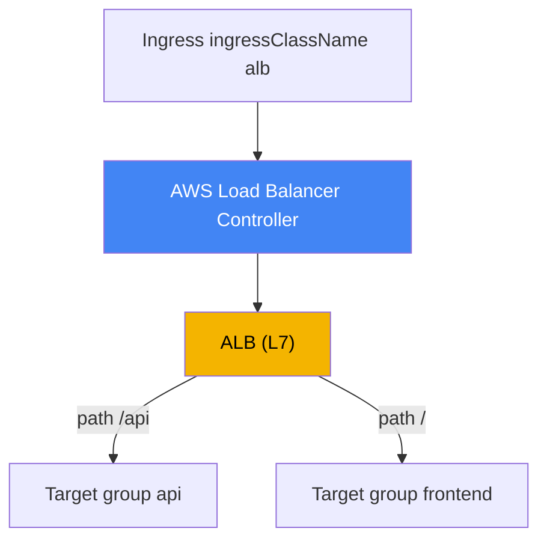
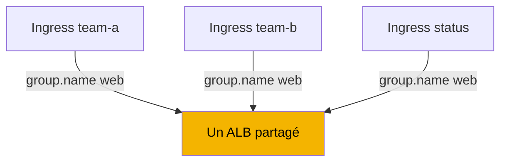
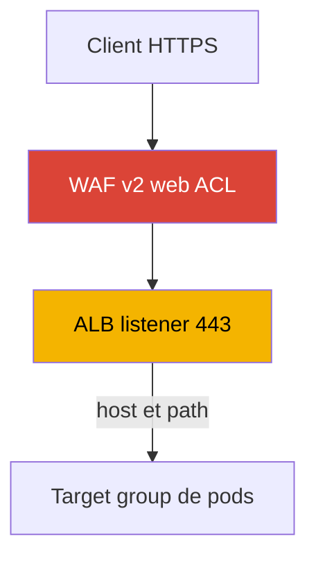

[Русская версия](ru.md) · [Eng version](en.md) · [Versión en español](es.md) · [Deutsche Version](de.md) · [ქართული ვერსია](ge.md) · [繁體中文版](tw.md) · [日本語版](jp.md)
# Chapitre 27. Ingress via ALB : target-type, annotations, TLS et ACM, WAF

> **La suite.** Le chapitre 26 a montré l'équilibrage L4 : un Service de type LoadBalancer et un Network
> Load Balancer via AWS Load Balancer Controller. Ici, c'est le même contrôleur, mais au niveau L7 :
> à partir d'un Ingress, il crée un Application Load Balancer avec routage par host et path, terminaison TLS
> et protection WAF. NLB et le Service de type LoadBalancer restent au chapitre 26, auquel nous renvoyons.
> Gateway API et VPC Lattice sont au chapitre 28, external-dns, Route 53 et cert-manager au chapitre 29. La
> manière dont un pod reçoit une IP dans le VPC (VPC CNI) est expliquée au chapitre 8, et le rôle du
> contrôleur via IRSA ou Pod Identity aux chapitres 16-17. Nous renvoyons à ces sujets sans les répéter.

## 27.1. « Cinq services, cinq équilibreurs et aucun endroit où attacher le certificat »

Une équipe publie une application web composée de plusieurs services : frontend, API, page
d'état. Avec la méthode habituelle du chapitre 26, chaque service reçoit son propre Service de type
LoadBalancer, et donc son NLB distinct :

```bash
kubectl get svc
# NAME       TYPE           EXTERNAL-IP                              PORT(S)
# frontend   LoadBalancer   a1b2...elb.eu-central-1.amazonaws.com    80:31111/TCP
# api        LoadBalancer   c3d4...elb.eu-central-1.amazonaws.com    80:31222/TCP
# status     LoadBalancer   e5f6...elb.eu-central-1.amazonaws.com    80:31333/TCP
```

Trois services, trois équilibreurs, trois noms DNS, trois factures pour le même site, et chaque
nouveau service en ajoute encore un. Mais le problème ne se limite pas au nombre d'équilibreurs.
NLB travaille au niveau L4 : il n'analyse pas HTTP, donc il ne sait pas router par chemin (`/api`
vers un service, `/` vers un autre) ni par host, et il n'existe pas de point d'entrée unique. Surtout,
il est impossible de configurer proprement une terminaison TLS avec redirection de 80 vers 443 sur
NLB : cela exige de comprendre HTTP, ce que L4 ne fait pas.

L'ingénieur a besoin d'autre chose : une entrée unique, derrière laquelle le trafic est réparti vers
différents services selon les règles de host et path, un certificat d'ACM, une redirection automatique
vers HTTPS et un filtrage via WAF. Tout cela relève d'un équilibreur L7. Dans AWS, c'est
Application Load Balancer, et dans Kubernetes il est décrit par l'objet Ingress habituel. Le même
AWS Load Balancer Controller qui créait un NLB à partir d'un Service au chapitre 26 crée l'ALB à
partir de l'Ingress.

## 27.2. ALB via Ingress : IngressClass alb et le même contrôleur

Le mécanisme reprend celui du chapitre 26, mais le point d'entrée est désormais l'objet Ingress. Le
contrôleur surveille les Ingress ayant le bon `ingressClassName` et aligne l'ALB, ses listeners, ses
target groups et ses règles. Pour que l'Ingress soit pris en charge précisément par LBC, le cluster
contient une IngressClass avec le contrôleur `ingress.k8s.aws/alb` :

```yaml
apiVersion: networking.k8s.io/v1
kind: IngressClass
metadata:
  name: alb
spec:
  controller: ingress.k8s.aws/alb
```

On place ensuite `spec.ingressClassName: alb` sur l'Ingress lui-même et on configure le comportement
ALB avec des annotations portant le préfixe `alb.ingress.kubernetes.io/`. Ingress public minimal avec
routage par chemins :

```yaml
apiVersion: networking.k8s.io/v1
kind: Ingress
metadata:
  name: web
  annotations:
    alb.ingress.kubernetes.io/scheme: internet-facing
    alb.ingress.kubernetes.io/target-type: ip
spec:
  ingressClassName: alb
  rules:
    - http:
        paths:
          - path: /api
            pathType: Prefix
            backend:
              service:
                name: api
                port: {number: 80}
          - path: /
            pathType: Prefix
            backend:
              service:
                name: frontend
                port: {number: 80}
```



Comme au chapitre 26, le contrôleur agit au nom d'AWS et requiert un rôle IAM sur son
ServiceAccount (IRSA ou Pod Identity, chapitres 16-17). Les autorisations pour ALB, les target
groups, les listeners, ainsi que WAF et Shield, font partie du même document de politique
`iam_policy.json` installé pour NLB. Aucun contrôleur distinct pour ALB n'est nécessaire : LBC est
unique et traite à la fois les Service et les Ingress.

## 27.3. target-type : instance contre ip

Le choix de la cible pour ALB est le même mécanisme que pour NLB (chapitre 26), donc brièvement.
L'annotation `alb.ingress.kubernetes.io/target-type` accepte `instance` ou `ip`, et vaut
`instance` par défaut.

- **`instance`** - le target group enregistre les nœuds par leur `NodePort` ; le Service doit être
  de type `NodePort` ou `LoadBalancer`. ALB envoie vers le `NodePort`, puis `kube-proxy` achemine
  jusqu'au pod, avec un saut inter-nœud supplémentaire possible.
- **`ip`** - le target group enregistre les IP des pods eux-mêmes. Cela fonctionne grâce à VPC CNI,
  qui attribue au pod une adresse VPC routable (chapitre 8). Moins de sauts, obligatoire sur Fargate.

La pratique est la même que pour NLB : sur EC2 avec VPC CNI, on choisit `ip` par défaut. Pour ALB,
le mode `ip` est aussi requis pour les sticky sessions, l'affinité d'une session avec une cible. La
comparaison complète des chemins de trafic, des sauts et des prérequis réseau est donnée au chapitre
26 et n'est pas dupliquée ici.

| target-type | Ce qui est enregistré | Type de Service | Fargate |
|---|---|---|---|
| `instance` | nœuds par `NodePort` | `NodePort` ou `LoadBalancer` | ne fonctionne pas |
| `ip` | IP des pods directement | n'importe lequel avec VPC CNI | obligatoire |

## 27.4. IngressGroup : un ALB pour plusieurs Ingress

Par défaut, chaque Ingress produit son propre ALB. Cela nous ramène au problème de 27.1, mais au
niveau L7 : dix équipes avec dix Ingress obtiendront dix ALB. La solution est **IngressGroup** :
plusieurs Ingress sont réunis dans un groupe et servis par **un seul** ALB partagé. Le contrôleur
fusionne lui-même les règles de tous les Ingress du groupe dans un ensemble de listeners et de règles.

Le groupe est défini par l'annotation `alb.ingress.kubernetes.io/group.name`. Tous les Ingress ayant
la même valeur appartiennent à un même groupe et partagent l'équilibreur :

```yaml
metadata:
  annotations:
    alb.ingress.kubernetes.io/group.name: my-team.web
    alb.ingress.kubernetes.io/group.order: '10'
```



L'ordre des règles dans le groupe est géré par `alb.ingress.kubernetes.io/group.order`, un entier de
-1000 à 1000 (0 par défaut). Plus le nombre est petit, plus la règle est évaluée tôt ; à valeurs
égales, l'ordre est déterminé par le `namespace/name` de l'Ingress. C'est important lorsque plusieurs
Ingress décrivent des chemins qui se chevauchent et qu'il faut définir une priorité.

IngressGroup comporte un risque important, que le contrôleur qualifie explicitement de security risk.
Tout utilisateur ayant des droits RBAC pour créer un Ingress peut indiquer le **même** `group.name` et
ajouter ses propres règles à l'ALB partagé, ou remplacer celles d'autrui avec une priorité supérieure.
Le nom du groupe constitue donc une frontière de confiance : on ne crée un groupe qu'au sein d'un
cercle d'équipes de confiance, et on limite l'appartenance avec `IngressClassParams`
(`namespaceSelector`) ou en désactivant l'adhésion par annotation avec un drapeau du contrôleur. Ne
mélangez pas les Ingress d'équipes différentes dans un même groupe sans ce contrôle.

## 27.5. TLS et ACM : certificat, redirection, ports

La terminaison TLS est une raison essentielle de placer un ALB devant l'application. L'ALB récupère
le certificat depuis **AWS Certificate Manager (ACM)**, la clé privée ne sort pas du cluster et reste
côté équilibreur. Il existe deux façons de spécifier le certificat.

Explicitement, avec l'annotation `alb.ingress.kubernetes.io/certificate-arn` contenant l'ARN du
certificat dans ACM. Le premier certificat de la liste devient le certificat par défaut, les autres
sont ajoutés à la liste SNI :

```yaml
metadata:
  annotations:
    alb.ingress.kubernetes.io/scheme: internet-facing
    alb.ingress.kubernetes.io/listen-ports: '[{"HTTP": 80}, {"HTTPS": 443}]'
    alb.ingress.kubernetes.io/certificate-arn: arn:aws:acm:eu-central-1:111122223333:certificate/abc
    alb.ingress.kubernetes.io/ssl-redirect: '443'
spec:
  ingressClassName: alb
  tls:
    - hosts: ["app.example.com"]
  rules:
    - host: app.example.com
      http:
        paths:
          - path: /
            pathType: Prefix
            backend:
              service: {name: frontend, port: {number: 80}}
```

La deuxième voie est la **découverte automatique du certificat**. Si `certificate-arn` n'est pas
spécifié, le contrôleur prend les hosts de `spec.tls[].hosts` (et les `host` des règles) et recherche
dans ACM un certificat adapté au nom de domaine. Il n'est alors pas nécessaire de conserver l'ARN dans
le manifeste : le host TLS suffit.

L'annotation `alb.ingress.kubernetes.io/listen-ports` énumère les ports et protocoles des listeners
ALB. Par défaut, c'est `'[{"HTTP": 80}]'`, et lorsqu'un `certificate-arn` est défini, c'est `'[{"HTTPS":
443}]'`. Pour accepter HTTP et HTTPS, les deux ports sont indiqués explicitement, comme dans l'exemple
ci-dessus.

La redirection de HTTP vers HTTPS est activée par l'annotation `alb.ingress.kubernetes.io/ssl-redirect`
avec le port cible comme valeur (généralement `'443'`). Après cela, chaque listener HTTP reçoit une
action par défaut de redirection vers HTTPS, et ses autres règles sont ignorées. Le port de
`ssl-redirect` doit exister dans `listen-ports`. La politique des protocoles et chiffrements est définie
par `alb.ingress.kubernetes.io/ssl-policy` (par défaut `ELBSecurityPolicy-2016-08`).

| Annotation | Rôle | Remarque |
|---|---|---|
| `certificate-arn` | ARN du certificat ACM | le premier est default, les suivants SNI |
| (sans `certificate-arn`) | découverte automatique par host de TLS | ARN inutile dans le manifeste |
| `listen-ports` | ports et protocoles des listeners | HTTP 80 ou HTTPS 443 par défaut |
| `ssl-redirect` | redirection de 80 vers 443 | le port doit être dans `listen-ports` |
| `ssl-policy` | ensemble de protocoles et chiffrements TLS | `ELBSecurityPolicy-2016-08` par défaut |

## 27.6. WAF et Shield : filtrage au niveau L7

Puisqu'ALB comprend HTTP, on peut lui attacher un filtrage de requêtes. Un Web ACL d'**AWS WAF v2**
est associé avec l'annotation `alb.ingress.kubernetes.io/wafv2-acl-arn`, contenant l'ARN de ce web ACL :

```yaml
metadata:
  annotations:
    alb.ingress.kubernetes.io/wafv2-acl-arn: arn:aws:wafv2:eu-central-1:111122223333:regional/webacl/my-acl/abc
```

Le Web ACL avec ses règles (protection contre les injections SQL, rate limiting, filtres géographiques
et IP) s'applique au trafic entrant avant qu'il n'atteigne les pods. Seul Regional WAFv2 est pris en
charge. Si l'annotation est absente, le contrôleur ne touche pas à la configuration WAF ; pour
dissocier un web ACL, définissez explicitement la valeur à `none`. Il existe `waf-acl-id` pour le WAF
Classic obsolète, mais WAFv2 est utilisé pour les nouvelles charges. La protection DDoS est activée par
l'annotation `alb.ingress.kubernetes.io/shield-advanced-protection: 'true'` : elle active AWS Shield
Advanced sur l'équilibreur (un abonnement à Shield Advanced est requis).



Point important concernant IngressGroup de 27.4 : WAF et Shield sont configurés au niveau de l'ALB
entier, donc pour tout le groupe. Dans un ALB partagé, chaque participant peut modifier la protection
de tous par son annotation. C'est pourquoi, dans les groupes multitenants, la configuration WAF est
figée avec `IngressClassParams` (champ `WAFv2ACLArn`), au lieu d'être laissée à la discrétion de chaque
Ingress.

## 27.7. Routage : règles, actions, health check

Le routage ALB de base est décrit avec les champs standards d'Ingress : `host`, `path` et `pathType`
(`Prefix`, `Exact`, `ImplementationSpecific`). Cela suffit pour « vers le bon service selon le host et
le chemin ». Des annotations existent pour des scénarios plus complexes.

**Actions personnalisées** - `alb.ingress.kubernetes.io/actions.${action-name}`. Le nom de l'action
est utilisé comme `service.name` dans la règle, et `port` est défini à `use-annotation`. Elles décrivent
ce qui n'existe pas dans l'Ingress standard :

- `redirect` - rediriger vers une autre URL ou un autre host ;
- `fixed-response` - renvoyer une réponse fixe (par exemple 503 pour une page de maintenance) ;
- `forward` - transférer vers plusieurs target groups avec des poids (weighted routing) et une
  configuration d'affinité de session.

**Conditions supplémentaires** - `alb.ingress.kubernetes.io/conditions.${conditions-name}` - ajoutent
à une règle des vérifications au-delà de host et path : en-tête HTTP (`http-header`), méthode
(`http-request-method`), query string (`query-string`) ou IP source (`source-ip`).

Exemple : une page de maintenance avec une réponse fixe. L'action est définie par annotation, puis la
règle y fait référence avec `service.name` et `port: use-annotation` :

```yaml
metadata:
  annotations:
    alb.ingress.kubernetes.io/actions.maintenance: >
      {"type":"fixed-response","fixedResponseConfig":
      {"contentType":"text/plain","statusCode":"503","messageBody":"under maintenance"}}
# dans rules: backend.service.name: maintenance, port.name: use-annotation
```

Les **health checks** des target groups se configurent avec la famille d'annotations `healthcheck-*` :
`healthcheck-protocol` (`HTTP` par défaut), `healthcheck-port` (`traffic-port`), `healthcheck-path`
(`/`), `healthcheck-interval-seconds` (`15`), `healthcheck-timeout-seconds` (`5`),
`healthy-threshold-count` et `unhealthy-threshold-count` (`2`), `success-codes` (`200`). Les valeurs
par défaut sont fixées par le contrôleur et remplacées si nécessaire.

Le **protocole vers le backend** pour les charges HTTP est précisé par
`alb.ingress.kubernetes.io/backend-protocol-version` : `HTTP1` (par défaut), `HTTP2` ou `GRPC`. La
valeur ne s'applique que lorsque le protocole backend est HTTP ou HTTPS et modifie l'application
protocol du target group. Pour un service gRPC, utilisez `GRPC` : ALB proxifie alors les appels gRPC
sur HTTP/2 jusqu'aux pods ; pour un backend HTTP/2 ordinaire, utilisez `HTTP2`. Sans cela, ALB
communique avec les cibles en HTTP/1.1 et gRPC ne passe pas :

```yaml
metadata:
  annotations:
    alb.ingress.kubernetes.io/backend-protocol-version: GRPC
```

Le **scheme** de l'équilibreur est défini par `alb.ingress.kubernetes.io/scheme` : `internal` (par
défaut) ou `internet-facing`. Comme avec NLB, un ALB public n'est créé qu'avec `internet-facing`
explicite. Changer le scheme sur un Ingress actif n'est pas gratuit : ALB ne peut pas être basculé sur
place, le contrôleur crée un nouvel équilibreur, et cela doit être planifié comme une migration de
trafic.

L'**authentification** est intégrée à ALB : `alb.ingress.kubernetes.io/auth-type` avec la valeur
`cognito` ou `oidc` délègue la vérification de l'utilisateur à Amazon Cognito ou à un fournisseur OIDC
externe (`auth-idp-cognito`, `auth-idp-oidc`). Cela fonctionne uniquement sur les listeners HTTPS. Il
est pratique de protéger un panneau interne par connexion sans modifier l'application elle-même.

## 27.8. ALB (Ingress) contre NLB (Service) : quand utiliser quoi

Les deux équilibreurs sont créés par un même contrôleur ; le choix dépend du niveau du modèle OSI et
du type d'objet Kubernetes. NLB est détaillé au chapitre 26 ; voici la distinction finale.

| Critère | ALB (Ingress) | NLB (Service type LoadBalancer) |
|---|---|---|
| Niveau | L7 (HTTP/HTTPS) | L4 (TCP/UDP) |
| Objet Kubernetes | Ingress | Service |
| Routage par host et path | oui | non |
| Terminaison TLS | ACM sur le listener | ACM, mais sans logique HTTP |
| Redirection HTTPS, WAF, OIDC | oui | non |
| Un LB pour plusieurs services | oui, IngressGroup | non, un Service - un NLB |
| UDP, IP statiques | non | oui |
| Préfixe des annotations | `alb.ingress.kubernetes.io/` | `service.beta.kubernetes.io/aws-load-balancer-` |

Règle générale : routage HTTP, TLS avec redirection, WAF et point d'entrée unique, utilisez ALB via
Ingress ; L4 pur, UDP, IP statiques ou débit maximal, utilisez NLB via Service (chapitre 26).

## 27.9. Utilisation en production

- **IngressGroup au lieu d'un ALB par Ingress.** Les services d'une même application ou équipe sont
  réunis dans un groupe avec `group.name` : une entrée unique et moins d'équilibreurs ; limitez
  l'appartenance en gardant à l'esprit le security risk d'un ALB partagé.
- **TLS via ACM avec découverte automatique.** Conservez le certificat dans ACM et faites reposer
  l'Ingress sur la découverte automatique par le host de `spec.tls`, sans disperser les ARN dans les
  manifestes ; activez la redirection HTTPS avec `ssl-redirect`.
- **Définissez `scheme` et `target-type` consciemment.** Un ALB public doit utiliser
  `internet-facing` explicitement ; sur EC2 avec VPC CNI, choisissez `target-type: ip` par défaut.
- **WAF au périmètre.** Attachez un web ACL WAFv2 devant les ALB publics et, dans les groupes
  multitenants, figez-le avec `IngressClassParams` afin qu'un participant ne puisse pas retirer la
  protection.
- **Ne modifiez pas le scheme ni le nom du LB à chaud.** Un changement de `scheme` recrée l'ALB ;
  concevez ces paramètres à l'avance et modifiez-les comme une migration de trafic.

## 27.10. Mini-glossaire

- **Application Load Balancer (ALB)** - équilibreur L7 (HTTP/HTTPS) avec routage par host et path,
  terminaison TLS, WAF et authentification ; dans EKS, LBC le crée à partir d'un Ingress.
- **IngressClass alb** - classe avec le contrôleur `ingress.k8s.aws/alb` ; un Ingress ayant
  `ingressClassName: alb` est traité par AWS Load Balancer Controller.
- **IngressGroup** - rassemble plusieurs Ingress ayant le même `group.name` dans un ALB partagé ;
  `group.order` définit la priorité des règles.
- **target-type** - type de cible ALB : `instance` (nœuds par `NodePort`) ou `ip` (IP des pods,
  nécessite VPC CNI) ; détaillé au chapitre 26.
- **ACM (AWS Certificate Manager)** - source des certificats TLS pour le listener ALB ; la clé ne
  quitte pas l'équilibreur.
- **ssl-redirect** - annotation qui active une redirection HTTP vers HTTPS vers le port de listener
  indiqué.
- **wafv2-acl-arn** - annotation qui attache un Web ACL AWS WAF v2 à ALB pour filtrer les requêtes.
- **actions / conditions** - annotations d'actions personnalisées (redirect, fixed-response, weighted
  forward) et de conditions de routage supplémentaires (en-têtes, méthode, query, IP source).
- **backend-protocol-version** - application protocol du target group : `HTTP1`, `HTTP2` ou `GRPC` ;
  requis pour qu'ALB proxifie gRPC et HTTP/2 vers les pods, plutôt qu'en HTTP/1.1.

## 27.11. Bilan du chapitre

- Plusieurs Service de type LoadBalancer donnent un NLB par service, ne savent pas router HTTP par
  host et path et n'offrent pas de terminaison TLS avec redirection ; pour L7, il faut un ALB via
  Ingress.
- Le même AWS Load Balancer Controller (chapitre 26) crée l'ALB à partir d'un Ingress avec
  `ingressClassName: alb` (IngressClass ayant le contrôleur `ingress.k8s.aws/alb`) ; les annotations
  `alb.ingress.kubernetes.io/` définissent le comportement. Le contrôleur nécessite un rôle IAM
  (chapitres 16-17).
- `target-type` `instance` contre `ip` est le même mécanisme que pour NLB (chapitre 26) : `ip` est le
  choix par défaut sur EC2 avec VPC CNI, obligatoire sur Fargate et pour les sticky sessions.
- IngressGroup (`group.name`) réunit plusieurs Ingress dans un ALB, `group.order` fixe la priorité
  des règles ; un ALB partagé représente un security risk, il faut limiter l'appartenance.
- TLS se termine sur ALB avec un certificat ACM : `certificate-arn` ou découverte automatique par le
  host de `spec.tls` ; `ssl-redirect` active la redirection de 80 vers 443, `listen-ports` définit les
  listeners.
- WAF s'attache avec `wafv2-acl-arn`, Shield Advanced avec `shield-advanced-protection` ; dans un
  groupe partagé, la protection est figée via `IngressClassParams`.
- Le routage est décrit par les règles Ingress, et les scénarios complexes par les annotations
  `actions.*` (redirect, fixed-response, forward pondéré) et `conditions.*` ; les health checks
  utilisent `healthcheck-*` ; l'authentification utilise `auth-type` (Cognito ou OIDC) sur HTTPS.
  Pour gRPC et HTTP/2 vers le backend, définissez `backend-protocol-version` (`GRPC` ou `HTTP2`).

## 27.12. Utilité dans le travail réel

En astreinte, les incidents L7 avec ALB se ramènent à quelques causes. Si Ingress ne crée pas d'ALB et
n'a pas d'adresse, vérifiez que `ingressClassName` est le bon, que le contrôleur est installé et que
son rôle a les droits (`AccessDenied` dans les logs), comme pour NLB au chapitre 26. Si les cibles sont
`unhealthy`, examinez `healthcheck-*` (protocole, chemin, codes) et l'accessibilité du port du pod en
mode `ip`. Si le client reçoit le mauvais service ou une 404, examinez l'ordre des règles,
`group.order` dans IngressGroup et les chevauchements de chemins entre les Ingress de différentes
équipes dans le groupe partagé. En cas d'erreurs TLS, vérifiez que le certificat a été trouvé (ARN ou
découverte automatique à partir du host de `spec.tls`) et que HTTPS est présent dans `listen-ports`.

Lors de la planification, prenez à l'avance trois décisions : le scheme (`internal` si l'entrée n'est
pas exposée à l'extérieur), le target-type (`ip` par défaut sur EC2) et les frontières d'IngressGroup :
quelles équipes partagent l'ALB et qui est responsable de WAF. N'oubliez pas le caractère non
réversible : changer `scheme` recrée l'ALB ; ces éléments doivent donc être conçus, et non basculés
sur du trafic actif.

## 27.13. Questions d'auto-évaluation

1. Pourquoi plusieurs Service de type LoadBalancer constituent-ils une mauvaise façon de publier un même site web ?
2. Que ne sait précisément pas faire NLB (L4), ce qui conduit à choisir ALB (L7) pour un site HTTP ?
3. Comment un Ingress est-il attribué au contrôleur LBC et quel contrôleur est indiqué dans IngressClass alb ?
4. Un contrôleur distinct est-il nécessaire pour ALB si LBC pour NLB (chapitre 26) est déjà installé dans le cluster ?
5. Quelle différence entre `target-type: instance` et `ip`, et pourquoi `ip` est-il nécessaire pour les sticky sessions ?
6. Que fait IngressGroup et comment `group.name` et `group.order` influent-ils sur l'ALB partagé ?
7. Quel est le security risk d'un ALB partagé dans IngressGroup et comment le limiter ?
8. Comment définir un certificat ALB avec ACM et comment fonctionne la découverte automatique par le host de `spec.tls` ?
9. Que font `ssl-redirect` et `listen-ports` et quel lien existe entre eux ?
10. Comment attacher un web ACL WAFv2 à ALB et pourquoi le figer via IngressClassParams dans un groupe ?
11. À quoi servent les annotations `actions.*` et `conditions.*` et quel est leur lien avec les règles ?
12. Pourquoi faut-il planifier un changement de `scheme` sur un Ingress actif comme une migration de trafic ?
13. Quand choisir ALB via Ingress et quand NLB via Service (chapitre 26) ?
14. Pourquoi `backend-protocol-version` est-il nécessaire et quelle valeur utiliser pour un backend gRPC ?

## Pratique

Le laboratoire du cours pour ce sujet : [lab 109 - Ingress via ALB avec un certificat ACM, external-dns et Route
53](../../labs/109/README_FR.MD). En plus de celui-ci, vérifiez tout sur un cluster actif. Le contrôleur
est le même qu'au chapitre 26 : assurez-vous d'abord qu'il est sain et consultez l'IngressClass
disponible :

```bash
kubectl get deploy -n kube-system aws-load-balancer-controller
kubectl get ingressclass
kubectl get ingressclass alb -o yaml   # controller doit être ingress.k8s.aws/alb
```

Créez un Ingress avec `ingressClassName: alb`, les annotations
`alb.ingress.kubernetes.io/scheme: internal` et `alb.ingress.kubernetes.io/target-type: ip`, et deux
règles par path vers des services différents. Attendez l'adresse (`kubectl get ingress web -w`) et
trouvez l'ALB côté AWS : `aws elbv2 describe-load-balancers` affiche l'équilibreur et son `Type`
(`application`) ainsi que son `Scheme`, `aws elbv2 describe-listeners --load-balancer-arn <arn>`
affiche les listeners et les ports, `aws elbv2 describe-rules --listener-arn <arn>` les règles de
routage par chemins, et `aws elbv2 describe-target-health --target-group-arn <arn>` ce qui est
enregistré. En mode `ip`, les cibles seront les IP des pods.

Ajoutez ensuite TLS : créez un certificat dans ACM, indiquez `certificate-arn` (ou vérifiez la
découverte automatique avec le host de `spec.tls`), ajoutez `listen-ports` avec HTTP et HTTPS et
`ssl-redirect: '443'`, puis vérifiez qu'un listener HTTPS est apparu et qu'une requête HTTP est
redirigée. Enfin, réunissez deux Ingress dans un groupe par l'annotation `group.name` et assurez-vous
qu'il n'y a plus qu'un ALB pour les deux. Consultez les logs du contrôleur comme au chapitre 26 :
`kubectl logs -n kube-system deploy/aws-load-balancer-controller`.

---
[Table des matières](../README_FR.md) · [Chapitre 26](../26/fr.md) · [Chapitre 28](../28/fr.md)
