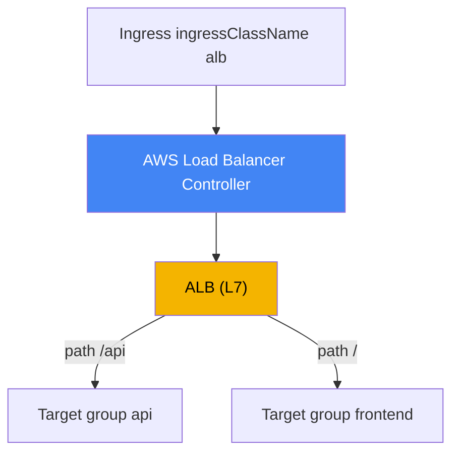
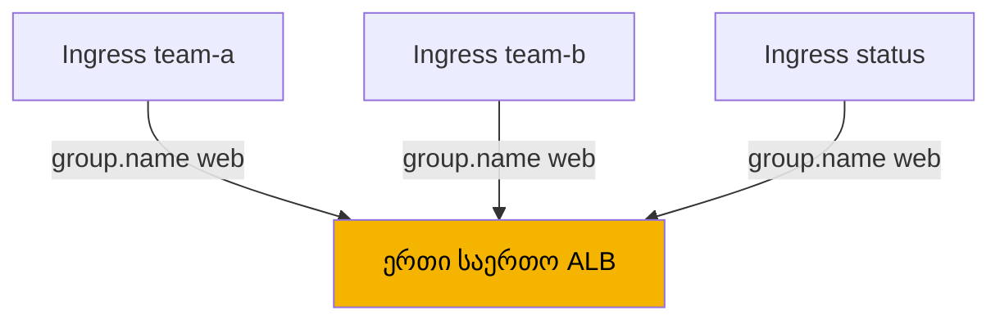
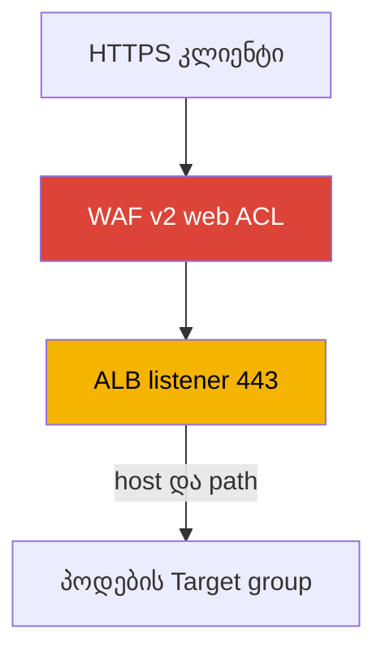

[Русская версия](ru.md) · [Eng version](en.md) · [Versión en español](es.md) · [Version française](fr.md) · [Deutsche Version](de.md) · [繁體中文版](tw.md) · [日本語版](jp.md)
# თავი 27. Ingress ALB-ის მეშვეობით: target-type, ანოტაციები, TLS და ACM, WAF

> **რა არის შემდეგ.** 26-ე თავმა L4 ბალანსირება აჩვენა: LoadBalancer ტიპის Service და Network
> Load Balancer AWS Load Balancer Controller-ის მეშვეობით. აქ იგივე კონტროლერია, მაგრამ L7 დონე:
> Ingress-იდან ის ქმნის Application Load Balancer-ს host-ისა და path-ის მიხედვით მარშრუტიზაციით,
> TLS-ის ტერმინაციითა და WAF-ის დაცვით. NLB და LoadBalancer ტიპის Service 26-ე თავში რჩება და
> სწორედ მას მივუთითებთ. Gateway API და VPC Lattice განხილულია 28-ე თავში, external-dns, Route 53
> და cert-manager კი 29-ე თავში. როგორ იღებს პოდი IP-ს VPC-ში (VPC CNI), განხილულია მე-8 თავში,
> ხოლო კონტროლერის როლი IRSA-ს ან Pod Identity-ის მეშვეობით მე-16-17 თავებში. ამ თემებს მხოლოდ
> მივუთითებთ და აღარ გავიმეორებთ.

## 27.1. „ხუთი სერვისი - ხუთი ბალანსირებელი და სერტიფიკატის მისაბმელი ადგილი არსად არის“

გუნდი გარეთ აქვეყნებს რამდენიმე სერვისისგან შემდგარ ვებ-აპლიკაციას: frontend-ს, API-სა და სტატუსის
გვერდს. 26-ე თავში განხილული ჩვეული გზით თითოეული სერვისი საკუთარ LoadBalancer ტიპის Service-ს,
შესაბამისად კი ცალკე NLB-ს იღებს:

```bash
kubectl get svc
# NAME       TYPE           EXTERNAL-IP                              PORT(S)
# frontend   LoadBalancer   a1b2...elb.eu-central-1.amazonaws.com    80:31111/TCP
# api        LoadBalancer   c3d4...elb.eu-central-1.amazonaws.com    80:31222/TCP
# status     LoadBalancer   e5f6...elb.eu-central-1.amazonaws.com    80:31333/TCP
```

სამი სერვისი ნიშნავს სამ ბალანსირებელს, სამ DNS სახელსა და ერთი და იმავე საიტის სამ ანგარიშს,
ხოლო ყოველი ახალი სერვისი კიდევ ერთს ამატებს. თუმცა პრობლემა მხოლოდ ბალანსირებლების რაოდენობა არ
არის. NLB L4 დონეზე მუშაობს: ის HTTP-ს არ აანალიზებს, ამიტომ არ შეუძლია path-ის მიხედვით (`/api`
ერთ სერვისზე, `/` მეორეზე) და host-ის მიხედვით მარშრუტიზაცია, ასევე არ არსებობს ერთიანი შესვლის
წერტილი. და რაც მთავარია: NLB-ზე TLS-ის ტერმინაციას 80-დან 443-ზე redirect-ით გამართულად ვერ
დააკონფიგურირებთ, რადგან ამისთვის HTTP-ის გაგებაა საჭირო, L4-ს კი ის არ ესმის.

ინჟინერს სხვა რამ სჭირდება: ერთი შესასვლელი, რომლის უკან ტრაფიკი host-ისა და path-ის წესებით
სხვადასხვა სერვისზე ნაწილდება, ACM-ის სერტიფიკატი, HTTPS-ზე ავტომატური redirect და WAF-ის
მეშვეობით ფილტრაცია. ეს ყველაფერი L7 ბალანსირებლის საქმეა. AWS-ში ეს არის Application Load
Balancer, Kubernetes-ში კი მას ჩვეული Ingress ობიექტით აღწერენ. Ingress-იდან ALB-ს იგივე AWS Load
Balancer Controller ქმნის, რომელმაც 26-ე თავში Service-იდან NLB შექმნა.

## 27.2. ALB Ingress-ის მეშვეობით: IngressClass alb და იგივე კონტროლერი

მექანიზმი 26-ე თავს იმეორებს, თუმცა შესვლის წერტილი ახლა Ingress ობიექტია. კონტროლერი შესაბამისი
`ingressClassName`-ის მქონე Ingress-ს აკვირდება და ALB-ს, მის listener-ებს, ტარგეტ-ჯგუფებსა და
წესებს მითითებულ მდგომარეობასთან შესაბამისობაში მოჰყავს. იმისთვის, რომ Ingress სწორედ LBC-ს
ერგოს, კლასტერში არსებობს IngressClass კონტროლერით `ingress.k8s.aws/alb`:

```yaml
apiVersion: networking.k8s.io/v1
kind: IngressClass
metadata:
  name: alb
spec:
  controller: ingress.k8s.aws/alb
```

შემდეგ თავად Ingress-ზე აყენებენ `spec.ingressClassName: alb`-ს და ALB-ის ქცევას
`alb.ingress.kubernetes.io/` პრეფიქსის მქონე ანოტაციებით აკონფიგურირებენ. მინიმალური საჯარო
Ingress path-ების მიხედვით მარშრუტიზაციით:

```yaml
apiVersion: networking.k8s.io/v1
kind: Ingress
metadata:
  name: web
  annotations:
    alb.ingress.kubernetes.io/scheme: internet-facing
    alb.ingress.kubernetes.io/target-type: ip
spec:
  ingressClassName: alb
  rules:
    - http:
        paths:
          - path: /api
            pathType: Prefix
            backend:
              service:
                name: api
                port: {number: 80}
          - path: /
            pathType: Prefix
            backend:
              service:
                name: frontend
                port: {number: 80}
```



როგორც 26-ე თავში, კონტროლერი AWS-ის სახელით მუშაობს და თავის ServiceAccount-ზე IAM როლს
მოითხოვს (IRSA ან Pod Identity, თავები 16-17). ALB-ის, ტარგეტ-ჯგუფების, listener-ების, ასევე WAF-ისა
და Shield-ის უფლებები იმავე `iam_policy.json` პოლიტიკის დოკუმენტში შედის, რომელიც NLB-სთვის
დაყენდა. ALB-სთვის ცალკე კონტროლერი საჭირო არ არის: LBC ერთია და Service-საც და Ingress-საც
ამუშავებს.

## 27.3. target-type: instance ip-ის წინააღმდეგ

ALB-სთვის ტარგეტის არჩევა იგივე მექანიზმია, რაც NLB-ს შემთხვევაში (თავი 26), ამიტომ მოკლედ
განვიხილავთ. ანოტაცია `alb.ingress.kubernetes.io/target-type` იღებს `instance` ან `ip`
მნიშვნელობას, ნაგულისხმევი კი `instance` არის.

- **`instance`** - ტარგეტ-ჯგუფი ნოდებს მათი `NodePort`-ით არეგისტრირებს; Service უნდა იყოს
  `NodePort` ან `LoadBalancer` ტიპის. ALB ტრაფიკს `NodePort`-ზე აგზავნის, შემდეგ `kube-proxy` მას
  პოდამდე მიიტანს, რის გამოც შესაძლებელია ზედმეტი hop ნოდებს შორის.
- **`ip`** - ტარგეტ-ჯგუფი თავად პოდების IP-ებს არეგისტრირებს. მუშაობს VPC CNI-ის წყალობით,
  რომელიც პოდს VPC-ში მარშრუტიზებად მისამართს აძლევს (თავი 8). აქვს ნაკლები hop და სავალდებულოა
  Fargate-ზე.

პრაქტიკა იგივეა, რაც NLB-სთვის: EC2-ზე VPC CNI-ით ნაგულისხმევად `ip`-ს ირჩევენ. ALB-ზე `ip`
რეჟიმი დამატებით საჭიროა sticky sessions-ისთვის, ანუ სესიის ტარგეტზე მისამაგრებლად. ტრაფიკის
გზების, hop-ებისა და ქსელური მოთხოვნების სრული შედარება მოცემულია 26-ე თავში და აქ აღარ
მეორდება.

| target-type | რა რეგისტრირდება | Service-ის ტიპი | Fargate |
|---|---|---|---|
| `instance` | ნოდები `NodePort`-ით | `NodePort` ან `LoadBalancer` | არ მუშაობს |
| `ip` | პირდაპირ პოდების IP-ები | ნებისმიერი VPC CNI-ით | სავალდებულოა |

## 27.4. IngressGroup: ერთი ALB რამდენიმე Ingress-ისთვის

ნაგულისხმევად თითოეული Ingress საკუთარ ALB-ს წარმოქმნის. ამით 27.1-ში აღწერილ პრობლემას ვუბრუნდებით,
ოღონდ L7 დონეზე: ათი გუნდი ათი Ingress-ით ათ ALB-ს მიიღებს. გამოსავალია **IngressGroup**:
რამდენიმე Ingress ერთ ჯგუფში ერთიანდება და მათ **ერთი** საერთო ALB ემსახურება. კონტროლერი ჯგუფის
ყველა Ingress-ის წესს listener-ებისა და წესების ერთ ნაკრებში თავად აერთიანებს.

ჯგუფი `alb.ingress.kubernetes.io/group.name` ანოტაციით განისაზღვრება. ერთნაირი მნიშვნელობის მქონე
ყველა Ingress ერთ ჯგუფში ხვდება და ბალანსირებელს იზიარებს:

```yaml
metadata:
  annotations:
    alb.ingress.kubernetes.io/group.name: my-team.web
    alb.ingress.kubernetes.io/group.order: '10'
```



ჯგუფის შიგნით წესების თანმიმდევრობა `alb.ingress.kubernetes.io/group.order`-ით იმართება, რომელიც
-1000-დან 1000-მდე მთელ რიცხვს იღებს (ნაგულისხმევად 0). რაც ნაკლებია რიცხვი, მით ადრე მოწმდება
წესი; თანაბარი მნიშვნელობებისას რიგს Ingress-ის `namespace/name` განსაზღვრავს. ეს მნიშვნელოვანია,
როდესაც რამდენიმე Ingress გადამკვეთ path-ებს აღწერს და პრიორიტეტის განსაზღვრაა საჭირო.

IngressGroup-ს მნიშვნელოვანი რისკი აქვს, რომელსაც კონტროლერი პირდაპირ security risk-ად მონიშნავს.
ნებისმიერ მომხმარებელს, რომელსაც Ingress-ის შექმნის RBAC უფლება აქვს, შეუძლია **იგივე**
`group.name` მიუთითოს და საერთო ALB-ს საკუთარი წესები დაუმატოს ან უფრო მაღალი პრიორიტეტით სხვისი
წესები გადაფაროს. ამიტომ ჯგუფის სახელი ნდობის საზღვარია: ჯგუფს მხოლოდ სანდო გუნდების წრეში ქმნიან,
წევრობას კი `IngressClassParams`-ის (namespaceSelector) მეშვეობით ზღუდავენ ან ანოტაციით მიერთებას
კონტროლერის flag-ით თიშავენ. ასეთი კონტროლის გარეშე სხვადასხვა გუნდის Ingress-ები ერთ ჯგუფში არ
გააერთიანოთ.

## 27.5. TLS და ACM: სერტიფიკატი, redirect, პორტები

TLS-ის ტერმინაცია აპლიკაციის წინ ALB-ის დაყენების მთავარი მიზეზია. ALB სერტიფიკატს **AWS
Certificate Manager-იდან (ACM)** იღებს, პირადი გასაღები კლასტერიდან არ გამოდის და ბალანსირებლის
მხარეს ინახება. სერტიფიკატის განსაზღვრა ორი გზით შეიძლება.

პირდაპირ, `alb.ingress.kubernetes.io/certificate-arn` ანოტაციით და ACM-ის სერტიფიკატის ARN-ით.
სიაში პირველი სერტიფიკატი ნაგულისხმევ სერტიფიკატად იქცევა, დანარჩენები კი SNI სიაში ხვდება:

```yaml
metadata:
  annotations:
    alb.ingress.kubernetes.io/scheme: internet-facing
    alb.ingress.kubernetes.io/listen-ports: '[{"HTTP": 80}, {"HTTPS": 443}]'
    alb.ingress.kubernetes.io/certificate-arn: arn:aws:acm:eu-central-1:111122223333:certificate/abc
    alb.ingress.kubernetes.io/ssl-redirect: '443'
spec:
  ingressClassName: alb
  tls:
    - hosts: ["app.example.com"]
  rules:
    - host: app.example.com
      http:
        paths:
          - path: /
            pathType: Prefix
            backend:
              service: {name: frontend, port: {number: 80}}
```

მეორე გზაა **სერტიფიკატის ავტომატური აღმოჩენა**. თუ `certificate-arn` მითითებული არ არის,
კონტროლერი host-ებს `spec.tls[].hosts`-იდან (და წესების `host`-იდან) იღებს და ACM-ში დომენის
სახელის შესაბამის სერტიფიკატს ეძებს. ამ შემთხვევაში ARN-ის მანიფესტში შენახვა საჭირო არ არის,
საკმარისია TLS host.

ანოტაცია `alb.ingress.kubernetes.io/listen-ports` ALB-ის listener-ების პორტებსა და პროტოკოლებს
ჩამოთვლის. ნაგულისხმევად ეს არის `'[{"HTTP": 80}]'`, ხოლო თუ `certificate-arn` განსაზღვრულია,
`'[{"HTTPS": 443}]'`. HTTP-ისა და HTTPS-ის ერთდროულად მისაღებად ორივე პორტს პირდაპირ უთითებენ,
როგორც ზემოთ მოცემულ მაგალითში.

HTTP-დან HTTPS-ზე redirect ირთვება `alb.ingress.kubernetes.io/ssl-redirect` ანოტაციით, რომლის
მნიშვნელობაც სამიზნე პორტია (ჩვეულებრივ `'443'`). ამის შემდეგ ყოველი HTTP-listener ნაგულისხმევ
ქმედებად HTTPS-ზე redirect-ს იღებს, მისი დანარჩენი წესები კი იგნორირდება. `ssl-redirect`-ში
მითითებული პორტი `listen-ports`-ში უნდა არსებობდეს. პროტოკოლებისა და შიფრების პოლიტიკა
`alb.ingress.kubernetes.io/ssl-policy`-ით განისაზღვრება (ნაგულისხმევად
`ELBSecurityPolicy-2016-08`).

| ანოტაცია | დანიშნულება | შენიშვნა |
|---|---|---|
| `certificate-arn` | ACM-ის სერტიფიკატის ARN | პირველი არის default, დანარჩენი SNI |
| (`certificate-arn`-ის გარეშე) | ავტომატური აღმოჩენა TLS-ის host-ის მიხედვით | ARN მანიფესტში საჭირო არ არის |
| `listen-ports` | listener-ების პორტები და პროტოკოლები | default HTTP 80 ან HTTPS 443 |
| `ssl-redirect` | redirect 80-დან 443-ზე | პორტი `listen-ports`-ში უნდა იყოს |
| `ssl-policy` | TLS პროტოკოლებისა და შიფრების ნაკრები | default `ELBSecurityPolicy-2016-08` |

## 27.6. WAF და Shield: ფილტრაცია L7 დონეზე

რადგან ALB-ს HTTP ესმის, მას მოთხოვნების ფილტრაციაც შეიძლება მიებას. **AWS WAF v2**-ის Web ACL
`alb.ingress.kubernetes.io/wafv2-acl-arn` ანოტაციითა და ამ web ACL-ის ARN-ით მიებმება:

```yaml
metadata:
  annotations:
    alb.ingress.kubernetes.io/wafv2-acl-arn: arn:aws:wafv2:eu-central-1:111122223333:regional/webacl/my-acl/abc
```

წესების მქონე Web ACL (SQL injection-ისგან დაცვა, rate limiting, გეოგრაფიული და IP ფილტრები)
შემავალ ტრაფიკზე მანამდე მოქმედებს, სანამ ის პოდებამდე მივა. მხარდაჭერილია მხოლოდ Regional WAFv2.
თუ ანოტაცია არ არსებობს, კონტროლერი WAF-ის პარამეტრს არ ეხება; web ACL-ის მოსახსნელად მნიშვნელობას
პირდაპირ `none`-ად უთითებენ. მოძველებული WAF Classic-ისთვის არსებობს `waf-acl-id`, თუმცა ახალი
დატვირთვებისთვის WAFv2-ს იყენებენ. DDoS-ისგან დაცვა ირთვება
`alb.ingress.kubernetes.io/shield-advanced-protection: 'true'` ანოტაციით, რომელიც ბალანსირებელზე
AWS Shield Advanced-ს ააქტიურებს (მოითხოვს Shield Advanced-ის გამოწერას).



მნიშვნელოვანია 27.4-ში აღწერილი IngressGroup: WAF და Shield მთელი ALB-ის დონეზე კონფიგურირდება,
შესაბამისად მთელ ჯგუფზე მოქმედებს. საერთო ALB-ში ჯგუფის ნებისმიერ მონაწილეს თავისი ანოტაციით
ყველასთვის დაცვის შეცვლა შეუძლია. ამიტომ მულტიტენანტურ ჯგუფებში WAF-ის კონფიგურაციას ცალკეული
Ingress-ების განკარგულებაში კი არ ტოვებენ, არამედ `IngressClassParams`-ის (`WAFv2ACLArn` ველი)
მეშვეობით აფიქსირებენ.

## 27.7. მარშრუტიზაცია: წესები, ქმედებები, health check

ALB-ის საბაზისო მარშრუტიზაცია Ingress-ის სტანდარტული ველებით აღიწერება: `host`, `path` და
`pathType` (`Prefix`, `Exact`, `ImplementationSpecific`). ეს საკმარისია სცენარისთვის „host-ისა და
path-ის მიხედვით საჭირო სერვისზე“. უფრო რთული სცენარებისთვის ანოტაციები არსებობს.

**მორგებული ქმედებები** - `alb.ingress.kubernetes.io/actions.${action-name}`. ქმედების სახელს წესში
`service.name`-ად უთითებენ, `port`-ს კი `use-annotation` მნიშვნელობას აძლევენ. ასე აღიწერება ის,
რაც სტანდარტულ Ingress-ში არ არსებობს:

- `redirect` - redirect სხვა URL-ზე ან host-ზე;
- `fixed-response` - ფიქსირებული პასუხის დაბრუნება (მაგალითად, 503 ტექნიკური მომსახურების გვერდზე);
- `forward` - რამდენიმე ტარგეტ-ჯგუფზე წონებით forward (weighted routing) და სესიის მიბმის
  პარამეტრებით.

**დამატებითი პირობები** - `alb.ingress.kubernetes.io/conditions.${conditions-name}` - წესს host-ისა
და path-ის გარდა სხვა შემოწმებებს უმატებს: HTTP header-ის (`http-header`), მეთოდის
(`http-request-method`), query სტრიქონის (`query-string`) ან საწყისი IP-ის (`source-ip`) მიხედვით.

მაგალითი: ტექნიკური მომსახურების გვერდი ფიქსირებული პასუხით. ქმედება ანოტაციით განისაზღვრება,
წესში კი მას `service.name`-ისა და `port: use-annotation`-ის მეშვეობით მიმართავენ:

```yaml
metadata:
  annotations:
    alb.ingress.kubernetes.io/actions.maintenance: >
      {"type":"fixed-response","fixedResponseConfig":
      {"contentType":"text/plain","statusCode":"503","messageBody":"under maintenance"}}
# rules-ში: backend.service.name: maintenance, port.name: use-annotation
```

ტარგეტ-ჯგუფების **Health check** `healthcheck-*` ანოტაციების ოჯახით კონფიგურირდება:
`healthcheck-protocol` (ნაგულისხმევად `HTTP`), `healthcheck-port` (`traffic-port`),
`healthcheck-path` (`/`), `healthcheck-interval-seconds` (`15`), `healthcheck-timeout-seconds`
(`5`), `healthy-threshold-count` და `unhealthy-threshold-count` (`2`), `success-codes` (`200`).
ნაგულისხმევი მნიშვნელობები კონტროლერშია განსაზღვრული და საჭიროების შემთხვევაში იცვლება.

HTTP დატვირთვებისთვის **backend-მდე პროტოკოლს** აზუსტებს
`alb.ingress.kubernetes.io/backend-protocol-version`: `HTTP1` (ნაგულისხმევად), `HTTP2` ან `GRPC`.
მნიშვნელობა მხოლოდ HTTP ან HTTPS backend-პროტოკოლის შემთხვევაში მოქმედებს და ტარგეტ-ჯგუფის
application protocol-ს ცვლის. gRPC სერვისისთვის აყენებენ `GRPC`-ს, რის შემდეგაც ALB gRPC
გამოძახებებს HTTP/2-ის მეშვეობით პოდებამდე აპროქსირებს; ჩვეულებრივი HTTP/2 backend-ისთვის იყენებენ
`HTTP2`-ს. ამის გარეშე ALB ტარგეტებს HTTP/1.1-ით უკავშირდება და gRPC არ მუშაობს:

```yaml
metadata:
  annotations:
    alb.ingress.kubernetes.io/backend-protocol-version: GRPC
```

ბალანსირებლის **სქემა** განისაზღვრება `alb.ingress.kubernetes.io/scheme`-ით: `internal`
(ნაგულისხმევად) ან `internet-facing`. NLB-ის მსგავსად, საჯარო ALB მხოლოდ პირდაპირ მითითებული
`internet-facing`-ით იქმნება. მოქმედ Ingress-ზე სქემის შეცვლა უფასო არ არის: ALB-ის ადგილზე
გადართვა შეუძლებელია, კონტროლერი ახალ ბალანსირებელს ქმნის და ეს ტრაფიკის მიგრაციად უნდა
დაიგეგმოს.

ALB-ს ჩაშენებული **ავთენტიფიკაცია** აქვს: `alb.ingress.kubernetes.io/auth-type` მნიშვნელობით
`cognito` ან `oidc` მომხმარებლის შემოწმებას Amazon Cognito-ს ან გარე OIDC პროვაიდერს გადასცემს
(`auth-idp-cognito`, `auth-idp-oidc`). მუშაობს მხოლოდ HTTPS-listener-ებზე. ამ გზით შიდა პანელი
აპლიკაციის შეცვლის გარეშე შეიძლება login-ით დაიხუროს.

## 27.8. ALB (Ingress) NLB-ის (Service) წინააღმდეგ: როდის რომელი

ორივე ბალანსირებელს ერთი კონტროლერი ქმნის, არჩევანს კი OSI მოდელის დონე და Kubernetes ობიექტის
ტიპი განსაზღვრავს. NLB დეტალურად 26-ე თავშია განხილული, აქ მხოლოდ საბოლოო გამიჯვნაა მოცემული.

| კრიტერიუმი | ALB (Ingress) | NLB (Service type LoadBalancer) |
|---|---|---|
| დონე | L7 (HTTP/HTTPS) | L4 (TCP/UDP) |
| Kubernetes ობიექტი | Ingress | Service |
| მარშრუტიზაცია host-ისა და path-ის მიხედვით | დიახ | არა |
| TLS-ის ტერმინაცია | ACM listener-ზე | ACM, მაგრამ HTTP ლოგიკის გარეშე |
| HTTPS-ზე redirect, WAF, OIDC | დიახ | არა |
| ერთი LB მრავალი სერვისისთვის | დიახ, IngressGroup | არა, ერთი Service - ერთი NLB |
| UDP, სტატიკური IP-ები | არა | დიახ |
| ანოტაციების პრეფიქსი | `alb.ingress.kubernetes.io/` | `service.beta.kubernetes.io/aws-load-balancer-` |

უხეში წესი: HTTP მარშრუტიზაცია, TLS redirect-ით, WAF და ერთიანი შესასვლელი ნიშნავს ALB-ს Ingress-ის
მეშვეობით; სუფთა L4, UDP, სტატიკური IP-ები ან მაქსიმალური გამტარუნარიანობა ნიშნავს NLB-ს Service-ის
მეშვეობით (თავი 26).

## 27.9. როგორ იყენებენ ამას production-ში

- **IngressGroup თითოეული Ingress-ისთვის ცალკე ALB-ის ნაცვლად.** ერთი აპლიკაციის ან გუნდის
  სერვისებს `group.name`-ით ერთ ჯგუფში აერთიანებენ, რაც ერთიან შესასვლელსა და ნაკლებ ბალანსირებელს
  იძლევა; საერთო ALB-ის security risk-ის გათვალისწინებით membership-ს ზღუდავენ.
- **TLS ACM-ის მეშვეობით ავტომატური აღმოჩენით.** სერტიფიკატს ACM-ში ინახავენ, Ingress-ში კი
  `spec.tls` host-ის მიხედვით ავტომატურ აღმოჩენას ეყრდნობიან და ARN-ს მანიფესტებში არ ავრცელებენ;
  HTTPS-ზე redirect-ს `ssl-redirect`-ით რთავენ.
- **`scheme` და `target-type` გააზრებულად განისაზღვრება.** საჯარო ALB მხოლოდ პირდაპირ მითითებული
  `internet-facing`-ით იქმნება; EC2-ზე VPC CNI-ით ნაგულისხმევად `target-type: ip` გამოიყენება.
- **WAF პერიმეტრზე.** საჯარო ALB-ების წინ WAFv2 web ACL-ს აბამენ, მულტიტენანტურ ჯგუფებში კი მას
  `IngressClassParams`-ით აფიქსირებენ, რათა ჯგუფის მონაწილემ დაცვა ვერ მოხსნას.
- **სქემასა და LB-ის სახელს მოქმედ სისტემაზე არ ცვლიან.** `scheme`-ის შეცვლა ALB-ს თავიდან ქმნის;
  ასეთ პარამეტრებს წინასწარ აპროექტებენ და ტრაფიკის მიგრაციის სახით ცვლიან.

## 27.10. მინი-ლექსიკონი

- **Application Load Balancer (ALB)** - L7 (HTTP/HTTPS) ბალანსირებელი host-ისა და path-ის
  მიხედვით მარშრუტიზაციით, TLS-ის ტერმინაციით, WAF-ითა და ავთენტიფიკაციით; EKS-ში LBC მას
  Ingress-იდან ქმნის.
- **IngressClass alb** - კლასი კონტროლერით `ingress.k8s.aws/alb`; `ingressClassName: alb`-ის მქონე
  Ingress-ს AWS Load Balancer Controller ამუშავებს.
- **IngressGroup** - რამდენიმე Ingress-ის `group.name`-ით ერთ საერთო ALB-ში გაერთიანება;
  `group.order` წესების პრიორიტეტს განსაზღვრავს.
- **target-type** - ALB ტარგეტის ტიპი: `instance` (ნოდები `NodePort`-ით) ან `ip` (პოდების IP-ები,
  სჭირდება VPC CNI); დეტალურად განხილულია 26-ე თავში.
- **ACM (AWS Certificate Manager)** - ALB-ის listener-ის TLS სერტიფიკატების წყარო; გასაღები
  ბალანსირებელს არ ტოვებს.
- **ssl-redirect** - ანოტაცია, რომელიც HTTP-დან HTTPS-ზე მითითებული listener პორტისკენ redirect-ს
  რთავს.
- **wafv2-acl-arn** - AWS WAF v2-ის Web ACL-ის ALB-სთან მისაბმელი ანოტაცია მოთხოვნების
  გასაფილტრად.
- **actions / conditions** - მორგებული ქმედებების (redirect, fixed-response, weighted forward) და
  მარშრუტიზაციის დამატებითი პირობების (headers, მეთოდი, query, source IP) ანოტაციები.
- **backend-protocol-version** - ტარგეტ-ჯგუფის application protocol: `HTTP1`, `HTTP2` ან `GRPC`;
  საჭიროა, რომ ALB-მ gRPC და HTTP/2 პოდებამდე HTTP/1.1-ის ნაცვლად შესაბამისი პროტოკოლით
  აპროქსიროს.

## 27.11. თავის შეჯამება

- რამდენიმე LoadBalancer ტიპის Service თითო სერვისზე თითო NLB-ს ქმნის, host-ისა და path-ის
  მიხედვით HTTP მარშრუტიზაცია არ შეუძლია და TLS-ის ტერმინაციას redirect-ით ვერ უზრუნველყოფს; L7-სთვის
  საჭიროა ALB Ingress-ის მეშვეობით.
- ALB-ს იგივე AWS Load Balancer Controller (თავი 26) ქმნის `ingressClassName: alb`-ის მქონე
  Ingress-იდან (IngressClass კონტროლერით `ingress.k8s.aws/alb`); ქცევას
  `alb.ingress.kubernetes.io/` ანოტაციები განსაზღვრავს. კონტროლერს IAM როლი სჭირდება (თავები 16-17).
- `target-type` `instance`-სა და `ip`-ს შორის იგივე მექანიზმია, რაც NLB-ს შემთხვევაში (თავი 26):
  EC2-ზე VPC CNI-ით ნაგულისხმევად `ip` გამოიყენება, რომელიც Fargate-სა და sticky sessions-ისთვის
  სავალდებულოა.
- IngressGroup (`group.name`) რამდენიმე Ingress-ს ერთ ALB-ში აერთიანებს, `group.order` კი წესების
  პრიორიტეტს განსაზღვრავს; საერთო ALB security risk-ია, ამიტომ membership-ს ზღუდავენ.
- TLS ALB-ზე ACM-ის სერტიფიკატით ტერმინირდება: `certificate-arn` ან `spec.tls`-ის host-ის მიხედვით
  ავტომატური აღმოჩენა; `ssl-redirect` 80-დან 443-ზე redirect-ს რთავს, `listen-ports` კი listener-ებს
  განსაზღვრავს.
- WAF მიებმება `wafv2-acl-arn`-ით, Shield Advanced კი `shield-advanced-protection`-ით; საერთო ჯგუფში
  დაცვას `IngressClassParams`-ის მეშვეობით აფიქსირებენ.
- მარშრუტიზაცია Ingress-ის წესებით აღიწერება, რთული სცენარები კი `actions.*` (redirect,
  fixed-response, წონიანი forward) და `conditions.*` ანოტაციებით; health check განისაზღვრება
  `healthcheck-*`-ით; ავთენტიფიკაცია HTTPS-ზე `auth-type`-ით (Cognito ან OIDC). gRPC-ისა და HTTP/2-ის
  backend-მდე მისატანად განსაზღვრავენ `backend-protocol-version`-ს (`GRPC` ან `HTTP2`).

## 27.12. როგორ გამოგადგებათ ეს რეალურ სამუშაოში

მორიგეობისას ALB-სთან დაკავშირებული L7 ინციდენტები რამდენიმე ძირითად მიზეზამდე დადის. Ingress ALB-ს
არ ქმნის და მისამართი არ არსებობს: ამოწმებენ, სწორია თუ არა `ingressClassName`, დაყენებულია თუ არა
კონტროლერი და აქვს თუ არა მის როლს უფლებები (ლოგებში `AccessDenied`), როგორც 26-ე თავში NLB-ის
შემთხვევაში. ტარგეტები `unhealthy` მდგომარეობაშია: ამოწმებენ `healthcheck-*` პარამეტრებს
(პროტოკოლი, path, კოდები) და `ip` რეჟიმში პოდის პორტის ხელმისაწვდომობას. კლიენტი არასწორ სერვისს
ან 404-ს იღებს: ამოწმებენ წესების რიგს, IngressGroup-ის შიგნით `group.order`-ს და საერთო ჯგუფში
სხვადასხვა გუნდის Ingress-ების path-ების გადაკვეთას. TLS-ის შეცდომებისას ამოწმებენ, ნაპოვნია თუ არა
სერტიფიკატი (ARN ან `spec.tls`-ის host-ის მიხედვით ავტომატური აღმოჩენა) და არის თუ არა HTTPS
`listen-ports`-ში.

დაგეგმვისას წინასწარ მიიღეთ სამი გადაწყვეტილება: სქემა (`internal`, თუ შესასვლელი გარედან არ უნდა
ჩანდეს), target-type (EC2-ზე ნაგულისხმევად `ip`) და IngressGroup-ის საზღვრები, ანუ რომელი გუნდები
იზიარებენ ALB-ს და ვინ აგებს პასუხს WAF-ზე. გახსოვდეთ შეუქცევადობაც: `scheme`-ის შეცვლა ALB-ს
თავიდან ქმნის, ამიტომ ასეთი საკითხები უნდა დაპროექტდეს და არა მოქმედ ტრაფიკზე გადაირთოს.

## 27.13. თვითშემოწმების კითხვები

1. რატომ არის რამდენიმე LoadBalancer ტიპის Service ერთი ვებსაიტის გამოსაქვეყნებლად ცუდი გზა?
2. კონკრეტულად რა არ შეუძლია NLB-ს (L4), რის გამოც HTTP საიტისთვის ALB-ს (L7) ირჩევენ?
3. როგორ ხვდება Ingress LBC კონტროლერთან და რომელი კონტროლერია მითითებული IngressClass alb-ში?
4. საჭიროა თუ არა ცალკე კონტროლერი ALB-სთვის, თუ კლასტერში NLB-სთვის LBC უკვე დაყენებულია (თავი 26)?
5. რით განსხვავდება `target-type: instance` და `ip` და რატომ არის `ip` საჭირო sticky sessions-ისთვის?
6. რას აკეთებს IngressGroup და როგორ მოქმედებს `group.name` და `group.order` საერთო ALB-ზე?
7. რა security risk აქვს IngressGroup-ის საერთო ALB-ს და როგორ იზღუდება ის?
8. როგორ განისაზღვრება ALB-ის სერტიფიკატი ACM-ის მეშვეობით და როგორ მუშაობს `spec.tls`-ის host-ის
   მიხედვით ავტომატური აღმოჩენა?
9. რას აკეთებს `ssl-redirect` და `listen-ports` და როგორ უკავშირდება ისინი ერთმანეთს?
10. როგორ მიებმება WAFv2 web ACL ALB-ს და რატომ აფიქსირებენ მას ჯგუფში IngressClassParams-ით?
11. რისთვისაა საჭირო `actions.*` და `conditions.*` ანოტაციები და როგორ უკავშირდება ისინი წესებს?
12. რატომ იგეგმება მოქმედ Ingress-ზე `scheme`-ის შეცვლა ტრაფიკის მიგრაციად?
13. როდის ირჩევენ ALB-ს Ingress-ის მეშვეობით და როდის NLB-ს Service-ის მეშვეობით (თავი 26)?
14. რისთვისაა საჭირო `backend-protocol-version` და რა მნიშვნელობას უთითებენ gRPC backend-ისთვის?

## პრაქტიკა

ამ თემის კურსის ლაბა: [ლაბა 109 - Ingress ALB-ის მეშვეობით ACM-ის სერტიფიკატით, external-dns-ითა
და Route 53-ით](../../labs/109/README_GE.MD). დანარჩენი ყველაფერი მოქმედ კლასტერზე მოწმდება.
კონტროლერი იგივეა, რაც 26-ე თავში, ამიტომ ჯერ დარწმუნდით, რომ ის გამართულია, შემდეგ კი ხელმისაწვდომი
IngressClass შეამოწმეთ:

```bash
kubectl get deploy -n kube-system aws-load-balancer-controller
kubectl get ingressclass
kubectl get ingressclass alb -o yaml   # controller უნდა იყოს ingress.k8s.aws/alb
```

შექმენით Ingress `ingressClassName: alb`-ით,
`alb.ingress.kubernetes.io/scheme: internal` და `alb.ingress.kubernetes.io/target-type: ip`
ანოტაციებითა და სხვადასხვა სერვისისკენ მიმართული ორი path წესით. დაელოდეთ მისამართს
(`kubectl get ingress web -w`) და AWS-ის მხრიდან იპოვეთ ALB: `aws elbv2 describe-load-balancers`
აჩვენებს ბალანსირებელს, მის `Type`-ს (`application`) და `Scheme`-ს, `aws elbv2
describe-listeners --load-balancer-arn <arn>` აჩვენებს listener-ებსა და პორტებს, `aws elbv2
describe-rules --listener-arn <arn>` path-ების მიხედვით მარშრუტიზაციის წესებს, ხოლო `aws elbv2
describe-target-health --target-group-arn <arn>` იმას, თუ რა არის რეგისტრირებული. `ip` რეჟიმში
ტარგეტები პოდების IP-ები იქნება.

შემდეგ დაამატეთ TLS: შექმენით სერტიფიკატი ACM-ში, მიუთითეთ `certificate-arn` (ან შეამოწმეთ
ავტომატური აღმოჩენა `spec.tls` host-ის მეშვეობით), დაამატეთ `listen-ports` HTTP-ითა და HTTPS-ით და
`ssl-redirect: '443'`, შემდეგ დარწმუნდით, რომ HTTPS-listener გამოჩნდა და HTTP მოთხოვნა redirect-ს
იღებს. ბოლოს ორი Ingress `group.name` ანოტაციით ერთ ჯგუფში გააერთიანეთ და დარწმუნდით, რომ ორივესთვის
ერთი ALB დარჩა. კონტროლერის ლოგები შეამოწმეთ ისე, როგორც 26-ე თავში:
`kubectl logs -n kube-system deploy/aws-load-balancer-controller`.

---
[სარჩევი](../README_GE.md) · [თავი 26](../26/ge.md) · [თავი 28](../28/ge.md)
