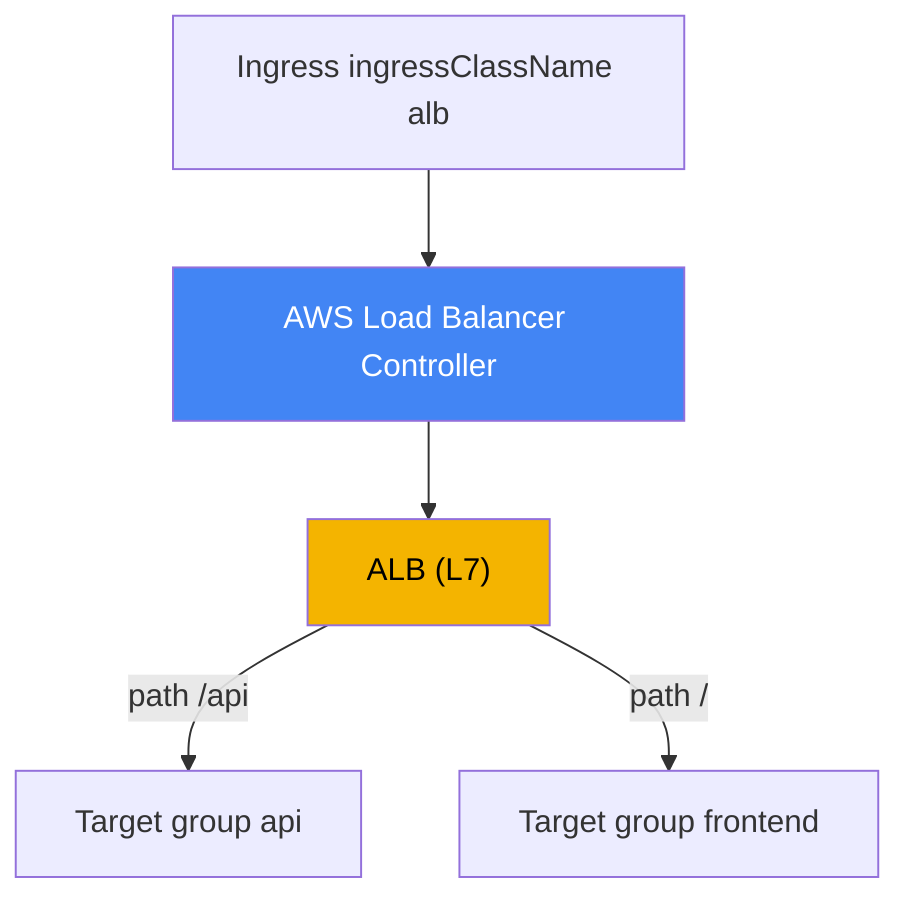
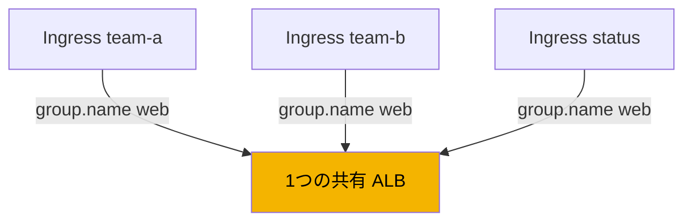
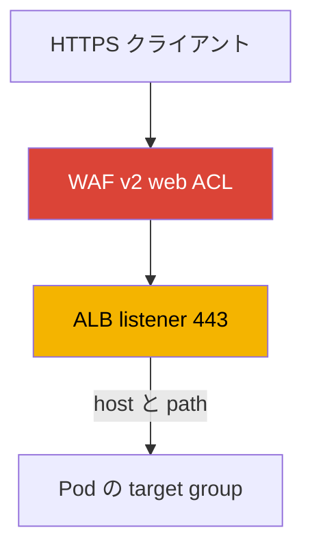

[ロシア語版](ru.md) · [英語版](en.md) · [スペイン語版](es.md) · [フランス語版](fr.md) · [ドイツ語版](de.md) · [ジョージア語版](ge.md) · [繁体字中国語版](tw.md)
# 第27章. ALB 経由の Ingress: target-type、アノテーション、TLS と ACM、WAF

> **次は何か。** 第26章では L4 負荷分散、すなわち AWS Load Balancer Controller による LoadBalancer 型 Service と Network Load Balancer を扱いました。本章でも同じコントローラーを使用しますが、対象は L7 です。Ingress から、host と path によるルーティング、TLS 終端、WAF 保護を備えた Application Load Balancer を作成します。NLB と LoadBalancer 型 Service は第26章で扱うため、そちらを参照します。Gateway API と VPC Lattice は第28章、external-dns、Route 53、cert-manager は第29章です。Pod が VPC で IP を取得する仕組み（VPC CNI）は第8章、IRSA または Pod Identity によるコントローラーのロールは第16-17章で扱います。これらのテーマは参照し、ここでは繰り返しません。

## 27.1. 「5つの Service、5つのロードバランサー、証明書を置く場所がない」

チームが、フロントエンド、API、ステータスページからなる複数の Service の Web アプリケーションを外部公開します。第26章の慣れた方法では、各 Service に LoadBalancer 型 Service を割り当てるため、それぞれに独立した NLB が作成されます。

```bash
kubectl get svc
# NAME       TYPE           EXTERNAL-IP                              PORT(S)
# frontend   LoadBalancer   a1b2...elb.eu-central-1.amazonaws.com    80:31111/TCP
# api        LoadBalancer   c3d4...elb.eu-central-1.amazonaws.com    80:31222/TCP
# status     LoadBalancer   e5f6...elb.eu-central-1.amazonaws.com    80:31333/TCP
```

Service が3つならロードバランサー、DNS 名、同じサイトに対する請求も3つになり、新しい Service を追加するたびにさらに1つ増えます。しかし問題はロードバランサーの数だけではありません。NLB は L4 で動作し、HTTP を解析しません。そのため、path（`/api` を一方の Service、`/` を別の Service）や host でルーティングできず、単一のエントリポイントもありません。さらに重要なのは、80 から 443 へのリダイレクトを伴う TLS 終端を NLB で適切に設定できないことです。これには HTTP の理解が必要ですが、L4 にはそれがありません。

エンジニアに必要なのは、host と path のルールに従ってトラフィックを異なる Service に振り分け、ACM の証明書、自動 HTTPS リダイレクト、WAF によるフィルタリングを備える単一の入口です。これはすべて L7 ロードバランサーの仕事です。AWS では Application Load Balancer がこれに当たり、Kubernetes では使い慣れた Ingress オブジェクトで記述します。Ingress から ALB を作成するのは、第26章で Service から NLB を作成したものと同じ AWS Load Balancer Controller です。

## 27.2. Ingress による ALB: IngressClass alb と同じコントローラー

仕組みは第26章と同じですが、入口は Ingress オブジェクトになります。コントローラーは適切な `ingressClassName` を持つ Ingress を監視し、ALB、その listener、target group、ルールを整合した状態に保ちます。Ingress を LBC に処理させるため、クラスターにはコントローラー `ingress.k8s.aws/alb` を指定する IngressClass があります。

```yaml
apiVersion: networking.k8s.io/v1
kind: IngressClass
metadata:
  name: alb
spec:
  controller: ingress.k8s.aws/alb
```

次に、Ingress 自体へ `spec.ingressClassName: alb` を設定し、`alb.ingress.kubernetes.io/` プレフィックスのアノテーションで ALB の動作を構成します。path ルーティングを行う最小限のパブリック Ingress は次のとおりです。

```yaml
apiVersion: networking.k8s.io/v1
kind: Ingress
metadata:
  name: web
  annotations:
    alb.ingress.kubernetes.io/scheme: internet-facing
    alb.ingress.kubernetes.io/target-type: ip
spec:
  ingressClassName: alb
  rules:
    - http:
        paths:
          - path: /api
            pathType: Prefix
            backend:
              service:
                name: api
                port: {number: 80}
          - path: /
            pathType: Prefix
            backend:
              service:
                name: frontend
                port: {number: 80}
```



第26章と同様に、コントローラーは AWS のアイデンティティで動作するため、その ServiceAccount には IAM ロール（IRSA または Pod Identity、第16-17章）が必要です。ALB、target group、listener、および WAF と Shield の権限は、NLB 用にインストールしたものと同じ `iam_policy.json` ポリシードキュメントに含まれています。ALB 専用の別コントローラーは不要です。LBC は1つで、Service と Ingress の両方を処理します。

## 27.3. target-type: instance と ip

ALB のターゲット選択は NLB（第26章）と同じ仕組みなので、ここでは簡潔に説明します。`alb.ingress.kubernetes.io/target-type` アノテーションは `instance` または `ip` を受け付け、デフォルトは `instance` です。

- **`instance`**: target group は各ノードを `NodePort` で登録します。Service は `NodePort` または `LoadBalancer` 型でなければなりません。ALB は `NodePort` へ送信し、その後 `kube-proxy` が Pod へ届けます。余分なノード間ホップが発生する可能性があります。
- **`ip`**: target group は Pod 自体の IP を登録します。これは Pod にルーティング可能な VPC アドレスを割り当てる VPC CNI（第8章）によって機能します。ホップが少なく、Fargate では必須です。

実務上は NLB と同じで、VPC CNI を使用する EC2 では通常 `ip` を選びます。ALB では `ip` モードは sticky sessions、つまりターゲットへのセッション固定にも必要です。トラフィック経路、ホップ、ネットワーク要件の完全な比較は第26章にあり、ここでは重複させません。

| target-type | 登録されるもの | Service 型 | Fargate |
|---|---|---|---|
| `instance` | `NodePort` 上のノード | `NodePort` または `LoadBalancer` | 動作しない |
| `ip` | Pod IP に直接 | VPC CNI を使う任意の型 | 必須 |

## 27.4. IngressGroup: 複数の Ingress に1つの ALB

デフォルトでは、各 Ingress が独自の ALB を作成します。これは 27.1 の問題を L7 のレベルで再現します。10チームが10個の Ingress を持てば、10個の ALB が作られます。解決策は **IngressGroup** です。複数の Ingress をグループにまとめ、**1つ**の共有 ALB で処理します。コントローラーはグループ内のすべての Ingress のルールを1組の listener とルールに統合します。

グループは `alb.ingress.kubernetes.io/group.name` アノテーションで指定します。同じ値を持つすべての Ingress が1つのグループに入り、ロードバランサーを共有します。

```yaml
metadata:
  annotations:
    alb.ingress.kubernetes.io/group.name: my-team.web
    alb.ingress.kubernetes.io/group.order: '10'
```



グループ内のルール順序は、`alb.ingress.kubernetes.io/group.order` で制御します。これは -1000 から 1000 の整数で、デフォルトは0です。値が小さいほどルールは先に評価され、値が等しい場合は Ingress の `namespace/name` により順序が決まります。複数の Ingress が重複する path を記述し、優先順位を設定する必要がある場合に重要です。

IngressGroup には、コントローラー自身が security risk と明示している重要なリスクがあります。Ingress を作成する RBAC 権限を持つユーザーは誰でも、**同じ** `group.name` を指定して共有 ALB に自身のルールを追加したり、より高い優先順位で他者のルールを上書きしたりできます。したがって、グループ名は信頼境界です。グループは信頼できるチームの範囲内でのみ作成し、`IngressClassParams`（`namespaceSelector`）を通じてメンバーシップを制限するか、コントローラーのフラグでアノテーションによる参加を無効にします。このような制御なしに、異なるチームの Ingress を1つのグループに混在させてはいけません。

## 27.5. TLS と ACM: 証明書、リダイレクト、ポート

TLS 終端は、アプリケーションの前に ALB を置く主な理由です。ALB は証明書を **AWS Certificate Manager (ACM)** から取得します。プライベートキーはクラスターの外へ出ず、ロードバランサー側に保持されます。証明書は2つの方法で指定できます。

1つ目は、ACM の証明書 ARN を指定する `alb.ingress.kubernetes.io/certificate-arn` アノテーションです。リストの最初の証明書がデフォルト証明書になり、残りは SNI リストに入ります。

```yaml
metadata:
  annotations:
    alb.ingress.kubernetes.io/scheme: internet-facing
    alb.ingress.kubernetes.io/listen-ports: '[{"HTTP": 80}, {"HTTPS": 443}]'
    alb.ingress.kubernetes.io/certificate-arn: arn:aws:acm:eu-central-1:111122223333:certificate/abc
    alb.ingress.kubernetes.io/ssl-redirect: '443'
spec:
  ingressClassName: alb
  tls:
    - hosts: ["app.example.com"]
  rules:
    - host: app.example.com
      http:
        paths:
          - path: /
            pathType: Prefix
            backend:
              service: {name: frontend, port: {number: 80}}
```

2つ目は **証明書の自動検出** です。`certificate-arn` を指定しない場合、コントローラーは `spec.tls[].hosts`（およびルールの `host`）からホストを取得し、ACM でドメイン名に適合する証明書を探します。この場合、マニフェストに ARN を保持する必要はなく、TLS ホストだけで十分です。

`alb.ingress.kubernetes.io/listen-ports` アノテーションは、ALB listener のポートとプロトコルを列挙します。デフォルトは `'[{"HTTP": 80}]'` で、`certificate-arn` を設定した場合は `'[{"HTTPS": 443}]'` です。HTTP と HTTPS の両方を受け付けるには、上の例のように両方のポートを明示的に指定します。

HTTP から HTTPS へのリダイレクトは、ターゲットポート（通常 `'443'`）を値とする `alb.ingress.kubernetes.io/ssl-redirect` アノテーションで有効にします。その後、各 HTTP listener のデフォルトアクションは HTTPS へのリダイレクトになり、それ以外のルールは無視されます。`ssl-redirect` のポートは `listen-ports` に存在していなければなりません。プロトコルと暗号スイートのポリシーは `alb.ingress.kubernetes.io/ssl-policy` で設定します。デフォルトは `ELBSecurityPolicy-2016-08` です。

| アノテーション | 用途 | 注記 |
|---|---|---|
| `certificate-arn` | ACM の証明書 ARN | 最初が default、以降は SNI |
| (`certificate-arn` なし) | TLS の host による自動検出 | マニフェストに ARN は不要 |
| `listen-ports` | listener のポートとプロトコル | デフォルトは HTTP 80 または HTTPS 443 |
| `ssl-redirect` | 80 から 443 へのリダイレクト | ポートは `listen-ports` に必要 |
| `ssl-policy` | TLS のプロトコルと暗号スイート | デフォルトは `ELBSecurityPolicy-2016-08` |

## 27.6. WAF と Shield: L7 でのフィルタリング

ALB は HTTP を理解するため、リクエストフィルタリングを接続できます。**AWS WAF v2** の Web ACL は、その web ACL の ARN を値にする `alb.ingress.kubernetes.io/wafv2-acl-arn` アノテーションで関連付けます。

```yaml
metadata:
  annotations:
    alb.ingress.kubernetes.io/wafv2-acl-arn: arn:aws:wafv2:eu-central-1:111122223333:regional/webacl/my-acl/abc
```

SQL インジェクション対策、rate limiting、地理的・IP フィルターなどのルールを持つ Web ACL は、Pod に到達する前の受信トラフィックに適用されます。サポートされるのは Regional WAFv2 のみです。アノテーションがなければ、コントローラーは WAF 設定に触れません。web ACL を切り離すには、値を明示的に `none` に設定します。レガシーな WAF Classic 用には `waf-acl-id` がありますが、新しいワークロードには WAFv2 を使用します。DDoS 対策は `alb.ingress.kubernetes.io/shield-advanced-protection: 'true'` アノテーションで有効にします。これはロードバランサーで AWS Shield Advanced を有効化します（Shield Advanced のサブスクリプションが必要です）。



27.4 の IngressGroup について重要な点があります。WAF と Shield は ALB 全体のレベルで設定されるため、グループ全体に適用されます。共有 ALB では、グループ参加者が自身のアノテーションで全員の保護を変更できます。そのためマルチテナントグループでは、個々の Ingress に任せるのではなく、`IngressClassParams` の `WAFv2ACLArn` フィールドで WAF 構成を固定します。

## 27.7. ルーティング: ルール、アクション、health check

基本的な ALB ルーティングは、標準の Ingress フィールドである `host`、`path`、`pathType`（`Prefix`、`Exact`、`ImplementationSpecific`）で記述します。これで「host と path により適切な Service へ」という用途には十分です。より複雑なシナリオにはアノテーションがあります。

**カスタムアクション** は `alb.ingress.kubernetes.io/actions.${action-name}` です。アクション名をルールの `service.name` として指定し、`port` には `use-annotation` を指定します。これにより標準 Ingress では表現できない内容を記述できます。

- `redirect`: 別の URL または host へのリダイレクト。
- `fixed-response`: 固定レスポンスを返す（たとえばメンテナンスページの 503）。
- `forward`: 複数の target group への重み付き forward（weighted routing）と、セッション固定の設定。

**追加条件** は `alb.ingress.kubernetes.io/conditions.${conditions-name}` です。host と path に加え、HTTP ヘッダー（`http-header`）、メソッド（`http-request-method`）、query string（`query-string`）、送信元 IP（`source-ip`）でルールに条件を追加します。

例として、固定レスポンスを返すメンテナンスページを示します。アクションはアノテーションで設定し、ルールでは `service.name` と `port: use-annotation` で参照します。

```yaml
metadata:
  annotations:
    alb.ingress.kubernetes.io/actions.maintenance: >
      {"type":"fixed-response","fixedResponseConfig":
      {"contentType":"text/plain","statusCode":"503","messageBody":"under maintenance"}}
# rules 内: backend.service.name: maintenance, port.name: use-annotation
```

target group の **health check** は、`healthcheck-*` 系のアノテーションで設定します。`healthcheck-protocol`（デフォルト `HTTP`）、`healthcheck-port`（`traffic-port`）、`healthcheck-path`（`/`）、`healthcheck-interval-seconds`（`15`）、`healthcheck-timeout-seconds`（`5`）、`healthy-threshold-count` と `unhealthy-threshold-count`（`2`）、`success-codes`（`200`）です。デフォルト値はコントローラーが設定し、必要に応じて上書きできます。

**バックエンドへのプロトコル** は、HTTP ワークロードでは `alb.ingress.kubernetes.io/backend-protocol-version` で指定します。値は `HTTP1`（デフォルト）、`HTTP2`、`GRPC` です。この値はバックエンドプロトコルが HTTP または HTTPS の場合にのみ有効で、target group の application protocol を変更します。gRPC Service には `GRPC` を設定します。これにより ALB は HTTP/2 上の gRPC 呼び出しを Pod にプロキシできます。HTTP/2 を使う通常のバックエンドには `HTTP2` を使用します。これを設定しなければ、ALB はターゲットと HTTP/1.1 で通信するため、gRPC は通りません。

```yaml
metadata:
  annotations:
    alb.ingress.kubernetes.io/backend-protocol-version: GRPC
```

ロードバランサーの **scheme** は `alb.ingress.kubernetes.io/scheme` で設定します。`internal`（デフォルト）または `internet-facing` です。NLB と同じく、パブリック ALB は明示的に `internet-facing` を設定した場合にのみ作成されます。稼働中の Ingress で scheme を変更することにはコストがあります。ALB はその場で切り替えられないため、コントローラーは新しいロードバランサーを作成します。これはトラフィック移行として計画する必要があります。

ALB の **認証** は組み込みです。`cognito` または `oidc` を値とする `alb.ingress.kubernetes.io/auth-type` は、ユーザー検証を Amazon Cognito または外部 OIDC プロバイダー（`auth-idp-cognito`、`auth-idp-oidc`）に委譲します。HTTPS listener でのみ動作します。アプリケーション自体を変更せずに、内部ダッシュボードをログインで保護する場合に便利です。

## 27.8. ALB（Ingress）と NLB（Service）: 使い分け

両方のロードバランサーを作成するのは同じコントローラーですが、選択は OSI モデルのレイヤーと Kubernetes オブジェクトの種類によって決まります。NLB は第26章で詳しく扱ったため、ここでは最終的な区分を示します。

| 基準 | ALB（Ingress） | NLB（LoadBalancer 型 Service） |
|---|---|---|
| レイヤー | L7（HTTP/HTTPS） | L4（TCP/UDP） |
| Kubernetes オブジェクト | Ingress | Service |
| host と path によるルーティング | 可能 | 不可 |
| TLS 終端 | listener 上の ACM | ACM、ただし HTTP ロジックなし |
| HTTPS リダイレクト、WAF、OIDC | 可能 | 不可 |
| 多数の Service に1つの LB | 可能、IngressGroup | 不可、1 Service に1 NLB |
| UDP、静的 IP | 不可 | 可能 |
| アノテーションプレフィックス | `alb.ingress.kubernetes.io/` | `service.beta.kubernetes.io/aws-load-balancer-` |

大まかな原則は次のとおりです。HTTP ルーティング、リダイレクト付き TLS、WAF、単一の入口には Ingress 経由の ALB を選びます。純粋な L4、UDP、静的 IP、または最大のスループットには Service 経由の NLB（第26章）を選びます。

## 27.9. 本番環境での使い方

- **Ingress ごとに ALB を作る代わりに IngressGroup を使う。** 1つのアプリケーションまたはチームの Service を `group.name` により1つのグループへまとめます。これにより入口が統一され、ロードバランサーも減ります。共有 ALB の security risk を忘れず、メンバーシップを制限します。
- **ACM と自動検出で TLS を構成する。** 証明書は ACM に保持し、Ingress では `spec.tls` の host による自動検出を利用して ARN をマニフェストへ分散させません。HTTPS へのリダイレクトは `ssl-redirect` で有効化します。
- **`scheme` と `target-type` を意識して設定する。** パブリック ALB には必ず明示的な `internet-facing` を設定します。VPC CNI を使う EC2 では通常 `target-type: ip` を使用します。
- **境界に WAF を配置する。** パブリック ALB の前には WAFv2 web ACL を関連付けます。マルチテナントグループでは、参加者が保護を外せないよう `IngressClassParams` で固定します。
- **稼働中に scheme と LB 名を変えない。** scheme を変更すると ALB が再作成されます。このようなパラメーターは事前に設計し、トラフィック移行として変更します。

## 27.10. ミニ用語集

- **Application Load Balancer (ALB)**: host と path によるルーティング、TLS 終端、WAF、認証を持つ L7（HTTP/HTTPS）ロードバランサー。EKS では LBC が Ingress から作成します。
- **IngressClass alb**: コントローラー `ingress.k8s.aws/alb` を持つクラス。`ingressClassName: alb` を持つ Ingress は AWS Load Balancer Controller が処理します。
- **IngressGroup**: `group.name` により複数の Ingress を1つの共有 ALB にまとめる機能。`group.order` がルールの優先順位を設定します。
- **target-type**: ALB のターゲット種類。`instance`（`NodePort` 上のノード）または `ip`（Pod IP、VPC CNI が必要）。詳しくは第26章を参照してください。
- **ACM (AWS Certificate Manager)**: ALB listener 用 TLS 証明書のソース。キーはロードバランサーから出ません。
- **ssl-redirect**: 指定された listener ポートへの HTTP から HTTPS のリダイレクトを有効化するアノテーション。
- **wafv2-acl-arn**: リクエストをフィルタリングする AWS WAF v2 の Web ACL を ALB に関連付けるアノテーション。
- **actions / conditions**: カスタムアクション（redirect、fixed-response、weighted forward）および追加ルーティング条件（ヘッダー、メソッド、query、source IP）のアノテーション。
- **backend-protocol-version**: target group の application protocol。`HTTP1`、`HTTP2`、`GRPC` のいずれか。ALB が HTTP/1.1 ではなく gRPC と HTTP/2 を Pod へプロキシするために必要です。

## 27.11. 本章のまとめ

- 複数の LoadBalancer 型 Service は Service ごとに NLB を作り、host と path による HTTP ルーティングも、リダイレクトを伴う TLS 終端も提供しません。L7 には Ingress 経由の ALB が必要です。
- ALB は、`ingressClassName: alb`（コントローラー `ingress.k8s.aws/alb` を持つ IngressClass）を指定した Ingress から、第26章と同じ AWS Load Balancer Controller が作成します。動作は `alb.ingress.kubernetes.io/` アノテーションで設定します。コントローラーには IAM ロール（第16-17章）が必要です。
- `target-type` の `instance` と `ip` は NLB（第26章）と同じ仕組みです。VPC CNI を使用する EC2 では通常 `ip` を選び、Fargate と sticky sessions では必須です。
- IngressGroup（`group.name`）は複数の Ingress を1つの ALB にまとめ、`group.order` はルールの優先順位を設定します。共有 ALB は security risk であるため、メンバーシップを制限します。
- TLS は ACM の証明書により ALB で終端します。`certificate-arn` を指定するか、`spec.tls` の host から自動検出します。`ssl-redirect` は 80 から 443 へのリダイレクトを有効にし、`listen-ports` は listener を設定します。
- WAF は `wafv2-acl-arn`、Shield Advanced は `shield-advanced-protection` で関連付けます。共有グループでは `IngressClassParams` により保護を固定します。
- ルーティングは Ingress ルールで記述し、複雑なシナリオには `actions.*`（redirect、fixed-response、重み付き forward）と `conditions.*` のアノテーションを使用します。health check は `healthcheck-*`、認証は HTTPS 上の `auth-type`（Cognito または OIDC）で設定します。バックエンドへの gRPC と HTTP/2 には `backend-protocol-version`（`GRPC` または `HTTP2`）を設定します。

## 27.12. 実務での活用方法

オンコール時の ALB に関する L7 インシデントは、いくつかの原因に集約されます。Ingress が ALB を作成せずアドレスもない場合は、`ingressClassName` が正しいか、コントローラーがインストールされているか、そのロールに権限があるか（ログの `AccessDenied`）を確認します。これは NLB の第26章と同様です。ターゲットが `unhealthy` なら、`healthcheck-*`（プロトコル、path、コード）と、`ip` モードで Pod のポートへ到達できるかを調べます。クライアントが誤った Service または 404 を受け取る場合は、ルール順序、IngressGroup 内の `group.order`、共有グループで異なるチームの Ingress 間にある path の重複を確認します。TLS エラーでは、証明書が見つかったか（ARN または `spec.tls` の host による自動検出）、`listen-ports` に HTTPS があるかを確認します。

計画時には、3つの決定を事前に行います。scheme（入口を外部公開しないなら `internal`）、target-type（EC2 では通常 `ip`）、そして IngressGroup の境界です。どのチームが ALB を共有し、誰が WAF に責任を持つかを決めます。また、不可逆性を忘れないでください。scheme を変更すると ALB が再作成されます。このようなことは設計すべきであり、稼働中トラフィックで切り替えるべきではありません。

## 27.13. 自己確認の質問

1. 複数の LoadBalancer 型 Service が、1つの Web サイトを公開するための悪い方法である理由は何ですか？
2. HTTP サイトに ALB（L7）を選ぶ原因となる、NLB（L4）にできないことは何ですか？
3. Ingress はどのように LBC コントローラーへ渡され、IngressClass alb にはどのコントローラーが指定されますか？
4. クラスターに NLB 用の LBC（第26章）がすでにある場合、ALB 用の別コントローラーは必要ですか？
5. `target-type: instance` と `ip` の違いは何で、sticky sessions に `ip` が必要なのはなぜですか？
6. IngressGroup は何をし、`group.name` と `group.order` は共有 ALB にどのように影響しますか？
7. IngressGroup の共有 ALB における security risk は何で、どのように制限しますか？
8. ACM を使用して ALB 証明書を設定する方法と、`spec.tls` の host による自動検出の仕組みは何ですか？
9. `ssl-redirect` と `listen-ports` は何をし、互いにどのように関係しますか？
10. WAFv2 web ACL を ALB に関連付けるにはどうし、グループではなぜ `IngressClassParams` で固定しますか？
11. `actions.*` と `conditions.*` アノテーションは何のためにあり、ルールとどう関係しますか？
12. 稼働中の Ingress での scheme 変更を、なぜトラフィック移行として計画しますか？
13. Ingress 経由の ALB と Service 経由の NLB（第26章）は、それぞれいつ選びますか？
14. `backend-protocol-version` はなぜ必要で、gRPC バックエンドにはどの値を設定しますか？

## 実践

このテーマに対応するコースラボ: [ラボ109: ACM 証明書、external-dns、Route 53 を使った ALB 経由の Ingress](../../labs/109/README_JP.MD)。それ以外はすべて稼働中のクラスターで確認します。コントローラーは第26章と同じなので、まず正常であることを確認し、利用可能な IngressClass を調べます。

```bash
kubectl get deploy -n kube-system aws-load-balancer-controller
kubectl get ingressclass
kubectl get ingressclass alb -o yaml   # controller は ingress.k8s.aws/alb である必要があります
```

`ingressClassName: alb`、`alb.ingress.kubernetes.io/scheme: internal` および `alb.ingress.kubernetes.io/target-type: ip` のアノテーション、さらに異なる Service への path ルールを2つ持つ Ingress を作成してください。アドレスが出るまで待機し（`kubectl get ingress web -w`）、AWS 側で ALB を見つけます。`aws elbv2 describe-load-balancers` はロードバランサー、その `Type`（`application`）と `Scheme` を表示します。`aws elbv2 describe-listeners --load-balancer-arn <arn>` は listener とポート、`aws elbv2 describe-rules --listener-arn <arn>` は path によるルーティングルール、`aws elbv2 describe-target-health --target-group-arn <arn>` は登録済みのターゲットを表示します。`ip` モードでは、ターゲットは Pod IP です。

続いて TLS を追加します。ACM に証明書を作成し、`certificate-arn` を指定するか、`spec.tls` の host による自動検出を確認します。HTTP と HTTPS を持つ `listen-ports` および `ssl-redirect: '443'` を追加し、HTTPS listener が作成され、HTTP リクエストがリダイレクトされることを確認してください。最後に、2つの Ingress を `group.name` アノテーションで1つのグループにまとめ、両方に対して ALB が1つになることを確認します。コントローラーのログは第26章と同様に確認します。`kubectl logs -n kube-system deploy/aws-load-balancer-controller`。

---
[目次](../README_JP.md) · [第26章](../26/jp.md) · [第28章](../28/jp.md)
