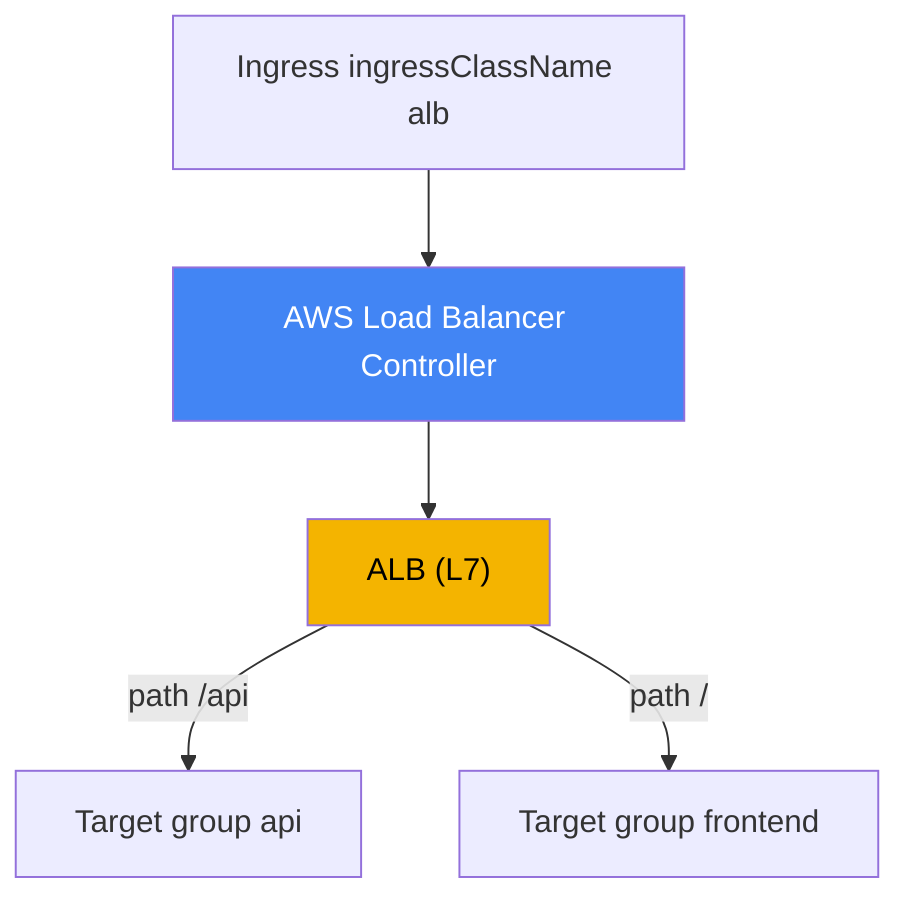
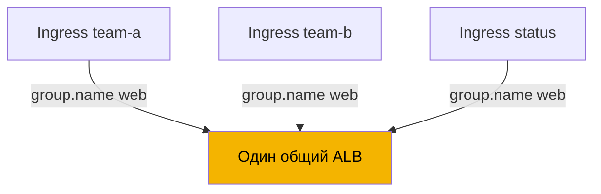
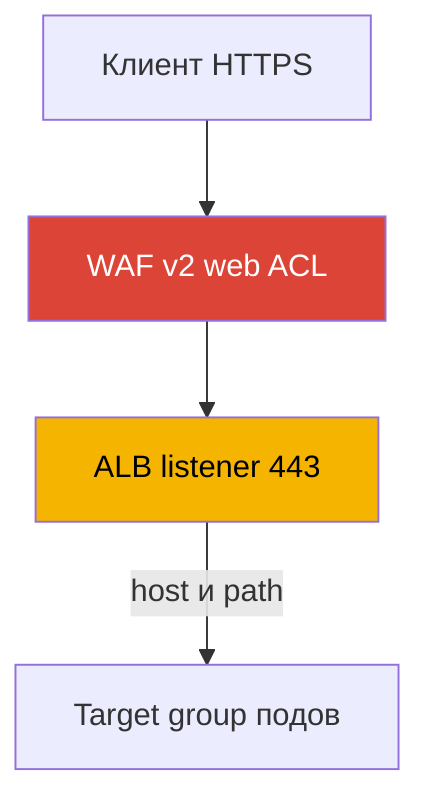

# Глава 27. Ingress через ALB: target-type, аннотации, TLS и ACM, WAF

> **Что дальше.** Глава 26 показала L4-балансировку: Service типа LoadBalancer и Network
> Load Balancer через AWS Load Balancer Controller. Здесь тот же контроллер, но уровень L7:
> из Ingress он создаёт Application Load Balancer с роутингом по host и path, терминацией TLS
> и защитой WAF. NLB и Service типа LoadBalancer остаются в главе 26, к ней и отсылаем.
> Gateway API и VPC Lattice - глава 28, external-dns, Route 53 и cert-manager - глава 29. Как
> под получает IP в VPC (VPC CNI) - глава 8, а роль контроллера через IRSA или Pod Identity -
> главы 16-17. На эти темы ссылаемся, не повторяя их.

## 27.1. «Пять сервисов - пять балансировщиков и негде повесить сертификат»

Команда выкатывает наружу веб-приложение из нескольких сервисов: фронтенд, API, страница
статуса. Привычным способом из главы 26 каждый сервис получает свой Service типа
LoadBalancer, а значит свой отдельный NLB:

```bash
kubectl get svc
# NAME       TYPE           EXTERNAL-IP                              PORT(S)
# frontend   LoadBalancer   a1b2...elb.eu-central-1.amazonaws.com    80:31111/TCP
# api        LoadBalancer   c3d4...elb.eu-central-1.amazonaws.com    80:31222/TCP
# status     LoadBalancer   e5f6...elb.eu-central-1.amazonaws.com    80:31333/TCP
```

Три сервиса - три балансировщика, три DNS-имени, три счёта за один и тот же сайт, и каждый
новый сервис добавляет ещё один. Но проблема даже не в числе балансировщиков. NLB работает
на L4: он не разбирает HTTP, поэтому не умеет маршрутизировать по пути (`/api` на один сервис,
`/` на другой) и по хосту, нет единой точки входа. И главное: терминацию TLS с редиректом с
80 на 443 на NLB нормально не настроить - для этого надо понимать HTTP, а L4 его не понимает.

Инженеру нужно другое: один вход, за которым по правилам host и path разложен трафик на
разные сервисы, сертификат из ACM, автоматический редирект на HTTPS и фильтрация через WAF.
Всё это - работа L7-балансировщика. В AWS это Application Load Balancer, и в Kubernetes его
описывают привычным объектом Ingress. Создаёт ALB из Ingress тот же AWS Load Balancer
Controller, что в главе 26 делал NLB из Service.

## 27.2. ALB через Ingress: IngressClass alb и тот же контроллер

Механика повторяет главу 26, но точкой входа теперь служит объект Ingress. Контроллер следит
за Ingress с нужным `ingressClassName` и приводит в соответствие ALB, его listener'ы,
таргет-группы и правила. Чтобы Ingress достался именно LBC, в кластере есть IngressClass с
контроллером `ingress.k8s.aws/alb`:

```yaml
apiVersion: networking.k8s.io/v1
kind: IngressClass
metadata:
  name: alb
spec:
  controller: ingress.k8s.aws/alb
```

Дальше на сам Ingress ставят `spec.ingressClassName: alb` и настраивают поведение ALB
аннотациями с префиксом `alb.ingress.kubernetes.io/`. Минимальный публичный Ingress с
роутингом по путям:

```yaml
apiVersion: networking.k8s.io/v1
kind: Ingress
metadata:
  name: web
  annotations:
    alb.ingress.kubernetes.io/scheme: internet-facing
    alb.ingress.kubernetes.io/target-type: ip
spec:
  ingressClassName: alb
  rules:
    - http:
        paths:
          - path: /api
            pathType: Prefix
            backend:
              service:
                name: api
                port: {number: 80}
          - path: /
            pathType: Prefix
            backend:
              service:
                name: frontend
                port: {number: 80}
```



Как и в главе 26, контроллер работает от имени AWS и требует IAM-роли на своём
ServiceAccount (IRSA или Pod Identity, главы 16-17). Права на ALB, таргет-группы, listener'ы,
а также на WAF и Shield входят в тот же документ политики `iam_policy.json`, что ставился для
NLB. Отдельный контроллер под ALB не нужен: LBC один и обрабатывает и Service, и Ingress.

## 27.3. target-type: instance против ip

Выбор таргета для ALB - та же механика, что у NLB (глава 26), поэтому кратко. Аннотация
`alb.ingress.kubernetes.io/target-type` принимает `instance` или `ip`, по умолчанию
`instance`.

- **`instance`** - таргет-группа регистрирует ноды по их `NodePort`; Service должен быть типа
  `NodePort` или `LoadBalancer`. ALB шлёт на `NodePort`, дальше `kube-proxy` доставляет до
  пода, возможен лишний межнодовый хоп.
- **`ip`** - таргет-группа регистрирует IP самих подов. Работает благодаря VPC CNI, который
  выдаёт поду маршрутизируемый адрес VPC (глава 8). Меньше хопов, обязателен на Fargate.

Практика та же, что для NLB: на EC2 с VPC CNI по умолчанию берут `ip`. У ALB режим `ip`
дополнительно нужен для sticky sessions - прилипания сессии к таргету. Полное сравнение путей
трафика, хопов и требований по сети приведено в главе 26 и здесь не дублируется.

| target-type | Что регистрируется | Тип Service | Fargate |
|---|---|---|---|
| `instance` | ноды по `NodePort` | `NodePort` или `LoadBalancer` | не работает |
| `ip` | IP подов напрямую | любой с VPC CNI | обязателен |

## 27.4. IngressGroup: один ALB на несколько Ingress

По умолчанию каждый Ingress порождает свой ALB. Это возвращает нас к боли из 27.1, только на
уровне L7: десять команд с десятью Ingress получат десять ALB. Решение - **IngressGroup**:
несколько Ingress объединяются в группу и обслуживаются **одним** общим ALB. Контроллер сам
сливает правила всех Ingress группы в один набор listener'ов и правил.

Группа задаётся аннотацией `alb.ingress.kubernetes.io/group.name`. Все Ingress с одинаковым
значением попадают в одну группу и делят балансировщик:

```yaml
metadata:
  annotations:
    alb.ingress.kubernetes.io/group.name: my-team.web
    alb.ingress.kubernetes.io/group.order: '10'
```



Порядок правил внутри группы управляется `alb.ingress.kubernetes.io/group.order` - целым
числом от -1000 до 1000 (по умолчанию 0). Чем меньше число, тем раньше проверяется правило;
при равных значениях порядок определяется по `namespace/name` Ingress. Это важно, когда
несколько Ingress описывают пересекающиеся пути и нужно задать приоритет.

У IngressGroup есть важный риск, который контроллер прямо помечает как security risk. Любой
пользователь с правами RBAC на создание Ingress может указать **тот же** `group.name` и
добавить свои правила в общий ALB или переопределить чужие с более высоким приоритетом.
Поэтому имя группы - это доверенная граница: группу заводят только внутри доверенного круга
команд, а членство ограничивают через `IngressClassParams` (namespaceSelector) или отключают
присоединение по аннотации флагом контроллера. Не смешивайте в одной группе Ingress разных
команд без такого контроля.

## 27.5. TLS и ACM: сертификат, редирект, порты

Терминация TLS - ключевая причина ставить ALB перед приложением. Сертификат ALB берёт из
**AWS Certificate Manager (ACM)**, приватный ключ из кластера не выходит и живёт на стороне
балансировщика. Задать сертификат можно двумя путями.

Явно - аннотацией `alb.ingress.kubernetes.io/certificate-arn` с ARN сертификата из ACM.
Первый сертификат в списке становится сертификатом по умолчанию, остальные попадают в список
SNI:

```yaml
metadata:
  annotations:
    alb.ingress.kubernetes.io/scheme: internet-facing
    alb.ingress.kubernetes.io/listen-ports: '[{"HTTP": 80}, {"HTTPS": 443}]'
    alb.ingress.kubernetes.io/certificate-arn: arn:aws:acm:eu-central-1:111122223333:certificate/abc
    alb.ingress.kubernetes.io/ssl-redirect: '443'
spec:
  ingressClassName: alb
  tls:
    - hosts: ["app.example.com"]
  rules:
    - host: app.example.com
      http:
        paths:
          - path: /
            pathType: Prefix
            backend:
              service: {name: frontend, port: {number: 80}}
```

Второй путь - **автообнаружение сертификата**. Если `certificate-arn` не указан, контроллер
берёт хосты из `spec.tls[].hosts` (и из `host` в правилах) и ищет в ACM подходящий сертификат
по доменному имени. Тогда ARN в манифесте держать не нужно - хватает TLS-хоста.

Аннотация `alb.ingress.kubernetes.io/listen-ports` перечисляет порты и протоколы listener'ов
ALB. По умолчанию это `'[{"HTTP": 80}]'`, а если задан `certificate-arn` - `'[{"HTTPS":
443}]'`. Чтобы принимать и HTTP, и HTTPS, оба порта указывают явно, как в примере выше.

Редирект с HTTP на HTTPS включается аннотацией `alb.ingress.kubernetes.io/ssl-redirect` со
значением целевого порта (обычно `'443'`). После этого каждый HTTP-listener получает действие
по умолчанию - редирект на HTTPS, а остальные его правила игнорируются. Порт из `ssl-redirect`
должен существовать среди `listen-ports`. Политику протоколов и шифров задаёт
`alb.ingress.kubernetes.io/ssl-policy` (по умолчанию `ELBSecurityPolicy-2016-08`).

| Аннотация | Назначение | Примечание |
|---|---|---|
| `certificate-arn` | ARN сертификата из ACM | первый - default, дальше SNI |
| (без `certificate-arn`) | автообнаружение по host из TLS | ARN в манифесте не нужен |
| `listen-ports` | порты и протоколы listener'ов | default HTTP 80 или HTTPS 443 |
| `ssl-redirect` | редирект 80 на 443 | порт должен быть в `listen-ports` |
| `ssl-policy` | набор протоколов и шифров TLS | default `ELBSecurityPolicy-2016-08` |

## 27.6. WAF и Shield: фильтрация на уровне L7

Раз ALB понимает HTTP, к нему можно прицепить фильтрацию запросов. Web ACL из **AWS WAF v2**
привязывается аннотацией `alb.ingress.kubernetes.io/wafv2-acl-arn` с ARN этого web ACL:

```yaml
metadata:
  annotations:
    alb.ingress.kubernetes.io/wafv2-acl-arn: arn:aws:wafv2:eu-central-1:111122223333:regional/webacl/my-acl/abc
```

Web ACL с правилами (защита от SQL-инъекций, rate limiting, гео- и IP-фильтры) действует на
входящий трафик до того, как он дойдёт до подов. Поддерживается только Regional WAFv2. Если
аннотация отсутствует, контроллер не трогает настройку WAF; чтобы отвязать web ACL, значение
задают явно как `none`. Для устаревшего WAF Classic есть `waf-acl-id`, но для новых нагрузок
берут WAFv2. Защита от DDoS включается аннотацией
`alb.ingress.kubernetes.io/shield-advanced-protection: 'true'` - она включает AWS Shield
Advanced на балансировщике (требует подписки на Shield Advanced).



Важно про IngressGroup из 27.4: WAF и Shield настраиваются на уровне всего ALB, а значит на
всю группу. В общем ALB любой участник группы своей аннотацией меняет защиту для всех. Поэтому
в мультитенантных группах конфигурацию WAF фиксируют через `IngressClassParams` (поле
`WAFv2ACLArn`), а не оставляют на усмотрение отдельных Ingress.

## 27.7. Роутинг: правила, действия, health check

Базовый роутинг ALB описывают штатными полями Ingress: `host`, `path` и `pathType`
(`Prefix`, `Exact`, `ImplementationSpecific`). Этого хватает для «по хосту и пути - на нужный
сервис». Для более сложных сценариев есть аннотации.

**Кастомные действия** - `alb.ingress.kubernetes.io/actions.${action-name}`. Имя действия
подставляют как `service.name` в правиле, а `port` указывают как `use-annotation`. Так
описывают то, чего нет в стандартном Ingress:

- `redirect` - редирект на другой URL или хост;
- `fixed-response` - вернуть фиксированный ответ (например, 503 на странице обслуживания);
- `forward` - forward на несколько таргет-групп с весами (weighted routing) и настройкой
  прилипания сессий.

**Дополнительные условия** - `alb.ingress.kubernetes.io/conditions.${conditions-name}` -
добавляют к правилу проверки сверх host и path: по HTTP-заголовку (`http-header`), методу
(`http-request-method`), query-строке (`query-string`) или исходному IP (`source-ip`).

Пример: страница обслуживания фиксированным ответом. Действие задают аннотацией, а в правиле
ссылаются на него через `service.name` и `port: use-annotation`:

```yaml
metadata:
  annotations:
    alb.ingress.kubernetes.io/actions.maintenance: >
      {"type":"fixed-response","fixedResponseConfig":
      {"contentType":"text/plain","statusCode":"503","messageBody":"under maintenance"}}
# в rules: backend.service.name: maintenance, port.name: use-annotation
```

**Health check** таргет-групп настраивается семейством аннотаций `healthcheck-*`:
`healthcheck-protocol` (по умолчанию `HTTP`), `healthcheck-port` (`traffic-port`),
`healthcheck-path` (`/`), `healthcheck-interval-seconds` (`15`), `healthcheck-timeout-seconds`
(`5`), `healthy-threshold-count` и `unhealthy-threshold-count` (`2`), `success-codes`
(`200`). Значения по умолчанию заданы контроллером и переопределяются по необходимости.

**Протокол до бэкенда** для HTTP-нагрузок уточняет
`alb.ingress.kubernetes.io/backend-protocol-version`: `HTTP1` (по умолчанию), `HTTP2` или
`GRPC`. Значение действует только при backend-протоколе HTTP или HTTPS и меняет application
protocol таргет-группы. Для gRPC-сервиса ставят `GRPC` - тогда ALB проксирует gRPC-вызовы
поверх HTTP/2 к подам; для обычного бэкенда на HTTP/2 берут `HTTP2`. Без этого ALB общается с
таргетами по HTTP/1.1, и gRPC не проходит:

```yaml
metadata:
  annotations:
    alb.ingress.kubernetes.io/backend-protocol-version: GRPC
```

**Схема** балансировщика задаётся `alb.ingress.kubernetes.io/scheme`: `internal` (по
умолчанию) или `internet-facing`. Как и у NLB, публичный ALB создают только с явным
`internet-facing`. Смена схемы на живом Ingress не бесплатна: ALB нельзя переключить на месте,
контроллер создаёт новый балансировщик, и это надо планировать как миграцию трафика.

**Аутентификация** на ALB встроена: `alb.ingress.kubernetes.io/auth-type` со значением
`cognito` или `oidc` перекладывает проверку пользователя на Amazon Cognito или внешний
OIDC-провайдер (`auth-idp-cognito`, `auth-idp-oidc`). Работает только на HTTPS-listener'ах.
Удобно закрыть внутреннюю панель логином без правки самого приложения.

## 27.8. ALB (Ingress) против NLB (Service): когда что

Оба балансировщика создаёт один контроллер, выбор - это уровень модели OSI и тип объекта
Kubernetes. Подробно NLB разобран в главе 26, здесь итоговое разграничение.

| Критерий | ALB (Ingress) | NLB (Service type LoadBalancer) |
|---|---|---|
| Уровень | L7 (HTTP/HTTPS) | L4 (TCP/UDP) |
| Объект Kubernetes | Ingress | Service |
| Роутинг по host и path | да | нет |
| Терминация TLS | ACM на listener'е | ACM, но без HTTP-логики |
| Редирект на HTTPS, WAF, OIDC | да | нет |
| Один LB на много сервисов | да, IngressGroup | нет, один Service - один NLB |
| UDP, статические IP | нет | да |
| Префикс аннотаций | `alb.ingress.kubernetes.io/` | `service.beta.kubernetes.io/aws-load-balancer-` |

Грубое правило: HTTP-роутинг, TLS с редиректом, WAF и единый вход - ALB через Ingress; чистый
L4, UDP, статические IP или максимальная пропускная способность - NLB через Service (глава 26).

## 27.9. Как это применяют в продакшене

- **IngressGroup вместо ALB на каждый Ingress.** Сервисы одного приложения или команды сводят
  в одну группу через `group.name` - это единый вход и меньше балансировщиков; membership
  ограничивают, помня про security risk общего ALB.
- **TLS через ACM с автообнаружением.** Сертификат держат в ACM, а в Ingress полагаются на
  автообнаружение по `spec.tls` host, не разнося ARN по манифестам; редирект на HTTPS
  включают `ssl-redirect`.
- **`scheme` и `target-type` задают осознанно.** Публичный ALB - только явный
  `internet-facing`; на EC2 с VPC CNI по умолчанию `target-type: ip`.
- **WAF на периметре.** Перед публичными ALB вешают WAFv2 web ACL, а в мультитенантных
  группах фиксируют его через `IngressClassParams`, чтобы участник группы не снял защиту.
- **Схему и имя LB не меняют на живом.** Смена `scheme` пересоздаёт ALB; такие параметры
  проектируют заранее и меняют как миграцию трафика.

## 27.10. Мини-глоссарий

- **Application Load Balancer (ALB)** - балансировщик L7 (HTTP/HTTPS) с роутингом по host и
  path, терминацией TLS, WAF и аутентификацией; в EKS создаётся LBC из Ingress.
- **IngressClass alb** - класс с контроллером `ingress.k8s.aws/alb`; Ingress с
  `ingressClassName: alb` обрабатывает AWS Load Balancer Controller.
- **IngressGroup** - объединение нескольких Ingress по `group.name` в один общий ALB;
  `group.order` задаёт приоритет правил.
- **target-type** - тип таргета ALB: `instance` (ноды по `NodePort`) или `ip` (IP подов, нужен
  VPC CNI); подробно в главе 26.
- **ACM (AWS Certificate Manager)** - источник TLS-сертификатов для listener'а ALB; ключ не
  покидает балансировщик.
- **ssl-redirect** - аннотация, включающая редирект HTTP на HTTPS на указанный порт listener'а.
- **wafv2-acl-arn** - аннотация привязки Web ACL из AWS WAF v2 к ALB для фильтрации запросов.
- **actions / conditions** - аннотации кастомных действий (redirect, fixed-response, weighted
  forward) и дополнительных условий роутинга (заголовки, метод, query, source IP).
- **backend-protocol-version** - application protocol таргет-группы: `HTTP1`, `HTTP2` или
  `GRPC`; нужен, чтобы ALB проксировал gRPC и HTTP/2 к подам, а не по HTTP/1.1.

## 27.11. Итоги главы

- Несколько Service типа LoadBalancer дают по NLB на сервис, не умеют HTTP-роутинг по host и
  path и не дают терминацию TLS с редиректом; для L7 нужен ALB через Ingress.
- ALB создаёт тот же AWS Load Balancer Controller (глава 26) из Ingress с
  `ingressClassName: alb` (IngressClass с контроллером `ingress.k8s.aws/alb`); поведение
  задают аннотации `alb.ingress.kubernetes.io/`. Контроллеру нужна IAM-роль (главы 16-17).
- `target-type` `instance` против `ip` - та же механика, что у NLB (глава 26): `ip` по
  умолчанию на EC2 с VPC CNI, обязателен на Fargate и для sticky sessions.
- IngressGroup (`group.name`) сводит несколько Ingress в один ALB, `group.order` задаёт
  приоритет правил; общий ALB - это security risk, membership ограничивают.
- TLS терминируется на ALB сертификатом из ACM: `certificate-arn` или автообнаружение по host
  из `spec.tls`; `ssl-redirect` включает редирект 80 на 443, `listen-ports` задаёт listener'ы.
- WAF привязывается `wafv2-acl-arn`, Shield Advanced - `shield-advanced-protection`; в общей
  группе защиту фиксируют через `IngressClassParams`.
- Роутинг описывают правилами Ingress, а сложные сценарии - аннотациями `actions.*` (redirect,
  fixed-response, forward с весами) и `conditions.*`; health check - через `healthcheck-*`;
  аутентификация - `auth-type` (Cognito или OIDC) на HTTPS. Для gRPC и HTTP/2 к бэкенду
  задают `backend-protocol-version` (`GRPC` или `HTTP2`).

## 27.12. Как это пригодится в реальной работе

На дежурстве L7-инциденты с ALB сводятся к нескольким корням. Ingress не поднимает ALB и
адреса нет - проверяют, тот ли `ingressClassName`, установлен ли контроллер и есть ли у его
роли права (`AccessDenied` в логах), как в главе 26 с NLB. Таргеты `unhealthy` - разбирают
`healthcheck-*` (протокол, путь, коды) и доступность порта пода в режиме `ip`. Клиент получает
не тот сервис или 404 - смотрят порядок правил, `group.order` внутри IngressGroup и
пересечения путей между Ingress разных команд в общей группе. TLS-ошибки - проверяют, найден
ли сертификат (ARN или автообнаружение по host из `spec.tls`) и есть ли HTTPS в `listen-ports`.

При планировании держите три решения заранее: схему (`internal`, если вход не светится
наружу), target-type (по умолчанию `ip` на EC2) и границы IngressGroup - какие команды делят
ALB и кто отвечает за WAF. И помните про необратимость: смена `scheme` пересоздаёт ALB,
поэтому такие вещи проектируют, а не переключают на живом трафике.

## 27.13. Вопросы для самопроверки

1. Почему несколько Service типа LoadBalancer - плохой способ опубликовать один веб-сайт?
2. Чего именно не умеет NLB (L4), из-за чего для HTTP-сайта берут ALB (L7)?
3. Как Ingress достаётся контроллеру LBC и какой контроллер указан в IngressClass alb?
4. Нужен ли отдельный контроллер под ALB, если в кластере уже стоит LBC для NLB (глава 26)?
5. Чем `target-type: instance` отличается от `ip` и почему `ip` нужен для sticky sessions?
6. Что делает IngressGroup и как `group.name` и `group.order` влияют на общий ALB?
7. В чём security risk общего ALB в IngressGroup и как его ограничивают?
8. Как задать сертификат ALB через ACM и как работает автообнаружение по host из `spec.tls`?
9. Что делают `ssl-redirect` и `listen-ports` и как они связаны между собой?
10. Как привязать WAFv2 web ACL к ALB и почему в группе его фиксируют через IngressClassParams?
11. Для чего нужны аннотации `actions.*` и `conditions.*` и как они связаны с правилами?
12. Почему смену `scheme` на живом Ingress планируют как миграцию трафика?
13. Когда выбирают ALB через Ingress, а когда NLB через Service (глава 26)?
14. Зачем нужен `backend-protocol-version` и какое значение ставят для gRPC-бэкенда?

## Практика

Своей лабы у главы пока нет, но всё проверяется на живом кластере. Контроллер тот же, что в
главе 26, поэтому сначала убедитесь, что он здоров, и посмотрите доступный IngressClass:

```bash
kubectl get deploy -n kube-system aws-load-balancer-controller
kubectl get ingressclass
kubectl get ingressclass alb -o yaml   # controller должен быть ingress.k8s.aws/alb
```

Создайте Ingress с `ingressClassName: alb`, аннотациями
`alb.ingress.kubernetes.io/scheme: internal` и `alb.ingress.kubernetes.io/target-type: ip` и
двумя правилами по path на разные сервисы. Дождитесь адреса (`kubectl get ingress web -w`) и
найдите ALB со стороны AWS: `aws elbv2 describe-load-balancers` покажет балансировщик и его
`Type` (`application`) и `Scheme`, `aws elbv2 describe-listeners --load-balancer-arn <arn>` -
listener'ы и порты, `aws elbv2 describe-rules --listener-arn <arn>` - правила роутинга по
путям, а `aws elbv2 describe-target-health --target-group-arn <arn>` - что зарегистрировано.
В режиме `ip` таргетами будут IP подов.

Дальше добавьте TLS: заведите сертификат в ACM, укажите `certificate-arn` (или проверьте
автообнаружение через `spec.tls` host), добавьте `listen-ports` с HTTP и HTTPS и
`ssl-redirect: '443'`, затем проверьте, что появился HTTPS-listener и запрос на HTTP
редиректится. Наконец объедините два Ingress в одну группу аннотацией `group.name` и
убедитесь, что ALB стал один на оба. Логи контроллера смотрите как в главе 26:
`kubectl logs -n kube-system deploy/aws-load-balancer-controller`.

---
[Оглавление](../README_RU.md) · [Глава 26](../26/ru.md) · [Глава 28](../28/ru.md)
