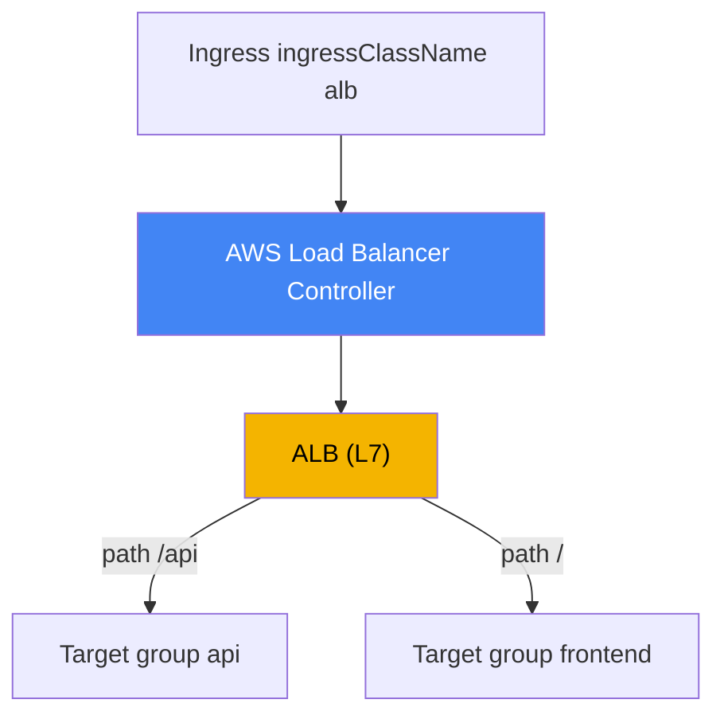
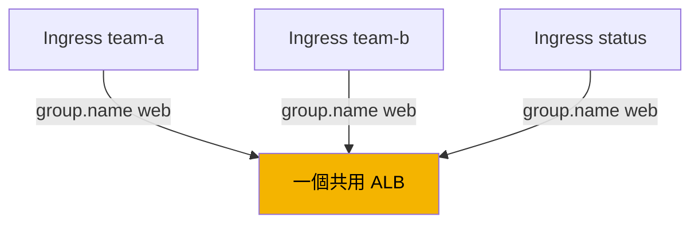
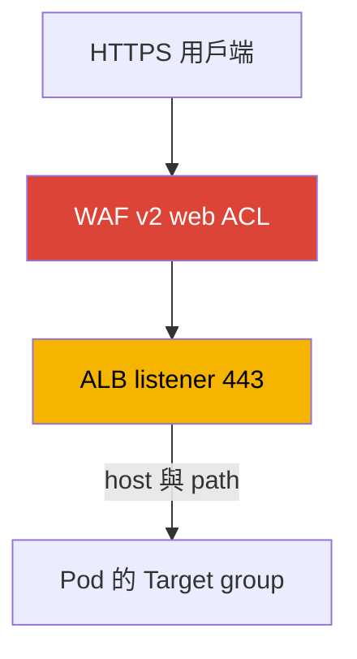

[English version](en.md) · [Versión en español](es.md) · [Version française](fr.md) · [Deutsche Version](de.md) · [ქართული ვერსია](ge.md) · [Русская версия](ru.md) · [日本語版](jp.md)
# 第 27 章。透過 ALB 的 Ingress：target-type、annotation、TLS 與 ACM、WAF

> **接下來。** 第 26 章介紹了 L4 負載平衡：透過 AWS Load Balancer Controller 的 LoadBalancer 類型 Service 與 Network Load Balancer。本章使用相同控制器，但層級為 L7：它會從 Ingress 建立 Application Load Balancer，提供依 host 與 path 的路由、TLS 終結與 WAF 保護。NLB 與 LoadBalancer 類型 Service 仍在第 26 章，本章會連結至該章。Gateway API 與 VPC Lattice 請見第 28 章，external-dns、Route 53 與 cert-manager 請見第 29 章。Pod 如何在 VPC 中取得 IP（VPC CNI）請見第 8 章，而控制器如何透過 IRSA 或 Pod Identity 取得角色請見第 16-17 章。本章會引用這些主題，不重複說明。

## 27.1.「五個服務、五個負載平衡器，卻無處掛憑證」

團隊要將由多個服務組成的 Web 應用程式公開到外部：前端、API、狀態頁面。沿用第 26 章的慣用方式，每個服務都會取得自己的 LoadBalancer 類型 Service，也就是各自獨立的 NLB：

```bash
kubectl get svc
# NAME       TYPE           EXTERNAL-IP                              PORT(S)
# frontend   LoadBalancer   a1b2...elb.eu-central-1.amazonaws.com    80:31111/TCP
# api        LoadBalancer   c3d4...elb.eu-central-1.amazonaws.com    80:31222/TCP
# status     LoadBalancer   e5f6...elb.eu-central-1.amazonaws.com    80:31333/TCP
```

三個服務、三個負載平衡器、三個 DNS 名稱，為同一個網站付三筆費用，而且每新增一個服務就再多一個。但問題甚至不只在負載平衡器的數量。NLB 運作於 L4：它不解析 HTTP，因此無法依路徑路由（將 `/api` 導向一個服務、`/` 導向另一個服務），也無法依 host 路由，沒有統一入口。更重要的是，無法在 NLB 上妥善設定 TLS 終結與從 80 重新導向至 443：這需要理解 HTTP，而 L4 並不理解它。

工程師需要的是另一種方案：一個入口，流量依 host 與 path 規則分配至不同服務，使用 ACM 憑證，自動重新導向至 HTTPS，並經 WAF 篩選。這些都是 L7 負載平衡器的工作。在 AWS 中是 Application Load Balancer，而在 Kubernetes 中以熟悉的 Ingress 物件描述。從 Ingress 建立 ALB 的同樣是 AWS Load Balancer Controller，也就是第 26 章從 Service 建立 NLB 的控制器。

## 27.2. 透過 Ingress 的 ALB：IngressClass alb 與相同控制器

機制與第 26 章相同，但入口點現在是 Ingress 物件。控制器監看具有正確 `ingressClassName` 的 Ingress，並使 ALB、其 listener、target group 與規則符合宣告狀態。為了使 LBC 處理 Ingress，叢集中會有一個控制器為 `ingress.k8s.aws/alb` 的 IngressClass：

```yaml
apiVersion: networking.k8s.io/v1
kind: IngressClass
metadata:
  name: alb
spec:
  controller: ingress.k8s.aws/alb
```

接著在 Ingress 本身設定 `spec.ingressClassName: alb`，並使用前綴為 `alb.ingress.kubernetes.io/` 的 annotation 設定 ALB 行為。以下是依路徑路由的最小公開 Ingress：

```yaml
apiVersion: networking.k8s.io/v1
kind: Ingress
metadata:
  name: web
  annotations:
    alb.ingress.kubernetes.io/scheme: internet-facing
    alb.ingress.kubernetes.io/target-type: ip
spec:
  ingressClassName: alb
  rules:
    - http:
        paths:
          - path: /api
            pathType: Prefix
            backend:
              service:
                name: api
                port: {number: 80}
          - path: /
            pathType: Prefix
            backend:
              service:
                name: frontend
                port: {number: 80}
```



如同第 26 章，控制器會以 AWS 身分運作，並需要其 ServiceAccount 上的 IAM role（IRSA 或 Pod Identity，第 16-17 章）。ALB、target group、listener，以及 WAF 與 Shield 的權限，都包含在為 NLB 安裝的相同 `iam_policy.json` policy 文件中。不需要額外部署 ALB 專用控制器：LBC 只有一個，同時處理 Service 與 Ingress。

## 27.3. target-type：instance 與 ip

ALB 的 target 選擇與 NLB 相同（第 26 章），因此在此簡述。annotation `alb.ingress.kubernetes.io/target-type` 接受 `instance` 或 `ip`，預設為 `instance`。

- **`instance`** - target group 依各 node 的 `NodePort` 註冊 node；Service 必須是 `NodePort` 或 `LoadBalancer` 類型。ALB 傳送至 `NodePort`，之後由 `kube-proxy` 傳遞至 Pod，可能多出一次跨 node hop。
- **`ip`** - target group 直接註冊 Pod 自身的 IP。它透過 VPC CNI 運作，VPC CNI 為 Pod 指派可路由的 VPC 位址（第 8 章）。hop 較少，在 Fargate 上是必要的。

實務與 NLB 相同：在使用 VPC CNI 的 EC2 上，預設採用 `ip`。對 ALB 而言，`ip` 模式還是 sticky sessions，也就是 session 黏著至 target 所必需。流量路徑、hop 與網路需求的完整比較已於第 26 章提供，這裡不再重複。

| target-type | 註冊的項目 | Service 類型 | Fargate |
|---|---|---|---|
| `instance` | 依 `NodePort` 的 node | `NodePort` 或 `LoadBalancer` | 不運作 |
| `ip` | 直接使用 Pod IP | 搭配 VPC CNI 的任意類型 | 必要 |

## 27.4. IngressGroup：一個 ALB 對應多個 Ingress

預設每個 Ingress 都會產生自己的 ALB。這讓我們回到 27.1 的痛點，只是發生在 L7 層：十個團隊使用十個 Ingress，將得到十個 ALB。解法是 **IngressGroup**：多個 Ingress 合併為一組，並由**一個**共用 ALB 提供服務。控制器會自動將群組中所有 Ingress 的規則合併為一組 listener 與規則。

群組透過 `alb.ingress.kubernetes.io/group.name` annotation 指定。具有相同值的所有 Ingress 都會進入同一群組並共用負載平衡器：

```yaml
metadata:
  annotations:
    alb.ingress.kubernetes.io/group.name: my-team.web
    alb.ingress.kubernetes.io/group.order: '10'
```



群組內的規則順序由 `alb.ingress.kubernetes.io/group.order` 控制，這是介於 -1000 與 1000 的整數（預設為 0）。數字越小，規則越早檢查；值相同時，順序由 Ingress 的 `namespace/name` 決定。當多個 Ingress 描述重疊路徑且必須指定優先順序時，這一點很重要。

IngressGroup 有一項重要風險，控制器明確標記為 security risk。任何擁有建立 Ingress 之 RBAC 權限的使用者都能指定**相同的** `group.name`，將自己的規則新增至共用 ALB，或以較高優先順序覆寫其他人的規則。因此群組名稱是一項信任邊界：只應在受信任的團隊範圍內建立群組，並透過 `IngressClassParams`（`namespaceSelector`）限制成員資格，或使用控制器旗標停用透過 annotation 加入群組。沒有這類控制時，請勿將不同團隊的 Ingress 混在同一群組。

## 27.5. TLS 與 ACM：憑證、重新導向、連接埠

TLS 終結是在應用程式前方部署 ALB 的關鍵原因。ALB 從 **AWS Certificate Manager (ACM)** 取得憑證，私密金鑰不會離開叢集，並存放在負載平衡器端。設定憑證有兩種方式。

明確指定：使用 `alb.ingress.kubernetes.io/certificate-arn` annotation 設定 ACM 憑證 ARN。清單中的第一張憑證成為預設憑證，其餘憑證會加入 SNI 清單：

```yaml
metadata:
  annotations:
    alb.ingress.kubernetes.io/scheme: internet-facing
    alb.ingress.kubernetes.io/listen-ports: '[{"HTTP": 80}, {"HTTPS": 443}]'
    alb.ingress.kubernetes.io/certificate-arn: arn:aws:acm:eu-central-1:111122223333:certificate/abc
    alb.ingress.kubernetes.io/ssl-redirect: '443'
spec:
  ingressClassName: alb
  tls:
    - hosts: ["app.example.com"]
  rules:
    - host: app.example.com
      http:
        paths:
          - path: /
            pathType: Prefix
            backend:
              service: {name: frontend, port: {number: 80}}
```

第二種方式是**憑證自動探索**。若未設定 `certificate-arn`，控制器會從 `spec.tls[].hosts`（以及規則中的 `host`）取得 host，並在 ACM 中依網域名稱尋找相符憑證。如此一來不必在 manifest 保留 ARN，只需 TLS host 即可。

annotation `alb.ingress.kubernetes.io/listen-ports` 列出 ALB listener 的連接埠與協定。預設為 `'[{"HTTP": 80}]'`；若已設定 `certificate-arn`，預設為 `'[{"HTTPS": 443}]'`。若要同時接受 HTTP 與 HTTPS，需如上例明確指定兩個連接埠。

從 HTTP 重新導向至 HTTPS，可使用 `alb.ingress.kubernetes.io/ssl-redirect` annotation 並指定目標連接埠值（通常為 `'443'`）啟用。此後每個 HTTP listener 的預設動作都是重新導向至 HTTPS，其餘規則會被忽略。`ssl-redirect` 中的連接埠必須存在於 `listen-ports`。協定與 cipher policy 由 `alb.ingress.kubernetes.io/ssl-policy` 設定（預設為 `ELBSecurityPolicy-2016-08`）。

| Annotation | 用途 | 備註 |
|---|---|---|
| `certificate-arn` | ACM 憑證 ARN | 第一個為 default，其餘為 SNI |
| （不使用 `certificate-arn`） | 依 TLS 中的 host 自動探索 | manifest 中不需要 ARN |
| `listen-ports` | listener 的連接埠與協定 | 預設 HTTP 80 或 HTTPS 443 |
| `ssl-redirect` | 從 80 重新導向至 443 | 連接埠必須在 `listen-ports` 中 |
| `ssl-policy` | TLS 協定與 cipher 集合 | 預設 `ELBSecurityPolicy-2016-08` |

## 27.6. WAF 與 Shield：L7 層級篩選

由於 ALB 理解 HTTP，因此可以為它掛上請求篩選。來自 **AWS WAF v2** 的 Web ACL 使用 `alb.ingress.kubernetes.io/wafv2-acl-arn` annotation 與該 web ACL 的 ARN 綁定：

```yaml
metadata:
  annotations:
    alb.ingress.kubernetes.io/wafv2-acl-arn: arn:aws:wafv2:eu-central-1:111122223333:regional/webacl/my-acl/abc
```

具備規則的 Web ACL（防護 SQL injection、rate limiting、地理與 IP filter）會對進入的流量生效，先於它抵達 Pod 前。僅支援 Regional WAFv2。若 annotation 不存在，控制器不會更動 WAF 設定；若要解除 web ACL 綁定，請明確將值設為 `none`。已過時的 WAF Classic 可使用 `waf-acl-id`，但新工作負載應採用 WAFv2。DDoS 防護可透過 annotation `alb.ingress.kubernetes.io/shield-advanced-protection: 'true'` 啟用，它會在負載平衡器上啟用 AWS Shield Advanced（需要 Shield Advanced 訂閱）。



關於 27.4 的 IngressGroup，請注意：WAF 與 Shield 是在整個 ALB 層級設定，因此會套用至整個群組。在共用 ALB 中，任何群組成員都能以自己的 annotation 變更所有人的保護。因此，在多租戶群組中，應透過 `IngressClassParams`（`WAFv2ACLArn` 欄位）固定 WAF 設定，而不是交由個別 Ingress 決定。

## 27.7. 路由：規則、動作、health check

基本 ALB 路由由標準 Ingress 欄位描述：`host`、`path` 與 `pathType`（`Prefix`、`Exact`、`ImplementationSpecific`）。這足以處理「依 host 與路徑導向正確服務」。較複雜的情境則可使用 annotation。

**自訂動作**：`alb.ingress.kubernetes.io/actions.${action-name}`。將動作名稱作為規則中的 `service.name`，並將 `port` 指定為 `use-annotation`。藉此可描述標準 Ingress 未提供的功能：

- `redirect` - 重新導向至其他 URL 或 host；
- `fixed-response` - 回傳固定回應（例如維護頁面回傳 503）；
- `forward` - 以權重將流量 forward 至多個 target group（weighted routing），並設定 session 黏著。

**額外條件**：`alb.ingress.kubernetes.io/conditions.${conditions-name}`，可在規則中加入超出 host 與 path 之外的檢查：HTTP header（`http-header`）、method（`http-request-method`）、query string（`query-string`）或來源 IP（`source-ip`）。

範例：以固定回應提供維護頁面。動作以 annotation 定義，並透過 `service.name` 與 `port: use-annotation` 在規則中參照：

```yaml
metadata:
  annotations:
    alb.ingress.kubernetes.io/actions.maintenance: >
      {"type":"fixed-response","fixedResponseConfig":
      {"contentType":"text/plain","statusCode":"503","messageBody":"under maintenance"}}
# 在 rules 中：backend.service.name: maintenance, port.name: use-annotation
```

target group 的 **Health check** 以 `healthcheck-*` annotation 系列設定：`healthcheck-protocol`（預設 `HTTP`）、`healthcheck-port`（`traffic-port`）、`healthcheck-path`（`/`）、`healthcheck-interval-seconds`（`15`）、`healthcheck-timeout-seconds`（`5`）、`healthy-threshold-count` 與 `unhealthy-threshold-count`（`2`）、`success-codes`（`200`）。預設值由控制器設定，並可視需要覆寫。

對 HTTP 工作負載，**到 backend 的協定**由 `alb.ingress.kubernetes.io/backend-protocol-version` 指定：`HTTP1`（預設）、`HTTP2` 或 `GRPC`。此值僅在 backend 協定為 HTTP 或 HTTPS 時生效，並會變更 target group 的 application protocol。對 gRPC 服務設定 `GRPC`，ALB 即會以 HTTP/2 將 gRPC 呼叫 proxy 至 Pod；一般使用 HTTP/2 的 backend 則選擇 `HTTP2`。若未設定，ALB 會使用 HTTP/1.1 與 target 通訊，gRPC 無法通過：

```yaml
metadata:
  annotations:
    alb.ingress.kubernetes.io/backend-protocol-version: GRPC
```

負載平衡器的 **scheme** 由 `alb.ingress.kubernetes.io/scheme` 設定：`internal`（預設）或 `internet-facing`。如同 NLB，只有明確指定 `internet-facing` 才會建立公開 ALB。在運作中的 Ingress 上變更 scheme 並非免費：ALB 無法原地切換，控制器會建立新的負載平衡器，因此應將它規劃為流量遷移。

ALB 內建**驗證**：值為 `cognito` 或 `oidc` 的 `alb.ingress.kubernetes.io/auth-type`，會將使用者驗證交給 Amazon Cognito 或外部 OIDC provider（`auth-idp-cognito`、`auth-idp-oidc`）。僅適用於 HTTPS listener。無須修改應用程式本身，即可方便地使用登入保護內部面板。

## 27.8. ALB（Ingress）與 NLB（Service）：何時使用哪一種

兩種負載平衡器都由同一個控制器建立，選擇取決於 OSI 模型層級與 Kubernetes 物件類型。第 26 章已詳細說明 NLB，本節給出最終區分。

| 準則 | ALB (Ingress) | NLB (Service type LoadBalancer) |
|---|---|---|
| 層級 | L7 (HTTP/HTTPS) | L4 (TCP/UDP) |
| Kubernetes 物件 | Ingress | Service |
| 依 host 與 path 路由 | 是 | 否 |
| TLS 終結 | listener 上的 ACM | ACM，但沒有 HTTP 邏輯 |
| 重新導向至 HTTPS、WAF、OIDC | 是 | 否 |
| 一個 LB 對應多個服務 | 是，IngressGroup | 否，一個 Service 對應一個 NLB |
| UDP、靜態 IP | 否 | 是 |
| annotation 前綴 | `alb.ingress.kubernetes.io/` | `service.beta.kubernetes.io/aws-load-balancer-` |

粗略規則是：HTTP 路由、具重新導向的 TLS、WAF 與統一入口，使用透過 Ingress 的 ALB；純 L4、UDP、靜態 IP 或最大吞吐量，使用透過 Service 的 NLB（第 26 章）。

## 27.9. 在生產環境如何使用

- **以 IngressGroup 取代每個 Ingress 一個 ALB。** 將相同應用程式或團隊的服務透過 `group.name` 集中至一個群組，獲得統一入口並減少負載平衡器；記得共用 ALB 的 security risk，並限制 membership。
- **使用 ACM 與自動探索的 TLS。** 將憑證保存在 ACM，並讓 Ingress 依 `spec.tls` host 自動探索，不要將 ARN 分散於 manifest；使用 `ssl-redirect` 啟用 HTTPS 重新導向。
- **有意識地設定 `scheme` 與 `target-type`。** 公開 ALB 僅使用明確的 `internet-facing`；在使用 VPC CNI 的 EC2 上預設採用 `target-type: ip`。
- **在邊界部署 WAF。** 在公開 ALB 前方掛載 WAFv2 web ACL；在多租戶群組中，透過 `IngressClassParams` 固定它，避免群組成員移除保護。
- **不要在運作中變更 LB scheme 與名稱。** 變更 `scheme` 會重新建立 ALB；此類參數應預先設計，並以流量遷移方式變更。

## 27.10. 迷你詞彙表

- **Application Load Balancer (ALB)** - 具備依 host 與 path 路由、TLS 終結、WAF 與驗證功能的 L7（HTTP/HTTPS）負載平衡器；在 EKS 中由 LBC 從 Ingress 建立。
- **IngressClass alb** - 控制器為 `ingress.k8s.aws/alb` 的 class；具有 `ingressClassName: alb` 的 Ingress 由 AWS Load Balancer Controller 處理。
- **IngressGroup** - 依 `group.name` 將多個 Ingress 合併至一個共用 ALB；`group.order` 設定規則優先順序。
- **target-type** - ALB target 類型：`instance`（依 `NodePort` 的 node）或 `ip`（Pod IP，需要 VPC CNI）；詳見第 26 章。
- **ACM (AWS Certificate Manager)** - ALB listener 的 TLS 憑證來源；金鑰不會離開負載平衡器。
- **ssl-redirect** - 啟用在指定 listener 連接埠上從 HTTP 重新導向至 HTTPS 的 annotation。
- **wafv2-acl-arn** - 將 AWS WAF v2 的 Web ACL 綁定至 ALB 以篩選請求的 annotation。
- **actions / conditions** - 用於自訂動作（redirect、fixed-response、weighted forward）與額外路由條件（header、method、query、source IP）的 annotation。
- **backend-protocol-version** - target group 的 application protocol：`HTTP1`、`HTTP2` 或 `GRPC`；讓 ALB 將 gRPC 與 HTTP/2 proxy 至 Pod 而非使用 HTTP/1.1 所必需。

## 27.11. 本章總結

- 多個 LoadBalancer 類型 Service 會為每個服務產生一個 NLB，無法依 host 與 path 進行 HTTP 路由，也無法提供帶重新導向的 TLS 終結；L7 需要透過 Ingress 的 ALB。
- 同一個 AWS Load Balancer Controller（第 26 章）會從 `ingressClassName: alb` 的 Ingress 建立 ALB（IngressClass 的控制器為 `ingress.k8s.aws/alb`）；行為由 `alb.ingress.kubernetes.io/` annotation 設定。控制器需要 IAM role（第 16-17 章）。
- `target-type` 的 `instance` 與 `ip` 使用與 NLB 相同的機制（第 26 章）：在搭配 VPC CNI 的 EC2 上預設使用 `ip`，Fargate 與 sticky sessions 必須使用它。
- IngressGroup（`group.name`）可將多個 Ingress 集中至一個 ALB，`group.order` 設定規則優先順序；共用 ALB 是一項 security risk，必須限制 membership。
- TLS 在 ALB 上使用 ACM 憑證終結：`certificate-arn` 或依 `spec.tls` 中 host 自動探索；`ssl-redirect` 啟用從 80 到 443 的重新導向，`listen-ports` 設定 listener。
- WAF 使用 `wafv2-acl-arn` 綁定，Shield Advanced 使用 `shield-advanced-protection`；在共用群組中，透過 `IngressClassParams` 固定防護。
- 路由使用 Ingress 規則描述，複雜情境則使用 `actions.*` annotation（redirect、fixed-response、帶權重的 forward）與 `conditions.*`；health check 使用 `healthcheck-*`；驗證在 HTTPS 上使用 `auth-type`（Cognito 或 OIDC）。對 backend 的 gRPC 與 HTTP/2 設定 `backend-protocol-version`（`GRPC` 或 `HTTP2`）。

## 27.12. 這在實際工作中如何派上用場

值班時的 ALB L7 事件通常可歸結為幾項原因。Ingress 沒有建立 ALB、也沒有位址時，請檢查 `ingressClassName` 是否正確、控制器是否已安裝，以及其 role 是否有權限（如第 26 章 NLB 所述，查看 log 中的 `AccessDenied`）。target 顯示 `unhealthy` 時，請檢查 `healthcheck-*`（協定、路徑、代碼）以及 `ip` 模式下 Pod 連接埠是否可達。用戶端取得錯誤服務或 404 時，請檢查規則順序、IngressGroup 中的 `group.order`，以及共用群組內不同團隊 Ingress 之間重疊的路徑。TLS 錯誤時，請檢查是否找到憑證（ARN 或依 `spec.tls` 中 host 自動探索），以及 `listen-ports` 是否包含 HTTPS。

規劃時請預先決定三件事：scheme（若入口不公開於外部則使用 `internal`）、target-type（EC2 預設使用 `ip`）與 IngressGroup 邊界，也就是哪些團隊共用 ALB、誰負責 WAF。並請記住其不可逆性：變更 `scheme` 會重新建立 ALB，因此這類設定應在設計時決定，不要在即時流量上切換。

## 27.13. 自我檢查問題

1. 為什麼多個 LoadBalancer 類型 Service 是公開單一網站的糟糕方式？
2. NLB（L4）具體缺少什麼功能，以致 HTTP 網站要採用 ALB（L7）？
3. Ingress 如何交由 LBC 控制器處理，IngressClass alb 指定的是哪一個控制器？
4. 若叢集已經有 NLB 的 LBC（第 26 章），是否需要額外的 ALB 控制器？
5. `target-type: instance` 與 `ip` 有何不同，為何 sticky sessions 需要 `ip`？
6. IngressGroup 的作用為何，`group.name` 與 `group.order` 如何影響共用 ALB？
7. IngressGroup 中共用 ALB 的 security risk 是什麼，如何限制它？
8. 如何透過 ACM 設定 ALB 憑證，依 `spec.tls` 中 host 的自動探索如何運作？
9. `ssl-redirect` 與 `listen-ports` 分別有何作用，兩者如何相關？
10. 如何將 WAFv2 web ACL 綁定至 ALB，為何在群組中要透過 IngressClassParams 固定它？
11. `actions.*` 與 `conditions.*` annotation 的用途是什麼，它們如何與規則相關？
12. 為何要將運作中 Ingress 的 `scheme` 變更規劃為流量遷移？
13. 何時選擇透過 Ingress 的 ALB，何時選擇透過 Service 的 NLB（第 26 章）？
14. `backend-protocol-version` 的用途是什麼，gRPC backend 要設定什麼值？

## 練習

本主題的課程實驗：[實驗 109 - 透過 ALB 的 Ingress，包含 ACM 憑證、external-dns 與 Route 53](../../labs/109/README_TW.MD)。除此之外，所有內容都可在即時叢集上驗證。控制器與第 26 章相同，因此先確認它是否健康，並查看可用的 IngressClass：

```bash
kubectl get deploy -n kube-system aws-load-balancer-controller
kubectl get ingressclass
kubectl get ingressclass alb -o yaml   # controller 必須是 ingress.k8s.aws/alb
```

建立一個包含 `ingressClassName: alb`、`alb.ingress.kubernetes.io/scheme: internal` 與 `alb.ingress.kubernetes.io/target-type: ip` annotation，並依 path 路由至兩個不同服務的 Ingress。等待位址出現（`kubectl get ingress web -w`），並從 AWS 端尋找 ALB：`aws elbv2 describe-load-balancers` 會顯示負載平衡器及其 `Type`（`application`）和 `Scheme`，`aws elbv2 describe-listeners --load-balancer-arn <arn>` 顯示 listener 與連接埠，`aws elbv2 describe-rules --listener-arn <arn>` 顯示依路徑路由的規則，而 `aws elbv2 describe-target-health --target-group-arn <arn>` 顯示已註冊的項目。在 `ip` 模式中，target 會是 Pod IP。

接著加入 TLS：在 ACM 建立憑證，指定 `certificate-arn`（或透過 `spec.tls` host 驗證自動探索），加入包含 HTTP 與 HTTPS 的 `listen-ports` 及 `ssl-redirect: '443'`，然後確認 HTTPS listener 已出現且 HTTP 請求會重新導向。最後，使用 `group.name` annotation 將兩個 Ingress 合併至一個群組，並確認兩者共用一個 ALB。依第 26 章檢視控制器 log：`kubectl logs -n kube-system deploy/aws-load-balancer-controller`。

---
[目錄](../README_TW.md) · [第 26 章](../26/tw.md) · [第 28 章](../28/tw.md)
