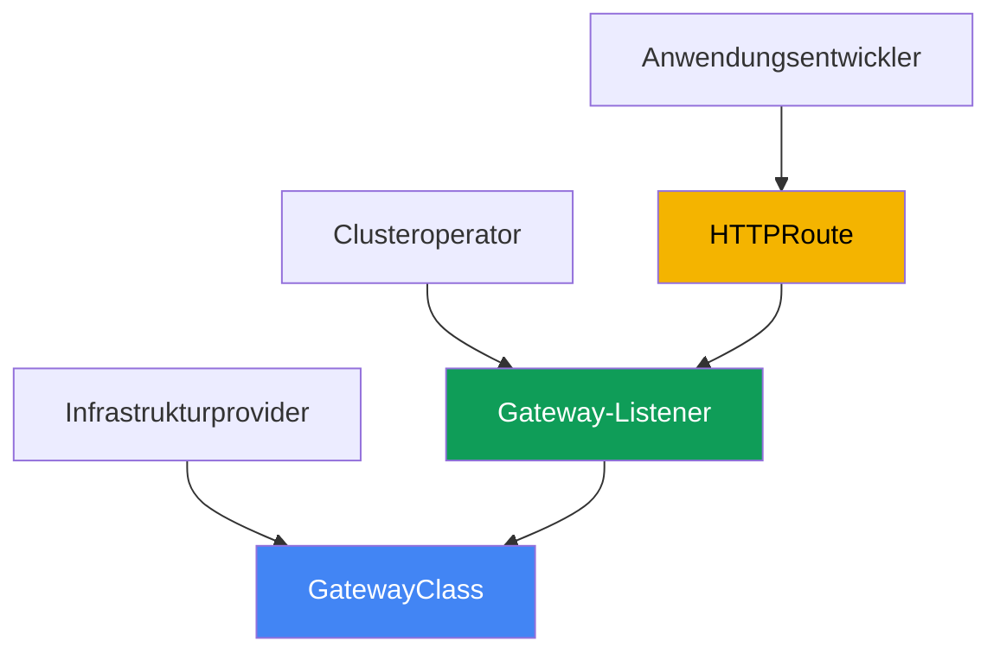
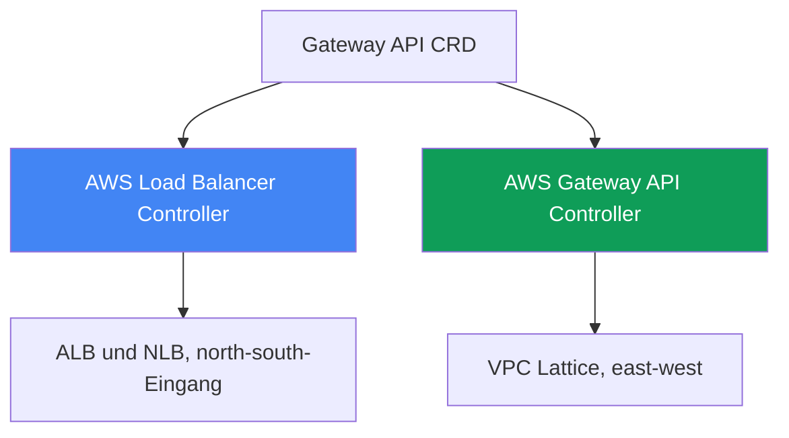
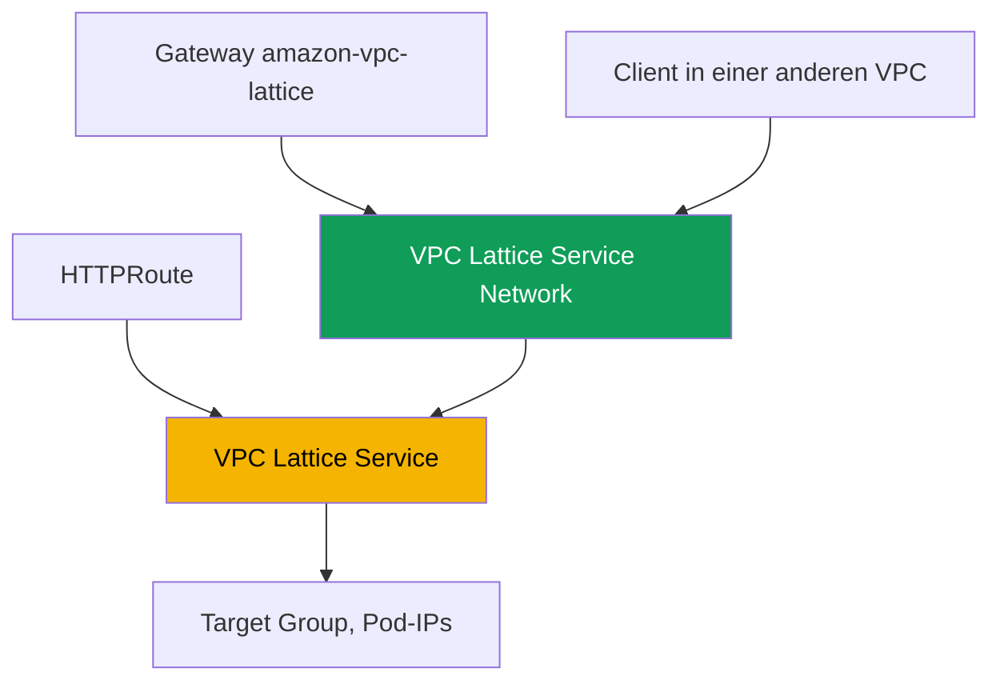

[Русская версия](ru.md) · [Eng version](en.md) · [Versión en español](es.md) · [Version française](fr.md) · [ქართული ვერსია](ge.md) · [繁體中文版](tw.md) · [日本語版](jp.md)
# Kapitel 28. Gateway API in AWS: ALB Gateway API und VPC Lattice

> **Wie es weitergeht.** Die Kapitel 26 und 27 zeigten die Veröffentlichung über Annotationen: Ein Service vom Typ
> LoadBalancer stellte einen NLB bereit (Kapitel 26), während ein Ingress mit `ingressClassName: alb` einen ALB
> bereitstellte (Kapitel 27). Hier folgt Gateway API: eine standardisierte, typisierte Alternative zu Ingress mit
> einer expliziten Trennung der Verantwortlichkeiten zwischen Plattform und Entwicklern. Wir betrachten zwei
> AWS-Implementierungen: denselben AWS Load Balancer Controller auf ALB und NLB sowie den AWS Gateway API
> Controller auf VPC Lattice, um Services über VPCs und Konten hinweg zu verbinden. Ingress und ALB bleiben in
> Kapitel 27, NLB und Service in Kapitel 26, external-dns und Zertifikate in Kapitel 29 sowie Multi-Cluster und
> Multi-Account in Kapitel 32. Wie ein Pod eine IP-Adresse erhält (VPC CNI), behandelt Kapitel 8, und die Rolle
> des Controllers (IRSA, Pod Identity) die Kapitel 16-17. Auf diese Themen wird verwiesen, ohne sie zu wiederholen.

## 28.1. „Ingress ist mit Annotationen gewachsen, und Rollen lassen sich nicht trennen“

Kehren wir zum Ingress aus Kapitel 27 zurück. Ein Objekt beschreibt sowohl das Anwendungsrouting (Host, Pfad
zu Services) als auch die gesamte Load-Balancer-Infrastruktur: Schema, TLS, WAF, Timeouts und Health Checks.
All das steht in Annotationen mit dem Präfix `alb.ingress.kubernetes.io/`, und ein typischer Produktions-Ingress
sieht so aus:

```yaml
metadata:
  annotations:
    alb.ingress.kubernetes.io/scheme: internet-facing
    alb.ingress.kubernetes.io/target-type: ip
    alb.ingress.kubernetes.io/listen-ports: '[{"HTTP":80},{"HTTPS":443}]'
    alb.ingress.kubernetes.io/ssl-redirect: '443'
    alb.ingress.kubernetes.io/certificate-arn: arn:aws:acm:...
    alb.ingress.kubernetes.io/wafv2-acl-arn: arn:aws:wafv2:...
    alb.ingress.kubernetes.io/healthcheck-path: /healthz
    # ...noch ein Dutzend Zeilen
```

Hier gibt es zwei Probleme. Das erste ist das Datenmodell: Einstellungen sind nicht typisiert, sondern Strings
in Annotationen, für jede Implementierung anbieterspezifisch, und die Konfiguration zwischen Implementierungen
zu übertragen, ist aufwendig. Das zweite betrifft die Rollen: `scheme`, `certificate-arn` und `wafv2-acl-arn`
gehören zum Plattformteam, während `path` und das Backend dem Entwickler gehören, doch alles ist in einem
Objekt vermischt, das beide Seiten bearbeiten.

Und eine eigene Problemklasse löst Ingress überhaupt nicht. Ingress und ALB dienen dem eingehenden Traffic von
außen (north-south). Muss ein Service in einer VPC einen Service in einer anderen VPC oder einem anderen Konto
aufrufen (east-west), hilft Ingress nicht: Sie müssten einen Load Balancer am Perimeter bereitstellen, VPC Peering
konfigurieren und CIDR-Überlappungen behandeln. AWS bietet dafür einen separaten Dienst für
Anwendungsnetzwerke: VPC Lattice. Ein Standard löst beide Aufgaben: Gateway API.

## 28.2. Gateway API als Standard: typisierte Ressourcen und Rollen

Gateway API ist der offizielle Kubernetes-Standard für Traffic Management und der Nachfolger von Ingress.
Statt eines Objekts mit Annotationen führt er mehrere typisierte Ressourcen ein, jede mit einem eigenen
Verantwortlichen:

- **GatewayClass** ist eine Implementierungsvorlage, vergleichbar mit IngressClass. Sie wird vom
  Infrastrukturprovider erstellt: Sie legt mit `controllerName` fest, welcher spezifische Controller an die Klasse
  gebunden ist. Entwickler fassen sie nicht an.
- **Gateway** ist ein konkreter Einstiegspunkt: Listener (`listeners`) mit Protokoll, Port und TLS. Sein
  Verantwortlicher ist der Clusteroperator (das Plattformteam). Infrastrukturentscheidungen liegen hier.
- **HTTPRoute** (sowie **TLSRoute**, **TCPRoute**, **UDPRoute** und **GRPCRoute**) enthält Routingregeln nach
  Host, Pfad und Headern zu Backend-Services. Sein Verantwortlicher ist der Entwickler. Eine Route verweist über
  `parentRefs` auf ein Gateway, während ein Gateway die Verknüpfung über `allowedRoutes` gestattet.



Warum dies besser als Ingress ist: Erstens die Rollentrennung: Die Plattform besitzt das Gateway und die
Zertifikate, während der Entwickler nur seine HTTPRoute besitzt, und sie bearbeiten nicht dasselbe Objekt.
Zweitens die Typisierung: Was in einer Ingress-Annotation ein String war (Header, Methoden, Gewichtungen,
Weiterleitungen), wird in Gateway API zu Schemafeldern mit Validierung. Drittens die Portabilität: Dieselbe
HTTPRoute funktioniert auf jeder Implementierung, während das Gateway Infrastrukturspezifika verbirgt. Einige
anbieterspezifische Einstellungen wandern weiterhin in CRDs, aber das Anwendungsrouting bleibt standardisiert.

Die Rollentrennung teilt Teams nach Namespaces auf, was die Frage nach einer Namespace-übergreifenden Referenz
aufwirft. Verweist eine HTTPRoute in ihrem Namespace auf einen Backend-Service in einem anderen Namespace
(`backendRefs` mit dem Feld `namespace`), ist die Referenz standardmäßig verboten. Andernfalls könnte ein
Entwickler Traffic zu einem Service eines anderen Teams leiten. Der Besitzer des Ziel-Namespaces erteilt die
Berechtigung mit einer Ressource **ReferenceGrant**: Sie liegt neben dem Backend und benennt die Namespaces und
Ressourcentypen, aus denen die Referenz erlaubt ist.

```yaml
apiVersion: gateway.networking.k8s.io/v1beta1
kind: ReferenceGrant
metadata:
  name: allow-from-app
  namespace: backend        # Namespace des Ziel-Backends
spec:
  from:
    - {group: gateway.networking.k8s.io, kind: HTTPRoute, namespace: app}
  to:
    - {group: "", kind: Service}
```

Derselbe Mechanismus erlaubt, dass `certificateRefs` eines Gateways auf ein Secret in einem anderen Namespace
verweisen. Die Verknüpfung einer Route mit einem Gateway über eine Namespace-Grenze hinweg wird dagegen nicht
mittels ReferenceGrant, sondern durch `allowedRoutes` am Gateway selbst gestattet; ein Grant ist nur für
`backendRefs` und `certificateRefs` erforderlich.

## 28.3. Zwei Gateway-API-Implementierungen in AWS

Gateway API ist nur eine Schnittstelle, also ein Satz CRDs. `controllerName` in GatewayClass bestimmt, wer die
Cloud tatsächlich entsprechend konfiguriert. AWS hat zwei unterschiedliche Implementierungen für verschiedene
Aufgaben, die nicht verwechselt werden dürfen:

1. **AWS Load Balancer Controller** (derselbe wie in den Kapiteln 26-27) implementiert Gateway API auf Elastic
   Load Balancing: L7-Routen werden durch ALB bedient und L4-Routen durch NLB. Dies ist eingehender Traffic von
   außen (north-south), eine Alternative zu Ingress und zu einem Service vom Typ LoadBalancer in der Sprache von
   Gateway API.
2. **AWS Gateway API Controller** (das Projekt `aws-application-networking-k8s`) implementiert Gateway API auf
   **VPC Lattice**. Dies ist Service-zu-Service-Konnektivität (east-west) zwischen VPCs und Konten, die ALB und
   NLB am Perimeter nicht bereitstellen.



Beide Implementierungen werden nebeneinander installiert: Über LBC veröffentlicht ein Cluster ein Frontend
extern über einen ALB und erreicht gleichzeitig über VPC Lattice Backends in benachbarten Konten. Ihre
GatewayClasses unterscheiden sich, sodass nicht versehentlich derselbe Controller ein Gateway verarbeitet.

## 28.4. ALB und NLB über AWS Load Balancer Controller

Ab Version `2.13` (L4-Routen) und `2.14` (L7-Routen), im `3.0`-Zweig bereits als allgemein verfügbare
Funktion (GA), kann LBC Gateway-API-Ressourcen verarbeiten. Die Architektur ist aufgeteilt: Getrennte
Controller-Instanzen arbeiten für L4 und L7, und die Unterscheidung erfolgt über `controllerName` in
GatewayClass:

- `gateway.k8s.aws/alb` ist L7. Ein solches Gateway erstellt einen **ALB**; `HTTPRoute` und `GRPCRoute`
  werden zu Listenern und Regeln.
- `gateway.k8s.aws/nlb` ist L4. Ein solches Gateway erstellt einen **NLB**; `TCPRoute`, `UDPRoute` und
  `TLSRoute` werden zu NLB-Listenern.

Sie können Ebenen nicht auf einem Gateway mischen: `HTTPRoute` und `TCPRoute` können nicht auf demselben Load
Balancer koexistieren. Hier ist ein minimales Beispiel für eine L7-Kette: GatewayClass, Gateway mit zwei
Listenern und eine HTTPRoute zu einem Service:

```yaml
apiVersion: gateway.networking.k8s.io/v1
kind: GatewayClass
metadata:
  name: aws-alb
spec:
  controllerName: gateway.k8s.aws/alb
---
apiVersion: gateway.networking.k8s.io/v1
kind: Gateway
metadata:
  name: web
spec:
  gatewayClassName: aws-alb
  listeners:
    - {name: http, protocol: HTTP, port: 80}
---
apiVersion: gateway.networking.k8s.io/v1
kind: HTTPRoute
metadata:
  name: app
spec:
  parentRefs:
    - {kind: Gateway, name: web, sectionName: http}
  rules:
    - backendRefs:
        - {name: frontend, port: 80}
```

Anbieterspezifische ALB-Einstellungen, die nicht im Gateway-API-Standard enthalten sind, werden nicht in
Annotationen, sondern in typisierte Controller-CRDs der Gruppe `gateway.k8s.aws` verschoben:
`LoadBalancerConfiguration` (Schema, TLS-Zertifikat, Listener-Attribute), `TargetGroupConfiguration`
(Health Checks der Target Group) und `ListenerRuleConfiguration` (Regelbedingungen wie `source-ip`). Ein
Zertifikat wird über `LoadBalancerConfiguration` oder die Zertifikatserkennung anhand des `hostname` eines
Listeners festgelegt; über das Feld `certificateRefs` eines Gateways kann es noch nicht angegeben werden. Wie
in den Kapiteln 26-27 benötigt der Controller eine IAM-Rolle an seinem ServiceAccount (IRSA oder Pod Identity,
Kapitel 16-17); ein separater Controller ist nicht erforderlich, da derselbe LBC, der Ingress verarbeitet, auch
Gateway verarbeitet. Die ALB-Gateway-Implementierung deckt nicht den gesamten Standard ab: Einige Filter
(CORS, Mirroring, Timeouts) werden von ALB nicht unterstützt.

## 28.5. VPC Lattice über AWS Gateway API Controller

VPC Lattice ist ein vollständig verwalteter Dienst für Anwendungsnetzwerke, der in die AWS-Infrastruktur
integriert ist. Er verbindet, sichert und beobachtet Traffic zwischen Services innerhalb einer VPC und über
verschiedene VPCs und Konten hinweg, ohne Sidecars, VPC Peering oder einen Load Balancer am Perimeter. Er
vermeidet auch CIDR-Überlappungen: Die Konnektivität führt über den Lattice-Service selbst und nicht über
Routing zwischen Netzwerken.

AWS Gateway API Controller (das Projekt `aws-application-networking-k8s`) übersetzt Kubernetes-Ressourcen in
VPC-Lattice-Objekte. Er wird im Namespace `aws-application-networking-system` installiert, üblicherweise über
Helm, und erstellt eine GatewayClass namens `amazon-vpc-lattice`. Ressourcenabbildung:

- Ein **Gateway** (die Klasse `amazon-vpc-lattice`) wird auf ein **VPC Lattice Service Network** abgebildet,
  eine logische Grenze für eine Sammlung von Services. Es wird vom Clusteroperator erstellt.
- Eine **HTTPRoute** (oder `GRPCRoute`, `TLSRoute`) wird auf einen **VPC Lattice Service** abgebildet, einen
  Anwendungsservice mit eigenem Listener und Regeln. Er wird vom Entwickler erstellt.
- Ein Kubernetes-Service aus `backendRefs` wird zu einer **VPC Lattice Target Group**, deren Targets Pod-IPs
  sind (direkt registriert, analog zu `target-type: ip`).



Nach dem Anwenden der Manifeste erhält die HTTPRoute die Annotation
`application-networking.k8s.aws/lattice-assigned-domain-name` mit einem DNS-Namen wie
`<name>-<suffix>.vpc-lattice-svcs.<region>.on.aws`. Ein Client, dessen VPC mit demselben Service
Network verknüpft ist, erreicht den Service über diesen Namen, unabhängig davon, in welchem Cluster, welcher
VPC oder welchem Konto die Ziel-Pods leben.

## 28.6. VPC Lattice: VPC-übergreifend, kontoübergreifend und IAM-Authentifizierung

Es ist hilfreich, die wichtigsten VPC-Lattice-Konzepte beim Lesen von Statusinformationen und ARNs im Kopf zu
behalten. Ein Service ist eine Anwendungseinheit mit Target Groups, Listenern und Regeln. Ein Service Network
ist eine Grenze, die Services enthält und mit der Client-VPCs verknüpft werden: Ein Client und ein Service in
einem Service Network können kommunizieren, wenn sie autorisiert sind. Service Directory ist ein Register aller
eigenen und geteilten Services.

Konnektivität zwischen Konten wird über **AWS Resource Access Manager (RAM)** aufgebaut: Ein Service Network
oder ein einzelner Service wird für ein anderes Konto freigegeben, dort mit einer lokalen VPC verknüpft, und Pods
in den beiden Konten kommunizieren ohne Peering. Für Cluster-übergreifende Szenarien stellt der Controller eigene
CRDs bereit: `ServiceExport` und `ServiceImport`. Ein Service wird aus einem Cluster exportiert und in einen
anderen importiert; anschließend kann er in einer HTTPRoute referenziert werden, auch mit Gewichtungen für
Blue/Green-Traffic zwischen Clustern (Kapitel 32).

VPC Lattice führt Authentifizierung und Autorisierung über **IAM auth policies** durch, Richtlinien im IAM-Format,
die beschreiben, wer auf welchen Service zugreifen darf (Principal, Action, Condition), jedoch für Traffic
zwischen Services statt für AWS-API-Zugriff. Der Controller stellt sie durch eine Ressource `IAMAuthPolicy` dar,
die an ein Gateway auf Ebene des Service Network oder an eine Route auf Serviceebene angehängt wird. Eine
entscheidende Einschränkung beim Funktionsumfang: Der Controller arbeitet heute nur für east-west-Traffic
(Mesh); für eingehenden Traffic von außen mit ALB- und NLB-Funktionen verwenden Sie AWS Load Balancer
Controller (Kapitel 27).

## 28.7. Was wählen: Ingress oder Gateway API, ALB oder Lattice

Der erste Vergleich lautet, ob Sie von Ingress zu Gateway API auf demselben LBC wechseln sollten. Ingress ist
einfacher und umfassend praxiserprobt; Gateway API bietet Rollen, Typisierung und Portabilität, ist aber neuer
und deckt nicht jede ALB-Funktion ab.

| Kriterium | Ingress + ALB (Kapitel 27) | Gateway API + LBC (ALB/NLB) |
|---|---|---|
| Objekte | ein Ingress + Annotationen | GatewayClass, Gateway, Route |
| Rollentrennung | nein, alles in einem Objekt | ja, unterschiedliche Verantwortliche |
| Typisierung der Konfiguration | Strings in Annotationen | Schemafelder und CRDs |
| L4 (TCP/UDP) | nein, nur Service (Kapitel 26) | ja, NLB über TCP/UDPRoute |
| Reifegrad | stabil, seit vielen Jahren | neuer, einige ALB-Funktionen fehlen |

Der zweite Vergleich betrifft die beiden Implementierungen selbst. Es ist keine Wahl nach dem Motto „was ist
besser?“, sondern „welche Aufgabe?“: eingehender Traffic von außen oder Kommunikation zwischen Services
innerhalb und über Netzwerke hinweg.

| Kriterium | LBC (ALB/NLB) | VPC Lattice (Gateway API Controller) |
|---|---|---|
| Richtung | north-south, Eingang von außen | east-west, Service-zu-Service |
| Grundlage | ALB und NLB (ELB) | VPC Lattice |
| GatewayClass | `gateway.k8s.aws/alb` und `/nlb` | `amazon-vpc-lattice` |
| Zwischen VPCs und Konten | nein, nur Perimeter | ja, über Service Network und RAM |
| Traffic-Autorisierung | WAF, Cognito/OIDC auf ALB | IAM auth policies |
| CIDR-Überlappung | erfordert Routing | wird vermieden, Konnektivität über den Service |

Eine grobe Regel: Wenn Sie eine Website oder API extern veröffentlichen, verwenden Sie Gateway API auf LBC
(oder vorerst Ingress, Kapitel 27); wenn Sie Microservices über VPCs und Konten hinweg ohne Peering verbinden,
verwenden Sie VPC Lattice.

## 28.8. Vor der Einführung: CRDs, Berechtigungen und was Lattice nicht ist

Beide Controller sind separate Installationen, keine fertig bereitgestellten EKS Managed Add-ons. Installieren
Sie vor der Nutzung ihrer Ressourcen die standardmäßigen Upstream-Gateway-API-CRDs im Cluster; andernfalls
können Gateway und HTTPRoute nicht erstellt werden. LBC installiert zusätzlich seine eigenen CRDs der Gruppe
`gateway.k8s.aws`, während Gateway API Controller CRDs der Gruppe `application-networking.k8s.aws` installiert
(`IAMAuthPolicy`, `ServiceExport`, `ServiceImport`, `TargetGroupPolicy`, `VpcAssociationPolicy`).

Beide Controller benötigen IAM-Berechtigungen (IRSA oder Pod Identity, Kapitel 16-17): LBC benötigt
ELB-Berechtigungen, wie in den Kapiteln 26-27; Gateway API Controller benötigt Berechtigungen für die API
`vpc-lattice`. Seien Sie beim Reifegrad offen: Die Gateway-API-Unterstützung in LBC ist relativ neu. Prüfen Sie
daher vor der Migration von Produktions-Workloads die Controller-Dokumentation auf genaue Versionen und die Liste
unterstützter Funktionen.

Der wichtigste Punkt: VPC Lattice ist **kein** ALB am Perimeter. Es ersetzt keinen externen Ingress, terminiert
kein öffentliches HTTPS für Browser und ist zusammen mit diesem Controller auf east-west-Traffic ausgerichtet.
Wenn die Aufgabe darin besteht, Traffic aus dem Internet anzunehmen, verwenden Sie ALB oder NLB; Lattice befindet
sich dahinter, zwischen Ihren Services.

## 28.9. So wird dies in der Produktion verwendet

- **Rollen durch Objekte statt RBAC-Workarounds.** Die Plattform besitzt GatewayClass und Gateway (Schema, TLS,
  Zertifikate); Entwickler besitzen nur HTTPRoute. Die Routenverknüpfung wird über `allowedRoutes` am Gateway
  eingeschränkt.
- **Schrittweise migrieren.** Erstellen Sie neue Services mit Gateway API auf LBC und lassen Sie alte auf Ingress
  (Kapitel 27), während beide Muster parallel auf einem Controller laufen.
- **VPC Lattice für east-west über VPCs und Konten hinweg verwenden.** Bauen Sie kontoübergreifende
  Konnektivität über Service Network und AWS RAM statt über Peering und einen Load Balancer am Perimeter auf.
- **Service-zu-Service-Zugriff mit IAM auth policies einschränken.** Beschreiben Sie Berechtigungen mit
  `IAMAuthPolicy` an einem Gateway oder einer Route, statt eine Security Group für einen gesamten Bereich zu
  öffnen.
- **ServiceExport und ServiceImport für Cluster-übergreifenden Traffic verwenden.** Exportieren Sie einen
  gemeinsamen Service aus einem Cluster und importieren Sie ihn in einen anderen; verteilen Sie Traffic per
  Gewichtungen (Kapitel 32).
- **L4 und L7 nicht auf einem Gateway mischen.** Erstellen Sie ein Gateway der Klasse `alb` für HTTP/gRPC und
  eines der Klasse `nlb` für TCP/UDP/TLS als getrennte Objekte.

## 28.10. Mini-Glossar

- **Gateway API** ist der Kubernetes-Standard für Traffic Management, der Nachfolger von Ingress: ein Satz
  typisierter Ressourcen mit Rollentrennung.
- **GatewayClass** ist eine Implementierungsvorlage mit dem Feld `controllerName`; sie bestimmt, welcher
  Controller ein Gateway verarbeitet (analog zu IngressClass).
- **Gateway** ist ein Einstiegspunkt mit Listenern (Protokoll, Port, TLS); sein Verantwortlicher ist das
  Plattformteam. In VPC Lattice wird es auf ein Service Network abgebildet.
- **HTTPRoute** enthält Backend-Routingregeln nach Host, Pfad und Headern; sie verweist über `parentRefs` auf ein
  Gateway. In VPC Lattice wird sie auf einen VPC Lattice Service abgebildet.
- **AWS Load Balancer Controller (Gateway API)** ist die Implementierung mit `controllerName`
  `gateway.k8s.aws/alb` (ALB, L7) und `gateway.k8s.aws/nlb` (NLB, L4).
- **VPC Lattice** ist ein verwalteter Dienst für Anwendungsnetzwerke für east-west-Konnektivität über VPCs und
  Konten hinweg, ohne Sidecars und Peering.
- **AWS Gateway API Controller** ist der Controller `aws-application-networking-k8s` mit der GatewayClass
  `amazon-vpc-lattice`; er übersetzt Gateway API in VPC-Lattice-Objekte.
- **Service Network** ist die VPC-Lattice-Grenze für eine Sammlung von Services; Client-VPCs werden damit
  verknüpft, um auf die Services zuzugreifen.
- **IAM auth policy** ist eine Richtlinie im IAM-Format zur Autorisierung von Traffic zwischen Services; im
  Controller ist sie eine Ressource `IAMAuthPolicy`.
- **ReferenceGrant** ist eine Gateway-API-Ressource im Namespace der Zielressource; sie erlaubt
  Namespace-übergreifende Referenzen (`backendRefs`, `certificateRefs`) aus den aufgeführten Namespaces.

## 28.11. Zusammenfassung des Kapitels

- Ingress vermischt Anwendungsrouting und Load-Balancer-Infrastruktur in einem Objekt; alle Einstellungen sind
  untypisierte Annotationen, die Rollen von Plattform und Entwickler sind nicht getrennt, und es löst keine
  east-west-Konnektivität zwischen VPCs.
- Gateway API ist der Standardnachfolger von Ingress: typisierte GatewayClass (Infrastrukturprovider), Gateway
  (Clusteroperator), HTTPRoute und andere Routes (Entwickler), dazu Rollen, Typisierung und Portabilität.
- AWS hat zwei Implementierungen: AWS Load Balancer Controller (north-south-Eingang auf ALB und NLB) und AWS
  Gateway API Controller auf VPC Lattice (east-west über VPCs und Konten hinweg).
- LBC unterscheidet Ebenen über `controllerName`: `gateway.k8s.aws/alb` (L7, ALB, HTTPRoute und GRPCRoute) und
  `gateway.k8s.aws/nlb` (L4, NLB, TCP/UDP/TLSRoute). Sie können Ebenen nicht auf einem Gateway mischen, und
  Anbietereinstellungen liegen in CRDs der Gruppe `gateway.k8s.aws`.
- Der VPC-Lattice-Controller stellt die GatewayClass `amazon-vpc-lattice` bereit: Gateway -> Service Network,
  HTTPRoute -> VPC Lattice Service, Kubernetes Service -> Target Group mit Pod-IPs.
- Konnektivität zwischen Konten wird über Service Network und AWS RAM ohne Peering aufgebaut, und
  Cluster-übergreifende Konnektivität über ServiceExport und ServiceImport; die Autorisierung erfolgt über IAM
  auth policies (`IAMAuthPolicy`).
- VPC Lattice ersetzt keinen ALB am Perimeter: Der Controller zielt auf east-west-Traffic, während externer
  Ingress und öffentliches TLS bei ALB und NLB bleiben (Abschnitt 28.4 und Kapitel 27).

## 28.12. Wie dies in der praktischen Arbeit hilft

Bei einem Incident lautet die erste Frage bei der Fehlersuche für Gateway API, wessen Ressource es ist. Sehen Sie
auf `controllerName` in GatewayClass: `gateway.k8s.aws/alb` oder `/nlb` bedeutet LBC und ELB, während
`amazon-vpc-lattice` VPC Lattice bedeutet, und die Diagnose dann über unterschiedliche Dienste läuft. Erreicht
ein Gateway nicht `PROGRAMMED: True`, prüfen Sie, ob die Gateway-API-CRDs und der erforderliche Controller
installiert sind und ob seine Rolle Berechtigungen besitzt (`AccessDenied` in den Logs), wie in den Kapiteln
26-27. Wird eine HTTPRoute nicht akzeptiert, prüfen Sie `parentRefs` und `allowedRoutes` am Gateway: Die Route
könnte aufgrund ihres Namespace abgelehnt worden sein. Wird die Route akzeptiert, aber ein Backend in einem
anderen Namespace nicht aufgelöst, ist seine Bedingung `ResolvedRefs` mit dem Grund `RefNotPermitted` auf
`False`: Neben dem Backend fehlt ein ReferenceGrant. Für VPC Lattice kommen eigene Prüfungen hinzu: ob ein
DNS-Name in der Annotation `lattice-assigned-domain-name` erschienen ist, ob die Client-VPC mit dem Service
Network verknüpft ist und ob eine IAM auth policy die Anfrage verweigert.

Treffen Sie bei der Planung zwei Entscheidungen im Voraus. Erstens die Rollengrenzen: Wer besitzt das Gateway
und Zertifikate, und wer darf nur HTTPRoute besitzen? Das ist der wesentliche Vorteil beim Wechsel von Ingress.
Zweitens die Traffic-Richtung: Entwerfen Sie externen Ingress mit LBC (ALB/NLB) und Service-zu-Service-
Konnektivität über VPCs und Konten hinweg mit VPC Lattice, ohne zu versuchen, dass eines das andere ersetzt.
Beachten Sie auch den Reifegrad: Die Liste der von den Controllern abgedeckten Gateway-API-Funktionen ändert sich,
daher sollten Sie sie vor der Migration von Produktions-Workloads anhand der aktuellen Dokumentation prüfen.

## 28.13. Fragen zur Selbstkontrolle

1. Welche zwei Probleme von annotationsbasiertem Ingress löst Gateway API, und warum sind Rollen wichtig?
2. Was beschreiben GatewayClass, Gateway und HTTPRoute, und wer besitzt jede Ressource?
3. Wie bestimmt ein Gateway, welcher Controller es bedient, und was hat `controllerName` damit zu tun?
4. Wie ist Gateway API Ingress bei Typisierung und Portabilität überlegen, und was ist heute sein Nachteil?
5. Welche zwei Gateway-API-Implementierungen gibt es in AWS, und welche Aufgaben erfüllt jede?
6. Welche `controllerName`-Werte verwendet LBC für ALB und NLB, und welche Routes gehören dazu?
7. Warum können L4- und L7-Routen in LBC nicht auf einem Gateway gemischt werden?
8. Wo platziert LBC anbieterspezifische ALB-Einstellungen anstelle von Ingress-Annotationen?
9. Was ist VPC Lattice, und wie unterscheidet sich east-west-Konnektivität von Ingress über ALB?
10. Worauf bildet der Controller Gateway, HTTPRoute und Kubernetes Service in VPC Lattice ab?
11. Wie verbinden Sie Services in unterschiedlichen Konten ohne VPC Peering?
12. Was tun IAM auth policies, und an welche Objekte werden sie angehängt?
13. Warum ist VPC Lattice kein Ersatz für ALB am Perimeter?
14. Warum wird ReferenceGrant benötigt, und in welchem Namespace wird es erstellt?

## Praxis

Das Kurs-Lab zu diesem Thema: [Lab 128 - Gateway API in AWS: ALB Gateway API und VPC
Lattice](../../labs/128/README_DE.MD). Es installiert beide Implementierungen nebeneinander in einem Cluster:
Ein `Gateway` der Klasse `aws-alb` stellt einen ALB bereit und verteilt `HTTPRoute`-Routen, während ein
`Gateway` der Klasse `amazon-vpc-lattice` auf ein Service Network abgebildet wird. Zusätzlich wird eine
Namespace-übergreifende Referenz geübt: Eine Route erhält `RefNotPermitted`, bis der Backend-Besitzer einen
`ReferenceGrant` erteilt; außerdem wird gezeigt, dass die Implementierung und nicht der API-Server diese Regel
durchsetzt. Validieren Sie das Ergebnis mit dem Befehl `check_result`.

Im Folgenden steht, was Sie auf jedem eigenen Cluster sinnvoll prüfen können. Sehen Sie zunächst, welche
GatewayClasses verfügbar sind und welcher Controller jeweils dahintersteht:

```bash
kubectl get gatewayclass
kubectl get gatewayclass -o custom-columns=NAME:.metadata.name,CTRL:.spec.controllerName
```

Erstellen Sie für LBC, dessen Controller bereits in den Kapiteln 26-27 installiert wurde, eine GatewayClass mit
`controllerName: gateway.k8s.aws/alb`, ein Gateway mit einem HTTP-Listener und eine HTTPRoute zu einem
Test-Service; warten Sie dann auf Adresse und Status:

```bash
kubectl get gateway web -o wide          # ADDRESS und PROGRAMMED müssen befüllt sein
kubectl describe gateway web             # Listener-Ereignisse und Status
kubectl get httproute app -o yaml        # status.parents - ob die Route akzeptiert wurde
aws elbv2 describe-load-balancers        # Ein ALB erscheint auf der AWS-Seite
```

Ist AWS Gateway API Controller installiert, prüfen Sie seine VPC-Lattice-Seite: Ein Gateway der Klasse
`amazon-vpc-lattice` muss einem Service Network entsprechen, und die HTTPRoute muss einen DNS-Namen erhalten.

```bash
kubectl get gateway               # CLASS = amazon-vpc-lattice, PROGRAMMED = True
kubectl get httproute rates -o yaml | grep lattice-assigned-domain-name
aws vpc-lattice list-service-networks
aws vpc-lattice list-service-network-vpc-associations --vpc-id <vpc-id>
```

Prüfen Sie, ob der Name in `lattice-assigned-domain-name` aufgelöst wird und die Client-VPC mit dem Service
Network verknüpft ist. Sehen Sie die Logs wie üblich ein: `deploy/aws-load-balancer-controller` im Namespace
`kube-system` für LBC und `deploy/gateway-api-controller` in `aws-application-networking-system`.

---
[Inhaltsverzeichnis](../README_DE.md) · [Kapitel 27](../27/de.md) · [Kapitel 29](../29/de.md)
