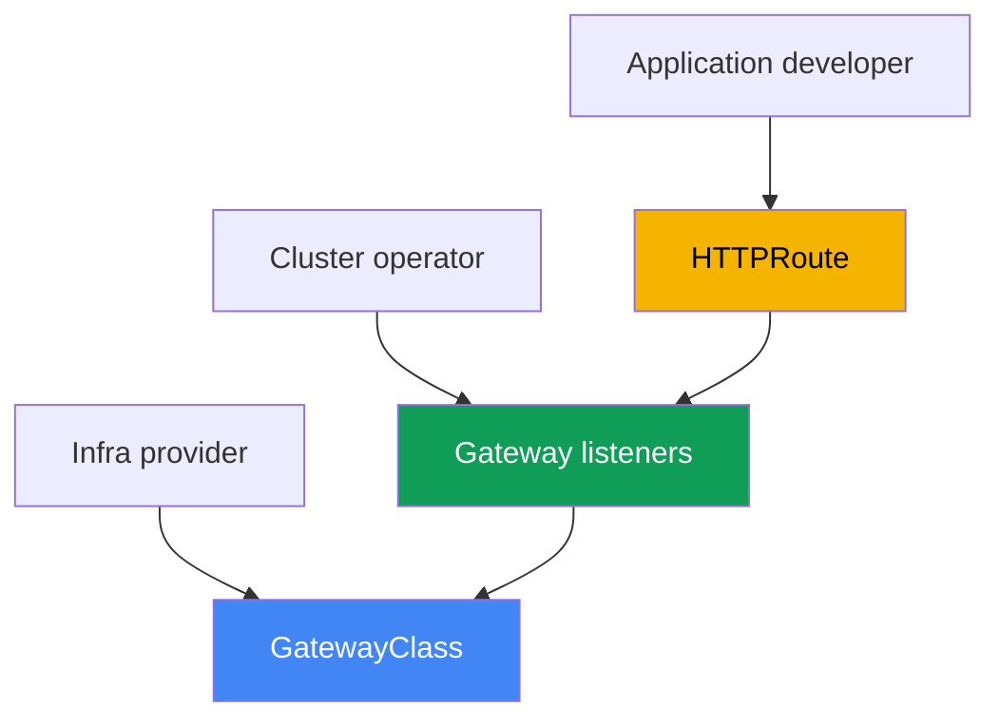
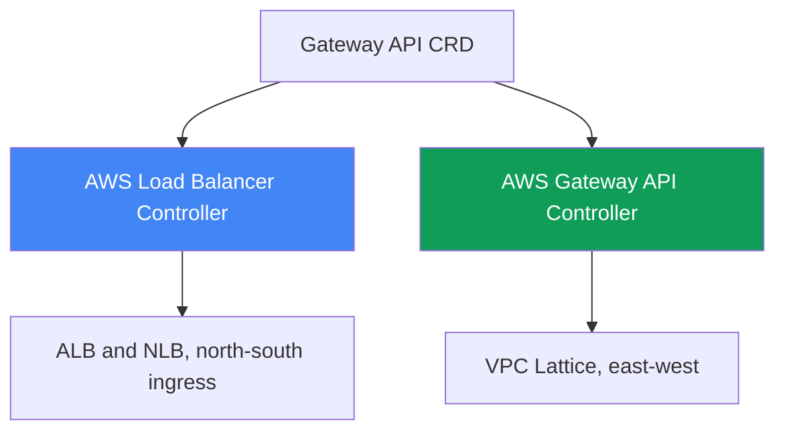
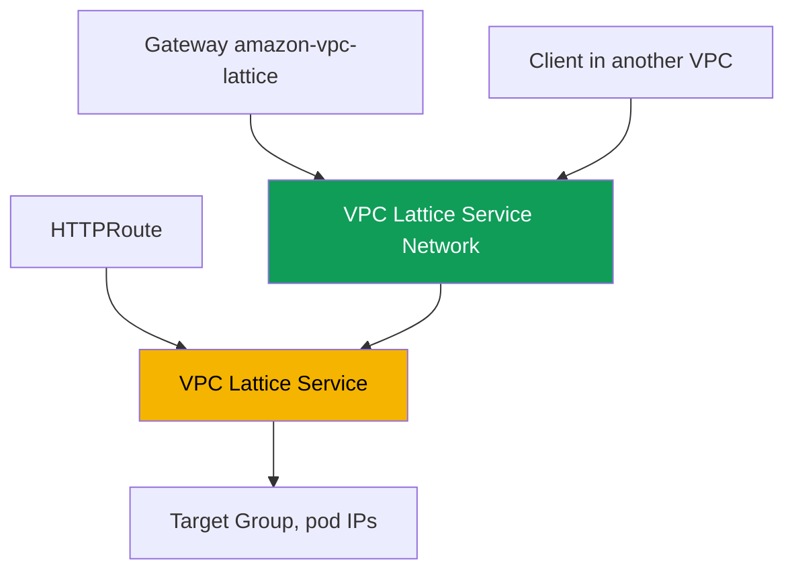

[Русская версия](ru.md) · [Versión en español](es.md) · [Version française](fr.md) · [Deutsche Version](de.md) · [ქართული ვერსია](ge.md) · [繁體中文版](tw.md) · [日本語版](jp.md)
# Chapter 28. Gateway API in AWS: ALB Gateway API and VPC Lattice

> **What is next.** Chapters 26 and 27 showed publishing through annotations: a Service of type
> LoadBalancer provided an NLB (Chapter 26), while an Ingress with `ingressClassName: alb` provided
> an ALB (Chapter 27). Here comes Gateway API: a standardized, typed alternative to Ingress with an
> explicit separation of responsibilities between the platform and developers. We examine two AWS
> implementations: the same AWS Load Balancer Controller on top of ALB and NLB, and the AWS Gateway
> API Controller on top of VPC Lattice for connecting services across VPCs and accounts. Ingress and
> ALB remain in Chapter 27, NLB and Service in Chapter 26, external-dns and certificates in Chapter
> 29, and multi-cluster and multi-account in Chapter 32. How a pod gets an IP address (VPC CNI) is
> covered in Chapter 8, and the controller's role (IRSA, Pod Identity) in Chapters 16-17. We refer
> to these topics without repeating them.

## 28.1. "Ingress grew annotations, and roles cannot be separated"

Let us return to the Ingress from Chapter 27. One object describes both application routing (host,
path to services) and all load balancer infrastructure: scheme, TLS, WAF, timeouts, health checks.
All of this lives in annotations with the `alb.ingress.kubernetes.io/` prefix, and a typical
production Ingress looks like this:

```yaml
metadata:
  annotations:
    alb.ingress.kubernetes.io/scheme: internet-facing
    alb.ingress.kubernetes.io/target-type: ip
    alb.ingress.kubernetes.io/listen-ports: '[{"HTTP":80},{"HTTPS":443}]'
    alb.ingress.kubernetes.io/ssl-redirect: '443'
    alb.ingress.kubernetes.io/certificate-arn: arn:aws:acm:...
    alb.ingress.kubernetes.io/wafv2-acl-arn: arn:aws:wafv2:...
    alb.ingress.kubernetes.io/healthcheck-path: /healthz
    # ...another dozen lines
```

There are two problems here. The first is the data model: settings are not typed; they are strings
in annotations, vendor-specific for each implementation, and moving configuration between
implementations is painful. The second is roles: `scheme`, `certificate-arn`, and `wafv2-acl-arn`
belong to the platform team, while `path` and the backend belong to the developer, but everything
is mixed in one object edited by both sides.

And Ingress does not solve a separate class of problems at all. Ingress and ALB are ingress from
the outside (north-south). When a service in one VPC needs to call a service in another VPC or
account (east-west), Ingress does not help: you would need to provision a load balancer at the
perimeter, configure VPC peering, and deal with CIDR overlaps. AWS has a separate application
networking service for this: VPC Lattice. One standard solves both tasks: Gateway API.

## 28.2. Gateway API as a standard: typed resources and roles

Gateway API is the official Kubernetes standard for traffic management and the successor to
Ingress. Instead of one object with annotations, it introduces several typed resources, each with
its own owner:

- **GatewayClass** is an implementation template, analogous to IngressClass. It is created by the
  infra provider: it specifies the `controllerName` that binds the class to a specific controller.
  A developer does not touch it.
- **Gateway** is a specific entry point: listeners (`listeners`) with a protocol, port, and TLS.
  Its owner is the cluster operator (the platform team). Infrastructure decisions live here.
- **HTTPRoute** (as well as **TLSRoute**, **TCPRoute**, **UDPRoute**, and **GRPCRoute**) contains
  routing rules by host, path, and headers to backend services. Its owner is the developer. A Route
  refers to a Gateway through `parentRefs`, while a Gateway permits attachment through
  `allowedRoutes`.



Why this is better than Ingress. First, separation of roles: the platform owns the Gateway and
certificates, while the developer owns only their HTTPRoute, and they do not edit the same object.
Second, typing: what was a string in an Ingress annotation (headers, methods, weights, redirects)
becomes schema fields with validation in Gateway API. Third, portability: the same HTTPRoute works
on top of any implementation, while the Gateway hides infrastructure specifics. Some vendor
settings still move into CRDs, but application routing remains standard.

Separation of roles divides teams by namespace, which raises the issue of a cross-namespace
reference. If an HTTPRoute in its namespace refers to a backend Service in another namespace
(`backendRefs` with the `namespace` field), the reference is denied by default. Otherwise, a
developer could route traffic to another team's service. The owner of the target namespace grants
permission using a **ReferenceGrant** resource: it sits next to the backend and names the
namespaces and resource types from which the reference is permitted.

```yaml
apiVersion: gateway.networking.k8s.io/v1beta1
kind: ReferenceGrant
metadata:
  name: allow-from-app
  namespace: backend        # target backend namespace
spec:
  from:
    - {group: gateway.networking.k8s.io, kind: HTTPRoute, namespace: app}
  to:
    - {group: "", kind: Service}
```

The same mechanism permits a Gateway's `certificateRefs` to refer to a Secret in another
namespace. In contrast, attachment of a Route to a Gateway across a namespace boundary is
permitted not by ReferenceGrant, but by `allowedRoutes` on the Gateway itself; a grant is required
only for `backendRefs` and `certificateRefs`.

## 28.3. Two Gateway API implementations in AWS

Gateway API is only an interface (a set of CRDs). The `controllerName` in GatewayClass determines
who actually makes the cloud conform to it. AWS has two different implementations for different
tasks, and it is important not to confuse them:

1. **AWS Load Balancer Controller** (the same one from Chapters 26-27) implements Gateway API on
   top of Elastic Load Balancing: L7 routes are served by ALB and L4 routes by NLB. This is ingress
   from the outside (north-south), an alternative to Ingress and a Service of type LoadBalancer in
   the Gateway API language.
2. **AWS Gateway API Controller** (the `aws-application-networking-k8s` project) implements
   Gateway API on top of **VPC Lattice**. This is service-to-service connectivity (east-west)
   between VPCs and accounts, which perimeter ALB and NLB do not provide.



Both implementations are installed side by side: through LBC, one cluster publishes a frontend
externally on an ALB and at the same time reaches backends in neighboring accounts through VPC
Lattice. Their GatewayClasses differ, so the same Gateway cannot accidentally be handled by the
wrong controller.

## 28.4. ALB and NLB through AWS Load Balancer Controller

Beginning with version `2.13` (L4 routes) and `2.14` (L7 routes), and in the `3.0` branch already
as a generally available (GA) capability, LBC can process Gateway API resources. The architecture
is split: separate controller instances work for L4 and L7, and the distinction is made through
`controllerName` in GatewayClass:

- `gateway.k8s.aws/alb` is L7. Such a Gateway creates an **ALB**; `HTTPRoute` and `GRPCRoute`
  become listeners and rules.
- `gateway.k8s.aws/nlb` is L4. Such a Gateway creates an **NLB**; `TCPRoute`, `UDPRoute`, and
  `TLSRoute` become NLB listeners.

You cannot mix layers on one Gateway: `HTTPRoute` and `TCPRoute` cannot coexist on one load
balancer. Here is a minimal L7 chain example: GatewayClass, Gateway with two listeners, and an
HTTPRoute to a service:

```yaml
apiVersion: gateway.networking.k8s.io/v1
kind: GatewayClass
metadata:
  name: aws-alb
spec:
  controllerName: gateway.k8s.aws/alb
---
apiVersion: gateway.networking.k8s.io/v1
kind: Gateway
metadata:
  name: web
spec:
  gatewayClassName: aws-alb
  listeners:
    - {name: http, protocol: HTTP, port: 80}
---
apiVersion: gateway.networking.k8s.io/v1
kind: HTTPRoute
metadata:
  name: app
spec:
  parentRefs:
    - {kind: Gateway, name: web, sectionName: http}
  rules:
    - backendRefs:
        - {name: frontend, port: 80}
```

Vendor-specific ALB settings not included in the Gateway API standard are moved not to annotations
but to typed controller CRDs (the `gateway.k8s.aws` group): `LoadBalancerConfiguration` (scheme,
TLS certificate, listener attributes), `TargetGroupConfiguration` (target group health checks),
and `ListenerRuleConfiguration` (rule conditions such as `source-ip`). A certificate is specified
through `LoadBalancerConfiguration` or certificate discovery by the listener's `hostname`; it
cannot yet be specified through a Gateway's `certificateRefs` field. As in Chapters 26-27, the
controller requires an IAM role on its ServiceAccount (IRSA or Pod Identity, Chapters 16-17); no
separate controller is required because the same LBC that handles Ingress handles Gateway. The ALB
Gateway implementation does not cover the entire standard: some filters (CORS, mirroring,
timeouts) are unsupported in ALB.

## 28.5. VPC Lattice through AWS Gateway API Controller

VPC Lattice is a fully managed application networking service built into AWS infrastructure. It
connects, secures, and observes traffic between services within one VPC and across different VPCs
and accounts, without sidecars, VPC peering, or a load balancer at the perimeter. It also avoids
CIDR overlap: connectivity goes through the Lattice service itself, not through routing between
networks.

AWS Gateway API Controller (the `aws-application-networking-k8s` project) translates Kubernetes
resources into VPC Lattice objects. It is installed in the
`aws-application-networking-system` namespace, usually through Helm, and creates a GatewayClass
named `amazon-vpc-lattice`. Resource mapping:

- A **Gateway** (the `amazon-vpc-lattice` class) maps to a VPC Lattice **Service Network**, a
  logical boundary for a collection of services. It is created by the cluster operator.
- An **HTTPRoute** (or `GRPCRoute`, `TLSRoute`) maps to a **VPC Lattice Service**, an application
  service with its own listener and rules. It is created by the developer.
- A Kubernetes Service from `backendRefs` becomes a VPC Lattice **Target Group**, and its targets
  are pod IPs (registered directly, analogous to `target-type: ip`).



After applying the manifests, the HTTPRoute receives the
`application-networking.k8s.aws/lattice-assigned-domain-name` annotation with a DNS name such as
`<name>-<suffix>.vpc-lattice-svcs.<region>.on.aws`. A client whose VPC is associated with the same
Service Network reaches the service through that name, regardless of the cluster, VPC, or account
where the target pods live.

## 28.6. VPC Lattice: cross-VPC, cross-account, and IAM auth

It is useful to keep the key VPC Lattice concepts in mind when reading statuses and ARNs. A Service
is an application unit with target groups, listeners, and rules. A Service Network is a boundary
that contains services and with which client VPCs are associated: a client and service in one
Service Network can communicate if authorized. Service Directory is a registry of all services,
both your own and shared.

Connectivity between accounts is built through **AWS Resource Access Manager (RAM)**: a Service
Network or an individual service is shared to another account, where it is associated with a local
VPC, and pods in the two accounts communicate without creating peering. For cross-cluster
scenarios, the controller provides its own `ServiceExport` and `ServiceImport` CRDs: a service is
exported from one cluster and imported into another, after which it can be referenced in an
HTTPRoute (including with weights for blue/green traffic between clusters, Chapter 32).

VPC Lattice performs authentication and authorization through **IAM auth policies**, policies in
IAM format that describe who can access which service (principal, action, condition), but for
traffic between services rather than AWS API access. The controller expresses them through an
`IAMAuthPolicy` resource attached to a Gateway (Service Network level) or a Route (service level).
A crucial coverage limitation: today the controller works only for east-west (mesh) traffic; use
AWS Load Balancer Controller for ingress from the outside with ALB and NLB features (Chapter 27).

## 28.7. What to choose: Ingress or Gateway API, ALB or Lattice

The first comparison is whether to move from Ingress to Gateway API on top of the same LBC. Ingress
is simpler and thoroughly battle-tested; Gateway API provides roles, typing, and portability, but
is newer and does not cover every ALB feature.

| Criterion | Ingress + ALB (Chapter 27) | Gateway API + LBC (ALB/NLB) |
|---|---|---|
| Objects | one Ingress + annotations | GatewayClass, Gateway, Route |
| Separation of roles | no, everything in one object | yes, different owners |
| Configuration typing | strings in annotations | schema fields and CRDs |
| L4 (TCP/UDP) | no, only Service (Chapter 26) | yes, NLB through TCP/UDPRoute |
| Maturity | stable, many years | newer, some ALB features are not covered |

The second comparison is between the two implementations themselves. This is not a choice of
"which is better," but "which task": ingress from the outside or communication between services
within and across networks.

| Criterion | LBC (ALB/NLB) | VPC Lattice (Gateway API Controller) |
|---|---|---|
| Direction | north-south, ingress from the outside | east-west, service-to-service |
| Foundation | ALB and NLB (ELB) | VPC Lattice |
| GatewayClass | `gateway.k8s.aws/alb` and `/nlb` | `amazon-vpc-lattice` |
| Between VPCs and accounts | no, perimeter only | yes, through Service Network and RAM |
| Traffic authorization | WAF, Cognito/OIDC on ALB | IAM auth policies |
| CIDR overlap | requires routing | avoided, connectivity through the service |

A rough rule: when publishing a website or API externally, use Gateway API on top of LBC (or,
for now, Ingress, Chapter 27); when connecting microservices across VPCs and accounts without
peering, use VPC Lattice.

## 28.8. Before adoption: CRDs, permissions, and what Lattice is not

Both controllers are separate installations, not ready-made EKS managed add-ons. Before using
their resources, install the standard upstream Gateway API CRDs in the cluster; otherwise,
Gateway and HTTPRoute simply cannot be created. LBC additionally installs its own
`gateway.k8s.aws` group CRDs, while Gateway API Controller installs
`application-networking.k8s.aws` group CRDs (`IAMAuthPolicy`, `ServiceExport`, `ServiceImport`,
`TargetGroupPolicy`, `VpcAssociationPolicy`).

Both controllers require IAM permissions (IRSA or Pod Identity, Chapters 16-17): LBC needs ELB
permissions, as in Chapters 26-27; Gateway API Controller needs permissions for the
`vpc-lattice` API. Be candid about maturity: Gateway API support in LBC is relatively new, so
check the controller documentation for exact versions and the list of supported features before
migrating production workloads.

The main point to remember: VPC Lattice is **not** an ALB at the perimeter. It does not replace
external ingress, does not terminate public HTTPS for browsers, and (together with this controller)
is aimed at east-west traffic. If the task is to accept traffic from the internet, use ALB or NLB;
Lattice lives behind them, between your services.

## 28.9. How this is used in production

- **Roles through objects rather than RBAC workarounds.** The platform owns GatewayClass and
  Gateway (scheme, TLS, certificates); developers own only HTTPRoute. Route attachment is
  restricted through `allowedRoutes` on the Gateway.
- **Migrate gradually.** Create new services with Gateway API on top of LBC and leave old ones on
  Ingress (Chapter 27), while both patterns run in parallel on one controller.
- **Use VPC Lattice for east-west across VPCs and accounts.** Build cross-account connectivity
  through Service Network and AWS RAM rather than peering and a perimeter load balancer.
- **Restrict service-to-service access with IAM auth policies.** Describe permissions with
  `IAMAuthPolicy` on a Gateway or Route rather than opening a security group to an entire range.
- **Use ServiceExport and ServiceImport for cross-cluster traffic.** Export a shared service from
  one cluster and import it into another, distributing traffic by weights (Chapter 32).
- **Do not mix L4 and L7 on one Gateway.** Create a Gateway of the `alb` class for HTTP/gRPC and
  one of the `nlb` class for TCP/UDP/TLS, as separate objects.

## 28.10. Mini-glossary

- **Gateway API** is the Kubernetes standard for traffic management, the successor to Ingress: a
  set of typed resources with separation of roles.
- **GatewayClass** is an implementation template with a `controllerName` field; it determines
  which controller processes a Gateway (analogous to IngressClass).
- **Gateway** is an entry point with listeners (protocol, port, TLS); its owner is the platform
  team. In VPC Lattice, it maps to a Service Network.
- **HTTPRoute** contains backend routing rules by host, path, and headers; it refers to a Gateway
  through `parentRefs`. In VPC Lattice, it maps to a VPC Lattice Service.
- **AWS Load Balancer Controller (Gateway API)** is the implementation with `controllerName`
  `gateway.k8s.aws/alb` (ALB, L7) and `gateway.k8s.aws/nlb` (NLB, L4).
- **VPC Lattice** is a managed application networking service for east-west connectivity across
  VPCs and accounts without sidecars and peering.
- **AWS Gateway API Controller** is the `aws-application-networking-k8s` controller with the
  `amazon-vpc-lattice` GatewayClass; it translates Gateway API into VPC Lattice objects.
- **Service Network** is the VPC Lattice boundary for a collection of services; client VPCs are
  associated with it to access the services.
- **IAM auth policy** is an IAM-format policy for authorizing traffic between services; in the
  controller, it is an `IAMAuthPolicy` resource.
- **ReferenceGrant** is a Gateway API resource in the target resource's namespace; it permits
  cross-namespace references (`backendRefs`, `certificateRefs`) from listed namespaces.

## 28.11. Chapter summary

- Ingress mixes application routing and load balancer infrastructure in one object; all settings
  are untyped annotations, platform and developer roles are not separated, and it does not solve
  east-west connectivity between VPCs.
- Gateway API is the standard successor to Ingress: typed GatewayClass (infra provider), Gateway
  (cluster operator), HTTPRoute, and other Routes (developer), plus roles, typing, and
  portability.
- AWS has two implementations: AWS Load Balancer Controller (north-south ingress on ALB and NLB)
  and AWS Gateway API Controller on top of VPC Lattice (east-west across VPCs and accounts).
- LBC distinguishes layers through `controllerName`: `gateway.k8s.aws/alb` (L7, ALB, HTTPRoute,
  and GRPCRoute) and `gateway.k8s.aws/nlb` (L4, NLB, TCP/UDP/TLSRoute). You cannot mix layers on
  one Gateway, and vendor settings reside in `gateway.k8s.aws` group CRDs.
- The VPC Lattice controller provides the `amazon-vpc-lattice` GatewayClass: Gateway -> Service
  Network, HTTPRoute -> VPC Lattice Service, Kubernetes Service -> Target Group with pod IPs.
- Connectivity between accounts is built through Service Network and AWS RAM without peering, and
  cross-cluster connectivity through ServiceExport and ServiceImport; authorization is through IAM
  auth policies (`IAMAuthPolicy`).
- VPC Lattice does not replace ALB at the perimeter: the controller targets east-west traffic,
  while external ingress and public TLS remain with ALB and NLB (Section 28.4 and Chapter 27).

## 28.12. How this helps in real work

During an incident, the first question when troubleshooting Gateway API is whose resource it is.
Look at `controllerName` in GatewayClass: `gateway.k8s.aws/alb` or `/nlb` means LBC and ELB,
while `amazon-vpc-lattice` means VPC Lattice, and diagnosis then proceeds through different
services. If Gateway does not reach `PROGRAMMED: True`, check whether the Gateway API CRDs and the
required controller are installed and whether its role has permissions (`AccessDenied` in the
logs), as in Chapters 26-27. If an HTTPRoute is not accepted, inspect `parentRefs` and
`allowedRoutes` on the Gateway: the Route may have been denied due to its namespace. If the Route
is accepted but a backend in another namespace does not resolve, its `ResolvedRefs` condition is
`False` with reason `RefNotPermitted`: a ReferenceGrant is missing next to the backend. For VPC
Lattice, add its own checks: whether a DNS name appeared in the `lattice-assigned-domain-name`
annotation, whether the client VPC is associated with the Service Network, and whether an IAM auth
policy denies the request.

When planning, settle two decisions in advance. First are role boundaries: who owns the Gateway
and certificates, and who is allowed only HTTPRoute; that is the key benefit of moving from
Ingress. Second is traffic direction: design external ingress with LBC (ALB/NLB) and
service-to-service connectivity across VPCs and accounts with VPC Lattice, without trying to make
one replace the other. Remember maturity as well: the list of Gateway API features covered by the
controllers changes, so verify it against the current documentation before migrating production
workloads.

## 28.13. Self-check questions

1. What two problems of annotation-based Ingress does Gateway API solve, and why are roles important?
2. What do GatewayClass, Gateway, and HTTPRoute describe, and who owns each resource?
3. How does a Gateway determine which controller serves it, and what does `controllerName` have to do with it?
4. How is Gateway API better than Ingress in typing and portability, and what is its downside today?
5. What two Gateway API implementations exist in AWS, and which tasks does each serve?
6. Which `controllerName` values does LBC use for ALB and NLB, and which Routes belong to them?
7. Why can L4 and L7 routes not be mixed on one Gateway in LBC?
8. Where does LBC place vendor-specific ALB settings instead of Ingress annotations?
9. What is VPC Lattice, and how does east-west connectivity differ from ingress through ALB?
10. What does the controller map Gateway, HTTPRoute, and Kubernetes Service to in VPC Lattice?
11. How do you connect services in different accounts without VPC peering?
12. What do IAM auth policies do, and which objects are they attached to?
13. Why is VPC Lattice not a replacement for ALB at the perimeter?
14. Why is ReferenceGrant needed, and in which namespace is it created?

## Practice

The course lab for this topic: [Lab 128 - Gateway API in AWS: ALB Gateway API and VPC
Lattice](../../labs/128/README.MD). It installs both implementations side by side in one cluster:
a `Gateway` of the `aws-alb` class provisions an ALB and distributes `HTTPRoute` routes, while a
`Gateway` of the `amazon-vpc-lattice` class maps to a Service Network. It separately practices a
cross-namespace reference: a route receives `RefNotPermitted` until the backend owner grants a
`ReferenceGrant`; it also demonstrates that the implementation, not the API server, enforces this
rule. Validate the result with the `check_result` command.

Below is what it makes sense to inspect on any cluster of your own. First, see which GatewayClasses
are available and which controller is behind each one:

```bash
kubectl get gatewayclass
kubectl get gatewayclass -o custom-columns=NAME:.metadata.name,CTRL:.spec.controllerName
```

For LBC (the controller was already installed in Chapters 26-27), create a GatewayClass with
`controllerName: gateway.k8s.aws/alb`, a Gateway with one HTTP listener, and an HTTPRoute to a
test service, then wait for the address and status:

```bash
kubectl get gateway web -o wide          # ADDRESS and PROGRAMMED must be populated
kubectl describe gateway web             # listener events and status
kubectl get httproute app -o yaml        # status.parents - whether the Route was accepted
aws elbv2 describe-load-balancers        # an ALB will appear on the AWS side
```

If AWS Gateway API Controller is installed, inspect its VPC Lattice side: a Gateway of the
`amazon-vpc-lattice` class must correspond to a Service Network, and the HTTPRoute must receive a
DNS name.

```bash
kubectl get gateway               # CLASS = amazon-vpc-lattice, PROGRAMMED = True
kubectl get httproute rates -o yaml | grep lattice-assigned-domain-name
aws vpc-lattice list-service-networks
aws vpc-lattice list-service-network-vpc-associations --vpc-id <vpc-id>
```

Verify that the name in `lattice-assigned-domain-name` resolves and that the client VPC is
associated with the Service Network. View logs as usual: `deploy/aws-load-balancer-controller` in
the `kube-system` namespace for LBC, and `deploy/gateway-api-controller` in
`aws-application-networking-system`.

---
[Table of contents](../README.md) · [Chapter 27](../27/en.md) · [Chapter 29](../29/en.md)
