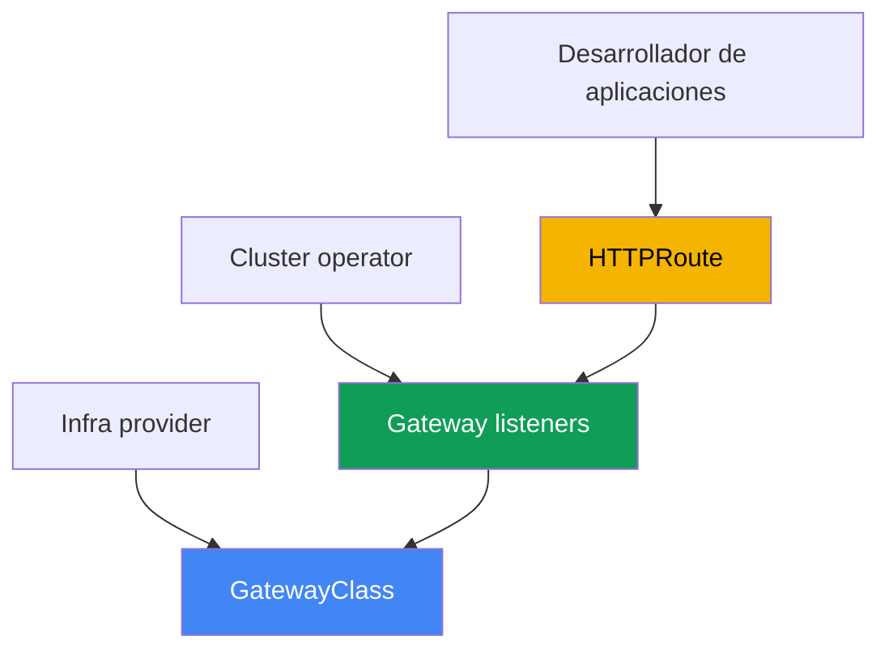
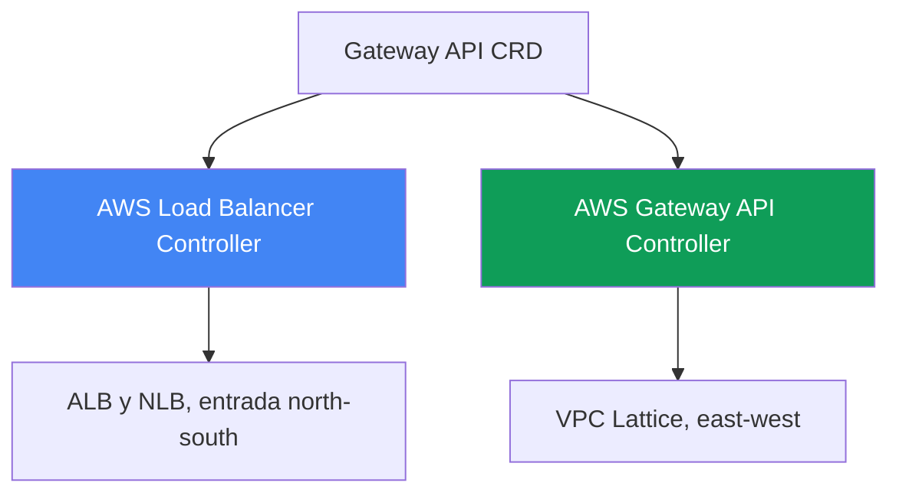
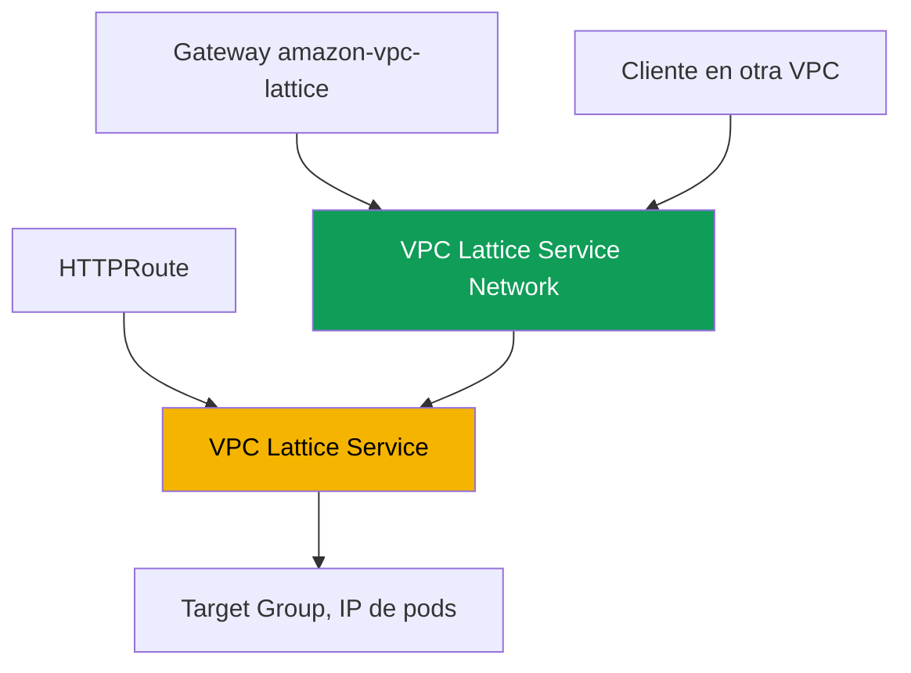

[English version](en.md) · [Русская версия](ru.md) · [Version française](fr.md) · [Deutsche Version](de.md) · [ქართული ვერსია](ge.md) · [繁體中文版](tw.md) · [日本語版](jp.md)
# Capítulo 28. Gateway API en AWS: ALB Gateway API y VPC Lattice

> **Qué sigue.** Los capítulos 26 y 27 mostraron la publicación mediante anotaciones: un Service de tipo
> LoadBalancer proporcionaba un NLB (capítulo 26), un Ingress con `ingressClassName: alb` proporcionaba
> un ALB (capítulo 27). Aquí tratamos Gateway API: una alternativa estandarizada y tipada a Ingress con
> una separación explícita de roles entre la plataforma y los desarrolladores. Analizamos dos
> implementaciones en AWS: el mismo AWS Load Balancer Controller sobre ALB y NLB, y AWS Gateway API
> Controller sobre VPC Lattice para conectar servicios entre VPC y cuentas. Ingress y ALB permanecen en
> el capítulo 27, NLB y Service en el capítulo 26, external-dns y certificados en el capítulo 29,
> multiclúster y multicuenta en el capítulo 32. Cómo un pod obtiene una IP (VPC CNI) está en el capítulo
> 8, y el rol del controlador (IRSA, Pod Identity) en los capítulos 16-17. Se hace referencia a estos
> temas sin repetirlos.

## 28.1. «Ingress se llenó de anotaciones y no permite separar los roles»

Volvamos al Ingress del capítulo 27. Un objeto describe tanto el enrutamiento de la aplicación (host,
path a servicios) como toda la infraestructura del balanceador: esquema, TLS, WAF, timeouts, health
check. Todo ello vive en anotaciones con el prefijo `alb.ingress.kubernetes.io/`, y un Ingress típico de
producción tiene este aspecto:

```yaml
metadata:
  annotations:
    alb.ingress.kubernetes.io/scheme: internet-facing
    alb.ingress.kubernetes.io/target-type: ip
    alb.ingress.kubernetes.io/listen-ports: '[{"HTTP":80},{"HTTPS":443}]'
    alb.ingress.kubernetes.io/ssl-redirect: '443'
    alb.ingress.kubernetes.io/certificate-arn: arn:aws:acm:...
    alb.ingress.kubernetes.io/wafv2-acl-arn: arn:aws:wafv2:...
    alb.ingress.kubernetes.io/healthcheck-path: /healthz
    # ...otras diez líneas
```

Aquí hay dos problemas. El primero es el esquema de datos: los ajustes no están tipados, son cadenas en
anotaciones, distintos para cada proveedor, y trasladar una configuración entre implementaciones es
complicado. El segundo son los roles: `scheme`, `certificate-arn`, `wafv2-acl-arn` pertenecen al equipo
de plataforma, mientras que `path` y backend pertenecen al desarrollador, pero todo está mezclado en un
solo objeto que ambas partes modifican.

Y hay una clase independiente de tareas que Ingress no resuelve en absoluto. Ingress y ALB son entrada
desde el exterior (north-south). Cuando un servicio en una VPC necesita llamar a un servicio en otra VPC
o cuenta (east-west), Ingress no ayuda: habría que levantar un balanceador en el perímetro, configurar
VPC peering y lidiar con solapamientos de CIDR. Para ello AWS cuenta con un servicio independiente de
red de aplicaciones: VPC Lattice. Un mismo estándar resuelve ambas tareas: Gateway API.

## 28.2. Gateway API como estándar: recursos tipados y roles

Gateway API es el estándar oficial de Kubernetes para gestionar tráfico, sucesor de Ingress. En lugar de
un objeto con anotaciones, introduce varios recursos tipados y cada uno tiene su propietario:

- **GatewayClass**: plantilla de implementación, análoga a IngressClass. La crea el infra provider
  (proveedor de infraestructura): indica el `controllerName`, que asociará la clase a un controlador
  específico. El desarrollador no la modifica.
- **Gateway**: punto de entrada concreto: listeners (`listeners`) con protocolo, puerto y TLS. Su
  propietario es el cluster operator (equipo de plataforma). Aquí residen las decisiones de
  infraestructura.
- **HTTPRoute** (así como **TLSRoute**, **TCPRoute**, **UDPRoute**, **GRPCRoute**): reglas de
  enrutamiento por host, path y encabezados hacia servicios backend. Su propietario es el desarrollador.
  Route se refiere a Gateway mediante `parentRefs`, y Gateway permite la conexión mediante
  `allowedRoutes`.



Por qué esto es mejor que Ingress. Primero, la separación de roles: la plataforma posee Gateway y los
certificados; el desarrollador solo sus HTTPRoute, y no editan el mismo objeto. Segundo, el tipado: lo
que en Ingress era una cadena en una anotación (encabezados, métodos, pesos, redirecciones), en Gateway
API son campos del esquema con validación. Tercero, la portabilidad: los mismos HTTPRoute funcionan
sobre cualquier implementación, y Gateway oculta la especificidad de infraestructura. Parte de los
ajustes de proveedor sigue trasladándose a CRD, pero el enrutamiento de la aplicación sigue siendo
estándar.

La separación de roles distribuye los equipos por namespace, y aquí aparece una referencia entre
namespaces. Si un HTTPRoute en su namespace se refiere a un Service backend de otro (`backendRefs` con
el campo `namespace`), la referencia está prohibida por defecto, pues de otro modo un desarrollador
podría dirigir tráfico a un servicio ajeno. El propietario del namespace de destino concede el permiso
mediante el recurso **ReferenceGrant**: reside junto al backend e indica desde qué namespace y clases de
recursos se permite la referencia.

```yaml
apiVersion: gateway.networking.k8s.io/v1beta1
kind: ReferenceGrant
metadata:
  name: allow-from-app
  namespace: backend        # namespace del backend de destino
spec:
  from:
    - {group: gateway.networking.k8s.io, kind: HTTPRoute, namespace: app}
  to:
    - {group: "", kind: Service}
```

El mismo mecanismo permite `certificateRefs` de Gateway a un Secret de otro namespace. En cambio, la
conexión de Route a Gateway a través de la frontera de namespace no la permite ReferenceGrant, sino
`allowedRoutes` en el propio Gateway; el grant solo es necesario para `backendRefs` y
`certificateRefs`.

## 28.3. Dos implementaciones de Gateway API en AWS

Gateway API es solo una interfaz (un conjunto de CRD). Quién lleva realmente el estado de la nube al
estado deseado lo decide `controllerName` en GatewayClass. AWS tiene dos implementaciones distintas para
tareas diferentes, y es importante no confundirlas:

1. **AWS Load Balancer Controller** (el mismo de los capítulos 26-27) implementa Gateway API sobre
   Elastic Load Balancing: las rutas L7 las atiende ALB, las rutas L4 NLB. Es entrada desde el exterior
   (north-south), una alternativa a Ingress y a Service de tipo LoadBalancer en el lenguaje de Gateway
   API.
2. **AWS Gateway API Controller** (el proyecto `aws-application-networking-k8s`) implementa Gateway
   API sobre **VPC Lattice**. Es comunicación servicio a servicio (east-west) entre VPC y cuentas, algo
   que ALB y NLB en el perímetro no hacen.



Ambas implementaciones se instalan juntas: un clúster publica el frontend al exterior en ALB mediante
LBC y, al mismo tiempo, llega a backends en cuentas vecinas mediante VPC Lattice. Sus GatewayClass son
distintas, por lo que un mismo Gateway no llegará accidentalmente a un controlador ajeno.

## 28.4. ALB y NLB mediante AWS Load Balancer Controller

Desde la versión `2.13` (rutas L4) y `2.14` (rutas L7), y en la rama `3.0` ya como funcionalidad de
disponibilidad general (GA), LBC puede procesar recursos Gateway API. La arquitectura es doble: bajo L4
y L7 operan instancias independientes del controlador, y la separación pasa por el `controllerName` de
GatewayClass:

- `gateway.k8s.aws/alb`: L7. Este Gateway crea un **ALB**, y las rutas `HTTPRoute` y `GRPCRoute` se
  convierten en listeners y reglas.
- `gateway.k8s.aws/nlb`: L4. Este Gateway crea un **NLB**, y las rutas `TCPRoute`, `UDPRoute`,
  `TLSRoute` se convierten en listeners de NLB.

No se pueden mezclar niveles en un Gateway: `HTTPRoute` y `TCPRoute` no coexisten en el mismo
balanceador. Un ejemplo mínimo de una cadena L7 es GatewayClass, Gateway con dos listeners y HTTPRoute
hacia un servicio:

```yaml
apiVersion: gateway.networking.k8s.io/v1
kind: GatewayClass
metadata:
  name: aws-alb
spec:
  controllerName: gateway.k8s.aws/alb
---
apiVersion: gateway.networking.k8s.io/v1
kind: Gateway
metadata:
  name: web
spec:
  gatewayClassName: aws-alb
  listeners:
    - {name: http, protocol: HTTP, port: 80}
---
apiVersion: gateway.networking.k8s.io/v1
kind: HTTPRoute
metadata:
  name: app
spec:
  parentRefs:
    - {kind: Gateway, name: web, sectionName: http}
  rules:
    - backendRefs:
        - {name: frontend, port: 80}
```

Los ajustes de proveedor para ALB que no existen en el estándar Gateway API no se colocan en
anotaciones, sino en CRD tipados del controlador (grupo `gateway.k8s.aws`):
`LoadBalancerConfiguration` (esquema, certificado TLS, atributos del listener),
`TargetGroupConfiguration` (health check del target group), `ListenerRuleConfiguration` (condiciones de
reglas como `source-ip`). El certificado se configura mediante `LoadBalancerConfiguration` o mediante
descubrimiento de certificados según el `hostname` del listener; todavía no se hace mediante el campo
`certificateRefs` de Gateway. Como en los capítulos 26-27, el controlador necesita un rol IAM para
ServiceAccount (IRSA o Pod Identity, capítulos 16-17); no se requiere un controlador separado, Gateway
lo atiende el mismo LBC que Ingress. Aun así, la implementación ALB Gateway no cubre todo el estándar:
parte de los filtros (CORS, mirroring, timeouts) no se admite en ALB.

## 28.5. VPC Lattice mediante AWS Gateway API Controller

VPC Lattice es un servicio completamente administrado de red de aplicaciones (application networking),
integrado en la infraestructura de AWS. Conecta, protege y observa el tráfico entre servicios dentro de
una VPC y entre diferentes VPC y cuentas, sin sidecars, sin VPC peering y sin un balanceador en el
perímetro. También evita el solapamiento de CIDR: la comunicación pasa por el propio servicio Lattice y
no por el enrutamiento entre redes.

AWS Gateway API Controller (el proyecto `aws-application-networking-k8s`) traduce recursos de Kubernetes
en objetos de VPC Lattice. Se instala en el namespace `aws-application-networking-system`, normalmente
mediante Helm, y crea una GatewayClass llamada `amazon-vpc-lattice`. Correspondencia de recursos:

- **Gateway** (clase `amazon-vpc-lattice`) se asigna a una **Service Network** de VPC Lattice, el límite
  lógico para un conjunto de servicios. Lo crea el cluster operator.
- **HTTPRoute** (o `GRPCRoute`, `TLSRoute`) se asigna a un **VPC Lattice Service**, un servicio de
  aplicación con su propio listener y reglas. Lo crea el desarrollador.
- El Service de Kubernetes de `backendRefs` se convierte en un **Target Group** de VPC Lattice, y sus
  targets son IP de pods (se registran directamente, análogo a `target-type: ip`).



Después de aplicar los manifiestos, HTTPRoute recibe la anotación
`application-networking.k8s.aws/lattice-assigned-domain-name` con un nombre DNS de la forma
`<name>-<suffix>.vpc-lattice-svcs.<region>.on.aws`. Mediante él, un cliente cuya VPC está asociada a la
misma Service Network llega al servicio, independientemente de en qué clúster, VPC o cuenta vivan los
pods target.

## 28.6. VPC Lattice: cross-VPC, cross-account e IAM auth

Es útil tener presentes los conceptos clave de VPC Lattice al leer estados y ARN. Un servicio (Service)
es una unidad de aplicación con target groups, listeners y rules. Service Network es el límite al que
pertenecen los servicios y con el que se asocian las VPC de los clientes: el cliente y el servicio en una
misma Service Network pueden comunicarse si están autorizados. Service Directory es el registro de todos
los servicios, propios y compartidos.

La conexión entre cuentas se construye mediante **AWS Resource Access Manager (RAM)**: se comparte una
Service Network o un servicio individual con otra cuenta, allí se asocia con una VPC local, y los pods de
las dos cuentas se comunican sin crear peering. Para escenarios entre clústeres, el controlador ofrece
sus propios CRD `ServiceExport` y `ServiceImport`: un servicio se exporta desde un clúster y se importa
en otro, tras lo cual se puede referenciar desde HTTPRoute (incluso con pesos para blue/green entre
clústeres, capítulo 32).

VPC Lattice realiza autenticación y autorización mediante **IAM auth policies**, políticas en formato IAM
que describen quién puede acceder a qué servicio (principal, action, condition), pero para tráfico entre
servicios, no para la API de AWS. El controlador las expresa con el recurso `IAMAuthPolicy`, vinculable a
Gateway (nivel Service Network) o a Route (nivel de servicio). Una limitación importante de alcance: hoy
el controlador solo opera sobre tráfico east-west (mesh); para entrada exterior con funcionalidades de
ALB y NLB se utiliza AWS Load Balancer Controller (capítulo 27).

## 28.7. Qué elegir: Ingress o Gateway API, ALB o Lattice

La primera comparación es si conviene pasar de Ingress a Gateway API sobre el mismo LBC. Ingress es más
simple y está completamente probado; Gateway API ofrece roles, tipado y portabilidad, pero es más joven
y no cubre todas las funcionalidades de ALB.

| Criterio | Ingress + ALB (capítulo 27) | Gateway API + LBC (ALB/NLB) |
|---|---|---|
| Objetos | un Ingress + anotaciones | GatewayClass, Gateway, Route |
| Separación de roles | no, todo en un objeto | sí, propietarios distintos |
| Tipado de ajustes | cadenas en anotaciones | campos del esquema y CRD |
| L4 (TCP/UDP) | no, solo Service (capítulo 26) | sí, NLB mediante TCP/UDPRoute |
| Madurez | estable, muchos años | más reciente, parte de las funcionalidades de ALB no está cubierta |

La segunda comparación es entre las dos implementaciones. No se trata de elegir «cuál es mejor», sino
«qué tarea»: entrada desde el exterior o comunicación entre servicios dentro de las redes y entre ellas.

| Criterio | LBC (ALB/NLB) | VPC Lattice (Gateway API Controller) |
|---|---|---|
| Dirección | north-south, entrada desde el exterior | east-west, servicio a servicio |
| Base | ALB y NLB (ELB) | VPC Lattice |
| GatewayClass | `gateway.k8s.aws/alb` y `/nlb` | `amazon-vpc-lattice` |
| Entre VPC y cuentas | no, solo perímetro | sí, mediante Service Network y RAM |
| Autorización de tráfico | WAF, Cognito/OIDC en ALB | IAM auth policies |
| Solapamiento de CIDR | requiere enrutamiento | se evita, la conexión pasa por el servicio |

Regla general: si publica un sitio o API al exterior, Gateway API sobre LBC (o por ahora Ingress,
capítulo 27); si conecta microservicios entre VPC y cuentas sin peering, VPC Lattice.

## 28.8. Antes de implementar: CRD, permisos y lo que Lattice no es

Ambos controladores son instalaciones separadas, no complementos administrados listos de EKS. Antes de
sus recursos, se instalan en el clúster los CRD estándar de Gateway API (upstream); de otro modo,
simplemente no se crearán Gateway y HTTPRoute. LBC instala además sus propios CRD del grupo
`gateway.k8s.aws`, y Gateway API Controller los CRD del grupo `application-networking.k8s.aws`
(`IAMAuthPolicy`, `ServiceExport`, `ServiceImport`, `TargetGroupPolicy`, `VpcAssociationPolicy`).

Ambos controladores necesitan permisos IAM (IRSA o Pod Identity, capítulos 16-17): LBC para ELB, como en
los capítulos 26-27; Gateway API Controller para la API `vpc-lattice`. En cuanto a madurez, hay que ser
honestos: el soporte de Gateway API en LBC es relativamente nuevo; compruebe las versiones exactas y la
lista de funcionalidades cubiertas en la documentación del controlador antes de migrar producción.

Lo principal que debe quedar claro: VPC Lattice **no** es un ALB en el perímetro. No sustituye la entrada
externa, no termina HTTPS público para navegadores y, junto con este controlador, está orientado a
east-west. Si la tarea es aceptar tráfico de Internet, se trata de ALB o NLB; Lattice vive detrás de
ellos, entre sus servicios.

## 28.9. Cómo se usa en producción

- **Roles mediante objetos, no mediante soluciones de RBAC.** La plataforma posee GatewayClass y Gateway
  (esquema, TLS, certificados), los desarrolladores solo HTTPRoute; la conexión de rutas se restringe
  mediante `allowedRoutes` en Gateway.
- **Migración gradual.** Los servicios nuevos se crean con Gateway API sobre LBC, los antiguos se dejan en
  Ingress (capítulo 27), mientras ambos esquemas operan en paralelo sobre un controlador.
- **VPC Lattice para east-west entre VPC y cuentas.** La conectividad entre cuentas se realiza mediante
  Service Network y AWS RAM, no mediante peering y un balanceador en el perímetro.
- **El acceso entre servicios se restringe con IAM auth policies.** Los permisos se describen con
  `IAMAuthPolicy` en Gateway o Route, y no abriendo un security group a todo el rango.
- **Cross-cluster mediante ServiceExport y ServiceImport.** Un servicio compartido se exporta desde un
  clúster y se importa en otro, distribuyendo el tráfico con pesos (capítulo 32).
- **L4 y L7 no se mezclan en un Gateway.** Para HTTP/gRPC se crea un Gateway de clase `alb`, para
  TCP/UDP/TLS uno de clase `nlb`, como objetos separados.

## 28.10. Miniglosario

- **Gateway API**: estándar de Kubernetes para gestionar tráfico, sucesor de Ingress; conjunto de recursos
  tipados con separación de roles.
- **GatewayClass**: plantilla de implementación con el campo `controllerName`; determina qué controlador
  procesará Gateway (análoga a IngressClass).
- **Gateway**: punto de entrada con listeners (protocolo, puerto, TLS); su propietario es el equipo de
  plataforma. En VPC Lattice se asigna a Service Network.
- **HTTPRoute**: reglas de enrutamiento por host, path y encabezados hacia backend; se refiere a Gateway
  mediante `parentRefs`. En VPC Lattice se asigna a VPC Lattice Service.
- **AWS Load Balancer Controller (Gateway API)**: implementación con `controllerName`
  `gateway.k8s.aws/alb` (ALB, L7) y `gateway.k8s.aws/nlb` (NLB, L4).
- **VPC Lattice**: servicio administrado de red de aplicaciones para comunicación east-west entre VPC y
  cuentas sin sidecars ni peering.
- **AWS Gateway API Controller**: controlador `aws-application-networking-k8s`, GatewayClass
  `amazon-vpc-lattice`, traduce Gateway API en objetos de VPC Lattice.
- **Service Network**: límite de VPC Lattice para un conjunto de servicios; las VPC de clientes se asocian
  a ella para acceder a los servicios.
- **IAM auth policy**: política en formato IAM para autorizar tráfico entre servicios; en el controlador,
  recurso `IAMAuthPolicy`.
- **ReferenceGrant**: recurso Gateway API en el namespace del recurso de destino; permite referencias
  entre namespaces (`backendRefs`, `certificateRefs`) desde los namespace enumerados.

## 28.11. Resumen del capítulo

- Ingress mezcla en un objeto el enrutamiento de la aplicación y la infraestructura del balanceador; todos
  los ajustes son anotaciones no tipadas, los roles de plataforma y desarrollador no están separados y no
  resuelve la conexión east-west entre VPC.
- Gateway API es un estándar sucesor de Ingress: GatewayClass tipado (infra provider), Gateway (cluster
  operator), HTTPRoute y otros Route (desarrollador), además de roles, tipado y portabilidad.
- En AWS hay dos implementaciones: AWS Load Balancer Controller (entrada north-south en ALB y NLB) y AWS
  Gateway API Controller sobre VPC Lattice (east-west entre VPC y cuentas).
- LBC diferencia los niveles por `controllerName`: `gateway.k8s.aws/alb` (L7, ALB, HTTPRoute y
  GRPCRoute) y `gateway.k8s.aws/nlb` (L4, NLB, TCP/UDP/TLSRoute); no se pueden mezclar niveles en un
  Gateway, y los ajustes de proveedor van a los CRD del grupo `gateway.k8s.aws`.
- El controlador VPC Lattice proporciona GatewayClass `amazon-vpc-lattice`: Gateway -> Service Network,
  HTTPRoute -> VPC Lattice Service, Service de Kubernetes -> Target Group con IP de pods.
- La conexión entre cuentas se construye mediante Service Network y AWS RAM sin peering, la comunicación
  cross-cluster mediante ServiceExport y ServiceImport y la autorización mediante IAM auth policies
  (`IAMAuthPolicy`).
- VPC Lattice no reemplaza ALB en el perímetro: el controlador se orienta a east-west, mientras la entrada
  externa y TLS público permanecen en ALB y NLB (sección 28.4 y capítulo 27).

## 28.12. Cómo resulta útil en el trabajo real

Durante una guardia, la primera pregunta al investigar Gateway API es de quién es el recurso. Se revisa
`controllerName` en GatewayClass: `gateway.k8s.aws/alb` o `/nlb` corresponde a LBC y ELB,
`amazon-vpc-lattice` a VPC Lattice, y el diagnóstico continúa por servicios diferentes. Si Gateway no
pasa a `PROGRAMMED: True`, compruebe si los CRD de Gateway API y el controlador necesario están
instalados y si su rol tiene permisos (`AccessDenied` en los logs), como en los capítulos 26-27. Si
HTTPRoute no se acepta, revise `parentRefs` y `allowedRoutes` en Gateway: Route pudo no superar la
frontera de namespace. Si Route se acepta pero el backend de otro namespace no se resuelve, su condición
`ResolvedRefs` pasa a `False` con reason `RefNotPermitted`: falta ReferenceGrant junto al backend. Para
VPC Lattice se añade una comprobación: si apareció un nombre DNS en la anotación
`lattice-assigned-domain-name`, si la VPC cliente está asociada a Service Network y si IAM auth policy no
bloquea la solicitud.

Al planificar, mantenga preparadas dos decisiones. La primera son los límites de roles: quién posee
Gateway y los certificados, y a quién se deja solo HTTPRoute; esta es la principal ganancia de migrar
desde Ingress. La segunda es la dirección del tráfico: la entrada desde el exterior se diseña en LBC
(ALB/NLB), y la comunicación entre servicios entre VPC y cuentas en VPC Lattice, sin intentar resolver
una con la otra. Y recuerde la madurez: la lista de funcionalidades de Gateway API que cubren los
controladores cambia, así que se comprueba con la documentación actual antes de migrar producción.

## 28.13. Preguntas de autoevaluación

1. ¿Qué dos problemas de Ingress con anotaciones resuelve Gateway API y por qué importan los roles?
2. ¿Qué describen GatewayClass, Gateway y HTTPRoute y quién es el propietario de cada recurso?
3. ¿Cómo entiende Gateway qué controlador lo atiende y qué relación tiene `controllerName` con ello?
4. ¿En qué es Gateway API mejor que Ingress en tipado y portabilidad, y cuál es hoy su inconveniente?
5. ¿Qué dos implementaciones de Gateway API existen en AWS y para qué tareas sirve cada una?
6. ¿Qué `controllerName` usa LBC para ALB y para NLB, y qué Route corresponde a cada uno?
7. ¿Por qué no se pueden mezclar rutas L4 y L7 en un Gateway de LBC?
8. ¿Dónde coloca LBC los ajustes de proveedor de ALB en lugar de las anotaciones de Ingress?
9. ¿Qué es VPC Lattice y en qué se diferencia la comunicación east-west de la entrada mediante ALB?
10. ¿A qué asigna el controlador Gateway, HTTPRoute y Service de Kubernetes en VPC Lattice?
11. ¿Cómo conectar servicios entre cuentas diferentes sin VPC peering?
12. ¿Qué hacen las IAM auth policies y a qué objetos se vinculan?
13. ¿Por qué VPC Lattice no es un reemplazo de ALB en el perímetro?
14. ¿Para qué sirve ReferenceGrant y en qué namespace se crea?

## Práctica

El laboratorio del curso para este tema: [laboratorio 128: Gateway API en AWS: ALB Gateway API y VPC
Lattice](../../labs/128/README_ES.MD). Allí ambas implementaciones se instalan juntas en un clúster:
`Gateway` de clase `aws-alb` levanta ALB y distribuye rutas `HTTPRoute`, mientras que `Gateway` de clase
`amazon-vpc-lattice` se asigna a Service Network. También se practica por separado una referencia entre
namespaces: la ruta recibe `RefNotPermitted` hasta que el propietario del backend proporciona
`ReferenceGrant`, y además se ve que es la implementación, no el servidor API, quien respeta esta regla.
El resultado se verifica con el comando `check_result`.

A continuación se indica qué conviene consultar en cualquiera de sus clústeres. Primero, qué GatewayClass
están disponibles y qué controlador hay tras cada una:

```bash
kubectl get gatewayclass
kubectl get gatewayclass -o custom-columns=NAME:.metadata.name,CTRL:.spec.controllerName
```

Para LBC (el controlador de los capítulos 26-27 ya estaba instalado), cree una GatewayClass con
`controllerName: gateway.k8s.aws/alb`, Gateway con un HTTP-listener y HTTPRoute hacia un servicio de
prueba; después espere la dirección y el estado:

```bash
kubectl get gateway web -o wide          # ADDRESS y PROGRAMMED deben estar rellenados
kubectl describe gateway web             # eventos y estado de los listeners
kubectl get httproute app -o yaml        # status.parents: si Route fue aceptado
aws elbv2 describe-load-balancers        # aparecerá un ALB en AWS
```

Si AWS Gateway API Controller está instalado, revise su lado de VPC Lattice: Gateway de clase
`amazon-vpc-lattice` debe corresponder a Service Network, y HTTPRoute debe recibir un nombre DNS.

```bash
kubectl get gateway               # CLASS = amazon-vpc-lattice, PROGRAMMED = True
kubectl get httproute rates -o yaml | grep lattice-assigned-domain-name
aws vpc-lattice list-service-networks
aws vpc-lattice list-service-network-vpc-associations --vpc-id <vpc-id>
```

Compruebe que el nombre en `lattice-assigned-domain-name` se resuelve y que la VPC cliente está asociada
a Service Network. Consulte los logs como de costumbre: `deploy/aws-load-balancer-controller` en el
namespace `kube-system` para LBC y `deploy/gateway-api-controller` en
`aws-application-networking-system`.

---
[Índice](../README_ES.md) · [Capítulo 27](../27/es.md) · [Capítulo 29](../29/es.md)
