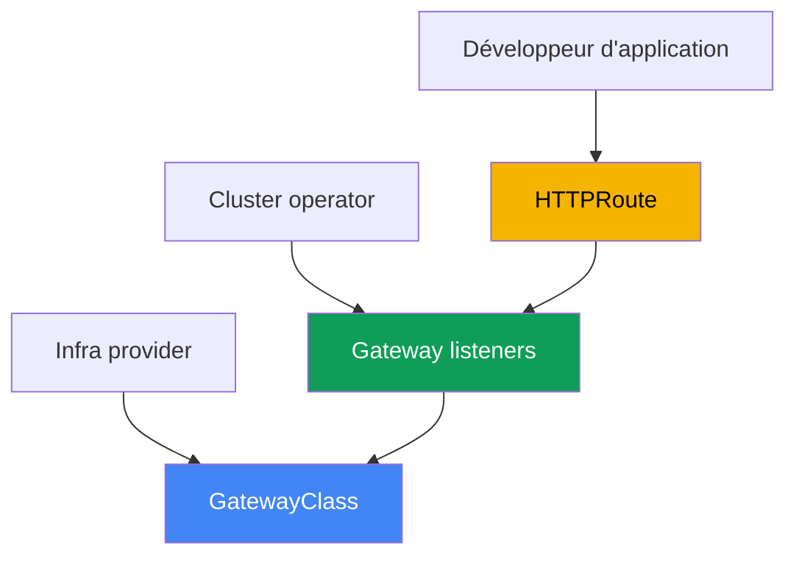
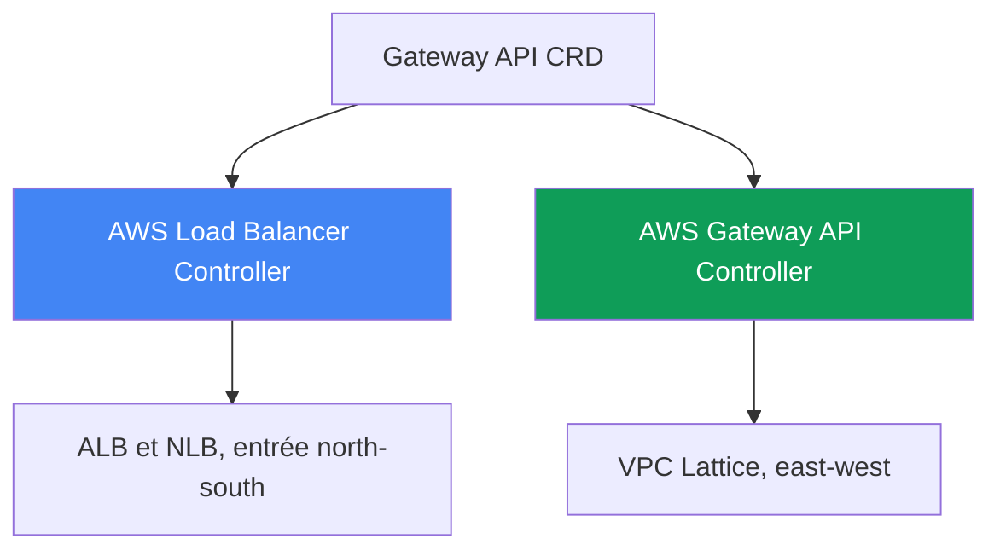
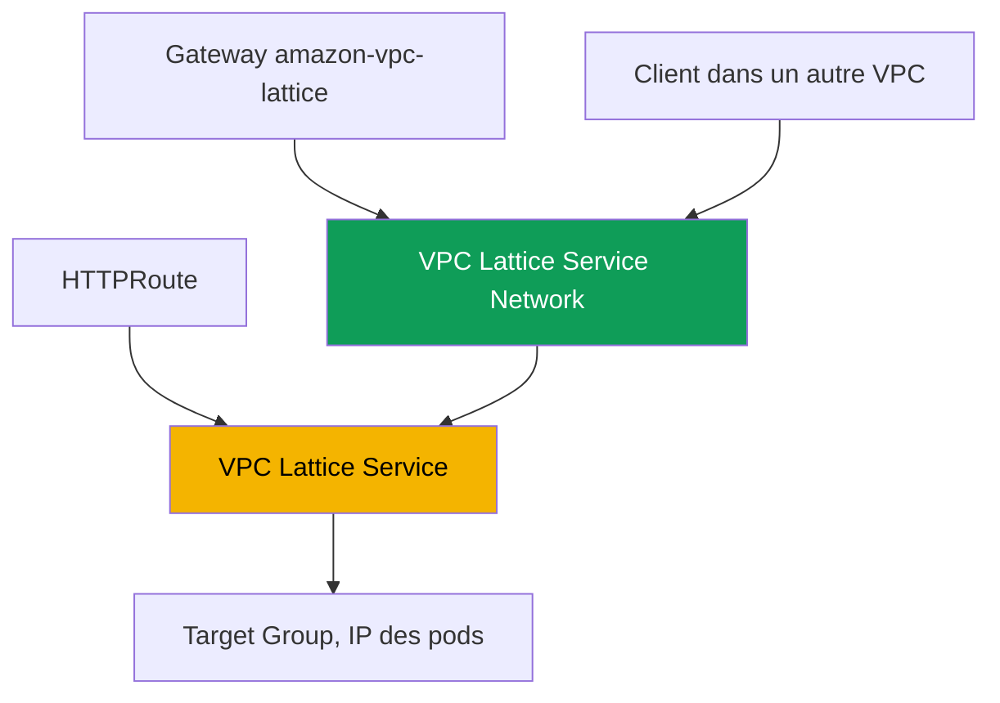

[Русская версия](ru.md) · [Eng version](en.md) · [Versión en español](es.md) · [Deutsche Version](de.md) · [ქართული ვერსია](ge.md) · [繁體中文版](tw.md) · [日本語版](jp.md)
# Chapitre 28. Gateway API dans AWS : ALB Gateway API et VPC Lattice

> **La suite.** Les chapitres 26 et 27 ont montré la publication par annotations : un Service de type
> LoadBalancer fournissait un NLB (chapitre 26), un Ingress avec `ingressClassName: alb` fournissait un ALB
> (chapitre 27). Voici Gateway API : une alternative standardisée et typée à Ingress, avec une séparation
> explicite des rôles entre la plateforme et les développeurs. Nous examinons deux implémentations dans AWS :
> le même AWS Load Balancer Controller au-dessus d'ALB et NLB, et AWS Gateway API Controller au-dessus de
> VPC Lattice pour relier des services entre VPC et comptes. Ingress et ALB restent au chapitre 27, NLB et
> Service au chapitre 26, external-dns et les certificats au chapitre 29, le multicluster et le
> multicomptes au chapitre 32. La façon dont un pod obtient son IP (VPC CNI) est traitée au chapitre 8, le
> rôle du contrôleur (IRSA, Pod Identity) aux chapitres 16-17. Nous renvoyons à ces sujets sans les répéter.

## 28.1. « Ingress s'est encombré d'annotations et les rôles sont indissociables »

Revenons à l'Ingress du chapitre 27. Un seul objet décrit à la fois le routage applicatif (host, path
vers les services) et toute l'infrastructure de l'équilibreur : schéma, TLS, WAF, délais d'attente,
health check. Tout cela vit dans des annotations préfixées par `alb.ingress.kubernetes.io/`, et un
Ingress de production typique ressemble à ceci :

```yaml
metadata:
  annotations:
    alb.ingress.kubernetes.io/scheme: internet-facing
    alb.ingress.kubernetes.io/target-type: ip
    alb.ingress.kubernetes.io/listen-ports: '[{"HTTP":80},{"HTTPS":443}]'
    alb.ingress.kubernetes.io/ssl-redirect: '443'
    alb.ingress.kubernetes.io/certificate-arn: arn:aws:acm:...
    alb.ingress.kubernetes.io/wafv2-acl-arn: arn:aws:wafv2:...
    alb.ingress.kubernetes.io/healthcheck-path: /healthz
    # ...encore une douzaine de lignes
```

Deux difficultés se présentent ici. La première est le schéma de données : les réglages ne sont pas
 typés, ce sont des chaînes dans les annotations, propres à chaque fournisseur, et transporter une
configuration entre implémentations est pénible. La seconde concerne les rôles : `scheme`,
`certificate-arn`, `wafv2-acl-arn` relèvent de l'équipe plateforme, tandis que `path` et le backend
relèvent du développeur, mais tout est mêlé dans un même objet modifié par les deux parties.

Et toute une classe de tâches n'est pas du tout résolue par Ingress. Ingress et ALB concernent l'entrée
extérieure (north-south). Lorsqu'un service d'un VPC doit appeler un service dans un autre VPC ou compte
(east-west), Ingress n'aide pas : il faudrait installer un équilibreur à la périphérie, configurer le
VPC peering et gérer les chevauchements de CIDR. AWS propose pour cela un service distinct de réseau
applicatif : VPC Lattice. Un même standard couvre les deux besoins : Gateway API.

## 28.2. Gateway API comme standard : ressources typées et rôles

Gateway API est le standard officiel de Kubernetes pour la gestion du trafic, successeur d'Ingress. Au
lieu d'un objet unique avec des annotations, il introduit plusieurs ressources typées, chacune avec son
propre propriétaire :

- **GatewayClass** : un modèle d'implémentation, analogue à IngressClass. Le infra provider
  (fournisseur d'infrastructure) le crée : il indique le `controllerName` qui lie la classe à un
  contrôleur particulier. Le développeur n'y touche pas.
- **Gateway** : un point d'entrée concret, avec des écouteurs (`listeners`) dotés d'un protocole, d'un
  port et de TLS. Son propriétaire est le cluster operator (équipe plateforme). Les décisions
  d'infrastructure sont prises ici.
- **HTTPRoute** (ainsi que **TLSRoute**, **TCPRoute**, **UDPRoute**, **GRPCRoute**) : règles de
  routage par host, path et en-têtes vers les services backend. Leur propriétaire est le développeur.
  Route référence Gateway par `parentRefs`, et Gateway autorise le rattachement par `allowedRoutes`.



Pourquoi cela est-il préférable à Ingress ? Premièrement, la séparation des rôles : la plateforme est
propriétaire du Gateway et des certificats, le développeur ne possède que ses HTTPRoute, et ils ne
modifient pas le même objet. Deuxièmement, le typage : ce qui était une chaîne dans une annotation
Ingress (en-têtes, méthodes, poids, redirections) devient dans Gateway API des champs de schéma
validés. Troisièmement, la portabilité : les mêmes HTTPRoute fonctionnent au-dessus de toute
implémentation, tandis que Gateway masque la spécificité de l'infrastructure. Une partie des réglages
propres au fournisseur est toujours déplacée vers des CRD, mais le routage applicatif reste standard.

La séparation des rôles répartit les équipes entre les namespaces, ce qui soulève la question de la
référence inter-namespace. Si une HTTPRoute de son namespace référence un Service backend dans un autre
(champ `namespace` dans `backendRefs`), la référence est interdite par défaut, sinon un développeur
pourrait diriger le trafic vers le service d'autrui. Le propriétaire du namespace cible l'autorise au
moyen d'une ressource **ReferenceGrant** : elle se trouve à côté du backend et nomme les namespaces et
les types de ressources d'où la référence est admise.

```yaml
apiVersion: gateway.networking.k8s.io/v1beta1
kind: ReferenceGrant
metadata:
  name: allow-from-app
  namespace: backend        # namespace du backend cible
spec:
  from:
    - {group: gateway.networking.k8s.io, kind: HTTPRoute, namespace: app}
  to:
    - {group: "", kind: Service}
```

Le même mécanisme autorise les `certificateRefs` d'un Gateway vers un Secret d'un autre namespace. En
revanche, le rattachement de Route à Gateway à travers une frontière de namespace n'est pas autorisé par
ReferenceGrant, mais par `allowedRoutes` sur le Gateway lui-même ; le grant est requis uniquement pour
`backendRefs` et `certificateRefs`.

## 28.3. Deux implémentations de Gateway API dans AWS

Gateway API n'est qu'une interface (un ensemble de CRD). Le `controllerName` dans GatewayClass détermine
qui met effectivement le cloud en conformité. AWS propose deux implémentations distinctes pour des
besoins différents, qu'il importe de ne pas confondre :

1. **AWS Load Balancer Controller** (le même qu'aux chapitres 26-27) implémente Gateway API sur
   Elastic Load Balancing : les routes L7 sont servies par ALB, les routes L4 par NLB. C'est l'entrée
   extérieure (north-south), alternative à Ingress et au Service de type LoadBalancer dans le langage de
   Gateway API.
2. **AWS Gateway API Controller** (projet `aws-application-networking-k8s`) implémente Gateway API sur
   **VPC Lattice**. C'est la communication de service à service (east-west) entre VPC et comptes, ce que
   les ALB et NLB à la périphérie ne font pas.



Les deux implémentations sont installées côte à côte : via LBC, un même cluster publie le frontend à
l'extérieur sur un ALB et, simultanément, accède via VPC Lattice aux backends de comptes voisins. Leurs
GatewayClass sont différents ; un même Gateway ne peut donc pas être accidentellement traité par le
mauvais contrôleur.

## 28.4. ALB et NLB via AWS Load Balancer Controller

Depuis la version `2.13` (routes L4) et `2.14` (routes L7), et dans la branche `3.0` déjà comme
fonctionnalité généralement disponible (GA), LBC sait traiter les ressources Gateway API. L'architecture
est double : des instances distinctes du contrôleur opèrent pour L4 et L7, et la séparation se fait par
le `controllerName` dans GatewayClass :

- `gateway.k8s.aws/alb` : L7. Un tel Gateway crée un **ALB**, les routes `HTTPRoute` et `GRPCRoute` se
  transforment en listeners et règles.
- `gateway.k8s.aws/nlb` : L4. Un tel Gateway crée un **NLB**, les routes `TCPRoute`, `UDPRoute`,
  `TLSRoute` se transforment en listeners NLB.

Il est impossible de mélanger les niveaux dans un même Gateway : `HTTPRoute` et `TCPRoute` ne cohabitent
pas sur le même équilibreur. Voici un exemple minimal de chaîne L7 : GatewayClass, Gateway avec deux
listeners et HTTPRoute vers un service :

```yaml
apiVersion: gateway.networking.k8s.io/v1
kind: GatewayClass
metadata:
  name: aws-alb
spec:
  controllerName: gateway.k8s.aws/alb
---
apiVersion: gateway.networking.k8s.io/v1
kind: Gateway
metadata:
  name: web
spec:
  gatewayClassName: aws-alb
  listeners:
    - {name: http, protocol: HTTP, port: 80}
---
apiVersion: gateway.networking.k8s.io/v1
kind: HTTPRoute
metadata:
  name: app
spec:
  parentRefs:
    - {kind: Gateway, name: web, sectionName: http}
  rules:
    - backendRefs:
        - {name: frontend, port: 80}
```

Les réglages ALB propres au fournisseur, absents du standard Gateway API, sont placés non dans des
annotations, mais dans les CRD typés du contrôleur (groupe `gateway.k8s.aws`) :
`LoadBalancerConfiguration` (schéma, certificat TLS, attributs de listener),
`TargetGroupConfiguration` (health check du target group), `ListenerRuleConfiguration` (conditions de
règle telles que `source-ip`). Le certificat est défini par `LoadBalancerConfiguration` ou par
certificate discovery selon le `hostname` du listener ; cela ne se fait pas encore au moyen du champ
`certificateRefs` du Gateway. Comme aux chapitres 26-27, le contrôleur requiert un rôle IAM sur le
ServiceAccount (IRSA ou Pod Identity, chapitres 16-17) ; aucun contrôleur distinct n'est nécessaire :
le même LBC que pour Ingress sert Gateway. Cette implémentation ALB Gateway ne couvre toutefois pas tout
le standard : certains filtres (CORS, mirroring, timeouts) ne sont pas pris en charge dans ALB.

## 28.5. VPC Lattice via AWS Gateway API Controller

VPC Lattice est un service entièrement géré de réseau applicatif (application networking), intégré à
l'infrastructure AWS. Il relie, sécurise et observe le trafic entre services au sein d'un VPC et entre
différents VPC et comptes, sans sidecars, sans VPC peering et sans équilibreur à la périphérie. Il évite
aussi les chevauchements de CIDR : la communication passe par le service Lattice lui-même, et non par le
routage entre réseaux.

AWS Gateway API Controller (projet `aws-application-networking-k8s`) traduit les ressources Kubernetes
en objets VPC Lattice. Il s'installe dans le namespace `aws-application-networking-system`, généralement
par Helm, et crée une GatewayClass nommée `amazon-vpc-lattice`. Correspondance des ressources :

- **Gateway** (classe `amazon-vpc-lattice`) est mappé sur un **Service Network** VPC Lattice, une limite
  logique pour un ensemble de services. Le cluster operator le crée.
- **HTTPRoute** (ou `GRPCRoute`, `TLSRoute`) est mappée sur un **VPC Lattice Service**, un service
  applicatif avec son propre listener et ses règles. Le développeur le crée.
- Le Service Kubernetes de `backendRefs` devient un **Target Group** VPC Lattice et ses targets sont les
  IP des pods (enregistrées directement, analogue à `target-type: ip`).



Après application des manifestes, HTTPRoute reçoit l'annotation
`application-networking.k8s.aws/lattice-assigned-domain-name` avec un nom DNS du type
`<name>-<suffix>.vpc-lattice-svcs.<region>.on.aws`. Un client dont le VPC est associé au même Service
Network peut ainsi joindre le service, indépendamment du cluster, VPC ou compte où résident les pods
targets.

## 28.6. VPC Lattice : cross-VPC, cross-account et IAM auth

Il est pratique de connaître les notions clés de VPC Lattice lors de la lecture des statuts et des ARN.
Un service (Service) est une unité applicative avec des target groups, listeners et rules. Un Service
Network est la limite qui contient les services et à laquelle les VPC des clients sont associés : un
client et un service dans le même Service Network peuvent communiquer s'ils sont autorisés. Le Service
Directory est le registre de tous les services, propres et partagés.

La liaison entre comptes est construite avec **AWS Resource Access Manager (RAM)** : un Service Network
ou service distinct est partagé avec un autre compte, où il est associé à un VPC local ; les pods des deux
comptes communiquent alors sans créer de peering. Pour les scénarios cross-cluster, le contrôleur propose
ses propres CRD `ServiceExport` et `ServiceImport` : le service est exporté depuis un cluster et importé
dans un autre, après quoi une HTTPRoute peut le référencer (notamment avec des poids pour du blue/green
entre clusters, chapitre 32).

VPC Lattice assure authentification et autorisation via des **IAM auth policies** : politiques au format
IAM décrivant qui peut accéder à quel service (principal, action, condition), mais pour le trafic entre
services et non pour l'API AWS. Le contrôleur les exprime par la ressource `IAMAuthPolicy`, attachée à un
Gateway (niveau Service Network) ou à une Route (niveau service). Limitation importante de couverture :
aujourd'hui le contrôleur ne fonctionne que pour le trafic east-west (mesh) ; pour l'entrée extérieure
avec les fonctionnalités ALB et NLB, on utilise AWS Load Balancer Controller (chapitre 27).

## 28.7. Que choisir : Ingress ou Gateway API, ALB ou Lattice

La première comparaison est de savoir s'il faut passer d'Ingress à Gateway API au-dessus du même LBC.
Ingress est plus simple et totalement éprouvé ; Gateway API apporte rôles, typage et portabilité, mais est
plus récent et ne couvre pas toutes les fonctionnalités ALB.

| Critère | Ingress + ALB (chapitre 27) | Gateway API + LBC (ALB/NLB) |
|---|---|---|
| Objets | un Ingress + annotations | GatewayClass, Gateway, Route |
| Séparation des rôles | non, tout dans un objet | oui, propriétaires différents |
| Typage des réglages | chaînes dans les annotations | champs de schéma et CRD |
| L4 (TCP/UDP) | non, seulement Service (chapitre 26) | oui, NLB via TCP/UDPRoute |
| Maturité | stable, depuis des années | plus récent, certaines fonctionnalités ALB non couvertes |

La seconde comparaison porte sur les deux implémentations elles-mêmes. Ce n'est pas le choix de « ce qui
est meilleur », mais de la tâche : entrée extérieure ou communication des services à l'intérieur et entre
les réseaux.

| Critère | LBC (ALB/NLB) | VPC Lattice (Gateway API Controller) |
|---|---|---|
| Direction | north-south, entrée extérieure | east-west, service à service |
| Base | ALB et NLB (ELB) | VPC Lattice |
| GatewayClass | `gateway.k8s.aws/alb` et `/nlb` | `amazon-vpc-lattice` |
| Entre VPC et comptes | non, uniquement périphérie | oui, via Service Network et RAM |
| Autorisation du trafic | WAF, Cognito/OIDC sur ALB | IAM auth policies |
| Chevauchement CIDR | nécessite du routage | évité, communication par le service |

Règle générale : pour publier un site ou une API à l'extérieur, utilisez Gateway API au-dessus de LBC (ou
encore Ingress, chapitre 27) ; pour relier des microservices entre VPC et comptes sans peering, utilisez
VPC Lattice.

## 28.8. Avant le déploiement : CRD, droits et ce que Lattice n'est pas

Les deux contrôleurs sont des installations distinctes, et non des add-ons EKS managed prêts à l'emploi.
Avant leurs ressources, les CRD standard Gateway API (upstream) sont installées dans le cluster ; sinon
Gateway et HTTPRoute ne pourront tout simplement pas être créés. En plus, LBC installe ses propres CRD du
groupe `gateway.k8s.aws`, et Gateway API Controller les CRD du groupe
`application-networking.k8s.aws` (`IAMAuthPolicy`, `ServiceExport`, `ServiceImport`,
`TargetGroupPolicy`, `VpcAssociationPolicy`).

Les deux contrôleurs nécessitent des droits IAM (IRSA ou Pod Identity, chapitres 16-17) : LBC sur ELB,
comme aux chapitres 26-27 ; Gateway API Controller sur l'API `vpc-lattice`. Concernant la maturité, il
faut être honnête : la prise en charge de Gateway API dans LBC est relativement récente ; vérifiez les
versions précises et la liste des fonctionnalités couvertes dans la documentation du contrôleur avant de
migrer la production.

Le point essentiel à retenir : VPC Lattice n'est **pas** un ALB à la périphérie. Il ne remplace pas
l'entrée externe, ne termine pas le HTTPS public pour les navigateurs et (avec ce contrôleur) vise le
trafic east-west. Si la tâche est d'accepter du trafic depuis Internet, il s'agit d'ALB ou NLB ; Lattice
vit derrière eux, entre vos services.

## 28.9. Application en production

- **Les rôles par les objets, pas par des contournements RBAC.** La plateforme possède GatewayClass et
  Gateway (schéma, TLS, certificats), les développeurs seulement HTTPRoute ; le rattachement des routes
  est limité par `allowedRoutes` sur Gateway.
- **Migration graduelle.** Les nouveaux services sont créés sur Gateway API au-dessus de LBC, les anciens
  restent sur Ingress (chapitre 27), tandis que les deux schémas fonctionnent en parallèle sur un même
  contrôleur.
- **VPC Lattice pour l'east-west entre VPC et comptes.** La connectivité cross-account se fait avec
  Service Network et AWS RAM, et non avec peering et un équilibreur à la périphérie.
- **L'accès entre services est protégé par des IAM auth policies.** Les autorisations sont décrites par
  `IAMAuthPolicy` sur Gateway ou Route, plutôt que d'ouvrir un security group à toute la plage.
- **Cross-cluster par ServiceExport et ServiceImport.** Un service commun est exporté depuis un cluster et
  importé dans l'autre, avec répartition du trafic par poids (chapitre 32).
- **L4 et L7 ne sont pas mélangés sur un Gateway.** Sous HTTP/gRPC, créez un Gateway de classe `alb` ; sous
  TCP/UDP/TLS, un Gateway de classe `nlb`, dans des objets distincts.

## 28.10. Mini-glossaire

- **Gateway API** : standard Kubernetes de gestion du trafic, successeur d'Ingress : ensemble de
  ressources typées avec séparation des rôles.
- **GatewayClass** : modèle d'implémentation avec le champ `controllerName` ; détermine quel contrôleur
  traite Gateway (analogue à IngressClass).
- **Gateway** : point d'entrée avec listeners (protocole, port, TLS) ; son propriétaire est l'équipe
  plateforme. Dans VPC Lattice, il est mappé sur Service Network.
- **HTTPRoute** : règles de routage par host, path et en-têtes vers le backend ; référence Gateway par
  `parentRefs`. Dans VPC Lattice, elle est mappée sur VPC Lattice Service.
- **AWS Load Balancer Controller (Gateway API)** : implémentation avec `controllerName`
  `gateway.k8s.aws/alb` (ALB, L7) et `gateway.k8s.aws/nlb` (NLB, L4).
- **VPC Lattice** : service géré de réseau applicatif pour la communication east-west entre VPC et
  comptes sans sidecars ni peering.
- **AWS Gateway API Controller** : contrôleur `aws-application-networking-k8s`, GatewayClass
  `amazon-vpc-lattice`, traduisant Gateway API en objets VPC Lattice.
- **Service Network** : limite VPC Lattice pour un ensemble de services ; les VPC clients y sont associés
  pour accéder aux services.
- **IAM auth policy** : politique au format IAM d'autorisation du trafic entre services ; dans le
  contrôleur, ressource `IAMAuthPolicy`.
- **ReferenceGrant** : ressource Gateway API dans le namespace de la ressource cible ; autorise les
  références inter-namespace (`backendRefs`, `certificateRefs`) depuis les namespaces listés.

## 28.11. Résumé du chapitre

- Ingress mélange dans un objet le routage applicatif et l'infrastructure de l'équilibreur, tous les
  réglages sont des annotations non typées, les rôles de la plateforme et du développeur ne sont pas
  séparés ; et il ne résout pas la communication east-west entre VPC.
- Gateway API est le standard successeur d'Ingress : GatewayClass typé (infra provider), Gateway (cluster
  operator), HTTPRoute et autres Route (développeur) ; avec rôles, typage et portabilité.
- AWS propose deux implémentations : AWS Load Balancer Controller (entrée north-south sur ALB et NLB) et
  AWS Gateway API Controller au-dessus de VPC Lattice (east-west entre VPC et comptes).
- LBC distingue les niveaux par `controllerName` : `gateway.k8s.aws/alb` (L7, ALB, HTTPRoute et
  GRPCRoute) et `gateway.k8s.aws/nlb` (L4, NLB, TCP/UDP/TLSRoute) ; les niveaux ne peuvent être mélangés
  dans un même Gateway, et les réglages propres au fournisseur sont dans les CRD du groupe
  `gateway.k8s.aws`.
- Le contrôleur VPC Lattice fournit GatewayClass `amazon-vpc-lattice` : Gateway -> Service Network,
  HTTPRoute -> VPC Lattice Service, Kubernetes Service -> Target Group avec IP des pods.
- La communication entre comptes est construite par Service Network et AWS RAM sans peering, le
  cross-cluster par ServiceExport et ServiceImport ; l'autorisation par IAM auth policies
  (`IAMAuthPolicy`).
- VPC Lattice ne remplace pas l'ALB à la périphérie : le contrôleur vise l'east-west, tandis que l'entrée
  extérieure et le TLS public restent assurés par ALB et NLB (section 28.4 et chapitre 27).

## 28.12. Utilité dans le travail réel

En astreinte, la première question lors de l'analyse de Gateway API est de savoir à qui appartient la
ressource. Consultez le `controllerName` dans GatewayClass : `gateway.k8s.aws/alb` ou `/nlb` indique LBC
et ELB, `amazon-vpc-lattice` indique VPC Lattice ; le diagnostic s'effectue ensuite dans des services
différents. Si Gateway ne passe pas à `PROGRAMMED: True`, vérifiez que les CRD Gateway API et le bon
contrôleur sont installés, et que son rôle a les droits nécessaires (`AccessDenied` dans les logs), comme
aux chapitres 26-27. Si HTTPRoute n'est pas acceptée, examinez `parentRefs` et `allowedRoutes` sur
Gateway : Route a peut-être été refusée en raison du namespace. Si Route est acceptée, mais que le
backend dans un autre namespace ne se résout pas, sa condition `ResolvedRefs` passe à `False` avec la
raison `RefNotPermitted` : il manque un ReferenceGrant près du backend. VPC Lattice ajoute ses propres
vérifications : un nom DNS apparaît-il dans l'annotation `lattice-assigned-domain-name`, le VPC du client
est-il associé au Service Network, et une IAM auth policy ne bloque-t-elle pas la requête ?

Lors de la planification, retenez deux choix en amont. Le premier est la frontière des rôles : qui possède
Gateway et les certificats, et à qui l'on laisse seulement HTTPRoute ; c'est le principal gain du passage
d'Ingress. Le second est la direction du trafic : l'entrée extérieure est conçue sur LBC (ALB/NLB), la
communication entre services, VPC et comptes sur VPC Lattice ; n'essayez pas de résoudre l'un par l'autre.
Et gardez à l'esprit la maturité : la liste des fonctionnalités Gateway API couvertes par les contrôleurs
évolue ; avant une migration de production, vérifiez-la dans la documentation actuelle.

## 28.13. Questions d'autoévaluation

1. Quels sont les deux problèmes d'Ingress avec annotations que Gateway API résout, et pourquoi les rôles
   sont-ils importants ?
2. Que décrivent GatewayClass, Gateway et HTTPRoute, et qui est propriétaire de chaque ressource ?
3. Comment Gateway sait-il quel contrôleur le sert, et quel est le rôle de `controllerName` ?
4. En quoi Gateway API est-il supérieur à Ingress pour le typage et la portabilité, et quel est son
   inconvénient actuel ?
5. Quelles sont les deux implémentations de Gateway API dans AWS et quelles tâches vise chacune ?
6. Quels `controllerName` LBC utilise-t-il pour ALB et NLB, et quelles Route s'y rapportent ?
7. Pourquoi ne peut-on pas mélanger les routes L4 et L7 sur le même Gateway avec LBC ?
8. Où LBC place-t-il les réglages ALB propres au fournisseur au lieu des annotations Ingress ?
9. Qu'est-ce que VPC Lattice et en quoi la communication east-west diffère-t-elle de l'entrée par ALB ?
10. En quoi le contrôleur mappe-t-il Gateway, HTTPRoute et Kubernetes Service dans VPC Lattice ?
11. Comment relier des services entre comptes différents sans VPC peering ?
12. Que font les IAM auth policies et à quels objets sont-elles attachées ?
13. Pourquoi VPC Lattice ne remplace-t-il pas l'ALB à la périphérie ?
14. À quoi sert ReferenceGrant et dans quel namespace est-il créé ?

## Pratique

Le laboratoire du cours pour ce sujet : [lab 128 : Gateway API dans AWS : ALB Gateway API et VPC
Lattice](../../labs/128/README_FR.MD). Les deux implémentations y sont installées côte à côte sur un
cluster : un `Gateway` de classe `aws-alb` crée un ALB et distribue les routes `HTTPRoute`, un `Gateway`
de classe `amazon-vpc-lattice` est mappé sur Service Network. Une référence inter-namespace est aussi
travaillée séparément : la route reçoit `RefNotPermitted` jusqu'à ce que le propriétaire du backend
accorde un `ReferenceGrant`, ce qui montre également que c'est l'implémentation, et non l'API server, qui
respecte cette règle. Le résultat est vérifié avec la commande `check_result`.

Voici ce qu'il est pertinent d'examiner sur n'importe quel cluster. Commencez par voir quelles GatewayClass
sont disponibles et quel contrôleur se trouve derrière chacune :

```bash
kubectl get gatewayclass
kubectl get gatewayclass -o custom-columns=NAME:.metadata.name,CTRL:.spec.controllerName
```

Pour LBC (le contrôleur des chapitres 26-27 est déjà installé), créez une GatewayClass avec
`controllerName: gateway.k8s.aws/alb`, un Gateway avec un listener HTTP et une HTTPRoute vers un service
de test, puis attendez l'adresse et le statut :

```bash
kubectl get gateway web -o wide          # ADDRESS et PROGRAMMED doivent être renseignés
kubectl describe gateway web             # événements et statut des listeners
kubectl get httproute app -o yaml        # status.parents : Route est-elle acceptée ?
aws elbv2 describe-load-balancers        # un ALB apparaîtra côté AWS
```

Si AWS Gateway API Controller est installé, examinez sa partie VPC Lattice : un Gateway de classe
`amazon-vpc-lattice` doit correspondre à un Service Network, et un nom DNS doit apparaître sur HTTPRoute.

```bash
kubectl get gateway               # CLASS = amazon-vpc-lattice, PROGRAMMED = True
kubectl get httproute rates -o yaml | grep lattice-assigned-domain-name
aws vpc-lattice list-service-networks
aws vpc-lattice list-service-network-vpc-associations --vpc-id <vpc-id>
```

Vérifiez que le nom dans `lattice-assigned-domain-name` se résout et que le VPC client est associé au
Service Network. Consultez les logs comme d'habitude : `deploy/aws-load-balancer-controller` dans le
namespace `kube-system` pour LBC et `deploy/gateway-api-controller` dans
`aws-application-networking-system`.

---
[Table des matières](../README_FR.md) · [Chapitre 27](../27/fr.md) · [Chapitre 29](../29/fr.md)
