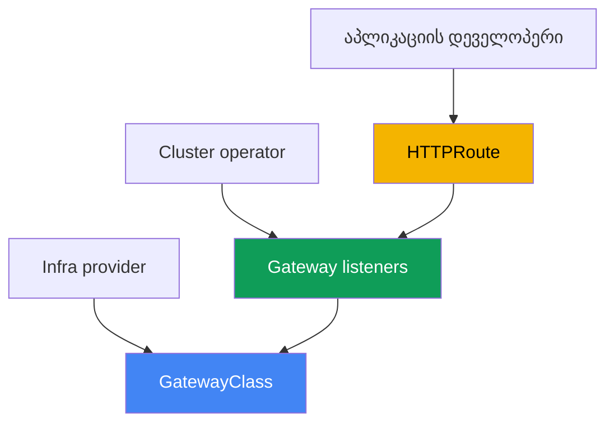
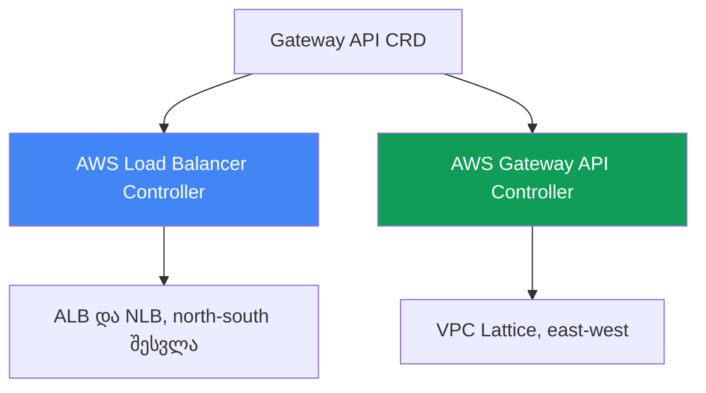
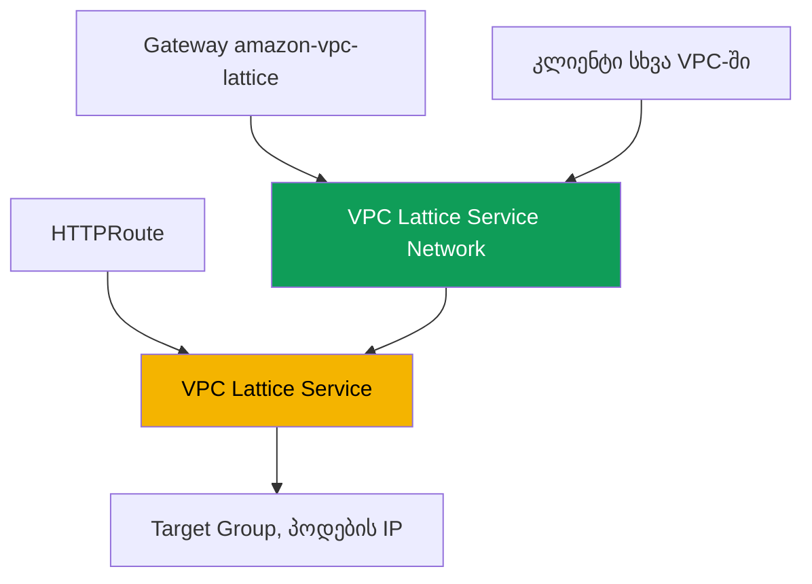

[Русская версия](ru.md) · [Eng version](en.md) · [Versión en español](es.md) · [Version française](fr.md) · [Deutsche Version](de.md) · [繁體中文版](tw.md) · [日本語版](jp.md)
# თავი 28. Gateway API AWS-ში: ALB Gateway API და VPC Lattice

> **რა არის შემდეგ.** 26-ე და 27-ე თავებში ანოტაციების მეშვეობით გამოქვეყნება ვაჩვენეთ:
> LoadBalancer ტიპის Service NLB-ს ქმნიდა (თავი 26), ხოლო Ingress `ingressClassName: alb`-ით
> ALB-ს ქმნიდა (თავი 27). აქ განვიხილავთ Gateway API-ს: Ingress-ის სტანდარტიზებულ, ტიპიზებულ
> ალტერნატივას, რომელიც პლატფორმასა და დეველოპერებს შორის როლებს მკაფიოდ ყოფს. AWS-ში ორ
> რეალიზაციას განვიხილავთ: იგივე AWS Load Balancer Controller-ს ALB-სა და NLB-ზე და AWS Gateway
> API Controller-ს VPC Lattice-ზე, რომელიც VPC-ებსა და ანგარიშებს შორის სერვისების კავშირს
> უზრუნველყოფს. Ingress და ALB 27-ე თავში რჩება, NLB და Service 26-ე თავში, external-dns და
> სერტიფიკატები 29-ე თავში, მულტიკლასტერი და მულტიანგარიში კი 32-ე თავში. როგორ იღებს პოდი IP-ს
> (VPC CNI), განხილულია მე-8 თავში, ხოლო კონტროლერის როლი (IRSA, Pod Identity) მე-16-17 თავებში.
> ამ თემებს მხოლოდ მივუთითებთ და აღარ გავიმეორებთ.

## 28.1. „Ingress ანოტაციებით გადაიტვირთა, როლების გაყოფა კი შეუძლებელია“

დავუბრუნდეთ 27-ე თავის Ingress-ს. ერთი ობიექტი აღწერს როგორც აპლიკაციის მარშრუტიზაციას (host, path
სერვისებისკენ), ისე ბალანსირებლის მთელ ინფრასტრუქტურას: სქემას, TLS-ს, WAF-ს, timeout-ებსა და
health check-ს. ეს ყველაფერი `alb.ingress.kubernetes.io/` პრეფიქსის მქონე ანოტაციებში ცხოვრობს,
ხოლო ტიპური production Ingress ასე გამოიყურება:

```yaml
metadata:
  annotations:
    alb.ingress.kubernetes.io/scheme: internet-facing
    alb.ingress.kubernetes.io/target-type: ip
    alb.ingress.kubernetes.io/listen-ports: '[{"HTTP":80},{"HTTPS":443}]'
    alb.ingress.kubernetes.io/ssl-redirect: '443'
    alb.ingress.kubernetes.io/certificate-arn: arn:aws:acm:...
    alb.ingress.kubernetes.io/wafv2-acl-arn: arn:aws:wafv2:...
    alb.ingress.kubernetes.io/healthcheck-path: /healthz
    # ...კიდევ ათამდე სტრიქონი
```

აქ ორი პრობლემა გვაქვს. პირველი მონაცემთა სქემაა: პარამეტრები ტიპიზებული არ არის, ისინი
ანოტაციებში ჩაწერილი სტრიქონებია, თითოეულ მომწოდებელს საკუთარი აქვს და კონფიგურაციის რეალიზაციებს
შორის გადატანა რთულია. მეორე როლებია: `scheme`, `certificate-arn`, `wafv2-acl-arn` პლატფორმის
გუნდის სფეროა, ხოლო `path` და backend დეველოპერის, მაგრამ ყველაფერი ერთ ობიექტშია შერეული,
რომელსაც ორივე მხარე ცვლის.

Ingress ამოცანების ცალკე კლასს საერთოდ ვერ წყვეტს. Ingress და ALB გარედან შემოსასვლელია
(north-south). როდესაც ერთ VPC-ში არსებულ სერვისს სხვა VPC-ში ან ანგარიშში არსებული სერვისის
გამოძახება სჭირდება (east-west), Ingress ვერ გვეხმარება: საჭირო გახდებოდა პერიმეტრზე ბალანსირებლის
აწევა, VPC peering-ის გამართვა და CIDR-ების გადაკვეთის პრობლემების მოგვარება. ამისთვის AWS-ს
აპლიკაციის ქსელის ცალკე სერვისი აქვს: VPC Lattice. ორივე ამოცანას ერთი სტანდარტი, Gateway API,
ფარავს.

## 28.2. Gateway API როგორც სტანდარტი: ტიპიზებული რესურსები და როლები

Gateway API ტრაფიკის მართვის ოფიციალური Kubernetes სტანდარტი და Ingress-ის მემკვიდრეა. ერთი
ანოტაციებიანი ობიექტის ნაცვლად ის რამდენიმე ტიპიზებულ რესურსს გვთავაზობს, თითოეულს კი თავისი
მფლობელი ჰყავს:

- **GatewayClass** არის რეალიზაციის შაბლონი, IngressClass-ის ანალოგი. მას infra provider
  (ინფრასტრუქტურის მომწოდებელი) ქმნის და უთითებს `controllerName`-ს, რომელიც კლასს კონკრეტულ
  კონტროლერთან დააკავშირებს. დეველოპერი მას არ ეხება.
- **Gateway** არის კონკრეტული შესვლის წერტილი: listener-ები (`listeners`) პროტოკოლით, პორტითა და
  TLS-ით. მფლობელია cluster operator (პლატფორმის გუნდი). ინფრასტრუქტურული გადაწყვეტილებები აქ
  ინახება.
- **HTTPRoute** (ასევე **TLSRoute**, **TCPRoute**, **UDPRoute**, **GRPCRoute**) არის backend
  სერვისებისკენ host-ის, path-ისა და header-ების მიხედვით მარშრუტიზაციის წესები. მფლობელია
  დეველოპერი. Route Gateway-ს `parentRefs`-ის მეშვეობით მიმართავს, Gateway კი მიერთების უფლებას
  `allowedRoutes`-ით გასცემს.



რით სჯობს ეს Ingress-ს. პირველი, როლების გაყოფა: პლატფორმა ფლობს Gateway-სა და სერტიფიკატებს,
დეველოპერი კი მხოლოდ საკუთარ HTTPRoute-ებს, ამიტომ ისინი ერთ ობიექტს არ ცვლიან. მეორე,
ტიპიზაცია: რაც Ingress-ში ანოტაციის სტრიქონი იყო (header-ები, მეთოდები, წონები, redirect-ები),
Gateway API-ში ვალიდაციიანი სქემის ველებია. მესამე, პორტაბელურობა: ერთი და იგივე HTTPRoute
ნებისმიერ რეალიზაციაზე მუშაობს, ინფრასტრუქტურის სპეციფიკას კი Gateway მალავს. მომწოდებლის
პარამეტრების ნაწილი მაინც CRD-ში გადადის, მაგრამ აპლიკაციის მარშრუტიზაცია სტანდარტული რჩება.

როლების გაყოფა გუნდებს სხვადასხვა namespace-ში ანაწილებს და აქ cross-namespace ბმულის საკითხი
ჩნდება. თუ HTTPRoute საკუთარი namespace-იდან სხვა namespace-ში არსებულ backend Service-ს მიმართავს
(`backendRefs` ველით `namespace`), ბმული ნაგულისხმევად აკრძალულია, წინააღმდეგ შემთხვევაში
დეველოპერი ტრაფიკს სხვის სერვისზე მიმართავდა. ნებართვას სამიზნე namespace-ის მფლობელი
**ReferenceGrant** რესურსით გასცემს: ის backend-ის გვერდით მდებარეობს და განსაზღვრავს, რომელი
namespace-ებიდან და რა სახის რესურსებიდან არის ბმული ნებადართული.

```yaml
apiVersion: gateway.networking.k8s.io/v1beta1
kind: ReferenceGrant
metadata:
  name: allow-from-app
  namespace: backend        # სამიზნე backend-ის namespace
spec:
  from:
    - {group: gateway.networking.k8s.io, kind: HTTPRoute, namespace: app}
  to:
    - {group: "", kind: Service}
```

იგივე მექანიზმი Gateway-ის `certificateRefs`-ს სხვა namespace-ში არსებულ Secret-ზე მიმართვის
უფლებას აძლევს. თუმცა namespace-ის საზღვარზე Route-ის Gateway-სთან მიერთებას ReferenceGrant კი
არა, თავად Gateway-ზე არსებული `allowedRoutes` აკონტროლებს; გრანტი მხოლოდ `backendRefs`-ისა და
`certificateRefs`-ისთვის არის საჭირო.

## 28.3. Gateway API-ის ორი რეალიზაცია AWS-ში

Gateway API მხოლოდ ინტერფეისია (CRD-ების ნაკრები). კონკრეტულად ვინ მოიყვანს cloud-ს სასურველ
მდგომარეობაში, ამას GatewayClass-ის `controllerName` განსაზღვრავს. AWS-ში სხვადასხვა ამოცანისთვის
ორი განსხვავებული რეალიზაცია არსებობს და მათი არევა არ შეიძლება:

1. **AWS Load Balancer Controller** (იგივე, რაც 26-ე და 27-ე თავებში) Gateway API-ს Elastic Load
   Balancing-ზე ახორციელებს: L7 მარშრუტებს ALB ემსახურება, L4 მარშრუტებს კი NLB. ეს გარედან
   შესვლაა (north-south), ანუ Ingress-ისა და LoadBalancer ტიპის Service-ის ალტერნატივა Gateway
   API-ის ენაზე.
2. **AWS Gateway API Controller** (პროექტი `aws-application-networking-k8s`) Gateway API-ს
   **VPC Lattice**-ზე ახორციელებს. ეს არის სერვისიდან სერვისთან კავშირი (east-west) VPC-ებსა და
   ანგარიშებს შორის, რასაც პერიმეტრზე არსებული ALB და NLB არ აკეთებს.



ორივე რეალიზაციას გვერდიგვერდ აყენებენ: ერთი კლასტერი LBC-ის მეშვეობით frontend-ს ALB-ზე გარეთ
აქვეყნებს და ამავე დროს VPC Lattice-ის მეშვეობით მეზობელ ანგარიშებში არსებულ backend-ებს
უკავშირდება. მათ სხვადასხვა GatewayClass აქვთ, ამიტომ ერთი Gateway შემთხვევით სხვა კონტროლერს
არ გადაეცემა.

## 28.4. ALB და NLB AWS Load Balancer Controller-ის მეშვეობით

`2.13` ვერსიიდან (L4 მარშრუტები) და `2.14` ვერსიიდან (L7 მარშრუტები), ხოლო `3.0` ხაზში უკვე
საყოველთაოდ ხელმისაწვდომი (GA) შესაძლებლობის სახით, LBC-ს Gateway API რესურსების დამუშავება
შეუძლია. არქიტექტურა ორმაგია: L4-ისა და L7-ისთვის კონტროლერის ცალკეული ეგზემპლარები მუშაობს,
გაყოფა კი GatewayClass-ის `controllerName`-ის მიხედვით ხდება:

- `gateway.k8s.aws/alb` არის L7. ასეთი Gateway ქმნის **ALB**-ს, ხოლო `HTTPRoute` და `GRPCRoute`
  მარშრუტები listener-ებად და წესებად გარდაიქმნება.
- `gateway.k8s.aws/nlb` არის L4. ასეთი Gateway ქმნის **NLB**-ს, ხოლო `TCPRoute`, `UDPRoute`,
  `TLSRoute` მარშრუტები NLB-ის listener-ებად გარდაიქმნება.

ერთი Gateway-ზე დონეების შერევა არ შეიძლება: `HTTPRoute` და `TCPRoute` ერთ ბალანსირებელზე ვერ
თანაარსებობს. L7 ჯაჭვის მინიმალური მაგალითია GatewayClass, Gateway ორი listener-ით და სერვისისკენ
მიმართული HTTPRoute:

```yaml
apiVersion: gateway.networking.k8s.io/v1
kind: GatewayClass
metadata:
  name: aws-alb
spec:
  controllerName: gateway.k8s.aws/alb
---
apiVersion: gateway.networking.k8s.io/v1
kind: Gateway
metadata:
  name: web
spec:
  gatewayClassName: aws-alb
  listeners:
    - {name: http, protocol: HTTP, port: 80}
---
apiVersion: gateway.networking.k8s.io/v1
kind: HTTPRoute
metadata:
  name: app
spec:
  parentRefs:
    - {kind: Gateway, name: web, sectionName: http}
  rules:
    - backendRefs:
        - {name: frontend, port: 80}
```

ALB-ის მომწოდებელზე დამოკიდებული პარამეტრები, რომლებიც Gateway API-ის სტანდარტში არ არსებობს,
ანოტაციებში კი არა, კონტროლერის ტიპიზებულ CRD-ებშია გატანილი (ჯგუფი `gateway.k8s.aws`):
`LoadBalancerConfiguration` (სქემა, TLS სერტიფიკატი, listener-ის ატრიბუტები),
`TargetGroupConfiguration` (target group-ის health check), `ListenerRuleConfiguration` (წესების
პირობები, მაგალითად `source-ip`). სერტიფიკატს `LoadBalancerConfiguration`-ით ან listener-ის
`hostname`-ის მიხედვით certificate discovery-ით განსაზღვრავენ, Gateway-ის `certificateRefs` ველის
მეშვეობით ეს ჯერ არ კეთდება. როგორც 26-ე და 27-ე თავებში, კონტროლერს ServiceAccount-ზე IAM როლი
სჭირდება (IRSA ან Pod Identity, თავები 16-17); ცალკე კონტროლერი საჭირო არ არის, Gateway-ს იგივე
LBC ემსახურება, რაც Ingress-ს. ამასთან, ALB Gateway-ის რეალიზაცია მთელ სტანდარტს არ ფარავს:
ფილტრების ნაწილი (CORS, mirroring, timeout-ები) ALB-ში მხარდაჭერილი არ არის.

## 28.5. VPC Lattice AWS Gateway API Controller-ის მეშვეობით

VPC Lattice სრულად მართული აპლიკაციის ქსელის სერვისია (application networking), რომელიც AWS-ის
ინფრასტრუქტურაშია ჩაშენებული. ის ერთ VPC-ში, სხვადასხვა VPC-სა და ანგარიშს შორის სერვისების
ტრაფიკს აკავშირებს, იცავს და აკვირდება sidecar-ების, VPC peering-ისა და პერიმეტრზე ბალანსირებლის
გარეშე. ის CIDR-ების გადაკვეთასაც გვერდს უვლის: კავშირი თავად Lattice სერვისის მეშვეობით გადის
და არა ქსელებს შორის მარშრუტიზაციით.

AWS Gateway API Controller (პროექტი `aws-application-networking-k8s`) Kubernetes რესურსებს VPC
Lattice-ის ობიექტებად გარდაქმნის. ის, როგორც წესი, Helm-ით `aws-application-networking-system`
namespace-ში ყენდება და ქმნის GatewayClass-ს სახელით `amazon-vpc-lattice`. რესურსების შესაბამისობა
ასეთია:

- **Gateway** (კლასი `amazon-vpc-lattice`) აისახება VPC Lattice-ის **Service Network**-ად, ანუ
  სერვისების ნაკრების ლოგიკურ საზღვრად. მას cluster operator ქმნის.
- **HTTPRoute** (ან `GRPCRoute`, `TLSRoute`) აისახება **VPC Lattice Service**-ად, ანუ აპლიკაციის
  სერვისად თავისი listener-ითა და წესებით. მას დეველოპერი ქმნის.
- `backendRefs`-ში მითითებული Kubernetes Service გარდაიქმნება VPC Lattice-ის **Target Group**-ად,
  მის target-ებად კი პოდების IP-ები რეგისტრირდება პირდაპირ, `target-type: ip`-ის მსგავსად.



მანიფესტების გამოყენების შემდეგ HTTPRoute-ზე ჩნდება ანოტაცია
`application-networking.k8s.aws/lattice-assigned-domain-name`, რომლის DNS სახელს ასეთი ფორმა აქვს:
`<name>-<suffix>.vpc-lattice-svcs.<region>.on.aws`. კლიენტი, რომლის VPC იმავე Service Network-თან
არის ასოცირებული, ამ სახელით უკავშირდება სერვისს იმისგან დამოუკიდებლად, რომელ კლასტერში, VPC-ში ან
ანგარიშში ცხოვრობენ target პოდები.

## 28.6. VPC Lattice: cross-VPC, cross-account და IAM auth

VPC Lattice-ის ძირითადი ცნებების დამახსოვრება სტატუსებისა და ARN-ების წაკითხვას ამარტივებს.
Service არის აპლიკაციის ერთეული target group-ებით, listener-ებითა და rules-ებით. Service Network
არის საზღვარი, რომელშიც სერვისები შედის და რომელთანაც კლიენტების VPC-ებია ასოცირებული: ერთ Service
Network-ში კლიენტსა და სერვისს ურთიერთობა შეუძლია, თუ ისინი ავტორიზებულია. Service Directory
ყველა საკუთარი და გაზიარებული სერვისის რეესტრია.

ანგარიშებს შორის კავშირი **AWS Resource Access Manager (RAM)**-ის მეშვეობით იქმნება: Service
Network-ს ან ცალკეულ სერვისს სხვა ანგარიშს უზიარებენ, იქ კი მას ლოკალურ VPC-სთან აკავშირებენ, რის
შემდეგაც ორი ანგარიშის პოდები peering-ის გარეშე ურთიერთობს. cross-cluster სცენარებისთვის
კონტროლერს საკუთარი `ServiceExport` და `ServiceImport` CRD-ები აქვს: სერვისს ერთი კლასტერიდან
აექსპორტებენ და მეორეში აიმპორტებენ, რის შემდეგაც მას HTTPRoute-იდან შეიძლება მიმართონ, მათ შორის
კლასტერებს შორის blue/green განაწილებისთვის წონების გამოყენებით (თავი 32).

VPC Lattice ავთენტიფიკაციასა და ავტორიზაციას **IAM auth policies**-ის მეშვეობით ახორციელებს. ეს
IAM ფორმატის პოლიტიკებია, რომლებიც აღწერს, ვის რომელ სერვისთან შეუძლია დაკავშირება (principal,
action, condition), თუმცა ისინი AWS API-ის ნაცვლად სერვისებს შორის ტრაფიკზე მოქმედებს.
კონტროლერი მათ `IAMAuthPolicy` რესურსით გამოხატავს, რომელიც Gateway-ს (Service Network-ის დონე) ან
Route-ს (სერვისის დონე) უკავშირდება. მოქმედების არეალთან დაკავშირებული მნიშვნელოვანი შეზღუდვაა,
რომ დღეს კონტროლერი მხოლოდ east-west (mesh) ტრაფიკზე მუშაობს; ALB-ისა და NLB-ის შესაძლებლობებით
გარედან შესასვლელად AWS Load Balancer Controller-ს იყენებენ (თავი 27).

## 28.7. რა ავირჩიოთ: Ingress თუ Gateway API, ALB თუ Lattice

პირველი შედარებაა, ღირს თუ არა იმავე LBC-ზე Ingress-იდან Gateway API-ზე გადასვლა. Ingress უფრო
მარტივი და სრულად გამოცდილია; Gateway API როლებს, ტიპიზაციასა და პორტაბელურობას გვაძლევს, მაგრამ
უფრო ახალია და ALB-ის ყველა შესაძლებლობას ჯერ არ ფარავს.

| კრიტერიუმი | Ingress + ALB (თავი 27) | Gateway API + LBC (ALB/NLB) |
|---|---|---|
| ობიექტები | ერთი Ingress + ანოტაციები | GatewayClass, Gateway, Route |
| როლების გაყოფა | არა, ყველაფერი ერთ ობიექტშია | დიახ, სხვადასხვა მფლობელი |
| პარამეტრების ტიპიზაცია | სტრიქონები ანოტაციებში | სქემის ველები და CRD |
| L4 (TCP/UDP) | არა, მხოლოდ Service (თავი 26) | დიახ, NLB TCP/UDPRoute-ის მეშვეობით |
| სიმწიფე | სტაბილური, მრავალი წელია გამოიყენება | უფრო ახალია, ALB-ის ზოგი შესაძლებლობა არ არის დაფარული |

მეორე შედარება ორ რეალიზაციას შორისაა. აქ არჩევანი არ არის „რომელია უკეთესი“, არამედ „რომელი
ამოცანაა გადასაჭრელი“: გარედან შემოსვლა თუ სერვისების კავშირი ქსელების შიგნით და მათ შორის.

| კრიტერიუმი | LBC (ALB/NLB) | VPC Lattice (Gateway API Controller) |
|---|---|---|
| მიმართულება | north-south, გარედან შესვლა | east-west, სერვისიდან სერვისთან |
| საფუძველი | ALB და NLB (ELB) | VPC Lattice |
| GatewayClass | `gateway.k8s.aws/alb` და `/nlb` | `amazon-vpc-lattice` |
| VPC-ებსა და ანგარიშებს შორის | არა, მხოლოდ პერიმეტრი | დიახ, Service Network-ისა და RAM-ის მეშვეობით |
| ტრაფიკის ავტორიზაცია | WAF, Cognito/OIDC ALB-ზე | IAM auth policies |
| CIDR-ების გადაკვეთა | მარშრუტიზაციას მოითხოვს | გვერდს უვლის, კავშირი სერვისის მეშვეობით გადის |

უხეში წესი: თუ საიტს ან API-ს გარეთ აქვეყნებთ, გამოიყენეთ Gateway API LBC-ზე (ან ჯერჯერობით
Ingress, თავი 27); თუ მიკროსერვისებს VPC-ებსა და ანგარიშებს შორის peering-ის გარეშე აკავშირებთ,
გამოიყენეთ VPC Lattice.

## 28.8. დანერგვამდე: CRD, უფლებები და ის, რაც Lattice არ არის

ორივე კონტროლერი ცალკე ინსტალაციაა და არა EKS-ის მზა managed addon. მათი რესურსების გამოყენებამდე
კლასტერში Gateway API-ის სტანდარტულ CRD-ებს (upstream) აყენებენ, წინააღმდეგ შემთხვევაში Gateway და
HTTPRoute უბრალოდ ვერ შეიქმნება. LBC დამატებით `gateway.k8s.aws` ჯგუფის საკუთარ CRD-ებს აყენებს,
ხოლო Gateway API Controller `application-networking.k8s.aws` ჯგუფის CRD-ებს (`IAMAuthPolicy`,
`ServiceExport`, `ServiceImport`, `TargetGroupPolicy`, `VpcAssociationPolicy`).

ორივე კონტროლერს IAM უფლებები სჭირდება (IRSA ან Pod Identity, თავები 16-17): LBC-ს ELB-ზე,
როგორც 26-ე და 27-ე თავებში, Gateway API Controller-ს კი `vpc-lattice` API-ზე. სიმწიფის შესახებ
გულწრფელად უნდა ითქვას: Gateway API-ის მხარდაჭერა LBC-ში შედარებით ახალია, ამიტომ production-ის
გადატანამდე ზუსტი ვერსიები და მხარდაჭერილი შესაძლებლობების სია კონტროლერის დოკუმენტაციასთან
შეადარეთ.

მთავარი დასამახსოვრებელი: VPC Lattice პერიმეტრზე არსებული **ALB არ არის**. ის გარე შესვლას არ
ცვლის, ბრაუზერებისთვის საჯარო HTTPS-ს არ ასრულებს და ამ კონტროლერთან ერთად east-west ტრაფიკზეა
ორიენტირებული. თუ ამოცანა ინტერნეტიდან ტრაფიკის მიღებაა, საჭიროა ALB ან NLB, Lattice კი მათ უკან,
თქვენს სერვისებს შორის ცხოვრობს.

## 28.9. როგორ იყენებენ ამას production-ში

- **როლები ობიექტების მეშვეობით და არა RBAC-ის შემოვლითი გზებით.** პლატფორმა ფლობს GatewayClass-სა
  და Gateway-ს (სქემა, TLS, სერტიფიკატები), დეველოპერები კი მხოლოდ HTTPRoute-ს; მარშრუტების
  მიერთებას Gateway-ზე `allowedRoutes`-ით ზღუდავენ.
- **თანდათანობითი მიგრაცია.** ახალ სერვისებს LBC-ზე Gateway API-ით ქმნიან, ძველებს კი Ingress-ზე
  ტოვებენ (თავი 27), სანამ ორივე სქემა ერთ კონტროლერზე პარალელურად მუშაობს.
- **VPC Lattice east-west კავშირისთვის VPC-ებსა და ანგარიშებს შორის.** cross-account კავშირს
  Service Network-ისა და AWS RAM-ის მეშვეობით ქმნიან და არა peering-ითა და პერიმეტრზე
  ბალანსირებლით.
- **სერვისებს შორის წვდომას IAM auth policies-ით ზღუდავენ.** უფლებებს Gateway-ზე ან Route-ზე
  `IAMAuthPolicy`-ით აღწერენ და security group-ს მთელ დიაპაზონზე არ ხსნიან.
- **cross-cluster კავშირი ServiceExport-ისა და ServiceImport-ის მეშვეობით.** საერთო სერვისს ერთი
  კლასტერიდან აექსპორტებენ და მეორეში აიმპორტებენ, ტრაფიკს კი წონებით ანაწილებენ (თავი 32).
- **L4 და L7 ერთ Gateway-ზე არ ირევა.** HTTP/gRPC-ისთვის ქმნიან `alb` კლასის Gateway-ს,
  TCP/UDP/TLS-ისთვის კი `nlb` კლასის Gateway-ს, ცალკეულ ობიექტებად.

## 28.10. მინი-ლექსიკონი

- **Gateway API** არის ტრაფიკის მართვის Kubernetes სტანდარტი და Ingress-ის მემკვიდრე: ტიპიზებული
  რესურსების ნაკრები როლების გაყოფით.
- **GatewayClass** არის რეალიზაციის შაბლონი `controllerName` ველით; განსაზღვრავს, რომელი
  კონტროლერი დაამუშავებს Gateway-ს (IngressClass-ის ანალოგი).
- **Gateway** არის შესვლის წერტილი listener-ებით (პროტოკოლი, პორტი, TLS); მფლობელია პლატფორმის
  გუნდი. VPC Lattice-ში Service Network-ად აისახება.
- **HTTPRoute** არის host-ის, path-ისა და header-ების მიხედვით backend-ისკენ მარშრუტიზაციის
  წესები; Gateway-ს `parentRefs`-ის მეშვეობით მიმართავს. VPC Lattice-ში VPC Lattice Service-ად
  აისახება.
- **AWS Load Balancer Controller (Gateway API)** არის რეალიზაცია `controllerName`-ებით
  `gateway.k8s.aws/alb` (ALB, L7) და `gateway.k8s.aws/nlb` (NLB, L4).
- **VPC Lattice** არის მართული აპლიკაციის ქსელის სერვისი VPC-ებსა და ანგარიშებს შორის east-west
  კავშირისთვის sidecar-ებისა და peering-ის გარეშე.
- **AWS Gateway API Controller** არის `aws-application-networking-k8s` კონტროლერი, GatewayClass
  `amazon-vpc-lattice`, რომელიც Gateway API-ს VPC Lattice-ის ობიექტებად გარდაქმნის.
- **Service Network** არის VPC Lattice-ის საზღვარი სერვისების ნაკრებისთვის; სერვისებთან წვდომისთვის
  კლიენტების VPC-ებს მასთან აკავშირებენ.
- **IAM auth policy** არის IAM ფორმატის პოლიტიკა სერვისებს შორის ტრაფიკის ავტორიზაციისთვის;
  კონტროლერში მას `IAMAuthPolicy` რესურსი წარმოადგენს.
- **ReferenceGrant** არის Gateway API რესურსი სამიზნე რესურსის namespace-ში; ჩამოთვლილი
  namespace-ებიდან cross-namespace ბმულებს (`backendRefs`, `certificateRefs`) ნებას რთავს.

## 28.11. თავის შეჯამება

- Ingress ერთ ობიექტში ურევს აპლიკაციის მარშრუტიზაციასა და ბალანსირებლის ინფრასტრუქტურას, ყველა
  პარამეტრი არატიპიზებული ანოტაციაა, პლატფორმისა და დეველოპერის როლები გაყოფილი არ არის; ის არც
  VPC-ებს შორის east-west კავშირს წყვეტს.
- Gateway API Ingress-ის მემკვიდრე სტანდარტია: ტიპიზებული GatewayClass (infra provider), Gateway
  (cluster operator), HTTPRoute და სხვა Route-ები (დეველოპერი); ამას ემატება როლები, ტიპიზაცია და
  პორტაბელურობა.
- AWS-ში ორი რეალიზაციაა: AWS Load Balancer Controller (north-south შესვლა ALB-სა და NLB-ზე) და
  AWS Gateway API Controller VPC Lattice-ზე (east-west კავშირი VPC-ებსა და ანგარიშებს შორის).
- LBC დონეებს `controllerName`-ის მიხედვით განასხვავებს: `gateway.k8s.aws/alb` (L7, ALB,
  HTTPRoute და GRPCRoute) და `gateway.k8s.aws/nlb` (L4, NLB, TCP/UDP/TLSRoute); დონეების ერთ
  Gateway-ზე შერევა არ შეიძლება, მომწოდებლის პარამეტრები კი `gateway.k8s.aws` ჯგუფის CRD-ებშია.
- VPC Lattice-ის კონტროლერი გვაძლევს GatewayClass-ს `amazon-vpc-lattice`: Gateway -> Service
  Network, HTTPRoute -> VPC Lattice Service, Kubernetes Service -> Target Group პოდების IP-ებით.
- ანგარიშებს შორის კავშირი Service Network-ისა და AWS RAM-ის მეშვეობით peering-ის გარეშე იქმნება,
  cross-cluster კავშირი ServiceExport-ისა და ServiceImport-ის მეშვეობით, ავტორიზაცია კი IAM auth
  policies-ით (`IAMAuthPolicy`).
- VPC Lattice პერიმეტრზე ALB-ს არ ცვლის: კონტროლერი east-west ტრაფიკზეა ორიენტირებული, გარე შესვლა
  და საჯარო TLS კი ALB-სა და NLB-ს რჩება (განყოფილება 28.4 და თავი 27).

## 28.12. როგორ გამოგადგებათ ეს რეალურ სამუშაოში

მორიგეობისას Gateway API-ის დიაგნოსტიკის პირველი კითხვაა, ვის ეკუთვნის ეს რესურსი. GatewayClass-ში
ამოწმებენ `controllerName`-ს: `gateway.k8s.aws/alb` ან `/nlb` ნიშნავს LBC-სა და ELB-ს,
`amazon-vpc-lattice` კი VPC Lattice-ს, რის შემდეგაც დიაგნოსტიკა სხვადასხვა სერვისში გრძელდება. თუ
Gateway `PROGRAMMED: True` მდგომარეობაში არ გადადის, ამოწმებენ, დაყენებულია თუ არა Gateway API-ის
CRD-ები და საჭირო კონტროლერი, აქვს თუ არა მის როლს უფლებები (ლოგებში `AccessDenied`), როგორც 26-ე
და 27-ე თავებში. თუ HTTPRoute არ მიიღება, Gateway-ზე `parentRefs`-სა და `allowedRoutes`-ს
ამოწმებენ: შესაძლოა Route-ს namespace-ის მიხედვით ნებართვა არ აქვს. თუ Route მიღებულია, მაგრამ
სხვა namespace-ში არსებული backend ვერ resolve-დება, მისი `ResolvedRefs` პირობა `False` ხდება
reason-ით `RefNotPermitted`: backend-ის გვერდით ReferenceGrant აკლია. VPC Lattice-ისთვის კიდევ
ამოწმებენ, გამოჩნდა თუ არა DNS სახელი `lattice-assigned-domain-name` ანოტაციაში, ასოცირებულია თუ
არა კლიენტის VPC Service Network-თან და ხომ არ ბლოკავს მოთხოვნას IAM auth policy.

დაგეგმვისას ორი გადაწყვეტილება წინასწარ მიიღეთ. პირველი როლების საზღვრებია: ვინ ფლობს Gateway-სა
და სერტიფიკატებს და ვის რჩება მხოლოდ HTTPRoute; სწორედ ეს არის Ingress-იდან გადასვლის მთავარი
სარგებელი. მეორე ტრაფიკის მიმართულებაა: გარედან შემოსვლას LBC-ზე (ALB/NLB) აპროექტებენ, VPC-ებსა
და ანგარიშებს შორის სერვისების კავშირს კი VPC Lattice-ზე და ერთით მეორის ჩანაცვლებას არ ცდილობენ.
სიმწიფეც გახსოვდეთ: კონტროლერებში მხარდაჭერილი Gateway API შესაძლებლობების სია იცვლება, ამიტომ
production-ის გადატანამდე ის აქტუალურ დოკუმენტაციას შეადარეთ.

## 28.13. თვითშემოწმების კითხვები

1. ანოტაციებიანი Ingress-ის რომელ ორ პრობლემას წყვეტს Gateway API და რატომ არის როლები მნიშვნელოვანი?
2. რას აღწერს GatewayClass, Gateway და HTTPRoute და ვინ არის თითოეული რესურსის მფლობელი?
3. როგორ იგებს Gateway, რომელი კონტროლერი მოემსახურება და რა კავშირი აქვს ამას `controllerName`-თან?
4. ტიპიზაციისა და პორტაბელურობის მხრივ რით სჯობს Gateway API Ingress-ს და რა ნაკლი აქვს დღეს?
5. Gateway API-ის რომელი ორი რეალიზაცია არსებობს AWS-ში და რა ამოცანას ემსახურება თითოეული?
6. რომელ `controllerName`-ებს იყენებს LBC ALB-ისა და NLB-ისთვის და რომელი Route-ები ეკუთვნის მათ?
7. რატომ არ შეიძლება LBC-ში L4 და L7 მარშრუტების ერთ Gateway-ზე შერევა?
8. სად გააქვს LBC-ს ALB-ის მომწოდებელზე დამოკიდებული პარამეტრები Ingress-ის ანოტაციების ნაცვლად?
9. რა არის VPC Lattice და რით განსხვავდება east-west კავშირი ALB-ის მეშვეობით შესვლისგან?
10. რად გარდაქმნის კონტროლერი Gateway-ს, HTTPRoute-სა და Kubernetes Service-ს VPC Lattice-ში?
11. როგორ დავაკავშიროთ სერვისები სხვადასხვა ანგარიშს შორის VPC peering-ის გარეშე?
12. რას აკეთებს IAM auth policies და რომელ ობიექტებს უკავშირდება?
13. რატომ არ არის VPC Lattice პერიმეტრზე ALB-ის შემცვლელი?
14. რისთვის არის საჭირო ReferenceGrant და რომელ namespace-ში ქმნიან მას?

## პრაქტიკა

ამ თემის კურსის ლაბა: [ლაბა 128 - Gateway API AWS-ში: ALB Gateway API და VPC
Lattice](../../labs/128/README_GE.MD). იქ ორივე რეალიზაცია ერთ კლასტერზე გვერდიგვერდ ყენდება:
`aws-alb` კლასის `Gateway` ALB-ს ქმნის და `HTTPRoute` მარშრუტებს ანაწილებს,
`amazon-vpc-lattice` კლასის `Gateway` კი Service Network-ად აისახება. ცალკე მუშავდება
cross-namespace ბმული: მარშრუტი იღებს `RefNotPermitted`-ს, სანამ backend-ის მფლობელი
`ReferenceGrant`-ს არ გასცემს, ამასთან ჩანს, რომ ამ წესს რეალიზაცია იცავს და არა API server.
შედეგი მოწმდება `check_result` ბრძანებით.

ქვემოთ მოცემულია ის, რისი ნახვაც ნებისმიერ საკუთარ კლასტერზე ღირს. ჯერ შეამოწმეთ, რომელი
GatewayClass-ებია ხელმისაწვდომი და თითოეულის უკან რომელი კონტროლერი დგას:

```bash
kubectl get gatewayclass
kubectl get gatewayclass -o custom-columns=NAME:.metadata.name,CTRL:.spec.controllerName
```

LBC-ისთვის (26-ე და 27-ე თავებში კონტროლერი უკვე დაყენებული იყო) შექმენით GatewayClass
`controllerName: gateway.k8s.aws/alb`-ით, Gateway ერთი HTTP listener-ით და HTTPRoute სატესტო
სერვისისკენ, შემდეგ დაელოდეთ მისამართსა და სტატუსს:

```bash
kubectl get gateway web -o wide          # ADDRESS და PROGRAMMED უნდა შეივსოს
kubectl describe gateway web             # მოვლენები და listener-ების სტატუსი
kubectl get httproute app -o yaml        # status.parents - მიღებულია თუ არა Route
aws elbv2 describe-load-balancers        # AWS-ის მხარეს ALB გამოჩნდება
```

თუ AWS Gateway API Controller დაყენებულია, შეამოწმეთ მისი VPC Lattice მხარე: კლასის
`amazon-vpc-lattice` Gateway Service Network-ს უნდა შეესაბამებოდეს, HTTPRoute-ზე კი DNS სახელი
უნდა გამოჩნდეს.

```bash
kubectl get gateway               # CLASS = amazon-vpc-lattice, PROGRAMMED = True
kubectl get httproute rates -o yaml | grep lattice-assigned-domain-name
aws vpc-lattice list-service-networks
aws vpc-lattice list-service-network-vpc-associations --vpc-id <vpc-id>
```

შეამოწმეთ, რომ `lattice-assigned-domain-name`-ის სახელი resolve-დება და კლიენტის VPC Service
Network-თან არის ასოცირებული. ლოგები ჩვეულებისამებრ ნახეთ: `deploy/aws-load-balancer-controller`
`kube-system` namespace-ში LBC-ისთვის და `deploy/gateway-api-controller`
`aws-application-networking-system`-ში.

---
[სარჩევი](../README_GE.md) · [თავი 27](../27/ge.md) · [თავი 29](../29/ge.md)
