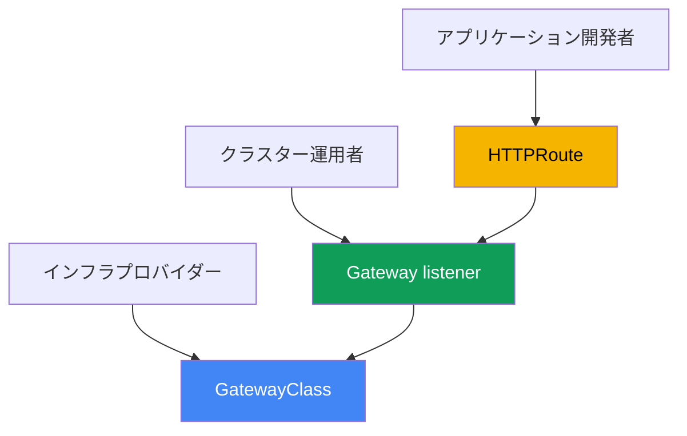
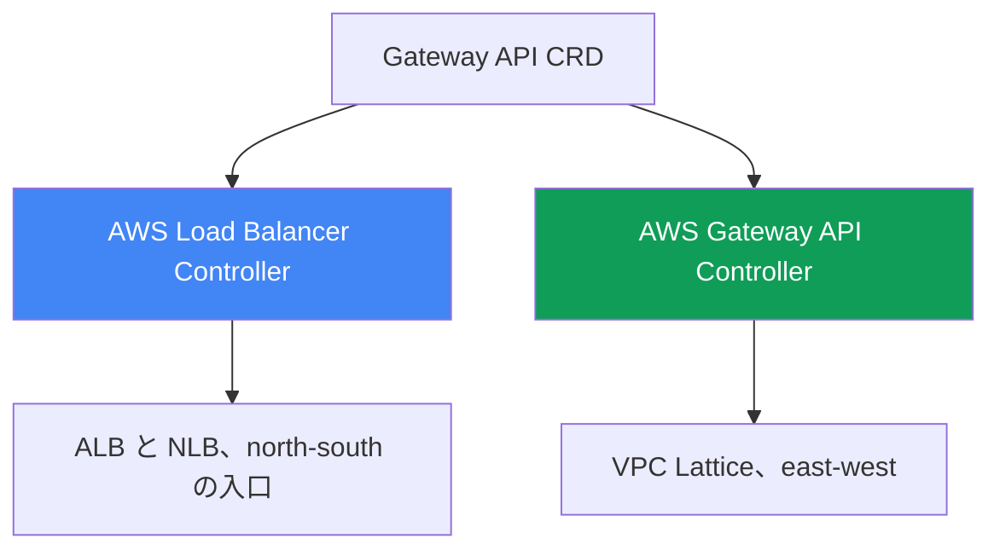
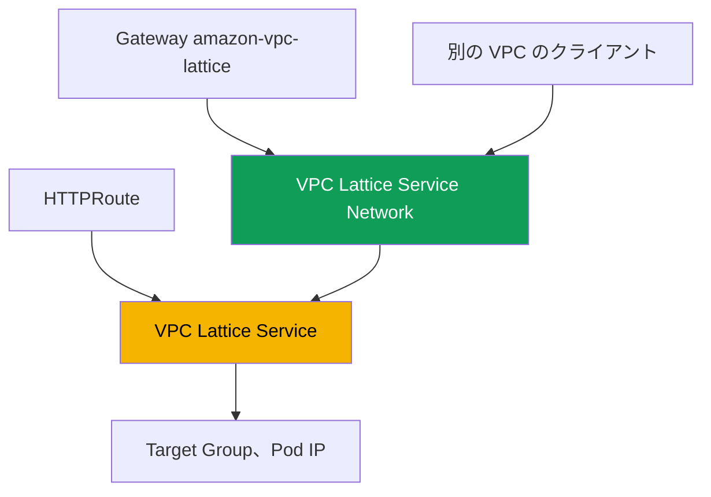

[Eng version](en.md) · [Versión en español](es.md) · [Version française](fr.md) · [Deutsche Version](de.md) · [Русская версия](ru.md) · [ქართული ვერსია](ge.md) · [繁體中文版](tw.md)
# 第28章. AWS の Gateway API: ALB Gateway API と VPC Lattice

> **次は何か。** 第26章と第27章ではアノテーションによる公開を扱いました。LoadBalancer 型 Service は NLB を作成し（第26章）、`ingressClassName: alb` を持つ Ingress は ALB を作成します（第27章）。ここでは Gateway API を扱います。これは、プラットフォームと開発者のロールを明確に分離する、Ingress の標準化された型付き代替手段です。AWS における2つの実装、すなわち ALB と NLB 上の同じ AWS Load Balancer Controller と、VPC およびアカウント間で Service を接続する VPC Lattice 上の AWS Gateway API Controller を説明します。Ingress と ALB は第27章、NLB と Service は第26章、external-dns と証明書は第29章、マルチクラスターとマルチアカウントは第32章で扱います。Pod が IP を取得する仕組み（VPC CNI）は第8章、コントローラーのロール（IRSA、Pod Identity）は第16-17章を参照してください。これらのテーマは参照し、繰り返しません。

## 28.1. 「Ingress はアノテーションだらけで、ロールを分離できない」

第27章の Ingress に戻りましょう。1つのオブジェクトが、アプリケーションのルーティング（Service への host、path）と、ロードバランサーのすべてのインフラストラクチャ（スキーム、TLS、WAF、タイムアウト、health check）の両方を記述します。すべては `alb.ingress.kubernetes.io/` プレフィックスを持つアノテーションに置かれ、典型的な本番 Ingress は次のようになります。

```yaml
metadata:
  annotations:
    alb.ingress.kubernetes.io/scheme: internet-facing
    alb.ingress.kubernetes.io/target-type: ip
    alb.ingress.kubernetes.io/listen-ports: '[{"HTTP":80},{"HTTPS":443}]'
    alb.ingress.kubernetes.io/ssl-redirect: '443'
    alb.ingress.kubernetes.io/certificate-arn: arn:aws:acm:...
    alb.ingress.kubernetes.io/wafv2-acl-arn: arn:aws:wafv2:...
    alb.ingress.kubernetes.io/healthcheck-path: /healthz
    # ...さらに数十行
```

ここには2つの問題があります。1つ目はデータスキーマです。設定は型付けされておらずアノテーション内の文字列であり、ベンダーごとに独自のものなので、実装間で設定を移植するのは困難です。2つ目はロールです。`scheme`、`certificate-arn`、`wafv2-acl-arn` はプラットフォームチームの領域であり、`path` と backend は開発者の領域ですが、両方の側が編集する1つのオブジェクトに混在しています。

さらに、Ingress ではまったく解決できない種類の課題もあります。Ingress と ALB は外部からの入口（north-south）です。ある VPC の Service が別の VPC やアカウントの Service を呼び出す必要がある場合（east-west）、Ingress は役に立ちません。境界にロードバランサーを立て、VPC peering を設定し、CIDR の重複に対処する必要があります。AWS にはこのための専用のアプリケーションネットワークサービス、VPC Lattice があります。Gateway API は両方の課題を解決します。

## 28.2. 標準としての Gateway API: 型付きリソースとロール

Gateway API は、トラフィックを管理する Kubernetes の公式標準であり、Ingress の後継です。アノテーションを持つ単一のオブジェクトの代わりに、複数の型付きリソースを導入し、それぞれに所有者がいます。

- **GatewayClass**: IngressClass に相当する実装テンプレートです。infra provider（インフラストラクチャプロバイダー）が作成し、クラスを特定のコントローラーに結び付ける `controllerName` を指定します。開発者はこれに触れません。
- **Gateway**: プロトコル、ポート、TLS を持つ listener を備えた具体的な入口です。所有者は cluster operator（プラットフォームチーム）です。インフラストラクチャの判断はここに置きます。
- **HTTPRoute**（および **TLSRoute**、**TCPRoute**、**UDPRoute**、**GRPCRoute**）: host、path、ヘッダーにより backend Service へルーティングするルールです。所有者は開発者です。Route は `parentRefs` を通じて Gateway を参照し、Gateway は `allowedRoutes` により接続を許可します。



Ingress より優れている点は何でしょうか。第一にロールの分離です。プラットフォームが Gateway と証明書を所有し、開発者は自分の HTTPRoute だけを所有するため、両者が同じオブジェクトを編集しません。第二に型付けです。Ingress ではアノテーションの文字列だったもの（ヘッダー、メソッド、weight、redirect）が、Gateway API では検証されるスキーマのフィールドになります。第三に移植性です。同じ HTTPRoute が任意の実装上で動作し、インフラストラクチャ固有の部分は Gateway が隠します。一部のベンダー固有設定は依然として CRD に移されますが、アプリケーションのルーティングは標準のままです。

ロールの分離によりチームは namespace ごとに分かれ、ここで cross-namespace 参照が問題になります。自分の namespace にある HTTPRoute が、別の namespace の backend Service を参照する場合（`namespace` フィールドを持つ `backendRefs`）、デフォルトでは参照は許可されません。そうでなければ開発者がトラフィックを他人の Service に向けられてしまいます。許可は、対象 namespace の所有者が **ReferenceGrant** リソースで与えます。これは backend の隣に置かれ、どの namespace とリソース種別からの参照が許可されるかを指定します。

```yaml
apiVersion: gateway.networking.k8s.io/v1beta1
kind: ReferenceGrant
metadata:
  name: allow-from-app
  namespace: backend        # 対象 backend の namespace
spec:
  from:
    - {group: gateway.networking.k8s.io, kind: HTTPRoute, namespace: app}
  to:
    - {group: "", kind: Service}
```

同じ仕組みは、別 namespace にある Secret への Gateway の `certificateRefs` も許可します。一方、namespace 境界を越える Route から Gateway への接続は ReferenceGrant ではなく、Gateway 自体の `allowedRoutes` が許可します。grant が必要なのは `backendRefs` と `certificateRefs` のみです。

## 28.3. AWS における Gateway API の2つの実装

Gateway API はインターフェイス（CRD のセット）にすぎません。実際にクラウドをその状態へ反映する主体は、GatewayClass の `controllerName` で決まります。AWS には異なる目的のための2つの実装があり、混同しないことが重要です。

1. **AWS Load Balancer Controller**（第26-27章と同じ）は、Elastic Load Balancing 上で Gateway API を実装します。L7 Route は ALB、L4 Route は NLB が処理します。これは外部からの入口（north-south）であり、Gateway API の言葉で表現した Ingress および LoadBalancer 型 Service の代替です。
2. **AWS Gateway API Controller**（`aws-application-networking-k8s` プロジェクト）は、**VPC Lattice** 上で Gateway API を実装します。これは VPC とアカウント間の Service-to-Service 接続（east-west）であり、境界上の ALB と NLB が行わないものです。



両方の実装を併用できます。1つのクラスターは LBC を通じてフロントエンドを ALB で外部公開すると同時に、VPC Lattice を通じて隣接するアカウントの backend にアクセスします。GatewayClass が異なるため、同じ Gateway が誤って別のコントローラーに渡されることはありません。

## 28.4. AWS Load Balancer Controller による ALB と NLB

バージョン `2.13` 以降（L4 Route）、`2.14` 以降（L7 Route）で、また `3.0` 系では一般提供（GA）機能として、LBC は Gateway API リソースを処理できます。アーキテクチャは二重で、L4 と L7 は別々のコントローラーインスタンスで動作し、GatewayClass の `controllerName` で分離されます。

- `gateway.k8s.aws/alb`: L7。この Gateway は **ALB** を作成し、`HTTPRoute` と `GRPCRoute` は listener とルールに変換されます。
- `gateway.k8s.aws/nlb`: L4。この Gateway は **NLB** を作成し、`TCPRoute`、`UDPRoute`、`TLSRoute` は NLB listener に変換されます。

1つの Gateway で層を混在させることはできません。`HTTPRoute` と `TCPRoute` は同じロードバランサー上で共存できません。最小の L7 チェーンの例は、GatewayClass、2つの listener を持つ Gateway、Service への HTTPRoute です。

```yaml
apiVersion: gateway.networking.k8s.io/v1
kind: GatewayClass
metadata:
  name: aws-alb
spec:
  controllerName: gateway.k8s.aws/alb
---
apiVersion: gateway.networking.k8s.io/v1
kind: Gateway
metadata:
  name: web
spec:
  gatewayClassName: aws-alb
  listeners:
    - {name: http, protocol: HTTP, port: 80}
---
apiVersion: gateway.networking.k8s.io/v1
kind: HTTPRoute
metadata:
  name: app
spec:
  parentRefs:
    - {kind: Gateway, name: web, sectionName: http}
  rules:
    - backendRefs:
        - {name: frontend, port: 80}
```

標準 Gateway API にない ALB のベンダー固有設定は、アノテーションではなくコントローラーの型付き CRD（`gateway.k8s.aws` グループ）に移されています。`LoadBalancerConfiguration`（スキーム、TLS 証明書、listener 属性）、`TargetGroupConfiguration`（target group の health check）、`ListenerRuleConfiguration`（`source-ip` などのルール条件）です。証明書は `LoadBalancerConfiguration`、または listener の `hostname` による certificate discovery で指定します。Gateway の `certificateRefs` フィールドではまだ指定できません。第26-27章と同様に、コントローラーには ServiceAccount の IAM ロール（IRSA または Pod Identity、第16-17章）が必要です。別のコントローラーは不要で、Gateway は Ingress と同じ LBC が処理します。ただし、ALB Gateway 実装は標準全体をカバーしていません。一部の filter（CORS、mirroring、timeout）は ALB でサポートされません。

## 28.5. AWS Gateway API Controller による VPC Lattice

VPC Lattice は、AWS インフラストラクチャに組み込まれたフルマネージドのアプリケーションネットワーキングサービスです。sidecar、VPC peering、境界上のロードバランサーなしに、1つの VPC 内および異なる VPC とアカウント間の Service 間トラフィックを接続、保護、監視します。CIDR の重複も回避します。通信はネットワーク間ルーティングではなく Lattice サービス自体を経由します。

AWS Gateway API Controller（`aws-application-networking-k8s` プロジェクト）は、Kubernetes リソースを VPC Lattice オブジェクトへ変換します。これは通常 Helm により namespace `aws-application-networking-system` にインストールされ、`amazon-vpc-lattice` という GatewayClass を作成します。リソースの対応は以下のとおりです。

- **Gateway**（`amazon-vpc-lattice` クラス）は、Service 群の論理的な境界である VPC Lattice の **Service Network** に対応します。cluster operator が作成します。
- **HTTPRoute**（または `GRPCRoute`、`TLSRoute`）は、独自の listener とルールを持つアプリケーション Service である **VPC Lattice Service** に対応します。開発者が作成します。
- `backendRefs` の Kubernetes Service は VPC Lattice の **Target Group** になり、その target は Pod IP です（`target-type: ip` と同様に直接登録されます）。



マニフェストを適用すると、HTTPRoute には `<name>-<suffix>.vpc-lattice-svcs.<region>.on.aws` 形式の DNS 名を持つアノテーション `application-networking.k8s.aws/lattice-assigned-domain-name` が追加されます。同じ Service Network に VPC が関連付けられたクライアントは、target Pod がどのクラスター、VPC、アカウントに存在するかにかかわらず、その名前で Service にアクセスします。

## 28.6. VPC Lattice: cross-VPC、cross-account と IAM auth

status や ARN を読む際に、VPC Lattice の主要な概念を把握しておくと便利です。Service は target group、listener、rule を持つアプリケーションの単位です。Service Network は Service が属し、クライアント VPC が関連付けられる境界です。クライアントと Service が同じ Service Network にあり、認可されていれば通信できます。Service Directory は、自分の Service と共有された Service のすべてを登録するレジストリです。

アカウント間の接続は **AWS Resource Access Manager (RAM)** を通じて構築します。Service Network または個別 Service を別アカウントと共有し、そこでローカル VPC に関連付けます。これにより、2つのアカウントの Pod は peering を作成せずに通信できます。cross-cluster シナリオ向けに、コントローラーは独自の CRD `ServiceExport` と `ServiceImport` を提供します。Service を一方のクラスターから export し、別のクラスターへ import した後、HTTPRoute から参照できます（クラスター間の blue/green に weight を使う場合を含みます。第32章）。

VPC Lattice は **IAM auth policies** によって認証と認可を実行します。これは、誰がどの Service にアクセスできるか（principal、action、condition）を記述する IAM 形式のポリシーですが、AWS API ではなく Service 間トラフィックのためのものです。コントローラーはこれを `IAMAuthPolicy` リソースで表し、Gateway（Service Network レベル）または Route（Service レベル）に関連付けます。範囲に関する重要な制約として、現在このコントローラーは east-west（mesh）トラフィックでのみ動作します。ALB と NLB の機能を伴う外部からの入口には、AWS Load Balancer Controller を使用します（第27章）。

## 28.7. 選び方: Ingress か Gateway API、ALB か Lattice

最初の比較は、同じ LBC 上の Gateway API に Ingress から移行すべきかです。Ingress はより単純で十分に成熟しています。Gateway API はロール、型付け、移植性を提供しますが、より新しく、ALB の全機能をカバーしていません。

| 基準 | Ingress + ALB（第27章） | Gateway API + LBC（ALB/NLB） |
|---|---|---|
| オブジェクト | 1つの Ingress + アノテーション | GatewayClass、Gateway、Route |
| ロールの分離 | なし、すべて1つのオブジェクト | あり、所有者が異なる |
| 設定の型付け | アノテーション内の文字列 | スキーマのフィールドと CRD |
| L4 (TCP/UDP) | なし、Service のみ（第26章） | あり、TCP/UDPRoute による NLB |
| 成熟度 | 安定、長年の実績 | 新しく、一部の ALB 機能は未対応 |

2つ目の比較は、2つの実装そのものです。これは「どちらが優れているか」ではなく、「どの課題か」の選択です。外部からの入口か、ネットワーク内およびネットワーク間の Service 接続かです。

| 基準 | LBC（ALB/NLB） | VPC Lattice（Gateway API Controller） |
|---|---|---|
| 方向 | north-south、外部からの入口 | east-west、Service-to-Service |
| 基盤 | ALB と NLB（ELB） | VPC Lattice |
| GatewayClass | `gateway.k8s.aws/alb` と `/nlb` | `amazon-vpc-lattice` |
| VPC とアカウント間 | なし、境界のみ | あり、Service Network と RAM 経由 |
| トラフィックの認可 | ALB の WAF、Cognito/OIDC | IAM auth policies |
| CIDR の重複 | ルーティングが必要 | 回避可能、Service 経由で通信 |

大まかなルールは次のとおりです。Web サイトまたは API を外部公開するなら LBC 上の Gateway API（または当面は Ingress、第27章）を、VPC とアカウント間で peering なしに microservice を接続するなら VPC Lattice を選びます。

## 28.8. 導入前に: CRD、権限、Lattice ではないもの

両方のコントローラーは個別のインストールであり、すぐに使える EKS managed addon ではありません。リソースを使用する前に、標準の Gateway API CRD（upstream）をクラスターへインストールします。そうしないと Gateway と HTTPRoute は作成されません。LBC はさらに `gateway.k8s.aws` グループの独自 CRD をインストールし、Gateway API Controller は `application-networking.k8s.aws` グループの CRD（`IAMAuthPolicy`、`ServiceExport`、`ServiceImport`、`TargetGroupPolicy`、`VpcAssociationPolicy`）をインストールします。

両コントローラーには IAM 権限（IRSA または Pod Identity、第16-17章）が必要です。LBC には第26-27章と同様に ELB の権限、Gateway API Controller には `vpc-lattice` API の権限が必要です。成熟度について正直に言えば、LBC の Gateway API サポートは比較的新しいものです。本番を移行する前に、正確なバージョンとサポートされる機能の一覧をコントローラーのドキュメントで確認してください。

固定しておくべき最も重要な点は、VPC Lattice は境界上の ALB **ではない**ということです。外部からの入口を置き換えるものでも、ブラウザー向けの public HTTPS を終端するものでもなく、（このコントローラーとの組み合わせでは）east-west を対象としています。インターネットからのトラフィックを受け付ける課題なら ALB または NLB であり、Lattice はその背後、Service 間にあります。

## 28.9. 本番での使い方

- **RBAC の回避策ではなくオブジェクトでロールを分離する。** プラットフォームは GatewayClass と Gateway（スキーム、TLS、証明書）を所有し、開発者は HTTPRoute のみを所有します。Route の接続は Gateway の `allowedRoutes` で制限します。
- **段階的に移行する。** 新しい Service は LBC 上の Gateway API に作成し、古いものは Ingress（第27章）のままにします。両方の方式は同じコントローラー上で並行して動作します。
- **VPC Lattice は VPC とアカウント間の east-west 用。** cross-account 接続は、peering や境界のロードバランサーではなく Service Network と AWS RAM で実現します。
- **Service 間のアクセスは IAM auth policies で制限する。** security group を範囲全体に開放するのではなく、Gateway または Route の `IAMAuthPolicy` で許可を記述します。
- **cross-cluster は ServiceExport と ServiceImport を使用する。** 共通 Service を一方のクラスターから export し、別のクラスターへ import して、weight によりトラフィックを分散します（第32章）。
- **L4 と L7 を1つの Gateway に混在させない。** HTTP/gRPC には `alb` クラスの Gateway、TCP/UDP/TLS には `nlb` クラスの Gateway を、別オブジェクトとして作成します。

## 28.10. ミニ用語集

- **Gateway API**: トラフィック管理の Kubernetes 標準であり、ロールを分離する型付きリソースのセットからなる Ingress の後継です。
- **GatewayClass**: `controllerName` フィールドを持つ実装テンプレートです。どのコントローラーが Gateway を処理するかを決定します（IngressClass に相当）。
- **Gateway**: listener（プロトコル、ポート、TLS）を持つ入口です。所有者はプラットフォームチームです。VPC Lattice では Service Network に対応します。
- **HTTPRoute**: host、path、ヘッダーにより backend へルーティングするルールです。`parentRefs` を通じて Gateway を参照します。VPC Lattice では VPC Lattice Service に対応します。
- **AWS Load Balancer Controller (Gateway API)**: `controllerName` `gateway.k8s.aws/alb`（ALB、L7）および `gateway.k8s.aws/nlb`（NLB、L4）を持つ実装です。
- **VPC Lattice**: sidecar と peering なしに VPC とアカウント間の east-west 接続を行うマネージドアプリケーションネットワークサービスです。
- **AWS Gateway API Controller**: `aws-application-networking-k8s` コントローラーであり、GatewayClass `amazon-vpc-lattice` を提供し、Gateway API を VPC Lattice オブジェクトに変換します。
- **Service Network**: Service 群のための VPC Lattice 境界です。クライアント VPC は Service へのアクセスのためこれに関連付けます。
- **IAM auth policy**: Service 間トラフィックを認可する IAM 形式のポリシーです。コントローラーでは `IAMAuthPolicy` リソースです。
- **ReferenceGrant**: 対象リソースの namespace に置く Gateway API リソースです。列挙された namespace からの cross-namespace 参照（`backendRefs`、`certificateRefs`）を許可します。

## 28.11. 章のまとめ

- Ingress はアプリケーションのルーティングとロードバランサーのインフラストラクチャを1つのオブジェクトに混在させます。すべての設定は型付けされていないアノテーションで、プラットフォームと開発者のロールは分離されず、VPC 間の east-west 接続も解決しません。
- Gateway API は Ingress の後継標準です。型付きの GatewayClass（infra provider）、Gateway（cluster operator）、HTTPRoute とその他の Route（開発者）により、ロール、型付け、移植性を提供します。
- AWS には2つの実装があります。ALB と NLB による north-south の入口向け AWS Load Balancer Controller と、VPC とアカウント間の east-west 向け VPC Lattice 上の AWS Gateway API Controller です。
- LBC は `controllerName` で層を区別します。`gateway.k8s.aws/alb`（L7、ALB、HTTPRoute と GRPCRoute）と `gateway.k8s.aws/nlb`（L4、NLB、TCP/UDP/TLSRoute）です。1つの Gateway に層を混在させることはできず、ベンダー設定は `gateway.k8s.aws` グループの CRD に置きます。
- VPC Lattice コントローラーは GatewayClass `amazon-vpc-lattice` を提供します。Gateway -> Service Network、HTTPRoute -> VPC Lattice Service、Kubernetes Service -> Pod IP を持つ Target Group です。
- アカウント間の接続は peering なしで Service Network と AWS RAM により構築し、cross-cluster は ServiceExport と ServiceImport により行います。認可には IAM auth policies（`IAMAuthPolicy`）を使用します。
- VPC Lattice は境界上の ALB を置き換えません。コントローラーは east-west を対象とし、外部からの入口と public TLS は ALB と NLB が担います（28.4節と第27章）。

## 28.12. 実務での役立て方

当番時、Gateway API の問題を調査する最初の質問は、そのリソースが誰のものかです。GatewayClass の `controllerName` を確認します。`gateway.k8s.aws/alb` または `/nlb` なら LBC と ELB、`amazon-vpc-lattice` なら VPC Lattice であり、以後の診断は別の Service に対して行います。Gateway が `PROGRAMMED: True` にならない場合は、Gateway API CRD と必要なコントローラーがインストールされているか、そのロールに権限があるか（ログの `AccessDenied`）、第26-27章と同様に確認します。HTTPRoute が受け入れられない場合は、`parentRefs` と Gateway の `allowedRoutes` を確認します。Route が namespace 制限により拒否された可能性があります。Route が受け入れられても別 namespace の backend が解決されない場合、`ResolvedRefs` 条件が reason `RefNotPermitted` で `False` になります。backend の隣に ReferenceGrant がありません。VPC Lattice では固有の確認も加わります。`lattice-assigned-domain-name` アノテーションに DNS 名が追加されたか、クライアント VPC が Service Network に関連付けられているか、IAM auth policy がリクエストを遮断していないかを確認します。

計画時には、あらかじめ2つの判断を持っておきます。1つ目はロールの境界です。誰が Gateway と証明書を所有し、誰には HTTPRoute のみを残すかです。これが Ingress から移行する最大の利点です。2つ目はトラフィックの方向です。外部からの入口は LBC（ALB/NLB）で設計し、VPC とアカウント間の Service 接続は VPC Lattice で設計します。一方で他方を解決しようとしてはいけません。成熟度も忘れないでください。コントローラーがカバーする Gateway API 機能の一覧は変化するため、本番移行前に最新のドキュメントと照合します。

## 28.13. 自己確認のための質問

1. アノテーションを持つ Ingress のどの2つの問題を Gateway API は解決し、なぜロールが重要ですか。
2. GatewayClass、Gateway、HTTPRoute は何を記述し、各リソースの所有者は誰ですか。
3. Gateway はどのコントローラーが処理するかをどのように判断し、`controllerName` はどのように関係しますか。
4. 型付けと移植性の点で Gateway API は Ingress よりどう優れ、現在の欠点は何ですか。
5. AWS には Gateway API のどの2つの実装があり、それぞれどの課題のためのものですか。
6. LBC は ALB と NLB にどの `controllerName` を使用し、各々にどの Route が対応しますか。
7. LBC で1つの Gateway に L4 と L7 Route を混在させられないのはなぜですか。
8. LBC は Ingress アノテーションの代わりに ALB のベンダー設定をどこに置きますか。
9. VPC Lattice とは何で、east-west 接続は ALB 経由の入口とどう異なりますか。
10. コントローラーは Gateway、HTTPRoute、Kubernetes Service を VPC Lattice の何に対応付けますか。
11. VPC peering なしに異なるアカウント間で Service を接続するにはどうしますか。
12. IAM auth policies は何を行い、どのオブジェクトに関連付けますか。
13. VPC Lattice が境界上の ALB の代替ではないのはなぜですか。
14. ReferenceGrant はなぜ必要で、どの namespace に作成しますか。

## 実践

このテーマのコースラボ: [ラボ128: AWS の Gateway API: ALB Gateway API と VPC
Lattice](../../labs/128/README_JP.MD)。このラボでは、両実装を1つのクラスターに並べてインストールします。`aws-alb` クラスの `Gateway` は ALB を起動して `HTTPRoute` を配信し、`amazon-vpc-lattice` クラスの `Gateway` は Service Network に対応付けられます。cross-namespace 参照も個別に確認します。backend の所有者が `ReferenceGrant` を発行するまで Route は `RefNotPermitted` になり、このルールを守るのは API サーバーではなく実装であることも確認できます。結果は `check_result` コマンドで検証します。

以下は、自分の任意のクラスターで確認する価値があるものです。まず、利用可能な GatewayClass と、それぞれのコントローラーを確認します。

```bash
kubectl get gatewayclass
kubectl get gatewayclass -o custom-columns=NAME:.metadata.name,CTRL:.spec.controllerName
```

LBC（第26-27章でコントローラーはすでにインストール済み）では、`controllerName: gateway.k8s.aws/alb` を持つ GatewayClass、1つの HTTP listener を持つ Gateway、テスト Service への HTTPRoute を作成し、アドレスと status を待ちます。

```bash
kubectl get gateway web -o wide          # ADDRESS と PROGRAMMED が設定される必要があります
kubectl describe gateway web             # listener のイベントと status
kubectl get httproute app -o yaml        # status.parents: Route は受け入れられたか
aws elbv2 describe-load-balancers        # AWS 側には ALB が現れます
```

AWS Gateway API Controller がインストールされている場合は、VPC Lattice 側を確認します。`amazon-vpc-lattice` クラスの Gateway は Service Network に対応し、HTTPRoute には DNS 名が追加される必要があります。

```bash
kubectl get gateway               # CLASS = amazon-vpc-lattice、PROGRAMMED = True
kubectl get httproute rates -o yaml | grep lattice-assigned-domain-name
aws vpc-lattice list-service-networks
aws vpc-lattice list-service-network-vpc-associations --vpc-id <vpc-id>
```

`lattice-assigned-domain-name` の名前が解決できること、およびクライアント VPC が Service Network に関連付けられていることを確認してください。ログは通常どおり確認します。LBC は namespace `kube-system` の `deploy/aws-load-balancer-controller`、Gateway API Controller は `aws-application-networking-system` の `deploy/gateway-api-controller` です。

---
[目次](../README_JP.md) · [第27章](../27/jp.md) · [第29章](../29/jp.md)
