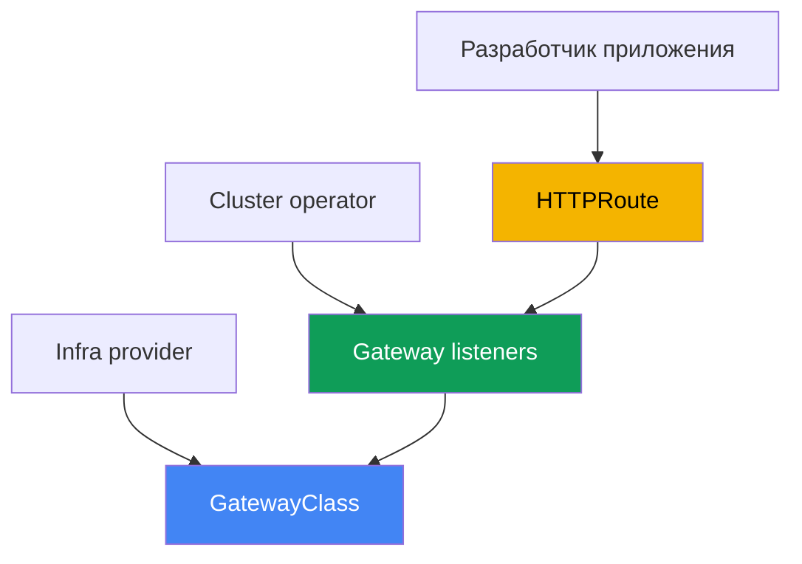
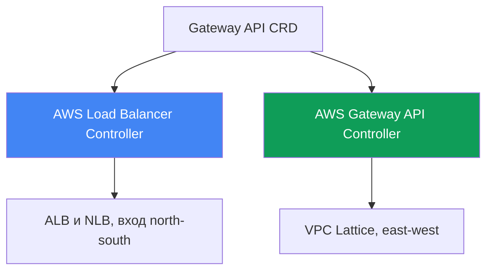
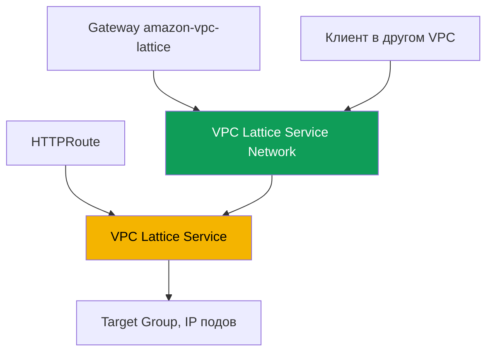

# Глава 28. Gateway API в AWS: ALB Gateway API и VPC Lattice

> **Что дальше.** Главы 26 и 27 показали публикацию через аннотации: Service типа
> LoadBalancer давал NLB (глава 26), Ingress с `ingressClassName: alb` давал ALB (глава 27).
> Здесь - Gateway API: стандартизированная типизированная альтернатива Ingress с явным
> разделением ролей между платформой и разработчиками. Разбираем две реализации в AWS: тот же
> AWS Load Balancer Controller поверх ALB и NLB и AWS Gateway API Controller поверх VPC
> Lattice для связи сервисов между VPC и аккаунтами. Ingress и ALB остаются в главе 27, NLB и
> Service - в главе 26, external-dns и сертификаты - глава 29, мультикластер и мультиаккаунт -
> глава 32. Как под получает IP (VPC CNI) - глава 8, роль контроллера (IRSA, Pod Identity) -
> главы 16-17. На эти темы ссылаемся, не повторяя их.

## 28.1. «Ingress оброс аннотациями, а роли не разделить»

Вернёмся к Ingress из главы 27. Один объект описывает и прикладную маршрутизацию (host, path
на сервисы), и всю инфраструктуру балансировщика - схему, TLS, WAF, таймауты, health check.
Всё это живёт в аннотациях с префиксом `alb.ingress.kubernetes.io/`, и типичный продакшн-
Ingress выглядит так:

```yaml
metadata:
  annotations:
    alb.ingress.kubernetes.io/scheme: internet-facing
    alb.ingress.kubernetes.io/target-type: ip
    alb.ingress.kubernetes.io/listen-ports: '[{"HTTP":80},{"HTTPS":443}]'
    alb.ingress.kubernetes.io/ssl-redirect: '443'
    alb.ingress.kubernetes.io/certificate-arn: arn:aws:acm:...
    alb.ingress.kubernetes.io/wafv2-acl-arn: arn:aws:wafv2:...
    alb.ingress.kubernetes.io/healthcheck-path: /healthz
    # ...ещё десяток строк
```

Здесь две боли. Первая - схема данных: настройки не типизированы, это строки в аннотациях,
свои у каждого вендора, и переносить конфигурацию между реализациями больно. Вторая - роли:
`scheme`, `certificate-arn`, `wafv2-acl-arn` - зона платформенной команды, а `path` и backend
- разработчика, но всё смешано в одном объекте, который правят обе стороны.

И отдельный класс задач Ingress не решает вовсе. Ingress и ALB - это вход снаружи
(north-south). Когда сервису в одном VPC нужно вызвать сервис в другом VPC или аккаунте
(east-west), Ingress не помогает: пришлось бы поднимать балансировщик на периметре, настраивать
VPC peering, ловить пересечения CIDR. Для этого в AWS есть отдельный сервис прикладной сети -
VPC Lattice. Обе задачи закрывает один стандарт - Gateway API.

## 28.2. Gateway API как стандарт: типизированные ресурсы и роли

Gateway API - это официальный стандарт Kubernetes для управления трафиком, преемник Ingress.
Вместо одного объекта с аннотациями он вводит несколько типизированных ресурсов, и у каждого
свой владелец:

- **GatewayClass** - шаблон реализации, аналог IngressClass. Заводит его infra provider
  (поставщик инфраструктуры): указывает `controllerName`, который свяжет класс с конкретным
  контроллером. Разработчик его не трогает.
- **Gateway** - конкретная точка входа: слушатели (`listeners`) с протоколом, портом и TLS.
  Владелец - cluster operator (платформенная команда). Здесь живут инфраструктурные решения.
- **HTTPRoute** (а также **TLSRoute**, **TCPRoute**, **UDPRoute**, **GRPCRoute**) - правила
  маршрутизации по host, path, заголовкам на backend-сервисы. Владелец - разработчик. Route
  ссылается на Gateway через `parentRefs`, а Gateway разрешает подключение через
  `allowedRoutes`.



Чем это лучше Ingress. Во-первых, разделение ролей: платформа владеет Gateway и
сертификатами, разработчик - только своими HTTPRoute, и они не редактируют один объект.
Во-вторых, типизация: то, что в Ingress было строкой в аннотации (заголовки, методы, веса,
редиректы), в Gateway API - поля схемы с валидацией. В-третьих, портируемость: одни и те же
HTTPRoute работают поверх любой реализации, а специфику инфраструктуры прячет Gateway. Часть
вендорских настроек всё равно уезжает в CRD, но прикладная маршрутизация остаётся стандартной.

Разделение ролей разводит команды по namespace, и тут всплывает кросс-namespace ссылка. Если
HTTPRoute в своём namespace ссылается на backend Service в чужом (`backendRefs` с полем
`namespace`), по умолчанию ссылка запрещена - иначе разработчик направил бы трафик на чужой
сервис. Разрешение даёт владелец целевого namespace ресурсом **ReferenceGrant**: он лежит
рядом с backend и называет, из каких namespace и видов ресурсов ссылка допустима.

```yaml
apiVersion: gateway.networking.k8s.io/v1beta1
kind: ReferenceGrant
metadata:
  name: allow-from-app
  namespace: backend        # namespace целевого backend
spec:
  from:
    - {group: gateway.networking.k8s.io, kind: HTTPRoute, namespace: app}
  to:
    - {group: "", kind: Service}
```

Тот же механизм разрешает `certificateRefs` Gateway на Secret в другом namespace.
Подключение же Route к Gateway через границу namespace разрешает не ReferenceGrant, а
`allowedRoutes` на самом Gateway; грант нужен только для `backendRefs` и `certificateRefs`.

## 28.3. Две реализации Gateway API в AWS

Gateway API - это только интерфейс (набор CRD). Кто именно приводит облако в соответствие,
решает `controllerName` в GatewayClass. В AWS есть две разные реализации под разные задачи, и
их важно не путать:

1. **AWS Load Balancer Controller** (тот же из глав 26-27) реализует Gateway API поверх
   Elastic Load Balancing: L7-маршруты обслуживает ALB, L4-маршруты - NLB. Это вход снаружи
   (north-south), альтернатива Ingress и Service типа LoadBalancer на языке Gateway API.
2. **AWS Gateway API Controller** (проект `aws-application-networking-k8s`) реализует Gateway
   API поверх **VPC Lattice**. Это связь сервис-к-сервису (east-west) между VPC и аккаунтами,
   чего ALB и NLB на периметре не делают.



Обе реализации ставят рядом: один кластер через LBC публикует фронтенд наружу на ALB и
одновременно через VPC Lattice ходит к бэкендам в соседних аккаунтах. GatewayClass у них
разные, поэтому один и тот же Gateway случайно не попадёт к чужому контроллеру.

## 28.4. ALB и NLB через AWS Load Balancer Controller

Начиная с версии `2.13` (L4-маршруты) и `2.14` (L7-маршруты), а в ветке `3.0` уже как
общедоступная (GA) возможность, LBC умеет обрабатывать ресурсы Gateway API. Архитектура
двойная: под L4 и L7 работают отдельные экземпляры контроллера, и разделение проходит по
`controllerName` в GatewayClass:

- `gateway.k8s.aws/alb` - L7. Такой Gateway создаёт **ALB**, маршруты `HTTPRoute` и
  `GRPCRoute` превращаются в listener'ы и правила.
- `gateway.k8s.aws/nlb` - L4. Такой Gateway создаёт **NLB**, маршруты `TCPRoute`, `UDPRoute`,
  `TLSRoute` - в listener'ы NLB.

Смешивать уровни на одном Gateway нельзя: `HTTPRoute` и `TCPRoute` на одном балансировщике не
уживаются. Минимальный пример L7-цепочки - GatewayClass, Gateway с двумя listener'ами и
HTTPRoute на сервис:

```yaml
apiVersion: gateway.networking.k8s.io/v1
kind: GatewayClass
metadata:
  name: aws-alb
spec:
  controllerName: gateway.k8s.aws/alb
---
apiVersion: gateway.networking.k8s.io/v1
kind: Gateway
metadata:
  name: web
spec:
  gatewayClassName: aws-alb
  listeners:
    - {name: http, protocol: HTTP, port: 80}
---
apiVersion: gateway.networking.k8s.io/v1
kind: HTTPRoute
metadata:
  name: app
spec:
  parentRefs:
    - {kind: Gateway, name: web, sectionName: http}
  rules:
    - backendRefs:
        - {name: frontend, port: 80}
```

Вендорские настройки ALB, которых нет в стандарте Gateway API, вынесены не в аннотации, а в
типизированные CRD контроллера (группа `gateway.k8s.aws`): `LoadBalancerConfiguration`
(схема, TLS-сертификат, атрибуты listener'а), `TargetGroupConfiguration` (health check
таргет-группы), `ListenerRuleConfiguration` (условия правил вроде `source-ip`). Сертификат
задают через `LoadBalancerConfiguration` или через certificate discovery по `hostname`
listener'а - через поле `certificateRefs` Gateway это пока не делается. Как и в главах 26-27,
контроллеру нужна IAM-роль на ServiceAccount (IRSA или Pod Identity, главы 16-17); отдельный
контроллер не требуется - Gateway обслуживает тот же LBC, что и Ingress. При этом реализация
ALB Gateway покрывает не весь стандарт: часть фильтров (CORS, зеркалирование, таймауты) в ALB
не поддержана.

## 28.5. VPC Lattice через AWS Gateway API Controller

VPC Lattice - полностью управляемый сервис прикладной сети (application networking),
встроенный в инфраструктуру AWS. Он соединяет, защищает и наблюдает трафик между сервисами
внутри одного VPC и между разными VPC и аккаунтами, без сайдкаров, без VPC peering и без
балансировщика на периметре. Пересечение CIDR он тоже обходит: связь идёт через сам сервис
Lattice, а не через маршрутизацию между сетями.

AWS Gateway API Controller (проект `aws-application-networking-k8s`) транслирует ресурсы
Kubernetes в объекты VPC Lattice. Он ставится в namespace `aws-application-networking-system`,
обычно через Helm, и заводит GatewayClass с именем `amazon-vpc-lattice`. Соответствие ресурсов:

- **Gateway** (класс `amazon-vpc-lattice`) отображается в **Service Network** VPC Lattice -
  логическую границу для набора сервисов. Заводит его cluster operator.
- **HTTPRoute** (или `GRPCRoute`, `TLSRoute`) отображается в **VPC Lattice Service** -
  прикладной сервис со своим слушателем и правилами. Заводит его разработчик.
- Kubernetes Service из `backendRefs` превращается в **Target Group** VPC Lattice, а её
  таргеты - это IP подов (регистрируются напрямую, аналог `target-type: ip`).



После применения манифестов у HTTPRoute появляется аннотация
`application-networking.k8s.aws/lattice-assigned-domain-name` с DNS-именем вида
`<name>-<suffix>.vpc-lattice-svcs.<region>.on.aws`. По нему клиент, чей VPC ассоциирован с той
же Service Network, обращается к сервису - независимо от того, в каком кластере, VPC или
аккаунте живут поды-таргеты.

## 28.6. VPC Lattice: cross-VPC, cross-account и IAM auth

Ключевые понятия VPC Lattice удобно держать в голове при чтении статусов и ARN. Сервис
(Service) - единица приложения с target groups, listener'ами и rules. Service Network -
граница, куда входят сервисы и с которой ассоциируются VPC клиентов: клиент и сервис в одной
Service Network могут общаться, если авторизованы. Service Directory - реестр всех сервисов,
своих и расшаренных.

Связь между аккаунтами строится через **AWS Resource Access Manager (RAM)**: Service Network
или отдельный сервис шарят в другой аккаунт, там его ассоциируют с локальным VPC - и поды
двух аккаунтов общаются, не создавая пиринга. Для кросс-кластерных сценариев контроллер даёт
свои CRD `ServiceExport` и `ServiceImport`: сервис экспортируют из одного кластера и
импортируют в другой, после чего на него можно сослаться в HTTPRoute (в том числе с весами
для blue/green между кластерами, глава 32).

Аутентификацию и авторизацию VPC Lattice делает через **IAM auth policies** - политики в
формате IAM, которые описывают, кто и к какому сервису может обращаться (principal, action,
condition), но для трафика между сервисами, а не для API AWS. Контроллер выражает их ресурсом
`IAMAuthPolicy`, привязываемым к Gateway (уровень Service Network) или к Route (уровень
сервиса). Важное ограничение по охвату: сегодня контроллер работает только на east-west (mesh)
трафик; для входа снаружи с фичами ALB и NLB берут AWS Load Balancer Controller (глава 27).

## 28.7. Что выбирать: Ingress или Gateway API, ALB или Lattice

Первое сравнение - стоит ли уходить с Ingress на Gateway API поверх того же LBC. Ingress
проще и полностью отлажен; Gateway API даёт роли, типизацию и переносимость, но моложе и
покрывает не все фичи ALB.

| Критерий | Ingress + ALB (глава 27) | Gateway API + LBC (ALB/NLB) |
|---|---|---|
| Объекты | один Ingress + аннотации | GatewayClass, Gateway, Route |
| Разделение ролей | нет, всё в одном объекте | да, разные владельцы |
| Типизация настроек | строки в аннотациях | поля схемы и CRD |
| L4 (TCP/UDP) | нет, только Service (глава 26) | да, NLB через TCP/UDPRoute |
| Зрелость | стабильно, много лет | новее, часть фич ALB не покрыта |

Второе сравнение - две реализации между собой. Это выбор не «что лучше», а «какая задача»:
вход снаружи или связь сервисов внутри и между сетями.

| Критерий | LBC (ALB/NLB) | VPC Lattice (Gateway API Controller) |
|---|---|---|
| Направление | north-south, вход снаружи | east-west, сервис-к-сервису |
| Основа | ALB и NLB (ELB) | VPC Lattice |
| GatewayClass | `gateway.k8s.aws/alb` и `/nlb` | `amazon-vpc-lattice` |
| Между VPC и аккаунтами | нет, только периметр | да, через Service Network и RAM |
| Авторизация трафика | WAF, Cognito/OIDC на ALB | IAM auth policies |
| Пересечение CIDR | требует маршрутизации | обходится, связь через сервис |

Грубое правило: публикуете сайт или API наружу - Gateway API поверх LBC (или пока Ingress,
глава 27); связываете микросервисы между VPC и аккаунтами без пиринга - VPC Lattice.

## 28.8. Перед внедрением: CRD, права и чем Lattice не является

Оба контроллера - отдельная установка, не готовые managed-аддоны EKS. Перед их ресурсами в
кластер ставят стандартные CRD Gateway API (upstream), иначе Gateway и HTTPRoute просто не
создадутся. LBC вдобавок ставит свои CRD группы `gateway.k8s.aws`, а Gateway API Controller -
CRD группы `application-networking.k8s.aws` (`IAMAuthPolicy`, `ServiceExport`, `ServiceImport`,
`TargetGroupPolicy`, `VpcAssociationPolicy`).

Обоим контроллерам нужны IAM-права (IRSA или Pod Identity, главы 16-17): LBC - на ELB, как в
главах 26-27; Gateway API Controller - на API `vpc-lattice`. Про зрелость честно: поддержка
Gateway API в LBC относительно новая, точные версии и список покрытых фич сверяйте с
документацией контроллера перед переносом продакшна.

Главное, что стоит зафиксировать: VPC Lattice - это **не** ALB на периметре. Он не заменяет
внешний вход, не терминирует публичный HTTPS для браузеров и (в связке с этим контроллером)
нацелен на east-west. Если задача - принять трафик из интернета, это ALB или NLB, а Lattice
живёт за ними, между вашими сервисами.

## 28.9. Как это применяют в продакшене

- **Роли через объекты, а не через RBAC-костыли.** Платформа владеет GatewayClass и Gateway
  (схема, TLS, сертификаты), разработчики - только HTTPRoute; подключение маршрутов закрывают
  через `allowedRoutes` на Gateway.
- **Мигрируют постепенно.** Новые сервисы заводят на Gateway API поверх LBC, старые оставляют
  на Ingress (глава 27), пока обе схемы работают на одном контроллере параллельно.
- **VPC Lattice - для east-west между VPC и аккаунтами.** Кросс-аккаунтную связность делают
  через Service Network и AWS RAM, а не через пиринг и балансировщик на периметре.
- **Доступ между сервисами закрывают IAM auth policies.** Разрешения описывают `IAMAuthPolicy`
  на Gateway или Route, а не открывают security group на весь диапазон.
- **Кросс-кластер - через ServiceExport и ServiceImport.** Общий сервис экспортируют из одного
  кластера и импортируют в другой, распределяя трафик весами (глава 32).
- **L4 и L7 не мешают на одном Gateway.** Под HTTP/gRPC заводят Gateway класса `alb`, под
  TCP/UDP/TLS - класса `nlb`, отдельными объектами.

## 28.10. Мини-глоссарий

- **Gateway API** - стандарт Kubernetes для управления трафиком, преемник Ingress: набор
  типизированных ресурсов с разделением ролей.
- **GatewayClass** - шаблон реализации с полем `controllerName`; определяет, какой контроллер
  обработает Gateway (аналог IngressClass).
- **Gateway** - точка входа со слушателями (протокол, порт, TLS); владелец - платформенная
  команда. В VPC Lattice отображается в Service Network.
- **HTTPRoute** - правила маршрутизации по host, path, заголовкам на backend; ссылается на
  Gateway через `parentRefs`. В VPC Lattice отображается в VPC Lattice Service.
- **AWS Load Balancer Controller (Gateway API)** - реализация с `controllerName`
  `gateway.k8s.aws/alb` (ALB, L7) и `gateway.k8s.aws/nlb` (NLB, L4).
- **VPC Lattice** - управляемый сервис прикладной сети для east-west связи между VPC и
  аккаунтами без сайдкаров и пиринга.
- **AWS Gateway API Controller** - контроллер `aws-application-networking-k8s`, GatewayClass
  `amazon-vpc-lattice`, транслирует Gateway API в объекты VPC Lattice.
- **Service Network** - граница VPC Lattice для набора сервисов; VPC клиентов ассоциируют с ней
  для доступа к сервисам.
- **IAM auth policy** - политика в формате IAM для авторизации трафика между сервисами; в
  контроллере - ресурс `IAMAuthPolicy`.
- **ReferenceGrant** - ресурс Gateway API в namespace целевого ресурса; разрешает
  кросс-namespace ссылки (`backendRefs`, `certificateRefs`) из перечисленных namespace.

## 28.11. Итоги главы

- Ingress смешивает в одном объекте прикладную маршрутизацию и инфраструктуру балансировщика,
  все настройки - нетипизированные аннотации, роли платформы и разработчика не разделены; и
  east-west связь между VPC он не решает.
- Gateway API - стандарт-преемник Ingress: типизированные GatewayClass (infra provider),
  Gateway (cluster operator), HTTPRoute и другие Route (разработчик); плюс роли, типизация и
  портируемость.
- В AWS две реализации: AWS Load Balancer Controller (вход north-south на ALB и NLB) и AWS
  Gateway API Controller поверх VPC Lattice (east-west между VPC и аккаунтами).
- LBC различает уровни по `controllerName`: `gateway.k8s.aws/alb` (L7, ALB, HTTPRoute и
  GRPCRoute) и `gateway.k8s.aws/nlb` (L4, NLB, TCP/UDP/TLSRoute); смешивать уровни на одном
  Gateway нельзя, вендорские настройки - в CRD группы `gateway.k8s.aws`.
- VPC Lattice-контроллер даёт GatewayClass `amazon-vpc-lattice`: Gateway -> Service Network,
  HTTPRoute -> VPC Lattice Service, Kubernetes Service -> Target Group с IP подов.
- Связь между аккаунтами строится через Service Network и AWS RAM без пиринга, кросс-кластер -
  через ServiceExport и ServiceImport; авторизация - IAM auth policies (`IAMAuthPolicy`).
- VPC Lattice не заменяет ALB на периметре: контроллер нацелен на east-west, а внешний вход и
  публичный TLS остаются за ALB и NLB (раздел 28.4 и глава 27).

## 28.12. Как это пригодится в реальной работе

На дежурстве первый вопрос при разборе Gateway API - чей это ресурс. Смотрят `controllerName`
в GatewayClass: `gateway.k8s.aws/alb` или `/nlb` - это LBC и ELB, `amazon-vpc-lattice` - это
VPC Lattice, и дальше диагностика идёт по разным сервисам. Если Gateway не переходит в
`PROGRAMMED: True`, проверяют, установлены ли CRD Gateway API и нужный контроллер, есть ли у
его роли права (`AccessDenied` в логах), как в главах 26-27. Если HTTPRoute не принимается,
смотрят `parentRefs` и `allowedRoutes` на Gateway - Route мог не пройти по namespace. Если
Route принят, но backend в чужом namespace не резолвится, у него условие `ResolvedRefs` встаёт
в `False` с reason `RefNotPermitted` - рядом с backend не хватает ReferenceGrant. Для VPC
Lattice добавляется своя проверка: появилось ли DNS-имя в аннотации
`lattice-assigned-domain-name`, ассоциирован ли VPC клиента с Service Network и не режет ли
запрос IAM auth policy.

При планировании держите два решения заранее. Первое - границы ролей: кто владеет Gateway и
сертификатами, а кому оставляют только HTTPRoute; это и есть главный выигрыш перехода с
Ingress. Второе - направление трафика: вход снаружи проектируют на LBC (ALB/NLB), связь
сервисов между VPC и аккаунтами - на VPC Lattice, и не пытаются закрыть одним другое. И
помните про зрелость: список покрытых фич Gateway API у контроллеров меняется, поэтому перед
переносом продакшна его сверяют с актуальной документацией.

## 28.13. Вопросы для самопроверки

1. Какие две боли Ingress с аннотациями решает Gateway API и почему роли важны?
2. Что описывают GatewayClass, Gateway и HTTPRoute и кто владелец каждого ресурса?
3. Как Gateway понимает, какой контроллер его обслужит, и при чём тут `controllerName`?
4. Чем Gateway API лучше Ingress по типизации и портируемости и в чём его минус сегодня?
5. Какие две реализации Gateway API есть в AWS и под какие задачи каждая?
6. Какие `controllerName` использует LBC для ALB и для NLB и какие Route к ним относятся?
7. Почему нельзя смешивать L4 и L7 маршруты на одном Gateway у LBC?
8. Куда LBC выносит вендорские настройки ALB вместо аннотаций Ingress?
9. Что такое VPC Lattice и чем east-west связь отличается от входа через ALB?
10. Во что контроллер отображает Gateway, HTTPRoute и Kubernetes Service в VPC Lattice?
11. Как связать сервисы между разными аккаунтами без VPC peering?
12. Что делают IAM auth policies и к каким объектам их привязывают?
13. Почему VPC Lattice - это не замена ALB на периметре?
14. Зачем нужен ReferenceGrant и в каком namespace его создают?

## Практика

Лаба курса к этой теме: [лаба 128 - Gateway API в AWS: ALB Gateway API и VPC
Lattice](../../labs/128/README_RU.MD). Там обе реализации ставятся рядом на один кластер:
`Gateway` класса `aws-alb` поднимает ALB и раздаёт маршруты `HTTPRoute`, `Gateway` класса
`amazon-vpc-lattice` отображается в Service Network. Отдельно отрабатывается кросс-namespace
ссылка: маршрут получает `RefNotPermitted`, пока владелец backend не выдаст `ReferenceGrant`,
и попутно видно, что соблюдает это правило реализация, а не API-сервер. Результат проверяется
командой `check_result`.

Ниже - то, что имеет смысл посмотреть на любом своём кластере. Сначала какие GatewayClass
доступны и какой контроллер за каждым стоит:

```bash
kubectl get gatewayclass
kubectl get gatewayclass -o custom-columns=NAME:.metadata.name,CTRL:.spec.controllerName
```

Для LBC (главы 26-27 контроллер уже стоял) заведите GatewayClass с
`controllerName: gateway.k8s.aws/alb`, Gateway с одним HTTP-listener'ом и HTTPRoute на тестовый
сервис, затем дождитесь адреса и статуса:

```bash
kubectl get gateway web -o wide          # ADDRESS и PROGRAMMED должны заполниться
kubectl describe gateway web             # события и статус listener'ов
kubectl get httproute app -o yaml        # status.parents - принят ли Route
aws elbv2 describe-load-balancers        # со стороны AWS появится ALB
```

Если установлен AWS Gateway API Controller, посмотрите его сторону VPC Lattice: Gateway класса
`amazon-vpc-lattice` должен соответствовать Service Network, а у HTTPRoute появиться DNS-имя.

```bash
kubectl get gateway               # CLASS = amazon-vpc-lattice, PROGRAMMED = True
kubectl get httproute rates -o yaml | grep lattice-assigned-domain-name
aws vpc-lattice list-service-networks
aws vpc-lattice list-service-network-vpc-associations --vpc-id <vpc-id>
```

Сверьте, что имя в `lattice-assigned-domain-name` резолвится и что VPC клиента ассоциирован с
Service Network. Логи смотрите как обычно: `deploy/aws-load-balancer-controller` в namespace
`kube-system` для LBC и `deploy/gateway-api-controller` в `aws-application-networking-system`.

---
[Оглавление](../README_RU.md) · [Глава 27](../27/ru.md) · [Глава 29](../29/ru.md)
