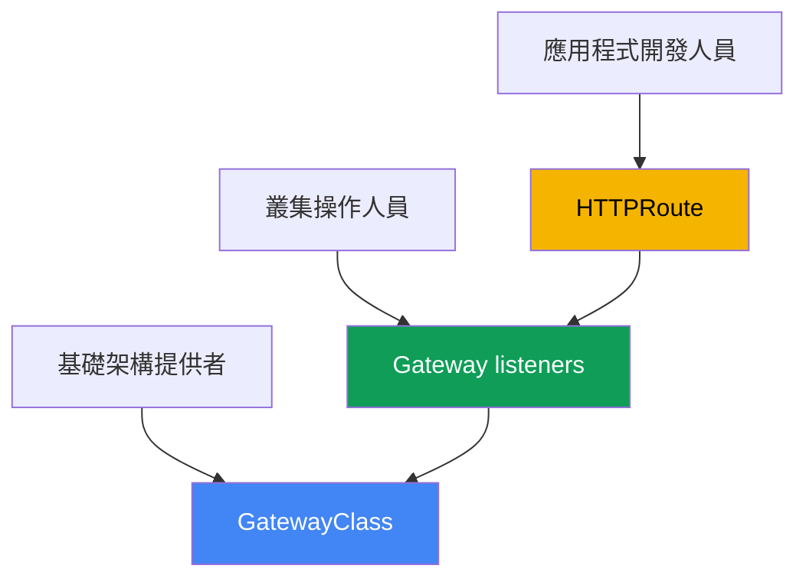
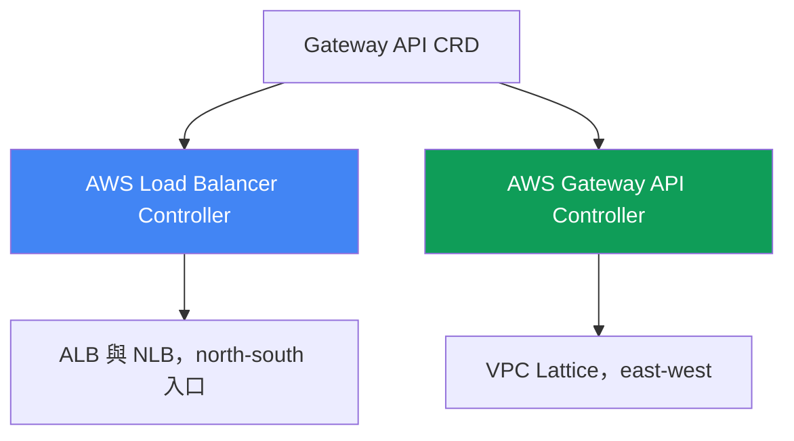
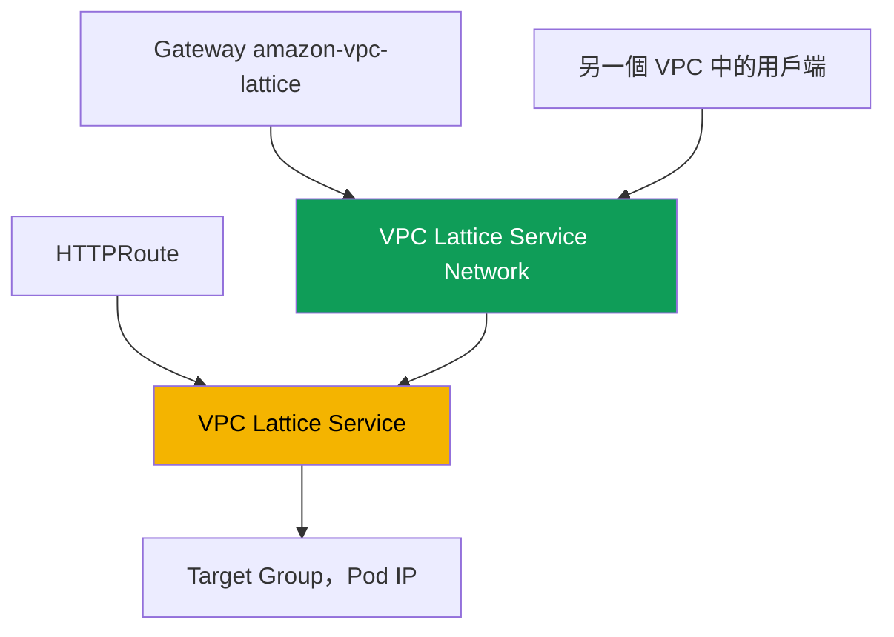

[Русская версия](ru.md) · [Eng version](en.md) · [Versión en español](es.md) · [Version française](fr.md) · [Deutsche Version](de.md) · [ქართული ვერსია](ge.md) · [日本語版](jp.md)

# 第 28 章。AWS 中的 Gateway API：ALB Gateway API 與 VPC Lattice

> **接下來。** 第 26 與 27 章說明透過 annotation 發布服務：`LoadBalancer` 類型的 Service 提供 NLB（第 26 章），具有 `ingressClassName: alb` 的 Ingress 提供 ALB（第 27 章）。本章介紹 Gateway API：這是 Ingress 的標準化、具型別替代方案，明確區分平台與開發人員的職責。我們檢視 AWS 的兩種實作：同一個 AWS Load Balancer Controller 建立在 ALB 與 NLB 之上，以及建構於 VPC Lattice 之上的 AWS Gateway API Controller，用於連接跨 VPC 與帳戶的服務。Ingress 與 ALB 仍見第 27 章，NLB 與 Service 見第 26 章，external-dns 與憑證見第 29 章，多叢集與多帳戶見第 32 章。Pod 如何取得 IP 位址（VPC CNI）見第 8 章，控制器的 role（IRSA、Pod Identity）見第 16-17 章。此處會參照這些主題，不重複說明。

## 28.1.「Ingress 長滿 annotation，卻無法分離職責」

回到第 27 章的 Ingress。一個物件同時描述應用程式路由（至服務的 host、path）與所有負載平衡器基礎架構：scheme、TLS、WAF、timeout、health check。這些全都位於帶有 `alb.ingress.kubernetes.io/` 前綴的 annotation 中，典型的生產 Ingress 如下：

```yaml
metadata:
  annotations:
    alb.ingress.kubernetes.io/scheme: internet-facing
    alb.ingress.kubernetes.io/target-type: ip
    alb.ingress.kubernetes.io/listen-ports: '[{"HTTP":80},{"HTTPS":443}]'
    alb.ingress.kubernetes.io/ssl-redirect: '443'
    alb.ingress.kubernetes.io/certificate-arn: arn:aws:acm:...
    alb.ingress.kubernetes.io/wafv2-acl-arn: arn:aws:wafv2:...
    alb.ingress.kubernetes.io/healthcheck-path: /healthz
    # ...再加十幾行
```

這裡有兩項痛點。第一是資料模型：設定並非具型別，而是 annotation 中的字串，每一種實作各自有供應商專屬設定，因此在實作之間移轉設定很痛苦。第二是職責：`scheme`、`certificate-arn` 與 `wafv2-acl-arn` 屬於平台團隊，`path` 與 backend 屬於開發人員，但所有內容混在同一個由雙方編輯的物件中。

而且 Ingress 完全無法解決另一類問題。Ingress 與 ALB 是來自外部的入口（north-south）。當一個 VPC 中的服務需要呼叫另一個 VPC 或帳戶中的服務（east-west）時，Ingress 無濟於事：必須在周界佈建負載平衡器、設定 VPC peering，並處理 CIDR 重疊。AWS 為此提供獨立的應用程式網路服務 VPC Lattice。一個標準可解決兩項任務：Gateway API。

## 28.2. Gateway API 作為標準：具型別的資源與職責

Gateway API 是 Kubernetes 用於流量管理的官方標準，也是 Ingress 的後繼者。它不再使用一個帶有 annotation 的物件，而是引入數個各有擁有者的具型別資源：

- **GatewayClass** 是實作範本，類似 IngressClass。由 infra provider 建立：它指定將 class 綁定至特定控制器的 `controllerName`。開發人員不會碰它。
- **Gateway** 是具體入口點：包含協定、port 與 TLS 的 listener（`listeners`）。其擁有者是 cluster operator（平台團隊）。基礎架構決策在此處完成。
- **HTTPRoute**（以及 **TLSRoute**、**TCPRoute**、**UDPRoute**、**GRPCRoute**）包含依 host、path 與 header 路由至 backend 服務的規則。其擁有者是開發人員。Route 透過 `parentRefs` 參照 Gateway，而 Gateway 透過 `allowedRoutes` 允許附加。



它為何優於 Ingress？第一，職責分離：平台擁有 Gateway 與憑證，開發人員只擁有自己的 HTTPRoute，雙方不會編輯相同物件。第二，型別化：原本是 Ingress annotation 字串的項目（header、method、weight、redirect），在 Gateway API 中是經過驗證的 schema 欄位。第三，可攜性：相同 HTTPRoute 可在任何實作之上運作，而 Gateway 隱藏基礎架構細節。部分供應商設定仍會放入 CRD，但應用程式路由保持為標準。

職責分離讓團隊依 namespace 分開，這帶出跨 namespace 參照問題。若某 namespace 中的 HTTPRoute 參照另一個 namespace 中的 backend Service（`backendRefs` 含 `namespace` 欄位），預設會拒絕該參照。否則開發人員可以將流量導向其他團隊的服務。目標 namespace 的擁有者可使用 **ReferenceGrant** 資源授予權限：它與 backend 位於同處，並指名允許從哪些 namespace 與資源類型進行參照。

```yaml
apiVersion: gateway.networking.k8s.io/v1beta1
kind: ReferenceGrant
metadata:
  name: allow-from-app
  namespace: backend        # 目標 backend namespace
spec:
  from:
    - {group: gateway.networking.k8s.io, kind: HTTPRoute, namespace: app}
  to:
    - {group: "", kind: Service}
```

相同機制也允許 Gateway 的 `certificateRefs` 參照另一個 namespace 中的 Secret。相對地，Route 跨 namespace 邊界附加至 Gateway 並非由 ReferenceGrant 允許，而是由 Gateway 本身的 `allowedRoutes` 允許；只有 `backendRefs` 與 `certificateRefs` 需要 grant。

## 28.3. AWS 中的兩種 Gateway API 實作

Gateway API 只是一個介面（一組 CRD）。GatewayClass 中的 `controllerName` 決定實際由誰使雲端符合其宣告。AWS 提供兩種適用於不同任務的實作，切勿混淆：

1. **AWS Load Balancer Controller**（與第 26-27 章相同）在 Elastic Load Balancing 之上實作 Gateway API：L7 路由由 ALB 服務，L4 路由由 NLB 服務。這是來自外部的入口（north-south），以 Gateway API 的語言取代 Ingress 與 `LoadBalancer` 類型 Service。
2. **AWS Gateway API Controller**（`aws-application-networking-k8s` 專案）在 **VPC Lattice** 之上實作 Gateway API。它提供跨 VPC 與帳戶的服務對服務（east-west）連線，周界的 ALB 與 NLB 不提供此功能。



兩種實作可並排安裝：同一個叢集透過 LBC 在 ALB 上對外發布 frontend，同時透過 VPC Lattice 存取相鄰帳戶中的 backend。其 GatewayClass 不同，因此同一個 Gateway 不會意外由錯誤的控制器處理。

## 28.4. 透過 AWS Load Balancer Controller 的 ALB 與 NLB

自 `2.13` 版（L4 路由）和 `2.14` 版（L7 路由）開始，並在 `3.0` 分支中已成為 generally available（GA）功能，LBC 能處理 Gateway API 資源。架構是分離的：L4 與 L7 使用個別的控制器 instance，其區別透過 GatewayClass 中的 `controllerName`：

- `gateway.k8s.aws/alb` 是 L7。此 Gateway 建立 **ALB**；`HTTPRoute` 與 `GRPCRoute` 會成為 listener 與規則。
- `gateway.k8s.aws/nlb` 是 L4。此 Gateway 建立 **NLB**；`TCPRoute`、`UDPRoute` 與 `TLSRoute` 會成為 NLB listener。

不能在一個 Gateway 混用層級：`HTTPRoute` 與 `TCPRoute` 無法共存於同一個負載平衡器。以下是最小 L7 鏈範例：GatewayClass、具有兩個 listener 的 Gateway，以及通往 Service 的 HTTPRoute：

```yaml
apiVersion: gateway.networking.k8s.io/v1
kind: GatewayClass
metadata:
  name: aws-alb
spec:
  controllerName: gateway.k8s.aws/alb
---
apiVersion: gateway.networking.k8s.io/v1
kind: Gateway
metadata:
  name: web
spec:
  gatewayClassName: aws-alb
  listeners:
    - {name: http, protocol: HTTP, port: 80}
---
apiVersion: gateway.networking.k8s.io/v1
kind: HTTPRoute
metadata:
  name: app
spec:
  parentRefs:
    - {kind: Gateway, name: web, sectionName: http}
  rules:
    - backendRefs:
        - {name: frontend, port: 80}
```

Gateway API 標準未涵蓋的供應商專屬 ALB 設定，不會移至 annotation，而是移至控制器的具型別 CRD（`gateway.k8s.aws` group）：`LoadBalancerConfiguration`（scheme、TLS 憑證、listener attribute）、`TargetGroupConfiguration`（target group health check）與 `ListenerRuleConfiguration`（如 `source-ip` 的規則條件）。憑證透過 `LoadBalancerConfiguration` 指定，或藉由 listener 的 `hostname` 自動探索；目前尚不能透過 Gateway 的 `certificateRefs` 欄位指定。如第 26-27 章，控制器的 ServiceAccount 需要 IAM role（IRSA 或 Pod Identity，第 16-17 章）；不需要獨立控制器，因為處理 Ingress 的同一個 LBC 也處理 Gateway。ALB Gateway 實作未覆蓋整個標準：部分 filter（CORS、mirroring、timeout）不受 ALB 支援。

## 28.5. 透過 AWS Gateway API Controller 的 VPC Lattice

VPC Lattice 是內建於 AWS 基礎架構的全受管應用程式網路服務。它可在單一 VPC 內及不同 VPC 與帳戶之間，連接、保護與觀察服務間流量，不需要 sidecar、VPC peering 或周界負載平衡器。它也避開 CIDR 重疊：連線經由 Lattice 服務本身，而不是網路之間的路由。

AWS Gateway API Controller（`aws-application-networking-k8s` 專案）將 Kubernetes 資源轉換為 VPC Lattice 物件。它安裝在 `aws-application-networking-system` namespace，通常透過 Helm，並建立名為 `amazon-vpc-lattice` 的 GatewayClass。資源對應如下：

- **Gateway**（`amazon-vpc-lattice` class）對應到 VPC Lattice **Service Network**，即一組服務的邏輯邊界。由 cluster operator 建立。
- **HTTPRoute**（或 `GRPCRoute`、`TLSRoute`）對應到 **VPC Lattice Service**，即具有自己 listener 與規則的應用程式服務。由開發人員建立。
- `backendRefs` 中的 Kubernetes Service 會成為 VPC Lattice **Target Group**，其 target 是 Pod IP（直接註冊，類似 `target-type: ip`）。



套用 manifest 後，HTTPRoute 會取得 `application-networking.k8s.aws/lattice-assigned-domain-name` annotation，並帶有類似 `<name>-<suffix>.vpc-lattice-svcs.<region>.on.aws` 的 DNS 名稱。其 VPC 與同一 Service Network 關聯的用戶端，可透過此名稱存取服務，無論 target Pod 位於哪個叢集、VPC 或帳戶。

## 28.6. VPC Lattice：cross-VPC、cross-account 與 IAM auth

閱讀 status 與 ARN 時，應掌握 VPC Lattice 的關鍵概念。Service 是包含 target group、listener 與 rule 的應用程式單位。Service Network 是容納服務並與用戶端 VPC 關聯的邊界：同一個 Service Network 中的用戶端與服務若獲得授權即可通訊。Service Directory 是所有服務（自有與共享）的登錄檔。

帳戶之間的連線透過 **AWS Resource Access Manager (RAM)** 建立：將 Service Network 或個別 Service 共享至另一個帳戶，在該帳戶中將其與本機 VPC 關聯，兩個帳戶中的 Pod 即可通訊而無須建立 peering。對跨叢集情境，控制器提供自己的 `ServiceExport` 與 `ServiceImport` CRD：將服務從一個叢集匯出並匯入另一個叢集，之後即可在 HTTPRoute 中參照它（也可使用 weight 在叢集間進行 blue/green 流量分配，第 32 章）。

VPC Lattice 透過 **IAM auth policies** 執行驗證與授權。這些 IAM 格式的 policy 描述誰可以存取哪一個服務（principal、action、condition），但用於服務間流量而非 AWS API 存取。控制器以附加至 Gateway（Service Network 層級）或 Route（服務層級）的 `IAMAuthPolicy` 資源表達它們。重要的涵蓋範圍限制是：目前控制器僅處理 east-west（mesh）流量；如需具有 ALB 與 NLB 功能的外部入口，請使用 AWS Load Balancer Controller（第 27 章）。

## 28.7. 如何選擇：Ingress 或 Gateway API，ALB 或 Lattice

第一個比較是是否從 Ingress 遷移至同一 LBC 上的 Gateway API。Ingress 較簡單且久經考驗；Gateway API 提供職責、型別化與可攜性，但較新且未涵蓋每項 ALB 功能。

| 準則 | Ingress + ALB（第 27 章） | Gateway API + LBC（ALB/NLB） |
|---|---|---|
| 物件 | 一個 Ingress + annotation | GatewayClass、Gateway、Route |
| 職責分離 | 否，所有內容在一個物件 | 是，不同擁有者 |
| 設定型別化 | annotation 中的字串 | schema 欄位與 CRD |
| L4（TCP/UDP） | 否，僅 Service（第 26 章） | 是，透過 TCP/UDPRoute 的 NLB |
| 成熟度 | 穩定，使用多年 | 較新，部分 ALB 功能尚未涵蓋 |

第二個比較是兩個實作之間的比較。這不是「哪個較好」的選擇，而是「哪個任務」：來自外部的入口，或網路內部與跨網路的服務通訊。

| 準則 | LBC（ALB/NLB） | VPC Lattice（Gateway API Controller） |
|---|---|---|
| 方向 | north-south，外部入口 | east-west，服務對服務 |
| 基礎 | ALB 與 NLB（ELB） | VPC Lattice |
| GatewayClass | `gateway.k8s.aws/alb` 與 `/nlb` | `amazon-vpc-lattice` |
| 跨 VPC 與帳戶 | 否，僅周界 | 是，透過 Service Network 與 RAM |
| 流量授權 | ALB 上的 WAF、Cognito/OIDC | IAM auth policies |
| CIDR 重疊 | 需要路由 | 可避開，經由服務連線 |

粗略規則：對外發布網站或 API 時，使用建立於 LBC 的 Gateway API（或目前使用 Ingress，第 27 章）；無需 peering 而要連接跨 VPC 與帳戶的微服務時，使用 VPC Lattice。

## 28.8. 採用前：CRD、權限，以及 Lattice 並非什麼

兩個控制器都是獨立安裝，而非現成的 EKS managed addon。使用其資源前，先在叢集中安裝標準 upstream Gateway API CRD，否則根本無法建立 Gateway 與 HTTPRoute。LBC 另安裝自己的 `gateway.k8s.aws` group CRD，而 Gateway API Controller 安裝 `application-networking.k8s.aws` group CRD（`IAMAuthPolicy`、`ServiceExport`、`ServiceImport`、`TargetGroupPolicy`、`VpcAssociationPolicy`）。

兩個控制器都需要 IAM 權限（IRSA 或 Pod Identity，第 16-17 章）：LBC 需要 ELB 權限，如第 26-27 章；Gateway API Controller 需要 `vpc-lattice` API 權限。應如實看待成熟度：LBC 的 Gateway API 支援相對新，因此在遷移生產工作負載前，請查閱控制器文件以確認精確版本與支援功能清單。

最重要的一點：VPC Lattice **不是**周界的 ALB。它不能取代外部入口、不會為瀏覽器終結公開 HTTPS，而且（搭配此控制器）目標是 east-west 流量。若任務是接受網際網路流量，請使用 ALB 或 NLB；Lattice 位於其後，在您的服務之間。

## 28.9. 如何在生產環境中使用

- **透過物件而非 RBAC workaround 分離職責。** 平台擁有 GatewayClass 與 Gateway（scheme、TLS、憑證）；開發人員只擁有 HTTPRoute。透過 Gateway 上的 `allowedRoutes` 限制 Route 附加。
- **逐步遷移。** 在 LBC 之上的 Gateway API 建立新服務，舊服務留在 Ingress（第 27 章），兩種模式可在同一控制器上並行。
- **對跨 VPC 與帳戶的 east-west 使用 VPC Lattice。** 透過 Service Network 與 AWS RAM 建立跨帳戶連線，不要使用 peering 與周界負載平衡器。
- **以 IAM auth policies 限制服務對服務存取。** 在 Gateway 或 Route 上透過 `IAMAuthPolicy` 描述權限，不要將 security group 對整個範圍開放。
- **對跨叢集流量使用 ServiceExport 與 ServiceImport。** 從一個叢集匯出共用服務，匯入另一個叢集，並透過 weight 分配流量（第 32 章）。
- **不要在同一 Gateway 混用 L4 與 L7。** 對 HTTP/gRPC 建立 `alb` class 的 Gateway，對 TCP/UDP/TLS 建立 `nlb` class 的 Gateway，作為獨立物件。

## 28.10. 迷你詞彙表

- **Gateway API**：Kubernetes 用於流量管理的標準，Ingress 的後繼者：一組具型別且分離職責的資源。
- **GatewayClass**：具有 `controllerName` 欄位的實作範本；它決定哪個控制器處理 Gateway（類似 IngressClass）。
- **Gateway**：具有 listener（協定、port、TLS）的入口點；由平台團隊擁有。在 VPC Lattice 中對應至 Service Network。
- **HTTPRoute**：依 host、path 與 header 路由至 backend 的規則；透過 `parentRefs` 參照 Gateway。在 VPC Lattice 中對應至 VPC Lattice Service。
- **AWS Load Balancer Controller（Gateway API）**：使用 `controllerName` `gateway.k8s.aws/alb`（ALB、L7）與 `gateway.k8s.aws/nlb`（NLB、L4）的實作。
- **VPC Lattice**：無需 sidecar 與 peering、供跨 VPC 與帳戶 east-west 連線使用的受管應用程式網路服務。
- **AWS Gateway API Controller**：`aws-application-networking-k8s` 控制器，GatewayClass 為 `amazon-vpc-lattice`；它將 Gateway API 轉換為 VPC Lattice 物件。
- **Service Network**：一組服務的 VPC Lattice 邊界；用戶端 VPC 與其關聯後可存取服務。
- **IAM auth policy**：用於授權服務間流量的 IAM 格式 policy；在控制器中是 `IAMAuthPolicy` 資源。
- **ReferenceGrant**：目標資源 namespace 中的 Gateway API 資源；它允許來自列出 namespace 的跨 namespace 參照（`backendRefs`、`certificateRefs`）。

## 28.11. 本章總結

- Ingress 將應用程式路由與負載平衡器基礎架構混在同一物件中；所有設定都是未具型別的 annotation，平台與開發人員的職責未分離，且它未解決 VPC 間的 east-west 連線。
- Gateway API 是 Ingress 的標準後繼者：具型別的 GatewayClass（infra provider）、Gateway（cluster operator）、HTTPRoute 與其他 Route（開發人員），並帶來職責、型別化與可攜性。
- AWS 有兩種實作：AWS Load Balancer Controller（ALB 與 NLB 上的 north-south 入口）及建構於 VPC Lattice 的 AWS Gateway API Controller（跨 VPC 與帳戶的 east-west）。
- LBC 透過 `controllerName` 區分層級：`gateway.k8s.aws/alb`（L7、ALB、HTTPRoute 與 GRPCRoute）和 `gateway.k8s.aws/nlb`（L4、NLB、TCP/UDP/TLSRoute）。不可在同一 Gateway 混用層級，供應商設定位於 `gateway.k8s.aws` group CRD。
- VPC Lattice 控制器提供 `amazon-vpc-lattice` GatewayClass：Gateway -> Service Network，HTTPRoute -> VPC Lattice Service，Kubernetes Service -> 帶有 Pod IP 的 Target Group。
- 帳戶間連線透過 Service Network 與 AWS RAM 建立而不需 peering，跨叢集連線透過 ServiceExport 與 ServiceImport；授權使用 IAM auth policies（`IAMAuthPolicy`）。
- VPC Lattice 不會取代周界的 ALB：控制器針對 east-west 流量，而外部入口與公開 TLS 仍由 ALB 和 NLB 負責（第 28.4 節與第 27 章）。

## 28.12. 這在實際工作中如何派上用場

值班時，排查 Gateway API 的第一個問題是它屬於哪個控制器。查看 GatewayClass 的 `controllerName`：`gateway.k8s.aws/alb` 或 `/nlb` 代表 LBC 與 ELB，`amazon-vpc-lattice` 代表 VPC Lattice，接著診斷會在不同服務進行。若 Gateway 未達到 `PROGRAMMED: True`，請檢查是否安裝 Gateway API CRD 與所需控制器，以及其 role 是否有權限（log 中的 `AccessDenied`），如第 26-27 章。若 HTTPRoute 未被接受，檢查 Gateway 上的 `parentRefs` 與 `allowedRoutes`：Route 可能因其 namespace 被拒絕。若 Route 已接受但另一個 namespace 中的 backend 無法解析，其 `ResolvedRefs` condition 會為 `False`，reason 為 `RefNotPermitted`：backend 旁缺少 ReferenceGrant。對 VPC Lattice，另檢查 `lattice-assigned-domain-name` annotation 是否出現 DNS 名稱、用戶端 VPC 是否與 Service Network 關聯，以及 IAM auth policy 是否拒絕請求。

規劃時，預先決定兩件事。第一是職責邊界：誰擁有 Gateway 與憑證、誰只允許使用 HTTPRoute，這正是由 Ingress 遷移的主要收益。第二是流量方向：以 LBC（ALB/NLB）設計外部入口，以 VPC Lattice 設計跨 VPC 與帳戶的服務對服務連線，不要試圖讓其中一者取代另一者。也要記住成熟度：控制器所涵蓋的 Gateway API 功能清單會改變，因此遷移生產工作負載前，請以最新文件確認。

## 28.13. 自我檢查問題

1. Gateway API 解決 annotation 型 Ingress 的哪兩個問題，為何職責重要？
2. GatewayClass、Gateway 與 HTTPRoute 分別描述什麼，誰擁有每個資源？
3. Gateway 如何判斷由哪個控制器服務，`controllerName` 有何關係？
4. Gateway API 在型別化與可攜性上如何優於 Ingress，今日的缺點是什麼？
5. AWS 有哪兩種 Gateway API 實作，各自服務哪些任務？
6. LBC 對 ALB 和 NLB 使用哪些 `controllerName` 值，各自對應哪些 Route？
7. 為何在 LBC 中不能在同一 Gateway 混用 L4 與 L7 路由？
8. LBC 將供應商專屬 ALB 設定放在何處，取代 Ingress annotation？
9. VPC Lattice 是什麼，east-west 連線與透過 ALB 的入口有何不同？
10. 控制器將 Gateway、HTTPRoute 和 Kubernetes Service 對應為 VPC Lattice 的什麼物件？
11. 如何在不使用 VPC peering 下連接不同帳戶中的服務？
12. IAM auth policies 做什麼，會附加至哪些物件？
13. 為何 VPC Lattice 不是周界 ALB 的替代品？
14. 為何需要 ReferenceGrant，應在何處 namespace 建立它？

## 練習

本主題的課程實驗：[實驗 128 - AWS 中的 Gateway API：ALB Gateway API 與 VPC Lattice](../../labs/128/README_TW.MD)。它在一個叢集中並排安裝兩種實作：`aws-alb` class 的 `Gateway` 佈建 ALB 並分配 `HTTPRoute` 路由，`amazon-vpc-lattice` class 的 `Gateway` 對應至 Service Network。它還會練習跨 namespace 參照：在 backend 擁有者授予 `ReferenceGrant` 前，Route 會取得 `RefNotPermitted`；同時展示遵守此規則的是實作，而不是 API server。請使用 `check_result` command 驗證結果。

以下是在您自己的任一叢集上值得檢視的項目。首先查看可用的 GatewayClass，以及每個 class 背後的控制器：

```bash
kubectl get gatewayclass
kubectl get gatewayclass -o custom-columns=NAME:.metadata.name,CTRL:.spec.controllerName
```

對 LBC（第 26-27 章已安裝控制器），建立具有 `controllerName: gateway.k8s.aws/alb` 的 GatewayClass、具有一個 HTTP listener 的 Gateway，以及通往測試服務的 HTTPRoute，接著等待位址與 status：

```bash
kubectl get gateway web -o wide          # ADDRESS 與 PROGRAMMED 必須填入
kubectl describe gateway web             # listener event 與 status
kubectl get httproute app -o yaml        # status.parents：Route 是否已接受
aws elbv2 describe-load-balancers        # AWS 端會出現 ALB
```

若已安裝 AWS Gateway API Controller，檢視其 VPC Lattice 端：`amazon-vpc-lattice` class 的 Gateway 必須對應至 Service Network，而 HTTPRoute 必須取得 DNS 名稱。

```bash
kubectl get gateway               # CLASS = amazon-vpc-lattice, PROGRAMMED = True
kubectl get httproute rates -o yaml | grep lattice-assigned-domain-name
aws vpc-lattice list-service-networks
aws vpc-lattice list-service-network-vpc-associations --vpc-id <vpc-id>
```

確認 `lattice-assigned-domain-name` 中的名稱可以解析，且用戶端 VPC 已與 Service Network 關聯。如往常檢視 log：LBC 使用 `kube-system` namespace 中的 `deploy/aws-load-balancer-controller`，而另一個控制器使用 `aws-application-networking-system` 中的 `deploy/gateway-api-controller`。

---
[目錄](../README_TW.md) · [第 27 章](../27/tw.md) · [第 29 章](../29/tw.md)
