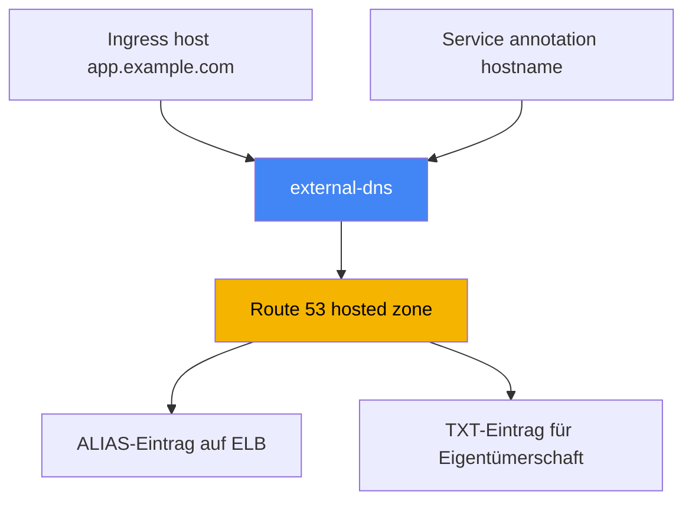
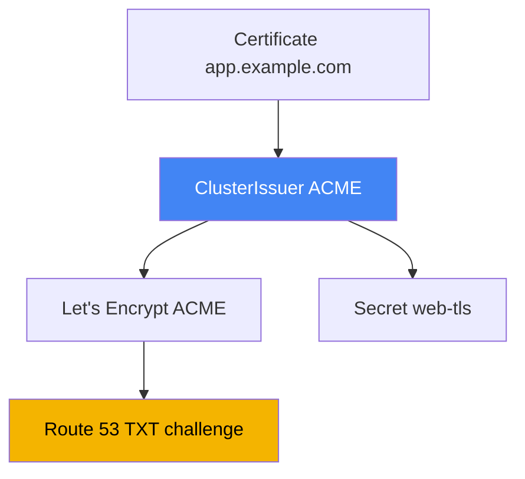

[Русская версия](ru.md) · [Eng version](en.md) · [Versión en español](es.md) · [Version française](fr.md) · [ქართული ვერსია](ge.md) · [繁體中文版](tw.md) · [日本語版](jp.md)
# Kapitel 29. DNS und Zertifikate: external-dns, Route 53, cert-manager

> **Wie es weitergeht.** Die Kapitel 26-28 zeigten, wie Load Balancer erstellt werden: NLB aus einem Service (Kapitel 26),
> ALB aus einem Ingress (Kapitel 27), ALB und VPC Lattice über Gateway API (Kapitel 28). Doch jede Adresse
> ist ein Maschinenname wie `...elb.amazonaws.com`, und Zertifikate wurden nur am Rande behandelt. Hier schließen
> wir zwei Lücken: die Automatisierung von DNS-Einträgen mit external-dns und Route 53 sowie die Verwaltung von
> Zertifikaten, ACM gegenüber cert-manager. ALB- und ACM-Annotationen behandelt Kapitel 27, NLB Kapitel 26,
> Gateway API Kapitel 28 und IRSA sowie Pod Identity für Controller-Berechtigungen die Kapitel 16-17.

## 29.1. „Die Website hat die Adresse a1b2...elb.amazonaws.com, und die Domain legen wir manuell an“

Der Load Balancer aus den vorherigen Kapiteln ist verfügbar, die Anwendung antwortet, aber seine Adresse sieht so aus:

```bash
kubectl get ingress
# NAME   CLASS   HOSTS               ADDRESS                                          PORTS
# web    alb     app.example.com     k8s-web-abc123-456.eu-central-1.elb.amazonaws.com  80
```

Einen solchen Namen kann man Benutzern nicht geben: Es wird `app.example.com` benötigt. Also geht jemand in die
Route-53-Konsole und erstellt einen Eintrag für diesen ELB. Ein Service ist noch erträglich. Bei Dutzenden Services
muss ein Engineer jedoch für jeden neuen Ingress oder Service manuell einen A- oder ALIAS-Eintrag erstellen und ihn
beim Entfernen wieder löschen. Das skaliert nicht und weicht von der Realität ab: Der Controller erstellt den Load
Balancer neu (Änderung von `scheme`, Neuaufbau eines Gateways), der DNS-Name des ELB ändert sich, aber der Eintrag in
Route 53 zeigt weiterhin auf den alten Namen.

Das Symptom im Bereitschaftsdienst: `curl app.example.com` führt zu einer toten Adresse, obwohl `kubectl get
ingress` bereits einen anderen ELB zeigt. Die Ursache ist eine Drift zwischen Cluster und Zone, die ein Mensch nicht
rechtzeitig behebt. Es wird ein Controller benötigt, der für DNS dasselbe tut wie LBC für Load Balancer: Einträge mit
Kubernetes-Objekten abgleichen. Das ist external-dns.

## 29.2. external-dns: DNS-Einträge aus Cluster-Objekten

**external-dns** ist ein Controller, der Kubernetes-Objekte (Ingress, Service und andere) beobachtet und Einträge im
DNS-Provider erstellt, aktualisiert und löscht, in unserem Fall Route 53. Er erstellt keine Load Balancer und
beantwortet keine DNS-Anfragen: Seine Aufgabe besteht darin, die aus Cluster-Objekten abgeleiteten gewünschten
Einträge mit dem tatsächlichen Zustand der Zone zu synchronisieren.

Die Quelle des Namens ist entweder `host` aus Ingress (oder aus HTTPRoute bei Gateway API) oder eine Annotation am
Service. Für einen Service wird der Name mit der Annotation `external-dns.alpha.kubernetes.io/hostname` angegeben,
und external-dns erstellt einen ALIAS auf die Load-Balancer-Adresse dieses Service:

```yaml
apiVersion: v1
kind: Service
metadata:
  name: web
  annotations:
    external-dns.alpha.kubernetes.io/hostname: app.example.com
spec:
  type: LoadBalancer
```



external-dns wird über das Helm-Chart `external-dns/external-dns` installiert. Wie LBC greift er über seinen
ServiceAccount auf AWS zu, daher benötigt er eine IAM-Rolle über IRSA oder Pod Identity (Kapitel 16-17). Der minimale
Berechtigungssatz laut external-dns-Dokumentation erlaubt das Ändern von Einträgen in Zonen und das Auflisten von
Zonen:

```json
{
  "Version": "2012-10-17",
  "Statement": [
    { "Effect": "Allow",
      "Action": [
        "route53:ChangeResourceRecordSets",
        "route53:ListResourceRecordSets",
        "route53:ListTagsForResources"
      ],
      "Resource": ["arn:aws:route53:::hostedzone/*"] },
    { "Effect": "Allow",
      "Action": ["route53:ListHostedZones"],
      "Resource": ["*"] }
  ]
}
```

Das Verhalten wird über Controller-Flags bestimmt. Die wichtigsten, die man kennen sollte:

| Flag | Zweck |
|---|---|
| `--provider=aws` | mit Route 53 arbeiten |
| `--source=ingress`, `--source=service` | Quellen für gewünschte Namen (mehrere möglich) |
| `--source=gateway-httproute`, `--source=gateway-grpcroute` | Namen aus Gateway-API-Ressourcen (Kapitel 28) |
| `--domain-filter=example.com` | Zonen auf eine Domain beschränken, fremde nicht anfassen |
| `--policy=upsert-only` \| `sync` | ohne Löschen von Einträgen oder vollständige Synchronisierung mit Löschung |
| `--registry=txt` | Eigentümerschaft von Einträgen in einem TXT-Eintrag speichern |
| `--txt-owner-id=<id>` | Eigentümerkennung im TXT-Eintrag, also wer den Eintrag besitzt |
| `--aws-zone-type=public` \| `private` | nur öffentliche oder nur private Zonen |

Für Gateway API lässt sich dies ohne Umdenken übertragen, jedoch mit zwei Vorbehalten. Erstens benötigt der
Controller im Cluster Berechtigungen für Ressourcen von `gateway.networking.k8s.io` (`gateways`, `httproutes`,
`grpcroutes`), andernfalls sieht er die Routen schlicht nicht. Zweitens gibt es eine oft übersehene Verteilung der
Annotationen: Der Name stammt aus `spec.hostnames` der Route,
die Annotation `external-dns.alpha.kubernetes.io/target` liest external-dns **nur von `Gateway`**, alle übrigen
Annotationen (`hostname`, `ttl`, providerspezifische) hingegen **nur von der Route**. Vertauscht gesetzte
Annotationen werden stillschweigend ignoriert. `TCPRoute` und `UDPRoute` haben überhaupt keine Namen in ihrer Spec,
daher wird ihr Hostname über eine Annotation angegeben.

Besondere Aufmerksamkeit verdient `--policy`. Bei `upsert-only` erstellt und aktualisiert external-dns Einträge nur,
löscht sie aber niemals. Das ist der sichere Modus für den Einstieg in eine fremde Zone. Bei `sync` gleicht er die Zone
exakt an den Cluster an und löscht dabei auch Einträge entfernter Objekte.

Ein eigenes Thema ist die Route-53-API, die Anfragegrenzen hat. Wie häufig external-dns die Zone synchronisiert,
legt `--interval` fest (standardmäßig `1m`); ein zu kurzes Intervall in einer großen Zone stößt schneller auf
Throttling. Damit `--interval` nicht für bessere Reaktionsfähigkeit verkürzt werden muss, wird `--events` aktiviert.
Dann startet der Zyklus zusätzlich bei Objektänderungen und nicht nur per Zeitgeber. Massenänderungen werden mit den
Flags `--aws-batch-change-size` (wie viele Änderungen pro Batch, standardmäßig `1000`) und
`--aws-batch-change-interval` (Pause zwischen Batches) gebündelt, um die API seltener aufzurufen.

## 29.3. Route 53: Hosted Zones, ALIAS und Zonenauswahl

Einträge leben in einer **hosted zone**, einem Container für DNS-Einträge einer Domain. Es gibt zwei Arten von Zonen.
Eine **public hosted zone** beantwortet Anfragen aus dem Internet und ist damit der öffentliche Zugang. Eine **private
hosted zone** ist einer oder mehreren VPCs zugeordnet und nur innerhalb dieser VPCs sichtbar, für interne Services und
interne Load Balancer mit `scheme: internal`.

Es können gleichzeitig öffentliche und private Zonen mit demselben Namen `app.example.com` bestehen: Von außen wird
die öffentliche Adresse aufgelöst, innerhalb der VPC die interne. Das ist **split-horizon DNS**: Ein Name, verschiedene
Antworten je nach Herkunft der Anfrage. Das Muster ist praktisch, wenn dieselbe Anwendung sowohl extern über einen
`internet-facing` ALB als auch intern über `internal` erreichbar ist.

Eine separate Frage ist der Eintragstyp. Ein Load Balancer in AWS wird über **ALIAS** statt CNAME angesprochen, und
dafür gibt es einen Grund. Ein CNAME kann nicht auf der Apex-Domain (also `example.com` selbst, ohne Subdomain)
verwendet werden, da dies der DNS-Standard verbietet. ALIAS ist eine Route-53-Erweiterung: Nach außen verhält er sich
wie ein A-Eintrag, wird zur ELB-Adresse aufgelöst, funktioniert sowohl auf der Apex-Domain als auch auf Subdomains und
wird nicht als zusätzliche Anfrage berechnet. Deshalb erstellt external-dns für ELB standardmäßig einen ALIAS.

Wie external-dns auswählt, in welche Zone geschrieben wird: Er ermittelt die Liste der hosted zones (unter
Berücksichtigung von `--aws-zone-type` und `--domain-filter`) und findet die Zone, deren Domain das längste Suffix des
gewünschten Namens ist. Für `app.example.com` passt die Zone `example.com`; gibt es eine spezifischere
`app.example.com`, wird diese gewählt. Wenn öffentliche und private Zonen denselben Namen tragen, wird der Eintrag
mit der Annotation `external-dns.alpha.kubernetes.io/aws-hosted-zone-id` an eine bestimmte Zone gebunden.

## 29.4. TXT-Register für Eigentümerschaft und mehrere Cluster in einer Zone

external-dns darf keine Einträge anfassen, die er nicht erstellt hat: In einer Zone können manuell, durch Terraform
oder durch einen anderen Cluster angelegte Einträge existieren. Um eigene von fremden Einträgen zu unterscheiden,
verwendet er ein **TXT-Register** (`--registry=txt`). Neben jedem verwalteten Eintrag legt external-dns einen
TXT-Markereintrag ab: „Dieser Eintrag wird von external-dns verwaltet, Eigentümer ist dieser.“

Der Eigentümer wird mit `--txt-owner-id` gesetzt. Bei der Synchronisierung ändert und löscht external-dns nur
Einträge, die einen TXT-Marker mit **seiner** owner-id haben. Einen Eintrag ohne Marker oder mit einer fremden owner-id
fasst er auch im Modus `--policy=sync` nicht an. Dies schützt davor, dass ein Controller Einträge löscht, die von
etwas anderem verwaltet werden.

Daraus folgt die Regel für mehrere Cluster, die in dieselbe Zone schreiben: Jeder Cluster muss eine **eigene
eindeutige** `--txt-owner-id` haben. Andernfalls betrachten zwei external-dns-Instanzen die Einträge des jeweils
anderen als ihre eigenen und erstellen sowie löschen sie um die Wette, wodurch die Zone ständig hin und her wechselt.
Unterschiedliche owner-ids machen die Eigentümerschaft eindeutig: Jeder Cluster verwaltet nur seinen eigenen Satz von
Einträgen.

| Einstellung | Funktion | Risiko bei Fehler |
|---|---|---|
| `--registry=txt` | markiert eigene Einträge mit einem TXT-Marker | ohne ihn lassen sich eigene und fremde Einträge nicht unterscheiden |
| `--txt-owner-id` | Eigentümerkennung im Marker | identisch für zwei Cluster: Kampf um Einträge |
| `--policy=upsert-only` | Löschen verbieten | Schutz vor versehentlicher Bereinigung fremder Einträge |
| `--domain-filter` | Zonen auf eine Domain beschränken | ohne ihn sieht der Controller alle Zonen des Accounts |

## 29.5. Zertifikate: ACM gegenüber cert-manager

Die zweite Lücke sind TLS-Zertifikate. In EKS gibt es zwei grundverschiedene Quellen, die nicht verwechselt werden
sollten: Sie lösen verschiedene Aufgaben und befinden sich an unterschiedlichen Stellen.

**AWS Certificate Manager (ACM)** stellt Zertifikate bereit, die auf dem Load Balancer leben. Die TLS-Terminierung
findet am ALB oder NLB statt (Kapitel 27), der private Schlüssel aus ACM ist nicht exportierbar und gelangt nicht in
den Cluster, und AWS kümmert sich selbst um die Verlängerung. Für öffentlichen HTTPS-Zugang über ALB ist dies die
richtige Standardwahl: `certificate-arn` konfigurieren (oder automatische Erkennung nach Host), danach übernimmt AWS
den Rest. Der Nachteil ist genau einer und zugleich grundlegend: Der Schlüssel kann nicht extrahiert werden, daher
kann dieses Zertifikat nicht in einen Pod gelegt werden.

**cert-manager** ist ein Controller, der Zertifikate **innerhalb** des Clusters ausstellt und sie in einem normalen
`Secret` ablegt. Er wird benötigt, wenn das Zertifikat in einem Pod verfügbar sein muss: mTLS zwischen Services, TLS
an einem Nicht-ALB-Ingress (zum Beispiel ingress-nginx), interne Services, bei denen die Terminierung in der
Anwendung selbst erfolgt. cert-manager unterstützt mehrere Quellen (Issuer): eine öffentliche CA über ACME (Let's
Encrypt), eine eigene CA, AWS Private CA über einen separaten aws-privateca-issuer. Er überwacht auch die Laufzeit
und stellt Zertifikate vor ihrem Ablauf erneut aus.

Die grobe Grenze: Wenn TLS am Load Balancer terminiert wird, ACM; wenn das Zertifikat im Cluster als von einem Pod
gelesenes Objekt benötigt wird, cert-manager. Eine ausführliche Auswahltabelle folgt in 29.7.

## 29.6. cert-manager mit Let's Encrypt und DNS-01 über Route 53

Betrachten wir das häufigste cert-manager-Szenario in EKS: ein öffentliches Zertifikat von Let's Encrypt über das
**ACME**-Protokoll mit Nachweis der Domaininhaberschaft per **DNS-01**. Bei DNS-01 fordert die Zertifizierungsstelle
den Nachweis der Kontrolle über die Domain, indem ein bestimmter TXT-Eintrag erstellt wird; cert-manager erstellt ihn
in Route 53, der ACME-Server prüft ihn und stellt das Zertifikat aus. Dafür benötigt cert-manager Berechtigungen für
Route 53, also dieselbe Anbindung über IRSA oder Pod Identity (Kapitel 16-17).

Die DNS-01-Berechtigungen für cert-manager sind enger als für external-dns: Zusätzlich zu `route53:GetChange` (Prüfen
des Anwendungsstatus) und `route53:ChangeResourceRecordSets` mit `route53:ListResourceRecordSets` für Zonen wird
`route53:ListHostedZonesByName` benötigt (dies kann entfallen, wenn `hostedZoneID` angegeben wird).

Die Zertifikatsquelle wird als Objekt **ClusterIssuer** (für den gesamten Cluster) oder **Issuer** (für einen
Namespace) beschrieben. Für ACME mit DNS-01 über Route 53 kann der Abschnitt `route53` leer sein, wenn die
Berechtigungen aus ambient-credentials (IRSA oder Pod Identity) stammen: Das SDK übernimmt die Rolle selbst.

```yaml
apiVersion: cert-manager.io/v1
kind: ClusterIssuer
metadata:
  name: letsencrypt-prod
spec:
  acme:
    server: https://acme-v02.api.letsencrypt.org/directory
    email: ops@example.com
    privateKeySecretRef:
      name: letsencrypt-prod-account-key
    solvers:
      - dns01:
          route53:
            region: eu-central-1
```

Das Zertifikat selbst wird als Objekt **Certificate** angefordert: Name, Domains und `secretName` werden angegeben,
in dem cert-manager das ausgestellte Zertifikat und den Schlüssel ablegt. Dieses `Secret` wird anschließend in einen
Pod eingebunden oder einem Ingress-Controller übergeben:

```yaml
apiVersion: cert-manager.io/v1
kind: Certificate
metadata:
  name: web-tls
spec:
  secretName: web-tls          # hier werden tls.crt und tls.key abgelegt
  dnsNames: ["app.example.com"]
  issuerRef:
    name: letsencrypt-prod
    kind: ClusterIssuer
```



Zur Zugriffstrennung: Ambient-credentials sind standardmäßig nur für ClusterIssuer verfügbar, nicht für Issuer,
damit ein Namespace-Benutzer keine Zertifikate über eine zufällig verfügbare Rolle ausstellt. Für Mandantenfähigkeit
unterstützt cert-manager einen eigenen ServiceAccount für einen Issuer
(`auth.kubernetes.serviceAccountRef`) mit einer eingeschränkten Rolle für den Mandanten. Für interne Zertifikate
werden statt Let's Encrypt eine eigene CA oder **AWS Private CA** über `aws-privateca-issuer` verwendet.

## 29.7. Wann ACM, wann cert-manager

Beide Mechanismen stellen TLS-Zertifikate aus, aber die Auswahl wird durch eine Frage bestimmt: Wo wird der private
Schlüssel benötigt? Auf dem Load Balancer: ACM; im Pod: cert-manager.

| Situation | Quelle | Warum |
|---|---|---|
| Öffentlicher Zugang über ALB (Ingress, Gateway) | ACM | Terminierung am ALB, Schlüssel wird nicht im Pod benötigt |
| TLS auf NLB mit Terminierung am Load Balancer | ACM | dasselbe, der Schlüssel liegt am Listener |
| mTLS zwischen Pods | cert-manager | Schlüssel wird im Pod als Secret benötigt |
| ingress-nginx oder ein anderer Nicht-ALB-Ingress | cert-manager | Terminierung im Pod des Controllers |
| Interner Service, TLS in der Anwendung | cert-manager | die Anwendung benötigt den Schlüssel |
| Interne Unternehmens-CA | cert-manager + AWS Private CA | Ausstellung durch eine private CA |

Das Wesentliche lässt sich nicht umgehen: Ein ACM-Zertifikat kann nicht extrahiert und in einen Pod gelegt werden. Der
Schlüssel ist by design nicht exportierbar, daher wird für einen Pod immer cert-manager verwendet. Umgekehrt ist es
sinnlos, Zertifikate aus cert-manager auf einem öffentlichen ALB zu verwenden, wenn ACM dies ohne Schlüssel erledigt.

## 29.8. Typische Fallstricke

Einige Dinge, die in Produktion auffallen.

- **DNS propagation.** Ein erstellter Eintrag ist nicht sofort sichtbar: Zuerst akzeptiert Route 53 ihn, dann muss der
  TTL der alten Antwort in Resolver-Caches ablaufen. Eine frische Domain oder geänderte Adresse kann einige Minuten
  lang „nicht aufgelöst werden“. Das ist nicht immer ein Fehler von external-dns, häufig nur TTL.
- **Eigentümerschaft über TXT.** Ohne `--registry=txt` und `--txt-owner-id` kann external-dns im Modus `sync`
  Einträge löschen, die er für überflüssig hält, auch solche, die nicht von ihm angelegt wurden. Das TXT-Register ist
  verpflichtende Hygiene, keine Option.
- **Mehrere Cluster in einer Zone.** Eine eindeutige `--txt-owner-id` pro Cluster ist Pflicht, sonst geraten die
  Controller in Konflikt. Oft ist es einfacher, jedem Cluster eine eigene Subdomain und einen `--domain-filter` zu
  geben, damit sich die Zonen überhaupt nicht überschneiden.
- **Throttling der Route-53-API.** In großen Zonen stoßen häufige Synchronisierungen an Anfragegrenzen. Man hält
  `--interval` moderat, aktiviert `--events` für Reaktionsfähigkeit und bündelt Änderungen über
  `--aws-batch-change-size` und `--aws-batch-change-interval`.
- **Private Zonen für interne Load Balancer.** Für `internal` ALB und NLB führen Einträge in eine mit der VPC
  verbundene private hosted zone; external-dns wird auf `--aws-zone-type=private` beschränkt. Eine gemeinsame oder
  fremde Zone wird mit `--policy=upsert-only` betreten; vollständiges `sync` mit Löschung wird nur aktiviert, wenn
  external-dns der alleinige Eigentümer der Einträge in der Zone ist.

## 29.9. Einsatz in Produktion

- **DNS-Einträge werden nicht manuell angelegt.** external-dns wird einmal installiert, erhält eine Rolle über IRSA
  oder Pod Identity (Kapitel 16-17), und anschließend erscheinen und verschwinden Namen zusammen mit Ingress und
  Service.
- **TXT-Register und owner-id immer.** `--registry=txt` und eine eindeutige `--txt-owner-id` pro Cluster werden vom
  ersten Tag an aktiviert, damit die Synchronisierung keine fremden Einträge löscht.
- **Zonen werden abgegrenzt.** `--domain-filter` und bei Bedarf `--aws-zone-type` halten den Controller in seinen
  Zonen; für interne Services wird eine private hosted zone eingerichtet.
- **Öffentliches HTTPS über ACM.** Zertifikate für ALB und NLB bleiben mit automatischer Verlängerung in ACM;
  cert-manager wird dafür nicht eingesetzt.
- **cert-manager dort, wo der Schlüssel im Pod benötigt wird.** mTLS, Nicht-ALB-Ingress und interne Services werden
  mit cert-manager abgesichert; für DNS-01 erhält er eine Rolle für Route 53, für interne Zertifikate AWS Private CA.
- **ClusterIssuer unter Kontrolle der Plattform.** Ambient-credentials bleiben ausschließlich bei ClusterIssuer;
  Mandanten erhalten bei Bedarf einen Issuer mit separatem ServiceAccount und eingeschränkter Rolle.

## 29.10. Mini-Glossar

- **external-dns**: Controller, der DNS-Einträge beim Provider mit Kubernetes-Objekten (Ingress, Service)
  synchronisiert; in AWS arbeitet er mit Route 53.
- **hosted zone**: Container für DNS-Einträge einer Domain in Route 53; entweder public (Internet) oder private
  (an eine VPC gebunden).
- **ALIAS**: Route-53-Eintrag für eine AWS-Ressource (zum Beispiel ELB), funktioniert auf der Apex-Domain, wo CNAME
  verboten ist, und wird nicht als separate Anfrage berechnet.
- **split-horizon DNS**: Ein Name mit unterschiedlichen Antworten außerhalb und innerhalb einer VPC über ein Paar
  aus public und private Zonen.
- **TXT-Register**: external-dns-Mechanismus, der eigene Einträge mit einem TXT-Marker markiert; der Eigentümer wird
  mit `--txt-owner-id` festgelegt.
- **ACM (AWS Certificate Manager)**: Zertifikate, die auf dem Load Balancer leben; der Schlüssel ist nicht
  exportierbar, die Verlängerung erfolgt automatisch.
- **cert-manager**: Controller, der Zertifikate innerhalb des Clusters als `Secret` ausstellt; die Quelle wird durch
  ClusterIssuer oder Issuer angegeben.
- **DNS-01**: Verfahren der ACME-Prüfung der Domaininhaberschaft über einen TXT-Eintrag; in Route 53 erstellt ihn
  cert-manager.
- **ClusterIssuer / Issuer**: cert-manager-Objekte, die die Zertifikatsquelle für den gesamten Cluster oder für einen
  Namespace beschreiben.

## 29.11. Zusammenfassung des Kapitels

- Ein Load Balancer erhält einen maschinenlesbaren ELB-Namen; die manuelle Verwaltung von A/ALIAS-Einträgen skaliert
  nicht und weicht bei einer Neuerstellung des LB von der Realität ab. DNS muss automatisiert werden.
- external-dns überwacht Ingress und Service und gleicht Einträge in Route 53 mit dem Cluster ab; er wird über Helm
  installiert und greift per IRSA- oder Pod-Identity-Rolle auf AWS zu (Kapitel 16-17).
- external-dns-Berechtigungen: `route53:ChangeResourceRecordSets`, `ListResourceRecordSets`,
  `ListTagsForResources` für Zonen sowie `ListHostedZones`; das Verhalten steuern die Flags `--provider=aws`,
  `--source`, `--domain-filter`, `--policy`, `--registry=txt`, `--txt-owner-id`.
- Route 53 verwaltet public und private hosted zones; ELB wird über ALIAS angesprochen (funktioniert auf der Apex-
  Domain im Gegensatz zu CNAME); external-dns wählt die Zone nach dem längsten Namenssuffix aus.
- Das TXT-Register mit `--txt-owner-id` definiert die Eigentümerschaft von Einträgen: Der Controller fasst nur seine
  eigenen an, und mehrere Cluster in einer Zone benötigen eindeutige owner-ids.
- ACM hält ein Zertifikat mit automatischer Verlängerung und nicht exportierbarem Schlüssel auf dem Load Balancer,
  für öffentliches HTTPS über ALB und NLB; der Schlüssel kann nicht in einen Pod gegeben werden.
- cert-manager stellt Zertifikate im Cluster als Secret für mTLS, Nicht-ALB-Ingress und interne Services aus; ACME
  mit DNS-01 über Route 53 sowie eigene CA und AWS Private CA werden unterstützt.
- Die Auswahl ist einfach: Schlüssel auf dem Load Balancer: ACM, Schlüssel im Pod: cert-manager; ein ACM-Zertifikat
  kann nicht in einen Pod gelegt werden.

## 29.12. Nutzen in der täglichen Arbeit

Im Bereitschaftsdienst lassen sich DNS-Incidents in EKS auf wenige Ursachen zurückführen. Ein Name wird nicht
aufgelöst, obwohl das Objekt existiert: external-dns-Logs prüfen (`AccessDenied` ist ein Rollenproblem, wie in
Kapitel 26 mit LBC), ob der Name unter `--domain-filter` fällt und, wenn alles sauber ist, TTL und propagation
abwarten. Ein Eintrag zeigt auf einen alten ELB: Der Controller hat die Neuerstellung des Load Balancers nicht
bemerkt. Ein Eintrag ist plötzlich verschwunden: Fast immer `--policy=sync` ohne TXT-Eigentümerschaft oder zwei
Cluster mit derselben `--txt-owner-id`. Bei einem TLS-Fehler von außen werden ACM und Listener geprüft (Kapitel 27),
intern Certificate und sein Secret in cert-manager.

Bei der Planung sollten drei Entscheidungen vorab getroffen werden. Wer besitzt die Zone und wie werden Einträge
abgegrenzt (owner-id, domain-filter, separate Subdomains pro Cluster)? Wo wird TLS terminiert: Öffentlicher Zugang
bedeutet ACM auf dem Load Balancer, interner Traffic und mTLS bedeuten cert-manager mit Schlüssel im Pod. Und wie ist
der Zugriff aufgebaut: external-dns und cert-manager greifen beide über eine Rolle auf Route 53 zu, daher werden ihre
IRSA oder Pod Identity gemeinsam mit den Zonen entworfen und nicht erst während eines Incidents.

## 29.13. Fragen zur Selbstkontrolle

1. Warum kann eine Load-Balancer-Adresse wie `...elb.amazonaws.com` nicht an Benutzer gegeben werden, und worin liegt
   das Problem manueller Eintragsverwaltung?
2. Was tut external-dns, und inwiefern ähnelt seine Arbeit der des AWS Load Balancer Controller?
3. Aus welchen Quellen bezieht external-dns gewünschte Namen, und welche Annotation legt den Namen für einen Service fest?
4. Welche Route-53-Berechtigungen benötigt external-dns, und wie erhält er Zugriff auf AWS?
5. Worin unterscheiden sich `--policy=upsert-only` und `--policy=sync`, und wann ist welche sicherer?
6. Worin unterscheidet sich eine public hosted zone von einer private hosted zone, und was ist split-horizon DNS?
7. Warum wird ein Load Balancer über ALIAS statt CNAME angesprochen, insbesondere auf der Apex-Domain?
8. Wozu dient das TXT-Register, und was passiert bei derselben `--txt-owner-id` in zwei Clustern?
9. Was ist der grundlegende Unterschied zwischen ACM und cert-manager bezüglich des Speicherorts des Schlüssels?
10. Warum kann ein Zertifikat aus ACM nicht innerhalb eines Pods verwendet werden?
11. Wie funktioniert die Zertifikatsausstellung durch cert-manager über ACME und DNS-01 in Route 53?
12. Was beschreiben ClusterIssuer und Certificate, und wo landet das ausgestellte Zertifikat?
13. In welchen Fällen wird cert-manager statt ACM verwendet, und wann wird AWS Private CA benötigt?

## Praxis

Die Kursübung zu diesem Thema: [Übung 109: Ingress über ALB mit ACM-Zertifikat, external-dns und Route
53](../../labs/109/README_DE.MD). Darüber hinaus lässt sich alles auf einem laufenden Cluster prüfen. Sehen Sie
zunächst nach, ob external-dns installiert und gesund ist, und prüfen Sie seine Flags:

```bash
kubectl get deploy -n kube-system external-dns          # oder in Ihrem Namespace
kubectl get deploy external-dns -o yaml | grep -A2 args  # --source, --policy, --txt-owner-id
kubectl logs deploy/external-dns | tail -n 30            # Berechtigungsfehler erscheinen als AccessDenied
```

Erstellen Sie einen Service vom Typ LoadBalancer mit der Annotation
`external-dns.alpha.kubernetes.io/hostname` oder einen Ingress mit `host` und warten Sie. Prüfen Sie auf AWS-Seite,
dass der Eintrag und sein TXT-Marker in der richtigen Zone erschienen sind:

```bash
aws route53 list-hosted-zones                            # ZONE_ID Ihrer Zone suchen
aws route53 list-resource-record-sets --hosted-zone-id <ZONE_ID> \
  --query "ResourceRecordSets[?Name=='app.example.com.']"
```

Beachten Sie die zwei Einträge für einen Namen: ALIAS (Typ A) auf den ELB und den TXT-Marker der Eigentümerschaft mit
Ihrer owner-id. Vergleichen Sie danach die zwei Zertifikatsquellen: Öffentliche Zertifikate für den Load Balancer
leben in ACM, während cert-manager den Schlüssel in einem normalen `Secret` im Cluster ablegt:

```bash
aws acm list-certificates --query "CertificateSummaryList[].[DomainName,CertificateArn]"
kubectl get clusterissuers                  # falls cert-manager installiert ist
kubectl get certificate,secret | grep tls
kubectl describe certificate web-tls        # Status, DNS-01-Challenge, Zeitpunkt der erneuten Ausstellung
```

Ein ACM-Zertifikat hat keinen Schlüssel im Cluster und wird auch keinen haben, während cert-manager `tls.crt` und
`tls.key` in einem `Secret` ablegt, das ein Pod liest. Das ist die Grenze zwischen den beiden Ansätzen.

---
[Inhaltsverzeichnis](../README_DE.md) · [Kapitel 28](../28/de.md) · [Kapitel 30](../30/de.md)
