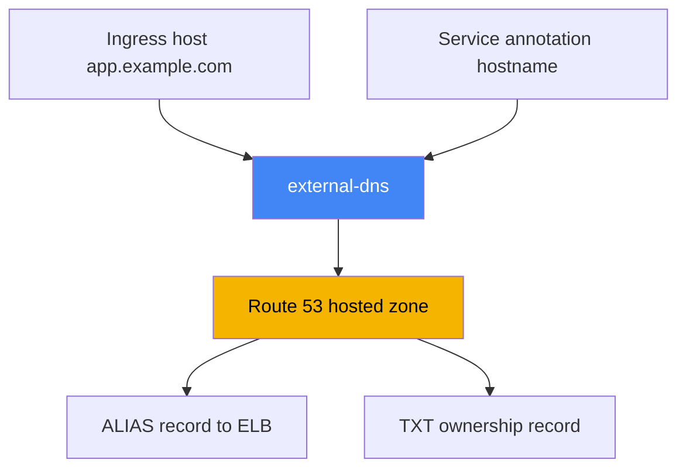
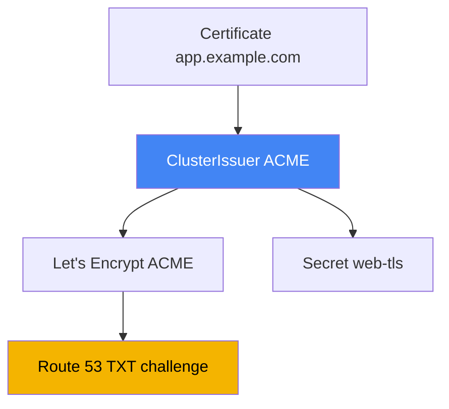

[Русская версия](ru.md) · [Versión en español](es.md) · [Version française](fr.md) · [Deutsche Version](de.md) · [ქართული ვერსია](ge.md) · [繁體中文版](tw.md) · [日本語版](jp.md)
# Chapter 29. DNS and certificates: external-dns, Route 53, cert-manager

> **What is next.** Chapters 26-28 taught you how to create load balancers: an NLB from a Service
> (Chapter 26), an ALB from an Ingress (Chapter 27), and an ALB and VPC Lattice through Gateway API
> (Chapter 28). However, each address is a machine name such as `...elb.amazonaws.com`, and
> certificates were covered only briefly. Here we close two gaps: DNS-record automation through
> external-dns and Route 53, and certificate management - ACM versus cert-manager. ALB and ACM
> annotations are in Chapter 27, NLB is in Chapter 26, Gateway API is in Chapter 28, and IRSA and
> Pod Identity for controller permissions are in Chapters 16-17.

## 29.1. "The site has an a1b2...elb.amazonaws.com address, and we create the domain manually"

The load balancer from the previous chapters is up, the application responds, but its address looks
like this:

```bash
kubectl get ingress
# NAME   CLASS   HOSTS               ADDRESS                                          PORTS
# web    alb     app.example.com     k8s-web-abc123-456.eu-central-1.elb.amazonaws.com  80
```

You cannot give a user such a name: you need `app.example.com`. So someone goes to the Route 53
console and creates a record pointing to this ELB. One service is tolerable. But with dozens of
services, an engineer manually creates an A or ALIAS record for every new Ingress or Service, and
must remember to clean it up on deletion. This does not scale and drifts from reality: the
controller recreates a load balancer (a scheme change or Gateway rebuild), the ELB DNS name
changes, and the Route 53 record continues to point to the old name.

An on-call symptom: `curl app.example.com` goes to a dead address even though `kubectl get
ingress` already shows a different ELB. The reason is a mismatch between the cluster and the zone
that a person cannot close quickly enough. You need a controller that does for DNS what LBC does
for load balancers: brings records in line with Kubernetes objects. That is external-dns.

## 29.2. external-dns: DNS records from cluster objects

**external-dns** is a controller that watches Kubernetes objects (Ingress, Service, and others)
and creates, updates, and removes records in a DNS provider, in our case Route 53. It does not
create load balancers and does not answer DNS queries: its job is to synchronize desired records,
derived from cluster objects, with the actual state of a zone.

The name source is either the host from an Ingress (or an HTTPRoute when using Gateway API), or an
annotation on a Service. For a Service, the name is specified with the
`external-dns.alpha.kubernetes.io/hostname` annotation, and external-dns creates an ALIAS to that
Service's load-balancer address:

```yaml
apiVersion: v1
kind: Service
metadata:
  name: web
  annotations:
    external-dns.alpha.kubernetes.io/hostname: app.example.com
spec:
  type: LoadBalancer
```



external-dns is installed through the `external-dns/external-dns` Helm chart. Like LBC, it calls
AWS through its ServiceAccount, so it needs an IAM role through IRSA or Pod Identity (Chapters
16-17). The minimum permissions from the external-dns documentation are changing records in zones
and listing zones:

```json
{
  "Version": "2012-10-17",
  "Statement": [
    { "Effect": "Allow",
      "Action": [
        "route53:ChangeResourceRecordSets",
        "route53:ListResourceRecordSets",
        "route53:ListTagsForResources"
      ],
      "Resource": ["arn:aws:route53:::hostedzone/*"] },
    { "Effect": "Allow",
      "Action": ["route53:ListHostedZones"],
      "Resource": ["*"] }
  ]
}
```

Controller behavior is controlled with flags. The key ones worth knowing by heart are:

| Flag | Purpose |
|---|---|
| `--provider=aws` | work with Route 53 |
| `--source=ingress`, `--source=service` | where to obtain desired names (multiple sources are allowed) |
| `--source=gateway-httproute`, `--source=gateway-grpcroute` | names from Gateway API resources (Chapter 28) |
| `--domain-filter=example.com` | limit zones by domain; do not touch others |
| `--policy=upsert-only` \| `sync` | no record deletion, or full synchronization including deletion |
| `--registry=txt` | store record ownership in a TXT record |
| `--txt-owner-id=<id>` | ownership identifier in TXT: who exactly owns the record |
| `--aws-zone-type=public` \| `private` | only public or only private zones |

This carries over to Gateway API without relearning, but with two caveats. First, the controller
needs cluster permissions for `gateway.networking.k8s.io` resources (`gateways`, `httproutes`,
`grpcroutes`), otherwise it simply will not see the routes. Second is annotation placement, which
is a common stumbling block: the name comes from the route's `spec.hostnames`, external-dns reads
the `external-dns.alpha.kubernetes.io/target` annotation **only from `Gateway`**, and all other
annotations (`hostname`, `ttl`, provider-specific ones) **only from the route**. Annotations
placed the other way around are silently ignored. `TCPRoute` and `UDPRoute` have no names in their
spec at all, so their hostname is set by annotation.

`--policy` requires particular attention. With `upsert-only`, external-dns only creates and
updates records, but never removes them - a safe mode when entering someone else's zone. With
`sync`, it brings the zone into exact alignment with the cluster, including removing records for
deleted objects.

A separate subject is the Route 53 API, which has request limits. How often external-dns
synchronizes a zone is set by `--interval` (default `1m`); too short an interval on a large zone
hits throttling sooner. To avoid lowering `--interval` for responsiveness, enable `--events` -
then the cycle also runs when objects change, not only on a timer. Batch mass changes with
`--aws-batch-change-size` (the number of changes in one batch, default `1000`) and
`--aws-batch-change-interval` (the pause between batches) to call the API less often.

## 29.3. Route 53: hosted zones, ALIAS, and zone selection

Records live in a **hosted zone** - a container for a domain's records. There are two types of
zones. A **public hosted zone** answers requests from the internet - this is the public entry
point. A **private hosted zone** is associated with one or more VPCs and is visible only from
within those VPCs - for internal services and internal load balancers with `scheme: internal`.

You can maintain public and private zones with the same `app.example.com` name simultaneously:
the public address resolves from outside, and the internal one from within the VPC. This is
**split-horizon DNS**: one name, different answers depending on where the request came from. The
pattern is convenient when the same application is available both externally through an
`internet-facing` ALB and internally through an `internal` one.

A separate question is the record type. A load balancer in AWS uses an **ALIAS**, not a CNAME, and
there is a reason for that. A CNAME cannot be assigned at the domain apex (`example.com` itself,
without a subdomain) - this is prohibited by the DNS standard. ALIAS is a Route 53 extension: it
externally behaves like an A record, resolves to an ELB address, works both at the apex and on
subdomains, and is not billed as an extra query. Therefore, external-dns creates an ALIAS for ELB
by default.

How does external-dns choose which zone to write to? It takes the list of hosted zones (taking
`--aws-zone-type` and `--domain-filter` into account) and finds the zone whose domain is the
longest suffix of the desired name. For `app.example.com`, the `example.com` zone works, but if a
narrower `app.example.com` zone exists, it is selected. When public and private zones have the
same name, pin a record to a specific zone with the
`external-dns.alpha.kubernetes.io/aws-hosted-zone-id` annotation.

## 29.4. TXT ownership registry and multiple clusters sharing one zone

external-dns must not touch records it did not create: a zone can contain records created
manually, by Terraform, or by another cluster. To distinguish its records from other records, it
uses a **TXT registry** (`--registry=txt`). Next to every managed record, external-dns places a
TXT marker record: "this record is managed by external-dns, with this owner."

The owner is set by `--txt-owner-id`. During synchronization, external-dns changes and removes
only records with a TXT marker carrying **its** owner ID. It will not touch a record without a
marker or with someone else's owner ID, even in `--policy=sync` mode. This prevents one controller
from removing records managed by something else.

This leads to the rule for multiple clusters that write to one zone: every cluster must have **its
own unique** `--txt-owner-id`. Otherwise, two external-dns instances consider each other's records
their own and race to create and remove them, driving the zone back and forth. Different owner IDs
make ownership unambiguous: each cluster manages only its own set of records.

| Setting | What it does | Risk if misconfigured |
|---|---|---|
| `--registry=txt` | marks its records with a TXT marker | without it, its records cannot be distinguished from others' |
| `--txt-owner-id` | owner identifier in the marker | the same value on two clusters causes a record war |
| `--policy=upsert-only` | prohibits deletion | protection against accidentally cleaning up another owner's records |
| `--domain-filter` | limits zones by domain | without it, the controller sees every zone in the account |

## 29.5. Certificates: ACM versus cert-manager

The second gap is TLS certificates. EKS has two fundamentally different sources, and they should
not be confused: they solve different problems and live in different places.

**AWS Certificate Manager (ACM)** is a certificate that lives on a load balancer. TLS termination
happens on the ALB or NLB (Chapter 27), the private key from ACM cannot be exported and does not
enter the cluster, and AWS itself handles renewal. This is the right default choice for public
HTTPS ingress through an ALB: configure `certificate-arn` (or host-based auto-discovery), and AWS
handles everything after that. There is exactly one, but fundamental, downside: the key cannot be
extracted, so such a certificate cannot be placed in a pod.

**cert-manager** is a controller that issues certificates **inside** the cluster and places them
in an ordinary `Secret`. It is needed when a certificate must reach a pod: mTLS between services,
TLS on non-ALB ingress (for example, ingress-nginx), or internal services where termination takes
place in the application itself. cert-manager supports several sources (issuers): a public CA
through ACME (Let's Encrypt), your own CA, or AWS Private CA through a separate
aws-privateca-issuer. It also monitors expiry and renews a certificate before it expires.

The rough boundary is this: if TLS terminates at the load balancer, use ACM; if the certificate is
needed inside the cluster as an object read by a pod, use cert-manager. The detailed selection
table is in 29.7.

## 29.6. cert-manager with Let's Encrypt and DNS-01 through Route 53

Let us examine the most common cert-manager scenario in EKS: a public certificate from Let's
Encrypt through the **ACME** protocol, with domain ownership verified through **DNS-01**. With
DNS-01, the certificate authority asks you to prove control over the domain by creating a specific
TXT record; cert-manager creates it in Route 53, the ACME server verifies it and issues a
certificate. For this, cert-manager needs Route 53 permissions, meaning the same IRSA or Pod
Identity setup (Chapters 16-17).

Permissions for DNS-01 in cert-manager are narrower than for external-dns: in addition to
`route53:GetChange` (checking application status) and `route53:ChangeResourceRecordSets` with
`route53:ListResourceRecordSets` on zones, it needs `route53:ListHostedZonesByName` (which can be
removed if `hostedZoneID` is set).

The certificate source is described by a **ClusterIssuer** object (for the whole cluster) or an
**Issuer** (for a namespace). For ACME with DNS-01 through Route 53, when permissions are obtained
from ambient credentials (IRSA or Pod Identity), the `route53` section can be empty - the SDK
picks up the role itself:

```yaml
apiVersion: cert-manager.io/v1
kind: ClusterIssuer
metadata:
  name: letsencrypt-prod
spec:
  acme:
    server: https://acme-v02.api.letsencrypt.org/directory
    email: ops@example.com
    privateKeySecretRef:
      name: letsencrypt-prod-account-key
    solvers:
      - dns01:
          route53:
            region: eu-central-1
```

The certificate itself is requested with a **Certificate** object: specify its name, domains, and
the `secretName` into which cert-manager places the issued certificate and key. Then mount this
`Secret` in a pod or give it to an ingress controller:

```yaml
apiVersion: cert-manager.io/v1
kind: Certificate
metadata:
  name: web-tls
spec:
  secretName: web-tls          # tls.crt and tls.key will be placed here
  dnsNames: ["app.example.com"]
  issuerRef:
    name: letsencrypt-prod
    kind: ClusterIssuer
```



Regarding access control: by default, ambient credentials are available only to ClusterIssuer, not
to Issuer, so that a namespace user does not issue certificates through an accidentally available
role. For multitenancy, cert-manager supports a separate ServiceAccount on an Issuer
(`auth.kubernetes.serviceAccountRef`) with a narrow tenant role. For internal certificates, use
your own CA or **AWS Private CA** through `aws-privateca-issuer` instead of Let's Encrypt.

## 29.7. When to use ACM and when to use cert-manager

Both mechanisms issue TLS certificates, but the choice is determined by one question: where is
the private key needed? If it is on the load balancer, use ACM; if it is in a pod, use
cert-manager.

| Situation | Source | Why |
|---|---|---|
| Public ingress through ALB (Ingress, Gateway) | ACM | termination on ALB; the key is not needed in the pod |
| TLS on NLB with termination at the load balancer | ACM | same: the key lives on the listener |
| mTLS between pods | cert-manager | the key is needed inside the pod as a Secret |
| ingress-nginx or another non-ALB ingress | cert-manager | termination in the controller pod |
| Internal service, TLS in the application | cert-manager | the application needs the key |
| Internal corporate CA | cert-manager + AWS Private CA | issuance from a private CA |

The essential limitation cannot be avoided: an ACM certificate cannot be extracted and placed in
a pod - the key is non-exportable by design, so a pod always requires cert-manager. Conversely,
routing certificates from cert-manager to a public ALB is pointless when ACM does this without a
key.

## 29.8. Pitfalls you encounter

A few things that occur in production.

- **DNS propagation.** A created record is not visible immediately: Route 53 accepts it first,
  then the TTL of the old answer in resolver caches must expire. A fresh domain or changed address
  may "not resolve" for several minutes - this is not always an external-dns bug; often it is just
  TTL.
- **Ownership through TXT.** Without `--registry=txt` and `--txt-owner-id`, external-dns in
  `sync` mode can remove records it considers unnecessary, including ones not created by it. The
  TXT registry is mandatory hygiene, not an option.
- **Multiple clusters sharing one zone.** A unique `--txt-owner-id` per cluster is mandatory,
  otherwise controllers conflict. It is often simpler to give every cluster its own subdomain and
  `--domain-filter` so their zones never overlap.
- **Route 53 API throttling.** In large zones, frequent synchronizations hit request limits. Keep
  `--interval` moderate, enable `--events` for responsiveness, and batch changes with
  `--aws-batch-change-size` and `--aws-batch-change-interval`.
- **Private zones for internal load balancers.** For `internal` ALBs and NLBs, records point to a
  private hosted zone associated with the VPC; limit external-dns with `--aws-zone-type=private`.
  Enter a shared or someone else's zone with `--policy=upsert-only`, and enable full `sync` with
  deletion only when external-dns is the sole owner of the zone's records.

## 29.9. How this is used in production

- **Do not create DNS records manually.** Install external-dns once, give it a role through IRSA
  or Pod Identity (Chapters 16-17), and names then appear and disappear with Ingress and Service.
- **Always use a TXT registry and owner ID.** Enable `--registry=txt` and a unique
  `--txt-owner-id` per cluster from day one, so synchronization does not delete another owner's
  records.
- **Separate zones.** Use `--domain-filter` and, where needed, `--aws-zone-type` to keep the
  controller in its own zones; create a private hosted zone for internal services.
- **Use ACM for public HTTPS.** Keep certificates for ALB and NLB in ACM with automatic renewal;
  do not use cert-manager for this.
- **Use cert-manager where the key is needed in a pod.** Handle mTLS, non-ALB ingress, and
  internal services with cert-manager; give it a Route 53 role for DNS-01, and use AWS Private CA
  for internal certificates.
- **Keep ClusterIssuer under platform control.** Leave ambient credentials only to
  ClusterIssuer; give tenants that need them an Issuer with a separate ServiceAccount and a narrow
  role.

## 29.10. Mini-glossary

- **external-dns** - a controller that synchronizes DNS records in a provider with Kubernetes
  objects (Ingress, Service); in AWS it works with Route 53.
- **hosted zone** - a container for a domain's DNS records in Route 53; it can be public
  (internet) or private (associated with a VPC).
- **ALIAS** - a Route 53 record pointing to an AWS resource (such as an ELB), which works at the
  domain apex where CNAME is prohibited and is not billed as a separate query.
- **split-horizon DNS** - one name with different answers from outside and inside the VPC through
  a pair of public and private zones.
- **TXT registry** - an external-dns mechanism that marks its records with a TXT marker; the owner
  is set by `--txt-owner-id`.
- **ACM (AWS Certificate Manager)** - certificates that live on a load balancer; the key is not
  exportable and renewal is automatic.
- **cert-manager** - a controller that issues certificates inside the cluster as a `Secret`; the
  source is set by ClusterIssuer or Issuer.
- **DNS-01** - an ACME method of verifying domain ownership through a TXT record; cert-manager
  creates it in Route 53.
- **ClusterIssuer / Issuer** - cert-manager objects that describe a certificate source for the
  whole cluster or for a namespace.

## 29.11. Chapter summary

- A load balancer gets a machine ELB name, while manually maintaining A/ALIAS records does not
  scale and drifts from reality when the LB is recreated; DNS must be automated.
- external-dns watches Ingress and Service and brings Route 53 records in line with the cluster;
  it is installed through Helm and calls AWS through an IRSA or Pod Identity role (Chapters 16-17).
- external-dns permissions: `route53:ChangeResourceRecordSets`, `ListResourceRecordSets`,
  `ListTagsForResources` on zones and `ListHostedZones`; behavior is controlled with
  `--provider=aws`, `--source`, `--domain-filter`, `--policy`, `--registry=txt`, and
  `--txt-owner-id` flags.
- Route 53 maintains public and private hosted zones; an ELB uses ALIAS (which works at the apex,
  unlike CNAME); external-dns selects a zone by the longest suffix of the name.
- The TXT registry with `--txt-owner-id` establishes record ownership: the controller touches only
  its own records, and multiple clusters sharing one zone require unique owner IDs.
- ACM keeps a certificate on a load balancer with automatic renewal and a non-exportable key - for
  public HTTPS through ALB and NLB; it cannot provide a key to a pod.
- cert-manager issues certificates into the cluster as a Secret for mTLS, non-ALB ingress, and
  internal services; it supports ACME with DNS-01 through Route 53, as well as your own CA and AWS
  Private CA.
- The choice is simple: a key on the load balancer means ACM; a key in a pod means cert-manager;
  an ACM certificate cannot be placed in a pod.

## 29.12. How this helps in real work

During on-call work, DNS incidents in EKS come down to a few root causes. A name does not resolve
even though the object exists: check external-dns logs (`AccessDenied` means a role problem, as in
Chapter 26 with LBC), whether the name matches `--domain-filter`, and if everything is clean, wait
for TTL and propagation. A record points to an old ELB: the controller did not see load-balancer
recreation. A record suddenly disappeared: it is almost always `--policy=sync` without TXT
ownership, or two clusters with the same `--txt-owner-id`. For an external TLS error, investigate
ACM and the listener (Chapter 27); for an internal one, inspect Certificate and its Secret in
cert-manager.

When planning, make three decisions in advance. Who owns the zone and how records are separated
(owner ID, domain filter, separate subdomains per cluster). Where TLS terminates: public ingress
uses ACM on the load balancer, while internal traffic and mTLS use cert-manager with the key in a
pod. And how access is arranged: both external-dns and cert-manager call Route 53 through a role,
so design their IRSA or Pod Identity together with the zones, not during an incident.

## 29.13. Self-check questions

1. Why can you not give users a load-balancer address such as `...elb.amazonaws.com`, and what is
   the pain of maintaining records manually?
2. What does external-dns do, and how is its work similar to that of AWS Load Balancer Controller?
3. From what sources does external-dns obtain desired names, and which annotation specifies a name
   for a Service?
4. Which Route 53 permissions does external-dns need, and how does it gain AWS access?
5. How do `--policy=upsert-only` and `--policy=sync` differ, and when is each safer?
6. How does a public hosted zone differ from a private one, and what is split-horizon DNS?
7. Why does a load balancer use ALIAS rather than CNAME, especially at the domain apex?
8. Why is the TXT registry needed, and what happens if two clusters have the same
   `--txt-owner-id`?
9. What is the fundamental difference between ACM and cert-manager regarding where the key lives?
10. Why cannot an ACM certificate be used inside a pod?
11. How does cert-manager issue a certificate through ACME and DNS-01 in Route 53?
12. What do ClusterIssuer and Certificate describe, and where does the issued certificate go?
13. When should you use cert-manager rather than ACM, and when is AWS Private CA needed?

## Practice

The course lab for this topic: [Lab 109 - Ingress through ALB with an ACM certificate, external-dns,
and Route 53](../../labs/109/README.MD). Apart from it, everything is verified on a live cluster.
First, check whether external-dns is installed and healthy, then inspect its flags:

```bash
kubectl get deploy -n kube-system external-dns          # or in your own namespace
kubectl get deploy external-dns -o yaml | grep -A2 args  # --source, --policy, --txt-owner-id
kubectl logs deploy/external-dns | tail -n 30            # permission errors appear as AccessDenied
```

Create a LoadBalancer Service with the `external-dns.alpha.kubernetes.io/hostname` annotation, or
an Ingress with `host`, and wait. On the AWS side, verify that the record and its TXT marker have
appeared in the correct zone:

```bash
aws route53 list-hosted-zones                            # find your zone's ZONE_ID
aws route53 list-resource-record-sets --hosted-zone-id <ZONE_ID> \
  --query "ResourceRecordSets[?Name=='app.example.com.']"
```

Note the two records for one name: an ALIAS (type A) to the ELB and a TXT ownership marker with
your owner ID. Next, compare the two certificate sources: public certificates for a load balancer
live in ACM, while cert-manager puts the key in an ordinary `Secret` inside the cluster:

```bash
aws acm list-certificates --query "CertificateSummaryList[].[DomainName,CertificateArn]"
kubectl get clusterissuers                  # if cert-manager is installed
kubectl get certificate,secret | grep tls
kubectl describe certificate web-tls        # status, DNS-01 challenge, renewal time
```

An ACM certificate has no key in the cluster and never will, while cert-manager places `tls.crt`
and `tls.key` in a `Secret` read by a pod. That is the boundary between the two approaches.

---
[Contents](../README.md) · [Chapter 28](../28/en.md) · [Chapter 30](../30/en.md)
