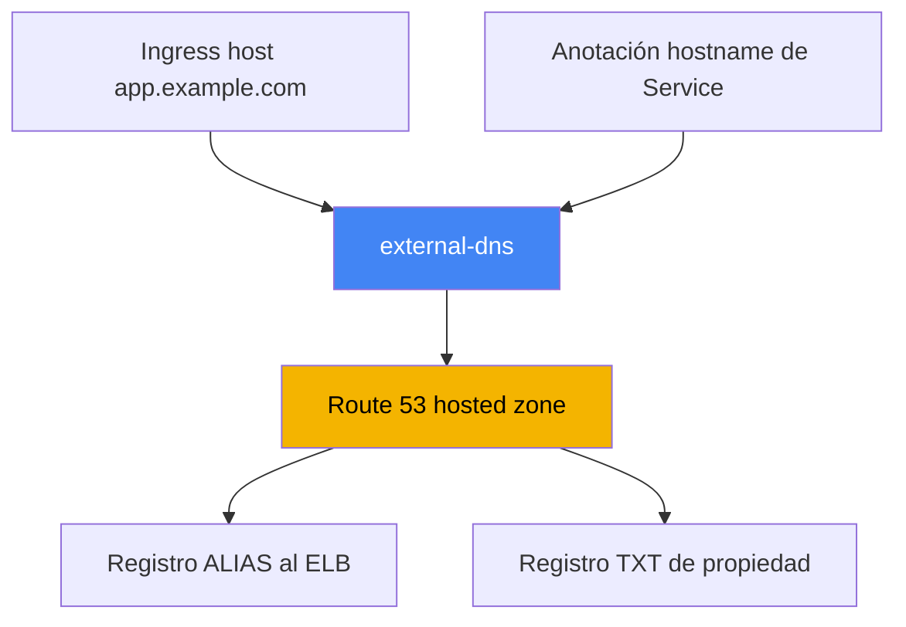
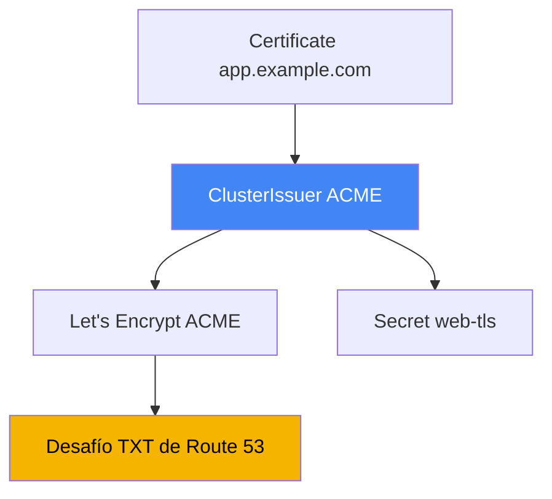

[Русская версия](ru.md) · [Eng version](en.md) · [Version française](fr.md) · [Deutsche Version](de.md) · [ქართული ვერსია](ge.md) · [繁體中文版](tw.md) · [日本語版](jp.md)
# Capítulo 29. DNS y certificados: external-dns, Route 53, cert-manager

> **Qué sigue.** Los capítulos 26-28 enseñaron a crear balanceadores: NLB desde Service (capítulo 26),
> ALB desde Ingress (capítulo 27), ALB y VPC Lattice mediante Gateway API (capítulo 28). Pero cada
> dirección es un nombre de máquina como `...elb.amazonaws.com`, y el certificado solo se trató de
> pasada. Aquí cerramos dos asuntos: la automatización de registros DNS mediante external-dns y Route 53,
> y la gestión de certificados, ACM frente a cert-manager. Las anotaciones de ALB y ACM están en el
> capítulo 27, NLB en el capítulo 26, Gateway API en el capítulo 28, e IRSA y Pod Identity para los
> permisos de los controladores en los capítulos 16-17.

## 29.1. «El sitio tiene la dirección a1b2...elb.amazonaws.com y el dominio se crea a mano»

El balanceador de los capítulos anteriores se ha levantado, la aplicación responde, pero su dirección
se ve así:

```bash
kubectl get ingress
# NAME   CLASS   HOSTS               ADDRESS                                          PORTS
# web    alb     app.example.com     k8s-web-abc123-456.eu-central-1.elb.amazonaws.com  80
```

No se puede entregar ese nombre al usuario: se necesita `app.example.com`. Por tanto, alguien va a la
consola de Route 53 y crea un registro para ese ELB. Un servicio es tolerable. Pero hay decenas de
servicios y, para cada nuevo Ingress o Service, un ingeniero crea manualmente un registro A o ALIAS y,
cuando se elimina, recuerda limpiarlo. Esto no escala y se desvía de la realidad: el controlador recrea
el balanceador (cambio de `scheme`, reconstrucción de Gateway), cambia el nombre DNS del ELB, y el
registro de Route 53 sigue apuntando al nombre anterior.

El síntoma durante una guardia: `curl app.example.com` va a una dirección inactiva, aunque `kubectl get
ingress` ya muestra otro ELB. La causa es la falta de sincronización entre el clúster y la zona, que una
persona no alcanza a corregir. Se necesita un controlador que haga con DNS lo mismo que LBC hace con
los balanceadores: alinear los registros con los objetos de Kubernetes. Ese es external-dns.

## 29.2. external-dns: registros DNS a partir de objetos del clúster

**external-dns** es un controlador que observa objetos de Kubernetes (Ingress, Service y otros) y crea,
actualiza y elimina registros en un proveedor DNS, en nuestro caso Route 53. No levanta balanceadores ni
responde a consultas DNS: su trabajo es sincronizar los registros deseados, calculados desde objetos del
clúster, con el estado real de la zona.

La fuente del nombre es el host de Ingress (o de HTTPRoute con Gateway API), o bien una anotación en
Service. Para Service, el nombre se especifica con la anotación
`external-dns.alpha.kubernetes.io/hostname`, y external-dns crea un ALIAS a la dirección del
balanceador de ese Service:

```yaml
apiVersion: v1
kind: Service
metadata:
  name: web
  annotations:
    external-dns.alpha.kubernetes.io/hostname: app.example.com
spec:
  type: LoadBalancer
```



external-dns se instala mediante el chart Helm `external-dns/external-dns`. Igual que LBC, accede a AWS
desde su ServiceAccount, por lo que necesita un rol IAM mediante IRSA o Pod Identity (capítulos 16-17).
El conjunto mínimo de permisos según la documentación de external-dns es modificar registros en zonas y
listar zonas:

```json
{
  "Version": "2012-10-17",
  "Statement": [
    { "Effect": "Allow",
      "Action": [
        "route53:ChangeResourceRecordSets",
        "route53:ListResourceRecordSets",
        "route53:ListTagsForResources"
      ],
      "Resource": ["arn:aws:route53:::hostedzone/*"] },
    { "Effect": "Allow",
      "Action": ["route53:ListHostedZones"],
      "Resource": ["*"] }
  ]
}
```

El comportamiento se define con flags del controlador. Los clave que conviene saber de memoria:

| Flag | Propósito |
|---|---|
| `--provider=aws` | trabajar con Route 53 |
| `--source=ingress`, `--source=service` | de dónde tomar los nombres deseados (pueden ser varios) |
| `--source=gateway-httproute`, `--source=gateway-grpcroute` | nombres desde recursos Gateway API (capítulo 28) |
| `--domain-filter=example.com` | limitar las zonas por dominio, sin tocar las ajenas |
| `--policy=upsert-only` \| `sync` | sin eliminar registros o sincronización completa con eliminación |
| `--registry=txt` | guardar la propiedad de los registros en un registro TXT |
| `--txt-owner-id=<id>` | identificador del propietario en TXT, quién posee exactamente el registro |
| `--aws-zone-type=public` \| `private` | solo zonas públicas o solo privadas |

Con Gateway API se traslada sin reaprender, pero con dos salvedades. La primera: el controlador necesita
permisos en el clúster para los recursos `gateway.networking.k8s.io` (`gateways`, `httproutes`,
`grpcroutes`); de lo contrario, simplemente no verá las rutas. La segunda es la distribución de
anotaciones, donde se suele tropezar: el nombre se toma de `spec.hostnames` de la ruta, external-dns lee
la anotación `external-dns.alpha.kubernetes.io/target` **solo desde `Gateway`**, y las demás anotaciones
(`hostname`, `ttl`, las específicas del proveedor) **solo desde la ruta**. Si se colocan al revés, se
ignoran silenciosamente. `TCPRoute` y `UDPRoute` no tienen nombres en su spec, por lo que el hostname se
les indica con una anotación.

`--policy` merece atención especial. Con `upsert-only`, external-dns solo crea y actualiza registros,
pero nunca los elimina, un modo seguro para entrar en una zona ajena. Con `sync`, lleva la zona a la
correspondencia exacta con el clúster, incluida la eliminación de registros de objetos retirados.

Un tema aparte es la API de Route 53, que tiene límites de solicitudes. La frecuencia con la que
external-dns sincroniza la zona se define con `--interval` (por defecto `1m`); un intervalo demasiado
corto en una zona grande llega antes al throttling. Para no reducir `--interval` buscando capacidad de
respuesta, se activa `--events`: así el ciclo también se inicia por cambios en los objetos, no solo por el
temporizador. Los cambios masivos se agrupan con los flags `--aws-batch-change-size` (cuántos cambios en
un batch, por defecto `1000`) y `--aws-batch-change-interval` (pausa entre batches), para llamar menos a
la API.

## 29.3. Route 53: hosted zones, ALIAS y selección de zona

Los registros viven en una **hosted zone**, un contenedor de registros para un dominio. Hay dos tipos de
zonas. Una **public hosted zone** responde a consultas desde Internet, es la entrada pública. Una
**private hosted zone** está asociada a una o varias VPC y solo se ve dentro de esas VPC, para servicios
internos y balanceadores internos con `scheme: internal`.

Se pueden mantener zonas públicas y privadas con el mismo nombre `app.example.com` simultáneamente:
desde fuera se resuelve la dirección pública y desde la VPC, la interna. Esto es **split-horizon DNS**:
un nombre, respuestas distintas según el origen de la consulta. El enfoque es práctico cuando la misma
aplicación es accesible tanto externamente mediante un ALB `internet-facing` como internamente mediante
uno `internal`.

Otra cuestión es el tipo de registro. Hacia un balanceador en AWS se usa **ALIAS**, no CNAME, y hay un
motivo. No se puede colocar CNAME en el dominio apex (el propio `example.com`, sin subdominio), lo prohíbe
el estándar DNS. ALIAS es una extensión de Route 53: externamente se comporta como un registro A, se
resuelve a la dirección del ELB, funciona tanto en apex como en subdominios y no se cobra como una
consulta adicional. Por eso external-dns crea por defecto un ALIAS para ELB.

Cómo decide external-dns en qué zona escribir: toma la lista de hosted zones (considerando
`--aws-zone-type` y `--domain-filter`) y encuentra la zona cuyo dominio es el sufijo más largo del nombre
deseado. Para `app.example.com` sirve la zona `example.com`, y si existe una más específica,
`app.example.com`, se elegirá esa. Cuando las zonas pública y privada llevan el mismo nombre, el registro
se fija a una zona concreta mediante la anotación
`external-dns.alpha.kubernetes.io/aws-hosted-zone-id`.

## 29.4. Registro TXT de propiedad y varios clústeres para una zona

external-dns no debe tocar registros que no creó: la zona puede contener registros creados manualmente,
por Terraform u otro clúster. Para distinguir sus registros de los ajenos, usa un **registro TXT**
(`--registry=txt`). Junto a cada registro gestionado, external-dns coloca un registro TXT marcador: «este
registro está gestionado por external-dns, el propietario es tal».

El propietario se define con `--txt-owner-id`. Durante la sincronización external-dns toca y elimina solo
los registros que tienen un marcador TXT con **su** owner-id. No tocará un registro sin marcador o con el
owner-id de otro, ni siquiera en modo `--policy=sync`. Esa es la protección para que un controlador no
elimine registros gestionados por otra cosa.

De aquí surge la regla para varios clústeres que escriben en una zona: cada clúster debe tener **su propio
`--txt-owner-id` único**. De lo contrario, dos external-dns considerarán propios los registros del otro y
competirán por crearlos y eliminarlos, haciendo oscilar la zona. Distintos owner-id hacen la propiedad
inequívoca: cada clúster gestiona solo su conjunto de registros.

| Configuración | Qué hace | Riesgo si hay un error |
|---|---|---|
| `--registry=txt` | marca sus registros con un marcador TXT | sin él no se distinguen los registros propios de los ajenos |
| `--txt-owner-id` | identificador del propietario en el marcador | igual en dos clústeres: guerra por los registros |
| `--policy=upsert-only` | prohíbe la eliminación | protección contra limpiar accidentalmente contenido ajeno |
| `--domain-filter` | limita las zonas por dominio | sin él, el controlador ve todas las zonas de la cuenta |

## 29.5. Certificados: ACM frente a cert-manager

El segundo asunto son los certificados TLS. En EKS hay dos fuentes fundamentalmente distintas, que no se
deben confundir: resuelven tareas diferentes y viven en lugares distintos.

**AWS Certificate Manager (ACM)** es un certificado que vive en el balanceador. La terminación TLS ocurre
en ALB o NLB (capítulo 27), la clave privada de ACM no se exporta ni llega al clúster, y AWS se encarga de
la renovación. Para la entrada HTTPS pública mediante ALB es la opción correcta por defecto: se configura
`certificate-arn` (o detección automática por host) y AWS mantiene todo después. Solo tiene una desventaja
y es fundamental: la clave no se puede extraer, por lo que ese certificado no puede colocarse en un pod.

**cert-manager** es un controlador que emite certificados **dentro** del clúster y los coloca en un
`Secret` normal. Es necesario cuando el certificado debe estar en un pod: mTLS entre servicios, TLS en un
ingress que no sea ALB (por ejemplo, ingress-nginx), servicios internos donde la terminación ocurre en la
propia aplicación. cert-manager admite varias fuentes (issuers): una CA pública mediante ACME (Let's
Encrypt), una CA propia, AWS Private CA mediante un aws-privateca-issuer separado. También vigila el
vencimiento y vuelve a emitir el certificado antes de que expire.

La frontera aproximada: si TLS termina en el balanceador, ACM; si se necesita el certificado dentro del
clúster como un objeto leído por un pod, cert-manager. La tabla de selección detallada está en 29.7.

## 29.6. cert-manager con Let's Encrypt y DNS-01 mediante Route 53

Veamos el escenario más común de cert-manager en EKS: un certificado público de Let's Encrypt mediante el
protocolo **ACME**, con verificación de propiedad del dominio usando **DNS-01**. Con DNS-01, la autoridad
certificadora pide demostrar el control del dominio creando un registro TXT específico; cert-manager lo
crea en Route 53, el servidor ACME lo verifica y emite el certificado. Para ello cert-manager necesita
permisos en Route 53, es decir, el mismo mecanismo IRSA o Pod Identity (capítulos 16-17).

Los permisos para DNS-01 en cert-manager son más limitados que los de external-dns: además de
`route53:GetChange` (verificación del estado de aplicación) y `route53:ChangeResourceRecordSets` con
`route53:ListResourceRecordSets` en las zonas, se requiere `route53:ListHostedZonesByName` (se puede
eliminar si se indica `hostedZoneID`).

La fuente de certificados se describe con un objeto **ClusterIssuer** (para todo el clúster) o **Issuer**
(por namespace). Para ACME con DNS-01 a través de Route 53, cuando los permisos provienen de
ambient-credentials (IRSA o Pod Identity), la sección `route53` puede estar vacía: el SDK recoge el rol
por sí mismo:

```yaml
apiVersion: cert-manager.io/v1
kind: ClusterIssuer
metadata:
  name: letsencrypt-prod
spec:
  acme:
    server: https://acme-v02.api.letsencrypt.org/directory
    email: ops@example.com
    privateKeySecretRef:
      name: letsencrypt-prod-account-key
    solvers:
      - dns01:
          route53:
            region: eu-central-1
```

El certificado se solicita con un objeto **Certificate**: se indican el nombre, los dominios y el
`secretName` donde cert-manager colocará el certificado emitido y la clave. Después se monta este `Secret`
en un pod o se entrega al controlador de ingress:

```yaml
apiVersion: cert-manager.io/v1
kind: Certificate
metadata:
  name: web-tls
spec:
  secretName: web-tls          # aquí se colocarán tls.crt y tls.key
  dnsNames: ["app.example.com"]
  issuerRef:
    name: letsencrypt-prod
    kind: ClusterIssuer
```



Sobre la separación de acceso: por defecto, las ambient-credentials solo están disponibles para
ClusterIssuer, no para Issuer, para que un usuario de namespace no emita certificados con un rol accesible
por accidente. Para multitenencia, cert-manager admite un ServiceAccount independiente en Issuer
(`auth.kubernetes.serviceAccountRef`) con un rol limitado al tenant. Para certificados internos, en vez de
Let's Encrypt se usa una CA propia o **AWS Private CA** mediante `aws-privateca-issuer`.

## 29.7. Cuándo ACM y cuándo cert-manager

Ambos mecanismos emiten certificados TLS, pero la elección la determina una pregunta: dónde se necesita
la clave privada. Si está en el balanceador, ACM; si está en el pod, cert-manager.

| Situación | Fuente | Por qué |
|---|---|---|
| Entrada pública mediante ALB (Ingress, Gateway) | ACM | terminación en ALB, no se necesita la clave en el pod |
| TLS en NLB con terminación en el balanceador | ACM | lo mismo, la clave vive en el listener |
| mTLS entre pods | cert-manager | la clave se necesita dentro del pod como Secret |
| ingress-nginx u otro ingress no ALB | cert-manager | terminación en el pod del controlador |
| Servicio interno, TLS en la aplicación | cert-manager | la aplicación necesita la clave |
| CA corporativa interna | cert-manager + AWS Private CA | emisión desde una autoridad privada |

Lo principal que no se puede eludir: un certificado de ACM no se puede extraer y colocar en un pod, la
clave no se exporta by design, por lo que para un pod siempre se usa cert-manager. Y a la inversa, no
tiene sentido llevar certificados de cert-manager a un ALB público cuando ACM lo hace sin exponer la
clave.

## 29.8. Problemas habituales

Algunas cosas que ocurren en producción.

- **Propagación DNS.** Un registro creado no se ve al instante: primero Route 53 lo acepta, luego expira
  el TTL de la respuesta anterior en las cachés de los resolvedores. Un dominio reciente o una dirección
  cambiada puede «no resolverse» durante varios minutos; no siempre es un bug de external-dns, a menudo es
  simplemente TTL.
- **Propiedad mediante TXT.** Sin `--registry=txt` y `--txt-owner-id`, external-dns en modo `sync` puede
  eliminar registros que considera sobrantes, incluidos los que no creó él. El registro TXT es higiene
  obligatoria, no una opción.
- **Varios clústeres para una zona.** Es obligatorio un `--txt-owner-id` único por clúster; de lo
  contrario los controladores entran en conflicto. A menudo es más simple dar a cada clúster su propio
  subdominio y `--domain-filter`, para que las zonas ni siquiera se solapen.
- **Throttling de la API de Route 53.** En zonas grandes, sincronizaciones frecuentes alcanzan los límites
  de solicitudes. Se mantiene `--interval` moderado, se activa `--events` para capacidad de respuesta y
  se agrupan cambios con `--aws-batch-change-size` y `--aws-batch-change-interval`.
- **Zonas privadas para balanceadores internos.** Para ALB y NLB `internal`, los registros apuntan a una
  private hosted zone asociada a la VPC; external-dns se limita con `--aws-zone-type=private`. Para entrar
  en una zona compartida o ajena se usa `--policy=upsert-only`, y `sync` completo con eliminación solo se
  activa cuando external-dns es el único propietario de los registros de la zona.

## 29.9. Cómo se aplica en producción

- **Los registros DNS no se crean a mano.** external-dns se instala una vez, recibe un rol mediante IRSA o
  Pod Identity (capítulos 16-17), y después los nombres aparecen y desaparecen junto a Ingress y Service.
- **Registro TXT y owner-id, siempre.** `--registry=txt` y un `--txt-owner-id` único por clúster se
  activan desde el primer día para que la sincronización no elimine registros ajenos.
- **Las zonas se delimitan.** `--domain-filter` y, cuando se necesita, `--aws-zone-type` mantienen al
  controlador en sus zonas; para servicios internos se crea una private hosted zone.
- **HTTPS público mediante ACM.** El certificado para ALB y NLB se mantiene en ACM con renovación
  automática; cert-manager no se usa para esto.
- **cert-manager donde se necesita la clave en el pod.** mTLS, ingress no ALB y servicios internos se
  cubren con cert-manager; para DNS-01 se le da un rol en Route 53 y, para los internos, AWS Private CA.
- **ClusterIssuer bajo control de la plataforma.** Las ambient-credentials se dejan solo a
  ClusterIssuer; a los tenants que lo necesitan se les entrega Issuer con un ServiceAccount separado y un
  rol limitado.

## 29.10. Mini glosario

- **external-dns**: controlador que sincroniza los registros DNS del proveedor con objetos Kubernetes
  (Ingress, Service); en AWS trabaja con Route 53.
- **hosted zone**: contenedor de registros DNS de un dominio en Route 53; puede ser public (Internet) o
  private (asociada a una VPC).
- **ALIAS**: registro de Route 53 hacia un recurso AWS (por ejemplo, ELB); funciona en el dominio apex,
  donde CNAME está prohibido, y no se cobra como una consulta independiente.
- **split-horizon DNS**: un nombre con respuestas diferentes desde fuera y desde dentro de la VPC mediante
  un par de zonas public y private.
- **registro TXT**: mecanismo de external-dns que marca sus registros con un marcador TXT; el propietario
  se define con `--txt-owner-id`.
- **ACM (AWS Certificate Manager)**: certificados que viven en el balanceador; la clave no se exporta y
  la renovación es automática.
- **cert-manager**: controlador que emite certificados dentro del clúster como `Secret`; la fuente se
  define mediante ClusterIssuer o Issuer.
- **DNS-01**: método de validación ACME de propiedad de un dominio mediante un registro TXT; cert-manager
  lo crea en Route 53.
- **ClusterIssuer / Issuer**: objetos de cert-manager que describen la fuente de certificados para todo el
  clúster o para un namespace.

## 29.11. Resumen del capítulo

- El balanceador recibe un nombre de máquina ELB, y la gestión manual de registros A/ALIAS no escala ni
  coincide con la realidad al recrear el LB; hay que automatizar DNS.
- external-dns observa Ingress y Service y alinea los registros de Route 53 con el clúster; se instala
  mediante Helm y accede a AWS con un rol IRSA o Pod Identity (capítulos 16-17).
- Permisos de external-dns: `route53:ChangeResourceRecordSets`, `ListResourceRecordSets`,
  `ListTagsForResources` sobre zonas y `ListHostedZones`; comportamiento: flags `--provider=aws`,
  `--source`, `--domain-filter`, `--policy`, `--registry=txt`, `--txt-owner-id`.
- Route 53 mantiene hosted zones public y private; hacia ELB se usa ALIAS (funciona en apex, a diferencia
  de CNAME); external-dns selecciona la zona por el sufijo más largo del nombre.
- El registro TXT con `--txt-owner-id` define la propiedad de registros: el controlador solo toca los
  propios y varios clústeres en una zona necesitan owner-id únicos.
- ACM mantiene el certificado en el balanceador con renovación automática y clave no exportable, para
  HTTPS público mediante ALB y NLB; no puede proporcionar la clave a un pod.
- cert-manager emite certificados dentro del clúster como Secret para mTLS, ingress no ALB y servicios
  internos; ACME con DNS-01 mediante Route 53, además de CA propia y AWS Private CA.
- La elección es sencilla: clave en el balanceador, ACM; clave en el pod, cert-manager; no se puede poner
  un certificado ACM en un pod.

## 29.12. Cómo servirá en el trabajo real

Durante una guardia, los incidentes DNS en EKS se reducen a unas pocas causas. Un nombre no se resuelve
aunque el objeto exista: se revisan los logs de external-dns (`AccessDenied` es un problema de rol, como
en el capítulo 26 con LBC), que el nombre coincida con `--domain-filter`, y si todo está correcto se espera
al TTL y a la propagación. Un registro apunta a un ELB antiguo: el controlador no vio la recreación del
balanceador. Un registro desapareció de repente: casi siempre es `--policy=sync` sin propiedad TXT o dos
clústeres con el mismo `--txt-owner-id`. Un error TLS desde fuera: se revisan ACM y listener (capítulo 27);
dentro, Certificate y su Secret en cert-manager.

Al planificar, tome tres decisiones de antemano. Quién posee la zona y cómo se separan los registros
(owner-id, domain-filter, subdominios separados por clúster). Dónde termina TLS: entrada pública, ACM en
el balanceador; tráfico interno y mTLS, cert-manager con la clave en el pod. Y cómo se organiza el acceso:
tanto external-dns como cert-manager acceden a Route 53 mediante un rol, por lo que sus IRSA o Pod Identity
se diseñan junto con las zonas, no durante un incidente.

## 29.13. Preguntas de autoevaluación

1. ¿Por qué no se puede entregar al usuario una dirección de balanceador como `...elb.amazonaws.com` y cuál es el problema de gestionar registros manualmente?
2. ¿Qué hace external-dns y en qué se parece su trabajo al de AWS Load Balancer Controller?
3. ¿De qué fuentes toma external-dns los nombres deseados y qué anotación establece el nombre para Service?
4. ¿Qué permisos de Route 53 necesita external-dns y cómo obtiene acceso a AWS?
5. ¿En qué se diferencian `--policy=upsert-only` y `--policy=sync` y cuál es más seguro en cada caso?
6. ¿En qué se diferencia una public hosted zone de una private y qué es split-horizon DNS?
7. ¿Por qué se usa ALIAS hacia un balanceador y no CNAME, especialmente en el dominio apex?
8. ¿Para qué sirve el registro TXT y qué pasa si dos clústeres tienen el mismo `--txt-owner-id`?
9. ¿Cuál es la diferencia fundamental entre ACM y cert-manager respecto al lugar donde vive la clave?
10. ¿Por qué no se puede usar dentro de un pod un certificado de ACM?
11. ¿Cómo funciona la emisión de certificados de cert-manager mediante ACME y DNS-01 en Route 53?
12. ¿Qué describen ClusterIssuer y Certificate y dónde termina el certificado emitido?
13. ¿En qué casos se usa cert-manager en lugar de ACM y cuándo se necesita AWS Private CA?

## Práctica

El laboratorio del curso para este tema: [laboratorio 109: Ingress mediante ALB con certificado ACM, external-dns y Route
53](../../labs/109/README_ES.MD). Además, todo se verifica en un clúster activo. Primero compruebe si
external-dns está instalado y en buen estado, y examine sus flags:

```bash
kubectl get deploy -n kube-system external-dns          # o en su propio namespace
kubectl get deploy external-dns -o yaml | grep -A2 args  # --source, --policy, --txt-owner-id
kubectl logs deploy/external-dns | tail -n 30            # los errores de permisos aparecen como AccessDenied
```

Cree un Service de tipo LoadBalancer con la anotación
`external-dns.alpha.kubernetes.io/hostname` o un Ingress con `host` y espere. Desde AWS compruebe que el
registro y su marcador TXT aparecieron en la zona correcta:

```bash
aws route53 list-hosted-zones                            # encuentre el ZONE_ID de su zona
aws route53 list-resource-record-sets --hosted-zone-id <ZONE_ID> \
  --query "ResourceRecordSets[?Name=='app.example.com.']"
```

Preste atención a los dos registros para un nombre: ALIAS (tipo A) hacia ELB y el marcador TXT de
propiedad con su owner-id. Después compare las dos fuentes de certificados: los públicos para el
balanceador viven en ACM, mientras que cert-manager coloca la clave en un `Secret` normal dentro del
clúster:

```bash
aws acm list-certificates --query "CertificateSummaryList[].[DomainName,CertificateArn]"
kubectl get clusterissuers                  # si cert-manager está instalado
kubectl get certificate,secret | grep tls
kubectl describe certificate web-tls        # estado, desafío DNS-01, momento de reemisión
```

Un certificado ACM no tiene clave en el clúster y nunca la tendrá, mientras que cert-manager coloca
`tls.crt` y `tls.key` en un `Secret` que lee el pod. Esa es la frontera entre los dos enfoques.

---
[Índice](../README_ES.md) · [Capítulo 28](../28/es.md) · [Capítulo 30](../30/es.md)
