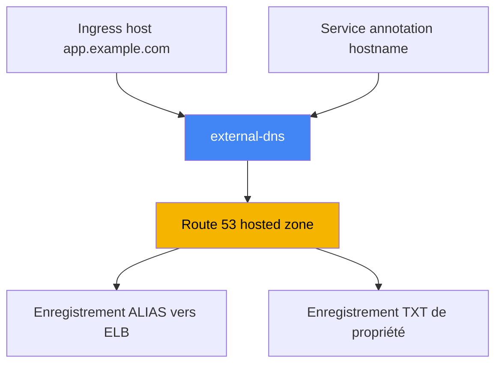
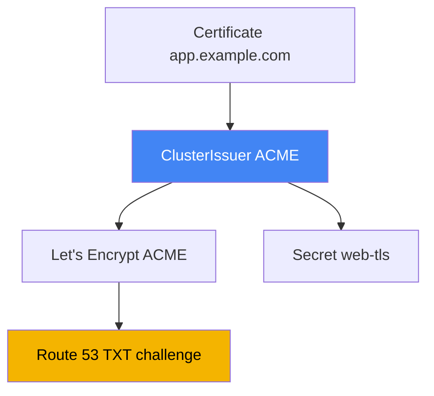

[Русская версия](ru.md) · [Eng version](en.md) · [Versión en español](es.md) · [Deutsche Version](de.md) · [ქართული ვერსია](ge.md) · [繁體中文版](tw.md) · [日本語版](jp.md)

# Chapitre 29. DNS et certificats : external-dns, Route 53, cert-manager

> **La suite.** Les chapitres 26-28 ont appris à créer des équilibreurs : un NLB depuis un Service (chapitre 26),
> un ALB depuis un Ingress (chapitre 27), des ALB et VPC Lattice via Gateway API (chapitre 28). Mais chaque
> adresse est un nom machine du type `...elb.amazonaws.com`, et le certificat n'a été abordé que brièvement. Ici,
> nous achevons deux sujets : l'automatisation des enregistrements DNS via external-dns et Route 53, et la gestion
> des certificats, ACM contre cert-manager. Les annotations ALB et ACM sont au chapitre 27, NLB au chapitre 26,
> Gateway API au chapitre 28, et IRSA ainsi que Pod Identity pour les droits des contrôleurs aux chapitres 16-17.

## 29.1. « Le site a l'adresse a1b2...elb.amazonaws.com, et nous créons le domaine à la main »

L'équilibreur des chapitres précédents est opérationnel, l'application répond, mais son adresse ressemble à ceci :

```bash
kubectl get ingress
# NAME   CLASS   HOSTS               ADDRESS                                          PORTS
# web    alb     app.example.com     k8s-web-abc123-456.eu-central-1.elb.amazonaws.com  80
```

Vous ne pouvez pas donner ce nom à un utilisateur : il faut `app.example.com`. Quelqu'un va donc dans la console
Route 53 et crée un enregistrement vers cet ELB. Pour un seul service, c'est supportable. Mais il y a des dizaines
de services, et pour chaque nouvel Ingress ou Service, un ingénieur crée manuellement un enregistrement A ou ALIAS,
et se souvient de le supprimer. Cela ne passe pas à l'échelle et diverge de la réalité : le contrôleur recrée
l'équilibreur (changement de `scheme`, reconstruction d'une Gateway), le nom DNS de l'ELB change, tandis que
l'enregistrement Route 53 continue de pointer vers l'ancien nom.

Symptôme pendant l'astreinte : `curl app.example.com` va vers une adresse inactive, alors que `kubectl get ingress`
affiche déjà un autre ELB. La cause est le décalage entre le cluster et la zone, que personne ne parvient à résorber.
Il faut un contrôleur qui fasse pour le DNS ce que le LBC fait pour les équilibreurs : aligner les enregistrements
sur les objets Kubernetes. C'est external-dns.

## 29.2. external-dns : des enregistrements DNS à partir des objets du cluster

**external-dns** est un contrôleur qui surveille les objets Kubernetes (Ingress, Service et autres) et crée, met à
jour et supprime des enregistrements chez un fournisseur DNS, ici Route 53. Il ne crée pas d'équilibreurs et ne
répond pas aux requêtes DNS : son travail consiste à synchroniser les enregistrements désirés, calculés depuis les
objets du cluster, avec l'état réel de la zone.

La source du nom est soit le host d'un Ingress (ou d'une HTTPRoute avec Gateway API), soit une annotation sur le
Service. Pour un Service, le nom est défini avec l'annotation `external-dns.alpha.kubernetes.io/hostname`, et
external-dns crée un ALIAS vers l'adresse de l'équilibreur de ce Service :

```yaml
apiVersion: v1
kind: Service
metadata:
  name: web
  annotations:
    external-dns.alpha.kubernetes.io/hostname: app.example.com
spec:
  type: LoadBalancer
```



external-dns s'installe via le chart Helm `external-dns/external-dns`. Comme le LBC, il accède à AWS avec son
ServiceAccount ; il lui faut donc un rôle IAM via IRSA ou Pod Identity (chapitres 16-17). Selon la documentation
d'external-dns, le jeu minimal de droits consiste à modifier des enregistrements dans les zones et à lister les
zones :

```json
{
  "Version": "2012-10-17",
  "Statement": [
    { "Effect": "Allow",
      "Action": [
        "route53:ChangeResourceRecordSets",
        "route53:ListResourceRecordSets",
        "route53:ListTagsForResources"
      ],
      "Resource": ["arn:aws:route53:::hostedzone/*"] },
    { "Effect": "Allow",
      "Action": ["route53:ListHostedZones"],
      "Resource": ["*"] }
  ]
}
```

Le comportement est défini par les options du contrôleur. Les principales à connaître par coeur :

| Option | Rôle |
|---|---|
| `--provider=aws` | travailler avec Route 53 |
| `--source=ingress`, `--source=service` | où prendre les noms désirés (plusieurs possibles) |
| `--source=gateway-httproute`, `--source=gateway-grpcroute` | noms des ressources Gateway API (chapitre 28) |
| `--domain-filter=example.com` | limiter les zones par domaine, ne pas toucher celles d'autrui |
| `--policy=upsert-only` \| `sync` | sans supprimer les enregistrements, ou synchronisation complète avec suppression |
| `--registry=txt` | stocker la propriété des enregistrements dans un enregistrement TXT |
| `--txt-owner-id=<id>` | identifiant du propriétaire dans le TXT, celui qui possède l'enregistrement |
| `--aws-zone-type=public` \| `private` | uniquement les zones publiques ou uniquement les zones privées |

Cela se transpose à Gateway API sans nouvel apprentissage, mais avec deux réserves. D'abord, le contrôleur a besoin
d'autorisations dans le cluster sur les ressources `gateway.networking.k8s.io` (`gateways`, `httproutes`,
`grpcroutes`), sinon il ne verra tout simplement pas les routes. Ensuite, il y a la répartition des annotations,
sur laquelle on se trompe souvent : le nom est pris dans `spec.hostnames` de la route, external-dns lit l'annotation
`external-dns.alpha.kubernetes.io/target` **uniquement sur la `Gateway`**, et les autres annotations (`hostname`,
`ttl`, celles du fournisseur) **uniquement sur la route**. Si elles sont placées à l'inverse, elles sont ignorées
silencieusement. Les `TCPRoute` et `UDPRoute` n'ont aucun nom dans leur spec, leur hostname est donc défini par une
annotation.

Il faut accorder une attention particulière à `--policy`. Avec `upsert-only`, external-dns crée et met seulement à
jour les enregistrements, sans jamais les supprimer : c'est un mode sûr pour entrer dans une zone appartenant à
autrui. Avec `sync`, il aligne la zone exactement sur le cluster, notamment en supprimant les enregistrements des
objets retirés.

Un autre sujet est l'API Route 53, qui impose des limites de requêtes. La fréquence de synchronisation de la zone
par external-dns est réglée avec `--interval` (par défaut `1m`) ; un intervalle trop court sur une grande zone atteint
plus vite le throttling. Pour ne pas diminuer `--interval` par souci de réactivité, activez `--events` : le cycle est
alors aussi lancé à chaque modification d'objet, et non seulement par minuterie. Les changements massifs sont
regroupés avec les options `--aws-batch-change-size` (nombre de changements par lot, `1000` par défaut) et
`--aws-batch-change-interval` (pause entre les lots), afin de solliciter l'API moins souvent.

## 29.3. Route 53 : hosted zones, ALIAS et sélection de zone

Les enregistrements résident dans une **hosted zone**, un conteneur d'enregistrements pour un domaine. Il existe deux
types de zones. Une **public hosted zone** répond aux requêtes depuis Internet : c'est l'entrée publique. Une
**private hosted zone** est associée à un ou plusieurs VPC et n'est visible qu'à l'intérieur de ces VPC : pour les
services internes et les équilibreurs internes avec `scheme: internal`.

Vous pouvez conserver simultanément des zones publique et privée portant le même nom `app.example.com` : à
l'extérieur, l'adresse publique est résolue, et à l'intérieur du VPC, l'adresse interne. C'est le **split-horizon
DNS** : un seul nom, des réponses différentes selon l'origine de la requête. Cette technique est utile quand la
même application est accessible à l'extérieur via un ALB `internet-facing` et à l'intérieur via un ALB `internal`.

Une autre question concerne le type d'enregistrement. Un équilibreur AWS est ciblé par un **ALIAS**, et non par un
CNAME, pour une bonne raison. Vous ne pouvez pas placer un CNAME à l'apex du domaine (le `example.com` lui-même,
sans sous-domaine) : la norme DNS l'interdit. ALIAS est une extension Route 53 : de l'extérieur, il se comporte comme
un enregistrement A, se résout en adresse d'ELB, fonctionne tant à l'apex que sur les sous-domaines et n'est pas
facturé comme requête supplémentaire. C'est pourquoi external-dns crée par défaut un ALIAS pour les ELB.

Comment external-dns choisit-il la zone où écrire ? Il obtient la liste des hosted zones (en tenant compte de
`--aws-zone-type` et de `--domain-filter`) et trouve celle dont le domaine est le suffixe le plus long du nom
désiré. Pour `app.example.com`, la zone `example.com` convient ; mais s'il existe une zone plus précise
`app.example.com`, elle sera choisie. Lorsque les zones publique et privée portent le même nom, vous épinglez
l'enregistrement à une zone précise par l'annotation `external-dns.alpha.kubernetes.io/aws-hosted-zone-id`.

## 29.4. Registre TXT de propriété et plusieurs clusters dans une zone

external-dns ne doit pas toucher les enregistrements qu'il n'a pas créés : la zone peut contenir des enregistrements
créés manuellement, par Terraform ou par un autre cluster. Pour distinguer ses enregistrements de ceux d'autrui, il
utilise un **registre TXT** (`--registry=txt`). À côté de chaque enregistrement géré, external-dns dépose un
marqueur TXT : « cet enregistrement est géré par external-dns, par tel propriétaire ».

Le propriétaire est défini par `--txt-owner-id`. Lors de la synchronisation, external-dns ne modifie et ne supprime
que les enregistrements ayant un marqueur TXT avec **son** owner-id. Il ne touche pas un enregistrement sans marqueur
ou ayant l'owner-id d'autrui, même avec `--policy=sync`. C'est la protection qui évite à un contrôleur de supprimer
les enregistrements gérés par autre chose.

D'où la règle pour plusieurs clusters qui écrivent dans une même zone : chaque cluster doit avoir son **propre
`--txt-owner-id` unique**. Sinon, deux external-dns considéreront les enregistrements de l'autre comme les leurs et
se livreront concurrence pour les créer et les supprimer, faisant osciller la zone. Des owner-id distincts rendent
la propriété non ambiguë : chaque cluster ne gère que son propre ensemble d'enregistrements.

| Configuration | Ce qu'elle fait | Risque en cas d'erreur |
|---|---|---|
| `--registry=txt` | marque ses enregistrements avec un marqueur TXT | sans lui, impossible de distinguer ses enregistrements de ceux d'autrui |
| `--txt-owner-id` | identifiant du propriétaire dans le marqueur | identique pour deux clusters : guerre pour les enregistrements |
| `--policy=upsert-only` | interdit la suppression | protection contre le nettoyage accidentel des enregistrements d'autrui |
| `--domain-filter` | limite les zones par domaine | sans lui, le contrôleur voit toutes les zones du compte |

## 29.5. Certificats : ACM contre cert-manager

Le second sujet est celui des certificats TLS. Dans EKS, il existe deux sources fondamentalement différentes, à ne
pas confondre : elles résolvent des problèmes différents et vivent à des endroits différents.

**AWS Certificate Manager (ACM)** est un certificat qui vit sur l'équilibreur. La terminaison TLS se produit sur
l'ALB ou le NLB (chapitre 27), la clé privée ACM n'est pas exportable et ne rejoint pas le cluster, et AWS gère lui-même
le renouvellement. Pour une entrée HTTPS publique via ALB, c'est le bon choix par défaut : configurez
`certificate-arn` (ou la découverte automatique par host), puis AWS maintient tout. Son unique inconvénient est aussi
fondamental : vous ne pouvez pas extraire la clé, donc placer un tel certificat dans un pod est impossible.

**cert-manager** est un contrôleur qui émet des certificats **dans** le cluster et les place dans un `Secret`
ordinaire. Il est nécessaire lorsque le certificat doit se trouver dans un pod : mTLS entre services, TLS sur un
Ingress non ALB (par exemple ingress-nginx), services internes dont la terminaison se fait dans l'application même.
cert-manager prend en charge plusieurs sources (issuer) : une autorité publique via ACME (Let's Encrypt), votre propre
CA, AWS Private CA via un aws-privateca-issuer distinct. Il surveille aussi l'expiration et réémet le certificat avant
son échéance.

La frontière simple : si TLS se termine sur l'équilibreur, ACM ; si le certificat est requis à l'intérieur du cluster
comme objet lu par un pod, cert-manager. Le tableau de choix détaillé est en 29.7.

## 29.6. cert-manager avec Let's Encrypt et DNS-01 via Route 53

Examinons le scénario cert-manager le plus courant dans EKS : un certificat public Let's Encrypt via le protocole
**ACME**, avec vérification de propriété du domaine par **DNS-01**. Avec DNS-01, l'autorité de certification demande
de prouver le contrôle du domaine en créant un enregistrement TXT donné ; cert-manager le crée dans Route 53, le
serveur ACME le vérifie et émet le certificat. cert-manager a donc besoin de droits Route 53, soit de la même
association IRSA ou Pod Identity (chapitres 16-17).

Les droits DNS-01 de cert-manager sont plus limités que ceux d'external-dns : outre `route53:GetChange` (vérification
de l'état d'application), `route53:ChangeResourceRecordSets` et `route53:ListResourceRecordSets` sur les zones, il
faut `route53:ListHostedZonesByName` (qui peut être supprimé si vous définissez `hostedZoneID`).

La source des certificats est décrite par un objet **ClusterIssuer** (pour l'ensemble du cluster) ou **Issuer** (pour
un namespace). Pour ACME avec DNS-01 via Route 53, lorsque les droits viennent des ambient-credentials (IRSA ou Pod
Identity), la section `route53` peut être vide : le SDK récupère lui-même le rôle :

```yaml
apiVersion: cert-manager.io/v1
kind: ClusterIssuer
metadata:
  name: letsencrypt-prod
spec:
  acme:
    server: https://acme-v02.api.letsencrypt.org/directory
    email: ops@example.com
    privateKeySecretRef:
      name: letsencrypt-prod-account-key
    solvers:
      - dns01:
          route53:
            region: eu-central-1
```

Le certificat lui-même est commandé avec un objet **Certificate** : indiquez le nom, les domaines et `secretName`,
dans lequel cert-manager placera le certificat et la clé émis. Ce `Secret` est ensuite monté dans le pod ou fourni au
contrôleur Ingress :

```yaml
apiVersion: cert-manager.io/v1
kind: Certificate
metadata:
  name: web-tls
spec:
  secretName: web-tls          # tls.crt et tls.key seront placés ici
  dnsNames: ["app.example.com"]
  issuerRef:
    name: letsencrypt-prod
    kind: ClusterIssuer
```



Concernant le contrôle d'accès, les ambient-credentials sont par défaut disponibles uniquement pour ClusterIssuer,
et non pour Issuer, afin qu'un utilisateur de namespace n'émette pas de certificats avec un rôle accessible par
hasard. Pour le multitenant, cert-manager prend en charge un ServiceAccount distinct sur un Issuer
(`auth.kubernetes.serviceAccountRef`) avec un rôle limité au tenant. Pour les certificats internes, utilisez votre
propre CA ou **AWS Private CA** avec `aws-privateca-issuer`, plutôt que Let's Encrypt.

## 29.7. Quand utiliser ACM, quand utiliser cert-manager

Les deux mécanismes émettent des certificats TLS, mais le choix est déterminé par une question : où la clé privée
est-elle requise ? Sur l'équilibreur : ACM ; dans le pod : cert-manager.

| Situation | Source | Pourquoi |
|---|---|---|
| Entrée publique via ALB (Ingress, Gateway) | ACM | terminaison sur l'ALB, la clé n'est pas nécessaire dans le pod |
| TLS sur NLB avec terminaison sur l'équilibreur | ACM | idem, la clé vit sur le listener |
| mTLS entre pods | cert-manager | la clé est requise dans le pod comme Secret |
| ingress-nginx ou autre Ingress non ALB | cert-manager | terminaison dans le pod du contrôleur |
| Service interne, TLS dans l'application | cert-manager | l'application a besoin de la clé |
| CA d'entreprise interne | cert-manager + AWS Private CA | émission depuis une autorité privée |

Le point incontournable : un certificat ACM ne peut pas être extrait ni placé dans un pod, sa clé n'est pas exportable
by design ; donc pour un pod, utilisez toujours cert-manager. À l'inverse, faire passer des certificats cert-manager
sur un ALB public n'a pas de sens lorsqu'ACM le fait sans clé.

## 29.8. Les pièges fréquents

Voici plusieurs choses rencontrées en production.

- **Propagation DNS.** Un enregistrement créé n'est pas visible instantanément : Route 53 l'accepte d'abord, puis le
  TTL de l'ancienne réponse expire dans les caches des résolveurs. Un domaine récent ou une adresse modifiée peut « ne
  pas se résoudre » pendant quelques minutes : ce n'est pas toujours un bogue external-dns, c'est souvent simplement
  le TTL.
- **Propriété via TXT.** Sans `--registry=txt` et `--txt-owner-id`, external-dns en mode `sync` peut supprimer des
  enregistrements qu'il considère superflus, y compris ceux qu'il n'a pas créés. Le registre TXT est une hygiène
  obligatoire, pas une option.
- **Plusieurs clusters dans une zone.** Un `--txt-owner-id` unique par cluster est obligatoire, sinon les contrôleurs
  se mettent en conflit. Il est souvent plus simple de donner à chaque cluster son propre sous-domaine et un
  `--domain-filter`, afin que les zones ne se chevauchent pas du tout.
- **Throttling de l'API Route 53.** Dans les grandes zones, des synchronisations fréquentes atteignent les limites de
  requêtes. Gardez `--interval` raisonnable, activez `--events` pour la réactivité et regroupez les changements via
  `--aws-batch-change-size` et `--aws-batch-change-interval`.
- **Zones privées pour les équilibreurs internes.** Pour les ALB et NLB `internal`, les enregistrements vont dans une
  private hosted zone associée au VPC ; limitez external-dns avec `--aws-zone-type=private`. Entrez dans une zone
  commune ou appartenant à autrui avec `--policy=upsert-only`, et n'activez le `sync` complet avec suppression que
  lorsqu'external-dns est l'unique propriétaire des enregistrements de la zone.

## 29.9. Application en production

- **Les enregistrements DNS ne sont pas créés à la main.** external-dns est installé une fois, reçoit un rôle via IRSA
  ou Pod Identity (chapitres 16-17), puis les noms apparaissent et disparaissent avec les Ingress et Service.
- **Registre TXT et owner-id, toujours.** Activez `--registry=txt` et un `--txt-owner-id` unique par cluster dès le
  premier jour, pour que la synchronisation ne supprime pas les enregistrements d'autrui.
- **Les zones sont cloisonnées.** `--domain-filter` et, lorsque nécessaire, `--aws-zone-type` maintiennent le
  contrôleur dans ses zones ; créez une private hosted zone pour les services internes.
- **HTTPS public via ACM.** Les certificats pour ALB et NLB restent dans ACM avec renouvellement automatique ;
  n'utilisez pas cert-manager pour cela.
- **cert-manager là où la clé est nécessaire dans le pod.** mTLS, Ingress non ALB et services internes sont couverts
  par cert-manager ; pour DNS-01, donnez-lui un rôle Route 53, et pour l'interne, AWS Private CA.
- **ClusterIssuer sous contrôle de la plateforme.** Réservez les ambient-credentials à ClusterIssuer ; donnez aux
  tenants qui en ont besoin un Issuer avec ServiceAccount séparé et rôle limité.

## 29.10. Mini-glossaire

- **external-dns** : contrôleur qui synchronise les enregistrements DNS du fournisseur avec les objets Kubernetes
  (Ingress, Service) ; dans AWS, il travaille avec Route 53.
- **hosted zone** : conteneur des enregistrements DNS d'un domaine dans Route 53 ; il est public (Internet) ou privé
  (associé à un VPC).
- **ALIAS** : enregistrement Route 53 vers une ressource AWS (par exemple ELB), qui fonctionne à l'apex du domaine où
  le CNAME est interdit et n'est pas facturé comme requête distincte.
- **split-horizon DNS** : un même nom avec des réponses différentes à l'extérieur et à l'intérieur du VPC grâce à une
  paire de zones publique et privée.
- **registre TXT** : mécanisme d'external-dns qui marque ses enregistrements avec un marqueur TXT ; le propriétaire
  est défini par `--txt-owner-id`.
- **ACM (AWS Certificate Manager)** : certificats qui vivent sur l'équilibreur ; la clé n'est pas exportable et le
  renouvellement est automatique.
- **cert-manager** : contrôleur qui émet des certificats dans le cluster sous la forme de `Secret` ; la source est
  définie par ClusterIssuer ou Issuer.
- **DNS-01** : méthode ACME de vérification de propriété du domaine avec un enregistrement TXT ; dans Route 53,
  cert-manager le crée.
- **ClusterIssuer / Issuer** : objets cert-manager qui décrivent une source de certificats pour tout le cluster ou
  pour un namespace.

## 29.11. Bilan du chapitre

- Un équilibreur reçoit un nom machine ELB, et la gestion manuelle des enregistrements A/ALIAS ne passe pas à l'échelle
  ni ne reste alignée sur la réalité lors de la recréation d'un LB ; le DNS doit être automatisé.
- external-dns surveille les Ingress et Service et aligne les enregistrements Route 53 sur le cluster ; il s'installe
  via Helm et accède à AWS avec un rôle IRSA ou Pod Identity (chapitres 16-17).
- Droits external-dns : `route53:ChangeResourceRecordSets`, `ListResourceRecordSets`, `ListTagsForResources` sur les
  zones et `ListHostedZones` ; comportement : options `--provider=aws`, `--source`, `--domain-filter`, `--policy`,
  `--registry=txt`, `--txt-owner-id`.
- Route 53 possède des hosted zones publique et privée ; vers un ELB, il utilise ALIAS (fonctionne à l'apex, à la
  différence de CNAME) ; external-dns choisit la zone selon le suffixe le plus long du nom.
- Le registre TXT avec `--txt-owner-id` définit la propriété des enregistrements : le contrôleur ne touche que les
  siens, et plusieurs clusters dans une zone exigent des owner-id uniques.
- ACM conserve le certificat sur l'équilibreur avec renouvellement automatique et clé non exportable : pour le HTTPS
  public via ALB et NLB ; il ne peut pas fournir une clé à un pod.
- cert-manager émet des certificats dans le cluster comme Secret pour mTLS, Ingress non ALB et services internes ;
  ACME avec DNS-01 via Route 53, ainsi qu'une CA propre et AWS Private CA.
- Le choix est simple : clé sur l'équilibreur, ACM ; clé dans le pod, cert-manager ; un certificat ACM ne peut pas être
  placé dans un pod.

## 29.12. Utilité dans le travail réel

En astreinte, les incidents DNS dans EKS se ramènent à quelques causes. Un nom ne se résout pas alors que l'objet
existe : consultez les logs external-dns (`AccessDenied` indique un problème de rôle, comme au chapitre 26 avec LBC),
vérifiez que le nom entre dans `--domain-filter`, puis si tout est correct, attendez TTL et propagation. Un
 enregistrement pointe vers un ancien ELB : le contrôleur n'a pas vu la recréation de l'équilibreur. Un enregistrement
disparaît soudainement : c'est presque toujours `--policy=sync` sans propriété TXT, ou deux clusters avec le même
`--txt-owner-id`. Une erreur TLS à l'extérieur : examinez ACM et le listener (chapitre 27) ; à l'intérieur, regardez
Certificate et son Secret dans cert-manager.

Lors de la planification, préparez trois décisions. Qui possède la zone et comment les enregistrements sont
cloisonnés (owner-id, domain-filter, sous-domaines séparés par cluster). Où TLS se termine : entrée publique, ACM sur
l'équilibreur ; trafic interne et mTLS, cert-manager avec clé dans le pod. Et comment l'accès est organisé :
external-dns comme cert-manager accèdent à Route 53 par un rôle ; concevez donc leurs IRSA ou Pod Identity avec les
zones, et non au moment d'un incident.

## 29.13. Questions d'auto-évaluation

1. Pourquoi l'adresse d'un équilibreur de type `...elb.amazonaws.com` ne peut-elle pas être donnée à un utilisateur,
   et quel est le problème de la gestion manuelle des enregistrements ?
2. Que fait external-dns et en quoi son travail ressemble-t-il à celui d'AWS Load Balancer Controller ?
3. Depuis quelles sources external-dns prend-il les noms désirés et quelle annotation définit le nom d'un Service ?
4. Quels droits Route 53 external-dns requiert-il et comment obtient-il l'accès à AWS ?
5. Quelle est la différence entre `--policy=upsert-only` et `--policy=sync`, et quand chacun est-il le plus sûr ?
6. En quoi une public hosted zone diffère-t-elle d'une private hosted zone, et qu'est-ce que le split-horizon DNS ?
7. Pourquoi utiliser ALIAS plutôt que CNAME vers un équilibreur, en particulier à l'apex du domaine ?
8. Pourquoi le registre TXT est-il nécessaire et que se produit-il avec le même `--txt-owner-id` sur deux clusters ?
9. Quelle différence fondamentale existe entre ACM et cert-manager quant à l'endroit où vit la clé ?
10. Pourquoi un certificat ACM ne peut-il pas être utilisé à l'intérieur d'un pod ?
11. Comment cert-manager émet-il un certificat via ACME et DNS-01 dans Route 53 ?
12. Que décrivent ClusterIssuer et Certificate, et où arrive le certificat émis ?
13. Dans quels cas utilise-t-on cert-manager plutôt qu'ACM, et quand AWS Private CA est-il nécessaire ?

## Pratique

Le lab du cours pour ce sujet est [lab 109 - Ingress via ALB avec certificat ACM, external-dns et Route
53](../../labs/109/README_FR.MD). En dehors de celui-ci, vérifiez tout sur un cluster actif. Commencez par voir si
external-dns est installé et sain, puis examinez ses options :

```bash
kubectl get deploy -n kube-system external-dns          # ou dans votre namespace
kubectl get deploy external-dns -o yaml | grep -A2 args  # --source, --policy, --txt-owner-id
kubectl logs deploy/external-dns | tail -n 30            # les erreurs de droits apparaissent comme AccessDenied
```

Créez un Service de type LoadBalancer avec l'annotation `external-dns.alpha.kubernetes.io/hostname` ou un Ingress
avec `host`, puis attendez. Côté AWS, vérifiez que l'enregistrement et son marqueur TXT sont apparus dans la bonne
zone :

```bash
aws route53 list-hosted-zones                            # trouvez le ZONE_ID de votre zone
aws route53 list-resource-record-sets --hosted-zone-id <ZONE_ID> \
  --query "ResourceRecordSets[?Name=='app.example.com.']"
```

Remarquez les deux enregistrements pour un même nom : ALIAS (type A) vers l'ELB et le marqueur TXT de propriété avec
votre owner-id. Comparez ensuite les deux sources de certificats : ceux qui sont publics pour l'équilibreur vivent
dans ACM, tandis que cert-manager place la clé dans un `Secret` ordinaire à l'intérieur du cluster :

```bash
aws acm list-certificates --query "CertificateSummaryList[].[DomainName,CertificateArn]"
kubectl get clusterissuers                  # si cert-manager est installé
kubectl get certificate,secret | grep tls
kubectl describe certificate web-tls        # statut, challenge DNS-01, date de réémission
```

Un certificat ACM n'a pas de clé dans le cluster et n'en aura jamais, tandis que cert-manager place `tls.crt` et
`tls.key` dans un `Secret` lu par le pod. C'est la frontière entre les deux approches.

---
[Table des matières](../README_FR.md) · [Chapitre 28](../28/fr.md) · [Chapitre 30](../30/fr.md)
