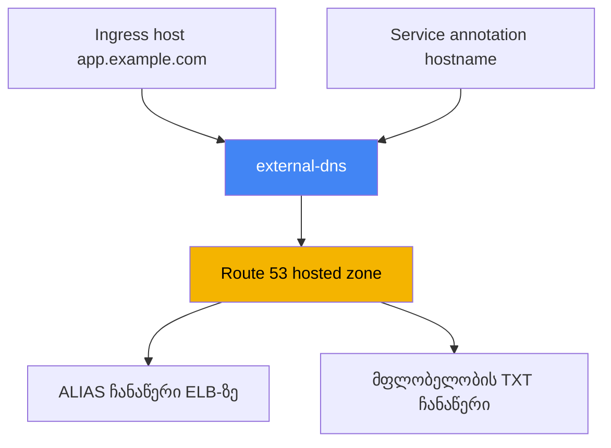
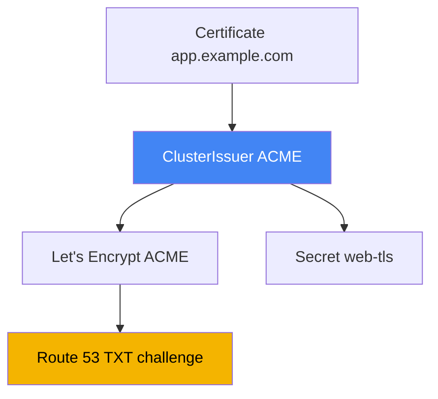

[Русская версия](ru.md) · [Eng version](en.md) · [Versión en español](es.md) · [Version française](fr.md) · [Deutsche Version](de.md) · [繁體中文版](tw.md) · [日本語版](jp.md)
# თავი 29. DNS და სერტიფიკატები: external-dns, Route 53, cert-manager

> **რა არის შემდეგ.** 26-28-ე თავებში ვისწავლეთ ბალანსირებლების შექმნა: NLB Service-იდან (თავი 26),
> ALB Ingress-იდან (თავი 27), ALB და VPC Lattice Gateway API-ის მეშვეობით (თავი 28). თუმცა თითოეულის
> მისამართი `...elb.amazonaws.com` ტიპის მანქანური სახელია, სერტიფიკატი კი მხოლოდ გაკვრით განვიხილეთ.
> აქ ორ დარჩენილ საკითხს დავხურავთ: DNS ჩანაწერების ავტომატიზაციას external-dns-ისა და Route 53-ის
> მეშვეობით და სერტიფიკატების მართვას - ACM cert-manager-ის წინააღმდეგ. ALB-ისა და ACM-ის ანოტაციები
> განხილულია 27-ე თავში, NLB - 26-ე თავში, Gateway API - 28-ე თავში, კონტროლერების უფლებებისთვის
> IRSA და Pod Identity კი მე-16-17 თავებში.

## 29.1. „საიტის მისამართია a1b2...elb.amazonaws.com, დომენს კი ხელით ვქმნით“

წინა თავებში შექმნილი ბალანსირებელი მუშაობს და აპლიკაცია პასუხობს, თუმცა მისი მისამართი ასე გამოიყურება:

```bash
kubectl get ingress
# NAME   CLASS   HOSTS               ADDRESS                                          PORTS
# web    alb     app.example.com     k8s-web-abc123-456.eu-central-1.elb.amazonaws.com  80
```

მომხმარებელს ასეთ სახელს ვერ მისცემთ: საჭიროა `app.example.com`. ეს ნიშნავს, რომ ვიღაც Route 53-ის
კონსოლში შედის და ამ ELB-ზე ჩანაწერს ქმნის. ერთი სერვისისთვის ეს ასატანია. მაგრამ როცა ათობით სერვისია,
ინჟინერი ყოველი ახალი Ingress-ის ან Service-ისთვის ხელით ქმნის A ან ALIAS ჩანაწერს, წაშლისას კი მის
გასუფთავებას იხსენებს. ეს არ მასშტაბირდება და რეალურ მდგომარეობას სცდება: კონტროლერი ბალანსირებელს
თავიდან ქმნის (`scheme`-ის შეცვლა, Gateway-ის ხელახლა აწყობა), ELB-ის DNS სახელი იცვლება, Route 53-ის
ჩანაწერი კი ისევ ძველ სახელზე მიუთითებს.

მორიგეობისას სიმპტომი ასეთია: `curl app.example.com` მკვდარ მისამართზე მიდის, თუმცა `kubectl get
ingress` უკვე სხვა ELB-ს აჩვენებს. მიზეზია კლასტერსა და ზონას შორის დესინქრონიზაცია, რომლის აღმოფხვრასაც
ადამიანი დროულად ვერ ასწრებს. საჭიროა კონტროლერი, რომელიც DNS-ს იმავეს უკეთებს, რასაც LBC ბალანსირებლებს:
Kubernetes-ის ობიექტებთან შესაბამისობაში მოჰყავს ჩანაწერები. ეს არის external-dns.

## 29.2. external-dns: DNS ჩანაწერები კლასტერის ობიექტების მიხედვით

**external-dns** არის კონტროლერი, რომელიც Kubernetes-ის ობიექტებს (Ingress, Service და სხვებს)
აკვირდება და DNS პროვაიდერში, ჩვენს შემთხვევაში Route 53-ში, ჩანაწერებს ქმნის, აახლებს და შლის.
ის არც ბალანსირებლებს ქმნის და არც DNS მოთხოვნებს პასუხობს: მისი ამოცანაა კლასტერის ობიექტებიდან
გამოთვლილი სასურველი ჩანაწერების ზონის რეალურ მდგომარეობასთან სინქრონიზაცია.

სახელის წყაროა ან Ingress-ის host (ან Gateway API-ის შემთხვევაში HTTPRoute-იდან), ან Service-ის
ანოტაცია. Service-ისთვის სახელი `external-dns.alpha.kubernetes.io/hostname` ანოტაციით განისაზღვრება,
ხოლო external-dns ამ Service-ის ბალანსირებლის მისამართზე ALIAS-ს ქმნის:

```yaml
apiVersion: v1
kind: Service
metadata:
  name: web
  annotations:
    external-dns.alpha.kubernetes.io/hostname: app.example.com
spec:
  type: LoadBalancer
```



external-dns-ს `external-dns/external-dns` Helm chart-ის მეშვეობით აყენებენ. LBC-ის მსგავსად,
ის AWS-ს საკუთარ ServiceAccount-იდან მიმართავს, ამიტომ IRSA-ს ან Pod Identity-ის მეშვეობით IAM როლი
სჭირდება (თავები 16-17). external-dns-ის დოკუმენტაციით, უფლებების მინიმალური ნაკრებია ზონებში ჩანაწერების
შეცვლა და ზონების ჩამონათვალის მიღება:

```json
{
  "Version": "2012-10-17",
  "Statement": [
    { "Effect": "Allow",
      "Action": [
        "route53:ChangeResourceRecordSets",
        "route53:ListResourceRecordSets",
        "route53:ListTagsForResources"
      ],
      "Resource": ["arn:aws:route53:::hostedzone/*"] },
    { "Effect": "Allow",
      "Action": ["route53:ListHostedZones"],
      "Resource": ["*"] }
  ]
}
```

ქცევა კონტროლერის ალმებით განისაზღვრება. ძირითადი ალმები, რომლებიც ზეპირად უნდა იცოდეთ:

| ალამი | დანიშნულება |
|---|---|
| `--provider=aws` | Route 53-თან მუშაობა |
| `--source=ingress`, `--source=service` | სასურველი სახელების წყარო (შეიძლება რამდენიმე) |
| `--source=gateway-httproute`, `--source=gateway-grpcroute` | სახელები Gateway API-ის რესურსებიდან (თავი 28) |
| `--domain-filter=example.com` | ზონების დომენით შეზღუდვა, რათა უცხო ზონებს არ შეეხოს |
| `--policy=upsert-only` \| `sync` | ჩანაწერების წაშლის გარეშე ან სრული სინქრონიზაცია წაშლით |
| `--registry=txt` | ჩანაწერების მფლობელობის TXT ჩანაწერში შენახვა |
| `--txt-owner-id=<id>` | TXT ჩანაწერში მფლობელის იდენტიფიკატორი, რომელიც მიუთითებს, კონკრეტულად ვინ ფლობს ჩანაწერს |
| `--aws-zone-type=public` \| `private` | მხოლოდ საჯარო ან მხოლოდ კერძო ზონები |

Gateway API-ზე ეს ხელახლა სწავლის გარეშე გადაიტანება, თუმცა ორი შენიშვნით. პირველი: კონტროლერს კლასტერში
`gateway.networking.k8s.io` რესურსებზე (`gateways`, `httproutes`, `grpcroutes`) უფლებები სჭირდება,
წინააღმდეგ შემთხვევაში მარშრუტებს უბრალოდ ვერ დაინახავს. მეორე არის ანოტაციების განაწილება, რომელზეც
ხშირად ცდებიან: სახელი მარშრუტის `spec.hostnames`-იდან აიღება, ანოტაციას
`external-dns.alpha.kubernetes.io/target` external-dns **მხოლოდ `Gateway`-დან** კითხულობს, ხოლო
დანარჩენ ანოტაციებს (`hostname`, `ttl`, პროვაიდერის ანოტაციები) - **მხოლოდ მარშრუტიდან**. საპირისპიროდ
განთავსებისას ისინი უხმოდ იგნორირდება.
`TCPRoute`-სა და `UDPRoute`-ს სპეციფიკაციაში სახელები საერთოდ არ აქვს, ამიტომ მათ hostname ანოტაციით
განესაზღვრებათ.

განსაკუთრებული ყურადღება `--policy`-ს სჭირდება. `upsert-only` რეჟიმში external-dns ჩანაწერებს მხოლოდ
ქმნის და აახლებს, მაგრამ არასდროს შლის. ეს უცხო ზონაში შესვლის უსაფრთხო რეჟიმია. `sync` რეჟიმში ის
ზონას კლასტერთან ზუსტ შესაბამისობაში მოჰყავს, მათ შორის წაშლილი ობიექტების ჩანაწერებსაც შლის.

ცალკე თემაა Route 53 API, რომელსაც მოთხოვნების ლიმიტები აქვს. external-dns-ის მიერ ზონის სინქრონიზაციის
სიხშირეს `--interval` განსაზღვრავს (ნაგულისხმევად `1m`); დიდ ზონაში ზედმეტად მოკლე ინტერვალი უფრო სწრაფად
აწყდება throttling-ს. რეაგირების სისწრაფისთვის `--interval`-ის ზედმეტად შემცირების ნაცვლად რთავენ
`--events`-ს. ამ შემთხვევაში ციკლი დამატებით ობიექტების ცვლილებების მიხედვით გაეშვება და არა მხოლოდ
ტაიმერით. მასობრივ ცვლილებებს `--aws-batch-change-size` (ერთ batch-ში ცვლილებების რაოდენობა,
ნაგულისხმევად `1000`) და `--aws-batch-change-interval` (პაუზა batch-ებს შორის) ალმებით აერთიანებენ,
რათა API-ს უფრო იშვიათად მიმართონ.

## 29.3. Route 53: hosted zones, ALIAS და ზონის არჩევა

ჩანაწერები **hosted zone**-ში, დომენის ჩანაწერების კონტეინერში, ინახება. ზონა ორი სახისაა.
**Public hosted zone** ინტერნეტიდან მოსულ მოთხოვნებს პასუხობს. ეს საჯარო შესასვლელია. **Private
hosted zone** ერთ ან რამდენიმე VPC-ს უკავშირდება და მხოლოდ ამ VPC-ებიდან ჩანს. ის განკუთვნილია
შიდა სერვისებისა და `scheme: internal`-ის მქონე შიდა ბალანსირებლებისთვის.

შეიძლება ერთდროულად გქონდეთ ერთი და იმავე სახელის `app.example.com` საჯარო და კერძო ზონები:
გარედან საჯარო მისამართი resolve-დება, VPC-ის შიგნიდან კი შიდა. ეს არის **split-horizon DNS**:
ერთი სახელი, სხვადასხვა პასუხი იმის მიხედვით, თუ საიდან მოვიდა მოთხოვნა. ეს მიდგომა მოსახერხებელია,
როცა ერთი და იგივე აპლიკაცია გარედან `internet-facing` ALB-ით, შიგნიდან კი `internal`-ით არის
ხელმისაწვდომი.

ცალკე საკითხია ჩანაწერის ტიპი. AWS-ში ბალანსირებელზე **ALIAS** მიუთითებს და არა CNAME, რასაც თავისი
მიზეზი აქვს. CNAME-ს დომენის apex-ზე (თავად `example.com`, ქვედომენის გარეშე) ვერ განათავსებთ, რადგან
DNS სტანდარტი ამას კრძალავს. ALIAS Route 53-ის გაფართოებაა: გარედან A ჩანაწერივით იქცევა, ELB-ის
მისამართად resolve-დება, apex-ზეც და ქვედომენებზეც მუშაობს და დამატებით მოთხოვნად არ ტარიფდება. ამიტომ
external-dns ELB-სთვის ნაგულისხმევად სწორედ ALIAS-ს ქმნის.

როგორ ირჩევს external-dns ზონას, რომელშიც უნდა ჩაწეროს: ის hosted zones-ის სიას იღებს
(`--aws-zone-type`-ისა და `--domain-filter`-ის გათვალისწინებით) და პოულობს ზონას, რომლის დომენიც
სასურველი სახელის ყველაზე გრძელი სუფიქსია. `app.example.com`-სთვის გამოდგება `example.com` ზონა,
ხოლო თუ არსებობს უფრო ვიწრო `app.example.com`, ის აირჩევა. როდესაც საჯარო და კერძო ზონებს ერთი
სახელი აქვს, ჩანაწერს კონკრეტულ ზონაზე `external-dns.alpha.kubernetes.io/aws-hosted-zone-id`
ანოტაციით ამაგრებენ.

## 29.4. TXT მფლობელობის რეესტრი და რამდენიმე კლასტერი ერთ ზონაში

external-dns არ უნდა შეეხოს ჩანაწერებს, რომლებიც მას არ შეუქმნია: ზონაში შეიძლება იყოს ხელით,
Terraform-ით ან სხვა კლასტერის მიერ შექმნილი ჩანაწერები. საკუთარი ჩანაწერების უცხოსგან გასარჩევად
ის **TXT რეესტრს** (`--registry=txt`) იყენებს. თითოეულ მართვად ჩანაწერთან external-dns ათავსებს
TXT მარკერ ჩანაწერს: „ეს ჩანაწერი external-dns-ის მართვის ქვეშაა, მფლობელი ასეთია“.

მფლობელს `--txt-owner-id` განსაზღვრავს. სინქრონიზაციისას external-dns ეხება და შლის მხოლოდ იმ
ჩანაწერებს, რომლებსაც **მისი** owner-id-ის მქონე TXT მარკერი აქვს. ჩანაწერს მარკერის გარეშე ან უცხო
owner-id-ით `--policy=sync` რეჟიმშიც კი არ შეეხება. ეს იცავს ჩანაწერებს, რომლებსაც სხვა რამ მართავს,
ერთი კონტროლერის მიერ წაშლისგან.

აქედან გამომდინარეობს წესი რამდენიმე კლასტერისთვის, რომლებიც ერთ ზონაში წერენ: თითოეულ კლასტერს
**საკუთარი უნიკალური** `--txt-owner-id` უნდა ჰქონდეს. წინააღმდეგ შემთხვევაში ორი external-dns უცხო
ჩანაწერებს საკუთრად ჩათვლის და ერთმანეთს შეეჯიბრებიან მათ შექმნასა და წაშლაში, რის გამოც ზონის
მდგომარეობა მუდმივად შეიცვლება. განსხვავებული owner-id მფლობელობას ერთმნიშვნელოვანს ხდის: თითოეული
კლასტერი ჩანაწერების მხოლოდ საკუთარ ნაკრებს მართავს.

| პარამეტრი | რას აკეთებს | შეცდომის რისკი |
|---|---|---|
| `--registry=txt` | საკუთარ ჩანაწერებს TXT მარკერით აღნიშნავს | მის გარეშე საკუთარი ჩანაწერები უცხოსგან ვერ გაირჩევა |
| `--txt-owner-id` | მარკერში მფლობელის იდენტიფიკატორია | ორი კლასტერისთვის ერთი და იგივე მნიშვნელობა ჩანაწერებისთვის ომს იწვევს |
| `--policy=upsert-only` | წაშლას კრძალავს | უცხო ჩანაწერების შემთხვევითი გასუფთავებისგან დაცვა |
| `--domain-filter` | ზონებს დომენით ზღუდავს | მის გარეშე კონტროლერი ანგარიშის ყველა ზონას ხედავს |

## 29.5. სერტიფიკატები: ACM cert-manager-ის წინააღმდეგ

მეორე დარჩენილი საკითხი TLS სერტიფიკატებია. EKS-ში ორი პრინციპულად განსხვავებული წყარო არსებობს და
მათი არევა არ ღირს: ისინი სხვადასხვა ამოცანას წყვეტს და სხვადასხვა ადგილას ცხოვრობს.

**AWS Certificate Manager (ACM)** არის სერტიფიკატი, რომელიც ბალანსირებელზე ცხოვრობს. TLS-ის
ტერმინაცია ALB-ზე ან NLB-ზე ხდება (თავი 27), ACM-ის კერძო გასაღების ექსპორტი შეუძლებელია და ის
კლასტერში არ ხვდება, განახლებას კი თავად AWS მართავს. ALB-ის მეშვეობით საჯარო HTTPS შესასვლელისთვის
ეს სწორი ნაგულისხმევი არჩევანია: მიუთითებთ `certificate-arn`-ს (ან იყენებთ host-ის მიხედვით
ავტომატურ აღმოჩენას) და შემდეგ ყველაფერს AWS თავად მართავს. ერთადერთი ნაკლი ამავე დროს პრინციპულია:
გასაღების ამოღება შეუძლებელია, ამიტომ ასეთ სერტიფიკატს პოდში ვერ მოათავსებთ.

**cert-manager** არის კონტროლერი, რომელიც სერტიფიკატებს კლასტერის **შიგნით** გასცემს და ჩვეულებრივ
`Secret`-ში ათავსებს. ის საჭიროა, როდესაც სერტიფიკატი პოდში უნდა მოხვდეს: mTLS სერვისებს შორის,
TLS არა-ALB ingress-ზე (მაგალითად, ingress-nginx), შიდა სერვისები, სადაც ტერმინაცია უშუალოდ
აპლიკაციაში ხდება. cert-manager-ს რამდენიმე წყაროს (issuer-ის) გამოყენება შეუძლია: საჯარო ცენტრი
ACME-ის მეშვეობით (Let's Encrypt), საკუთარი CA, AWS Private CA ცალკე aws-privateca-issuer-ის
მეშვეობით. ის თავად აკვირდება ვადას და სერტიფიკატს ვადის გასვლამდე ხელახლა გასცემს.

უხეში ზღვარი ასეთია: თუ TLS ბალანსირებელზე ტერმინირდება, გამოიყენეთ ACM; თუ სერტიფიკატი კლასტერში
პოდის მიერ წასაკითხ ობიექტად არის საჭირო, გამოიყენეთ cert-manager. არჩევანის დეტალური ცხრილი 29.7-შია.

## 29.6. cert-manager Let's Encrypt-ით და DNS-01 Route 53-ის მეშვეობით

განვიხილოთ EKS-ში cert-manager-ის ყველაზე გავრცელებული სცენარი: საჯარო სერტიფიკატი Let's Encrypt-ისგან
**ACME** პროტოკოლით, დომენის ფლობის **DNS-01**-ით შემოწმებით. DNS-01-ის დროს სერტიფიკაციის ცენტრი
გთხოვთ, დომენის კონტროლი კონკრეტული TXT ჩანაწერის შექმნით დაადასტუროთ; cert-manager მას Route 53-ში
ქმნის, ACME server ამოწმებს და სერტიფიკატს გასცემს. ამისთვის cert-manager-ს Route 53-ზე უფლებები,
ანუ იგივე IRSA ან Pod Identity კავშირი სჭირდება (თავები 16-17).

DNS-01-ისთვის cert-manager-ის უფლებები external-dns-ისაზე უფრო ვიწროა: ზონებზე
`route53:ChangeResourceRecordSets`-ისა და `route53:ListResourceRecordSets`-ის გარდა საჭიროა
`route53:GetChange` (გამოყენების სტატუსის შემოწმება) და `route53:ListHostedZonesByName` (მისი ამოღება
შეიძლება, თუ `hostedZoneID` მითითებულია).

სერტიფიკატების წყაროს აღწერს **ClusterIssuer** (მთელი კლასტერისთვის) ან **Issuer** (namespace-ისთვის)
ობიექტი. ACME-სთვის DNS-01-ით Route 53-ის მეშვეობით, როდესაც უფლებები ambient-credentials-იდან
(IRSA ან Pod Identity) მიიღება, `route53` სექცია შეიძლება ცარიელი იყოს. SDK როლს თავად აიღებს:

```yaml
apiVersion: cert-manager.io/v1
kind: ClusterIssuer
metadata:
  name: letsencrypt-prod
spec:
  acme:
    server: https://acme-v02.api.letsencrypt.org/directory
    email: ops@example.com
    privateKeySecretRef:
      name: letsencrypt-prod-account-key
    solvers:
      - dns01:
          route53:
            region: eu-central-1
```

თავად სერტიფიკატს **Certificate** ობიექტით ითხოვენ: უთითებენ სახელს, დომენებსა და `secretName`-ს,
რომელშიც cert-manager გაცემულ სერტიფიკატსა და გასაღებს მოათავსებს. შემდეგ ამ `Secret`-ს პოდში
ამონტაჟებენ ან ingress კონტროლერს გადასცემენ:

```yaml
apiVersion: cert-manager.io/v1
kind: Certificate
metadata:
  name: web-tls
spec:
  secretName: web-tls          # აქ ჩაიწერება tls.crt და tls.key
  dnsNames: ["app.example.com"]
  issuerRef:
    name: letsencrypt-prod
    kind: ClusterIssuer
```



წვდომის გამიჯვნის მხრივ, ambient-credentials ნაგულისხმევად მხოლოდ ClusterIssuer-ისთვისაა ხელმისაწვდომი
და არა Issuer-ისთვის, რათა namespace-ის მომხმარებელმა შემთხვევით ხელმისაწვდომ როლზე სერტიფიკატები ვერ
გასცეს. მულტიტენანტურობისთვის cert-manager-ს Issuer-ზე ცალკე ServiceAccount-ის
(`auth.kubernetes.serviceAccountRef`) გამოყენება შეუძლია tenant-ისთვის ვიწრო როლით. შიდა
სერტიფიკატებისთვის Let's Encrypt-ის ნაცვლად საკუთარ CA-ს ან `aws-privateca-issuer`-ის მეშვეობით
**AWS Private CA**-ს იყენებენ.

## 29.7. როდის ACM, როდის cert-manager

ორივე მექანიზმი TLS სერტიფიკატებს გასცემს, თუმცა არჩევანს ერთი კითხვა განსაზღვრავს: სად არის საჭირო
კერძო გასაღები. თუ ბალანსირებელზე, გამოიყენეთ ACM; თუ პოდში, გამოიყენეთ cert-manager.

| სიტუაცია | წყარო | რატომ |
|---|---|---|
| საჯარო შესასვლელი ALB-ის მეშვეობით (Ingress, Gateway) | ACM | ტერმინაცია ALB-ზეა, გასაღები პოდში საჭირო არ არის |
| TLS NLB-ზე ბალანსირებელზე ტერმინაციით | ACM | იგივე, გასაღები listener-ზე ცხოვრობს |
| mTLS პოდებს შორის | cert-manager | გასაღები პოდის შიგნით Secret-ის სახითაა საჭირო |
| ingress-nginx ან სხვა non-ALB ingress | cert-manager | ტერმინაცია კონტროლერის პოდში ხდება |
| შიდა სერვისი, TLS აპლიკაციაში | cert-manager | აპლიკაციას გასაღები სჭირდება |
| შიდა კორპორაციული CA | cert-manager + AWS Private CA | სერტიფიკატის კერძო ცენტრიდან გაცემა |

მთავარი შეზღუდვა, რომელსაც გვერდს ვერ აუვლით: ACM-იდან სერტიფიკატის ამოღება და პოდში მოთავსება
შეუძლებელია. გასაღების ექსპორტი by design არ ხდება, ამიტომ პოდისთვის ყოველთვის cert-manager არის
საჭირო. და პირიქით, cert-manager-ის სერტიფიკატების საჯარო ALB-ზე გამოყენებას აზრი არ აქვს, როცა ACM
ამას გასაღების გარეშე აკეთებს.

## 29.8. გავრცელებული ხაფანგები

რამდენიმე საკითხი, რომლებიც production-ში პრობლემებს იწვევს.

- **DNS propagation.** შექმნილი ჩანაწერი მყისიერად არ ჩანს: ჯერ მას Route 53 იღებს, შემდეგ resolver-ების
  კეშებში ძველი პასუხის TTL იწურება. ახალი დომენი ან შეცვლილი მისამართი შეიძლება რამდენიმე წუთის
  განმავლობაში „არ resolve-დებოდეს“. ეს ყოველთვის external-dns-ის bug არ არის, ხშირად უბრალოდ TTL-ია.
- **მფლობელობა TXT-ის მეშვეობით.** `--registry=txt`-ისა და `--txt-owner-id`-ის გარეშე external-dns-ს
  `sync` რეჟიმში შეუძლია წაშალოს ჩანაწერები, რომლებსაც ზედმეტად მიიჩნევს, მათ შორის მის მიერ არ შექმნილი.
  TXT რეესტრი აუცილებელი ჰიგიენაა და არა არჩევითი შესაძლებლობა.
- **რამდენიმე კლასტერი ერთ ზონაში.** თითოეული კლასტერისთვის უნიკალური `--txt-owner-id` აუცილებელია,
  წინააღმდეგ შემთხვევაში კონტროლერები კონფლიქტში შედის. ხშირად უფრო მარტივია, თითოეულ კლასტერს საკუთარი
  ქვედომენი და `--domain-filter` მისცეთ, რათა ზონები საერთოდ არ იკვეთებოდეს.
- **Route 53 API-ის throttling.** დიდ ზონებში ხშირი სინქრონიზაცია მოთხოვნების ლიმიტებს აწყდება.
  `--interval` ზომიერად უნდა შეინარჩუნოთ, რეაგირების სისწრაფისთვის `--events` ჩართოთ, ცვლილებები კი
  `--aws-batch-change-size`-ისა და `--aws-batch-change-interval`-ის მეშვეობით გააერთიანოთ.
- **კერძო ზონები შიდა ბალანსირებლებისთვის.** `internal` ALB-ისა და NLB-ის ჩანაწერები VPC-სთან დაკავშირებულ
  private hosted zone-ში მიდის; external-dns `--aws-zone-type=private`-ით იზღუდება. საერთო ან უცხო
  ზონაში `--policy=upsert-only`-ით შედიან, წაშლის მქონე სრულ `sync`-ს კი მხოლოდ მაშინ რთავენ, როცა
  external-dns ზონის ჩანაწერების ერთადერთი მფლობელია.

## 29.9. როგორ იყენებენ ამას production-ში

- **DNS ჩანაწერებს ხელით არ ქმნიან.** external-dns-ს ერთხელ აყენებენ, IRSA-ს ან Pod Identity-ის
  მეშვეობით როლს აძლევენ (თავები 16-17), რის შემდეგაც სახელები Ingress-სა და Service-თან ერთად ჩნდება
  და ქრება.
- **TXT რეესტრი და owner-id ყოველთვის გამოიყენება.** `--registry=txt` და კლასტერისთვის უნიკალური
  `--txt-owner-id` პირველივე დღიდან ირთვება, რათა სინქრონიზაციამ უცხო ჩანაწერები არ წაშალოს.
- **ზონები გამიჯნულია.** `--domain-filter` და, სადაც საჭიროა, `--aws-zone-type` კონტროლერს საკუთარ
  ზონებში ტოვებს; შიდა სერვისებისთვის private hosted zone იქმნება.
- **საჯარო HTTPS ACM-ის მეშვეობით მუშაობს.** ALB-ისა და NLB-ის სერტიფიკატი ACM-ში ინახება და ავტომატურად
  ახლდება, cert-manager ამისთვის არ გამოიყენება.
- **cert-manager გამოიყენება იქ, სადაც გასაღები პოდშია საჭირო.** mTLS, non-ALB ingress და შიდა სერვისები
  cert-manager-ით იფარება; DNS-01-ისთვის მას Route 53-ის როლი ეძლევა, შიდა სერტიფიკატებისთვის კი AWS
  Private CA გამოიყენება.
- **ClusterIssuer პლატფორმის კონტროლის ქვეშაა.** Ambient-credentials მხოლოდ ClusterIssuer-ს რჩება;
  tenant-ებს, სადაც საჭიროა, ცალკე ServiceAccount-ითა და ვიწრო როლით Issuer ეძლევათ.

## 29.10. მოკლე ლექსიკონი

- **external-dns** არის კონტროლერი, რომელიც DNS პროვაიდერში ჩანაწერებს Kubernetes-ის ობიექტებთან
  (Ingress, Service) ასინქრონებს; AWS-ში Route 53-თან მუშაობს.
- **hosted zone** არის Route 53-ში დომენის DNS ჩანაწერების კონტეინერი; შეიძლება იყოს public (ინტერნეტი)
  და private (VPC-სთან დაკავშირებული).
- **ALIAS** არის Route 53-ის ჩანაწერი AWS რესურსზე (მაგალითად, ELB), რომელიც დომენის apex-ზე მუშაობს,
  სადაც CNAME აკრძალულია, და ცალკე მოთხოვნად არ ტარიფდება.
- **split-horizon DNS** არის ერთი სახელი განსხვავებული პასუხებით VPC-ის გარედან და შიგნიდან, public და
  private ზონების წყვილის მეშვეობით.
- **TXT რეესტრი** არის external-dns-ის მექანიზმი, რომელიც საკუთარ ჩანაწერებს TXT მარკერით აღნიშნავს;
  მფლობელს `--txt-owner-id` განსაზღვრავს.
- **ACM (AWS Certificate Manager)** არის ბალანსირებელზე მცხოვრები სერტიფიკატები; გასაღების ექსპორტი
  შეუძლებელია, განახლება ავტომატურია.
- **cert-manager** არის კონტროლერი, რომელიც კლასტერის შიგნით სერტიფიკატებს `Secret`-ის სახით გასცემს;
  წყაროს ClusterIssuer ან Issuer განსაზღვრავს.
- **DNS-01** არის დომენის ფლობის TXT ჩანაწერით ACME შემოწმების მეთოდი; Route 53-ში მას cert-manager ქმნის.
- **ClusterIssuer / Issuer** არის cert-manager-ის ობიექტები, რომლებიც სერტიფიკატების წყაროს მთელი
  კლასტერისთვის ან namespace-ისთვის აღწერს.

## 29.11. თავის შეჯამება

- ბალანსირებელი ELB-ის მანქანურ სახელს იღებს, A/ALIAS ჩანაწერების ხელით მართვა კი არ მასშტაბირდება და
  LB-ის ხელახლა შექმნისას რეალურ მდგომარეობას სცდება; DNS-ის ავტომატიზაცია აუცილებელია.
- external-dns აკვირდება Ingress-სა და Service-ს და Route 53-ის ჩანაწერებს კლასტერთან შესაბამისობაში
  მოჰყავს; Helm-ით ყენდება და AWS-ს IRSA-ს ან Pod Identity-ის როლით მიმართავს (თავები 16-17).
- external-dns-ის უფლებებია `route53:ChangeResourceRecordSets`, `ListResourceRecordSets`,
  `ListTagsForResources` ზონებზე და `ListHostedZones`; ქცევას განსაზღვრავს ალმები `--provider=aws`,
  `--source`, `--domain-filter`, `--policy`, `--registry=txt`, `--txt-owner-id`.
- Route 53 ინახავს public და private hosted zones-ს; ELB-ზე ALIAS მიუთითებს (CNAME-ისგან განსხვავებით,
  apex-ზე მუშაობს); external-dns ზონას სახელის ყველაზე გრძელი სუფიქსით ირჩევს.
- TXT რეესტრი `--txt-owner-id`-ით ჩანაწერების მფლობელობას განსაზღვრავს: კონტროლერი მხოლოდ საკუთარს
  ეხება, ერთ ზონაში რამდენიმე კლასტერს კი უნიკალური owner-id სჭირდება.
- ACM სერტიფიკატს ბალანსირებელზე ინახავს, ავტომატურად აახლებს და მისი გასაღების ექსპორტი შეუძლებელია.
  ის განკუთვნილია ALB-ისა და NLB-ის მეშვეობით საჯარო HTTPS-ისთვის; გასაღებს პოდს ვერ გადასცემთ.
- cert-manager სერტიფიკატებს კლასტერის შიგნით Secret-ის სახით გასცემს mTLS-ისთვის, non-ALB ingress-ისა
  და შიდა სერვისებისთვის; მხარს უჭერს ACME-ს DNS-01-ით Route 53-ის მეშვეობით, საკუთარ CA-სა და AWS
  Private CA-ს.
- არჩევანი მარტივია: გასაღები ბალანსირებელზე ნიშნავს ACM-ს, გასაღები პოდში კი cert-manager-ს;
  ACM სერტიფიკატს პოდში ვერ მოათავსებთ.

## 29.12. როგორ გამოგადგებათ ეს რეალურ სამუშაოში

მორიგეობისას EKS-ში DNS ინციდენტები რამდენიმე ძირითად მიზეზამდე დადის. სახელი არ resolve-დება, თუმცა
ობიექტი არსებობს: ამოწმებენ external-dns-ის ლოგებს (`AccessDenied` როლის პრობლემაა, როგორც 26-ე თავში
LBC-ის შემთხვევაში), ხვდება თუ არა სახელი `--domain-filter`-ში, ხოლო თუ ყველაფერი წესრიგშია, ელოდებიან
TTL-სა და propagation-ს. ჩანაწერი ძველ ELB-ზე მიუთითებს: კონტროლერმა ბალანსირებლის ხელახლა შექმნა ვერ
დაინახა. ჩანაწერი მოულოდნელად გაქრა: მიზეზი თითქმის ყოველთვის `--policy=sync` TXT მფლობელობის გარეშე
ან ორი კლასტერია ერთი `--txt-owner-id`-ით. გარედან TLS შეცდომისას ACM-სა და listener-ს ამოწმებენ
(თავი 27), შიგნით კი cert-manager-ის Certificate-სა და მის Secret-ს.

დაგეგმვისას სამი გადაწყვეტილება წინასწარ მიიღეთ. ვინ ფლობს ზონას და როგორ არის ჩანაწერები გამიჯნული
(owner-id, domain-filter, კლასტერებისთვის ცალკე ქვედომენები). სად ტერმინირდება TLS: საჯარო შესასვლელი
ბალანსირებელზე ACM-ს იყენებს, შიდა ტრაფიკი და mTLS კი cert-manager-ს პოდში არსებული გასაღებით. და როგორ
არის მოწყობილი წვდომა: external-dns-იც და cert-manager-იც Route 53-ს როლით მიმართავს, ამიტომ მათი IRSA
ან Pod Identity ზონებთან ერთად უნდა დაიგეგმოს და არა ინციდენტის დროს.

## 29.13. თვითშემოწმების კითხვები

1. რატომ არ შეიძლება მომხმარებლისთვის `...elb.amazonaws.com` ტიპის ბალანსირებლის მისამართის მიცემა და
   რა პრობლემას ქმნის ჩანაწერების ხელით მართვა?
2. რას აკეთებს external-dns და რით ჰგავს მისი მუშაობა AWS Load Balancer Controller-ის მუშაობას?
3. რომელი წყაროებიდან იღებს external-dns სასურველ სახელებს და რომელი ანოტაცია განსაზღვრავს Service-ის
   სახელს?
4. Route 53-ში რომელი უფლებები სჭირდება external-dns-ს და როგორ იღებს ის AWS-ზე წვდომას?
5. რით განსხვავდება `--policy=upsert-only` და `--policy=sync` და როდის რომელია უფრო უსაფრთხო?
6. რით განსხვავდება public hosted zone private-ისგან და რა არის split-horizon DNS?
7. რატომ მიუთითებს ბალანსირებელზე ALIAS და არა CNAME, განსაკუთრებით დომენის apex-ზე?
8. რისთვის არის საჭირო TXT რეესტრი და რა მოხდება ორ კლასტერში ერთნაირი `--txt-owner-id`-ის გამოყენებისას?
9. რა პრინციპული განსხვავებაა ACM-სა და cert-manager-ს შორის გასაღების მდებარეობის მხრივ?
10. რატომ არ შეიძლება ACM-ის სერტიფიკატის პოდის შიგნით გამოყენება?
11. როგორ გასცემს cert-manager სერტიფიკატს ACME-სა და DNS-01-ის მეშვეობით Route 53-ში?
12. რას აღწერს ClusterIssuer და Certificate და სად ხვდება გაცემული სერტიფიკატი?
13. რა შემთხვევებში იყენებენ cert-manager-ს ACM-ის ნაცვლად და როდის არის საჭირო AWS Private CA?

## პრაქტიკა

ამ თემის კურსის ლაბა: [ლაბა 109 - Ingress ALB-ის მეშვეობით ACM სერტიფიკატით, external-dns-ითა და Route
53-ით](../../labs/109/README_GE.MD). მის გარდა, ყველაფერი ცოცხალ კლასტერზე მოწმდება. ჯერ ნახეთ,
დაყენებულია თუ არა external-dns და გამართულად მუშაობს თუ არა, შემდეგ კი მის ალმებს გადახედეთ:

```bash
kubectl get deploy -n kube-system external-dns          # ან საკუთარ namespace-ში
kubectl get deploy external-dns -o yaml | grep -A2 args  # --source, --policy, --txt-owner-id
kubectl logs deploy/external-dns | tail -n 30            # უფლებების შეცდომები AccessDenied-ის სახით ჩანს
```

შექმენით LoadBalancer ტიპის Service `external-dns.alpha.kubernetes.io/hostname` ანოტაციით ან Ingress
`host`-ით და დაელოდეთ. AWS-ის მხრიდან შეამოწმეთ, რომ ჩანაწერი და მისი TXT მარკერი სწორ ზონაში გამოჩნდა:

```bash
aws route53 list-hosted-zones                            # იპოვეთ თქვენი ზონის ZONE_ID
aws route53 list-resource-record-sets --hosted-zone-id <ZONE_ID> \
  --query "ResourceRecordSets[?Name=='app.example.com.']"
```

ყურადღება მიაქციეთ ერთი სახელის ორ ჩანაწერს: ALIAS (ტიპი A) ELB-ზე და მფლობელობის TXT მარკერს თქვენი
owner-id-ით. შემდეგ შეადარეთ სერტიფიკატების ორი წყარო: ბალანსირებლის საჯარო სერტიფიკატები ACM-ში
ცხოვრობს, cert-manager კი გასაღებს კლასტერის შიგნით ჩვეულებრივ `Secret`-ში ათავსებს:

```bash
aws acm list-certificates --query "CertificateSummaryList[].[DomainName,CertificateArn]"
kubectl get clusterissuers                  # თუ cert-manager დაყენებულია
kubectl get certificate,secret | grep tls
kubectl describe certificate web-tls        # სტატუსი, DNS-01 challenge, ხელახლა გაცემის დრო
```

ACM სერტიფიკატის გასაღები კლასტერში არ არის და არც იქნება, cert-manager კი `tls.crt`-სა და `tls.key`-ს
`Secret`-ში ათავსებს, რომელსაც პოდი კითხულობს. სწორედ ეს არის ზღვარი ამ ორ მიდგომას შორის.

---
[სარჩევი](../README_GE.md) · [თავი 28](../28/ge.md) · [თავი 30](../30/ge.md)
