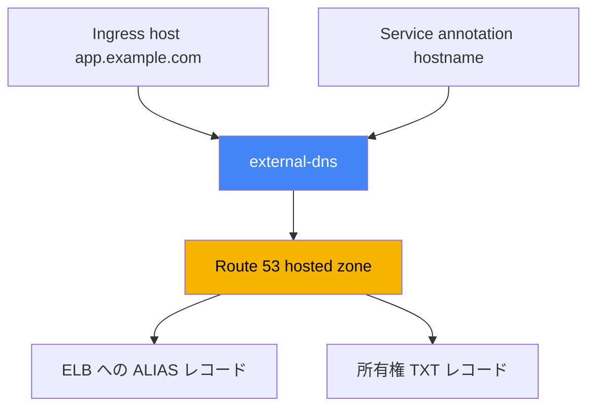
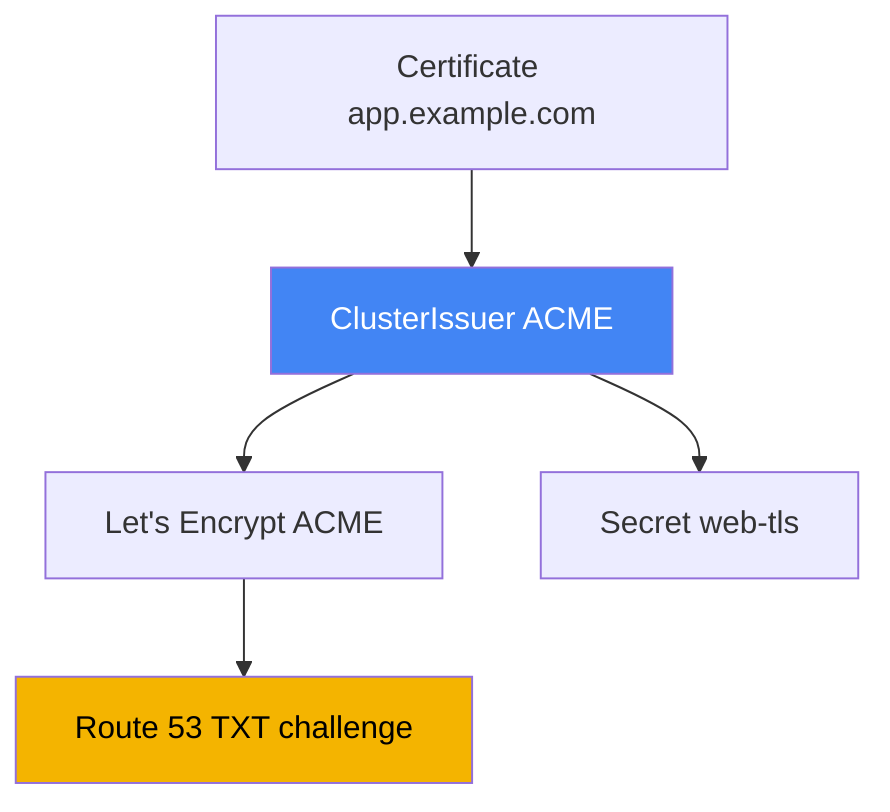

[Eng version](en.md) · [Versión en español](es.md) · [Version française](fr.md) · [Deutsche Version](de.md) · [Русская версия](ru.md) · [ქართული ვერსია](ge.md) · [繁體中文版](tw.md)

# 第29章. DNS と証明書: external-dns、Route 53、cert-manager

> **次は何か。** 第26章から第28章では、ロードバランサーの作成方法を学びました。Service からの NLB（第26章）、Ingress からの ALB（第27章）、Gateway API による ALB と VPC Lattice（第28章）です。しかし、どのアドレスも `...elb.amazonaws.com` のような機械名であり、証明書については簡単に触れただけでした。ここでは、external-dns と Route 53 による DNS レコードの自動化、および ACM と cert-manager の証明書管理という2つの未解決事項を扱います。ALB のアノテーションと ACM は第27章、NLB は第26章、Gateway API は第28章、コントローラーの権限に使う IRSA と Pod Identity は第16章から第17章を参照してください。

## 29.1. 「サイトのアドレスは a1b2...elb.amazonaws.com で、ドメインは手作業で作成する」

前章までのロードバランサーは起動し、アプリケーションも応答していますが、そのアドレスは次のようになります。

```bash
kubectl get ingress
# NAME   CLASS   HOSTS               ADDRESS                                          PORTS
# web    alb     app.example.com     k8s-web-abc123-456.eu-central-1.elb.amazonaws.com  80
```

この名前をユーザーに渡すことはできません。`app.example.com` が必要です。つまり、誰かが Route 53 コンソールに行き、この ELB を指すレコードを作成します。サービスが1つなら許容できます。しかし、サービスが数十あり、新しい Ingress や Service ごとにエンジニアが A レコードまたは ALIAS レコードを手作業で作成し、削除時にも忘れずに消す必要があります。これはスケールせず、現実とのずれも生じます。コントローラーがロードバランサーを再作成すると（`scheme` の変更、Gateway の再構築など）、ELB の DNS 名は変わりますが、Route 53 のレコードは古い名前を指し続けます。

オンコール時の症状は、`kubectl get ingress` がすでに別の ELB を示しているのに、`curl app.example.com` が停止したアドレスへ向かうことです。原因は、クラスターとゾーンの非同期を人が解消しきれないことです。ロードバランサーに対して LBC が行うこと、つまり、レコードを Kubernetes オブジェクトに一致させる DNS コントローラーが必要です。それが external-dns です。

## 29.2. external-dns: クラスターオブジェクトからの DNS レコード

**external-dns** は Kubernetes オブジェクト（Ingress、Service など）を監視し、DNS プロバイダー、この場合は Route 53 にレコードを作成、更新、削除するコントローラーです。ロードバランサーを起動することも DNS クエリに応答することもありません。その仕事は、クラスターオブジェクトから算出された望ましいレコードと、ゾーンの実際の状態を同期することです。

名前のソースは、Ingress の host（Gateway API では HTTPRoute）か、Service のアノテーションです。Service では `external-dns.alpha.kubernetes.io/hostname` アノテーションで名前を指定し、external-dns がその Service のロードバランサーアドレスへの ALIAS を作成します。

```yaml
apiVersion: v1
kind: Service
metadata:
  name: web
  annotations:
    external-dns.alpha.kubernetes.io/hostname: app.example.com
spec:
  type: LoadBalancer
```



external-dns は Helm チャート `external-dns/external-dns` でインストールします。LBC と同様に、自身の ServiceAccount から AWS にアクセスするため、IRSA または Pod Identity による IAM ロールが必要です（第16章から第17章）。external-dns のドキュメントによる最小の権限セットは、ゾーン内のレコード変更とゾーンの列挙です。

```json
{
  "Version": "2012-10-17",
  "Statement": [
    { "Effect": "Allow",
      "Action": [
        "route53:ChangeResourceRecordSets",
        "route53:ListResourceRecordSets",
        "route53:ListTagsForResources"
      ],
      "Resource": ["arn:aws:route53:::hostedzone/*"] },
    { "Effect": "Allow",
      "Action": ["route53:ListHostedZones"],
      "Resource": ["*"] }
  ]
}
```

動作はコントローラーのフラグで指定します。暗記しておくべき主なものは次のとおりです。

| フラグ | 用途 |
|---|---|
| `--provider=aws` | Route 53 を使用する |
| `--source=ingress`, `--source=service` | 望ましい名前の取得元（複数指定可能） |
| `--source=gateway-httproute`, `--source=gateway-grpcroute` | Gateway API リソースからの名前（第28章） |
| `--domain-filter=example.com` | ドメインでゾーンを制限し、他のゾーンに触れない |
| `--policy=upsert-only` \| `sync` | レコードを削除しない、または削除を含む完全同期 |
| `--registry=txt` | レコードの所有権を TXT レコードに保存する |
| `--txt-owner-id=<id>` | レコードを誰が所有するかを示す TXT 内の所有者識別子 |
| `--aws-zone-type=public` \| `private` | public ゾーンのみ、または private ゾーンのみ |

Gateway API にも、学び直すことなく適用できますが、注意点が2つあります。1つ目は、コントローラーにクラスター内の `gateway.networking.k8s.io` リソース（`gateways`、`httproutes`、`grpcroutes`）への権限が必要なことです。なければ単に Route を認識できません。2つ目は、つまずきやすいアノテーションの配置です。名前は Route の `spec.hostnames` から取得されます。`external-dns.alpha.kubernetes.io/target` アノテーションを external-dns が読むのは **Gateway のみ**で、それ以外のアノテーション（`hostname`、`ttl`、プロバイダー固有のもの）は **Route のみ**から読みます。逆に配置しても、黙って無視されます。`TCPRoute` と `UDPRoute` には spec 内の名前がまったくないため、hostname はアノテーションで指定します。

`--policy` には特に注意が必要です。`upsert-only` では external-dns はレコードの作成と更新のみを行い、削除は決してしません。他者のゾーンに導入する場合に安全なモードです。`sync` ではゾーンをクラスターと厳密に一致させ、削除されたオブジェクトのレコードも含めて削除します。

Route 53 API にはリクエスト制限があることも別の論点です。external-dns がゾーンを同期する頻度は `--interval`（デフォルトは `1m`）で指定します。大きなゾーンで間隔を短くしすぎると、より早くスロットリングに達します。応答性のためだけに `--interval` を短くしないよう、`--events` を有効にします。これにより、タイマーだけでなくオブジェクト変更時にも同期サイクルが実行されます。大量変更は `--aws-batch-change-size`（1バッチあたりの変更数、デフォルトは `1000`）と `--aws-batch-change-interval`（バッチ間の待機時間）でまとめ、API 呼び出しの頻度を下げます。

## 29.3. Route 53: hosted zone、ALIAS、ゾーン選択

レコードは **hosted zone**、すなわちドメインのレコードを入れるコンテナに存在します。ゾーンには2種類あります。**Public hosted zone** はインターネットからのクエリに応答し、公開入口に使います。**Private hosted zone** は1つ以上の VPC に関連付けられ、その VPC 内からのみ見えます。内部サービスおよび `scheme: internal` を持つ内部ロードバランサー向けです。

同じ名前の `app.example.com` の public ゾーンと private ゾーンを同時に保持できます。外部からは public アドレスが解決され、VPC 内からは内部アドレスが解決されます。これは **split-horizon DNS**、つまり1つの名前に対してクエリの送信元により異なる応答を返す仕組みです。同一アプリケーションを `internet-facing` ALB 経由で外部に、`internal` 経由で内部にも公開する場合に便利です。

別の問題はレコード種別です。AWS でロードバランサーを指すのは CNAME ではなく **ALIAS** であり、これには理由があります。CNAME は apex ドメイン、すなわちサブドメインなしの `example.com` 自体には設定できません。これは DNS 標準で禁止されています。ALIAS は Route 53 の拡張であり、外見上は A レコードとして振る舞い、ELB のアドレスに解決され、apex とサブドメインの両方で動作し、追加クエリとして課金されません。そのため、external-dns は ELB に対してデフォルトで ALIAS を作成します。

external-dns が書き込み先ゾーンを選ぶ方法は、`--aws-zone-type` と `--domain-filter` を考慮した hosted zone の一覧を取得し、望ましい名前の最長サフィックスであるドメインを持つゾーンを探すことです。`app.example.com` には `example.com` ゾーンが適合しますが、より限定的な `app.example.com` があれば、そちらが選ばれます。public と private のゾーンが同じ名前を持つ場合は、`external-dns.alpha.kubernetes.io/aws-hosted-zone-id` アノテーションにより特定のゾーンへレコードを固定します。

## 29.4. TXT 所有権レジストリと1つのゾーンを使う複数クラスター

external-dns は、自身が作成していないレコードに触れてはなりません。ゾーンには手作業、Terraform、あるいは別のクラスターが作成したレコードが存在し得ます。自分のレコードと他者のレコードを区別するため、**TXT レジストリ**（`--registry=txt`）を使用します。external-dns は各管理レコードの隣に、「このレコードは external-dns により管理され、所有者はこれである」というマーカー TXT レコードを置きます。

所有者は `--txt-owner-id` で指定します。同期時、external-dns が変更または削除するのは、**自身の** owner-id を持つ TXT マーカーがあるレコードだけです。マーカーがないレコードや他者の owner-id を持つレコードには、`--policy=sync` モードでも触れません。これにより、1つのコントローラーが別の管理対象レコードを削除することを防げます。

ここから、同じゾーンに書き込む複数クラスターのルールが導かれます。各クラスターには**固有の** `--txt-owner-id` が必要です。そうしないと、2つの external-dns が他者のレコードを自分のものと見なし、競うように作成・削除して、ゾーンを行ったり来たりさせます。異なる owner-id により所有権が明確になり、各クラスターは自身のレコードセットのみを管理します。

| 設定 | 内容 | 誤った場合のリスク |
|---|---|---|
| `--registry=txt` | TXT マーカーで自身のレコードを印付けする | ない場合、自身のレコードと他者のものを区別できない |
| `--txt-owner-id` | マーカー内の所有者識別子 | 2クラスターで同じ場合、レコードを奪い合う |
| `--policy=upsert-only` | 削除を禁止する | 他者のレコードを誤ってクリーンアップすることを防ぐ |
| `--domain-filter` | ドメインでゾーンを制限する | ない場合、コントローラーはアカウントのすべてのゾーンを認識する |

## 29.5. 証明書: ACM と cert-manager

2つ目の未解決事項は TLS 証明書です。EKS には根本的に異なる2つのソースがあり、異なる問題を解決し異なる場所に存在するため、混同してはいけません。

**AWS Certificate Manager（ACM）** は、ロードバランサー上に存在する証明書です。TLS は ALB または NLB（第27章）で終端され、ACM の秘密鍵はエクスポートされずクラスターにも入りません。更新は AWS 自身が行います。ALB 経由の公開 HTTPS 入口では、これがデフォルトで正しい選択です。`certificate-arn`（または host による自動検出）を設定すれば、あとは AWS がすべて管理します。欠点は1つだけですが、本質的です。鍵を取り出せないため、この証明書を Pod に置くことはできません。

**cert-manager** は、クラスター**内で**証明書を発行し、通常の `Secret` に配置するコントローラーです。サービス間の mTLS、非 ALB ingress（たとえば ingress-nginx）の TLS、アプリケーション自身で終端する内部サービスなど、証明書が Pod に必要な場合に使います。cert-manager は複数のソース（issuer）を扱えます。ACME（Let's Encrypt）を介した公開 CA、自前の CA、別個の aws-privateca-issuer による AWS Private CA です。期限も監視し、有効期限前に証明書を再発行します。

大まかな境界は、TLS をロードバランサーで終端するなら ACM、Pod が読むオブジェクトとしてクラスター内に証明書が必要なら cert-manager です。詳細な選択表は29.7節にあります。

## 29.6. Let's Encrypt と Route 53 経由の DNS-01 を使う cert-manager

EKS における最も一般的な cert-manager のシナリオを見てみましょう。**ACME** プロトコルによる Let's Encrypt の公開証明書で、**DNS-01** によりドメイン所有権を検証します。DNS-01 では認証局が特定の TXT レコードを作ることでドメインの制御を証明するよう求めます。cert-manager は Route 53 にそのレコードを作成し、ACME サーバーが検証して証明書を発行します。そのため cert-manager には Route 53 の権限、すなわち同じ IRSA または Pod Identity の仕組みが必要です（第16章から第17章）。

cert-manager の DNS-01 に必要な権限は external-dns より狭くなります。ゾーンに対する `route53:GetChange`（適用状態の確認）、`route53:ChangeResourceRecordSets`、`route53:ListResourceRecordSets` に加え、`route53:ListHostedZonesByName` が必要です（`hostedZoneID` を指定すれば外せます）。

証明書ソースは、クラスター全体向けの **ClusterIssuer** または namespace 向けの **Issuer** オブジェクトで記述します。IRSA または Pod Identity の ambient-credentials から権限を取得する場合、Route 53 経由 DNS-01 の ACME における `route53` セクションは空にできます。SDK が自動的にロールを取得します。

```yaml
apiVersion: cert-manager.io/v1
kind: ClusterIssuer
metadata:
  name: letsencrypt-prod
spec:
  acme:
    server: https://acme-v02.api.letsencrypt.org/directory
    email: ops@example.com
    privateKeySecretRef:
      name: letsencrypt-prod-account-key
    solvers:
      - dns01:
          route53:
            region: eu-central-1
```

証明書自体は **Certificate** オブジェクトで要求します。名前、ドメイン、および cert-manager が発行済み証明書と鍵を置く `secretName` を指定します。以降、この `Secret` を Pod にマウントするか、ingress コントローラーに渡します。

```yaml
apiVersion: cert-manager.io/v1
kind: Certificate
metadata:
  name: web-tls
spec:
  secretName: web-tls          # ここに tls.crt と tls.key が置かれる
  dnsNames: ["app.example.com"]
  issuerRef:
    name: letsencrypt-prod
    kind: ClusterIssuer
```



アクセス制御に関しては、ambient-credentials はデフォルトで ClusterIssuer にのみ利用可能であり、Issuer には利用できません。これは、namespace のユーザーが偶然利用可能なロールに対して証明書を発行しないようにするためです。マルチテナント向けには、cert-manager は Issuer 用の個別 ServiceAccount（`auth.kubernetes.serviceAccountRef`）と tenant に限定した狭いロールを使用できます。内部証明書では Let's Encrypt の代わりに自前の CA、または aws-privateca-issuer 経由の **AWS Private CA** を使用します。

## 29.7. ACM を使うとき、cert-manager を使うとき

どちらの仕組みも TLS 証明書を発行しますが、選択は1つの問いで決まります。秘密鍵がどこで必要かです。ロードバランサーなら ACM、Pod 内なら cert-manager です。

| 状況 | ソース | 理由 |
|---|---|---|
| ALB 経由の公開入口（Ingress、Gateway） | ACM | ALB で終端し、Pod に鍵は不要 |
| ロードバランサーで終端する NLB の TLS | ACM | 同じく、鍵は listener 上に存在する |
| Pod 間の mTLS | cert-manager | 鍵が `Secret` として Pod 内に必要 |
| ingress-nginx または他の非 ALB ingress | cert-manager | コントローラーの Pod で終端する |
| アプリケーションで TLS を行う内部サービス | cert-manager | アプリケーションに鍵が必要 |
| 内部の企業 CA | cert-manager + AWS Private CA | private CA から発行する |

回避できない重要点は、ACM の証明書を取り出して Pod に置くことはできないことです。鍵は by design でエクスポートされないため、Pod 用には常に cert-manager を使用します。逆に、ACM が鍵なしで処理できる公開 ALB に cert-manager の証明書を流すことには意味がありません。

## 29.8. つまずきやすい点

本番環境で遭遇するいくつかの事項です。

- **DNS propagation。** 作成されたレコードが即座に見えるわけではありません。まず Route 53 が受け付け、その後リゾルバーキャッシュ内の古い応答の TTL が期限切れになります。新しいドメインや変更されたアドレスが数分間「解決できない」ことがあります。これは常に external-dns のバグではなく、多くは単なる TTL です。
- **TXT による所有権。** `--registry=txt` と `--txt-owner-id` がない状態での `sync` モードでは、external-dns が不要と判断したレコードを、外部で作成されたものも含めて削除する可能性があります。TXT レジストリは任意のオプションではなく、必須の衛生管理です。
- **1つのゾーンを使う複数クラスター。** クラスターごとに一意な `--txt-owner-id` が必須です。そうでなければコントローラーが競合します。多くの場合、クラスターごとにサブドメインと `--domain-filter` を与えて、ゾーンがまったく重ならないようにする方が簡単です。
- **Route 53 API のスロットリング。** 大きなゾーンでは頻繁な同期がリクエスト制限に達します。`--interval` は適度に保ち、応答性のために `--events` を有効化し、`--aws-batch-change-size` と `--aws-batch-change-interval` で変更をまとめます。
- **内部ロードバランサー用の private ゾーン。** `internal` ALB と NLB のレコードは、VPC に関連付けた private hosted zone に向けます。external-dns は `--aws-zone-type=private` で制限します。共有または他者のゾーンには `--policy=upsert-only` で入り、削除を伴う完全な `sync` は、external-dns がそのゾーンのレコードの唯一の所有者である場合にのみ有効にします。

## 29.9. 本番での適用方法

- **DNS レコードを手作業で作成しない。** external-dns を一度インストールし、IRSA または Pod Identity（第16章から第17章）でロールを与えれば、Ingress と Service に合わせて名前が現れ、消えます。
- **TXT レジストリと owner-id は常に使う。** 同期により他者のレコードを削除しないよう、初日から `--registry=txt` とクラスターごとに固有の `--txt-owner-id` を有効にします。
- **ゾーンを分離する。** `--domain-filter` と、必要に応じて `--aws-zone-type` によりコントローラーを自身のゾーンに留めます。内部サービスには private hosted zone を作成します。
- **公開 HTTPS には ACM を使う。** ALB と NLB の証明書は自動更新付きで ACM に保持し、この用途に cert-manager は使いません。
- **cert-manager は鍵が Pod に必要な場所で使う。** mTLS、非 ALB ingress、内部サービスは cert-manager で保護します。DNS-01 には Route 53 のロールを、内部用途には AWS Private CA を与えます。
- **ClusterIssuer はプラットフォームチームの管理下に置く。** ambient-credentials は ClusterIssuer にのみ残します。必要な tenant には、個別 ServiceAccount と狭いロールを持つ Issuer を提供します。

## 29.10. ミニ用語集

- **external-dns**: DNS プロバイダーの DNS レコードを Kubernetes オブジェクト（Ingress、Service）と同期するコントローラー。AWS では Route 53 を使用する。
- **hosted zone**: Route 53 におけるドメインの DNS レコードコンテナ。public（インターネット）と private（VPC に関連付け）の種類がある。
- **ALIAS**: AWS リソース（たとえば ELB）を指す Route 53 レコード。CNAME が禁止されるドメイン apex でも動作し、個別クエリとして課金されない。
- **split-horizon DNS**: public と private のゾーンの組み合わせにより、外部と VPC 内部で異なる応答を返す1つの名前。
- **TXT レジストリ**: 自身のレコードを TXT マーカーで印付けする external-dns の仕組み。所有者は `--txt-owner-id` で指定する。
- **ACM（AWS Certificate Manager）**: ロードバランサー上に存在する証明書。鍵はエクスポートされず、更新は自動的に行われる。
- **cert-manager**: `Secret` としてクラスター内で証明書を発行するコントローラー。ソースは ClusterIssuer または Issuer で指定する。
- **DNS-01**: TXT レコードによる ACME のドメイン所有権検証方式。Route 53 では cert-manager がこれを作成する。
- **ClusterIssuer / Issuer**: クラスター全体または namespace の証明書ソースを記述する cert-manager オブジェクト。

## 29.11. この章のまとめ

- ロードバランサーは機械的な ELB 名を取得します。A/ALIAS レコードの手作業による管理はスケールせず、LB の再作成時に現実とのずれが起きるため、DNS を自動化する必要があります。
- external-dns は Ingress と Service を監視し、Route 53 のレコードをクラスターに一致させます。Helm でインストールし、IRSA または Pod Identity（第16章から第17章）のロールで AWS にアクセスします。
- external-dns の権限はゾーンへの `route53:ChangeResourceRecordSets`、`ListResourceRecordSets`、`ListTagsForResources` と `ListHostedZones` です。動作は `--provider=aws`、`--source`、`--domain-filter`、`--policy`、`--registry=txt`、`--txt-owner-id` フラグで設定します。
- Route 53 は public と private の hosted zone を持ちます。ELB には CNAME と異なり apex でも動作する ALIAS を向けます。external-dns は名前の最長サフィックスでゾーンを選択します。
- `--txt-owner-id` を持つ TXT レジストリがレコード所有権を定めます。コントローラーは自身のものだけを変更し、同じゾーンを使う複数クラスターには一意な owner-id が必要です。
- ACM は自動更新とエクスポート不可能な鍵を持つ証明書をロードバランサー上に保持します。ALB と NLB 経由の公開 HTTPS 用であり、鍵を Pod に渡すことはできません。
- cert-manager は mTLS、非 ALB ingress、内部サービス向けに `Secret` としてクラスター内で証明書を発行します。Route 53 経由 DNS-01 の ACME、自前の CA、AWS Private CA が使えます。
- 選択は単純です。鍵がロードバランサー上なら ACM、鍵が Pod 内なら cert-manager です。ACM 証明書を Pod に置くことはできません。

## 29.12. 実際の業務でどう役立つか

オンコールにおける EKS の DNS インシデントは、いくつかの原因に集約されます。オブジェクトがあるのに名前が解決されない場合は、external-dns のログを確認します（`AccessDenied` は、第26章の LBC と同じくロールの問題です）。名前が `--domain-filter` に含まれるかも確認し、すべて問題なければ TTL と propagation を待ちます。レコードが古い ELB を指す場合、コントローラーがロードバランサーの再作成を認識していません。レコードが突然消えた場合は、ほとんど常に TXT 所有権なしの `--policy=sync`、または同一 `--txt-owner-id` を持つ2クラスターが原因です。外部の TLS エラーでは ACM と listener（第27章）を調査し、内部では cert-manager の Certificate とその Secret を確認します。

計画時には、3つの判断をあらかじめ行います。誰がゾーンを所有し、レコードをどのように分離するか（owner-id、domain-filter、クラスターごとの個別サブドメイン）。TLS はどこで終端するか。公開入口はロードバランサー上の ACM、内部トラフィックと mTLS は Pod に鍵を置く cert-manager です。そしてアクセスをどう構成するかです。external-dns と cert-manager はどちらもロールで Route 53 にアクセスするため、インシデント時ではなく、ゾーンとともに IRSA または Pod Identity を設計します。

## 29.13. 自己確認の質問

1. `...elb.amazonaws.com` のようなロードバランサーアドレスをユーザーに渡せないのはなぜですか。また、レコードを手作業で管理する苦労は何ですか。
2. external-dns は何を行い、その仕事は AWS Load Balancer Controller とどう似ていますか。
3. external-dns はどのソースから望ましい名前を取得し、Service の名前はどのアノテーションで指定しますか。
4. external-dns に必要な Route 53 権限は何で、AWS へどのようにアクセスしますか。
5. `--policy=upsert-only` と `--policy=sync` はどう異なり、どちらがいつ安全ですか。
6. public hosted zone と private hosted zone の違いは何で、split-horizon DNS とは何ですか。
7. 特にドメイン apex で、なぜロードバランサーには CNAME ではなく ALIAS を向けるのですか。
8. TXT レジストリが必要な理由と、2つのクラスターで同じ `--txt-owner-id` を使うと何が起こるかを説明してください。
9. 鍵が存在する場所に関して、ACM と cert-manager の根本的な違いは何ですか。
10. ACM の証明書を Pod 内で使用できないのはなぜですか。
11. Route 53 の ACME と DNS-01 による cert-manager の証明書発行はどのように動作しますか。
12. ClusterIssuer と Certificate は何を記述し、発行済み証明書はどこに配置されますか。
13. ACM ではなく cert-manager を選ぶのはどのような場合で、AWS Private CA が必要なのはいつですか。

## 実践

このトピックのコースラボは、[ラボ109 - ACM 証明書、external-dns、Route 53 を使用する ALB 経由の Ingress](../../labs/109/README_JP.MD)です。これ以外はすべて稼働中のクラスターで確認できます。最初に external-dns がインストールされ正常かを確認し、そのフラグを確認します。

```bash
kubectl get deploy -n kube-system external-dns          # または自身の namespace
kubectl get deploy external-dns -o yaml | grep -A2 args  # --source、--policy、--txt-owner-id
kubectl logs deploy/external-dns | tail -n 30            # 権限エラーは AccessDenied として表示される
```

`external-dns.alpha.kubernetes.io/hostname` アノテーションを持つ LoadBalancer 型 Service、または `host` を持つ Ingress を作成し、待機します。AWS 側で、レコードとその TXT マーカーが正しいゾーンに現れたことを確認します。

```bash
aws route53 list-hosted-zones                            # 自身のゾーンの ZONE_ID を見つける
aws route53 list-resource-record-sets --hosted-zone-id <ZONE_ID> \
  --query "ResourceRecordSets[?Name=='app.example.com.']"
```

同じ名前に対する2つのレコードに注意してください。ELB を指す ALIAS（A 型）と、自身の owner-id を持つ所有権 TXT マーカーです。次に、2つの証明書ソースを比較します。ロードバランサー向けの公開証明書は ACM に存在し、cert-manager は鍵をクラスター内の通常の `Secret` に置きます。

```bash
aws acm list-certificates --query "CertificateSummaryList[].[DomainName,CertificateArn]"
kubectl get clusterissuers                  # cert-manager がインストール済みの場合
kubectl get certificate,secret | grep tls
kubectl describe certificate web-tls        # ステータス、DNS-01 challenge、再発行時刻
```

ACM 証明書の鍵はクラスター内にはなく、今後も存在しません。一方 cert-manager は Pod が読む `Secret` に `tls.crt` と `tls.key` を置きます。これが2つのアプローチの境界です。

---
[目次](../README_JP.md) · [第28章](../28/jp.md) · [第30章](../30/jp.md)
