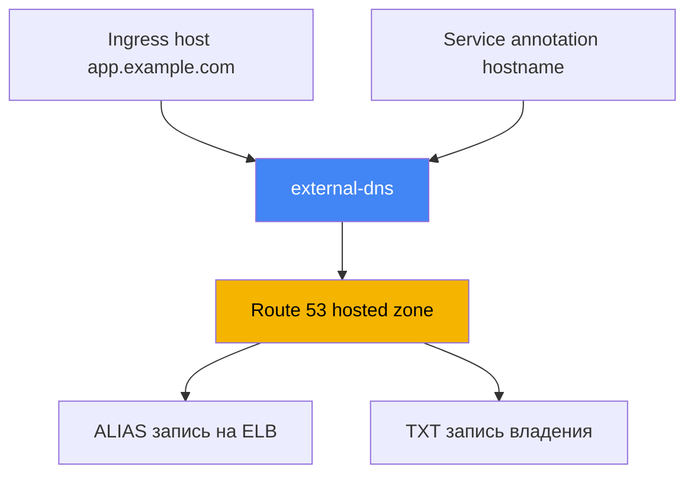
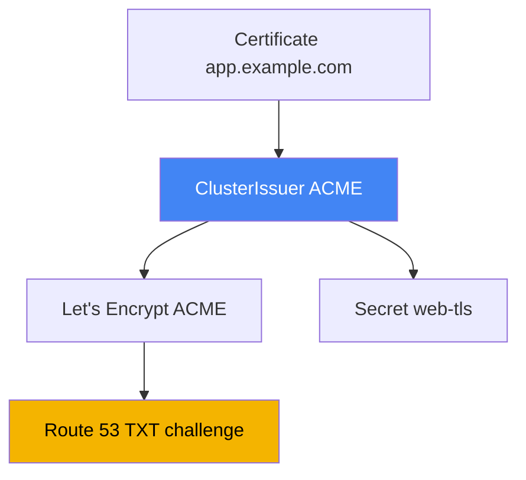

# Глава 29. DNS и сертификаты: external-dns, Route 53, cert-manager

> **Что дальше.** Главы 26-28 научили создавать балансировщики: NLB из Service (глава 26),
> ALB из Ingress (глава 27), ALB и VPC Lattice через Gateway API (глава 28). Но у каждого
> адрес - это машинное имя вида `...elb.amazonaws.com`, а сертификат решался вскользь. Здесь
> закрываем два хвоста: автоматизацию DNS-записей через external-dns и Route 53 и управление
> сертификатами - ACM против cert-manager. Аннотации ALB и ACM - глава 27, NLB - глава 26,
> Gateway API - глава 28, а IRSA и Pod Identity для прав контроллеров - главы 16-17.

## 29.1. «У сайта адрес a1b2...elb.amazonaws.com, а домен заводим руками»

Балансировщик из предыдущих глав поднялся, приложение отвечает, но его адрес выглядит так:

```bash
kubectl get ingress
# NAME   CLASS   HOSTS               ADDRESS                                          PORTS
# web    alb     app.example.com     k8s-web-abc123-456.eu-central-1.elb.amazonaws.com  80
```

Пользователю такое имя не отдашь: нужен `app.example.com`. Значит, кто-то идёт в консоль
Route 53 и заводит запись на этот ELB. Один сервис - терпимо. Но сервисов десятки, и на
каждый новый Ingress или Service инженер вручную создаёт A- или ALIAS-запись, а на удаление
вспоминает и чистит. Это не масштабируется и разъезжается с реальностью: контроллер
пересоздаёт балансировщик (смена `scheme`, пересборка Gateway), DNS-имя ELB меняется, а
запись в Route 53 продолжает указывать на старое имя.

Симптом на дежурстве: `curl app.example.com` идёт на мёртвый адрес, хотя `kubectl get
ingress` показывает уже другой ELB. Причина - рассинхрон между кластером и зоной, который
человек не успевает закрывать. Нужен контроллер, который делает с DNS то же, что LBC делает с
балансировщиками: приводит записи в соответствие с объектами Kubernetes. Это external-dns.

## 29.2. external-dns: DNS-записи по объектам кластера

**external-dns** - это контроллер, который следит за объектами Kubernetes (Ingress, Service и
другими) и создаёт, обновляет и удаляет записи в DNS-провайдере, в нашем случае в Route 53.
Он не поднимает балансировщики и не отвечает на DNS-запросы: его работа - синхронизировать
желаемые записи, вычисленные из объектов кластера, с реальным состоянием зоны.

Источник имени - либо host из Ingress (или из HTTPRoute при Gateway API), либо аннотация на
Service. Для Service имя задают аннотацией `external-dns.alpha.kubernetes.io/hostname`, а
external-dns создаёт ALIAS на адрес балансировщика этого Service:

```yaml
apiVersion: v1
kind: Service
metadata:
  name: web
  annotations:
    external-dns.alpha.kubernetes.io/hostname: app.example.com
spec:
  type: LoadBalancer
```



Ставят external-dns через Helm-чарт `external-dns/external-dns`. Как и LBC, он ходит в AWS от
своего ServiceAccount, поэтому ему нужна IAM-роль через IRSA или Pod Identity (главы 16-17).
Минимальный набор прав по документации external-dns - изменять записи в зонах и перечислять
зоны:

```json
{
  "Version": "2012-10-17",
  "Statement": [
    { "Effect": "Allow",
      "Action": [
        "route53:ChangeResourceRecordSets",
        "route53:ListResourceRecordSets",
        "route53:ListTagsForResources"
      ],
      "Resource": ["arn:aws:route53:::hostedzone/*"] },
    { "Effect": "Allow",
      "Action": ["route53:ListHostedZones"],
      "Resource": ["*"] }
  ]
}
```

Поведение задаётся флагами контроллера. Ключевые, которые стоит знать наизусть:

| Флаг | Назначение |
|---|---|
| `--provider=aws` | работать с Route 53 |
| `--source=ingress`, `--source=service` | откуда брать желаемые имена (можно несколько) |
| `--domain-filter=example.com` | ограничить зоны по домену, не трогать чужие |
| `--policy=upsert-only` \| `sync` | без удаления записей или полная синхронизация с удалением |
| `--registry=txt` | хранить владение записями в TXT-записи |
| `--txt-owner-id=<id>` | идентификатор владельца в TXT, кто именно владеет записью |
| `--aws-zone-type=public` \| `private` | только публичные или только приватные зоны |

Особого внимания стоит `--policy`. При `upsert-only` external-dns только создаёт и обновляет
записи, но никогда не удаляет - безопасный режим для входа в чужую зону. При `sync` он
приводит зону в точное соответствие кластеру, в том числе удаляет записи снятых объектов.

## 29.3. Route 53: hosted zones, ALIAS и выбор зоны

Записи живут в **hosted zone** - контейнере записей для домена. Зоны бывают двух видов.
**Public hosted zone** отвечает на запросы из интернета - это публичный вход. **Private
hosted zone** привязана к одной или нескольким VPC и видна только изнутри этих VPC - для
внутренних сервисов и внутренних балансировщиков со `scheme: internal`.

Можно держать зоны с одинаковым именем `app.example.com` публичную и приватную одновременно:
снаружи резолвится публичный адрес, изнутри VPC - внутренний. Это **split-horizon DNS**:
одно имя, разные ответы в зависимости от того, откуда пришёл запрос. Приём удобен, когда одно
и то же приложение доступно и наружу через `internet-facing` ALB, и внутри через `internal`.

Отдельный вопрос - тип записи. На балансировщик в AWS ведёт **ALIAS**, а не CNAME, и на это
есть причина. CNAME нельзя повесить на apex домена (сам `example.com`, без поддомена) - это
запрещено стандартом DNS. ALIAS - это расширение Route 53: внешне ведёт себя как A-запись,
резолвится в адрес ELB, работает и на apex, и на поддоменах, и не тарифицируется как
дополнительный запрос. Поэтому external-dns для ELB по умолчанию создаёт именно ALIAS.

Как external-dns выбирает, в какую зону писать: он берёт список hosted zones (с учётом
`--aws-zone-type` и `--domain-filter`) и находит зону, чей домен - самый длинный суффикс
желаемого имени. Для `app.example.com` подойдёт зона `example.com`, а если есть более узкая
`app.example.com` - выберется она. Когда публичная и приватная зоны носят одно имя, запись
пинуют к конкретной зоне аннотацией `external-dns.alpha.kubernetes.io/aws-hosted-zone-id`.

## 29.4. TXT-реестр владения и несколько кластеров на одну зону

external-dns не должен трогать записи, которые он не создавал: в зоне могут жить записи,
заведённые вручную, Terraform или другим кластером. Чтобы отличать свои записи от чужих, он
использует **TXT-реестр** (`--registry=txt`). Рядом с каждой управляемой записью external-dns
кладёт TXT-запись-маркер: «эта запись под управлением external-dns, владелец такой-то».

Владельца задаёт `--txt-owner-id`. При синхронизации external-dns трогает и удаляет только
те записи, у которых есть TXT-маркер с **его** owner-id. Запись без маркера или с чужим
owner-id он не тронет даже в режиме `--policy=sync`. Это и есть защита от того, чтобы один
контроллер снёс записи, которыми управляет что-то другое.

Отсюда правило для нескольких кластеров, которые пишут в одну зону: у каждого кластера должен
быть **свой уникальный** `--txt-owner-id`. Иначе два external-dns посчитают чужие записи
своими и будут наперегонки создавать и удалять их, гоняя зону туда-сюда. Разные owner-id
делают владение однозначным: каждый кластер управляет только своим набором записей.

| Настройка | Что делает | Риск при ошибке |
|---|---|---|
| `--registry=txt` | помечает свои записи TXT-маркером | без него не отличить свои записи от чужих |
| `--txt-owner-id` | идентификатор владельца в маркере | одинаковый на два кластера - война за записи |
| `--policy=upsert-only` | запрет удаления | защита от случайной чистки чужого |
| `--domain-filter` | ограничение зон по домену | без него контроллер видит все зоны аккаунта |

## 29.5. Сертификаты: ACM против cert-manager

Второй хвост - TLS-сертификаты. В EKS есть два принципиально разных источника, и путать их
не стоит: они решают разные задачи и живут в разных местах.

**AWS Certificate Manager (ACM)** - это сертификат, который живёт на балансировщике.
Терминация TLS происходит на ALB или NLB (глава 27), приватный ключ из ACM не экспортируется
и в кластер не попадает, продлением занимается сам AWS. Для публичного HTTPS-входа через ALB
это правильный выбор по умолчанию: настроил `certificate-arn` (или автообнаружение по host),
и дальше AWS всё держит сам. Минус ровно один и он же принципиальный: ключ нельзя вытащить,
поэтому такой сертификат нельзя положить в под.

**cert-manager** - это контроллер, который выпускает сертификаты **внутри** кластера и кладёт
их в обычный `Secret`. Он нужен, когда сертификат должен оказаться в поде: mTLS между
сервисами, TLS на не-ALB ingress (например, ingress-nginx), внутренние сервисы, где терминация
идёт в самом приложении. cert-manager умеет несколько источников (issuer'ов): публичный
центр через ACME (Let's Encrypt), собственный CA, AWS Private CA через отдельный
aws-privateca-issuer. Он же сам следит за сроком и перевыпускает сертификат до истечения.

Грубая граница: если TLS терминируется на балансировщике - ACM; если сертификат нужен внутри
кластера как объект, который читает под, - cert-manager. Подробная таблица выбора - в 29.7.

## 29.6. cert-manager с Let's Encrypt и DNS-01 через Route 53

Разберём самый частый сценарий cert-manager в EKS: публичный сертификат от Let's Encrypt по
протоколу **ACME** с проверкой владения доменом через **DNS-01**. При DNS-01 удостоверяющий
центр просит доказать контроль над доменом, создав определённую TXT-запись; cert-manager
создаёт её в Route 53, ACME-сервер проверяет и выдаёт сертификат. Для этого cert-manager'у
нужны права на Route 53, то есть та же связка IRSA или Pod Identity (главы 16-17).

Права для DNS-01 у cert-manager уже, чем у external-dns: помимо `route53:GetChange` (проверка
статуса применения) и `route53:ChangeResourceRecordSets` с `route53:ListResourceRecordSets` на
зоны нужен `route53:ListHostedZonesByName` (его можно убрать, если задать `hostedZoneID`).

Источник сертификатов описывают объектом **ClusterIssuer** (на весь кластер) или **Issuer**
(на namespace). Для ACME с DNS-01 через Route 53, когда права берутся из ambient-credentials
(IRSA или Pod Identity), секция `route53` может быть пустой - SDK сам подхватит роль:

```yaml
apiVersion: cert-manager.io/v1
kind: ClusterIssuer
metadata:
  name: letsencrypt-prod
spec:
  acme:
    server: https://acme-v02.api.letsencrypt.org/directory
    email: ops@example.com
    privateKeySecretRef:
      name: letsencrypt-prod-account-key
    solvers:
      - dns01:
          route53:
            region: eu-central-1
```

Сам сертификат заказывают объектом **Certificate**: указывают имя, домены и `secretName`, в
который cert-manager положит выпущенный сертификат и ключ. Дальше этот `Secret` монтируют в
под или отдают ingress-контроллеру:

```yaml
apiVersion: cert-manager.io/v1
kind: Certificate
metadata:
  name: web-tls
spec:
  secretName: web-tls          # сюда лягут tls.crt и tls.key
  dnsNames: ["app.example.com"]
  issuerRef:
    name: letsencrypt-prod
    kind: ClusterIssuer
```



По разграничению доступа: ambient-credentials по умолчанию доступны только ClusterIssuer, а
не Issuer, чтобы пользователь namespace не выпускал сертификаты на случайно доступную роль.
Для мультитенантности cert-manager умеет отдельный ServiceAccount на Issuer
(`auth.kubernetes.serviceAccountRef`) с узкой ролью на tenant. Для внутренних сертификатов
вместо Let's Encrypt берут собственный CA или **AWS Private CA** через `aws-privateca-issuer`.

## 29.7. Когда ACM, когда cert-manager

Оба механизма выпускают TLS-сертификаты, но выбор определяется одним вопросом: где нужен
приватный ключ. Если на балансировщике - ACM; если в поде - cert-manager.

| Ситуация | Источник | Почему |
|---|---|---|
| Публичный вход через ALB (Ingress, Gateway) | ACM | терминация на ALB, ключ не нужен в поде |
| TLS на NLB с терминацией на балансировщике | ACM | то же, ключ живёт на listener'е |
| mTLS между подами | cert-manager | ключ нужен внутри пода как Secret |
| ingress-nginx или другой non-ALB ingress | cert-manager | терминация в поде контроллера |
| Внутренний сервис, TLS в приложении | cert-manager | приложению нужен ключ |
| Внутренний корпоративный CA | cert-manager + AWS Private CA | выпуск из приватного центра |

Главное, что нельзя обойти: сертификат из ACM невозможно вытащить и положить в под - ключ не
экспортируется by design, поэтому для пода всегда cert-manager. И наоборот, гонять
сертификаты из cert-manager на публичный ALB бессмысленно, когда ACM делает это без ключа.

## 29.8. Нюансы, о которые спотыкаются

Несколько вещей, которые ловят на проде.

- **DNS propagation.** Созданная запись видна не мгновенно: сначала её принимает Route 53,
  затем истекает TTL старого ответа в кэшах резолверов. Свежий домен или изменившийся адрес
  может «не резолвиться» несколько минут - это не всегда баг external-dns, часто просто TTL.
- **Владение через TXT.** Без `--registry=txt` и `--txt-owner-id` external-dns в режиме
  `sync` способен удалить записи, которые считает лишними, включая заведённые не им. Реестр
  TXT - обязательная гигиена, а не опция.
- **Несколько кластеров на одну зону.** Уникальный `--txt-owner-id` на кластер обязателен,
  иначе контроллеры конфликтуют. Часто проще дать каждому кластеру свой поддомен и
  `--domain-filter`, чтобы зоны вообще не пересекались.
- **Приватные зоны для внутренних балансировщиков.** Для `internal` ALB и NLB записи ведут в
  private hosted zone, привязанную к VPC; external-dns ограничивают `--aws-zone-type=private`.
  В общую или чужую зону заходят с `--policy=upsert-only`, а полный `sync` с удалением
  включают, только когда external-dns - единственный владелец записей в зоне.

## 29.9. Как это применяют в продакшене

- **DNS-записи не заводят руками.** external-dns ставят один раз, дают роль через IRSA или
  Pod Identity (главы 16-17) и дальше имена появляются и исчезают вместе с Ingress и Service.
- **TXT-реестр и owner-id - всегда.** `--registry=txt` и уникальный `--txt-owner-id` на
  кластер включают с первого дня, чтобы синхронизация не удаляла чужие записи.
- **Зоны разграничивают.** `--domain-filter` и, где нужно, `--aws-zone-type` держат
  контроллер в своих зонах; для внутренних сервисов заводят private hosted zone.
- **Публичный HTTPS - через ACM.** Сертификат для ALB и NLB держат в ACM с автопродлением,
  cert-manager для этого не привлекают.
- **cert-manager - там, где ключ нужен в поде.** mTLS, non-ALB ingress и внутренние сервисы
  закрывают cert-manager'ом; для DNS-01 дают роль на Route 53, для внутренних - AWS Private CA.
- **ClusterIssuer под контролем платформы.** Ambient-credentials оставляют только
  ClusterIssuer; tenant'ам, где нужно, выдают Issuer с отдельным ServiceAccount и узкой ролью.

## 29.10. Мини-глоссарий

- **external-dns** - контроллер, синхронизирующий DNS-записи в провайдере с объектами
  Kubernetes (Ingress, Service); в AWS работает с Route 53.
- **hosted zone** - контейнер DNS-записей домена в Route 53; бывает public (интернет) и
  private (привязана к VPC).
- **ALIAS** - запись Route 53 на ресурс AWS (например ELB), работает на apex домена, где
  CNAME запрещён, и не тарифицируется как отдельный запрос.
- **split-horizon DNS** - одно имя с разными ответами снаружи и изнутри VPC через пару
  public и private зон.
- **TXT-реестр** - механизм external-dns, помечающий свои записи TXT-маркером; владельца
  задаёт `--txt-owner-id`.
- **ACM (AWS Certificate Manager)** - сертификаты, живущие на балансировщике; ключ не
  экспортируется, продление автоматическое.
- **cert-manager** - контроллер выпуска сертификатов внутри кластера в виде `Secret`;
  источник задают ClusterIssuer или Issuer.
- **DNS-01** - способ ACME-проверки владения доменом через TXT-запись; в Route 53 её создаёт
  cert-manager.
- **ClusterIssuer / Issuer** - объекты cert-manager, описывающие источник сертификатов на
  весь кластер или на namespace.

## 29.11. Итоги главы

- Балансировщик получает машинное имя ELB, а ручное ведение A/ALIAS-записей не масштабируется
  и разъезжается с реальностью при пересоздании LB; DNS нужно автоматизировать.
- external-dns следит за Ingress и Service и приводит записи в Route 53 в соответствие
  кластеру; ставится через Helm, ходит в AWS по роли IRSA или Pod Identity (главы 16-17).
- Права external-dns: `route53:ChangeResourceRecordSets`, `ListResourceRecordSets`,
  `ListTagsForResources` на зоны и `ListHostedZones`; поведение - флаги `--provider=aws`,
  `--source`, `--domain-filter`, `--policy`, `--registry=txt`, `--txt-owner-id`.
- Route 53 держит public и private hosted zones; на ELB ведёт ALIAS (работает на apex, в
  отличие от CNAME); зону external-dns выбирает по самому длинному суффиксу имени.
- TXT-реестр с `--txt-owner-id` задаёт владение записями: контроллер трогает только свои,
  а несколько кластеров на одну зону требуют уникальных owner-id.
- ACM держит сертификат на балансировщике с автопродлением и неэкспортируемым ключом - для
  публичного HTTPS через ALB и NLB; ключ в под не отдать.
- cert-manager выпускает сертификаты внутрь кластера как Secret для mTLS, non-ALB ingress и
  внутренних сервисов; ACME с DNS-01 через Route 53, а также собственный CA и AWS Private CA.
- Выбор простой: ключ на балансировщике - ACM, ключ в поде - cert-manager; ACM-сертификат в
  под положить нельзя.

## 29.12. Как это пригодится в реальной работе

На дежурстве DNS-инциденты в EKS сводятся к нескольким корням. Имя не резолвится, хотя объект
есть - смотрят логи external-dns (`AccessDenied` - проблема роли, как в главе 26 с LBC),
попадание имени под `--domain-filter`, а если всё чисто, ждут TTL и propagation. Запись
указывает на старый ELB - контроллер не увидел пересоздание балансировщика. Запись внезапно
исчезла - почти всегда `--policy=sync` без TXT-владения или два кластера с одним
`--txt-owner-id`. TLS-ошибка снаружи - разбирают ACM и listener (глава 27); внутри - смотрят
Certificate и его Secret в cert-manager.

При планировании держите три решения заранее. Кто владеет зоной и как разграничены записи
(owner-id, domain-filter, отдельные поддомены на кластер). Где терминируется TLS: публичный
вход - ACM на балансировщике, внутренний трафик и mTLS - cert-manager с ключом в поде. И как
устроен доступ: и external-dns, и cert-manager ходят в Route 53 по роли, поэтому их IRSA или
Pod Identity проектируют вместе с зонами, а не в момент инцидента.

## 29.13. Вопросы для самопроверки

1. Почему адрес балансировщика вида `...elb.amazonaws.com` нельзя отдавать пользователю и в
   чём боль ручного ведения записей?
2. Что делает external-dns и чем его работа похожа на работу AWS Load Balancer Controller?
3. Из каких источников external-dns берёт желаемые имена и какая аннотация задаёт имя для
   Service?
4. Какие права в Route 53 нужны external-dns и как он получает доступ в AWS?
5. Чем отличаются `--policy=upsert-only` и `--policy=sync` и когда какой безопаснее?
6. Чем public hosted zone отличается от private и что такое split-horizon DNS?
7. Почему на балансировщик ведёт ALIAS, а не CNAME, особенно на apex домена?
8. Зачем нужен TXT-реестр и что произойдёт при одинаковом `--txt-owner-id` на двух кластерах?
9. В чём принципиальная разница между ACM и cert-manager по месту жизни ключа?
10. Почему сертификат из ACM нельзя использовать внутри пода?
11. Как работает выпуск сертификата cert-manager через ACME и DNS-01 в Route 53?
12. Что описывают ClusterIssuer и Certificate и куда попадает выпущенный сертификат?
13. В каких случаях берут cert-manager, а не ACM, и когда нужен AWS Private CA?

## Практика

Своей лабы у главы пока нет, но всё проверяется на живом кластере. Сначала посмотрите, стоит
ли external-dns и здоров ли он, и загляните в его флаги:

```bash
kubectl get deploy -n kube-system external-dns          # или в своём namespace
kubectl get deploy external-dns -o yaml | grep -A2 args  # --source, --policy, --txt-owner-id
kubectl logs deploy/external-dns | tail -n 30            # ошибки прав видны как AccessDenied
```

Создайте Service типа LoadBalancer с аннотацией `external-dns.alpha.kubernetes.io/hostname`
или Ingress с `host` и подождите. Со стороны AWS проверьте, что запись и её TXT-маркер
появились в нужной зоне:

```bash
aws route53 list-hosted-zones                            # найдите ZONE_ID своей зоны
aws route53 list-resource-record-sets --hosted-zone-id <ZONE_ID> \
  --query "ResourceRecordSets[?Name=='app.example.com.']"
```

Обратите внимание на две записи для одного имени: ALIAS (тип A) на ELB и TXT-маркер владения
с вашим owner-id. Дальше сравните два источника сертификатов - публичные для балансировщика
живут в ACM, а cert-manager кладёт ключ в обычный `Secret` внутри кластера:

```bash
aws acm list-certificates --query "CertificateSummaryList[].[DomainName,CertificateArn]"
kubectl get clusterissuers                  # если cert-manager установлен
kubectl get certificate,secret | grep tls
kubectl describe certificate web-tls        # статус, challenge DNS-01, время перевыпуска
```

У ACM-сертификата ключа в кластере нет и не будет, а cert-manager кладёт `tls.crt` и
`tls.key` в `Secret`, который читает под. Это и есть граница между двумя подходами.

---
[Оглавление](../README_RU.md) · [Глава 28](../28/ru.md) · [Глава 30](../30/ru.md)
