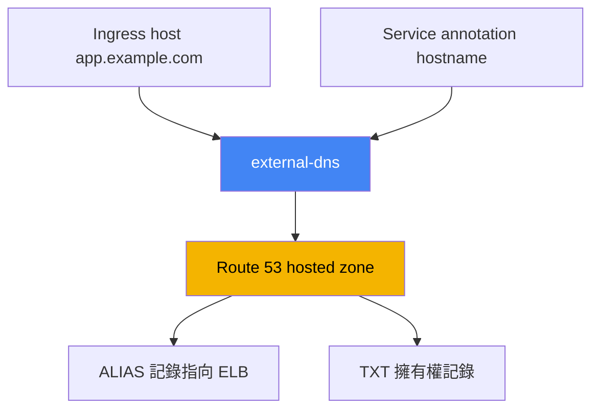
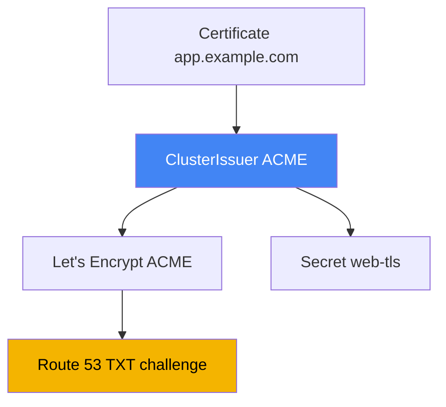

[English version](en.md) · [Versión en español](es.md) · [Version française](fr.md) · [Deutsche Version](de.md) · [ქართული ვერსია](ge.md) · [Русская версия](ru.md) · [日本語版](jp.md)

# 第 29 章。DNS 與憑證：external-dns、Route 53、cert-manager

> **接下來。** 第 26-28 章已說明如何建立負載平衡器：從 Service 建立 NLB（第 26 章）、從 Ingress 建立 ALB（第 27 章），以及透過 Gateway API 建立 ALB 與 VPC Lattice（第 28 章）。但每個位址都是形如 `...elb.amazonaws.com` 的機器名稱，而憑證僅略有提及。本章補齊兩件事：透過 external-dns 和 Route 53 自動化 DNS 記錄，以及憑證管理，即 ACM 與 cert-manager 的比較。ALB annotation 與 ACM 見第 27 章，NLB 見第 26 章，Gateway API 見第 28 章，而用於控制器權限的 IRSA 與 Pod Identity 見第 16-17 章。

## 29.1.「網站的位址是 a1b2...elb.amazonaws.com，而網域要手動建立」

前幾章的負載平衡器已啟動，應用程式有回應，但它的位址如下：

```bash
kubectl get ingress
# NAME   CLASS   HOSTS               ADDRESS                                          PORTS
# web    alb     app.example.com     k8s-web-abc123-456.eu-central-1.elb.amazonaws.com  80
```

不能將這種名稱交給使用者，必須有 `app.example.com`。因此有人會進入 Route 53 主控台，建立指向此 ELB 的記錄。一個服務尚可接受，但若有數十個服務，每個新的 Ingress 或 Service 都需要工程師手動建立 A 或 ALIAS 記錄，刪除時還要記得清理。這無法擴展，也會與實際狀況脫節：控制器重新建立負載平衡器（變更 `scheme`、重建 Gateway）後，ELB 的 DNS 名稱變了，但 Route 53 記錄仍指向舊名稱。

值班時的症狀是：雖然 `kubectl get ingress` 已顯示另一個 ELB，`curl app.example.com` 卻連往失效位址。原因是叢集與 hosted zone 之間不同步，人員來不及修正。需要一個控制器，對 DNS 執行與 LBC 對負載平衡器相同的事：使記錄與 Kubernetes 物件保持一致。這就是 external-dns。

## 29.2. external-dns：依叢集物件建立 DNS 記錄

**external-dns** 是一個監看 Kubernetes 物件（Ingress、Service 等）的控制器，會在 DNS 供應商中建立、更新與刪除記錄，在此情境是 Route 53。它不會建立負載平衡器，也不會回應 DNS 查詢：它的工作是將從叢集物件計算出的所需記錄，與 zone 的實際狀態同步。

名稱的來源可以是 Ingress 的 host（或 Gateway API 使用時 HTTPRoute 的 host），或 Service 上的 annotation。對 Service 而言，使用 `external-dns.alpha.kubernetes.io/hostname` annotation 設定名稱，而 external-dns 會為該 Service 的負載平衡器位址建立 ALIAS：

```yaml
apiVersion: v1
kind: Service
metadata:
  name: web
  annotations:
    external-dns.alpha.kubernetes.io/hostname: app.example.com
spec:
  type: LoadBalancer
```



透過 Helm chart `external-dns/external-dns` 安裝 external-dns。和 LBC 一樣，它以自己的 ServiceAccount 存取 AWS，因此需要透過 IRSA 或 Pod Identity 的 IAM role（第 16-17 章）。依 external-dns 文件，最小權限集合是變更 zone 中的記錄及列舉 zones：

```json
{
  "Version": "2012-10-17",
  "Statement": [
    { "Effect": "Allow",
      "Action": [
        "route53:ChangeResourceRecordSets",
        "route53:ListResourceRecordSets",
        "route53:ListTagsForResources"
      ],
      "Resource": ["arn:aws:route53:::hostedzone/*"] },
    { "Effect": "Allow",
      "Action": ["route53:ListHostedZones"],
      "Resource": ["*"] }
  ]
}
```

控制器行為由旗標指定。以下是應熟記的重要旗標：

| 旗標 | 用途 |
|---|---|
| `--provider=aws` | 使用 Route 53 |
| `--source=ingress`、`--source=service` | 所需名稱的來源（可指定多個） |
| `--source=gateway-httproute`、`--source=gateway-grpcroute` | 取自 Gateway API 資源的名稱（第 28 章） |
| `--domain-filter=example.com` | 依網域限制 zones，不碰其他人的 zone |
| `--policy=upsert-only` \| `sync` | 不刪除記錄，或完整同步並刪除 |
| `--registry=txt` | 將記錄擁有權儲存在 TXT 記錄中 |
| `--txt-owner-id=<id>` | TXT 中的擁有者識別碼，用以識別誰擁有記錄 |
| `--aws-zone-type=public` \| `private` | 僅限 public 或僅限 private zones |

遷移至 Gateway API 時不需重新學習，但有兩點要注意。第一，控制器需要叢集內 `gateway.networking.k8s.io` 資源（`gateways`、`httproutes`、`grpcroutes`）的權限，否則根本看不到路由。第二，annotation 的分配容易出錯：名稱取自路由的 `spec.hostnames`，external-dns **僅從 `Gateway`** 讀取 `external-dns.alpha.kubernetes.io/target` annotation，而其他 annotation（`hostname`、`ttl`、供應商專屬的 annotation）**僅從路由**讀取。若反過來設定，會被靜默忽略。`TCPRoute` 與 `UDPRoute` 的 spec 根本沒有名稱，因此以 annotation 為它們設定 hostname。

`--policy` 需要特別注意。使用 `upsert-only` 時，external-dns 僅建立及更新記錄，絕不刪除，這是接管他人 zone 時的安全模式。使用 `sync` 時，它會使 zone 與叢集完全一致，包括刪除已移除物件的記錄。

另一個議題是 Route 53 API 的請求限制。external-dns 同步 zone 的頻率由 `--interval` 指定（預設 `1m`）；在大型 zone 中設定過短間隔，會更快碰到 throttling。為了不因回應性而降低 `--interval`，可啟用 `--events`，如此除了計時器以外，物件變更也會額外觸發迴圈。大量變更可使用 `--aws-batch-change-size`（每批變更數量，預設 `1000`）及 `--aws-batch-change-interval`（批次之間的停頓）分批，以減少 API 呼叫。

## 29.3. Route 53：hosted zones、ALIAS 與 zone 選擇

記錄位於 **hosted zone** 中，也就是一個網域的記錄容器。zone 有兩種。**Public hosted zone** 回應來自網際網路的查詢，供公開入口使用。**Private hosted zone** 關聯一個或多個 VPC，僅能從這些 VPC 內部看到，供內部服務及使用 `scheme: internal` 的內部負載平衡器使用。

可以同時保有名稱相同的 public 和 private `app.example.com` zones：外部會解析為公開位址，VPC 內部則解析為內部位址。這是 **split-horizon DNS**：同一名稱會根據查詢來源得到不同答案。當同一應用程式同時透過 `internet-facing` ALB 對外提供，也透過 `internal` 在內部提供時，這種方式很實用。

另一個問題是記錄類型。AWS 中應使用 **ALIAS** 而非 CNAME 指向負載平衡器，原因如下。CNAME 無法設定在 apex 網域（沒有子網域的 `example.com` 本身），這由 DNS 標準禁止。ALIAS 是 Route 53 擴充功能：從外部看來如同 A 記錄，會解析為 ELB 位址，可用於 apex 與子網域，且不會按額外查詢計費。因此 external-dns 預設會為 ELB 建立 ALIAS。

external-dns 如何選擇要寫入哪個 zone：它取得 hosted zones 清單（考慮 `--aws-zone-type` 與 `--domain-filter`），並找到網域是所需名稱最長後綴的 zone。對 `app.example.com`，`example.com` zone 適用；若存在更精確的 `app.example.com`，則選擇後者。當 public 與 private zone 使用相同名稱時，以 `external-dns.alpha.kubernetes.io/aws-hosted-zone-id` annotation 將記錄固定至特定 zone。

## 29.4. TXT 擁有權登錄與多個叢集共用一個 zone

external-dns 不應觸碰並非它建立的記錄：zone 中可能有手動建立、Terraform 或其他叢集建立的記錄。為區分自己的記錄與別人的記錄，它使用 **TXT 登錄**（`--registry=txt`）。external-dns 在每筆受管理記錄旁放置 TXT 標記記錄：「此記錄由 external-dns 管理，擁有者為某人」。

擁有者由 `--txt-owner-id` 設定。同步時，external-dns 僅觸碰及刪除具有 **其自身** owner-id TXT 標記的記錄。即使使用 `--policy=sync`，它也不會碰沒有標記或擁有其他 owner-id 的記錄。這可防止一個控制器刪除由其他系統管理的記錄。

因此，多個叢集寫入同一 zone 的規則是：每個叢集必須有**專屬且唯一的** `--txt-owner-id`。否則兩個 external-dns 會把對方的記錄當作自己的，競相建立和刪除，讓 zone 不斷來回變動。不同的 owner-id 使擁有權明確：每個叢集只管理自身那組記錄。

| 設定 | 作用 | 設錯時的風險 |
|---|---|---|
| `--registry=txt` | 以 TXT 標記標示自己的記錄 | 沒有它便無法區分自己的與他人的記錄 |
| `--txt-owner-id` | 標記中的擁有者識別碼 | 兩個叢集相同時會爭奪記錄 |
| `--policy=upsert-only` | 禁止刪除 | 避免意外清除他人的記錄 |
| `--domain-filter` | 依網域限制 zones | 沒有它控制器可看見帳戶中的所有 zones |

## 29.5. 憑證：ACM 與 cert-manager

第二件事是 TLS 憑證。EKS 中有兩種根本不同的來源，不應混淆：它們解決不同問題並存在於不同位置。

**AWS Certificate Manager (ACM)** 是存在於負載平衡器上的憑證。TLS 終結於 ALB 或 NLB（第 27 章），ACM 的私密金鑰無法匯出，也不會進入叢集，更新則由 AWS 自行處理。對透過 ALB 的公開 HTTPS 入口，這是正確的預設選擇：設定 `certificate-arn`（或按 host 自動探索）後，AWS 便會自行維護一切。唯一且根本的缺點是無法取出金鑰，因此無法將該憑證放入 Pod。

**cert-manager** 是在叢集**內部**簽發憑證並將其存入一般 `Secret` 的控制器。當憑證必須出現在 Pod 中時需要它：服務間 mTLS、非 ALB ingress 上的 TLS（例如 ingress-nginx），或 TLS 在應用程式本身終結的內部服務。cert-manager 支援多個來源（issuer）：透過 ACME 的公開 CA（Let's Encrypt）、自建 CA，以及透過獨立 aws-privateca-issuer 的 AWS Private CA。它也自行監看到期日並在到期前重新簽發憑證。

粗略界線是：若 TLS 在負載平衡器終結，使用 ACM；若憑證需作為由 Pod 讀取的物件存在於叢集內，使用 cert-manager。完整選擇表見 29.7。

## 29.6. 搭配 Let's Encrypt 與透過 Route 53 DNS-01 的 cert-manager

來看 EKS 中最常見的 cert-manager 情境：透過 **ACME** 協定，以 **DNS-01** 驗證網域所有權，從 Let's Encrypt 取得公開憑證。使用 DNS-01 時，憑證中心要求藉由建立特定 TXT 記錄來證明網域控制權；cert-manager 在 Route 53 建立它，ACME 伺服器驗證後簽發憑證。為此 cert-manager 需要 Route 53 權限，也就是同樣的 IRSA 或 Pod Identity 組合（第 16-17 章）。

cert-manager 的 DNS-01 權限比 external-dns 更窄：除了在 zones 上的 `route53:GetChange`（檢查套用狀態）、`route53:ChangeResourceRecordSets` 與 `route53:ListResourceRecordSets`，還需要 `route53:ListHostedZonesByName`（若設定 `hostedZoneID`，則可移除此權限）。

憑證來源以 **ClusterIssuer**（整個叢集）或 **Issuer**（一個 namespace）物件描述。透過 Route 53 使用 DNS-01 的 ACME，且權限取自 ambient-credentials（IRSA 或 Pod Identity）時，`route53` 區段可以是空的，SDK 會自行取得 role：

```yaml
apiVersion: cert-manager.io/v1
kind: ClusterIssuer
metadata:
  name: letsencrypt-prod
spec:
  acme:
    server: https://acme-v02.api.letsencrypt.org/directory
    email: ops@example.com
    privateKeySecretRef:
      name: letsencrypt-prod-account-key
    solvers:
      - dns01:
          route53:
            region: eu-central-1
```

實際憑證透過 **Certificate** 物件申請：指定名稱、網域及 `secretName`，cert-manager 會將簽發的憑證與金鑰放入其中。接著將此 `Secret` 掛載至 Pod，或提供給 ingress 控制器：

```yaml
apiVersion: cert-manager.io/v1
kind: Certificate
metadata:
  name: web-tls
spec:
  secretName: web-tls          # tls.crt 和 tls.key 將放在這裡
  dnsNames: ["app.example.com"]
  issuerRef:
    name: letsencrypt-prod
    kind: ClusterIssuer
```



關於存取控制：為防止 namespace 使用者透過意外可用的 role 簽發憑證，ambient-credentials 預設僅提供給 ClusterIssuer，不提供給 Issuer。為支援多租戶，cert-manager 可在 Issuer 上使用獨立 ServiceAccount（`auth.kubernetes.serviceAccountRef`），並授予租戶範圍受限的 role。對內部憑證，可不使用 Let's Encrypt，改用自建 CA 或透過 `aws-privateca-issuer` 的 **AWS Private CA**。

## 29.7. 何時使用 ACM，何時使用 cert-manager

兩種機制都會簽發 TLS 憑證，但選擇取決於一個問題：私密金鑰需要在哪裡。若在負載平衡器上，使用 ACM；若在 Pod 中，使用 cert-manager。

| 情境 | 來源 | 原因 |
|---|---|---|
| 透過 ALB 的公開入口（Ingress、Gateway） | ACM | TLS 在 ALB 終結，Pod 不需要金鑰 |
| TLS 位於終結於負載平衡器的 NLB | ACM | 相同原因，金鑰存在 listener 上 |
| Pod 之間的 mTLS | cert-manager | Pod 內需要作為 Secret 的金鑰 |
| ingress-nginx 或其他非 ALB ingress | cert-manager | 在控制器 Pod 中終結 |
| 內部服務，應用程式中的 TLS | cert-manager | 應用程式需要金鑰 |
| 內部企業 CA | cert-manager + AWS Private CA | 從私有憑證中心簽發 |

無法繞過的重點是：ACM 憑證無法取出並放入 Pod，因為金鑰依設計不可匯出，因此 Pod 一律使用 cert-manager。反之，當 ACM 可在不使用金鑰的情況下完成時，將 cert-manager 的憑證部署到公開 ALB 沒有意義。

## 29.8. 常見陷阱

以下是幾個在生產環境中常遇到的問題。

- **DNS propagation。** 建立的記錄不會立即可見：Route 53 先接受它，接著 resolver 快取中的舊回應 TTL 必須過期。剛建立的網域或變更的位址可能數分鐘「無法解析」，不一定是 external-dns 的 bug，通常只是 TTL。
- **透過 TXT 的擁有權。** 沒有 `--registry=txt` 和 `--txt-owner-id` 時，處於 `sync` 模式的 external-dns 能刪除它認為多餘的記錄，包括不是它建立的記錄。TXT 登錄是必要的衛生措施，不是選項。
- **多個叢集共用一個 zone。** 每個叢集必須使用唯一的 `--txt-owner-id`，否則控制器會衝突。通常更簡單的作法是給每個叢集自己的子網域及 `--domain-filter`，使 zones 完全不重疊。
- **Route 53 API throttling。** 大型 zones 中，頻繁同步會碰到請求限制。應保持適中的 `--interval`、啟用 `--events` 以提高回應性，並透過 `--aws-batch-change-size` 與 `--aws-batch-change-interval` 合併變更。
- **供內部負載平衡器使用的 private zones。** `internal` ALB 和 NLB 的記錄應指向關聯 VPC 的 private hosted zone；以 `--aws-zone-type=private` 限制 external-dns。進入共用或他人的 zone 時使用 `--policy=upsert-only`，只有當 external-dns 是 zone 記錄的唯一擁有者時，才啟用會刪除記錄的完整 `sync`。

## 29.9. 生產環境中的使用方式

- **不手動建立 DNS 記錄。** 安裝一次 external-dns，透過 IRSA 或 Pod Identity（第 16-17 章）授予 role，之後名稱隨著 Ingress 與 Service 一起出現及消失。
- **一律使用 TXT 登錄及 owner-id。** 從第一天起便啟用 `--registry=txt` 和每個叢集唯一的 `--txt-owner-id`，以免同步刪除他人的記錄。
- **劃分 zones。** 使用 `--domain-filter` 及需要時的 `--aws-zone-type` 讓控制器侷限於自己的 zones；為內部服務建立 private hosted zone。
- **公開 HTTPS 使用 ACM。** 將 ALB 與 NLB 的憑證保留在有自動更新的 ACM，無需為此使用 cert-manager。
- **在 Pod 需要金鑰的地方使用 cert-manager。** mTLS、非 ALB ingress 與內部服務使用 cert-manager；DNS-01 授予 Route 53 role，內部用途使用 AWS Private CA。
- **由平台控制 ClusterIssuer。** 僅為 ClusterIssuer 保留 ambient-credentials；需要時為租戶提供具有獨立 ServiceAccount 和受限 role 的 Issuer。

## 29.10. 迷你詞彙表

- **external-dns**：將 DNS 供應商中的 DNS 記錄與 Kubernetes 物件（Ingress、Service）同步的控制器；在 AWS 中使用 Route 53。
- **hosted zone**：Route 53 中網域 DNS 記錄的容器；可為 public（網際網路）或 private（關聯至 VPC）。
- **ALIAS**：指向 AWS 資源（例如 ELB）的 Route 53 記錄，可在禁止 CNAME 的 apex 網域運作，且不按單獨請求計費。
- **split-horizon DNS**：透過一組 public 和 private zones，讓同一名稱由 VPC 外部與內部取得不同回應。
- **TXT 登錄**：external-dns 以 TXT 標記標示自身記錄的機制；擁有者由 `--txt-owner-id` 指定。
- **ACM (AWS Certificate Manager)**：存在於負載平衡器上的憑證；金鑰不可匯出並自動更新。
- **cert-manager**：將叢集內憑證簽發為 `Secret` 的控制器；來源由 ClusterIssuer 或 Issuer 指定。
- **DNS-01**：透過 TXT 記錄驗證網域所有權的 ACME 驗證方式；在 Route 53 中由 cert-manager 建立。
- **ClusterIssuer / Issuer**：cert-manager 物件，分別描述整個叢集或一個 namespace 的憑證來源。

## 29.11. 本章總結

- 負載平衡器取得機器名稱 ELB，而手動管理 A/ALIAS 記錄無法擴展，且在 LB 重建後會與實際狀態脫節；DNS 必須自動化。
- external-dns 監看 Ingress 與 Service，使 Route 53 記錄與叢集一致；透過 Helm 安裝，並經由 IRSA 或 Pod Identity role（第 16-17 章）存取 AWS。
- external-dns 權限包括 zones 上的 `route53:ChangeResourceRecordSets`、`ListResourceRecordSets`、`ListTagsForResources`，以及 `ListHostedZones`；行為由 `--provider=aws`、`--source`、`--domain-filter`、`--policy`、`--registry=txt`、`--txt-owner-id` 旗標控制。
- Route 53 提供 public 和 private hosted zones；ELB 使用 ALIAS（與 CNAME 不同，它可用於 apex）；external-dns 依名稱最長後綴選擇 zone。
- 使用 `--txt-owner-id` 的 TXT 登錄定義記錄擁有權：控制器只碰自己的記錄，而多個叢集共用一個 zone 時需要唯一 owner-id。
- ACM 在負載平衡器上保有具自動更新與不可匯出金鑰的憑證，適用於透過 ALB 與 NLB 的公開 HTTPS；無法將金鑰交給 Pod。
- cert-manager 將憑證作為 Secret 簽發至叢集內，適用於 mTLS、非 ALB ingress 與內部服務；支援透過 Route 53 DNS-01 的 ACME，以及自建 CA 與 AWS Private CA。
- 選擇很簡單：金鑰在負載平衡器上用 ACM，金鑰在 Pod 中用 cert-manager；ACM 憑證無法放入 Pod。

## 29.12. 這在實際工作中的用途

EKS 的 DNS 事件通常歸因於幾個根本原因。若物件存在但名稱無法解析，查看 external-dns 日誌（`AccessDenied` 代表 role 問題，如第 26 章 LBC 所述）、確認名稱是否符合 `--domain-filter`，若一切正常則等待 TTL 與 propagation。若記錄指向舊 ELB，代表控制器未察覺負載平衡器重建。若記錄突然消失，幾乎總是沒有 TXT 擁有權的 `--policy=sync`，或兩個叢集使用同一個 `--txt-owner-id`。外部 TLS 錯誤時檢查 ACM 與 listener（第 27 章）；內部錯誤時檢查 cert-manager 的 Certificate 及其 Secret。

規劃時預先確定三項決策。誰擁有 zone，以及記錄如何劃分（owner-id、domain-filter、每個叢集獨立子網域）。TLS 在哪裡終結：公開入口在負載平衡器使用 ACM，內部流量與 mTLS 使用金鑰位於 Pod 中的 cert-manager。還有存取方式：external-dns 和 cert-manager 都透過 role 存取 Route 53，因此應與 zones 一起設計它們的 IRSA 或 Pod Identity，而非在事件發生時才處理。

## 29.13. 自我檢查問題

1. 為何不能將形如 `...elb.amazonaws.com` 的負載平衡器位址交給使用者，而手動維護記錄有何痛點？
2. external-dns 做什麼，其工作與 AWS Load Balancer Controller 有何相似之處？
3. external-dns 從哪些來源取得所需名稱，哪個 annotation 為 Service 設定名稱？
4. external-dns 在 Route 53 需要哪些權限，又如何取得 AWS 存取權？
5. `--policy=upsert-only` 和 `--policy=sync` 有何不同，何時哪個較安全？
6. public hosted zone 與 private hosted zone 有何不同，什麼是 split-horizon DNS？
7. 為何指向負載平衡器時使用 ALIAS 而非 CNAME，特別是在 apex 網域？
8. 為何需要 TXT 登錄，兩個叢集使用相同 `--txt-owner-id` 時會如何？
9. ACM 與 cert-manager 在金鑰所在位置上的根本差異是什麼？
10. 為何無法在 Pod 內使用 ACM 的憑證？
11. cert-manager 如何透過 Route 53 的 ACME 與 DNS-01 簽發憑證？
12. ClusterIssuer 與 Certificate 分別描述什麼，簽發的憑證會放到哪裡？
13. 哪些情況使用 cert-manager 而非 ACM，何時需要 AWS Private CA？

## 實作

本課程此主題的 lab：[lab 109，透過具 ACM 憑證、external-dns 與 Route 53 的 ALB 進行 Ingress](../../labs/109/README_TW.MD)。此外，所有內容都能在即時叢集上驗證。先檢查 external-dns 是否已安裝且健康，並查看其旗標：

```bash
kubectl get deploy -n kube-system external-dns          # 或在自己的 namespace 中
kubectl get deploy external-dns -o yaml | grep -A2 args  # --source、--policy、--txt-owner-id
kubectl logs deploy/external-dns | tail -n 30            # 權限錯誤會顯示為 AccessDenied
```

建立帶有 `external-dns.alpha.kubernetes.io/hostname` annotation 的 LoadBalancer 類型 Service，或含有 `host` 的 Ingress，然後等待。從 AWS 端確認記錄及其 TXT 標記已出現在正確的 zone：

```bash
aws route53 list-hosted-zones                            # 找到所屬 zone 的 ZONE_ID
aws route53 list-resource-record-sets --hosted-zone-id <ZONE_ID> \
  --query "ResourceRecordSets[?Name=='app.example.com.']"
```

注意同一名稱的兩筆記錄：指向 ELB 的 ALIAS（A 類型）與帶有你的 owner-id 的 TXT 擁有權標記。接著比較兩種憑證來源：負載平衡器的公開憑證存在 ACM，而 cert-manager 將金鑰放入叢集內一般的 `Secret`：

```bash
aws acm list-certificates --query "CertificateSummaryList[].[DomainName,CertificateArn]"
kubectl get clusterissuers                  # 若已安裝 cert-manager
kubectl get certificate,secret | grep tls
kubectl describe certificate web-tls        # 狀態、DNS-01 challenge、重新簽發時間
```

ACM 憑證在叢集中沒有也不會有金鑰，而 cert-manager 會將 `tls.crt` 及 `tls.key` 放入由 Pod 讀取的 `Secret`。這就是兩種方法之間的界線。

---
[目錄](../README_TW.md) · [第 28 章](../28/tw.md) · [第 30 章](../30/tw.md)
