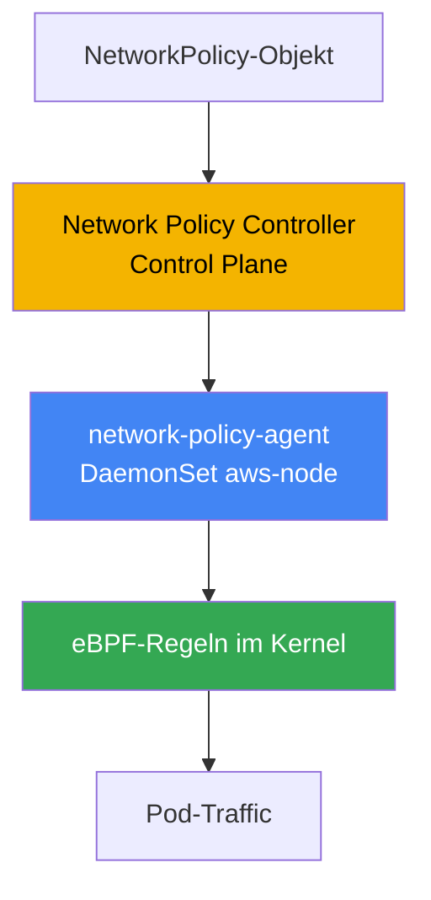
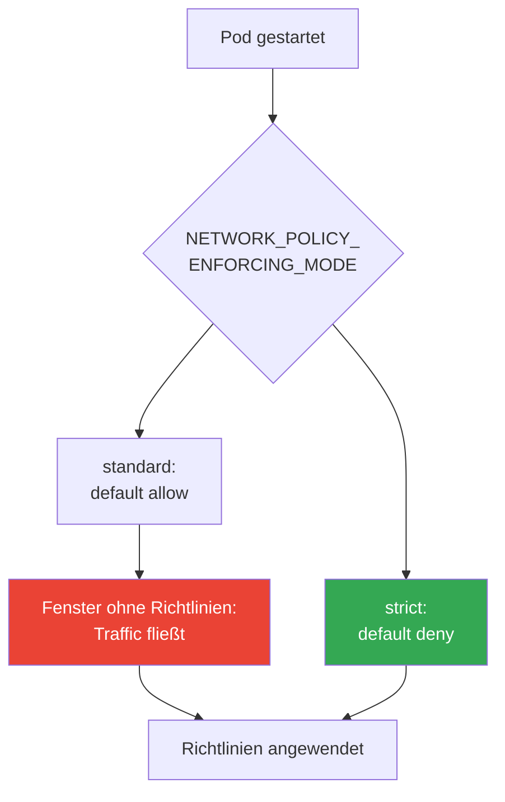
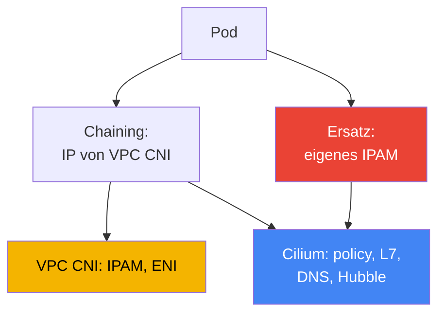

[Eng version](en.md) · [Versión en español](es.md) · [Version française](fr.md) · [Русская версия](ru.md) · [ქართული ვერსია](ge.md) · [繁體中文版](tw.md) · [日本語版](jp.md)
# Kapitel 30. NetworkPolicy in EKS: VPC-CNI-Network-Policy und Cilium

> **Wie es weitergeht.** Die Kapitel 26-29 zeigten, wie Datenverkehr von außen in den Cluster gelangt: NLB (Kapitel 26),
> ALB (Kapitel 27), Gateway API (Kapitel 28), DNS und Zertifikate (Kapitel 29). Hier geht es um East-West-Traffic,
> also die Isolierung des Datenverkehrs zwischen den Pods selbst mittels NetworkPolicy. Alternative CNI und die Art,
> wie VPC CNI IP-Adressen an Pods vergibt, behandelt Kapitel 8; ausgehenden Traffic und Traffic-Kosten Kapitel 31;
> Mandantentrennung und Richtlinien über Kyverno und Gatekeeper Kapitel 22 (das ist Admission, nicht NetworkPolicy).
> Hier nur eines: Wer blockiert in EKS tatsächlich Pakete zwischen Pods und wie?

## 30.1. „Die Richtlinie wurde angewendet, aber der Traffic fließt weiterhin“

Kubernetes kennen Sie: NetworkPolicy ist ein Standardobjekt, `default deny` in einem Namespace sperrt den gesamten
Ingress, und weitere Regeln öffnen das Nötige. In einem frischen EKS-Cluster tut ein Engineer genau das, was auf der
CKA gelehrt wurde: Er wendet eine verbietende Richtlinie an und erwartet, dass die Verbindung zwischen Pods abbricht.

```bash
kubectl apply -f default-deny.yaml
kubectl get netpol
# NAME           POD-SELECTOR   AGE
# default-deny   <none>         10s
```

Die Richtlinie ist vorhanden, der Selector ist leer, sie erfasst also alle Pods des Namespace. Nach CKA-Logik sollte
ein benachbarter Pod das Ziel bereits nicht mehr erreichen können. Der Test zeigt jedoch das Gegenteil:

```bash
kubectl exec deploy/client -- curl -s -m 3 http://web.default.svc.cluster.local
# <html>... 200 OK - die Verbindung ging durch, obwohl sie hätte blockiert werden sollen
```

Der Traffic fließt, als gäbe es keine Richtlinie. Das ist kein Fehler im Manifest und kein Tippfehler im Selector.
Der Grund ist, dass in EKS standardmäßig **niemand NetworkPolicy durchsetzt**. Das Objekt existiert in der API,
aber in der Basiskonfiguration von VPC CNI gibt es keine Komponente, die es in Regeln auf den Nodes umwandelt.
Solange diese Funktion nicht aktiviert wurde, ignoriert VPC CNI NetworkPolicy-Objekte schlichtweg, und die gesamte
Konnektivität im Cluster bleibt erlaubt.

Das ist eine Besonderheit von EKS: Das Objekt NetworkPolicy ist Teil der Kubernetes-API und wird immer erstellt,
doch Enforcement (wer Pakete blockiert) liefert das CNI, nicht der API-Server. In kind, Minikube oder einem Cluster
mit Calico ist bereits ein Enforcer installiert, weshalb Sie ihn auf der CKA nicht bemerkt haben. In EKS muss er
bewusst aktiviert werden.

## 30.2. Warum ein Enforcer nötig ist und was VPC-CNI-Network-Policy bietet

NetworkPolicy ist eine Deklaration des gewünschten Zustands: „Diesen Pod nur für diesen Ingress zulassen“. Jemand
muss diese Deklaration lesen und in tatsächliche Filter im Paketpfad verwandeln. Das übernimmt der **Enforcer**,
ein Teil des CNI. Kein Enforcer, keine Filterung, unabhängig davon, wie viele Objekte erstellt werden.

VPC CNI enthält einen solchen Enforcer, aber standardmäßig ist er deaktiviert. Er besteht aus zwei Teilen:

- **Network Policy Controller** auf der Control Plane. AWS betreibt ihn. Der Controller überwacht
  NetworkPolicy-Objekte und Pods, berechnet, welche Endpoints für jeden Pod erlaubt sind, und verteilt dies an die
  Nodes.
- **network-policy-agent** auf jedem Node, ein separater Container `aws-network-policy-agent` im DaemonSet
  `aws-node` neben dem CNI selbst. Der Agent programmiert Regeln über **eBPF** im Kernel und stellt sicher, dass
  der Pod-Traffic den Richtlinien entspricht.



Die Funktion wird durch ein Flag des VPC-CNI-Add-ons aktiviert, den Parameter `enableNetworkPolicy` in der
Konfiguration des managed addon. Der Wert wird als Zeichenfolge angegeben:

```json
{
    "enableNetworkPolicy": "true",
    "nodeAgent": {
        "healthProbeBindAddr": "8163",
        "metricsBindAddr": "8162"
    }
}
```

Nach der Aktivierung erscheint im Container aws-node das Argument `--enable-network-policy=true`, und der Agent
lauscht auf Port `8162` für Metriken und auf `8163` für Health Checks (die Ports sind seit VPC CNI `v1.14.1`
konfigurierbar). Der Parameter `enableNetworkPolicy` selbst ist ab `v1.14.0-eksbuild.3` verfügbar; für die
vollständige Unterstützung der Standardrichtlinien sollte VPC CNI mindestens `1.21` verwenden. Die Nodes benötigen
einen Linux-Kernel `5.10` oder neuer, den aktuelle EKS-optimierte AL2023 und Bottlerocket bereits enthalten.

Aus Betriebssicht ist hier wichtig: Dies ist ein **managed addon**. AWS wartet den Enforcer, er wird zusammen mit
dem VPC-CNI-Add-on aktualisiert und versteht die **standardmäßige Kubernetes NetworkPolicy**, also dasselbe Objekt,
das Sie auf der CKA geschrieben haben, ohne eigene CRDs und ohne Umlernen.

## 30.3. Reihenfolge der Richtlinienanwendung beim Pod-Start und das richtlinienfreie Fenster

Ein subtiler Punkt entscheidet darüber, ob eine Sicherheitslücke entsteht. Beim Start eines Pods richtet der
network-policy-agent dessen Regeln **parallel** zur Bereitstellung des Pods ein. Solange noch nicht alle Richtlinien
für den neuen Pod ausgerollt sind, hängt sein Verhalten vom Enforcement-Modus ab.

VPC CNI steuert dies mit der Variablen `NETWORK_POLICY_ENFORCING_MODE` im Container aws-node:

- **standard** (Standardwert): Bis die Richtlinien angewendet sind, gilt für den Pod *default allow*: gesamter
  Ingress und Egress sind erlaubt. Es gibt ein Fenster zwischen „der Pod nimmt bereits Traffic an“ und „die Regeln
  sind ausgerollt“, in dem keine Filterung stattfindet. Für einen gerade gestarteten Pod ist das ein Risiko: Er ist
  weiter erreichbar als vorgesehen, bis der Agent aufgeholt hat.
- **strict**: Der Pod startet mit *default deny*, und erst danach werden Freigaben ergänzt. Es gibt kein
  Durchlässigkeitsfenster: Solange keine Richtlinien vorhanden sind, passiert nichts.



Für Strenge bezahlt man mit Komfort. Im Modus strict benötigt **jeder** Endpoint, den ein Pod anspricht, eine
Richtlinie, einschließlich CoreDNS: Vergessen Sie die DNS-Freigabe, kann der Pod keine Namen auflösen und schlägt
beim Start fehl. Deshalb wird strict bewusst mit einem Basisbestand an Richtlinien für Infrastruktur-Traffic
aktiviert, allen voran DNS. Für Pods mit Host Networking gilt default deny nicht.

Cilium löst dasselbe mit einer eigenen Option: Der Modus für strikte anfängliche Isolierung wird separat gesetzt
(`policy-enforcement-mode`). Die Idee ist dieselbe: Entweder akzeptiert man das Fenster, damit Pods nicht kaputtgehen,
oder man schließt es auf Kosten einer vollständigen Beschreibung des erlaubten Traffics.

## 30.4. Was VPC-CNI-Network-Policy kann und was nicht

Der integrierte Enforcer deckt genau die standardmäßige Kubernetes NetworkPolicy ab und macht das gut: Ingress und
Egress, Auswahl über `podSelector`, über `namespaceSelector`, über `ipBlock`, Einschränkung nach Ports und
Protokollen. Für die überwiegende Mehrzahl der Microsegmentation-Aufgaben („Frontend spricht nur mit Backend“,
„nur die Anwendung darf zur Datenbank“) reicht das aus, steht unter AWS-Support und wird als Add-on aktualisiert.

Die Grenzen beginnen oberhalb von L3/L4:

- **Keine L7-Regeln.** Es lässt sich nicht schreiben: „Nur `GET /api`, aber nicht `POST` erlauben“ oder nach
  HTTP-Header, gRPC-Methode oder Kafka-Topic filtern. VPC CNI arbeitet auf Ebene von IP und Ports.
- **Keine Richtlinien nach DNS-Namen.** Es lässt sich nicht sagen: „Egress zu `api.stripe.com` ist erlaubt“. Es geht
  nur über IP und CIDR mit `ipBlock`, während sich die Adressen externer Services ändern.
- **Keine Cilium-Cluster-CRDs**, also `CiliumNetworkPolicy` und `CiliumClusterwideNetworkPolicy`. Die
  standardmäßige NetworkPolicy ist immer an einen Namespace gebunden; einheitliche Richtlinien „für den gesamten
  Cluster“ gibt es in diesem Modell nicht (AdminNetworkPolicy ist eine eigene Geschichte neuer Versionen, aber keine
  Cilium-CRD).
- **Kein Hubble** und dessen Observability. Keine Flusskarte, kein Per-Flow-Verdict „Paket durch diese Richtlinie
  erlaubt oder abgelehnt“. Die Fehlersuche erfolgt über Agent-Logs und Metriken, nicht über eine UI-Karte.

Falls das nicht reicht, ist Cilium der nächste Schritt. Zunächst muss jedoch klar sein, was man gewinnt und womit
man dafür bezahlt.

## 30.5. Standardrichtlinien: default deny, podSelector, namespaceSelector, egress

Die Syntax kennen Sie von der CKA: In EKS ändert sie sich nicht, nur dass sie nun jemand durchsetzt. Den
Grundbestand sollte man im Kopf behalten. Das vollständige Sperren eingehenden Traffics in einem Namespace ist das
Fundament jeder Segmentierung:

```yaml
apiVersion: networking.k8s.io/v1
kind: NetworkPolicy
metadata:
  name: default-deny-ingress
  namespace: shop
spec:
  podSelector: {}          # alle Pods des Namespace
  policyTypes: ["Ingress"] # leerer Ingress = nichts zulassen
```

Freigabe über `podSelector`: Nur Pods mit dem Label `app: frontend` aus demselben Namespace dürfen den Pod mit dem
Label `app: api` erreichen:

```yaml
spec:
  podSelector:
    matchLabels: { app: api }
  ingress:
    - from:
        - podSelector:
            matchLabels: { app: frontend }
      ports:
        - { protocol: TCP, port: 8080 }
```

Freigabe über `namespaceSelector`: Traffic nur aus einem Namespace mit dem Label `team: payments` zulassen (das
Label muss vorher am Namespace gesetzt werden):

```yaml
  ingress:
    - from:
        - namespaceSelector:
            matchLabels: { team: payments }
```

Egress einschränken: Dem Pod ausgehende Verbindungen nur zum Backend und zu DNS erlauben. DNS ist obligatorisch,
sonst verliert der Pod die Namensauflösung. Das ist die häufigste Ursache für „nach default deny egress ist etwas
kaputt“:

```yaml
spec:
  podSelector:
    matchLabels: { app: frontend }
  policyTypes: ["Egress"]
  egress:
    - to:
        - podSelector:
            matchLabels: { app: api }
    - to:                          # DNS zu CoreDNS in kube-system
        - namespaceSelector:
            matchLabels: { kubernetes.io/metadata.name: kube-system }
      ports:
        - { protocol: UDP, port: 53 }
        - { protocol: TCP, port: 53 }
```

DNS ist nicht die einzige Infrastrukturadresse, die default deny egress unterbricht. Pod- und Namespace-Selector
wirken nicht auf Link-Local-Adressen, daher werden diese über `ipBlock` geöffnet. Bei default deny egress sollte die
Liste der nötigen Ausnahmen klar sein: DNS zu CoreDNS (UDP/TCP 53, oben bereits gezeigt), der Pod-Identity-Agent
`169.254.170.23` und bei Bedarf IMDS `169.254.169.254`. Am schmerzhaftesten ist der Ausfall des Pod-Identity-Agent:
Wird der Egress dorthin gesperrt, erhält der Pod keine temporären Credentials der Rolle und scheitert bereits beim
ersten AWS-Aufruf (Kapitel 17). IMDS benötigen Pods normalerweise nicht und es wird nur dort geöffnet, wo ein Pod
tatsächlich Metadaten abfragt (Kapitel 19):

```yaml
  egress:
    - to:                          # Pod-Identity-Agent: sonst keine AWS-Credentials (Kapitel 17)
        - ipBlock: { cidr: 169.254.170.23/32 }
      ports:
        - { protocol: TCP, port: 80 }
    - to:                          # IMDS: nur wenn der Pod Metadaten abfragt (Kapitel 19)
        - ipBlock: { cidr: 169.254.169.254/32 }
      ports:
        - { protocol: TCP, port: 80 }
```

All das funktioniert bei VPC-CNI-Network-Policy und Cilium identisch, denn es ist Standard-API. Der Unterschied wird
nur sichtbar, wenn die Regeln der Standard-API nicht mehr ausreichen.

## 30.6. Cilium: Chaining über VPC CNI und vollständiger Ersatz

Cilium wird in EKS in einem von zwei Modi installiert, und das sind grundverschiedene Verpflichtungen.

**CNI Chaining über VPC CNI.** VPC CNI vergibt weiterhin die Adressen an Pods, IPAM, ENI und der gesamte IP-Plan
bleiben bei ihm (Kapitel 8). Cilium wird „darüber“ angeschlossen: Nachdem VPC CNI das Netzwerk des Pods eingerichtet
hat, wird Cilium aufgerufen und hängt seine eBPF-Programme an die erzeugten Interfaces. Es ergänzt damit **Policy
Engine, L7-Regeln, Richtlinien nach DNS-Namen und Hubble**. Das IP-Adressmodell ändert sich nicht, die
VPC-Integrationen bleiben erhalten. Der schonendste Weg: AWS verantwortet die Adressierung, Cilium Richtlinien und
Observability.

**Vollständiger Ersatz von VPC CNI.** Cilium wird das einzige CNI: Das DaemonSet `aws-node` wird entfernt und Cilium
übernimmt IPAM vollständig. Es gibt zwei Varianten: den **ENI-Modus** (Cilium verwaltet ENIs selbst und vergibt
VPC-Adressen) oder **Overlay** (ein eigenes Overlay über VXLAN, Pod-Adressen stammen nicht aus der VPC). Das bietet
maximale Kontrolle und den gesamten Funktionsumfang von Cilium, aber auch der gesamte Lebenszyklus des CNI liegt nun
bei Ihnen.



In beiden Modi kommen `CiliumNetworkPolicy` und `CiliumClusterwideNetworkPolicy` hinzu: CRDs mit L7-Regeln,
Auswahl nach FQDN und clusterweiten Richtlinien sowie Hubble zur Beobachtung von Datenflüssen. Die standardmäßige
Kubernetes NetworkPolicy setzt Cilium ebenfalls durch, vorhandene Richtlinien müssen nicht umgeschrieben werden.

## 30.7. Der ehrliche Preis eines Wechsels zu Cilium und die Vergleichstabelle

Cilium ist ein mächtiges Werkzeug, aber kein „Häkchen setzen“. Der Wechsel, besonders im Ersatzmodus, verändert das
Verantwortungsmodell. Das muss vor der Migration akzeptiert werden, nicht erst während eines Incidents.

- **Sie besitzen den Lebenszyklus des CNI.** Im Ersatzmodus halten Sie das Cluster-Netzwerk am Laufen:
  Konfiguration, IPAM-Modus und Kompatibilität mit Kubernetes-Versionen liegen in Ihrer Verantwortung.
- **Upgrades sind kein managed addon mehr.** VPC CNI wurde als EKS-Add-on unter AWS-Support aktualisiert; Cilium
  aktualisieren Sie selbst über Helm, planen Wartungsfenster und prüfen die Kompatibilität.
- **Die Diagnose von Netzwerkstörungen wird komplexer.** Zwischen Pod und VPC kommt eine Cilium-Schicht hinzu (bei
  Chaining sogar zwei CNIs). Um zu klären, „warum das Paket nicht ankam“, muss man sowohl den Cilium-Datapath als
  auch das VPC-Netzwerk kennen.
- **Einige AWS-Integrationen funktionieren nicht mehr „out of the box“.** AWS unterstützt und deckt Situationen mit
  VPC CNI ab; Cilium als CNI auf Cloud-Nodes liegt außerhalb dieses Supports, und einen Teil der Bindungen an VPC CNI
  müssen Sie selbst lösen.

Die praktische Schlussfolgerung: Wechseln Sie nicht zum CNI nur wegen eines Häkchens. Reicht die standardmäßige
NetworkPolicy, bleiben Sie bei VPC-CNI-Network-Policy. Benötigen Sie L7- oder DNS-Richtlinien, beginnen Sie mit
Chaining, bei dem die Adressierung bei AWS bleibt. Einen vollständigen Ersatz wählen Sie nur bei einer expliziten
Anforderung und im Bewusstsein der Kosten.

| Fähigkeit | VPC-CNI-Network-Policy | Cilium | Preis für Cilium |
|---|---|---|---|
| Standard-K8s-NetworkPolicy | ja | ja | - |
| L7-Regeln (HTTP, gRPC) | nein | ja | eigene Policy Engine, komplexeres Debugging |
| Richtlinien nach DNS-Namen (FQDN) | nein | ja | zusätzliche Schicht im Datapath |
| Clusterweite Richtlinien | nein (nur Namespace) | CiliumClusterwidePolicy | neue CRDs, Schulung des Teams |
| Observability der Flows | Agent-Metriken und -Logs | Hubble, Flusskarte | weiterer Betriebskomponente |
| Update-Modell | managed addon, AWS-Support | Helm, Ihre Verantwortung | Upgrades und Kompatibilität liegen bei Ihnen |
| Pod-IP-Adressierung | VPC CNI | VPC CNI (Chaining) oder eigenes IPAM | bei Ersatz: Verantwortung für IPAM |

## 30.8. So wird dies in der Produktion angewendet

- **Mit der Aktivierung des Enforcers beginnen.** Ohne `enableNetworkPolicy` ist jede NetworkPolicy ein leeres
  Objekt. Der erste Schritt in einem neuen Cluster ist, den Add-on-Parameter zu aktivieren und zu prüfen, dass der
  Agent auf allen Nodes läuft.
- **default deny in jeden produktiven Namespace legen.** Ingress (und anschließend Egress) standardmäßig sperren
  und darüber gezielt das Nötige öffnen. Ohne Basis-deny gibt es keine Segmentierung.
- **DNS explizit erlauben.** Bei eingeschränktem Egress zuerst UDP/TCP 53 zu CoreDNS öffnen, sonst verlieren Pods
  die Namensauflösung. Die Regel gehört in das Template, nicht in die Erinnerung während eines Incidents.
- **strict mode nur bei Anforderung, nicht als Standard.** Das default-allow-Fenster wird durch strict dort
  geschlossen, wo es gerechtfertigt ist, nachdem der Infrastruktur-Traffic einschließlich DNS vorab beschrieben wurde.
- **Cilium nach Bedarf einführen, nicht wegen der Mode.** Werden L7- oder FQDN-Richtlinien gebraucht, mit Chaining
  beginnen und IPAM bei VPC CNI belassen; den vollständigen Ersatz nur bei expliziten Anforderungen wählen.
- **Richtlinien in Git versionieren.** NetworkPolicy ist Code wie ein Deployment: Richtlinien liegen im Repository
  und werden über GitOps (Kapitel 44) ausgerollt, nicht manuell im Cluster bearbeitet.

## 30.9. Mini-Glossar

- **NetworkPolicy**: Standard-Kubernetes-Objekt, das erlaubten Ingress und Egress für Pods deklariert; allein ohne
  Enforcer blockiert es nichts.
- **Enforcer**: CNI-Komponente, die NetworkPolicy in echte Traffic-Filter umwandelt; in EKS standardmäßig nicht
  vorhanden, bis sie aktiviert wird.
- **VPC-CNI-Network-Policy**: In VPC CNI integrierte Enforcement-Implementierung: Network Policy Controller auf der
  Control Plane und network-policy-agent auf Nodes, der mittels eBPF arbeitet.
- **enableNetworkPolicy**: Parameter des managed addon VPC CNI, der das Enforcement der standardmäßigen
  NetworkPolicy aktiviert.
- **NETWORK_POLICY_ENFORCING_MODE**: aws-node-Variable: `standard` (default allow bis zur Richtlinienanwendung) oder
  `strict` (default deny ab der ersten Sekunde).
- **CNI Chaining**: Cilium-Modus über VPC CNI: VPC CNI vergibt IPs, Cilium ergänzt Richtlinien, L7, DNS-Regeln und
  Hubble.
- **CiliumNetworkPolicy / CiliumClusterwideNetworkPolicy**: Cilium-CRDs mit L7- und FQDN-Regeln sowie clusterweitem
  Geltungsbereich.
- **Hubble**: Cilium-Subsystem für Observability: Flusskarte und Per-Flow-Verdict, was VPC-CNI-Network-Policy nicht
  bietet.

## 30.10. Zusammenfassung des Kapitels

- In EKS wird das NetworkPolicy-Objekt immer erstellt, aber standardmäßig setzt es niemand durch: VPC CNI ignoriert
  es ohne aktivierte Funktion, und der gesamte East-West-Traffic ist erlaubt.
- Enforcement wird durch den Parameter `enableNetworkPolicy` im managed addon VPC CNI aktiviert; Network Policy
  Controller auf der Control Plane und network-policy-agent (eBPF) auf den Nodes arbeiten dann zusammen.
- Dies ist ein von AWS unterstütztes managed addon, das die standardmäßige Kubernetes NetworkPolicy versteht, also
  dieselbe Syntax wie auf der CKA ohne eigene CRDs.
- Beim Start eines Pods werden Richtlinien parallel angewendet: `standard` bietet ein default-allow-Fenster, während
  `strict` sofort default-deny setzt. Dann wird jedoch eine Richtlinie für jeden Endpoint benötigt, einschließlich DNS.
- VPC-CNI-Network-Policy beherrscht weder L7-Regeln noch Richtlinien nach DNS-Namen oder Cilium-Cluster-CRDs und
  bietet kein Hubble; für L3/L4-Segmentierung reicht es gewöhnlich aus.
- Cilium wird in zwei Modi angeschlossen: Chaining über VPC CNI (IPs von VPC CNI, Cilium liefert Richtlinien und
  Hubble) oder vollständiger Ersatz mit eigenem IPAM (ENI-Modus oder Overlay).
- Der Preis von Cilium ist ehrlich: Verantwortung für den Lebenszyklus des CNI, Upgrades außerhalb des managed addon,
  komplexere Diagnose, und einige AWS-Integrationen funktionieren nicht mehr out of the box.
- Auswahlregel: Reicht die standardmäßige NetworkPolicy, VPC CNI wählen; werden L7 oder FQDN benötigt, Chaining;
  vollständiger Ersatz nur bei einer expliziten Anforderung.

## 30.11. Nutzen in der Praxis

Im Bereitschaftsdienst lautet die erste Frage bei „Die Richtlinie funktioniert nicht“: Ist der Enforcer überhaupt
aktiviert? Falls `enableNetworkPolicy` nicht gesetzt ist, ist jede NetworkPolicy nutzlos. Das wird zuerst geprüft,
bevor Selector untersucht werden. Der zweite häufige Incident lautet: „Nach default deny egress löst die Anwendung
keine Namen mehr auf.“ Fast immer wurde die DNS-Freigabe zu CoreDNS vergessen. Der dritte: Ein Pod startet im Modus
strict nicht, weil keine Richtlinie für den benötigten Infrastruktur-Traffic vorhanden ist.

Bei der Planung sollten drei Entscheidungen vorab getroffen werden. Ob strict mode aktiviert wird und welcher
Basisbestand an Richtlinien, allen voran DNS, vor den Workloads bereitsteht. Ob L3/L4 ausreicht oder L7 und FQDN
benötigt werden: Davon hängt ab, ob VPC CNI beibehalten wird oder Cilium kommt. Und bei Cilium, in welchem Modus:
Chaining belässt IPAM und AWS-Support bei VPC CNI, beim Ersatz liegt der gesamte CNI-Lebenszyklus bei Ihnen.

## 30.12. Fragen zur Selbstkontrolle

1. Warum blockiert default deny in einem frischen EKS-Cluster keinen Traffic zwischen Pods?
2. Was ist ein Enforcer, und warum sperrt das NetworkPolicy-Objekt selbst ohne ihn nichts?
3. Aus welchen zwei Komponenten besteht VPC-CNI-Network-Policy, und wo läuft jede davon?
4. Mit welchem Add-on-Parameter wird Enforcement aktiviert, und welcher Container erscheint in aws-node?
5. Worin unterscheiden sich die Modi `standard` und `strict` in `NETWORK_POLICY_ENFORCING_MODE`?
6. Was ist das „Fenster ohne Richtlinien“ beim Start eines Pods, und warum ist es gefährlich?
7. Warum muss im Modus strict Traffic zu CoreDNS unbedingt vorab erlaubt werden?
8. Welche Fähigkeiten bietet VPC-CNI-Network-Policy im Vergleich zu Cilium nicht?
9. Worin unterscheidet sich Cilium im CNI-Chaining-Modus vom vollständigen Ersatz von VPC CNI?
10. Wer vergibt Pod-IP-Adressen im Chaining-Modus, und warum ist das wichtig?
11. Woraus besteht der ehrliche Preis eines Wechsels zu Cilium im Ersatzmodus?
12. Nach welcher Regel wird zwischen VPC-CNI-Network-Policy und Cilium gewählt?
13. Wozu dient `CiliumClusterwideNetworkPolicy`, wenn die normale NetworkPolicy an einen Namespace gebunden ist?

## Practice

Zu diesem Thema gehören zwei Labs des Kurses: [Lab 110: NetworkPolicy in EKS: integrierte VPC-CNI-Network-Policy](../../labs/110/README_DE.MD)
und [Lab 132: alternatives CNI: Cilium im CNI-Chaining-Modus über VPC CNI](../../labs/132/README_DE.MD). Darüber
hinaus wird alles in einem Live-Cluster überprüft. Stellen Sie zunächst fest, ob der Enforcer überhaupt aktiviert
ist und der Policy-Agent auf den Nodes läuft:

```bash
kubectl get daemonset aws-node -n kube-system -o yaml | grep -A2 aws-network-policy-agent
kubectl get pods -n kube-system -l k8s-app=aws-node        # Agent läuft neben dem CNI
aws eks describe-addon --cluster-name my-cluster \
  --addon-name vpc-cni --query "addon.configurationValues"  # nach enableNetworkPolicy suchen
```

Reproduzieren Sie anschließend das Problem aus 30.1 und prüfen Sie, ob Traffic blockiert wird. Starten Sie zwei
Pods, prüfen Sie die Konnektivität vor der Richtlinie, wenden Sie default deny an und prüfen Sie erneut:

```bash
kubectl run web --image=nginx --labels app=web --expose --port 80
kubectl run client --image=curlimages/curl -- sleep 3600
kubectl exec client -- curl -s -m 3 http://web         # vor der Richtlinie: funktioniert
kubectl apply -f default-deny.yaml                      # podSelector: {}, nur Ingress
kubectl get netpol
kubectl exec client -- curl -s -m 3 http://web         # danach: sollte per Timeout abbrechen
```

Falls die Verbindung nach default deny weiterhin funktioniert, ist der Enforcer nicht aktiviert. Kehren Sie zur
ersten Prüfung zurück. Ergänzen Sie anschließend eine erlaubende Richtlinie über `podSelector` und stellen Sie
sicher, dass der notwendige Traffic wieder fließt, während unerwünschter Traffic gesperrt bleibt.

---
[Inhaltsverzeichnis](../README_DE.md) · [Kapitel 29](../29/de.md) · [Kapitel 31](../31/de.md)