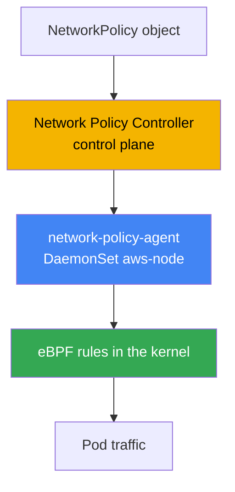
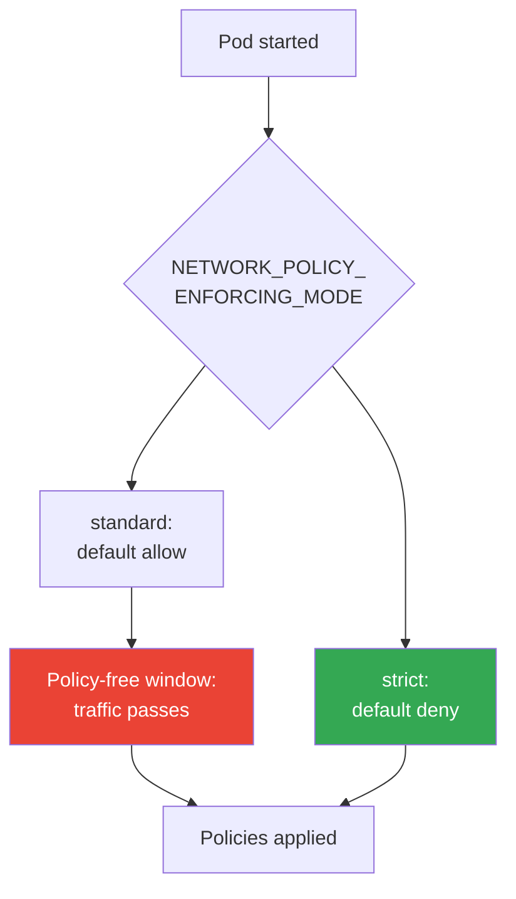
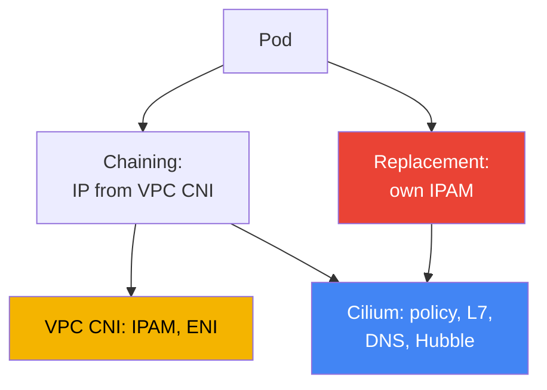

[Русская версия](ru.md) · [Versión en español](es.md) · [Version française](fr.md) · [Deutsche Version](de.md) · [ქართული ვერსია](ge.md) · [繁體中文版](tw.md) · [日本語版](jp.md)
# Chapter 30. NetworkPolicy in EKS: VPC CNI network policy and Cilium

> **What is next.** Chapters 26-29 showed how traffic enters the cluster from outside: NLB (Chapter 26),
> ALB (Chapter 27), Gateway API (Chapter 28), DNS and certificates (Chapter 29). Here the focus is on
> east-west traffic - isolating traffic between pods themselves through NetworkPolicy. An overview of
> alternative CNIs and how VPC CNI assigns IP addresses to pods is in Chapter 8; egress to the outside
> and traffic cost are in Chapter 31; multitenancy and policies through Kyverno and Gatekeeper are in
> Chapter 22 (that is admission, not NetworkPolicy). There is only one subject here: who and how in EKS
> actually blocks packets between pods.

## 30.1. "We applied a policy, but traffic still flows"

You know Kubernetes: NetworkPolicy is a standard object, `default deny` in a namespace closes all
ingress, and rules then open what is needed. In a fresh EKS cluster, an engineer does exactly what
they were taught for CKA: applies a denying policy and expects connectivity between pods to stop.

```bash
kubectl apply -f default-deny.yaml
kubectl get netpol
# NAME           POD-SELECTOR   AGE
# default-deny   <none>         10s
```

The policy is present and the selector is empty, so it applies to all pods in the namespace. By CKA
logic, a neighboring pod should no longer be able to reach the target. But the check shows the
opposite:

```bash
kubectl exec deploy/client -- curl -s -m 3 http://web.default.svc.cluster.local
# <html>... 200 OK - the connection succeeded although it should have been blocked
```

Traffic flows as though there were no policy. This is not a manifest bug or a typo in a selector.
The reason is that in EKS, by default, **no one enforces NetworkPolicy**. The object exists in the
API, but the base VPC CNI configuration has no component that turns it into rules on nodes. Until
this feature is enabled, VPC CNI simply ignores NetworkPolicy objects, and all connectivity in the
cluster remains allowed.

This is specific to EKS: a NetworkPolicy object is part of the Kubernetes API and can always be
created, but enforcement (who filters packets) is provided by the CNI, not the API server. In kind,
Minikube, or a cluster with Calico, an enforcer is already installed and you did not notice it on
CKA. In EKS, you must enable it deliberately.

## 30.2. Why an enforcer is needed and what VPC CNI network policy provides

NetworkPolicy is a declaration of intent: "only allow this ingress into this pod." Someone must
read that declaration and turn it into actual filters in the packet path. That is the job of the
**enforcer**, a part of the CNI. No enforcer means no filtering, no matter how many objects you
create.

VPC CNI has such an enforcer built in, but it is disabled by default. It consists of two parts:

- **Network Policy Controller** on the control plane. AWS operates it. The controller watches
  NetworkPolicy objects and pods, calculates which endpoints are allowed for each pod, and sends
  this information to nodes.
- **network-policy-agent** on every node, a separate `aws-network-policy-agent` container in the
  `aws-node` DaemonSet alongside the CNI itself. The agent programs rules through **eBPF** in the
  kernel and ensures that pod traffic complies with policies.



Enable the feature with the VPC CNI add-on flag, the `enableNetworkPolicy` parameter in the managed
add-on configuration. The value is specified as a string:

```json
{
    "enableNetworkPolicy": "true",
    "nodeAgent": {
        "healthProbeBindAddr": "8163",
        "metricsBindAddr": "8162"
    }
}
```

After it is enabled, the aws-node container receives the `--enable-network-policy=true` argument,
and the agent starts listening for metrics on port `8162` and health checks on `8163` (ports are
configurable since VPC CNI `v1.14.1`). The `enableNetworkPolicy` parameter itself has been
available since `v1.14.0-eksbuild.3`; for complete support for standard policies, keep VPC CNI at
version `1.21` or later. Nodes need Linux kernel `5.10` or later - current EKS-optimized AL2023
and Bottlerocket already have it.

What is operationally valuable here is that this is a **managed add-on**. AWS supports the
enforcer, it is updated together with the VPC CNI add-on, and it understands the **standard
Kubernetes NetworkPolicy**, the same object you wrote on CKA, without custom CRDs or retraining.

## 30.3. Policy application order at pod startup and the policy-free window

There is a subtle point that determines whether you have a security hole. When a pod starts, the
network-policy-agent configures its rules **in parallel** with pod provisioning. Until all policies
for a new pod are installed, its behavior is determined by the enforcement mode.

VPC CNI controls this with the `NETWORK_POLICY_ENFORCING_MODE` variable in the aws-node container:

- **standard** (the default): before policies are applied, the pod has *default allow*: all ingress
  and egress are allowed. There is a window between "the pod is already accepting traffic" and
  "the rules are installed" during which there is no filtering. For a newly started pod, this is a
  risk: it is more broadly accessible than intended until the agent catches up.
- **strict**: the pod starts with *default deny*, and permissions are added only afterward. There
  is no permissive window: until policies exist, nothing gets through.



Strictness costs convenience. In strict mode, a policy is needed **for every** endpoint a pod
contacts, including CoreDNS: forget to allow DNS and the pod cannot resolve names and fails at
startup. Therefore, enable strict mode deliberately, with a baseline set of policies for
infrastructure traffic (DNS first of all). Default deny does not apply to pods using host
networking.

Cilium solves the same problem with its own option: the strict initial-isolation mode is configured
separately (`policy-enforcement-mode`). The idea is the same: either tolerate the window so that
pods do not break, or close it at the cost of fully describing allowed traffic.

## 30.4. What VPC CNI network policy can do and what it lacks

The built-in enforcer covers exactly standard Kubernetes NetworkPolicy, and does it well: ingress
and egress, selection by `podSelector`, `namespaceSelector`, and `ipBlock`, and restrictions by
ports and protocols. This is enough for the overwhelming majority of microsegmentation tasks
("the frontend can reach only the backend", "only the application can access the database"), and
all of it is supported by AWS and updated as an add-on.

The boundaries begin where you need a layer above L3/L4:

- **No L7 rules.** You cannot write "allow only `GET /api`, but not `POST`" or select by an HTTP
  header, gRPC method, or Kafka topic. VPC CNI operates at the IP and port level.
- **No policies by DNS names.** You cannot say "egress is allowed to `api.stripe.com`". Only IP
  and CIDR through `ipBlock` are available, and external-service addresses change.
- **No Cilium cluster CRDs**: `CiliumNetworkPolicy` and `CiliumClusterwideNetworkPolicy`.
  Standard NetworkPolicy is always scoped to a namespace; there is no single "entire cluster"
  policy in this model (AdminNetworkPolicy is a separate subject in newer versions, but it is not
  a Cilium CRD).
- **No Hubble** or its observability. There is no flow map and no per-flow verdict such as "the
  packet was allowed or denied by this policy." Troubleshooting relies on agent logs and metrics,
  not a UI map.

If that is insufficient, the next step is Cilium. But first it is important to understand what you
get and what you pay for it.

## 30.5. Standard policies: default deny, podSelector, namespaceSelector, egress

You know the syntax from CKA: it does not change in EKS; the difference is only that someone now
enforces it. Keep the basic set in mind. Denying all ingress in a namespace is the foundation of
any segmentation:

```yaml
apiVersion: networking.k8s.io/v1
kind: NetworkPolicy
metadata:
  name: default-deny-ingress
  namespace: shop
spec:
  podSelector: {}          # all pods in the namespace
  policyTypes: ["Ingress"] # empty ingress = allow nothing
```

Allow by `podSelector`: allow into a pod with the `app: api` label only pods with the
`app: frontend` label from the same namespace:

```yaml
spec:
  podSelector:
    matchLabels: { app: api }
  ingress:
    - from:
        - podSelector:
            matchLabels: { app: frontend }
      ports:
        - { protocol: TCP, port: 8080 }
```

Allow by `namespaceSelector`: allow traffic only from a namespace with the `team: payments` label
(you must apply the label to the namespace in advance):

```yaml
  ingress:
    - from:
        - namespaceSelector:
            matchLabels: { team: payments }
```

Restrict egress: allow a pod to send traffic only to the backend and DNS. DNS is mandatory, or the
pod loses name resolution - this is the most common reason for "it broke after default deny
egress":

```yaml
spec:
  podSelector:
    matchLabels: { app: frontend }
  policyTypes: ["Egress"]
  egress:
    - to:
        - podSelector:
            matchLabels: { app: api }
    - to:                          # DNS to CoreDNS in kube-system
        - namespaceSelector:
            matchLabels: { kubernetes.io/metadata.name: kube-system }
      ports:
        - { protocol: UDP, port: 53 }
        - { protocol: TCP, port: 53 }
```

DNS is not the only infrastructure address that default deny egress breaks. Pod and namespace
selectors do not apply to link-local addresses, so open them through `ipBlock`. With default deny
egress, keep the mandatory exception list in mind: DNS to CoreDNS (UDP/TCP 53, already shown
above), the Pod Identity agent `169.254.170.23`, and, when needed, IMDS `169.254.169.254`. The
most painful loss is the Pod Identity agent: block egress to it, and the pod cannot receive
temporary role credentials and fails on its first AWS call (Chapter 17). Pods generally do not
need IMDS, so open it only where a pod actually accesses metadata (Chapter 19):

```yaml
  egress:
    - to:                          # Pod Identity agent - otherwise no AWS credentials (Chapter 17)
        - ipBlock: { cidr: 169.254.170.23/32 }
      ports:
        - { protocol: TCP, port: 80 }
    - to:                          # IMDS - only if a pod accesses metadata (Chapter 19)
        - ipBlock: { cidr: 169.254.169.254/32 }
      ports:
        - { protocol: TCP, port: 80 }
```

All of this works identically with VPC CNI network policy and Cilium: it is the standard API. The
difference appears only when standard API rules are no longer enough.

## 30.6. Cilium: chaining on top of VPC CNI and complete replacement

Cilium is installed in EKS in one of two modes, and they involve fundamentally different
responsibilities.

**CNI chaining on top of VPC CNI.** VPC CNI still assigns addresses to pods: IPAM, ENI, and the
entire IP plan remain its responsibility (Chapter 8). Cilium connects "on top": after VPC CNI has
configured the pod network, Cilium is invoked and attaches its eBPF programs to the created
interfaces, adding a **policy engine, L7 rules, DNS-name policies, and Hubble**. The IP-address
model does not change and VPC integrations remain. This is the gentlest path: AWS owns addressing,
and Cilium provides policies and observability.

**Complete VPC CNI replacement.** Cilium becomes the only CNI: the `aws-node` DaemonSet is
removed, and Cilium takes over IPAM completely. There are two options: **ENI mode** (Cilium
manages ENIs itself and assigns VPC addresses) or **overlay** (its own VXLAN overlay, with pod
addresses not taken from the VPC). This gives maximum control and the full Cilium feature set, but
the entire CNI lifecycle is now yours.



Both modes add `CiliumNetworkPolicy` and `CiliumClusterwideNetworkPolicy`, CRDs with L7 rules,
FQDN selection, and cluster-wide policies, plus Hubble for flow observability. Cilium also
enforces standard Kubernetes NetworkPolicy, so existing policies do not need to be rewritten.

## 30.7. The real cost of switching to Cilium and comparison table

Cilium is a powerful tool, but it is not a matter of "checking a box." The transition, especially
in replacement mode, changes the responsibility model, and you must accept that before migration,
not during an incident.

- **You own the CNI lifecycle.** In replacement mode, you operate the cluster network:
  configuration, IPAM mode, and Kubernetes-version compatibility are your responsibility.
- **Upgrades are no longer a managed add-on.** VPC CNI was upgraded as an EKS add-on supported by
  AWS; you upgrade Cilium yourself through Helm, plan maintenance windows, and verify
  compatibility.
- **Diagnosing network failures becomes more difficult.** A Cilium layer is added between a pod
  and the VPC (and in chaining, there are two CNIs at once). Investigating "why did the packet not
  arrive" requires understanding both the Cilium datapath and the VPC network.
- **Some AWS integrations no longer work out of the box.** AWS supports and covers scenarios with
  VPC CNI; Cilium as the CNI on cloud nodes is outside that support boundary, and some VPC CNI
  integrations must be handled independently.

The practical conclusion: do not change CNI just to check a box. If standard NetworkPolicy is
enough, stay with VPC CNI network policy. If you need L7 or DNS policies, start with chaining,
where AWS retains ownership of addressing. Use complete replacement only for an explicit
requirement, understanding its cost.

| Capability | VPC CNI network policy | Cilium | What Cilium costs you |
|---|---|---|---|
| Standard K8s NetworkPolicy | yes | yes | - |
| L7 rules (HTTP, gRPC) | no | yes | own policy engine, more complex troubleshooting |
| Policies by DNS names (FQDN) | no | yes | an extra layer in the datapath |
| Cluster-wide policies | no (namespace only) | CiliumClusterwidePolicy | new CRDs, team training |
| Flow observability | agent metrics and logs | Hubble, flow map | one more operational component |
| Update model | managed add-on, AWS support | Helm, your responsibility | upgrades and compatibility are yours |
| Pod IP addressing | VPC CNI | VPC CNI (chaining) or own IPAM | in replacement mode, ownership of IPAM |

## 30.8. How this is used in production

- **Start by enabling the enforcer.** Without `enableNetworkPolicy`, every NetworkPolicy is an
  empty object. The first step in a new cluster is enabling the add-on parameter and checking that
  the agent has started on every node.
- **Put default deny in every workload namespace.** Deny ingress (and then egress) by default,
  then selectively open what is needed. There is no segmentation without a baseline deny.
- **Allow DNS explicitly.** When restricting egress, first open UDP/TCP 53 to CoreDNS, or pods
  lose name resolution. Add the rule to a template instead of recalling it during an incident.
- **Use strict mode for a requirement, not by default.** Close the default-allow window with
  strict mode where justified, after describing infrastructure traffic in advance, including DNS.
- **Adopt Cilium based on need, not fashion.** If L7 or FQDN policies are needed, start with
  chaining while keeping IPAM with VPC CNI; choose complete replacement only for explicit
  requirements.
- **Version policies in Git.** NetworkPolicy is code just like a Deployment: keep policies in a
  repository and deploy them through GitOps (Chapter 44), rather than editing them manually in
  the cluster.

## 30.9. Mini-glossary

- **NetworkPolicy**: a standard Kubernetes object declaring allowed ingress and egress for pods;
  by itself, it blocks nothing without an enforcer.
- **enforcer**: a CNI component that turns NetworkPolicy into actual traffic filters; it is absent
  in EKS by default until enabled.
- **VPC CNI network policy**: enforcement built into VPC CNI: a Network Policy Controller on the
  control plane and a network-policy-agent on nodes that works through eBPF.
- **enableNetworkPolicy**: the VPC CNI managed add-on parameter that enables enforcement of
  standard NetworkPolicy.
- **NETWORK_POLICY_ENFORCING_MODE**: an aws-node variable: `standard` (default allow until
  policies are applied) or `strict` (default deny from the first second).
- **CNI chaining**: Cilium mode on top of VPC CNI: VPC CNI assigns IPs, while Cilium adds
  policies, L7, DNS rules, and Hubble.
- **CiliumNetworkPolicy / CiliumClusterwideNetworkPolicy**: Cilium CRDs with L7 and FQDN rules
  and cluster-wide scope.
- **Hubble**: Cilium's observability subsystem: a flow map and per-flow verdict, which VPC CNI
  network policy does not provide.

## 30.10. Chapter summary

- In EKS, a NetworkPolicy object can always be created, but nobody enforces it by default: VPC CNI
  without the enabled policy feature ignores it, and all east-west traffic is allowed.
- Enable enforcement with the `enableNetworkPolicy` parameter in the VPC CNI managed add-on; the
  Network Policy Controller runs on the control plane and network-policy-agent (eBPF) runs on
  nodes.
- This is a managed add-on supported by AWS that understands standard Kubernetes NetworkPolicy,
  using the same syntax as CKA without custom CRDs.
- Policies are applied in parallel during pod startup: `standard` leaves a default-allow window,
  while `strict` applies default deny immediately, but then a policy is required for every
  endpoint, including DNS.
- VPC CNI network policy has no L7 rules, DNS-name policies, Cilium cluster CRDs, or Hubble; it
  is usually enough for L3/L4 segmentation.
- Cilium can be connected in two modes: chaining on top of VPC CNI (VPC CNI assigns IPs, Cilium
  provides policies and Hubble) or complete replacement with its own IPAM (ENI mode or overlay).
- Cilium has a real cost: ownership of the CNI lifecycle, upgrades outside the managed add-on,
  harder diagnosis, and some AWS integrations no longer work out of the box.
- Selection rule: if standard NetworkPolicy is enough, use VPC CNI; if L7 or FQDN is required,
  use chaining; use complete replacement only for an explicit requirement.

## 30.11. How this helps in real work

During on-call work, the first question when investigating "the policy does not work" is whether
the enforcer is enabled at all. If `enableNetworkPolicy` is not set, every NetworkPolicy is
useless, so check this first, before investigating selectors. The second frequent incident is
"after default deny egress, the application stopped resolving names": almost always DNS to
CoreDNS was not allowed. The third is a pod failing to start in strict mode because there is no
policy for infrastructure traffic it needs.

When planning, make three decisions in advance. Whether to enable strict mode and which baseline
policy set (DNS first of all) will arrive before workloads. Whether L3/L4 is enough or L7 and FQDN
are required - this determines whether you stay with VPC CNI or move to Cilium. And if Cilium, in
which mode: chaining retains VPC CNI IPAM and AWS support, while replacement gives you the entire
CNI lifecycle.

## 30.12. Self-check questions

1. Why does an applied default deny not block traffic between pods in a fresh EKS cluster?
2. What is an enforcer, and why does a NetworkPolicy object by itself block nothing?
3. Which two components make up VPC CNI network policy, and where does each run?
4. Which add-on parameter enables enforcement, and which container appears in aws-node?
5. How do `standard` and `strict` modes in `NETWORK_POLICY_ENFORCING_MODE` differ?
6. What is the "policy-free window" during pod startup, and why is it dangerous?
7. Why must traffic to CoreDNS be explicitly allowed in strict mode in advance?
8. Which capabilities does VPC CNI network policy lack compared with Cilium?
9. How does Cilium in CNI chaining mode differ from complete VPC CNI replacement mode?
10. Who assigns pod IP addresses in chaining mode, and why is that important?
11. What makes up the real cost of switching to Cilium in replacement mode?
12. What rule is used to choose between VPC CNI network policy and Cilium?
13. Why use `CiliumClusterwideNetworkPolicy` when ordinary NetworkPolicy is bound to a namespace?

## Practice

Two course labs accompany this topic: [Lab 110 - NetworkPolicy in EKS: built-in VPC CNI network
policy](../../labs/110/README.MD) and [Lab 132 - Alternative CNI: Cilium in CNI chaining mode on
top of VPC CNI](../../labs/132/README.MD). Apart from them, everything is verified on a live
cluster. First, determine whether the enforcer is enabled at all and whether the policy agent has
started on the nodes:

```bash
kubectl get daemonset aws-node -n kube-system -o yaml | grep -A2 aws-network-policy-agent
kubectl get pods -n kube-system -l k8s-app=aws-node        # agent runs alongside CNI
aws eks describe-addon --cluster-name my-cluster \
  --addon-name vpc-cni --query "addon.configurationValues"  # look for enableNetworkPolicy
```

Next, reproduce the problem from 30.1 and check whether traffic is blocked. Start a pair of pods,
check connectivity before the policy, apply default deny, and check again:

```bash
kubectl run web --image=nginx --labels app=web --expose --port 80
kubectl run client --image=curlimages/curl -- sleep 3600
kubectl exec client -- curl -s -m 3 http://web         # before policy: succeeds
kubectl apply -f default-deny.yaml                      # podSelector: {}, Ingress only
kubectl get netpol
kubectl exec client -- curl -s -m 3 http://web         # after: should time out
```

If the connection still succeeds after default deny, the enforcer is not enabled; return to the
first check. Then add an allowing policy by `podSelector` and confirm that required traffic flows
again while unnecessary traffic remains blocked.

---
[Contents](../README.md) · [Chapter 29](../29/en.md) · [Chapter 31](../31/en.md)
