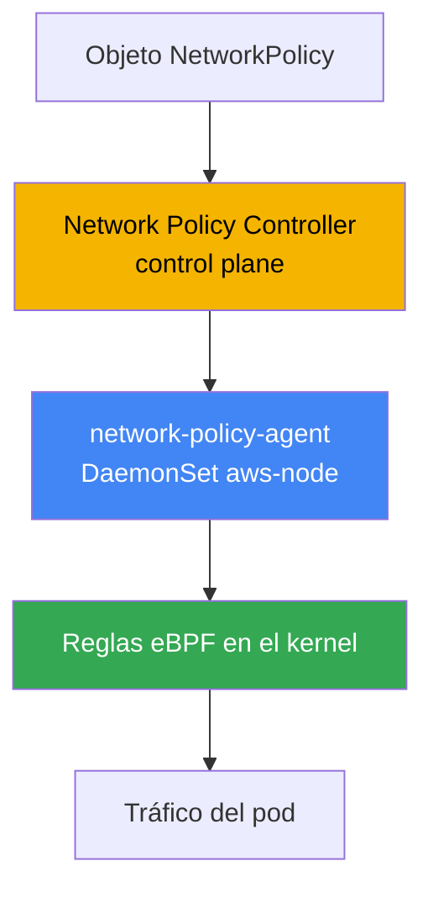
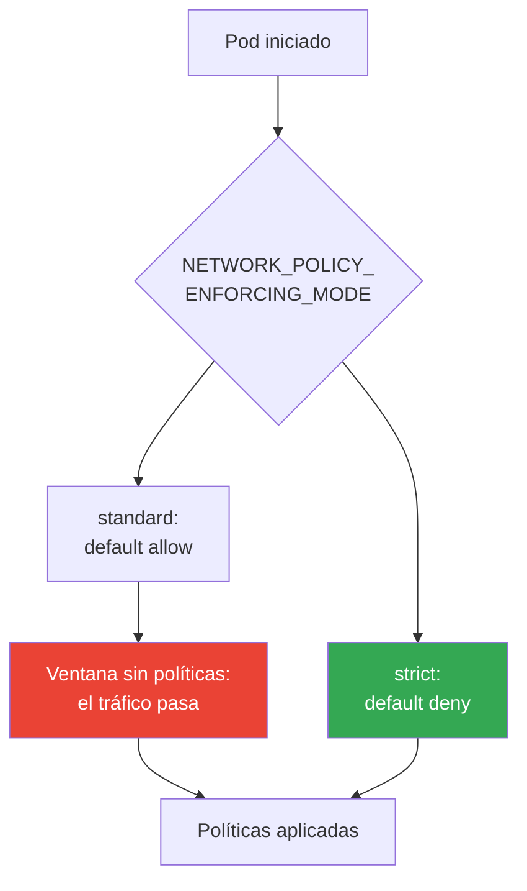
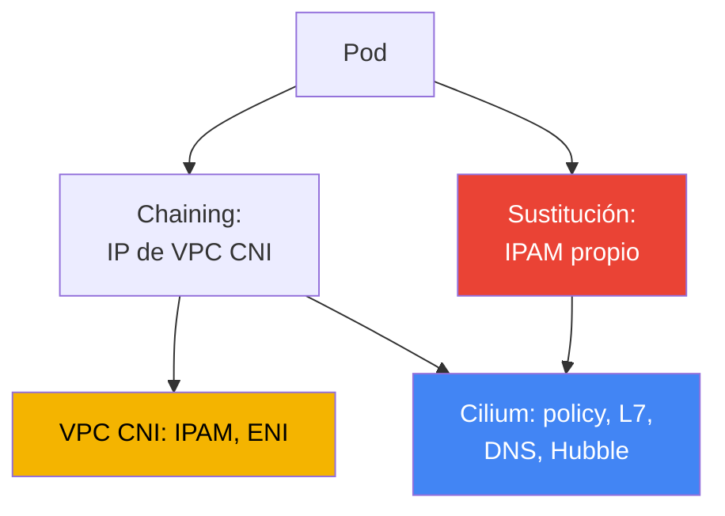

[Eng version](en.md) · [Русская версия](ru.md) · [Version française](fr.md) · [Deutsche Version](de.md) · [ქართული ვერსია](ge.md) · [繁體中文版](tw.md) · [日本語版](jp.md)
# Capítulo 30. NetworkPolicy en EKS: network policy de VPC CNI y Cilium

> **Qué sigue.** Los capítulos 26-29 mostraron cómo entra el tráfico al clúster desde fuera: NLB (capítulo 26),
> ALB (capítulo 27), Gateway API (capítulo 28), DNS y certificados (capítulo 29). Aquí se trata del tráfico
> east-west: el aislamiento entre los propios pods mediante NetworkPolicy. La descripción general de los CNI
> alternativos y de cómo VPC CNI asigna IP a los pods está en el capítulo 8; el egress al exterior y el coste del
> tráfico, en el capítulo 31; el multitenancy y las políticas mediante Kyverno y Gatekeeper, en el capítulo 22
> (esto es admission, no NetworkPolicy). Aquí solo hay una cuestión: quién y cómo bloquea realmente paquetes
> entre pods en EKS.

## 30.1. «Aplicamos la política, pero el tráfico sigue pasando»

Conoce Kubernetes: NetworkPolicy es un objeto estándar, `default deny` en un namespace cierra todo el
ingress, y las reglas abren después lo necesario. En un clúster EKS nuevo, el ingeniero hace exactamente lo
que aprendió en CKA: aplica una política denegatoria y espera que se interrumpa la conectividad entre pods.

```bash
kubectl apply -f default-deny.yaml
kubectl get netpol
# NAME           POD-SELECTOR   AGE
# default-deny   <none>         10s
```

La política está presente, el selector está vacío, así que selecciona todos los pods del namespace. Según la
lógica de CKA, un pod vecino ya no debería poder llegar al objetivo. Pero la comprobación muestra lo contrario:

```bash
kubectl exec deploy/client -- curl -s -m 3 http://web.default.svc.cluster.local
# <html>... 200 OK - la conexión pasó, aunque debería haberse bloqueado
```

El tráfico fluye como si la política no existiera. No es un error del manifiesto ni una errata en el selector.
La razón es que en EKS, de forma predeterminada, **nadie aplica NetworkPolicy**. El objeto existe en la API,
pero el componente que lo convertiría en reglas en los nodos no está en la configuración básica de VPC CNI.
Mientras no se active esta función, VPC CNI simplemente ignora los objetos NetworkPolicy: toda la conectividad
del clúster sigue permitida.

Esta es una particularidad de EKS: el objeto NetworkPolicy forma parte de la API de Kubernetes y siempre se
crea, pero el enforcement (quién filtra los paquetes) lo proporciona el CNI, no el servidor de API. En kind,
Minikube o un clúster con Calico el enforcer ya está instalado y no lo percibió en CKA. En EKS hay que activarlo
conscientemente.

## 30.2. Por qué se necesita un enforcer y qué ofrece VPC CNI network policy

NetworkPolicy es una declaración de lo deseado: «dejar entrar a este pod solo este ingress». Alguien debe leer
la declaración y convertirla en filtros reales en el camino de los paquetes. De ello se encarga el **enforcer**,
una parte del CNI. Sin enforcer no hay filtrado, por muchos objetos que cree.

VPC CNI incorpora tal enforcer, pero está desactivado de forma predeterminada. Consta de dos partes:

- **Network Policy Controller** en el control plane. AWS se encarga de él. El controlador vigila los objetos
  NetworkPolicy y los pods, calcula qué endpoint concretos están permitidos para cada pod y los distribuye a
  los nodos.
- **network-policy-agent** en cada nodo: un contenedor independiente, `aws-network-policy-agent`, en el
  DaemonSet `aws-node`, junto al propio CNI. El agente programa reglas mediante **eBPF** en el kernel y
  garantiza que el tráfico del pod cumpla las políticas.



La función se activa con la opción del addon VPC CNI, el parámetro `enableNetworkPolicy` de la configuración
del managed addon. El valor se proporciona como cadena:

```json
{
    "enableNetworkPolicy": "true",
    "nodeAgent": {
        "healthProbeBindAddr": "8163",
        "metricsBindAddr": "8162"
    }
}
```

Tras activarla, el contenedor aws-node recibe el argumento `--enable-network-policy=true`, y el agente empieza
a escuchar métricas en el puerto `8162` y comprobaciones de health en `8163` (puertos configurables desde VPC
CNI `v1.14.1`). El propio parámetro `enableNetworkPolicy` está disponible desde `v1.14.0-eksbuild.3`; para
soporte completo de las políticas estándar, mantenga VPC CNI al menos en `1.21`. Los nodos necesitan kernel
Linux `5.10` o posterior: los actuales AL2023 y Bottlerocket optimizados para EKS ya lo incluyen.

Lo valioso aquí desde el punto de vista operativo es que se trata de un **managed addon**. AWS mantiene el
enforcer, se actualiza junto al addon VPC CNI y entiende el **NetworkPolicy estándar de Kubernetes**: el mismo
objeto que escribió en CKA, sin CRD propios ni reaprendizaje.

## 30.3. Orden de aplicación de políticas al iniciar un pod y ventana sin políticas

Hay un detalle sutil que determina si tiene una brecha de seguridad. Cuando se inicia un pod, el
network-policy-agent configura sus reglas **en paralelo** con el provisioning del pod. Hasta que se despliegan
todas las políticas para el pod nuevo, su comportamiento depende del modo de enforcement.

VPC CNI controla esto mediante la variable `NETWORK_POLICY_ENFORCING_MODE` en el contenedor aws-node:

- **standard** (predeterminado): antes de que se apliquen las políticas, el pod tiene *default allow*: todo el
  ingress y egress está permitido. Hay una ventana entre «el pod ya acepta tráfico» y «las reglas están
  desplegadas» en la que no hay filtrado. Para un pod recién iniciado es un riesgo: queda accesible más de lo
  previsto hasta que el agente lo alcanza.
- **strict**: el pod se inicia con *default deny* y solo después se añaden permisos. No hay ventana de
  permeabilidad: mientras no haya políticas, no pasa nada.



La estrictitud se paga con comodidad. En modo strict se necesita una política **para cada** endpoint al que se
conecta el pod, incluido CoreDNS: si olvida permitir DNS, el pod no resuelve nombres y falla al iniciar. Por ello,
strict se activa de manera consciente, con un conjunto básico de políticas para el tráfico de infraestructura
(DNS ante todo). Para los pods con host networking no se aplica default deny.

Cilium resuelve lo mismo con su propia opción: el modo de aislamiento inicial estricto se configura por separado
(`policy-enforcement-mode`). La idea es común: o se tolera una ventana para que los pods no fallen, o se cierra
la ventana a cambio de describir por completo el tráfico permitido.

## 30.4. Qué puede hacer VPC CNI network policy y qué no

El enforcer integrado cubre exactamente el NetworkPolicy estándar de Kubernetes, y lo hace bien: ingress y
egress, selección mediante `podSelector`, `namespaceSelector`, `ipBlock`, restricción por puertos y protocolos.
Para la gran mayoría de las tareas de microsegmentación («el frontend solo llega al backend», «solo la aplicación
puede acceder a la base de datos») es suficiente, está bajo soporte de AWS y se actualiza como addon.

Los límites empiezan donde se requiere una capa por encima de L3/L4:

- **No hay reglas L7.** No se puede escribir «permitir solo `GET /api`, pero no `POST`» ni seleccionar por
  cabecera HTTP, método gRPC o tópico Kafka. VPC CNI trabaja en IP y puertos.
- **No hay políticas por nombres DNS.** No se puede decir «egress permitido a `api.stripe.com`». Solo IP y
  CIDR mediante `ipBlock`, y las direcciones de los servicios externos cambian.
- **No hay CRD de Cilium de clúster**, `CiliumNetworkPolicy` y `CiliumClusterwideNetworkPolicy`. El
  NetworkPolicy estándar siempre está vinculado a un namespace; en este modelo no existe una política única
  «para todo el clúster» (AdminNetworkPolicy es otra historia de versiones nuevas, pero no es una CRD de Cilium).
- **No hay Hubble** ni su observabilidad. No hay mapa de flujos ni verdict por flujo que indique «paquete
  permitido o rechazado por tal política». La depuración se hace con logs y métricas del agente, no con un mapa
  en UI.

Si esto no basta, el siguiente paso es Cilium. Pero antes es importante entender qué obtiene y qué paga por ello.

## 30.5. Políticas estándar: default deny, podSelector, namespaceSelector, egress

La sintaxis le resulta familiar de CKA: en EKS no cambia; cambia solo que ahora alguien la aplica. Conviene tener
presente el conjunto básico. La denegación total de ingreso en un namespace es el fundamento de toda segmentación:

```yaml
apiVersion: networking.k8s.io/v1
kind: NetworkPolicy
metadata:
  name: default-deny-ingress
  namespace: shop
spec:
  podSelector: {}          # todos los pods del namespace
  policyTypes: ["Ingress"] # ingress vacío = no permitir nada
```

Permiso por `podSelector`: permitir en el pod con la etiqueta `app: api` solo los pods con la etiqueta
`app: frontend` del mismo namespace:

```yaml
spec:
  podSelector:
    matchLabels: { app: api }
  ingress:
    - from:
        - podSelector:
            matchLabels: { app: frontend }
      ports:
        - { protocol: TCP, port: 8080 }
```

Permiso por `namespaceSelector`: admitir tráfico solo de namespaces con la etiqueta `team: payments` (la
debe colocar antes en el namespace):

```yaml
  ingress:
    - from:
        - namespaceSelector:
            matchLabels: { team: payments }
```

Restricción de egress: permitir al pod salidas solo al backend y a DNS. DNS es obligatorio; de otro modo, el pod
perderá la resolución, que es la causa más frecuente de «se rompió tras default deny egress»:

```yaml
spec:
  podSelector:
    matchLabels: { app: frontend }
  policyTypes: ["Egress"]
  egress:
    - to:
        - podSelector:
            matchLabels: { app: api }
    - to:                          # DNS a CoreDNS en kube-system
        - namespaceSelector:
            matchLabels: { kubernetes.io/metadata.name: kube-system }
      ports:
        - { protocol: UDP, port: 53 }
        - { protocol: TCP, port: 53 }
```

DNS no es la única dirección de infraestructura que rompe default deny egress. Los selectores de pods y
namespaces no se aplican a direcciones link-local, por lo que se abren mediante `ipBlock`. Con default deny
egress, tenga presente la lista obligatoria de excepciones: DNS a CoreDNS (UDP/TCP 53, ya mostrado arriba), el
agente Pod Identity `169.254.170.23` e, si hace falta, IMDS `169.254.169.254`. La ausencia más dolorosa es el
agente Pod Identity: se cerró el egress hacia él, el pod no obtiene las credenciales temporales del rol y falla en
la primera llamada a AWS (capítulo 17). Por regla general, los pods no necesitan IMDS y solo se abre cuando el pod
consulta realmente metadatos (capítulo 19):

```yaml
  egress:
    - to:                          # agente Pod Identity: sin él no hay credenciales de AWS (capítulo 17)
        - ipBlock: { cidr: 169.254.170.23/32 }
      ports:
        - { protocol: TCP, port: 80 }
    - to:                          # IMDS: solo si el pod consulta metadatos (capítulo 19)
        - ipBlock: { cidr: 169.254.169.254/32 }
      ports:
        - { protocol: TCP, port: 80 }
```

Todo esto funciona de forma idéntica en VPC CNI network policy y en Cilium: es la API estándar. La diferencia
solo aparece cuando las reglas de la API estándar dejan de bastar.

## 30.6. Cilium: chaining sobre VPC CNI y sustitución completa

Cilium se instala en EKS en uno de dos modos, y representan compromisos fundamentalmente distintos.

**CNI chaining sobre VPC CNI.** VPC CNI sigue asignando las direcciones a los pods: IPAM, ENI y todo el plan de
IP siguen siendo suyos (capítulo 8). Cilium se conecta «por encima»: después de que VPC CNI configura la red del
pod, se invoca Cilium, que instala sus programas eBPF en las interfaces creadas y añade **policy engine, reglas
L7, políticas por nombres DNS y Hubble**. El modelo de direcciones IP no cambia y las integraciones con VPC se
conservan. Es la ruta más suave: AWS se ocupa del direccionamiento; Cilium, de las políticas y la observabilidad.

**Sustitución completa de VPC CNI.** Cilium se convierte en el único CNI: se elimina el DaemonSet `aws-node` y
Cilium asume por completo el IPAM. Hay dos opciones: **modo ENI** (Cilium gestiona él mismo los ENI y distribuye
direcciones VPC) u **overlay** (su propio overlay sobre VXLAN, las direcciones de los pods no provienen de la
VPC). Máximo control y todo el conjunto de funciones de Cilium, pero todo el ciclo de vida del CNI pasa a ser suyo.



En ambos modos aparecen `CiliumNetworkPolicy` y `CiliumClusterwideNetworkPolicy`: CRD con reglas L7,
selección por FQDN y políticas de clúster, además de Hubble para la observabilidad de flujos. Cilium también
aplica el NetworkPolicy estándar de Kubernetes: no se reescriben las políticas antiguas.

## 30.7. El coste real de pasar a Cilium y tabla comparativa

Cilium es una herramienta potente, pero no consiste en «marcar una casilla». La transición, especialmente en
modo de sustitución, cambia el modelo de responsabilidad y hay que asumirlo antes de la migración, no durante
un incidente.

- **Usted posee el ciclo de vida del CNI.** En modo de sustitución, usted mantiene la red del clúster: la
  configuración, el modo IPAM y la compatibilidad con las versiones de Kubernetes son su responsabilidad.
- **Las actualizaciones dejan de ser un managed addon.** VPC CNI se actualizaba como un addon EKS bajo soporte
  de AWS; usted actualiza Cilium mediante Helm, planifica las ventanas y verifica la compatibilidad.
- **La diagnosis de fallos de red se complica.** Entre el pod y VPC se añade la capa Cilium (y en chaining, dos
  CNI a la vez). Analizar «por qué no llegó el paquete» exige conocer tanto el datapath de Cilium como la red VPC.
- **Parte de las integraciones de AWS deja de funcionar «sin más».** AWS soporta y cubre situaciones con VPC
  CNI; Cilium como CNI en nodos cloud queda fuera de su zona de soporte, y algunas integraciones con VPC CNI se
  deben resolver de forma independiente.

La conclusión práctica: no cambie el CNI por marcar una casilla. Si el NetworkPolicy estándar basta, manténgase
en VPC CNI network policy. Si necesita L7 o políticas DNS, comience con chaining, donde AWS conserva el
direccionamiento. Vaya a la sustitución completa solo ante un requisito explícito, comprendiendo el coste.

| Capacidad | VPC CNI network policy | Cilium | Lo que se paga por Cilium |
|---|---|---|---|
| NetworkPolicy estándar de K8s | sí | sí | - |
| Reglas L7 (HTTP, gRPC) | no | sí | policy engine propio, depuración más compleja |
| Políticas por nombres DNS (FQDN) | no | sí | una capa adicional en el datapath |
| Políticas de clúster | no (solo namespace) | CiliumClusterwidePolicy | CRD nuevos, formación del equipo |
| Observabilidad de flujos | métricas y logs del agente | Hubble, mapa de flujos | otro componente en operación |
| Modelo de actualización | managed addon, soporte de AWS | Helm, su responsabilidad | actualizaciones y compatibilidad a su cargo |
| Direccionamiento IP de pods | VPC CNI | VPC CNI (chaining) o IPAM propio | en sustitución: propiedad del IPAM |

## 30.8. Cómo se aplica en producción

- **Se empieza por activar el enforcer.** Sin `enableNetworkPolicy`, cualquier NetworkPolicy es un objeto vacío.
  El primer paso en un clúster nuevo es activar el parámetro del addon y comprobar que el agente se ha iniciado
  en todos los nodos.
- **Se coloca default deny en cada namespace de trabajo.** Se deniega ingress (y después egress) de forma
  predeterminada y se abre específicamente lo necesario. Sin una denegación base no hay segmentación.
- **Se permite DNS explícitamente.** Al restringir egress, primero se abre UDP/TCP 53 hacia CoreDNS; de otro
  modo los pods pierden resolución. Incluya la regla en la plantilla, no la recuerde durante un incidente.
- **strict mode se usa por requisito, no de forma predeterminada.** La ventana default-allow se cierra con
  strict cuando esté justificado, describiendo antes el tráfico de infraestructura, incluido DNS.
- **Cilium se introduce por necesidad, no por moda.** Si necesita L7 o políticas FQDN, empiece con chaining y
  conserve el IPAM en VPC CNI; tome la sustitución completa solo ante requisitos explícitos.
- **Las políticas se versionan en Git.** NetworkPolicy es código igual que Deployment: manténgalas en el
  repositorio y despliéguelas mediante GitOps (capítulo 44), no las edite manualmente en el clúster.

## 30.9. Miniglosario

- **NetworkPolicy**: objeto estándar de Kubernetes que declara el ingress y egress permitidos para los pods;
  por sí solo no bloquea nada sin un enforcer.
- **enforcer**: componente de CNI que convierte NetworkPolicy en filtros de tráfico reales; en EKS no está
  presente de forma predeterminada hasta que se activa.
- **VPC CNI network policy**: implementación de enforcement integrada en VPC CNI: Network Policy Controller
  en el control plane y network-policy-agent en los nodos, que trabaja mediante eBPF.
- **enableNetworkPolicy**: parámetro del managed addon VPC CNI que activa el enforcement de NetworkPolicy
  estándar.
- **NETWORK_POLICY_ENFORCING_MODE**: variable de aws-node: `standard` (default allow hasta aplicar las
  políticas) o `strict` (default deny desde el primer segundo).
- **CNI chaining**: modo de Cilium sobre VPC CNI: VPC CNI asigna las IP y Cilium añade políticas, L7, reglas DNS
  y Hubble.
- **CiliumNetworkPolicy / CiliumClusterwideNetworkPolicy**: CRD de Cilium con reglas L7 y FQDN, y ámbito de
  clúster.
- **Hubble**: subsistema de observabilidad de Cilium: mapa de flujos y verdict por flujo, que VPC CNI network
  policy no ofrece.

## 30.10. Resumen del capítulo

- En EKS el objeto NetworkPolicy siempre se crea, pero de forma predeterminada nadie lo aplica: VPC CNI, sin la
  función de políticas activada, lo ignora y todo el tráfico east-west está permitido.
- El enforcement se activa con el parámetro `enableNetworkPolicy` en el managed addon VPC CNI; funcionan
  Network Policy Controller en el control plane y network-policy-agent (eBPF) en los nodos.
- Es un managed addon bajo soporte de AWS que entiende el NetworkPolicy estándar de Kubernetes: la misma
  sintaxis que en CKA, sin CRD propios.
- Al iniciar un pod, las políticas se aplican en paralelo: `standard` da una ventana default-allow, mientras que
  `strict` aplica default-deny de inmediato, pero entonces se necesita una política para cada endpoint, incluido DNS.
- VPC CNI network policy no ofrece reglas L7, políticas por nombres DNS, CRD de Cilium de clúster ni Hubble;
  para segmentación L3/L4 suele ser suficiente.
- Cilium se conecta en dos modos: chaining sobre VPC CNI (IP de VPC CNI, Cilium proporciona políticas y Hubble)
  o sustitución completa con su propio IPAM (modo ENI u overlay).
- El coste de Cilium es real: propiedad del ciclo de vida del CNI, actualizaciones fuera del managed addon,
  diagnosis más compleja y parte de las integraciones AWS deja de funcionar «sin más».
- Regla de elección: si basta NetworkPolicy estándar, VPC CNI; si necesita L7 o FQDN, chaining; sustitución
  completa solo ante un requisito explícito.

## 30.11. Cómo sirve en el trabajo real

En guardia, la primera pregunta al investigar «la política no funciona» es si el enforcer está siquiera activo.
Si `enableNetworkPolicy` no está configurado, cualquier NetworkPolicy es inútil y esto se comprueba primero,
antes de analizar selectores. El segundo incidente frecuente es «después de default deny egress la aplicación
deja de resolver nombres»: casi siempre se olvidó abrir DNS a CoreDNS. El tercero es que un pod no inicia en
modo strict porque no existe una política para el tráfico de infraestructura que necesita.

En la planificación, tenga preparadas tres decisiones. Si activa strict mode y qué conjunto básico de políticas
(DNS primero) llegará antes que las cargas. Si L3/L4 es suficiente o necesita L7 y FQDN: de ello depende que
permanezca en VPC CNI o pase a Cilium. Y, si elige Cilium, en qué modo: chaining conserva IPAM y soporte AWS en
VPC CNI; la sustitución le entrega todo el ciclo de vida del CNI.

## 30.12. Preguntas de autoevaluación

1. ¿Por qué en un clúster EKS nuevo, un default deny aplicado no bloquea el tráfico entre pods?
2. ¿Qué es un enforcer y por qué el objeto NetworkPolicy por sí solo no filtra nada?
3. ¿De qué dos componentes consta VPC CNI network policy y dónde funciona cada uno?
4. ¿Con qué parámetro del addon se activa enforcement y qué contenedor aparece en aws-node?
5. ¿En qué se diferencian los modos `standard` y `strict` de `NETWORK_POLICY_ENFORCING_MODE`?
6. ¿Qué es la «ventana sin políticas» al iniciar un pod y por qué es peligrosa?
7. ¿Por qué es obligatorio permitir por adelantado el tráfico hacia CoreDNS en modo strict?
8. ¿Qué capacidades faltan en VPC CNI network policy frente a Cilium?
9. ¿En qué se diferencia Cilium en modo CNI chaining del modo de sustitución completa de VPC CNI?
10. ¿Quién asigna las direcciones IP a los pods en modo chaining y por qué es importante?
11. ¿Qué compone el coste real de pasar a Cilium en modo de sustitución?
12. ¿Con qué regla se elige entre VPC CNI network policy y Cilium?
13. ¿Para qué sirve `CiliumClusterwideNetworkPolicy` si el NetworkPolicy normal está vinculado a un namespace?

## Práctica

Este tema tiene dos laboratorios del curso: [laboratorio 110 - NetworkPolicy en EKS: network policy integrada de
VPC CNI](../../labs/110/README_ES.MD) y [laboratorio 132 - CNI alternativo: Cilium en modo CNI
chaining sobre VPC CNI](../../labs/132/README_ES.MD). Además, todo se verifica en un clúster activo. Primero,
compruebe si el enforcer está activo y si el agente de políticas se ha iniciado en los nodos:

```bash
kubectl get daemonset aws-node -n kube-system -o yaml | grep -A2 aws-network-policy-agent
kubectl get pods -n kube-system -l k8s-app=aws-node        # el agente se ejecuta junto al CNI
aws eks describe-addon --cluster-name my-cluster \
  --addon-name vpc-cni --query "addon.configurationValues"  # busque enableNetworkPolicy
```

Después reproduzca el problema de 30.1 y compruebe si se bloquea el tráfico. Cree un par de pods, compruebe la
conectividad antes de la política, aplique default deny y vuelva a comprobarlo:

```bash
kubectl run web --image=nginx --labels app=web --expose --port 80
kubectl run client --image=curlimages/curl -- sleep 3600
kubectl exec client -- curl -s -m 3 http://web         # antes de la política: pasa
kubectl apply -f default-deny.yaml                      # podSelector: {}, solo Ingress
kubectl get netpol
kubectl exec client -- curl -s -m 3 http://web         # después: debe interrumpirse por timeout
```

Si la conexión sigue pasando tras default deny, el enforcer no está activado: vuelva a la primera comprobación.
Después añada una política permisiva por `podSelector` y asegúrese de que el tráfico necesario vuelva a pasar,
mientras el no deseado permanece bloqueado.

---
[Índice](../README_ES.md) · [Capítulo 29](../29/es.md) · [Capítulo 31](../31/es.md)