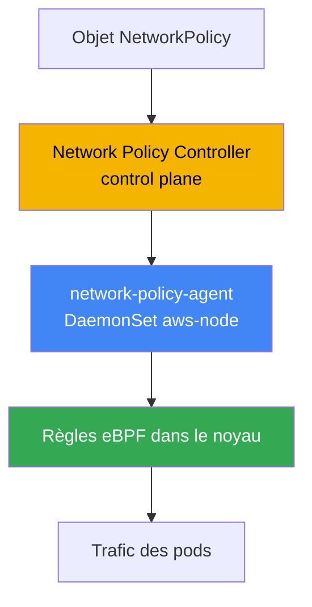
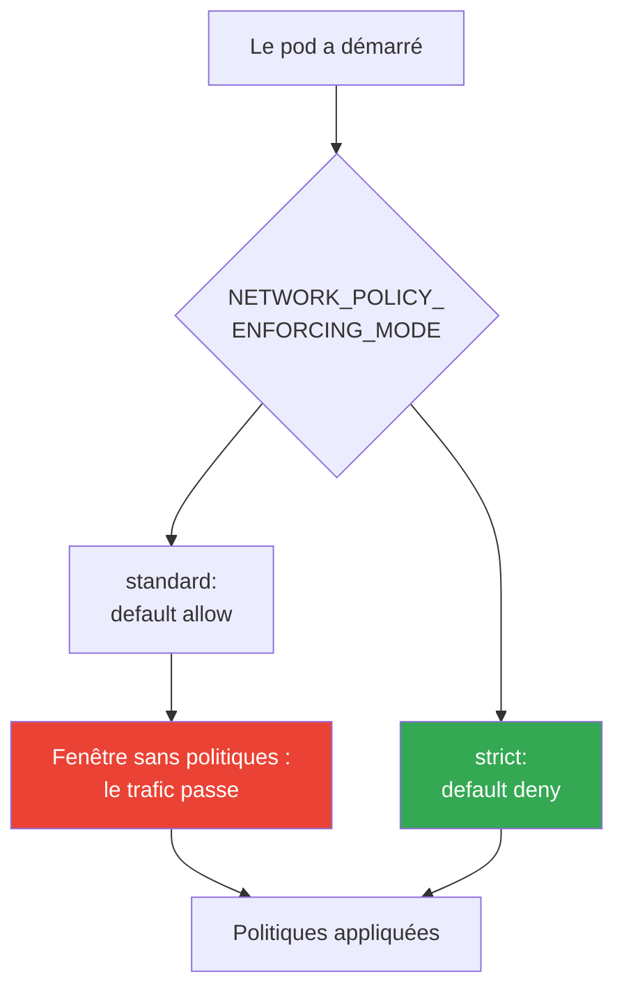
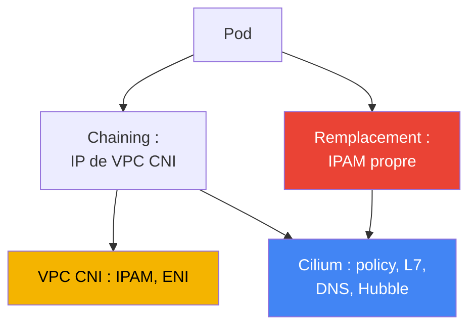

[Eng version](en.md) · [Русская версия](ru.md) · [Versión en español](es.md) · [Deutsche Version](de.md) · [ქართული ვერსია](ge.md) · [繁體中文版](tw.md) · [日本語版](jp.md)
# Chapitre 30. NetworkPolicy dans EKS : stratégie réseau VPC CNI et Cilium

> **La suite.** Les chapitres 26 à 29 ont montré comment le trafic entre dans le cluster depuis l'extérieur : NLB (chapitre 26),
> ALB (chapitre 27), Gateway API (chapitre 28), DNS et certificats (chapitre 29). Ici, il s'agit du trafic east-west, à savoir
> l'isolation du trafic entre les pods eux-mêmes à l'aide de NetworkPolicy. La présentation des CNI alternatifs et de la façon
> dont VPC CNI attribue les IP aux pods se trouve au chapitre 8 ; l'egress externe et le coût du trafic, au chapitre 31 ; le
> multitenancy et les politiques via Kyverno et Gatekeeper, au chapitre 22 (il s'agit d'admission, pas de NetworkPolicy). Ici,
> une seule question : qui bloque réellement les paquets entre pods dans EKS, et comment ?

## 30.1. « La politique a été appliquée, mais le trafic passe toujours »

Vous connaissez Kubernetes : NetworkPolicy est un objet standard, un `default deny` dans un namespace ferme tout
l'ingress, puis les règles ouvrent ce qui est nécessaire. Dans un cluster EKS récent, l'ingénieur fait exactement ce
qui a été enseigné pour la CKA : il applique une politique de refus et s'attend à ce que la connectivité entre les pods
soit rompue.

```bash
kubectl apply -f default-deny.yaml
kubectl get netpol
# NAME           POD-SELECTOR   AGE
# default-deny   <none>         10s
```

La politique est présente, le sélecteur est vide, elle cible donc tous les pods du namespace. Selon la logique de la
CKA, un pod voisin ne devrait déjà plus pouvoir joindre la cible. Pourtant, le test montre l'inverse :

```bash
kubectl exec deploy/client -- curl -s -m 3 http://web.default.svc.cluster.local
# <html>... 200 OK - la connexion a réussi alors qu'elle aurait dû être bloquée
```

Le trafic passe comme si la politique n'existait pas. Ce n'est ni un bug du manifeste ni une faute de frappe dans le
sélecteur. La raison est que, dans EKS par défaut, **personne n'applique les NetworkPolicy**. L'objet existe dans l'API,
mais le composant qui le transformerait en règles sur les nœuds n'est pas présent dans la configuration de base de VPC
CNI. Tant que cette fonctionnalité n'est pas activée, VPC CNI ignore tout simplement les objets NetworkPolicy, et toute
la connectivité du cluster reste autorisée.

C'est une spécificité d'EKS : l'objet NetworkPolicy fait partie de l'API Kubernetes et peut toujours être créé, mais
l'enforcement, c'est-à-dire le composant qui filtre les paquets, est fourni par le CNI, pas par l'API server. Dans kind,
Minikube ou un cluster avec Calico, un enforcer est déjà installé et vous ne l'avez pas remarqué durant la CKA. Dans EKS,
il faut l'activer explicitement.

## 30.2. Pourquoi un enforcer est nécessaire et ce qu'apporte la stratégie réseau VPC CNI

NetworkPolicy est une déclaration de l'état souhaité : « n'autoriser vers ce pod que cet ingress ». Quelqu'un doit lire
cette déclaration et la transformer en filtres réels sur le chemin des paquets. C'est le rôle de l'**enforcer**, une
partie du CNI. Sans enforcer, pas de filtrage, quel que soit le nombre d'objets créés.

VPC CNI intègre un tel enforcer, mais il est désactivé par défaut. Il se compose de deux parties :

- Le **Network Policy Controller** sur le control plane. AWS en assure l'exploitation. Le contrôleur surveille les
  objets NetworkPolicy et les pods, calcule les endpoint exacts autorisés pour chaque pod et diffuse ces informations
  aux nœuds.
- Le **network-policy-agent** sur chaque nœud, un conteneur distinct `aws-network-policy-agent` du DaemonSet
  `aws-node`, à côté du CNI lui-même. L'agent programme les règles au moyen d'**eBPF** dans le noyau et veille à ce que
  le trafic des pods respecte les politiques.



La fonctionnalité s'active avec le flag de l'addon VPC CNI, le paramètre `enableNetworkPolicy` dans la configuration
de l'addon géré. La valeur est fournie sous forme de chaîne :

```json
{
    "enableNetworkPolicy": "true",
    "nodeAgent": {
        "healthProbeBindAddr": "8163",
        "metricsBindAddr": "8162"
    }
}
```

Après l'activation, l'argument `--enable-network-policy=true` apparaît dans le conteneur aws-node, et l'agent commence
à écouter les métriques sur le port `8162` et les contrôles de santé sur `8163` (ports configurables depuis VPC CNI
`v1.14.1`). Le paramètre `enableNetworkPolicy` lui-même est disponible depuis `v1.14.0-eksbuild.3` ; pour une prise en
charge complète des politiques standard, utilisez VPC CNI en version `1.21` au minimum. Les nœuds doivent disposer d'un
noyau Linux `5.10` ou plus récent ; les images EKS optimisées AL2023 et Bottlerocket actuelles le proposent déjà.

Du point de vue de l'exploitation, sa valeur est qu'il s'agit d'un **addon géré**. AWS assure le support de l'enforcer,
il est mis à jour avec l'addon VPC CNI et comprend les **NetworkPolicy Kubernetes standard**, le même objet que vous avez
écrit pour la CKA, sans CRD propriétaire ni nouvel apprentissage.

## 30.3. Ordre d'application des politiques au démarrage d'un pod et fenêtre sans politiques

Il existe un point subtil qui détermine si vous avez une faille de sécurité. Lorsqu'un pod démarre, le
network-policy-agent configure ses règles **en parallèle** du provisioning du pod. Tant que toutes les politiques du
nouveau pod ne sont pas encore en place, son comportement est déterminé par le mode d'enforcement.

VPC CNI gère cela avec la variable `NETWORK_POLICY_ENFORCING_MODE` dans le conteneur aws-node :

- **standard** (par défaut) : avant l'application des politiques, le pod est en *default allow* : tout l'ingress et
  l'egress sont autorisés. Il existe une fenêtre entre « le pod accepte déjà le trafic » et « les règles sont en place »
  durant laquelle il n'y a aucun filtrage. C'est un risque pour un pod qui vient de démarrer : il est plus largement
  accessible que prévu jusqu'à ce que l'agent le rattrape.
- **strict** : le pod démarre avec *default deny*, puis les autorisations sont ajoutées. Il n'existe aucune fenêtre de
  perméabilité : tant qu'il n'y a pas de politiques, rien ne passe.



La rigueur se paie en confort. En mode strict, une politique est nécessaire **pour chaque** endpoint auquel le pod
accède, y compris CoreDNS : si vous oubliez d'autoriser DNS, le pod ne résout pas les noms et échoue au démarrage. C'est
pourquoi strict est activé délibérément, avec un ensemble de politiques de base pour le trafic d'infrastructure, DNS en
premier lieu. Le default deny ne s'applique pas aux pods avec host networking.

Cilium résout le même problème par sa propre option : le mode d'isolation initiale stricte est configuré séparément
(`policy-enforcement-mode`). L'idée est la même : accepter une fenêtre pour éviter de casser les pods, ou fermer cette
fenêtre au prix d'une description complète du trafic autorisé.

## 30.4. Ce que la stratégie réseau VPC CNI sait faire, et ce qui lui manque

L'enforcer intégré couvre exactement les NetworkPolicy Kubernetes standard, et le fait bien : ingress et egress,
sélection par `podSelector`, `namespaceSelector`, `ipBlock`, restriction par ports et protocoles. C'est suffisant pour
l'immense majorité des cas de microsegmentation (« le frontend ne joint que le backend », « seule l'application accède
à la base de données »), le tout avec le support AWS et des mises à jour sous forme d'addon.

Les limites apparaissent lorsqu'une couche au-dessus de L3/L4 est nécessaire :

- **Pas de règles L7.** Impossible d'écrire « autoriser uniquement `GET /api`, mais pas `POST` » ou de sélectionner sur
  un en-tête HTTP, une méthode gRPC ou un topic Kafka. VPC CNI fonctionne au niveau IP et des ports.
- **Pas de politiques par nom DNS.** Impossible de dire « egress autorisé vers `api.stripe.com` ». Seulement par IP et
  CIDR via `ipBlock`, alors que les adresses des services externes changent.
- **Pas de CRD Cilium à l'échelle du cluster**, `CiliumNetworkPolicy` et `CiliumClusterwideNetworkPolicy`. Une
  NetworkPolicy standard est toujours liée à un namespace ; dans ce modèle, il n'existe pas de politique unique « pour
  tout le cluster » (AdminNetworkPolicy est un sujet distinct des versions récentes, mais ce n'est pas une CRD Cilium).
- **Pas de Hubble** ni de son observabilité. Pas de carte des flux, pas de verdict par flux indiquant « paquet autorisé
  ou rejeté par telle politique ». Le dépannage s'effectue avec les logs et les métriques de l'agent, pas avec une carte
  dans une UI.

Si cela ne suffit pas, l'étape suivante est Cilium. Mais il est d'abord important de comprendre ce que vous obtenez et
ce que cela coûte.

## 30.5. Politiques standard : default deny, podSelector, namespaceSelector, egress

Vous connaissez la syntaxe depuis la CKA : elle ne change pas dans EKS, seul le fait que quelqu'un l'applique change.
Il faut garder à l'esprit l'ensemble de base. Le refus total de l'ingress dans un namespace est le fondement de toute
segmentation :

```yaml
apiVersion: networking.k8s.io/v1
kind: NetworkPolicy
metadata:
  name: default-deny-ingress
  namespace: shop
spec:
  podSelector: {}          # tous les pods du namespace
  policyTypes: ["Ingress"] # ingress vide = ne rien autoriser
```

Autorisation par `podSelector` : n'autoriser vers le pod portant le label `app: api` que les pods avec le label
`app: frontend` du même namespace :

```yaml
spec:
  podSelector:
    matchLabels: { app: api }
  ingress:
    - from:
        - podSelector:
            matchLabels: { app: frontend }
      ports:
        - { protocol: TCP, port: 8080 }
```

Autorisation par `namespaceSelector` : n'autoriser le trafic que depuis le namespace portant le label `team: payments`
(le label doit être ajouté au namespace à l'avance) :

```yaml
  ingress:
    - from:
        - namespaceSelector:
            matchLabels: { team: payments }
```

Restriction de l'egress : autoriser le pod à sortir uniquement vers le backend et DNS. DNS est obligatoire, sinon le
pod perd la résolution des noms, c'est la cause la plus fréquente de « tout a cassé après default deny egress » :

```yaml
spec:
  podSelector:
    matchLabels: { app: frontend }
  policyTypes: ["Egress"]
  egress:
    - to:
        - podSelector:
            matchLabels: { app: api }
    - to:                          # DNS vers CoreDNS dans kube-system
        - namespaceSelector:
            matchLabels: { kubernetes.io/metadata.name: kube-system }
      ports:
        - { protocol: UDP, port: 53 }
        - { protocol: TCP, port: 53 }
```

DNS n'est pas la seule adresse d'infrastructure que casse un default deny egress. Les sélecteurs de pods et de
namespaces ne s'appliquent pas aux adresses link-local, elles sont donc ouvertes via `ipBlock`. Avec default deny
egress, gardez en tête la liste obligatoire des exceptions : DNS vers CoreDNS (UDP/TCP 53, déjà présenté ci-dessus),
l'agent Pod Identity `169.254.170.23` et, si nécessaire, IMDS `169.254.169.254`. La panne la plus douloureuse est celle
de l'agent Pod Identity : si son egress est fermé, le pod n'obtient pas les credentials temporaires du rôle et échoue
dès le premier appel AWS (chapitre 17). Les pods n'ont généralement pas besoin d'IMDS ; ne l'ouvrez que lorsqu'un pod
accède réellement aux métadonnées (chapitre 19) :

```yaml
  egress:
    - to:                          # agent Pod Identity - sinon pas de credentials AWS (chapitre 17)
        - ipBlock: { cidr: 169.254.170.23/32 }
      ports:
        - { protocol: TCP, port: 80 }
    - to:                          # IMDS - uniquement si le pod accède aux métadonnées (chapitre 19)
        - ipBlock: { cidr: 169.254.169.254/32 }
      ports:
        - { protocol: TCP, port: 80 }
```

Tout cela fonctionne de façon identique avec la stratégie réseau VPC CNI et avec Cilium : c'est l'API standard. La
différence n'apparaît que lorsque les règles de l'API standard cessent de suffire.

## 30.6. Cilium : chaining au-dessus de VPC CNI et remplacement complet

Dans EKS, Cilium s'installe selon l'un de deux modes, qui impliquent des responsabilités fondamentalement différentes.

**CNI chaining au-dessus de VPC CNI.** VPC CNI continue d'attribuer les adresses aux pods ; IPAM, ENI et l'ensemble du
plan IP restent les siens (chapitre 8). Cilium se branche « au-dessus » : après que VPC CNI a configuré le réseau du
pod, Cilium est appelé et attache ses programmes eBPF aux interfaces créées, en ajoutant un **policy engine, des règles
L7, des politiques par nom DNS et Hubble**. Le modèle d'adressage IP ne change pas, les intégrations VPC restent en
place. C'est le chemin le moins intrusif : AWS gère l'adressage, Cilium gère les politiques et l'observabilité.

**Remplacement complet de VPC CNI.** Cilium devient l'unique CNI : le DaemonSet `aws-node` est supprimé, et Cilium prend
entièrement en charge IPAM. Deux options existent : le **mode ENI** (Cilium gère lui-même les ENI et distribue les
adresses VPC) ou l'**overlay** (son propre overlay sur VXLAN, avec des adresses de pods hors VPC). Vous obtenez le
maximum de contrôle et l'ensemble des fonctions Cilium, mais le cycle de vie complet du CNI devient aussi le vôtre.



Dans les deux modes, `CiliumNetworkPolicy` et `CiliumClusterwideNetworkPolicy` apparaissent : des CRD avec règles L7,
sélection par FQDN et politiques à l'échelle du cluster, ainsi que Hubble pour l'observabilité des flux. Cilium applique
aussi les NetworkPolicy Kubernetes standard, sans devoir réécrire les anciennes politiques.

## 30.7. Le coût réel du passage à Cilium et tableau comparatif

Cilium est un outil puissant, mais ce n'est pas une simple case à cocher. La transition, en particulier en mode de
remplacement, change le modèle de responsabilité. Il faut l'accepter avant la migration, non pendant un incident.

- **Vous possédez le cycle de vie du CNI.** En mode de remplacement, vous maintenez le réseau du cluster : la
  configuration, le mode IPAM et la compatibilité avec les versions de Kubernetes vous incombent.
- **Les mises à jour ne sont plus un addon géré.** VPC CNI était mis à jour comme addon EKS avec le support AWS ; vous
  mettez vous-même Cilium à niveau avec Helm, planifiez les fenêtres et vérifiez la compatibilité.
- **Le diagnostic des pannes réseau devient plus complexe.** Une couche Cilium s'ajoute entre le pod et le VPC (et deux
  CNI sont présents en chaining). Comprendre « pourquoi le paquet n'est pas arrivé » demande de connaître à la fois le
  datapath Cilium et le réseau VPC.
- **Certaines intégrations AWS cessent de fonctionner immédiatement.** AWS prend en charge les situations sur VPC CNI ;
  Cilium comme CNI sur des nœuds cloud est hors de son périmètre de support, et certaines dépendances à VPC CNI doivent
  être résolues de manière autonome.

Conclusion pratique : ne changez pas de CNI pour cocher une case. Si la NetworkPolicy standard suffit, restez avec la
stratégie réseau VPC CNI. Si vous avez besoin de règles L7 ou DNS, commencez par le chaining, où l'adressage reste géré
par AWS. N'adoptez le remplacement complet que face à une exigence explicite, en comprenant son coût.

| Capacité | Stratégie réseau VPC CNI | Cilium | Coût de Cilium |
|---|---|---|---|
| NetworkPolicy K8s standard | oui | oui | - |
| Règles L7 (HTTP, gRPC) | non | oui | policy engine propre, dépannage plus complexe |
| Politiques par nom DNS (FQDN) | non | oui | couche supplémentaire dans le datapath |
| Politiques à l'échelle du cluster | non (namespace seulement) | CiliumClusterwidePolicy | nouvelles CRD, formation de l'équipe |
| Observabilité des flux | métriques et logs de l'agent | Hubble, carte des flux | un composant de plus à exploiter |
| Modèle de mise à jour | addon géré, support AWS | Helm, votre responsabilité | mises à niveau et compatibilité à votre charge |
| Adressage IP des pods | VPC CNI | VPC CNI (chaining) ou IPAM propre | en remplacement : gestion d'IPAM |

## 30.8. Application en production

- **Commencez par activer l'enforcer.** Sans `enableNetworkPolicy`, toute NetworkPolicy est un objet vide. Dans un
  nouveau cluster, activez d'abord le paramètre de l'addon et vérifiez que l'agent est lancé sur tous les nœuds.
- **Placez default deny dans chaque namespace de travail.** Refusez l'ingress, puis l'egress, par défaut et ouvrez
  précisément ce qui est nécessaire par-dessus. Sans deny de base, il n'y a pas de segmentation.
- **Autorisez explicitement DNS.** Lorsque vous restreignez l'egress, ouvrez d'abord UDP/TCP 53 vers CoreDNS, sinon les
  pods perdent la résolution. Ajoutez cette règle au modèle, ne vous en souvenez pas durant un incident.
- **Réservez strict mode aux exigences spécifiques, pas comme défaut.** Fermez la fenêtre default-allow avec strict
  lorsqu'elle est justifiée, après avoir défini à l'avance le trafic d'infrastructure, DNS inclus.
- **Introduisez Cilium par besoin, non par effet de mode.** Si vous avez besoin de politiques L7 ou FQDN, commencez par
  chaining en gardant IPAM sur VPC CNI ; n'optez pour le remplacement complet qu'en réponse à des exigences explicites.
- **Versionnez les politiques dans Git.** Une NetworkPolicy est du code comme un Deployment : conservez-la dans le
  dépôt et déployez-la via GitOps (chapitre 44), au lieu de la modifier à la main dans le cluster.

## 30.9. Mini-glossaire

- **NetworkPolicy** : objet Kubernetes standard déclarant l'ingress et l'egress autorisés pour les pods ; seul, il ne
  bloque rien sans enforcer.
- **enforcer** : composant CNI qui transforme une NetworkPolicy en filtres réels de trafic ; absent d'EKS par défaut
  tant qu'il n'est pas activé.
- **Stratégie réseau VPC CNI** : implémentation d'enforcement intégrée à VPC CNI : Network Policy Controller sur le
  control plane et network-policy-agent sur les nœuds, fonctionnant via eBPF.
- **enableNetworkPolicy** : paramètre de l'addon géré VPC CNI qui active l'enforcement des NetworkPolicy standard.
- **NETWORK_POLICY_ENFORCING_MODE** : variable de aws-node : `standard` (default allow jusqu'à l'application des
  politiques) ou `strict` (default deny dès la première seconde).
- **CNI chaining** : mode Cilium au-dessus de VPC CNI : VPC CNI attribue les IP, Cilium ajoute les politiques, L7, les
  règles DNS et Hubble.
- **CiliumNetworkPolicy / CiliumClusterwideNetworkPolicy** : CRD Cilium avec règles L7 et FQDN ainsi qu'une portée à
  l'échelle du cluster.
- **Hubble** : sous-système d'observabilité Cilium : carte des flux et verdict par flux, ce que la stratégie réseau VPC
  CNI ne fournit pas.

## 30.10. Résumé du chapitre

- Dans EKS, l'objet NetworkPolicy est toujours créé, mais personne ne l'applique par défaut : VPC CNI, sans la
  fonctionnalité de politique activée, l'ignore et tout le trafic east-west est autorisé.
- L'enforcement s'active avec `enableNetworkPolicy` dans l'addon géré VPC CNI ; le Network Policy Controller fonctionne
  sur le control plane et le network-policy-agent (eBPF) sur les nœuds.
- Il s'agit d'un addon géré avec le support AWS qui comprend les NetworkPolicy Kubernetes standard : la même syntaxe que
  pour la CKA, sans CRD propriétaire.
- Au démarrage d'un pod, les politiques s'appliquent en parallèle : `standard` offre une fenêtre default-allow, tandis
  que `strict` applique immédiatement default-deny, mais exige alors une politique pour chaque endpoint, DNS inclus.
- La stratégie réseau VPC CNI ne gère ni les règles L7, ni les politiques par nom DNS, ni les CRD Cilium à l'échelle du
  cluster, ni Hubble ; cela suffit généralement pour une segmentation L3/L4.
- Cilium se connecte selon deux modes : chaining au-dessus de VPC CNI (IP fournies par VPC CNI, Cilium fournit les
  politiques et Hubble) ou remplacement complet avec son propre IPAM (mode ENI ou overlay).
- Le coût de Cilium est réel : vous gérez le cycle de vie du CNI, les mises à niveau hors addon géré, le diagnostic est
  plus complexe, et certaines intégrations AWS cessent de fonctionner immédiatement.
- Règle de choix : si la NetworkPolicy standard suffit, VPC CNI ; si L7 ou FQDN sont nécessaires, chaining ; le
  remplacement complet, uniquement pour une exigence explicite.

## 30.11. Utilité dans le travail réel

En astreinte, la première question lorsqu'une « politique ne fonctionne pas » est de savoir si l'enforcer est activé.
Si `enableNetworkPolicy` n'est pas défini, toute NetworkPolicy est inutile, et c'est ce qui est vérifié en premier,
avant d'analyser les sélecteurs. Le deuxième incident fréquent est : « après default deny egress, l'application ne
résout plus les noms » ; on a presque toujours oublié d'ouvrir DNS vers CoreDNS. Le troisième : le pod ne démarre pas en
mode strict car il n'a pas de politique pour le trafic d'infrastructure dont il a besoin.

Lors de la planification, préparez trois décisions. Déterminez si vous activez strict mode et quel ensemble de
politiques de base, DNS en premier lieu, arrivera avant les charges. Décidez si L3/L4 suffit ou si L7 et FQDN sont
nécessaires, car cela détermine si vous restez sur VPC CNI ou passez à Cilium. Enfin, si Cilium est retenu, choisissez
son mode : chaining conserve IPAM et le support AWS sur VPC CNI ; le remplacement vous confie le cycle de vie entier du
CNI.

## 30.12. Questions d'auto-évaluation

1. Pourquoi un default deny appliqué dans un cluster EKS récent ne bloque-t-il pas le trafic entre pods ?
2. Qu'est-ce qu'un enforcer et pourquoi l'objet NetworkPolicy ne filtre-t-il rien sans lui ?
3. De quels deux composants se compose la stratégie réseau VPC CNI et où chacun fonctionne-t-il ?
4. Quel paramètre d'addon active l'enforcement et quel conteneur apparaît dans aws-node ?
5. Quelle différence existe-t-il entre les modes `standard` et `strict` de `NETWORK_POLICY_ENFORCING_MODE` ?
6. Qu'est-ce que la « fenêtre sans politiques » au démarrage d'un pod et pourquoi est-elle dangereuse ?
7. Pourquoi faut-il autoriser à l'avance le trafic vers CoreDNS en mode strict ?
8. Quelles fonctionnalités de la stratégie réseau VPC CNI sont absentes par rapport à Cilium ?
9. Quelle différence existe-t-il entre Cilium en mode CNI chaining et le remplacement complet de VPC CNI ?
10. Qui attribue les adresses IP aux pods en mode chaining et pourquoi est-ce important ?
11. De quoi se compose le coût réel du passage à Cilium en mode remplacement ?
12. Quelle règle permet de choisir entre la stratégie réseau VPC CNI et Cilium ?
13. À quoi sert `CiliumClusterwideNetworkPolicy` alors qu'une NetworkPolicy ordinaire est liée à un namespace ?

## Pratique

Deux labs du cours accompagnent ce sujet : [lab 110 : NetworkPolicy dans EKS : stratégie réseau VPC CNI
intégrée](../../labs/110/README_FR.MD) et [lab 132 : CNI alternatif : Cilium en mode CNI chaining au-dessus de VPC
CNI](../../labs/132/README_FR.MD). En dehors de ces labs, tout se vérifie sur un cluster actif. Commencez par déterminer
si l'enforcer est activé et si l'agent de politique est lancé sur les nœuds :

```bash
kubectl get daemonset aws-node -n kube-system -o yaml | grep -A2 aws-network-policy-agent
kubectl get pods -n kube-system -l k8s-app=aws-node        # l'agent est à côté du CNI
aws eks describe-addon --cluster-name my-cluster \
  --addon-name vpc-cni --query "addon.configurationValues"  # cherchez enableNetworkPolicy
```

Reproduisez ensuite le problème de la section 30.1 et vérifiez si le trafic est filtré. Lancez une paire de pods,
testez la connectivité avant la politique, appliquez default deny, puis testez à nouveau :

```bash
kubectl run web --image=nginx --labels app=web --expose --port 80
kubectl run client --image=curlimages/curl -- sleep 3600
kubectl exec client -- curl -s -m 3 http://web         # avant la politique : passe
kubectl apply -f default-deny.yaml                      # podSelector: {}, Ingress uniquement
kubectl get netpol
kubectl exec client -- curl -s -m 3 http://web         # après : devrait expirer
```

Si la connexion passe encore après default deny, l'enforcer n'est pas activé : revenez au premier contrôle. Ajoutez
ensuite une politique d'autorisation par `podSelector` et vérifiez que le trafic nécessaire passe de nouveau, tandis que
le trafic superflu reste bloqué.

---
[Table des matières](../README_FR.md) · [Chapitre 29](../29/fr.md) · [Chapitre 31](../31/fr.md)
