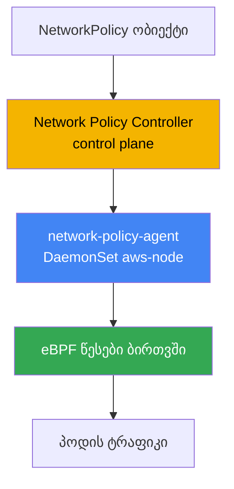
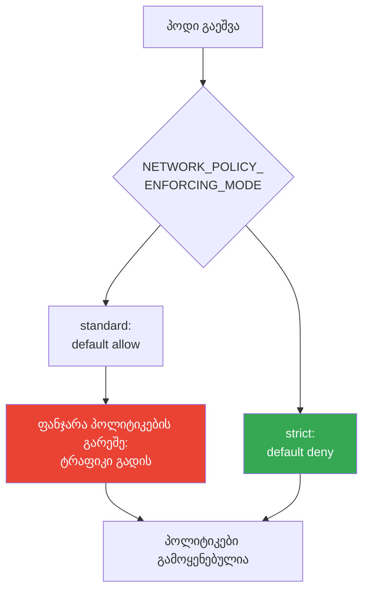
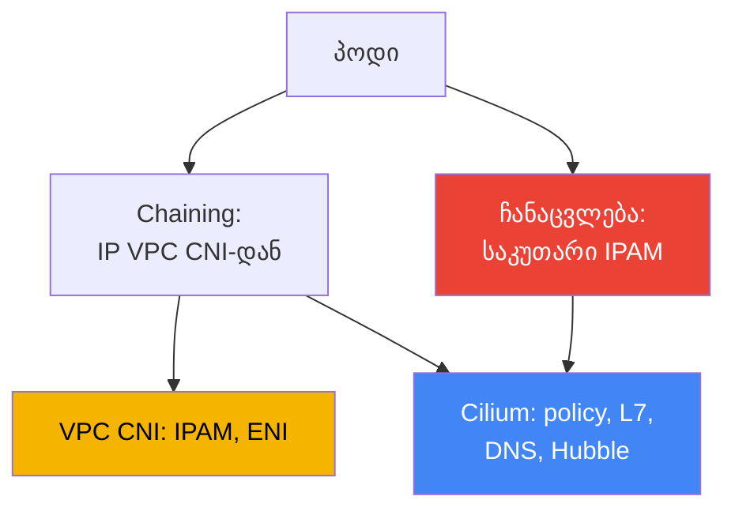

[რუსული ვერსია](ru.md) · [Eng version](en.md) · [Versión en español](es.md) · [Version française](fr.md) · [Deutsche Version](de.md) · [繁體中文版](tw.md) · [日本語版](jp.md)
# თავი 30. NetworkPolicy EKS-ში: VPC CNI network policy და Cilium

> **რა არის შემდეგ.** 26-29-ე თავებმა აჩვენა, როგორ შედის ტრაფიკი კლასტერში გარედან: NLB (თავი 26),
> ALB (თავი 27), Gateway API (თავი 28), DNS და სერტიფიკატები (თავი 29). აქ საუბარია
> east-west ტრაფიკზე - თავად პოდებს შორის ტრაფიკის იზოლაციაზე NetworkPolicy-ის მეშვეობით. ალტერნატიული
> CNI-ების მიმოხილვა და ის, თუ როგორ ანიჭებს VPC CNI პოდებს IP-მისამართებს, მოცემულია მე-8 თავში; გარე egress
> და ტრაფიკის ღირებულება - 31-ე თავში; მულტიტენანტობა და პოლიტიკები Kyverno-სა და Gatekeeper-ის მეშვეობით -
> 22-ე თავში (ეს admission-ია და არა NetworkPolicy). აქ მხოლოდ ერთი საკითხია: ვინ და როგორ ბლოკავს
> EKS-ში პოდებს შორის პაკეტებს რეალურად.

## 30.1. „პოლიტიკა გამოვიყენეთ, ტრაფიკი კი მაინც გადის“

Kubernetes თქვენ იცით: NetworkPolicy სტანდარტული ობიექტია, namespace-ში `default deny`
მთელ ingress-ს კეტავს, შემდეგ კი წესები საჭირო წვდომას ხსნის. ახალ EKS კლასტერში ინჟინერი
ზუსტად იმას აკეთებს, რაც CKA-ზე ასწავლეს: ამკრძალავ პოლიტიკას იყენებს და ელოდება, რომ
პოდებს შორის კავშირი გაწყდება.

```bash
kubectl apply -f default-deny.yaml
kubectl get netpol
# NAME           POD-SELECTOR   AGE
# default-deny   <none>         10s
```

პოლიტიკა ადგილზეა, სელექტორი ცარიელია - ესე იგი, namespace-ის ყველა პოდს ემთხვევა. CKA-ის
ლოგიკით, მეზობელი პოდი მიზნობრივ პოდს უკვე ვეღარ უნდა უკავშირდებოდეს. მაგრამ შემოწმება საპირისპიროს აჩვენებს:

```bash
kubectl exec deploy/client -- curl -s -m 3 http://web.default.svc.cluster.local
# <html>... 200 OK - კავშირი შედგა, თუმცა დაბლოკილი უნდა ყოფილიყო
```

ტრაფიკი ისე გადის, თითქოს პოლიტიკა არ არსებობდეს. ეს არც მანიფესტის ბაგია და არც სელექტორში დაშვებული
შეცდომა. მიზეზი ის არის, რომ EKS-ში ნაგულისხმევად **NetworkPolicy-ს არავინ აღასრულებს**. ობიექტი API-ში
არის, მაგრამ VPC CNI-ის საბაზისო კონფიგურაციაში არ არის კომპონენტი, რომელიც მას ნოდებზე წესებად
გარდაქმნიდა. სანამ ეს ფუნქცია არ ჩაირთვება, VPC CNI NetworkPolicy-ის ობიექტებს უბრალოდ უგულებელყოფს -
კლასტერში ყველა კავშირი დაშვებული რჩება.

ეს EKS-ის თავისებურებაა: NetworkPolicy ობიექტი Kubernetes API-ის ნაწილია და ყოველთვის იქმნება, მაგრამ
enforcement-ს (ვინ ჭრის პაკეტებს) CNI უზრუნველყოფს და არა API server. kind-ში, Minikube-ში ან Calico-ს
მქონე კლასტერში enforcer უკვე დაყენებულია და CKA-ზე მას ვერ ამჩნევდით. EKS-ში ის გააზრებულად უნდა ჩართოთ.

## 30.2. რატომ არის საჭირო enforcer და რას გვაძლევს VPC CNI network policy

NetworkPolicy სასურველი მდგომარეობის დეკლარაციაა: „ამ პოდში მხოლოდ ასეთი ingress დაუშვი“. ვიღაცამ ეს
დეკლარაცია უნდა წაიკითხოს და პაკეტების გზაზე რეალურ ფილტრებად გარდაქმნას. ამას აკეთებს
**enforcer** - CNI-ის ნაწილი. თუ enforcer არ არის, ფილტრაციაც არ არის, რამდენი ობიექტიც არ უნდა შექმნათ.

VPC CNI-ში ასეთი enforcer ჩაშენებულია, თუმცა ნაგულისხმევად გამორთულია. ის ორი ნაწილისგან შედგება:

- **Network Policy Controller** control plane-ზე. მას AWS მართავს. კონტროლერი აკვირდება
  NetworkPolicy ობიექტებსა და პოდებს, ითვლის, კონკრეტულად რომელი endpoint-ებია დაშვებული თითოეული პოდისთვის
  და ამ ინფორმაციას ნოდებზე აგზავნის.
- **network-policy-agent** თითოეულ ნოდზე - ცალკე კონტეინერი `aws-network-policy-agent`
  DaemonSet `aws-node`-ში, თავად CNI-ის გვერდით. აგენტი ბირთვში წესებს **eBPF**-ის მეშვეობით
  აპროგრამებს და აკონტროლებს, რომ პოდის ტრაფიკი პოლიტიკებს შეესაბამებოდეს.



ფუნქცია VPC CNI addon-ის ალმით - managed addon-ის კონფიგურაციაში `enableNetworkPolicy`
პარამეტრით ირთვება. მნიშვნელობა სტრიქონის სახით მიეთითება:

```json
{
    "enableNetworkPolicy": "true",
    "nodeAgent": {
        "healthProbeBindAddr": "8163",
        "metricsBindAddr": "8162"
    }
}
```

ჩართვის შემდეგ aws-node კონტეინერში ჩნდება არგუმენტი `--enable-network-policy=true`, აგენტი კი
მეტრიკების მოსმენას `8162` პორტზე და health შემოწმებების მოსმენას `8163` პორტზე იწყებს (პორტები
კონფიგურირებადია VPC CNI `v1.14.1` ვერსიიდან). თავად `enableNetworkPolicy` პარამეტრი ხელმისაწვდომია
`v1.14.0-eksbuild.3`-დან; სტანდარტული პოლიტიკების სრულფასოვანი მხარდაჭერისთვის გამოიყენეთ სულ მცირე
VPC CNI `1.21`. ნოდებს Linux `5.10` ან უფრო ახალი ბირთვი სჭირდება - EKS-ისთვის ოპტიმიზებულ აქტუალურ
AL2023-სა და Bottlerocket-ში ის უკვე არის.

საექსპლუატაციო თვალსაზრისით აქ ფასეული ისაა, რომ ეს **managed addon**-ია. Enforcer-ს თავად AWS
უჭერს მხარს, ის VPC CNI addon-თან ერთად ახლდება და ესმის **სტანდარტული Kubernetes NetworkPolicy** -
იგივე ობიექტი, რომელსაც CKA-ზე წერდით, საკუთარი CRD-ების და თავიდან სწავლის გარეშე.

## 30.3. პოდის გაშვებისას პოლიტიკების გამოყენების რიგი და ფანჯარა პოლიტიკების გარეშე

ეს ნიუანსი განსაზღვრავს, გექნებათ თუ არა უსაფრთხოების ხვრელი. პოდის გაშვებისას network-policy-agent
მის წესებს პოდის provisioning-ის **პარალელურად** აწყობს. სანამ ახალი პოდისთვის ყველა პოლიტიკა ჯერ კიდევ
არ არის განაწილებული, მის ქცევას enforcement რეჟიმი განსაზღვრავს.

VPC CNI ამას aws-node კონტეინერში `NETWORK_POLICY_ENFORCING_MODE` ცვლადით მართავს:

- **standard** (ნაგულისხმევი) - პოლიტიკების გამოყენებამდე პოდზე მოქმედებს *default allow*:
  მთელი ingress და egress დაშვებულია. „პოდი უკვე იღებს ტრაფიკს“ და „წესები განაწილებულია“ მომენტებს
  შორის არსებობს ფანჯარა, რომელშიც ფილტრაცია არ არის. ახლად გაშვებული პოდისთვის ეს რისკია: სანამ
  აგენტი დაეწევა, პოდი იმაზე ფართოდ არის ხელმისაწვდომი, ვიდრე დაგეგმილი იყო.
- **strict** - პოდი *default deny*-ით იწყებს მუშაობას და მხოლოდ ამის შემდეგ ემატება ნებართვები.
  გამტარობის ფანჯარა არ არსებობს: სანამ პოლიტიკები არ არის, არაფერი გადის.



სიმკაცრის საფასური მოხერხებულობაა. strict რეჟიმში პოლიტიკა საჭიროა **თითოეული** endpoint-ისთვის,
რომელსაც პოდი უკავშირდება, CoreDNS-ის ჩათვლით: თუ DNS-ის დაშვება დაგავიწყდათ, პოდი სახელებს ვერ
resolve-ავს და გაშვებისას ითიშება. ამიტომ strict-ს გააზრებულად, ინფრასტრუქტურული ტრაფიკისთვის
პოლიტიკების საბაზისო ნაკრებთან ერთად რთავენ (პირველ რიგში DNS-ისთვის). host networking-ის მქონე
პოდებზე default deny არ გამოიყენება.

Cilium იმავე საკითხს საკუთარი პარამეტრით წყვეტს: მკაცრი საწყისი იზოლაციის რეჟიმი ცალკე მიეთითება
(`policy-enforcement-mode`). იდეა საერთოა - ან პოდების შეუფერხებელი მუშაობისთვის ფანჯარას ეგუებით,
ან ფანჯარას კეტავთ და ამის სანაცვლოდ მთელ დაშვებულ ტრაფიკს აღწერთ.

## 30.4. რა შეუძლია VPC CNI network policy-ს და რა არ აქვს მას

ჩაშენებული enforcer ზუსტად სტანდარტულ Kubernetes NetworkPolicy-ს უზრუნველყოფს და ამას კარგად აკეთებს:
ingress და egress, შერჩევა `podSelector`-ით, `namespaceSelector`-ითა და `ipBlock`-ით, შეზღუდვა
პორტებისა და პროტოკოლების მიხედვით. მიკროსეგმენტაციის ამოცანების აბსოლუტური უმრავლესობისთვის
(„frontend მხოლოდ backend-ს უკავშირდება“, „ბაზაში მხოლოდ აპლიკაცია დაუშვი“) ეს საკმარისია, ყველაფერს
კი AWS უჭერს მხარს და addon-ის სახით აახლებს.

შეზღუდვები იქ იწყება, სადაც L3/L4-ზე მაღალი დონეა საჭირო:

- **L7 წესები არ არის.** ვერ დაწერთ „დაუშვი მხოლოდ `GET /api`, მაგრამ არა `POST`“ ან ვერ შეარჩევთ
  HTTP header-ის, gRPC მეთოდის ან Kafka topic-ის მიხედვით. VPC CNI IP-ისა და პორტების დონეზე მუშაობს.
- **DNS სახელებზე დაფუძნებული პოლიტიკები არ არის.** ვერ იტყვით „egress დაშვებულია
  `api.stripe.com`-ზე“. მხოლოდ IP და CIDR `ipBlock`-ის მეშვეობით, გარე სერვისების მისამართები კი იცვლება.
- **Cilium-ის კლასტერული CRD-ები არ არის** - `CiliumNetworkPolicy` და
  `CiliumClusterwideNetworkPolicy`. სტანდარტული NetworkPolicy ყოველთვის namespace-ზეა მიბმული;
  ამ მოდელში ერთიანი პოლიტიკა „მთელი კლასტერისთვის“ არ არსებობს (AdminNetworkPolicy ახალი ვერსიების
  ცალკე საკითხია, თუმცა ის Cilium CRD არ არის).
- **Hubble არ არის** და არც მისი დაკვირვებადობა. არ არის ნაკადების რუკა, არ არის per-flow verdict
  „პაკეტი კონკრეტულმა პოლიტიკამ დაუშვა ან უარყო“. გამართვა აგენტის ლოგებითა და მეტრიკებით ხდება და
  არა UI რუკით.

თუ ეს საკმარისი არ არის, შემდეგი ნაბიჯი Cilium-ია. მაგრამ მანამდე მნიშვნელოვანია გაიგოთ, რას იღებთ
და რას იხდით სანაცვლოდ.

## 30.5. სტანდარტული პოლიტიკები: default deny, podSelector, namespaceSelector, egress

სინტაქსი CKA-დან ნაცნობია - EKS-ში ის არ იცვლება, იცვლება მხოლოდ ის, რომ ახლა მას ვიღაც აღასრულებს.
საბაზისო ნაკრები გონებაში უნდა გქონდეთ. namespace-ში შემომავალი ტრაფიკის სრული აკრძალვა ნებისმიერი
სეგმენტაციის საფუძველია:

```yaml
apiVersion: networking.k8s.io/v1
kind: NetworkPolicy
metadata:
  name: default-deny-ingress
  namespace: shop
spec:
  podSelector: {}          # namespace-ის ყველა პოდი
  policyTypes: ["Ingress"] # ცარიელი ingress = არაფერი დაუშვა
```

ნებართვა `podSelector`-ის მიხედვით: `app: api` ჭდის მქონე პოდში მხოლოდ იმავე namespace-ის
`app: frontend` ჭდის მქონე პოდები დაუშვით:

```yaml
spec:
  podSelector:
    matchLabels: { app: api }
  ingress:
    - from:
        - podSelector:
            matchLabels: { app: frontend }
      ports:
        - { protocol: TCP, port: 8080 }
```

ნებართვა `namespaceSelector`-ის მიხედვით: ტრაფიკი მხოლოდ `team: payments` ჭდის მქონე
namespace-იდან დაუშვით (ჭდე namespace-ს წინასწარ უნდა მიამაგროთ):

```yaml
  ingress:
    - from:
        - namespaceSelector:
            matchLabels: { team: payments }
```

egress-ის შეზღუდვა: პოდს გამავალი კავშირები მხოლოდ backend-სა და DNS-ზე დაუშვით. DNS აუცილებელია,
წინააღმდეგ შემთხვევაში პოდი სახელების resolve-ს ვეღარ შეძლებს - ეს „default deny egress-ის შემდეგ
გაფუჭების“ ყველაზე ხშირი მიზეზია:

```yaml
spec:
  podSelector:
    matchLabels: { app: frontend }
  policyTypes: ["Egress"]
  egress:
    - to:
        - podSelector:
            matchLabels: { app: api }
    - to:                          # DNS CoreDNS-მდე kube-system-ში
        - namespaceSelector:
            matchLabels: { kubernetes.io/metadata.name: kube-system }
      ports:
        - { protocol: UDP, port: 53 }
        - { protocol: TCP, port: 53 }
```

DNS ერთადერთი ინფრასტრუქტურული მისამართი არ არის, რომელსაც default deny egress წყვეტს. პოდებისა და
namespace-ის სელექტორები link-local მისამართებზე არ მოქმედებს, ამიტომ მათ `ipBlock`-ით ხსნიან.
default deny egress-ისას გამონაკლისების აუცილებელი სია გახსოვდეთ: DNS CoreDNS-მდე (UDP/TCP 53,
ზემოთ უკვე ნაჩვენებია), Pod Identity აგენტი `169.254.170.23` და, საჭიროებისამებრ, IMDS
`169.254.169.254`. ყველაზე მტკივნეული Pod Identity აგენტის დაკარგვაა: თუ მასთან egress დაკეტეთ,
პოდი როლის დროებით credentials-ს ვერ მიიღებს და AWS-ის პირველივე გამოძახებაზე გაითიშება (თავი 17).
როგორც წესი, პოდებს IMDS არ სჭირდებათ და ის მხოლოდ იქ იხსნება, სადაც პოდი რეალურად მიმართავს
metadata-ს (თავი 19):

```yaml
  egress:
    - to:                          # Pod Identity აგენტი - მის გარეშე AWS credentials არ არის (თავი 17)
        - ipBlock: { cidr: 169.254.170.23/32 }
      ports:
        - { protocol: TCP, port: 80 }
    - to:                          # IMDS - მხოლოდ თუ პოდი metadata-ს მიმართავს (თავი 19)
        - ipBlock: { cidr: 169.254.169.254/32 }
      ports:
        - { protocol: TCP, port: 80 }
```

ეს ყველაფერი VPC CNI network policy-ზეც და Cilium-ზეც ერთნაირად მუშაობს - ეს სტანდარტული API-ია.
განსხვავება მხოლოდ მაშინ ჩნდება, როცა სტანდარტული API-ის წესები საკმარისი აღარ არის.

## 30.6. Cilium: chaining VPC CNI-ის ზედა ფენად და სრული ჩანაცვლება

Cilium-ს EKS-ში ორი რეჟიმიდან ერთ-ერთში აყენებენ და ეს პრინციპულად განსხვავებული ვალდებულებებია.

**CNI chaining VPC CNI-ის ზედა ფენად.** პოდებს მისამართებს კვლავ VPC CNI ანიჭებს - IPAM, ENI და
მთელი IP გეგმა კვლავ მას ეკუთვნის (თავი 8). Cilium „ზემოდან“ ერთვება: მას შემდეგ, რაც VPC CNI პოდის
ქსელს გამართავს, Cilium გამოიძახება და შექმნილ ინტერფეისებზე საკუთარ eBPF პროგრამებს ამაგრებს, რითაც
ამატებს **policy engine-ს, L7 წესებს, DNS სახელებზე დაფუძნებულ პოლიტიკებსა და Hubble-ს**. IP-მისამართების
მოდელი არ იცვლება, VPC-სთან ინტეგრაციები რჩება. ეს ყველაზე მსუბუქი გზაა: მისამართებს AWS მართავს,
პოლიტიკებსა და დაკვირვებადობას კი Cilium.

**VPC CNI-ის სრული ჩანაცვლება.** Cilium ერთადერთი CNI ხდება: DaemonSet `aws-node` იშლება და Cilium
IPAM-ს მთლიანად იღებს. ორი ვარიანტია - **ENI რეჟიმი** (Cilium თავად მართავს ENI-ს და VPC მისამართებს
ანაწილებს) ან **overlay** (საკუთარი overlay VXLAN-ის ზედა ფენად, პოდების მისამართები VPC-დან არ არის).
კონტროლის მაქსიმუმს და Cilium-ის ფუნქციების სრულ ნაკრებს იღებთ, თუმცა CNI-ის მთელი სასიცოცხლო ციკლიც
ახლა თქვენ გეკუთვნით.



ორივე რეჟიმში ჩნდება `CiliumNetworkPolicy` და `CiliumClusterwideNetworkPolicy` - CRD-ები L7 წესებით,
FQDN-ის მიხედვით შერჩევითა და კლასტერული პოლიტიკებით, ასევე Hubble ნაკადების დაკვირვებადობისთვის.
Cilium სტანდარტულ Kubernetes NetworkPolicy-საც აღასრულებს - ძველი პოლიტიკების გადაწერა საჭირო არ არის.

## 30.7. Cilium-ზე გადასვლის რეალური ფასი და შედარების ცხრილი

Cilium მძლავრი ინსტრუმენტია, მაგრამ ეს უბრალოდ „ალმის ჩართვა“ არ არის. გადასვლა, განსაკუთრებით
ჩანაცვლების რეჟიმში, პასუხისმგებლობის მოდელს ცვლის და ეს მიგრაციამდე უნდა მიიღოთ და არა ინციდენტისას.

- **CNI-ის სასიცოცხლო ციკლს თქვენ მართავთ.** ჩანაცვლების რეჟიმში კლასტერის ქსელი თქვენ გეკუთვნით:
  კონფიგურაცია, IPAM რეჟიმი და Kubernetes-ის ვერსიებთან თავსებადობა თქვენი საზრუნავია.
- **განახლებები managed addon აღარ არის.** VPC CNI EKS addon-ის სახით, AWS-ის მხარდაჭერით ახლდებოდა;
  Cilium-ს თავად აახლებთ Helm-ის მეშვეობით, გეგმავთ ფანჯრებს და ამოწმებთ თავსებადობას.
- **ქსელის გაუმართაობის დიაგნოსტიკა რთულდება.** პოდსა და VPC-ს შორის Cilium-ის ფენა ემატება
  (chaining-ისას კი ერთდროულად ორი CNI). საკითხის „რატომ ვერ მივიდა პაკეტი“ გასარჩევად Cilium datapath-იც
  უნდა იცოდეთ და VPC ქსელიც.
- **AWS-ის ინტეგრაციების ნაწილი „მზა სახით“ აღარ მუშაობს.** AWS მხარს უჭერს და ფარავს VPC CNI-ის
  სცენარებს; Cilium, როგორც cloud ნოდების CNI, მათი მხარდაჭერის ფარგლებს გარეთაა და VPC CNI-ზე
  დამოკიდებული ინტეგრაციების ნაწილის მოგვარება თავად მოგიწევთ.

პრაქტიკული დასკვნა: CNI მხოლოდ ფორმალობისთვის არ შეცვალოთ. თუ სტანდარტული NetworkPolicy საკმარისია,
დარჩით VPC CNI network policy-ზე. თუ L7 ან DNS პოლიტიკები გჭირდებათ, დაიწყეთ chaining-ით, სადაც
მისამართებს კვლავ AWS მართავს. სრულ ჩანაცვლებაზე მხოლოდ მკაფიო მოთხოვნის საფუძველზე, ფასის გააზრებით გადადით.

| შესაძლებლობა | VPC CNI network policy | Cilium | Cilium-ის სანაცვლოდ რას იხდით |
|---|---|---|---|
| სტანდარტული K8s NetworkPolicy | დიახ | დიახ | - |
| L7 წესები (HTTP, gRPC) | არა | დიახ | საკუთარი policy engine, უფრო რთული გამართვა |
| DNS სახელებზე დაფუძნებული პოლიტიკები (FQDN) | არა | დიახ | დამატებითი ფენა datapath-ში |
| კლასტერული პოლიტიკები | არა (მხოლოდ namespace) | CiliumClusterwidePolicy | ახალი CRD-ები, გუნდის სწავლება |
| ნაკადების დაკვირვებადობა | აგენტის მეტრიკები და ლოგები | Hubble, ნაკადების რუკა | კიდევ ერთი საექსპლუატაციო კომპონენტი |
| განახლებების მოდელი | managed addon, AWS-ის მხარდაჭერა | Helm, თქვენი პასუხისმგებლობა | განახლებები და თავსებადობა თქვენზეა |
| პოდების IP-მისამართები | VPC CNI | VPC CNI (chaining) ან საკუთარი IPAM | ჩანაცვლებისას - IPAM-ის მართვა |

## 30.8. როგორ იყენებენ ამას production-ში

- **enforcer-ის ჩართვით იწყებენ.** `enableNetworkPolicy`-ის გარეშე ნებისმიერი NetworkPolicy ცარიელი
  ობიექტია. ახალ კლასტერში პირველი ნაბიჯია addon-ის პარამეტრის ჩართვა და იმის შემოწმება, რომ აგენტი
  ყველა ნოდზე გაეშვა.
- **default deny ყველა სამუშაო namespace-ში თავსდება.** ნაგულისხმევად ingress-ის (შემდეგ კი egress-ის)
  აკრძალვა, რომლის ზედა ფენად საჭირო კავშირები წერტილოვნად იხსნება. საბაზისო deny-ის გარეშე სეგმენტაცია არ არის.
- **DNS-ს აშკარად უშვებენ.** egress-ის შეზღუდვისას პირველ რიგში CoreDNS-ზე UDP/TCP 53-ს ხსნიან,
  წინააღმდეგ შემთხვევაში პოდები სახელების resolve-ს ვეღარ შეძლებენ. წესი შაბლონში შეაქვთ და ინციდენტისას
  არ იხსენებენ.
- **strict mode მოთხოვნის საფუძველზე ირთვება და არა ნაგულისხმევად.** default-allow ფანჯარას strict
  რეჟიმით იქ კეტავენ, სადაც ეს გამართლებულია, ინფრასტრუქტურული ტრაფიკის, მათ შორის DNS-ის, წინასწარ აღწერით.
- **Cilium საჭიროებიდან გამომდინარე შემოაქვთ და არა მოდის გამო.** თუ L7 ან FQDN პოლიტიკებია საჭირო,
  chaining-ით იწყებენ და IPAM-ს VPC CNI-ს უტოვებენ; სრულ ჩანაცვლებას მხოლოდ მკაფიო მოთხოვნებისთვის ირჩევენ.
- **პოლიტიკებს Git-ში ვერსიებს ანიჭებენ.** NetworkPolicy ისეთივე კოდია, როგორიც Deployment: მას
  რეპოზიტორიაში ინახავენ და GitOps-ით ავრცელებენ (თავი 44), ნაცვლად იმისა, რომ კლასტერში ხელით შეცვალონ.

## 30.9. მინი-ლექსიკონი

- **NetworkPolicy** - Kubernetes-ის სტანდარტული ობიექტი, რომელიც პოდებისთვის დაშვებულ ingress-სა და
  egress-ს აცხადებს; enforcer-ის გარეშე თავისით არაფერს ბლოკავს.
- **enforcer** - CNI კომპონენტი, რომელიც NetworkPolicy-ს ტრაფიკის რეალურ ფილტრებად გარდაქმნის;
  EKS-ში ნაგულისხმევად არ არის, სანამ არ ჩაირთვება.
- **VPC CNI network policy** - VPC CNI-ში ჩაშენებული enforcement-ის იმპლემენტაცია: Network Policy
  Controller control plane-ზე და eBPF-ის მეშვეობით მომუშავე network-policy-agent ნოდებზე.
- **enableNetworkPolicy** - VPC CNI managed addon-ის პარამეტრი, რომელიც სტანდარტული NetworkPolicy-ის
enforcement-ს რთავს.
- **NETWORK_POLICY_ENFORCING_MODE** - aws-node-ის ცვლადი: `standard` (default allow პოლიტიკების
  გამოყენებამდე) ან `strict` (default deny პირველივე წამიდან).
- **CNI chaining** - Cilium-ის რეჟიმი VPC CNI-ის ზედა ფენად: IP-ს VPC CNI ანიჭებს, Cilium კი
  პოლიტიკებს, L7-ს, DNS წესებსა და Hubble-ს ამატებს.
- **CiliumNetworkPolicy / CiliumClusterwideNetworkPolicy** - Cilium CRD-ები L7 და FQDN წესებითა
  და კლასტერული მოქმედების არეალით.
- **Hubble** - Cilium-ის დაკვირვებადობის ქვესისტემა: ნაკადების რუკა და per-flow verdict, რაც VPC
  CNI network policy-ს არ აქვს.

## 30.10. თავის შეჯამება

- EKS-ში NetworkPolicy ობიექტი ყოველთვის იქმნება, თუმცა ნაგულისხმევად მას არავინ აღასრულებს: ჩართული
  ფუნქციის გარეშე VPC CNI პოლიტიკებს უგულებელყოფს და მთელი east-west ტრაფიკი დაშვებულია.
- Enforcement VPC CNI managed addon-ში `enableNetworkPolicy` პარამეტრით ირთვება; მუშაობს Network
  Policy Controller control plane-ზე და network-policy-agent (eBPF) ნოდებზე.
- ეს AWS-ის მხარდაჭერის მქონე managed addon-ია, რომელსაც სტანდარტული Kubernetes NetworkPolicy ესმის -
  იგივე სინტაქსი, რაც CKA-ზე, საკუთარი CRD-ების გარეშე.
- პოდის გაშვებისას პოლიტიკები პარალელურად გამოიყენება: `standard` default-allow ფანჯარას ტოვებს,
  `strict` კი მაშინვე default-deny-ს რთავს, თუმცა ამ შემთხვევაში პოლიტიკა საჭიროა ყველა endpoint-ისთვის,
  DNS-ის ჩათვლით.
- VPC CNI network policy-ს არ აქვს L7 წესები, DNS სახელებზე დაფუძნებული პოლიტიკები, Cilium-ის
  კლასტერული CRD-ები და Hubble; L3/L4 სეგმენტაციისთვის ეს ჩვეულებრივ საკმარისია.
- Cilium ორი რეჟიმით ერთვება: chaining VPC CNI-ის ზედა ფენად (IP VPC CNI-დან, პოლიტიკები და Hubble
  Cilium-იდან) ან სრული ჩანაცვლება საკუთარი IPAM-ით (ENI რეჟიმი ან overlay).
- Cilium-ის ფასი რეალურია: CNI-ის სასიცოცხლო ციკლის მართვა, განახლებები managed addon-ის გარეთ,
  უფრო რთული დიაგნოსტიკა და AWS ინტეგრაციების ნაწილის „მზა სახით“ მუშაობის დაკარგვა.
- არჩევის წესი: თუ სტანდარტული NetworkPolicy საკმარისია - VPC CNI; თუ L7 ან FQDN გჭირდებათ - chaining;
  სრული ჩანაცვლება - მხოლოდ მკაფიო მოთხოვნის საფუძველზე.

## 30.11. როგორ გამოგადგებათ ეს რეალურ სამუშაოში

მორიგეობისას, როცა არკვევთ, „რატომ არ მუშაობს პოლიტიკა“, პირველი კითხვა ისაა, საერთოდ ჩართულია თუ არა
enforcer. თუ `enableNetworkPolicy` მითითებული არ არის, ნებისმიერი NetworkPolicy უსარგებლოა და ამას
სელექტორების განხილვამდე ამოწმებენ. მეორე ხშირი ინციდენტია „default deny egress-ის შემდეგ აპლიკაცია
სახელებს ვეღარ resolve-ავს“: თითქმის ყოველთვის CoreDNS-ზე DNS-ის გახსნა დაავიწყდათ. მესამეა strict
რეჟიმში პოდის გაუშვებლობა, რადგან მისთვის საჭირო ინფრასტრუქტურულ ტრაფიკზე პოლიტიკა არ არსებობს.

დაგეგმვისას სამი გადაწყვეტილება წინასწარ მიიღეთ. რთავთ თუ არა strict mode-ს და პოლიტიკების რომელი
საბაზისო ნაკრები (პირველ რიგში DNS) მოხვდება კლასტერში დატვირთვებამდე. საკმარისია თუ არა L3/L4, თუ L7 და
FQDN გჭირდებათ - ამაზეა დამოკიდებული, VPC CNI-ზე დარჩებით თუ Cilium-ზე გადახვალთ. და თუ Cilium-ს
ირჩევთ, რომელ რეჟიმში: chaining IPAM-სა და AWS-ის მხარდაჭერას VPC CNI-ს უტოვებს, ჩანაცვლება კი CNI-ის
მთელ სასიცოცხლო ციკლს თქვენ გადმოგცემთ.

## 30.12. თვითშემოწმების კითხვები

1. რატომ არ ბლოკავს გამოყენებული default deny ახალ EKS კლასტერში პოდებს შორის ტრაფიკს?
2. რა არის enforcer და რატომ ვერ ჭრის NetworkPolicy ობიექტი მის გარეშე ვერანაირ ტრაფიკს?
3. რომელი ორი კომპონენტისგან შედგება VPC CNI network policy და სად მუშაობს თითოეული?
4. addon-ის რომელი პარამეტრი რთავს enforcement-ს და რომელი კონტეინერი ჩნდება aws-node-ში?
5. რით განსხვავდება `standard` და `strict` რეჟიმები `NETWORK_POLICY_ENFORCING_MODE`-ში?
6. რა არის პოდის გაშვებისას „ფანჯარა პოლიტიკების გარეშე“ და რატომ არის ის სახიფათო?
7. რატომ არის strict რეჟიმში აუცილებელი CoreDNS-მდე ტრაფიკის წინასწარ დაშვება?
8. Cilium-თან შედარებით რომელი შესაძლებლობები არ აქვს VPC CNI network policy-ს?
9. რით განსხვავდება Cilium-ის CNI chaining რეჟიმი VPC CNI-ის სრული ჩანაცვლების რეჟიმისგან?
10. ვინ ანიჭებს პოდებს IP-მისამართებს chaining რეჟიმში და რატომ არის ეს მნიშვნელოვანი?
11. რისგან შედგება ჩანაცვლების რეჟიმში Cilium-ზე გადასვლის რეალური ფასი?
12. რომელი წესით ირჩევენ VPC CNI network policy-სა და Cilium-ს შორის?
13. რისთვის არის საჭირო `CiliumClusterwideNetworkPolicy`, თუ ჩვეულებრივი NetworkPolicy namespace-ზეა მიბმული?

## პრაქტიკა

ამ თემას კურსის ორი ლაბა შეესაბამება: [ლაბა 110 - NetworkPolicy EKS-ში: ჩაშენებული VPC CNI network
policy](../../labs/110/README_GE.MD) და [ლაბა 132 - ალტერნატიული CNI: Cilium CNI chaining რეჟიმში
VPC CNI-ის ზედა ფენად](../../labs/132/README_GE.MD). მათ გარდა, ყველაფერი მოქმედ კლასტერზე მოწმდება.
ჯერ გაარკვიეთ, საერთოდ ჩართულია თუ არა enforcer და გაეშვა თუ არა პოლიტიკის აგენტი ნოდებზე:

```bash
kubectl get daemonset aws-node -n kube-system -o yaml | grep -A2 aws-network-policy-agent
kubectl get pods -n kube-system -l k8s-app=aws-node        # აგენტი CNI-ის გვერდით მუშაობს
aws eks describe-addon --cluster-name my-cluster \
  --addon-name vpc-cni --query "addon.configurationValues"  # მოძებნეთ enableNetworkPolicy
```

შემდეგ გაიმეორეთ 30.1-ში აღწერილი პრობლემა და შეამოწმეთ, იჭრება თუ არა ტრაფიკი. გაუშვით ორი პოდი,
პოლიტიკამდე შეამოწმეთ კავშირი, გამოიყენეთ default deny და კვლავ შეამოწმეთ:

```bash
kubectl run web --image=nginx --labels app=web --expose --port 80
kubectl run client --image=curlimages/curl -- sleep 3600
kubectl exec client -- curl -s -m 3 http://web         # პოლიტიკამდე: გადის
kubectl apply -f default-deny.yaml                      # podSelector: {}, მხოლოდ Ingress
kubectl get netpol
kubectl exec client -- curl -s -m 3 http://web         # შემდეგ: timeout-ით უნდა გაწყდეს
```

თუ default deny-ის შემდეგ კავშირი კვლავ გადის, enforcer ჩართული არ არის; დაუბრუნდით პირველ შემოწმებას.
შემდეგ დაამატეთ `podSelector`-ზე დაფუძნებული დამშვები პოლიტიკა და დარწმუნდით, რომ საჭირო ტრაფიკი კვლავ
გადის, ზედმეტი კი ისევ დაკეტილია.

---
[სარჩევი](../README_GE.md) · [თავი 29](../29/ge.md) · [თავი 31](../31/ge.md)
