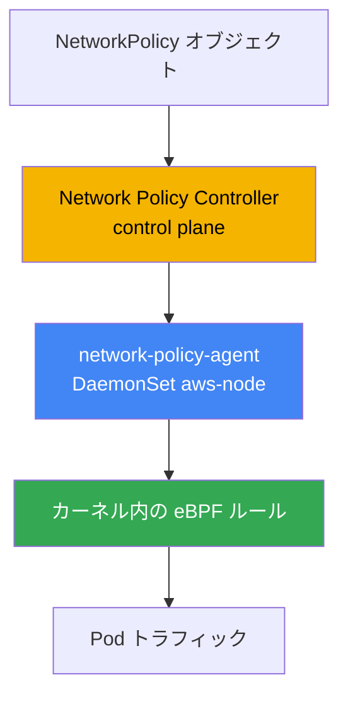
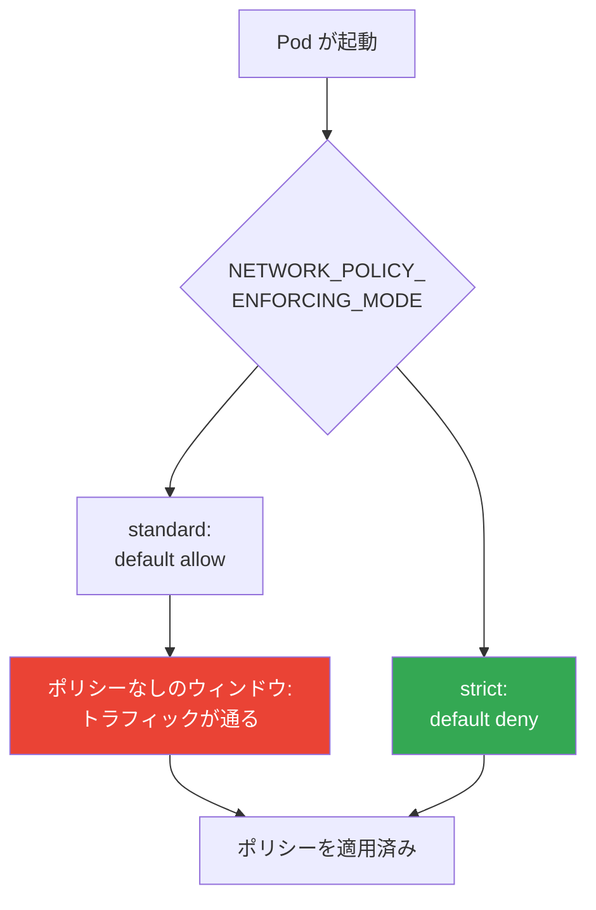
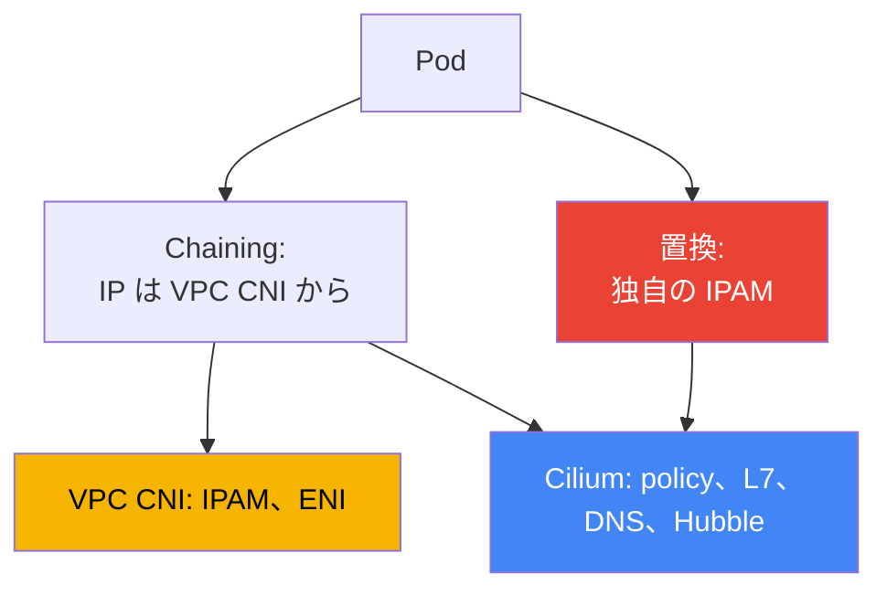

[Русская версия](ru.md) · [Eng version](en.md) · [Versión en español](es.md) · [Version française](fr.md) · [Deutsche Version](de.md) · [ქართული ვერსია](ge.md) · [繁體中文版](tw.md)
# 第30章. EKS の NetworkPolicy: VPC CNI network policy と Cilium

> **次は何か。** 第26章から第29章では、外部からトラフィックがクラスターに入る方法を扱いました。NLB（第26章）、ALB（第27章）、Gateway API（第28章）、DNS と証明書（第29章）です。ここでは、NetworkPolicy による Pod 間のトラフィック分離、すなわち east-west トラフィックを扱います。代替 CNI の概要と VPC CNI が Pod に IP を割り当てる方法は第8章、外部への egress とトラフィックコストは第31章、Kyverno と Gatekeeper によるマルチテナンシーとポリシーは第22章を参照してください（これは NetworkPolicy ではなく admission です）。ここで扱うのは1点だけです。EKS で誰が、どのように Pod 間のパケットを実際にブロックするのかです。

## 30.1. 「ポリシーを適用したのに、トラフィックが流れ続ける」

Kubernetes はご存じでしょう。NetworkPolicy は標準オブジェクトであり、namespace の `default deny` はすべての ingress を閉じ、その後ルールで必要なものを開放します。新しい EKS クラスターでは、エンジニアは CKA で学んだとおり、拒否ポリシーを適用し、Pod 間の接続が切れることを期待します。

```bash
kubectl apply -f default-deny.yaml
kubectl get netpol
# NAME           POD-SELECTOR   AGE
# default-deny   <none>         10s
```

ポリシーは存在し、セレクターは空なので、namespace の全 Pod が対象です。CKA の考え方では、隣の Pod はもう対象へ到達できないはずです。しかし、確認すると逆の結果になります。

```bash
kubectl exec deploy/client -- curl -s -m 3 http://web.default.svc.cluster.local
# <html>... 200 OK - ブロックされるはずなのに接続が通った
```

ポリシーが存在しないかのようにトラフィックが流れます。これはマニフェストのバグでも、セレクターのタイプミスでもありません。理由は、EKS ではデフォルトで **誰も NetworkPolicy を適用しない**からです。オブジェクトは API に存在しますが、これをノード上のルールに変換するコンポーネントは、基本の VPC CNI 構成にはありません。この機能を有効にするまで、VPC CNI は NetworkPolicy オブジェクトを単に無視し、クラスター内のすべての接続は許可されたままです。

これは EKS 固有の点です。NetworkPolicy オブジェクトは Kubernetes API の一部であり常に作成できますが、enforcement（誰がパケットをフィルタリングするか）は API サーバーではなく CNI が提供します。kind、Minikube、または Calico を使うクラスターでは enforcer がすでに導入されているため、CKA では気付きませんでした。EKS では意識して有効にする必要があります。

## 30.2. enforcer が必要な理由と VPC CNI network policy が提供するもの

NetworkPolicy は望ましい状態の宣言です。「この Pod への ingress はこれだけを許可する」というものです。誰かがこの宣言を読み、パケット経路上の実際のフィルターに変換しなければなりません。それを担うのが、CNI の一部である **enforcer** です。enforcer がなければ、オブジェクトをいくつ作成してもフィルタリングはありません。

VPC CNI にはこのような enforcer が組み込まれていますが、デフォルトでは無効です。これは2つの部分で構成されています。

- control plane 上の **Network Policy Controller**。AWS が運用します。このコントローラーは NetworkPolicy オブジェクトと Pod を監視し、各 Pod に許可される正確な endpoint を計算してノードへ配信します。
- 各ノード上の **network-policy-agent**。CNI 本体と並んで `aws-node` DaemonSet 内にある、独立した `aws-network-policy-agent` コンテナーです。エージェントはカーネル内で **eBPF** を通じてルールをプログラムし、Pod トラフィックがポリシーに従うようにします。



この機能は VPC CNI アドオンのフラグ、つまり managed addon 構成内の `enableNetworkPolicy` パラメーターで有効にします。値は文字列で指定します。

```json
{
    "enableNetworkPolicy": "true",
    "nodeAgent": {
        "healthProbeBindAddr": "8163",
        "metricsBindAddr": "8162"
    }
}
```

有効化後、aws-node コンテナーには `--enable-network-policy=true` 引数が追加され、エージェントはポート `8162` でメトリクスを、`8163` でヘルスチェックを待ち受けます（ポートは VPC CNI `v1.14.1` 以降で設定可能です）。`enableNetworkPolicy` パラメーター自体は `v1.14.0-eksbuild.3` 以降で利用でき、標準ポリシーの完全なサポートには VPC CNI を少なくとも `1.21` に保ってください。ノードには Linux カーネル `5.10` 以降が必要です。現在の EKS 最適化済み AL2023 および Bottlerocket にはすでに搭載されています。

運用上価値があるのは、これが **managed addon** である点です。enforcer は AWS がサポートし、VPC CNI アドオンとともに更新され、独自の CRD や再学習なしで、CKA で書いたものと同じ **標準 Kubernetes NetworkPolicy** を理解します。

## 30.3. Pod 起動時のポリシー適用順序とポリシーなしのウィンドウ

セキュリティの穴が生じるかを決める、微妙な点があります。Pod が起動すると、network-policy-agent は Pod のプロビジョニングと**並行して**ルールを構成します。新しい Pod のすべてのポリシーがまだ展開されていない間の動作は、enforcement モードで決まります。

VPC CNI は aws-node コンテナーの `NETWORK_POLICY_ENFORCING_MODE` 変数でこれを管理します。

- **standard**（デフォルト）: ポリシーが適用されるまで、Pod には *default allow* が適用されます。すべての ingress と egress が許可されます。「Pod がすでにトラフィックを受け付ける」と「ルールが展開される」の間に、フィルタリングのないウィンドウがあります。起動直後の Pod にとってこれはリスクであり、エージェントが追い付くまで、想定より広くアクセス可能です。
- **strict**: Pod は *default deny* で起動し、その後に許可が追加されます。透過性のウィンドウはなく、ポリシーがない間は何も通りません。



厳格さには使いやすさという代価があります。strict モードでは、CoreDNS を含め、Pod が接続する **すべての** endpoint に対するポリシーが必要です。DNS の許可を忘れると、Pod は名前を解決できず、起動時に失敗します。そのため strict は、インフラストラクチャートラフィック、特に DNS 向けの基本ポリシー群を用意して、意図的に有効化します。host networking を使用する Pod には default deny は適用されません。

Cilium も独自のオプションで同じ問題を解決します。厳格な初期分離モードは別途 `policy-enforcement-mode` で設定します。考え方は同じです。Pod を壊さないためにウィンドウを許容するか、許可するトラフィックを完全に記述する代価を払ってウィンドウを閉じるかです。

## 30.4. VPC CNI network policy にできること、できないこと

組み込み enforcer は標準 Kubernetes NetworkPolicy だけを扱いますが、それを十分に実行します。ingress と egress、`podSelector`、`namespaceSelector`、`ipBlock` による選択、ポートおよびプロトコルによる制限です。大多数のマイクロセグメンテーションの用途（「frontend は backend にしか接続しない」「database にはアプリケーションだけを許可する」）にはこれで十分であり、すべて AWS のサポート下でアドオンとして更新されます。

限界は L3/L4 より上のレイヤーが必要なところから始まります。

- **L7 ルールがない。**「`GET /api` だけを許可し、`POST` は許可しない」や、HTTP ヘッダー、gRPC メソッド、Kafka トピックによる選択は書けません。VPC CNI は IP とポートのレベルで動作します。
- **DNS 名によるポリシーがない。**「`api.stripe.com` への egress を許可する」とは指定できません。`ipBlock` を介した IP と CIDR のみであり、外部サービスのアドレスは変動します。
- **Cilium のクラスター CRD がない。**`CiliumNetworkPolicy` と `CiliumClusterwideNetworkPolicy` はありません。標準 NetworkPolicy は常に namespace に紐付き、このモデルには「クラスター全体」向けの単一ポリシーはありません（AdminNetworkPolicy は新しいバージョンにおける別の話ですが、Cilium CRD ではありません）。
- **Hubble** とその可観測性がない。フローマップも、「どのポリシーによってパケットが許可または拒否されたか」という per-flow verdict もありません。デバッグは UI マップではなく、エージェントのログとメトリクスで行います。

これで不足する場合、次の選択肢は Cilium です。しかしその前に、得られるものと代価を理解することが重要です。

## 30.5. 標準ポリシー: default deny、podSelector、namespaceSelector、egress

構文は CKA で見慣れたもので、EKS では変わりません。変わるのは、これを適用するものが存在する点だけです。基本セットは覚えておくべきです。namespace へのすべての ingress を拒否することは、あらゆるセグメンテーションの基盤です。

```yaml
apiVersion: networking.k8s.io/v1
kind: NetworkPolicy
metadata:
  name: default-deny-ingress
  namespace: shop
spec:
  podSelector: {}          # namespace の全 Pod
  policyTypes: ["Ingress"] # 空の ingress = 何も許可しない
```

`podSelector` による許可: `app: api` ラベルの Pod には、同じ namespace 内の `app: frontend` ラベルの Pod だけを許可します。

```yaml
spec:
  podSelector:
    matchLabels: { app: api }
  ingress:
    - from:
        - podSelector:
            matchLabels: { app: frontend }
      ports:
        - { protocol: TCP, port: 8080 }
```

`namespaceSelector` による許可: `team: payments` ラベルの namespace からのトラフィックだけを許可します（namespace には事前にラベルを付与する必要があります）。

```yaml
  ingress:
    - from:
        - namespaceSelector:
            matchLabels: { team: payments }
```

egress の制限: Pod からの送信先を backend と DNS だけに許可します。DNS がないと Pod は名前解決を失います。これが「default deny egress の後に壊れた」最も一般的な理由です。

```yaml
spec:
  podSelector:
    matchLabels: { app: frontend }
  policyTypes: ["Egress"]
  egress:
    - to:
        - podSelector:
            matchLabels: { app: api }
    - to:                          # kube-system の CoreDNS 向け DNS
        - namespaceSelector:
            matchLabels: { kubernetes.io/metadata.name: kube-system }
      ports:
        - { protocol: UDP, port: 53 }
        - { protocol: TCP, port: 53 }
```

DNS は default deny egress で問題になる唯一のインフラストラクチャーアドレスではありません。Pod と namespace のセレクターは link-local アドレスには効かないため、`ipBlock` で開放します。default deny egress では、例外の必須リストを意識してください。CoreDNS への DNS（UDP/TCP 53、上ですでに示しました）、Pod Identity エージェント `169.254.170.23`、必要に応じて IMDS `169.254.169.254` です。最も痛手の大きい欠落は Pod Identity エージェントです。そこへの egress を閉じると、Pod はロールの一時的な認証情報を取得できず、最初の AWS 呼び出しで失敗します（第17章）。通常、Pod に IMDS は不要であり、Pod が実際にメタデータへアクセスする場合だけ開放します（第19章）。

```yaml
  egress:
    - to:                          # Pod Identity エージェント: ないと AWS 認証情報を取得できない（第17章）
        - ipBlock: { cidr: 169.254.170.23/32 }
      ports:
        - { protocol: TCP, port: 80 }
    - to:                          # IMDS: Pod がメタデータへアクセスする場合のみ（第19章）
        - ipBlock: { cidr: 169.254.169.254/32 }
      ports:
        - { protocol: TCP, port: 80 }
```

これらはすべて VPC CNI network policy と Cilium のどちらでも同様に機能します。これは標準 API だからです。違いが現れるのは、標準 API のルールでは不足する場合だけです。

## 30.6. Cilium: VPC CNI 上の chaining と完全置換

EKS では、Cilium を2つのモードのいずれかで導入します。両者の責任は根本的に異なります。

**VPC CNI 上の CNI chaining。**Pod のアドレスは引き続き VPC CNI が割り当てます。IPAM、ENI、および IP 計画はすべて VPC CNI のままです（第8章）。Cilium は「上に」接続します。VPC CNI が Pod ネットワークを構成した後に Cilium が呼び出され、作成されたインターフェイスに eBPF プログラムを接続し、**policy engine、L7 ルール、DNS 名によるポリシー、Hubble** を追加します。IP アドレスモデルは変わらず、VPC との統合も維持されます。最も穏当な経路です。アドレス指定は AWS に任せ、ポリシーと可観測性は Cilium に任せます。

**VPC CNI の完全置換。**Cilium が唯一の CNI になります。DaemonSet `aws-node` は削除され、Cilium が IPAM 全体を引き継ぎます。選択肢は2つです。**ENI モード**（Cilium 自身が ENI を管理し、VPC アドレスを割り当てる）または **overlay**（VXLAN 上の独自オーバーレイで、Pod アドレスは VPC から取得しない）です。Cilium の機能全体と最大の制御を得られますが、CNI のライフサイクル全体も自分で担うことになります。



どちらのモードでも、L7 ルール、FQDN による選択、クラスター全体のポリシーを持つ CRD、`CiliumNetworkPolicy` と `CiliumClusterwideNetworkPolicy`、およびフロー可観測性のための Hubble が追加されます。Cilium は標準 Kubernetes NetworkPolicy も適用するため、既存のポリシーを書き換える必要はありません。

## 30.7. Cilium への移行の正直なコストと比較表

Cilium は強力なツールですが、「チェックボックスをオンにする」だけではありません。移行、特に置換モードでは責任モデルが変わるため、移行前に受け入れる必要があり、インシデント時に受け入れるものではありません。

- **CNI のライフサイクルを所有する。**置換モードでは、クラスターのネットワークは自分で維持します。構成、IPAM モード、Kubernetes バージョンとの互換性は自分の責任です。
- **アップグレードは managed addon ではなくなる。**VPC CNI は AWS サポート下の EKS アドオンとして更新されましたが、Cilium は Helm で自らアップグレードし、メンテナンスウィンドウを計画して互換性を確認します。
- **ネットワーク障害の診断が複雑になる。**Pod と VPC の間に Cilium レイヤーが加わります（chaining では CNI が2つ同時です）。「なぜパケットが届かなかったのか」を調べるには、Cilium の datapath と VPC ネットワークの両方を理解する必要があります。
- **一部の AWS 統合は「すぐに使える」状態ではなくなる。**AWS は VPC CNI 上の状況をサポートしカバーします。クラウドノード上の CNI としての Cilium は AWS サポートの範囲外であり、VPC CNI への依存関係の一部を自分で解決しなければなりません。

実践的な結論として、チェックボックスのために CNI を変更しないでください。標準 NetworkPolicy で足りるなら、VPC CNI network policy に留まります。L7 または DNS ポリシーが必要なら、アドレス指定を AWS に残せる chaining から始めます。完全置換は、コストを理解したうえで、明確な要件がある場合だけ選びます。

| 機能 | VPC CNI network policy | Cilium | Cilium で支払う代価 |
|---|---|---|---|
| 標準 K8s NetworkPolicy | はい | はい | - |
| L7 ルール（HTTP、gRPC） | いいえ | はい | 独自の policy engine、より複雑なデバッグ |
| DNS 名（FQDN）によるポリシー | いいえ | はい | datapath に余分なレイヤー |
| クラスター全体のポリシー | いいえ（namespace のみ） | CiliumClusterwidePolicy | 新しい CRD、チームの学習 |
| フロー可観測性 | エージェントのメトリクスとログ | Hubble、フローマップ | 運用対象コンポーネントが増える |
| 更新モデル | managed addon、AWS サポート | Helm、自分の責任 | アップグレードと互換性を自分で担う |
| Pod の IP アドレス指定 | VPC CNI | VPC CNI（chaining）または独自 IPAM | 置換時は IPAM を所有 |

## 30.8. 本番環境での適用方法

- **enforcer の有効化から始める。**`enableNetworkPolicy` がなければ、どの NetworkPolicy も空のオブジェクトです。新しいクラスターの最初の手順は、アドオンパラメーターを有効化し、エージェントが全ノードで起動したことを確認することです。
- **すべてのワークロード namespace に default deny を置く。**デフォルトで ingress（そして後に egress）を拒否し、その上で必要なものを個別に開放します。基本の deny がなければセグメンテーションはありません。
- **DNS を明示的に許可する。**egress を制限するときは、まず CoreDNS への UDP/TCP 53 を開放します。そうしないと Pod は名前解決を失います。インシデント時に思い出すのではなく、ルールをテンプレートに入れます。
- **strict mode は要件に応じて使い、デフォルトにはしない。**default-allow のウィンドウは、DNS を含むインフラストラクチャートラフィックを事前に記述したうえで、正当な場合に strict モードで閉じます。
- **Cilium は流行ではなく必要性から導入する。**L7 または FQDN ポリシーが必要なら、IPAM を VPC CNI に残す chaining から始めます。完全置換は明確な要件がある場合だけ選びます。
- **ポリシーを Git でバージョン管理する。**NetworkPolicy は Deployment と同じくコードです。手作業でクラスターを編集するのではなく、リポジトリーで管理し、GitOps（第44章）を通じて適用します。

## 30.9. ミニ用語集

- **NetworkPolicy**: Pod に許可される ingress と egress を宣言する Kubernetes 標準オブジェクト。enforcer がなければ、それ自体で何かをブロックすることはありません。
- **enforcer**: NetworkPolicy を実際のトラフィックフィルターへ変換する CNI コンポーネント。EKS では有効化されるまでデフォルトで存在しません。
- **VPC CNI network policy**: VPC CNI に組み込まれた enforcement 実装。control plane の Network Policy Controller と、eBPF を通じて動作するノード上の network-policy-agent から成ります。
- **enableNetworkPolicy**: 標準 NetworkPolicy の enforcement を有効にする VPC CNI managed addon のパラメーター。
- **NETWORK_POLICY_ENFORCING_MODE**: aws-node の変数。`standard`（ポリシー適用まで default allow）または `strict`（最初の瞬間から default deny）。
- **CNI chaining**: VPC CNI 上で Cilium を使うモード。IP は VPC CNI が割り当て、Cilium がポリシー、L7、DNS ルール、Hubble を追加します。
- **CiliumNetworkPolicy / CiliumClusterwideNetworkPolicy**: L7 および FQDN ルールと、クラスター全体の適用範囲を持つ Cilium CRD。
- **Hubble**: Cilium の可観測性サブシステム。フローマップと per-flow verdict を提供し、VPC CNI network policy にはありません。

## 30.10. 章のまとめ

- EKS では NetworkPolicy オブジェクトは常に作成できますが、デフォルトでは誰も適用しません。有効化されていない機能を持つ VPC CNI はポリシーを無視し、すべての east-west トラフィックが許可されます。
- enforcement は VPC CNI managed addon の `enableNetworkPolicy` パラメーターで有効にします。control plane の Network Policy Controller と、ノード上の network-policy-agent（eBPF）が動作します。
- これは AWS がサポートする managed addon で、独自 CRD なしに、CKA と同じ構文の標準 Kubernetes NetworkPolicy を理解します。
- Pod 起動時にはポリシーが並行して適用されます。`standard` には default-allow のウィンドウがあり、`strict` は即座に default-deny ですが、DNS を含むすべての endpoint にポリシーが必要です。
- VPC CNI network policy には L7 ルール、DNS 名によるポリシー、Cilium のクラスター CRD、Hubble はありませんが、通常は L3/L4 セグメンテーションには十分です。
- Cilium は2つのモードで導入します。VPC CNI 上の chaining（IP は VPC CNI、Cilium がポリシーと Hubble を提供）または独自 IPAM による完全置換（ENI モードまたは overlay）です。
- Cilium の正直なコストは、CNI ライフサイクルの所有、managed addon 外でのアップグレード、より複雑な診断、一部 AWS 統合が「すぐに使える」状態でなくなることです。
- 選択ルールは、標準 NetworkPolicy で足りるなら VPC CNI、L7 または FQDN が必要なら chaining、完全置換は明確な要件がある場合だけ、です。

## 30.11. 実務での役立て方

オンコールで「ポリシーが機能しない」を調査する際の最初の質問は、enforcer がそもそも有効かどうかです。`enableNetworkPolicy` が設定されていなければ、どの NetworkPolicy も無意味であり、セレクターを調べる前にまず確認します。2つ目によくあるインシデントは、「default deny egress の後にアプリケーションが名前を解決できなくなった」です。ほとんどの場合、CoreDNS への DNS を許可し忘れています。3つ目は、必要なインフラストラクチャートラフィックのポリシーがないため、strict モードで Pod が起動しないことです。

計画段階では3つの判断を事前に持ってください。strict mode を有効にするか、そしてどの基本ポリシーセット（特に DNS）をワークロードより先に導入するかです。L3/L4 で足りるか、L7 と FQDN が必要かで、VPC CNI に留まるか Cilium に進むかが決まります。そして Cilium を使うならどのモードかです。chaining では IPAM と AWS サポートを VPC CNI に残せますが、置換では CNI のライフサイクル全体を自分で担います。

## 30.12. 自己確認のための質問

1. 新しい EKS クラスターで適用済みの default deny が Pod 間トラフィックをブロックしないのはなぜですか？
2. enforcer とは何であり、なぜ NetworkPolicy オブジェクト単体では何も遮断しないのですか？
3. VPC CNI network policy はどの2つのコンポーネントで構成され、それぞれはどこで動作しますか？
4. enforcement を有効にするアドオンパラメーターは何で、aws-node にはどのコンテナーが追加されますか？
5. `NETWORK_POLICY_ENFORCING_MODE` の `standard` と `strict` はどう異なりますか？
6. Pod 起動時の「ポリシーなしのウィンドウ」とは何であり、何が危険ですか？
7. strict モードでは、なぜ CoreDNS へのトラフィックを事前に許可する必要がありますか？
8. Cilium と比べて、VPC CNI network policy にない機能は何ですか？
9. CNI chaining モードの Cilium と VPC CNI を完全に置換するモードはどう異なりますか？
10. chaining モードでは誰が Pod に IP アドレスを割り当て、なぜそれが重要ですか？
11. 置換モードで Cilium に移行する正直なコストは何から成りますか？
12. VPC CNI network policy と Cilium はどのようなルールで選択しますか？
13. 通常の NetworkPolicy が namespace に紐付くなら、なぜ `CiliumClusterwideNetworkPolicy` が必要ですか？

## 実践

このテーマには、コースの2つのラボがあります。[ラボ110: EKS の NetworkPolicy: 組み込み VPC CNI network policy](../../labs/110/README_JP.MD) と [ラボ132: 代替 CNI: VPC CNI 上の CNI chaining モードの Cilium](../../labs/132/README_JP.MD) です。これら以外にも、すべてを実際のクラスターで確認できます。まず enforcer がそもそも有効か、またポリシーエージェントがノード上で起動しているかを確認してください。

```bash
kubectl get daemonset aws-node -n kube-system -o yaml | grep -A2 aws-network-policy-agent
kubectl get pods -n kube-system -l k8s-app=aws-node        # エージェントは CNI と並んで動作する
aws eks describe-addon --cluster-name my-cluster \
  --addon-name vpc-cni --query "addon.configurationValues"  # enableNetworkPolicy を探す
```

次に、30.1 の問題を再現し、トラフィックが遮断されるかを確認します。Pod を2つ起動し、ポリシー前の接続を確認してから default deny を適用し、もう一度確認します。

```bash
kubectl run web --image=nginx --labels app=web --expose --port 80
kubectl run client --image=curlimages/curl -- sleep 3600
kubectl exec client -- curl -s -m 3 http://web         # ポリシー前: 通る
kubectl apply -f default-deny.yaml                      # podSelector: {}, Ingress のみ
kubectl get netpol
kubectl exec client -- curl -s -m 3 http://web         # 適用後: タイムアウトで切断されるはず
```

default deny の後も接続が通る場合は、enforcer が有効になっていません。最初の確認に戻ってください。次に `podSelector` による許可ポリシーを追加し、必要なトラフィックが再び通り、不要なトラフィックが閉じたままであることを確認します。

---
[目次](../README_JP.md) · [第29章](../29/jp.md) · [第31章](../31/jp.md)