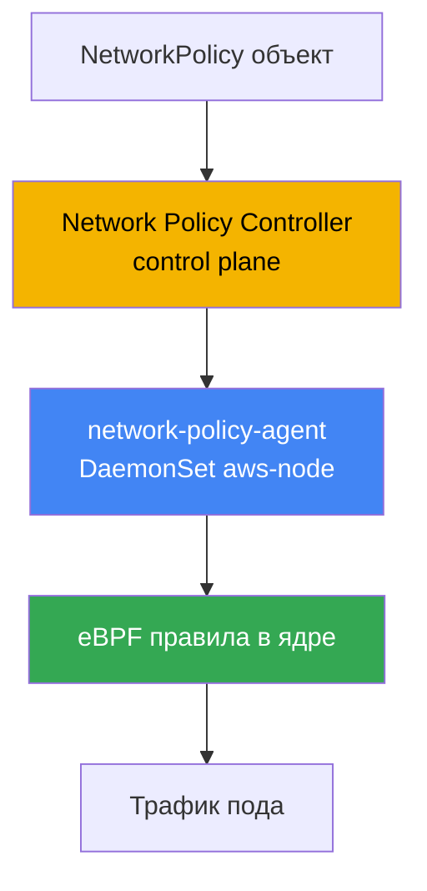
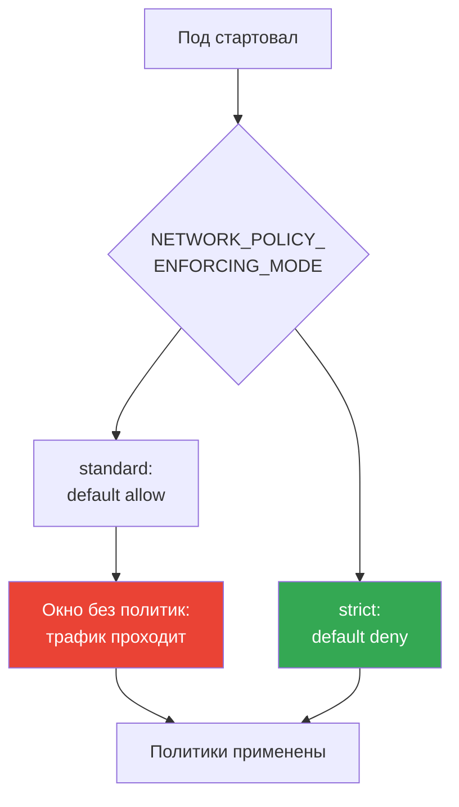
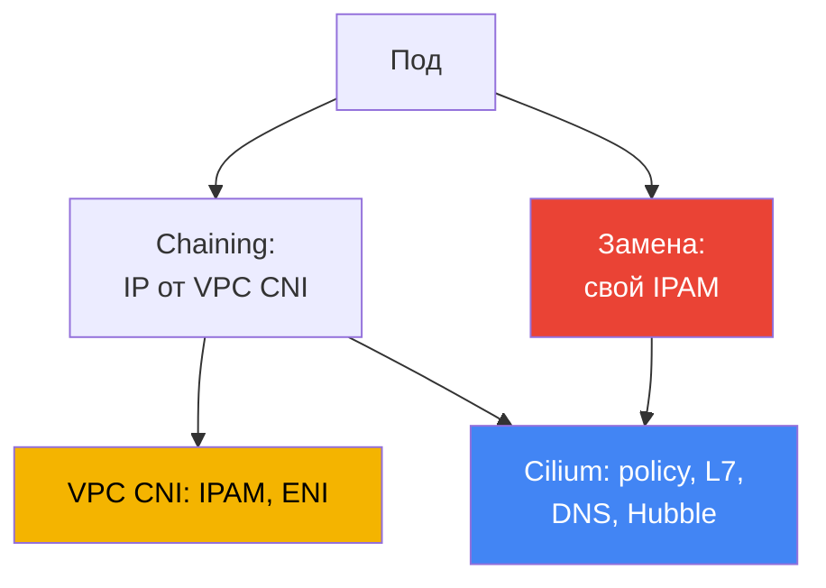

# Глава 30. NetworkPolicy в EKS: VPC CNI network policy и Cilium

> **Что дальше.** Главы 26-29 показали, как трафик входит в кластер снаружи: NLB (глава 26),
> ALB (глава 27), Gateway API (глава 28), DNS и сертификаты (глава 29). Здесь разговор про
> east-west - изоляцию трафика между самими подами через NetworkPolicy. Обзор альтернативных
> CNI и то, как VPC CNI выдаёт IP подам, - глава 8; egress наружу и стоимость трафика - глава
> 31; мультитенантность и политики через Kyverno и Gatekeeper - глава 22 (это admission, а не
> NetworkPolicy). Здесь только одно: кто и как в EKS реально блокирует пакеты между подами.

## 30.1. «Политику применили, а трафик всё равно ходит»

Kubernetes вы знаете: NetworkPolicy - это стандартный объект, `default deny` в namespace
закрывает весь ingress, а дальше правила открывают нужное. В свежем кластере EKS инженер
делает ровно то, чему учили на CKA: применяет запрещающую политику и ждёт, что связность
между подами оборвётся.

```bash
kubectl apply -f default-deny.yaml
kubectl get netpol
# NAME           POD-SELECTOR   AGE
# default-deny   <none>         10s
```

Политика на месте, селектор пустой - значит, под все поды namespace. По логике CKA соседний
под уже не должен достучаться до целевого. Но проверка показывает обратное:

```bash
kubectl exec deploy/client -- curl -s -m 3 http://web.default.svc.cluster.local
# <html>... 200 OK - соединение прошло, хотя должно было быть заблокировано
```

Трафик идёт, будто политики нет. Это не баг манифеста и не опечатка в селекторе. Причина в
том, что в EKS по умолчанию **NetworkPolicy никто не применяет**. Объект в API есть, а
компонента, который превращал бы его в правила на нодах, в базовой конфигурации VPC CNI нет.
Пока эту фичу не включили, VPC CNI объекты NetworkPolicy попросту игнорирует - вся связность
в кластере остаётся разрешённой.

Это специфика EKS: объект NetworkPolicy - часть Kubernetes API и создаётся всегда, но
enforcement (кто режет пакеты) даёт CNI, а не API-сервер. В kind, Minikube или кластере с
Calico enforcer уже стоит, и на CKA вы его не замечали. В EKS его надо включить осознанно.

## 30.2. Почему нужен enforcer и что даёт VPC CNI network policy

NetworkPolicy - декларация желаемого: «в этот под пускать только такой ingress». Кто-то должен
эту декларацию прочитать и превратить в реальные фильтры на пути пакетов. Этим занимается
**enforcer** - часть CNI. Нет enforcer'а - нет фильтрации, сколько объектов ни создавай.

У VPC CNI такой enforcer встроен, но по умолчанию выключен. Он состоит из двух частей:

- **Network Policy Controller** на control plane. Его обслуживает AWS. Контроллер следит за
  объектами NetworkPolicy и подами, вычисляет, какие именно endpoint'ы разрешены каждому поду,
  и рассылает это на ноды.
- **network-policy-agent** на каждой ноде - отдельный контейнер `aws-network-policy-agent` в
  DaemonSet'е `aws-node` рядом с самим CNI. Агент программирует правила через **eBPF** в ядре
  и следит, чтобы трафик пода соответствовал политикам.



Включается фича флагом аддона VPC CNI - параметром `enableNetworkPolicy` в конфигурации
managed addon. Значение задаётся строкой:

```json
{
    "enableNetworkPolicy": "true",
    "nodeAgent": {
        "healthProbeBindAddr": "8163",
        "metricsBindAddr": "8162"
    }
}
```

После включения в контейнере aws-node появляется аргумент `--enable-network-policy=true`, а
агент начинает слушать метрики на порту `8162` и health-проверки на `8163` (порты
настраиваемые с версии VPC CNI `v1.14.1`). Сам параметр `enableNetworkPolicy` доступен с
`v1.14.0-eksbuild.3`; для полноценной поддержки стандартных политик держите VPC CNI не ниже
`1.21`. Нодам нужно ядро Linux `5.10` или новее - у актуальных EKS-оптимизированных AL2023 и
Bottlerocket оно уже есть.

Что здесь ценно с точки зрения эксплуатации: это **managed addon**. Enforcer поддерживает сам
AWS, он обновляется вместе с аддоном VPC CNI, и он понимает **стандартный Kubernetes
NetworkPolicy** - тот же объект, что вы писали на CKA, без своих CRD и без переучивания.

## 30.3. Порядок применения политик при старте пода и окно без политик

Тонкий момент, который решает, есть ли у вас дыра в безопасности. Когда под запускается,
network-policy-agent настраивает его правила **параллельно** с провижинингом пода. Пока все
политики для нового пода ещё не разложены, его поведение определяется режимом enforcement.

VPC CNI управляет этим переменной `NETWORK_POLICY_ENFORCING_MODE` в контейнере aws-node:

- **standard** (по умолчанию) - до того, как политики применены, у пода действует *default
  allow*: весь ingress и egress разрешён. Есть окно между «под уже принимает трафик» и «правила
  разложены», в котором фильтрации нет. Для только что стартовавшего пода это риск: он
  доступен шире, чем задумано, пока агент не догонит.
- **strict** - под стартует с *default deny*, и лишь затем добавляются разрешения. Окна
  проницаемости нет: пока политик нет, не проходит ничего.



За строгость платят удобством. В режиме strict политика нужна **на каждый** endpoint, к
которому под обращается, включая CoreDNS: забыли разрешить DNS - под не резолвит имена и
падает на старте. Поэтому strict включают осознанно, с базовым набором политик на
инфраструктурный трафик (DNS в первую очередь). Для подов с host networking default deny не
применяется.

Cilium решает то же самое своей опцией: режим строгой начальной изоляции задаётся отдельно
(`policy-enforcement-mode`). Идея общая - либо мириться с окном ради того, чтобы поды не
ломались, либо закрыть окно ценой полного описания разрешённого трафика.

## 30.4. Что VPC CNI network policy умеет и чего в ней нет

Встроенный enforcer закрывает ровно стандартный Kubernetes NetworkPolicy - и делает это
хорошо: ingress и egress, отбор по `podSelector`, по `namespaceSelector`, по `ipBlock`,
ограничение по портам и протоколам. Для подавляющего большинства задач микросегментации
(«фронтенд ходит только в бэкенд», «в базу пускать только приложение») этого достаточно, и всё
это под поддержкой AWS и обновляется как аддон.

Границы начинаются там, где нужен слой выше L3/L4:

- **Нет L7-правил.** Нельзя написать «разрешить только `GET /api`, но не `POST`» или отобрать
  по HTTP-заголовку, gRPC-методу, Kafka-топику. VPC CNI работает на уровне IP и портов.
- **Нет политик по DNS-именам.** Нельзя сказать «egress разрешён на `api.stripe.com`». Только
  по IP и CIDR через `ipBlock`, а у внешних сервисов адреса плавают.
- **Нет кластерных CRD Cilium** - `CiliumNetworkPolicy` и `CiliumClusterwideNetworkPolicy`.
  Стандартный NetworkPolicy всегда привязан к namespace; единой политики «на весь кластер» в
  этой модели нет (AdminNetworkPolicy - отдельная история новых версий, но это не Cilium CRD).
- **Нет Hubble** и его наблюдаемости. Нет карты потоков, нет per-flow verdict «пакет разрешён
  или отклонён такой-то политикой». Отладка идёт по логам агента и метрикам, а не по UI-карте.

Если этого не хватает, следующий шаг - Cilium. Но прежде важно понимать, что вы получаете и
чем за это платите.

## 30.5. Стандартные политики: default deny, podSelector, namespaceSelector, egress

Синтаксис вам знаком с CKA - в EKS он не меняется, меняется лишь то, что теперь его кто-то
применяет. Базовый набор стоит держать в голове. Полный запрет входящего в namespace -
фундамент любой сегментации:

```yaml
apiVersion: networking.k8s.io/v1
kind: NetworkPolicy
metadata:
  name: default-deny-ingress
  namespace: shop
spec:
  podSelector: {}          # все поды namespace
  policyTypes: ["Ingress"] # пустой ingress = не пускать ничего
```

Разрешение по `podSelector`: в под с меткой `app: api` пускать только поды с меткой
`app: frontend` из того же namespace:

```yaml
spec:
  podSelector:
    matchLabels: { app: api }
  ingress:
    - from:
        - podSelector:
            matchLabels: { app: frontend }
      ports:
        - { protocol: TCP, port: 8080 }
```

Разрешение по `namespaceSelector`: пускать трафик только из namespace с меткой
`team: payments` (метку на namespace надо повесить заранее):

```yaml
  ingress:
    - from:
        - namespaceSelector:
            matchLabels: { team: payments }
```

Ограничение egress: поду разрешить исходящие только в бэкенд и на DNS. DNS обязателен, иначе
под потеряет резолвинг - это самая частая причина «сломалось после default deny egress»:

```yaml
spec:
  podSelector:
    matchLabels: { app: frontend }
  policyTypes: ["Egress"]
  egress:
    - to:
        - podSelector:
            matchLabels: { app: api }
    - to:                          # DNS к CoreDNS в kube-system
        - namespaceSelector:
            matchLabels: { kubernetes.io/metadata.name: kube-system }
      ports:
        - { protocol: UDP, port: 53 }
        - { protocol: TCP, port: 53 }
```

DNS - не единственный инфраструктурный адрес, который рвёт default deny egress. Селекторы
подов и namespace на link-local адреса не действуют, поэтому их открывают через `ipBlock`.
При default deny egress держите в голове обязательный список исключений: DNS к CoreDNS
(UDP/TCP 53, уже показан выше), агент Pod Identity `169.254.170.23` и, по необходимости, IMDS
`169.254.169.254`. Самая болезненная пропажа - агент Pod Identity: закрыли egress к нему - под
не получит временные креды роли и упадёт на первом же вызове AWS (глава 17). IMDS подам, как
правило, не нужен и открывается только там, где под реально ходит в метаданные (глава 19):

```yaml
  egress:
    - to:                          # агент Pod Identity - иначе нет кредов AWS (глава 17)
        - ipBlock: { cidr: 169.254.170.23/32 }
      ports:
        - { protocol: TCP, port: 80 }
    - to:                          # IMDS - только если под ходит в метаданные (глава 19)
        - ipBlock: { cidr: 169.254.169.254/32 }
      ports:
        - { protocol: TCP, port: 80 }
```

Всё это работает и на VPC CNI network policy, и на Cilium одинаково - это стандартный API.
Разница проявляется только когда правил стандартного API перестаёт хватать.

## 30.6. Cilium: chaining поверх VPC CNI и полная замена

Cilium в EKS ставят в одном из двух режимов, и это принципиально разные обязательства.

**CNI chaining поверх VPC CNI.** Адреса подам по-прежнему выдаёт VPC CNI - IPAM, ENI и весь
IP-план остаются его (глава 8). Cilium подключается «сверху»: после того как VPC CNI настроил
сеть пода, вызывается Cilium и навешивает свои eBPF-программы на созданные интерфейсы, добавляя
**policy engine, L7-правила, политики по DNS-именам и Hubble**. Модель IP-адресов не меняется,
интеграции с VPC остаются. Самый щадящий путь: адресация за AWS, политики и наблюдаемость -
Cilium.

**Полная замена VPC CNI.** Cilium становится единственным CNI: DaemonSet `aws-node` удаляется,
и Cilium берёт IPAM целиком. Вариантов два - **ENI-режим** (Cilium сам управляет ENI и раздаёт
VPC-адреса) или **overlay** (свой оверлей поверх VXLAN, адреса подов не из VPC). Максимум
контроля и весь набор функций Cilium, но и весь жизненный цикл CNI теперь ваш.



В обоих режимах появляются `CiliumNetworkPolicy` и `CiliumClusterwideNetworkPolicy` - CRD с
L7-правилами, отбором по FQDN и кластерными политиками, плюс Hubble для наблюдаемости потоков.
Стандартный Kubernetes NetworkPolicy Cilium применяет тоже - старые политики не переписывают.

## 30.7. Честная цена перехода на Cilium и таблица сравнения

Cilium - мощный инструмент, но это не «включить галочку». Переход, особенно в режиме замены,
меняет модель ответственности, и это надо принять до миграции, а не на инциденте.

- **Вы владеете жизненным циклом CNI.** В режиме замены сеть кластера держите вы: конфигурация,
  режим IPAM, совместимость с версиями Kubernetes - ваша забота.
- **Апгрейды больше не managed addon.** VPC CNI обновлялся как аддон EKS под поддержкой AWS;
  Cilium вы апгрейдите сами через Helm, планируете окна и проверяете совместимость.
- **Диагностика сетевых сбоев усложняется.** Между подом и VPC добавляется слой Cilium (а в
  chaining - два CNI сразу). Разбор «почему пакет не дошёл» требует знать и датапас Cilium,
  и сеть VPC.
- **Часть интеграций AWS перестаёт работать «из коробки».** AWS поддерживает и покрывает
  ситуации на VPC CNI; Cilium как CNI на облачных нодах вне зоны их поддержки, и часть
  завязок на VPC CNI приходится решать самостоятельно.

Практический вывод: не меняйте CNI ради галочки. Хватает стандартного NetworkPolicy -
оставайтесь на VPC CNI network policy. Нужны L7 или DNS-политики - начните с chaining, где
адресация остаётся у AWS. На полную замену идите только под явное требование, понимая цену.

| Возможность | VPC CNI network policy | Cilium | Чем платите за Cilium |
|---|---|---|---|
| Стандартный K8s NetworkPolicy | да | да | - |
| L7-правила (HTTP, gRPC) | нет | да | свой policy engine, отладка сложнее |
| Политики по DNS-именам (FQDN) | нет | да | лишний слой в датапасе |
| Кластерные политики | нет (только namespace) | CiliumClusterwidePolicy | новые CRD, обучение команды |
| Наблюдаемость потоков | метрики и логи агента | Hubble, карта потоков | ещё компонент в эксплуатации |
| Модель обновлений | managed addon, поддержка AWS | Helm, ваша ответственность | апгрейды и совместимость на вас |
| IP-адресация подов | VPC CNI | VPC CNI (chaining) или свой IPAM | при замене - владение IPAM |

## 30.8. Как это применяют в продакшене

- **Начинают с включения enforcer'а.** Без `enableNetworkPolicy` любой NetworkPolicy - пустой
  объект. Первый шаг на новом кластере - включить параметр аддона и проверить, что агент
  поднялся на всех нодах.
- **default deny кладут в каждый рабочий namespace.** Запрет ingress (а затем и egress) по
  умолчанию, поверх которого точечно открывают нужное. Без базового deny сегментации нет.
- **DNS разрешают явно.** При ограничении egress первым делом открывают UDP/TCP 53 на CoreDNS,
  иначе поды теряют резолвинг. Правило вносят в шаблон, а не вспоминают на инциденте.
- **strict mode - под требование, не по умолчанию.** Окно default-allow закрывают режимом
  strict там, где это оправдано, заранее описав инфраструктурный трафик, включая DNS.
- **Cilium вводят от потребности, а не от моды.** Нужны L7 или FQDN-политики - начинают с
  chaining, сохраняя IPAM за VPC CNI; полную замену берут только под явные требования.
- **Политики версионируют в Git.** NetworkPolicy - такой же код, как Deployment: их держат в
  репозитории и катят через GitOps (глава 44), а не правят руками в кластере.

## 30.9. Мини-глоссарий

- **NetworkPolicy** - стандартный объект Kubernetes, декларирующий разрешённый ingress и egress
  для подов; сам по себе ничего не блокирует без enforcer'а.
- **enforcer** - компонент CNI, превращающий NetworkPolicy в реальные фильтры трафика; в EKS
  по умолчанию отсутствует, пока не включён.
- **VPC CNI network policy** - встроенная в VPC CNI реализация enforcement: Network Policy
  Controller на control plane и network-policy-agent на нодах, работающий через eBPF.
- **enableNetworkPolicy** - параметр managed addon VPC CNI, включающий enforcement стандартного
  NetworkPolicy.
- **NETWORK_POLICY_ENFORCING_MODE** - переменная aws-node: `standard` (default allow до
  применения политик) или `strict` (default deny с первой секунды).
- **CNI chaining** - режим Cilium поверх VPC CNI: IP выдаёт VPC CNI, Cilium добавляет политики,
  L7, DNS-правила и Hubble.
- **CiliumNetworkPolicy / CiliumClusterwideNetworkPolicy** - CRD Cilium с L7- и FQDN-правилами
  и кластерной областью действия.
- **Hubble** - подсистема наблюдаемости Cilium: карта потоков и per-flow verdict, чего в VPC
  CNI network policy нет.

## 30.10. Итоги главы

- В EKS объект NetworkPolicy создаётся всегда, но по умолчанию его никто не применяет: VPC CNI
  без включённой фичи политики игнорирует, и весь east-west-трафик разрешён.
- Enforcement включается параметром `enableNetworkPolicy` в managed addon VPC CNI; работают
  Network Policy Controller на control plane и network-policy-agent (eBPF) на нодах.
- Это managed addon под поддержкой AWS, понимающий стандартный Kubernetes NetworkPolicy - тот
  же синтаксис, что на CKA, без своих CRD.
- При старте пода политики применяются параллельно: `standard` даёт окно default-allow,
  а `strict` сразу default-deny, но тогда нужна политика на каждый endpoint, включая DNS.
- VPC CNI network policy не умеет L7-правил, политик по DNS-именам, кластерных CRD Cilium и не
  даёт Hubble; для L3/L4-сегментации этого обычно достаточно.
- Cilium подключают в двух режимах: chaining поверх VPC CNI (IP от VPC CNI, Cilium даёт
  политики и Hubble) или полной заменой со своим IPAM (ENI-режим или overlay).
- Цена Cilium честная: владение жизненным циклом CNI, апгрейды вне managed addon, сложнее
  диагностика, часть интеграций AWS перестаёт работать «из коробки».
- Правило выбора: хватает стандартного NetworkPolicy - VPC CNI; нужны L7 или FQDN - chaining;
  полная замена - только под явное требование.

## 30.11. Как это пригодится в реальной работе

На дежурстве первый вопрос при разборе «политика не работает» - включён ли вообще enforcer.
Если `enableNetworkPolicy` не выставлен, любой NetworkPolicy бесполезен, и это проверяют
первым, до разбора селекторов. Второй частый инцидент - «после default deny egress приложение
перестало резолвить имена»: почти всегда забыли открыть DNS на CoreDNS. Третий - под не
стартует в режиме strict, потому что нет политики на нужный ему инфраструктурный трафик.

При планировании держите три решения заранее. Включаете ли strict mode и какой базовый набор
политик (DNS в первую очередь) приедет до нагрузок. Хватает ли L3/L4 или нужны L7 и FQDN - от
этого зависит, останетесь на VPC CNI или пойдёте в Cilium. И если Cilium, то в каком режиме:
chaining сохраняет IPAM и поддержку AWS за VPC CNI, замена отдаёт вам весь жизненный цикл CNI.

## 30.12. Вопросы для самопроверки

1. Почему в свежем кластере EKS применённый default deny не блокирует трафик между подами?
2. Что такое enforcer и почему сам объект NetworkPolicy без него ничего не режет?
3. Из каких двух компонентов состоит VPC CNI network policy и где каждый из них работает?
4. Каким параметром аддона включается enforcement и какой контейнер появляется в aws-node?
5. Чем отличаются режимы `standard` и `strict` в `NETWORK_POLICY_ENFORCING_MODE`?
6. Что за «окно без политик» при старте пода и чем оно опасно?
7. Почему в режиме strict обязательно заранее разрешить трафик к CoreDNS?
8. Каких возможностей нет у VPC CNI network policy по сравнению с Cilium?
9. Чем отличается Cilium в режиме CNI chaining от режима полной замены VPC CNI?
10. Кто выдаёт IP-адреса подам в режиме chaining и почему это важно?
11. Из чего складывается честная цена перехода на Cilium в режиме замены?
12. По какому правилу выбирают между VPC CNI network policy и Cilium?
13. Зачем `CiliumClusterwideNetworkPolicy`, если обычный NetworkPolicy привязан к namespace?

## Практика

Своей лабы у главы пока нет, но всё проверяется на живом кластере. Сначала выясните, включён ли
вообще enforcer и поднялся ли агент политики на нодах:

```bash
kubectl get daemonset aws-node -n kube-system -o yaml | grep -A2 aws-network-policy-agent
kubectl get pods -n kube-system -l k8s-app=aws-node        # агент едет рядом с CNI
aws eks describe-addon --cluster-name my-cluster \
  --addon-name vpc-cni --query "addon.configurationValues"  # ищите enableNetworkPolicy
```

Дальше воспроизведите проблему из 30.1 и проверьте, режется ли трафик. Поднимите пару подов,
проверьте связность до политики, примените default deny и проверьте снова:

```bash
kubectl run web --image=nginx --labels app=web --expose --port 80
kubectl run client --image=curlimages/curl -- sleep 3600
kubectl exec client -- curl -s -m 3 http://web         # до политики: проходит
kubectl apply -f default-deny.yaml                      # podSelector: {}, только Ingress
kubectl get netpol
kubectl exec client -- curl -s -m 3 http://web         # после: должно оборваться по таймауту
```

Если после default deny соединение всё равно проходит - enforcer не включён, вернитесь к
первой проверке. Затем добавьте разрешающую политику по `podSelector` и убедитесь, что нужный
трафик снова идёт, а лишний остаётся закрытым.

---
[Оглавление](../README_RU.md) · [Глава 29](../29/ru.md) · [Глава 31](../31/ru.md)
