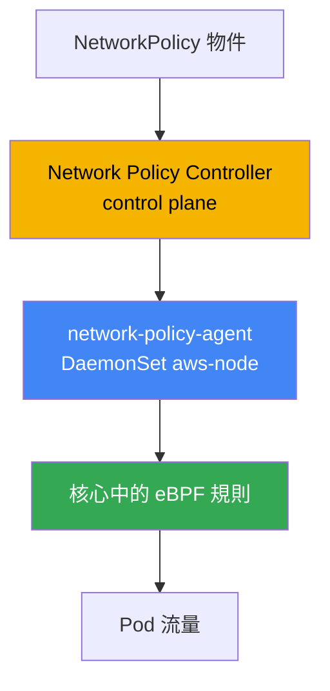
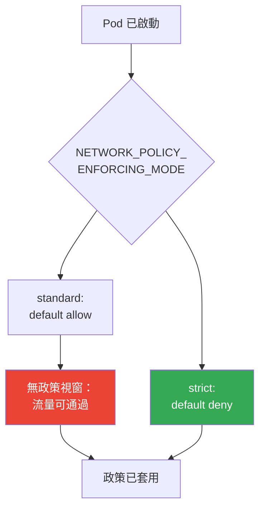
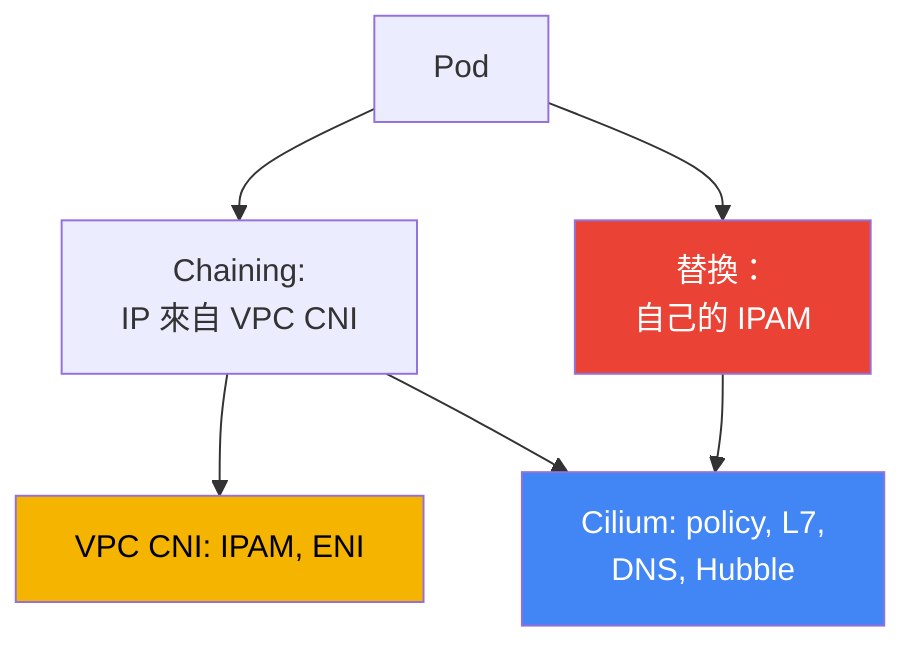

[Eng version](en.md) · [Русская версия](ru.md) · [Versión en español](es.md) · [Version française](fr.md) · [Deutsche Version](de.md) · [ქართული ვერსია](ge.md) · [日本語版](jp.md)
# 第 30 章。EKS 中的 NetworkPolicy：VPC CNI network policy 與 Cilium

> **接下來。** 第 26 至 29 章說明流量如何從外部進入叢集：NLB（第 26 章）、
> ALB（第 27 章）、Gateway API（第 28 章）、DNS 與憑證（第 29 章）。本章討論
> east-west，也就是透過 NetworkPolicy 隔離 Pod 彼此之間的流量。替代 CNI 的概覽，以及
> VPC CNI 如何為 Pod 指派 IP，請見第 8 章；對外 egress 與流量成本請見第 31 章；透過
> Kyverno 與 Gatekeeper 實作多租戶與政策請見第 22 章（那是 admission，不是
> NetworkPolicy）。本章只討論一件事：在 EKS 中，究竟由誰以及如何實際封鎖 Pod 之間的封包。

## 30.1.「已套用政策，但流量還是能通」

您已熟悉 Kubernetes：NetworkPolicy 是標準物件，namespace 中的 `default deny` 會封鎖
所有 ingress，之後再由規則開放所需流量。在全新的 EKS 叢集中，工程師完全按照 CKA 所學
操作：套用拒絕政策，並預期 Pod 之間的連線會中斷。

```bash
kubectl apply -f default-deny.yaml
kubectl get netpol
# NAME           POD-SELECTOR   AGE
# default-deny   <none>         10s
```

政策已存在，selector 為空，表示涵蓋該 namespace 的所有 Pod。按照 CKA 的邏輯，相鄰的
Pod 現在不應再能連到目標。但測試結果卻相反：

```bash
kubectl exec deploy/client -- curl -s -m 3 http://web.default.svc.cluster.local
# <html>... 200 OK - 連線成功，原本應被封鎖
```

流量照常通過，如同根本沒有政策。這不是 manifest 的錯誤，也不是 selector 的拼字問題。
原因是 EKS 預設**沒有人執行 NetworkPolicy**。API 中有該物件，但基本 VPC CNI 設定中
沒有會將它轉換為節點規則的元件。在啟用此功能之前，VPC CNI 會直接忽略 NetworkPolicy
物件，叢集內所有連通性都保持允許。

這是 EKS 的特性：NetworkPolicy 物件屬於 Kubernetes API，因此始終可以建立，但 enforcement
（誰來切斷封包）由 CNI 提供，而不是 API server。在 kind、Minikube 或使用 Calico 的叢集中，
enforcer 已經安裝，您在 CKA 中不會注意到它。在 EKS 中必須有意識地啟用它。

## 30.2. 為何需要 enforcer，以及 VPC CNI network policy 提供什麼

NetworkPolicy 是對期望狀態的宣告：「只允許這類 ingress 進入此 Pod」。必須有人讀取該宣告，
並將其轉換成封包路徑上的實際過濾器。這就是 **enforcer**，也就是 CNI 的一部分。沒有 enforcer，
就沒有過濾，建立再多物件也無濟於事。

VPC CNI 內建此 enforcer，但預設關閉。它由兩部分組成：

- control plane 上的 **Network Policy Controller**。由 AWS 維護。控制器監控 NetworkPolicy
  物件與 Pod，計算每個 Pod 允許哪些確切 endpoint，並將結果下發至節點。
- 每個節點上的 **network-policy-agent**，它是 `aws-node` DaemonSet 中、緊鄰 CNI 本身的
  獨立容器 `aws-network-policy-agent`。此 agent 透過核心中的 **eBPF** 編寫規則，並確保
  Pod 流量遵循政策。



透過 VPC CNI addon 的旗標啟用此功能，也就是 managed addon 設定中的 `enableNetworkPolicy`
參數。其值以字串指定：

```json
{
    "enableNetworkPolicy": "true",
    "nodeAgent": {
        "healthProbeBindAddr": "8163",
        "metricsBindAddr": "8162"
    }
}
```

啟用後，aws-node 容器會出現 `--enable-network-policy=true` 參數，而 agent 會在連接埠 `8162`
監聽 metrics，並在 `8163` 監聽 health check（自 VPC CNI `v1.14.1` 起連接埠可設定）。
`enableNetworkPolicy` 參數本身從 `v1.14.0-eksbuild.3` 起可用；如需完整支援標準政策，請保持
VPC CNI 至少為 `1.21`。節點需要 Linux 核心 `5.10` 或更新版本，最新 EKS 最佳化的 AL2023
與 Bottlerocket 已具備此條件。

從維運角度看，這裡的價值在於它是 **managed addon**。enforcer 由 AWS 自行維護，隨 VPC CNI
addon 一起更新，並且理解**標準 Kubernetes NetworkPolicy**，也就是您在 CKA 中寫過的相同物件，
不需要專屬 CRD 或重新學習。

## 30.3. Pod 啟動時的政策套用順序，以及無政策視窗

有一個細節決定您是否存在安全漏洞。Pod 啟動時，network-policy-agent 會**並行**於 Pod
provisioning 設定其規則。在新 Pod 的所有政策尚未完全下發之前，其行為取決於 enforcement
模式。

VPC CNI 透過 aws-node 容器中的 `NETWORK_POLICY_ENFORCING_MODE` 變數管理此項：

- **standard**（預設）：「政策套用前」，Pod 採用 *default allow*，所有 ingress 與 egress
  都獲准。從「Pod 已開始接收流量」到「規則已下發」之間存在一個沒有過濾的視窗。對剛啟動的
  Pod 而言，這是風險：在 agent 追上之前，它比預想中更廣泛地可被存取。
- **strict**：Pod 以 *default deny* 啟動，之後才加入允許項目。沒有滲透視窗：在政策到位前，
  任何流量都無法通過。



嚴格模式以便利性為代價。在 strict 模式中，政策必須涵蓋 Pod 存取的**每一個** endpoint，
包括 CoreDNS：若忘記允許 DNS，Pod 無法解析名稱並會在啟動時失敗。因此應有意識地啟用 strict，
並搭配基礎的基礎架構流量政策組合（首先是 DNS）。對使用 host networking 的 Pod，不會套用
default deny。

Cilium 透過自身選項解決相同問題：嚴格的初始隔離模式可另外設定
（`policy-enforcement-mode`）。核心概念相同：要麼為了避免 Pod 失敗而接受視窗，要麼以
完整描述允許流量為代價關閉視窗。

## 30.4. VPC CNI network policy 能做什麼，以及缺少什麼

內建 enforcer 完整支援標準 Kubernetes NetworkPolicy，而且做得很好：ingress 與 egress、
依 `podSelector`、`namespaceSelector`、`ipBlock` 篩選，以及依連接埠與通訊協定限制。對絕大
多數微分段需求（「frontend 只能連到 backend」、「只允許應用程式連入資料庫」）這已足夠，
並且全部都由 AWS 支援、作為 addon 更新。

界限始於需要 L3/L4 之上層級的情境：

- **沒有 L7 規則。** 無法寫出「只允許 `GET /api`，但不允許 `POST`」，或依 HTTP header、
  gRPC method、Kafka topic 篩選。VPC CNI 運作於 IP 與連接埠層級。
- **沒有依 DNS 名稱的政策。** 無法表示「允許 egress 至 `api.stripe.com`」。僅能透過
  `ipBlock` 依 IP 與 CIDR 指定，但外部服務的位址會變動。
- **沒有 Cilium 叢集 CRD**：`CiliumNetworkPolicy` 與 `CiliumClusterwideNetworkPolicy`。
  標準 NetworkPolicy 總是綁定 namespace；在此模型中沒有一條涵蓋「整個叢集」的單一政策
  （AdminNetworkPolicy 是新版的另一項功能，但不是 Cilium CRD）。
- **沒有 Hubble** 及其可觀測性。沒有流量圖，也沒有每條 flow 的 verdict「封包因某項政策
  被允許或拒絕」。除錯依賴 agent logs 與 metrics，而非 UI 圖表。

若這些能力不足，下一步便是 Cilium。但首先重要的是理解您將獲得什麼，以及為此付出的代價。

## 30.5. 標準政策：default deny、podSelector、namespaceSelector、egress

您已熟悉 CKA 的語法，在 EKS 中不會改變，改變的只有現在有人會執行它。應牢記基礎組合。
封鎖 namespace 中所有入站流量是任何分段的基礎：

```yaml
apiVersion: networking.k8s.io/v1
kind: NetworkPolicy
metadata:
  name: default-deny-ingress
  namespace: shop
spec:
  podSelector: {}          # namespace 中的所有 Pod
  policyTypes: ["Ingress"] # 空 ingress = 不允許任何流量
```

依 `podSelector` 允許：僅允許同一 namespace 中帶有 `app: frontend` 標籤的 Pod，進入帶有
`app: api` 標籤的 Pod：

```yaml
spec:
  podSelector:
    matchLabels: { app: api }
  ingress:
    - from:
        - podSelector:
            matchLabels: { app: frontend }
      ports:
        - { protocol: TCP, port: 8080 }
```

依 `namespaceSelector` 允許：僅允許來自帶有 `team: payments` 標籤之 namespace 的流量
（必須預先為 namespace 加上該標籤）：

```yaml
  ingress:
    - from:
        - namespaceSelector:
            matchLabels: { team: payments }
```

限制 egress：只允許 Pod 對 backend 與 DNS 發出流量。DNS 是必需的，否則 Pod 會失去名稱解析，
這是「套用 default deny egress 後故障」最常見的原因：

```yaml
spec:
  podSelector:
    matchLabels: { app: frontend }
  policyTypes: ["Egress"]
  egress:
    - to:
        - podSelector:
            matchLabels: { app: api }
    - to:                          # 到 kube-system 中 CoreDNS 的 DNS
        - namespaceSelector:
            matchLabels: { kubernetes.io/metadata.name: kube-system }
      ports:
        - { protocol: UDP, port: 53 }
        - { protocol: TCP, port: 53 }
```

DNS 並非唯一會被 default deny egress 中斷的基礎架構位址。Pod 與 namespace selector 對
link-local 位址不適用，因此需透過 `ipBlock` 開放。使用 default deny egress 時，請牢記必要
例外清單：對 CoreDNS 的 DNS（UDP/TCP 53，已於上方示範）、Pod Identity agent `169.254.170.23`，
以及視需要而定的 IMDS `169.254.169.254`。最痛苦的中斷是 Pod Identity agent：封鎖對它的
egress 後，Pod 無法取得角色的暫時性憑證，並會在第一次 AWS 呼叫時失敗（第 17 章）。Pod
通常不需要 IMDS，只應在 Pod 實際存取 metadata 時開放（第 19 章）：

```yaml
  egress:
    - to:                          # Pod Identity agent，否則沒有 AWS 憑證（第 17 章）
        - ipBlock: { cidr: 169.254.170.23/32 }
      ports:
        - { protocol: TCP, port: 80 }
    - to:                          # IMDS，僅在 Pod 存取 metadata 時需要（第 19 章）
        - ipBlock: { cidr: 169.254.169.254/32 }
      ports:
        - { protocol: TCP, port: 80 }
```

上述內容在 VPC CNI network policy 與 Cilium 中都相同，因為它是標準 API。差異只會在標準 API
規則不再足夠時顯現。

## 30.6. Cilium：VPC CNI 上的 chaining 與完整替換

在 EKS 中部署 Cilium 有兩種模式，且它們代表根本不同的責任承諾。

**VPC CNI 上的 CNI chaining。** Pod 位址仍由 VPC CNI 指派，IPAM、ENI 與整個 IP 規劃仍由其
負責（第 8 章）。Cilium 從「上層」接入：VPC CNI 設定好 Pod 網路後，會呼叫 Cilium，由它將
自己的 eBPF 程式附加到已建立的介面，加入 **policy engine、L7 規則、依 DNS 名稱的政策與
Hubble**。IP 位址模型不變，與 VPC 的整合仍保留。這是最溫和的路徑：AWS 負責位址，Cilium
負責政策與可觀測性。

**完整替換 VPC CNI。** Cilium 成為唯一的 CNI：移除 DaemonSet `aws-node`，Cilium 完整接管
IPAM。有兩個選項：**ENI 模式**（Cilium 自行管理 ENI 並指派 VPC 位址）或 **overlay**（在
VXLAN 之上使用自己的 overlay，Pod 位址不來自 VPC）。您將獲得最大的控制權與完整 Cilium
功能集，但 CNI 的整個生命週期也從此由您承擔。



兩種模式都會提供 `CiliumNetworkPolicy` 與 `CiliumClusterwideNetworkPolicy`，這些 CRD 支援
L7 規則、FQDN 篩選與叢集層級政策，並以 Hubble 觀測流量。Cilium 同樣會執行標準 Kubernetes
NetworkPolicy，不必重寫既有政策。

## 30.7. 遷移至 Cilium 的真實代價與比較表

Cilium 是強大的工具，但不是「勾選一個方塊」。遷移，特別是替換模式，會改變責任模型，這一點
必須在遷移前接受，而不是在事故發生時才面對。

- **您擁有 CNI 生命週期。** 替換模式下，您維護叢集網路：設定、IPAM 模式與 Kubernetes
  版本相容性都由您負責。
- **升級不再是 managed addon。** VPC CNI 曾作為受 AWS 支援的 EKS addon 更新；Cilium 需由您
  透過 Helm 自行升級、規劃維護時段並驗證相容性。
- **網路故障診斷更複雜。** Pod 與 VPC 之間加入 Cilium 層（chaining 時甚至同時有兩個 CNI）。
  分析「為何封包未送達」需要理解 Cilium datapath 與 VPC 網路。
- **部分 AWS 整合不再「開箱即用」。** AWS 支援並涵蓋 VPC CNI 的情境；Cilium 作為雲端節點的
  CNI 不在其支援範圍內，部分對 VPC CNI 的依賴必須自行解決。

實務結論：不要為了勾選功能而更換 CNI。若標準 NetworkPolicy 已足夠，請留在 VPC CNI network
policy。若需要 L7 或 DNS 政策，從 chaining 開始，讓 AWS 保留位址管理。只有在存在明確需求、
並理解代價時，才採用完整替換。

| 能力 | VPC CNI network policy | Cilium | 使用 Cilium 的代價 |
|---|---|---|---|
| 標準 K8s NetworkPolicy | 是 | 是 | - |
| L7 規則（HTTP、gRPC） | 否 | 是 | 自有 policy engine，除錯更複雜 |
| 依 DNS 名稱的政策（FQDN） | 否 | 是 | datapath 多一層 |
| 叢集層級政策 | 否（僅 namespace） | CiliumClusterwidePolicy | 新 CRD、團隊學習成本 |
| 流量可觀測性 | agent metrics 與 logs | Hubble、流量圖 | 維運中多一個元件 |
| 更新模型 | managed addon、AWS 支援 | Helm、由您負責 | 升級與相容性由您承擔 |
| Pod IP 位址管理 | VPC CNI | VPC CNI（chaining）或自有 IPAM | 替換時需擁有 IPAM |

## 30.8. 如何在 production 中套用

- **從啟用 enforcer 開始。** 沒有 `enableNetworkPolicy`，任何 NetworkPolicy 都只是空物件。
  新叢集的第一步，是啟用 addon 參數，並確認 agent 已在所有節點上運行。
- **在每個工作 namespace 設定 default deny。** 預設拒絕 ingress（接著是 egress），再精確
  開放需要的項目。沒有基礎 deny 就沒有分段。
- **明確允許 DNS。** 限制 egress 時，首先開放對 CoreDNS 的 UDP/TCP 53，否則 Pod 會失去
  名稱解析。應將規則寫入範本，而不是在事故時才想起。
- **strict mode 應依需求啟用，而非預設。** 僅在合理之處以 strict 關閉 default-allow 視窗，
  並預先描述基礎架構流量，包括 DNS。
- **依需求採用 Cilium，而不是因為潮流。** 若需要 L7 或 FQDN 政策，先使用 chaining，並保留
  VPC CNI 的 IPAM；只有明確需求才使用完整替換。
- **在 Git 中版本化政策。** NetworkPolicy 與 Deployment 一樣是程式碼：放在 repository 中，
  並透過 GitOps（第 44 章）部署，而非直接在叢集中手動修改。

## 30.9. 迷你詞彙表

- **NetworkPolicy**：宣告 Pod 允許 ingress 與 egress 的標準 Kubernetes 物件；沒有 enforcer
  時本身不會封鎖任何流量。
- **enforcer**：將 NetworkPolicy 轉換為實際流量過濾器的 CNI 元件；EKS 預設不存在，直到啟用。
- **VPC CNI network policy**：VPC CNI 內建的 enforcement 實作：control plane 上的 Network
  Policy Controller 與節點上透過 eBPF 運作的 network-policy-agent。
- **enableNetworkPolicy**：啟用標準 NetworkPolicy enforcement 的 VPC CNI managed addon 參數。
- **NETWORK_POLICY_ENFORCING_MODE**：aws-node 變數：`standard`（政策套用前 default allow）
  或 `strict`（從第一秒開始 default deny）。
- **CNI chaining**：VPC CNI 上的 Cilium 模式：VPC CNI 指派 IP，Cilium 加入政策、L7、DNS 規則
  與 Hubble。
- **CiliumNetworkPolicy / CiliumClusterwideNetworkPolicy**：Cilium 的 CRD，支援 L7 與 FQDN
  規則以及叢集層級作用範圍。
- **Hubble**：Cilium 的可觀測性子系統：流量圖與每條 flow verdict，這是 VPC CNI network policy
  所沒有的功能。

## 30.10. 本章摘要

- 在 EKS 中，NetworkPolicy 物件始終可以建立，但預設沒有人執行它：未啟用功能的 VPC CNI
  會忽略政策，所有 east-west 流量皆被允許。
- 透過 VPC CNI managed addon 的 `enableNetworkPolicy` 參數啟用 enforcement；control plane
  上的 Network Policy Controller 與節點上的 network-policy-agent（eBPF）會開始運作。
- 這是由 AWS 支援的 managed addon，理解標準 Kubernetes NetworkPolicy，使用與 CKA 相同的
  語法，不需要專屬 CRD。
- Pod 啟動時，政策會平行套用：`standard` 有 default-allow 視窗，而 `strict` 立即 default-deny，
  但需要為每個 endpoint（包括 DNS）設置政策。
- VPC CNI network policy 不提供 L7 規則、依 DNS 名稱的政策、Cilium 的叢集 CRD 及 Hubble；
  但對 L3/L4 分段通常已足夠。
- Cilium 有兩種接入模式：VPC CNI 上的 chaining（VPC CNI 提供 IP，Cilium 提供政策與 Hubble），
  或使用自有 IPAM 完整替換（ENI 模式或 overlay）。
- Cilium 的真實代價是擁有 CNI 生命週期、在 managed addon 之外升級、更複雜的診斷，以及部分
  AWS 整合不再「開箱即用」。
- 選擇原則：標準 NetworkPolicy 足夠時用 VPC CNI；需要 L7 或 FQDN 時用 chaining；僅有明確
  要求時才完整替換。

## 30.11. 如何在實際工作中派上用場

值班時，分析「政策不運作」的第一個問題是 enforcer 是否已啟用。若未設定
`enableNetworkPolicy`，任何 NetworkPolicy 都沒有意義，應在分析 selector 前首先檢查。第二個
常見事故是「default deny egress 後應用程式無法解析名稱」：幾乎總是忘記開放到 CoreDNS 的 DNS。
第三個是 strict 模式下 Pod 無法啟動，因為缺少其所需基礎架構流量的政策。

規劃時請預先確定三項決策。是否啟用 strict mode，以及哪些基礎政策組合（首先是 DNS）要在工作
負載之前部署。L3/L4 是否已足夠，還是需要 L7 與 FQDN，這決定您要留在 VPC CNI 或採用 Cilium。
如果選擇 Cilium，還須決定採用哪個模式：chaining 保留 VPC CNI 的 IPAM 與 AWS 支援，而替換模式
則將整個 CNI 生命週期交給您。

## 30.12. 自我檢查問題

1. 為何全新 EKS 叢集中套用的 default deny 不會封鎖 Pod 之間的流量？
2. enforcer 是什麼？為何沒有它時，NetworkPolicy 物件本身無法切斷任何流量？
3. VPC CNI network policy 由哪兩個元件組成，且各自在何處運作？
4. 以哪個 addon 參數啟用 enforcement，aws-node 中會出現哪個容器？
5. `NETWORK_POLICY_ENFORCING_MODE` 中的 `standard` 與 `strict` 模式有何差異？
6. Pod 啟動時的「無政策視窗」是什麼，為何危險？
7. 為何 strict 模式中務必預先允許到 CoreDNS 的流量？
8. 與 Cilium 相比，VPC CNI network policy 缺少哪些能力？
9. CNI chaining 模式的 Cilium 與完整替換 VPC CNI 模式有何不同？
10. chaining 模式中誰為 Pod 指派 IP 位址，為何這很重要？
11. 替換模式下遷移至 Cilium 的真實代價由哪些部分組成？
12. 應依何種原則在 VPC CNI network policy 與 Cilium 之間選擇？
13. 若一般 NetworkPolicy 綁定 namespace，為何還需要 `CiliumClusterwideNetworkPolicy`？

## 實作練習

本主題對應課程的兩個 lab：[lab 110，EKS 中的 NetworkPolicy：內建 VPC CNI network
policy](../../labs/110/README_TW.MD) 與 [lab 132，替代 CNI：VPC CNI 上以 CNI chaining
模式執行的 Cilium](../../labs/132/README_TW.MD)。此外，所有內容都可在實際叢集上驗證。先確認
enforcer 是否確實啟用，以及 policy agent 是否已在節點上運行：

```bash
kubectl get daemonset aws-node -n kube-system -o yaml | grep -A2 aws-network-policy-agent
kubectl get pods -n kube-system -l k8s-app=aws-node        # agent 與 CNI 一起運行
aws eks describe-addon --cluster-name my-cluster \
  --addon-name vpc-cni --query "addon.configurationValues"  # 尋找 enableNetworkPolicy
```

接著重現 30.1 的問題並檢查流量是否被切斷。建立一對 Pod、在政策前檢查連通性、套用 default deny，
然後再次檢查：

```bash
kubectl run web --image=nginx --labels app=web --expose --port 80
kubectl run client --image=curlimages/curl -- sleep 3600
kubectl exec client -- curl -s -m 3 http://web         # 政策前：可通過
kubectl apply -f default-deny.yaml                      # podSelector: {}，僅 Ingress
kubectl get netpol
kubectl exec client -- curl -s -m 3 http://web         # 政策後：應因逾時中斷
```

若 default deny 後連線仍然通過，表示 enforcer 未啟用，請回到第一項檢查。接著依 `podSelector`
加入允許政策，確認所需流量再次通過，而不需要的流量仍保持封鎖。

---
[目錄](../README_TW.md) · [第 29 章](../29/tw.md) · [第 31 章](../31/tw.md)
