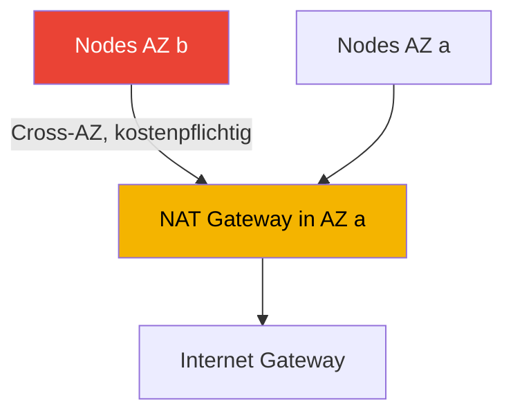
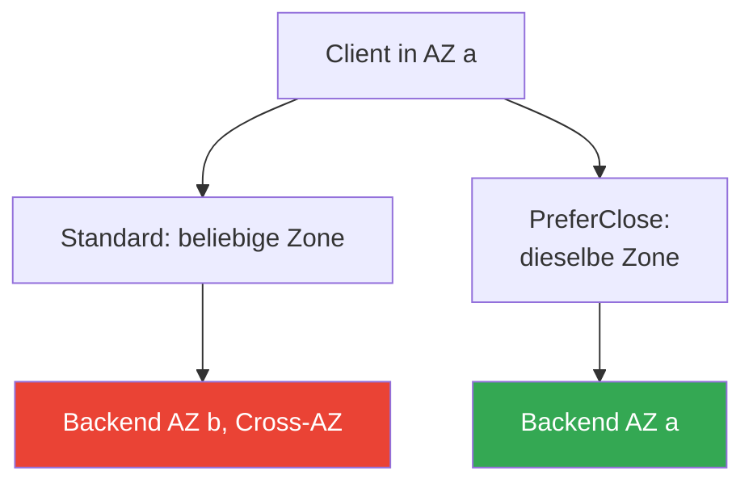

[Русская версия](ru.md) · [Eng version](en.md) · [Versión en español](es.md) · [Version française](fr.md) · [ქართული ვერსია](ge.md) · [繁體中文版](tw.md) · [日本語版](jp.md)
# Kapitel 31. Egress und Traffic-Kosten: NAT, VPC Endpoints, PrivateLink

> **Wie es weitergeht.** Die Kapitel 26-30 behandelten den Zugang zum Cluster und die Isolierung: NLB (Kapitel 26), ALB (Kapitel 27), Gateway API (Kapitel 28), DNS und Zertifikate (Kapitel 29), NetworkPolicy (Kapitel 30). Hier geht es in die umgekehrte Richtung: ausgehender Traffic und dessen Kosten: NAT Gateway, VPC Endpoints, PrivateLink, Cross-AZ. Der grundlegende Aufbau von VPC, Subnetzen und NAT wird in Teil 0 (Kapitel 00-3) erklärt, die Kosten des Clusters insgesamt sowie Kubecost/OpenCost in Kapitel 43, Multi-Cluster- und Multi-Account-Konnektivität in Kapitel 32; der private Zugriff auf S3 für Mountpoint wurde in Kapitel 25 erwähnt. Hier geht es um eines: Wohin der Egress-Traffic von Pods in EKS fließt und warum er Kosten verursacht.

## 31.1. „Der Cluster läuft, doch im Konto wächst eine eigene Zeile für Data Transfer“

Der Cluster ist korrekt aufgebaut: Nodes in privaten Subnetzen, der Zugang nach außen erfolgt über ein NAT Gateway, wie es jeder VPC-Leitfaden lehrt. Die Workloads laufen, es gibt keine Incidents. Doch nach einem Monat erscheint in Cost Explorer eine Position, die niemand eingeplant hatte:

```
NatGateway-Bytes         ... hoher Betrag
DataTransfer-Regional-Bytes  ... vergleichbarer Betrag
NatGateway-Hours         ... spürbarer Betrag
```

Diese Positionen sind nicht an Instanzen oder Volumes gebunden, sie erscheinen nicht in `kubectl top` und lassen sich nicht mit HPA abfangen. Ihre Quelle ist der Netzwerkverkehr der Pods selbst: Für jedes Gigabyte, das durch das NAT Gateway läuft, fällt eine Verarbeitungsgebühr an, und für Traffic zwischen Availability Zones wird die Übertragung in beide Richtungen berechnet. Beides entsteht unbemerkt:

- Pods ziehen Images aus ECR: Die Layer liegen in S3, und der Pull läuft über NAT nach außen.
- Eine Anwendung greift auf S3, DynamoDB oder externe APIs zu: Der gesamte Egress läuft über NAT.
- Ein Pod in AZ `a` kommuniziert mit einem Pod oder einer Datenbank in AZ `b`: Das ist Cross-AZ und wird berechnet.
- CloudWatch Logs, STS für IRSA, Aufrufe der EC2 API: All das sind ausgehende Bytes.

Nichts daran ist „defekt“. Netzwerkverkehr ist in der Cloud schlicht eine kostenpflichtige Ressource, und in EKS erzeugen ihn nicht Engineers manuell, sondern Hunderte Pods automatisch. Solange der Egress-Pfad nicht gestaltet ist (NAT pro Zone, VPC Endpoints für Traffic zu AWS), wächst die Rechnung für Data Transfer lautlos. Sehen wir uns an, woraus sie besteht und was der Engineer beeinflussen kann.

## 31.2. NAT Gateway: Wozu es dient und sein Kostenmodell

EKS-Nodes in Produktion befinden sich in privaten Subnetzen: Sie haben keine öffentlichen IPs und sind aus dem Internet nicht erreichbar. Die Pods selbst benötigen jedoch ausgehenden Zugang: Image-Pulls, Aufrufe externer APIs und Updates. Damit ein privates Subnetz ausgehende Verbindungen ins Internet initiieren kann, wird in einem öffentlichen Subnetz ein **NAT Gateway** bereitgestellt, ein verwalteter AWS-Dienst zur Adressübersetzung. Die Route `0.0.0.0/0` aus dem privaten Subnetz führt zum NAT, das NAT zum Internet Gateway.

Das Kostenmodell eines NAT Gateway besteht aus zwei unabhängigen Teilen:

- **Stündliche Gebühr** für das NAT Gateway selbst: Sie fällt an, solange es existiert, unabhängig vom Traffic.
- **Gebühr für verarbeitete Daten**: Sie fällt für jedes Gigabyte an, das in beliebiger Richtung durch das NAT läuft.

Der zweite Teil ist die Falle. NAT verlangt Geld für die Verarbeitung jedes Gigabytes Egress, und wenn der gesamte ausgehende Cluster-Traffic darüber läuft, also Image-Pulls, AWS-API-Aufrufe und Zugriffe auf S3, wächst das Volumen schnell. Traffic zu AWS-Diensten (S3, ECR, DynamoDB) über NAT wird dabei wie gewöhnlicher Egress berechnet, obwohl diese Dienste im AWS-Netz liegen und keinen Weg über NAT ins Internet benötigen. Dies wird zuerst optimiert (VPC Endpoints, Abschnitt 31.3).

### Die Cross-AZ-Falle: Ein NAT für den gesamten Cluster

Die größte Quelle unerwarteter Rechnungen ist die falsche Platzierung von NAT nach Zonen. Ein NAT Gateway befindet sich in einer bestimmten AZ. Wird ein einzelnes NAT in AZ `a` platziert und sind Nodes über drei Zonen verteilt, läuft der Traffic der Nodes aus AZ `b` und `c` zunächst **über die Zonengrenze** zum NAT in `a` und erst danach nach außen. Dieser Cross-AZ-Hop wird zusätzlich zur NAT-Verarbeitung berechnet: Sie zahlen doppelt.



Die richtige Architektur ist **ein NAT Gateway pro AZ**, in der sich Nodes befinden, und die Route des privaten Subnetzes führt zu dem NAT in derselben Zone. Dann überschreitet der Egress vor dem Weg nach außen keine AZ-Grenze; die Cross-AZ-Gebühr für diesen Abschnitt entfällt. Die stündlichen Kosten wachsen zwar (es gibt nun ein NAT pro Zone statt nur eines), doch die Einsparungen durch das Beseitigen von Cross-AZ und die geringeren Risiken überwiegen gewöhnlich. Zusätzlich führt der Ausfall einer AZ nicht dazu, dass Nodes in anderen Zonen keinen Egress mehr haben.

| NAT-Schema | Cross-AZ-Egress | Ausfallsicherheit | Stündliche Gebühr |
|---|---|---|---|
| Ein NAT pro Cluster | vorhanden, für den gesamten Traffic aus fremden AZs | Ausfall einer AZ unterbricht Egress für alle | minimal |
| Ein NAT pro AZ | nicht auf dem Abschnitt bis zum NAT | Ausfall einer AZ betrifft die anderen nicht | höher, entsprechend der Anzahl Zonen |

## 31.3. VPC Endpoints: zwei Typen und ihr Unterschied

Ein VPC Endpoint ermöglicht den Zugang zu einem AWS-Dienst, ohne das Internet zu nutzen und unter Umgehung von NAT. Der Traffic bleibt im AWS-Netz. Es gibt genau zwei Typen, die unterschiedlich funktionieren.

**Gateway Endpoints.** Sie werden nur für **S3 und DynamoDB** unterstützt. Dabei handelt es sich um einen Eintrag in der Routing-Tabelle des Subnetzes: Traffic zu den Präfixen von S3/DynamoDB in der Region wird zum Endpoint statt zum NAT geleitet. Gateway Endpoints sind **kostenlos**: Es fallen weder stündliche Gebühren noch Datengebühren an. Für EKS bedeutet das eine unmittelbare Einsparung: Der Pull von Image-Layern aus ECR greift auf S3 zu; mit einem Gateway Endpoint für S3 verschwindet dieses Volumen vom NAT und nimmt den kostenlosen Pfad. Dasselbe gilt für Anwendungen, die intensiv mit S3 arbeiten.

**Interface Endpoints.** Sie basieren auf **AWS PrivateLink**. Im Subnetz wird ein ENI mit privater IP erstellt, an den Aufrufe des Dienstes gerichtet werden. Sie unterstützen die meisten AWS-Dienste, nicht nur S3/DynamoDB. Kosten: **eine stündliche Gebühr pro Endpoint** plus **eine Gebühr für verarbeitete Daten**. Sie sind teurer als Gateway Endpoints, nehmen jedoch NAT aus dem Pfad zum Dienst und halten den Traffic privat. Bei aktiviertem Private DNS nutzen Anwendungen weiterhin die öffentlichen Namen der Dienste, ohne Codeänderungen: Die Namensauflösung wird auf die private IP des Endpoints umgeleitet.

| Eigenschaft | Gateway Endpoint | Interface Endpoint |
|---|---|---|
| Grundlage | Eintrag in der Route Table | PrivateLink, ENI im Subnetz |
| Dienste | nur S3 und DynamoDB | die meisten AWS-Dienste |
| Kosten | kostenlos | stündlich + pro Datenmenge |
| Umsetzung | Route zu Dienstpräfixen | private IP, Private DNS |
| Traffic umgeht NAT | ja | ja |

Beide Typen haben gemeinsam, dass der Traffic zum Dienst nicht über NAT läuft und das AWS-Netz nicht verlässt. Sie unterscheiden sich bei Preis und Abdeckung. Die Regel ist einfach: Für S3 und DynamoDB immer Gateway verwenden (es ist kostenlos), für andere Dienste Interface dort einsetzen, wo NAT entfernt oder Privatheit benötigt wird.

## 31.4. Welche Endpoints für EKS wichtig sind

Ein gewöhnlicher Cluster mit Internetzugang benötigt Endpoints nicht zwingend, doch sie nehmen den Traffic zu AWS vom kostenpflichtigen NAT. Für einen **privaten Cluster** ohne Zugang nach außen (Kapitel 19) sind sie notwendig: Ohne sie registrieren sich die Nodes nicht, und Pods erhalten weder Images noch Credentials. AWS nennt für einen privaten Cluster folgenden Satz:

| Endpoint | Typ | Zweck |
|---|---|---|
| com.amazonaws.`region`.s3 | Gateway | ECR-Image-Layer und Zugriff von Anwendungen auf S3 |
| com.amazonaws.`region`.ecr.api | Interface | ECR API, Authentifizierung und Metadaten |
| com.amazonaws.`region`.ecr.dkr | Interface | Pull der eigentlichen Images aus ECR |
| com.amazonaws.`region`.sts | Interface | STS für IRSA (AssumeRoleWithWebIdentity) |
| com.amazonaws.`region`.eks-auth | Interface | Abruf von Credentials für EKS Pod Identity |
| com.amazonaws.`region`.ec2 | Interface | EC2 API, einschließlich DNS-Name der Node auf EKS-optimiertem AMI |
| com.amazonaws.`region`.elasticloadbalancing | Interface | Betrieb des AWS Load Balancer Controller |
| com.amazonaws.`region`.logs | Interface | Senden von Node- und Pod-Logs an CloudWatch Logs |

Leicht zu übersehende Details:

- **ECR zieht Images aus S3.** Für den Pull werden alle drei benötigt: `ecr.api`, `ecr.dkr` und Gateway für `s3`. Ohne S3-Endpoint funktioniert die Authentifizierung in ECR, das Herunterladen der Layer jedoch nicht.
- **IRSA gegenüber Pod Identity.** IRSA verwendet `sts` (zusätzlich den OIDC-Endpoint `oidc-eks`, um den Zugriff auf die Cluster-JWKS zu privatisieren); Pod Identity verwendet `eks-auth`. Was davon erforderlich ist, hängt vom gewählten Identitätsmechanismus ab (Kapitel 16-17).
- **STS ist standardmäßig global.** Viele SDKs rufen `sts.amazonaws.com` auf und umgehen damit den regionalen Endpoint. In einem privaten Cluster werden SDKs auf den regionalen STS-Endpoint der Region umgestellt.
- **Private DNS.** Für Interface Endpoints wird Private DNS aktiviert, damit Workloads die öffentlichen Dienstnamen unverändert verwenden können.

Nach Bedarf kommen `ssm`, `xray`, `autoscaling`, `eks` und weitere hinzu; die vollständige Liste der Dienste für PrivateLink finden Sie in der Dokumentation. Das Prinzip: Aktivieren Sie einen Endpoint für jeden AWS-Dienst, den Pods und Systemkomponenten tatsächlich aufrufen.

## 31.5. PrivateLink: privater Zugriff auf Dienste

Interface Endpoints sind ein Sonderfall von **AWS PrivateLink**, einem Mechanismus für privaten Zugriff auf Dienste über ENIs in Ihrem Subnetz. PrivateLink deckt neben dem Zugriff auf öffentliche AWS-Dienste zwei Szenarien ab:

- **Dienste in einem anderen Account oder bei einem Anbieter.** Der Anbieter (SaaS, ein benachbartes Team) veröffentlicht seinen Dienst als **Endpoint Service**, und der Verbraucher erstellt einen Interface Endpoint, der darauf verweist. Der Traffic läuft privat über das AWS-Netz, ohne Zugang zum Internet, ohne VPC Peering und ohne die Netzwerke gegeneinander zu öffnen. Die Verbindung ist einseitig: Der Verbraucher initiiert, der Anbieter nimmt an.
- **Eigene Dienste zwischen VPCs und Accounts.** Hinter einem NLB kann ein eigener Dienst als Endpoint Service veröffentlicht und anderen Accounts bereitgestellt werden, ohne deren VPCs zu einem gemeinsamen Netzwerk zu verbinden.

Für EKS ist das aus zwei Gründen wichtig. Erstens ermöglicht es Pods den privaten Zugriff auf externe APIs von Anbietern ohne Egress ins Internet: Der Traffic läuft nicht durch NAT und verlässt AWS nicht. Zweitens können Dienste des Clusters selbst über einen Endpoint Service nach außen veröffentlicht werden; dies ist ein Thema der Multi-Account-Konnektivität und wird in Kapitel 32 ausführlich behandelt. Hier genügt: PrivateLink ist derselbe Interface Endpoint, nur kann das Ziel statt eines AWS-Dienstes ein Dienst in einem fremden Account sein.

## 31.6. Cross-AZ-Traffic zwischen Pods und wie er in der Zone bleibt

Die zweite große Quelle für Data Transfer nach NAT ist Pod-zu-Pod-Traffic über eine AZ-Grenze. Standardmäßig verteilt ein Service Anfragen ohne Berücksichtigung der Zone auf alle gesunden Endpoints: Ein Pod in AZ `a` trifft mit gleicher Wahrscheinlichkeit auf ein Backend in `a`, `b` oder `c`. Jede zonenübergreifende Anfrage wird berechnet, und bei einem stark ausgelasteten Service wird dies zu einer spürbaren Position auf der Rechnung.

Kubernetes bietet einen Mechanismus, um Traffic in der eigenen Zone zu halten: **Topology Aware Routing**. Gesteuert wird es über das Feld `trafficDistribution` in der Service-Spezifikation mit dem Wert `PreferClose`: kube-proxy versucht, Anfragen an einen Endpoint in derselben Zone wie der Client zu leiten, und wechselt nur in eine andere Zone, wenn keine lokalen Endpoints existieren. Das Feld wurde in Kubernetes `1.33` GA; in älteren Versionen aktivierte die Annotation `service.kubernetes.io/topology-mode: Auto` dieselbe Logik.

```yaml
apiVersion: v1
kind: Service
metadata:
  name: backend
spec:
  trafficDistribution: PreferClose   # Traffic in der Zone des Clients halten
  selector:
    app: backend
  ports:
    - { port: 80, targetPort: 8080 }
```

Damit es überhaupt lokale Endpoints in jeder Zone gibt, werden Backend-Pods über AZs hinweg mit `topologySpreadConstraints` und dem Schlüssel `topology.kubernetes.io/zone` verteilt. Das eine funktioniert nicht ohne das andere: Wenn alle Backend-Replikate in einer Zone liegen, leitet `PreferClose` den Traffic dennoch über die Grenze. Auf Seite der Load Balancer gibt es einen eigenen Hebel: **Cross-Zone Load Balancing**. Wenn es aktiviert ist, verteilt der LB gleichmäßig auf Ziele in allen Zonen (gleichmäßigere Last, aber mehr Cross-AZ); ist es deaktiviert, bleibt der Traffic in der Eingangszone (günstiger, aber ungleichmäßige Last). Die Einstellung hängt vom Typ des Load Balancers ab und wurde in den Kapiteln 26-27 behandelt.

Hier ist eine ehrliche Einschränkung wichtig. Die Einsparung bei Cross-AZ-Traffic **steht im Konflikt** mit der Zuverlässigkeit von Multi-AZ. Bei Ausfall oder Ungleichgewicht einer Zone hält `PreferClose` Traffic hartnäckig lokal, solange auch nur ein lebender Endpoint vorhanden ist; das kann einen Hotspot erzeugen. Multi-AZ, PDB und Topology Spread als Zuverlässigkeitswerkzeuge werden in Kapitel 40 behandelt; dort liegt auch die Grenze, ab der man zugunsten der Resilienz Cross-AZ-Traffic akzeptieren sollte. Optimieren Sie Traffic nicht auf Kosten der Verfügbarkeit.



## 31.7. Kostenstruktur von Egress: was zu optimieren ist

Nachdem das Gesamtbild klar ist, zerlegen wir den Data Transfer des Clusters in seine Bestandteile. Zahlen sind hier nicht entscheidend, sondern die Struktur und wodurch sich jeder Punkt reduzieren lässt.

| Bestandteil | Was ihn erzeugt | Wodurch er sinkt |
|---|---|---|
| Ausgehend ins Internet | Egress der Pods nach außen, Antworten an externe Clients | Image-Cache, CDN, weniger unnötiger Egress |
| Verarbeitung auf NAT | gesamter Egress privater Subnetze über NAT | VPC Endpoints für Traffic zu AWS |
| Cross-AZ | Pod-zu-Pod und Pod-zu-Datenbank über die Zonengrenze | trafficDistribution, Topology Spread |
| Stündliches NAT | die bloße Existenz eines NAT Gateway | keine überflüssigen NATs, aber eines pro AZ |
| Stündliche Interface Endpoints | jeder Interface Endpoint | nur erforderliche Endpoints, S3/DDB als Gateway |

Die Optimierungspriorität ist gewöhnlich folgende. Zuerst ein **Gateway Endpoint für S3** (kostenlos; entfernt sofort Image-Pulls und Anwendungstraffic zu S3 vom NAT). Danach **NAT pro Zone** statt einem pro Cluster, um Cross-AZ auf dem Egress-Pfad zu entfernen. Anschließend **Interface Endpoints** für Dienste, die Pods häufig nutzen (ECR, Logs, STS), dort, wo die NAT-Verarbeitung teurer ist als die stündliche Endpoint-Gebühr. Parallel dazu **trafficDistribution mit Topology Spread** für stark belastete interne Dienste. Den Effekt sollten Sie anhand der Rechnung und Metriken beurteilen, nicht nach Gefühl (Kapitel 43).

## 31.8. Wie dies in Produktion eingesetzt wird

- **NAT wird einmal pro AZ mit Nodes bereitgestellt.** Ein NAT pro Cluster spart geringe stündliche Gebühren, erzeugt aber Cross-AZ für den gesamten Egress aus anderen Zonen und einen einzelnen Ausfallpunkt.
- **Ein Gateway Endpoint für S3 wird immer aktiviert.** Er ist kostenlos und entfernt ECR-Image-Pulls und Anwendungstraffic zu S3 sofort vom kostenpflichtigen NAT. Dasselbe gilt für DynamoDB, wenn es genutzt wird.
- **Ein privater Cluster wird vom Satz benötigter Endpoints aus aufgebaut.** Vor dem ersten Pod werden ecr.api, ecr.dkr, s3, sts oder eks-auth, ec2, logs, elasticloadbalancing sowie alles eingerichtet, was die Workloads aufrufen.
- **Egress zu AWS wird bewusst vom NAT weggeführt.** Interface Endpoints werden für Dienste mit viel Traffic bereitgestellt; wo NAT-Verarbeitung teurer als die stündliche Endpoint-Gebühr ist, entsteht eine direkte Einsparung.
- **Cross-AZ wird durch Topology Aware Routing reduziert.** Interne Dienste mit viel East-West-Traffic erhalten trafficDistribution PreferClose plus Topology Spread, mit Blick auf den Ausgleich zur Zuverlässigkeit.
- **Traffic wird anhand der Rechnung und Metriken überwacht.** CloudWatch-Metriken des NAT (`BytesOutToDestination`, `BytesInFromDestination`) und Positionen in Cost Explorer zeigen, wo Data Transfer tatsächlich fließt.

## 31.9. Mini-Glossar

- **NAT Gateway**: Verwalteter AWS-Dienst zur Adressübersetzung, der privaten Subnetzen ausgehenden Internetzugang gibt; er wird stündlich und pro verarbeitetem Gigabyte berechnet.
- **Cross-AZ-Traffic**: Datenübertragung zwischen Availability Zones; sie wird für die Übertragung berechnet, üblicherweise in beide Richtungen.
- **VPC Endpoint**: Privater Zugangspunkt zu einem AWS-Dienst ohne Internetzugang und unter Umgehung von NAT.
- **Gateway Endpoint**: Typ eines VPC Endpoint für S3 und DynamoDB über einen Eintrag in der Route Table; kostenlos.
- **Interface Endpoint**: Typ eines VPC Endpoint auf PrivateLink-Basis: ENI im Subnetz, stündliche Gebühr plus Datengebühr.
- **AWS PrivateLink**: Mechanismus für privaten Zugriff auf AWS-Dienste und Dienste in anderen Accounts über einen Interface Endpoint.
- **Endpoint Service**: Veröffentlichung eines eigenen Dienstes (hinter einem NLB) als PrivateLink-Ziel für Verbraucher aus anderen VPCs und Accounts.
- **Topology Aware Routing**: Bevorzugung von Endpoints in der Zone des Clients; wird über das Feld `trafficDistribution: PreferClose` im Service aktiviert.
- **Cross-Zone Load Balancing**: Betriebsmodus eines Load Balancers, der Traffic auf Ziele in allen Zonen verteilt; gleichmäßigere Last, aber mehr Cross-AZ.

## 31.10. Zusammenfassung des Kapitels

- Netzwerkverkehr ist in der Cloud eine kostenpflichtige Ressource, und in EKS erzeugen ihn Hunderte Pods automatisch; Data Transfer ist als eigene Position auf der Rechnung sichtbar, nicht in `kubectl top`.
- Ein NAT Gateway liefert privaten Subnetzen Egress und wird auf zwei Arten berechnet: stündlich sowie für jedes verarbeitete Gigabyte. Letzteres summiert sich durch Image-Pulls und AWS-API-Aufrufe.
- Die größte Falle ist ein NAT pro Cluster: Der Traffic von Nodes aus anderen AZs läuft über die Zonengrenze zum NAT und wird doppelt bezahlt. Richtig ist ein NAT pro AZ mit Nodes.
- VPC Endpoints halten Traffic zu AWS-Diensten im AWS-Netz und umgehen NAT. Gateway (S3, DynamoDB) ist kostenlos; Interface (PrivateLink) kostet stündlich plus Datengebühr, deckt aber fast alle Dienste ab.
- Ein privater Cluster benötigt einen Satz Endpoints: s3 (Gateway), ecr.api, ecr.dkr, sts oder eks-auth, ec2, logs, elasticloadbalancing und weitere nach Bedarf. ECR zieht seine Layer aus S3.
- PrivateLink ermöglicht über einen Endpoint Service privaten Zugriff auf Dienste in anderen Accounts, ohne Internetzugang und ohne VPCs zu einem gemeinsamen Netzwerk zu verbinden.
- Cross-AZ-Pod-zu-Pod-Traffic wird über `trafficDistribution: PreferClose` (GA in 1.33) zusammen mit Topology Spread reduziert; bei Load Balancern wirkt sich Cross-Zone Load Balancing aus.
- Traffic-Einsparungen stehen im Konflikt mit Multi-AZ-Zuverlässigkeit: PreferClose kann bei einem Ungleichgewicht einer Zone einen Hotspot erzeugen. Der Ausgleich wird in Kapitel 40 behandelt.

## 31.11. Wie das bei der täglichen Arbeit hilft

Im Bereitschaftsdienst tritt Egress selten als Incident auf, sondern als Rechnung. Wenn die Finanzabteilung eine gestiegene Position `NatGateway-Bytes` oder `DataTransfer-Regional-Bytes` meldet, folgt die Analyse einer bekannten Kette: Gibt es einen Gateway Endpoint für S3 (sonst hängen Image-Pulls und S3-Traffic am NAT), wie viele NAT Gateways gibt es und wie sind sie über Zonen verteilt, welche internen Dienste transportieren East-West-Traffic über eine AZ-Grenze? NAT-Metriken in CloudWatch und die Aufschlüsselung in Cost Explorer nach Usage Type zeigen, welcher Bestandteil tatsächlich wächst; Raten ist nicht nötig.

Bei der Planung werden drei Entscheidungen im Voraus getroffen. Anzahl und Zonenverteilung von NAT: Eines pro AZ ist fast immer der richtige Standard. Der Satz von VPC Endpoints: Für einen privaten Cluster ist er eine Startvoraussetzung, für einen gewöhnlichen Cluster eine Möglichkeit, AWS-Traffic vom NAT zu entfernen. Und wo Topology Aware Routing aktiviert wird, nachdem Einsparungen bei Cross-AZ gegen Resilienz bei Zonenungleichgewicht abgewogen wurden. Alle drei hängen an den Gesamtkosten des Clusters, die in Kapitel 43 zusammengeführt werden, sowie an der Multi-AZ-Zuverlässigkeit aus Kapitel 40.

## 31.12. Fragen zur Selbstkontrolle

1. Warum wächst Data Transfer in EKS, obwohl Engineers Traffic nicht manuell erzeugen, und wo wird es sichtbar?
2. Aus welchen zwei Teilen bestehen die Kosten eines NAT Gateway und welcher davon ist gewöhnlich unerwartet?
3. Was ist die Falle eines einzelnen NAT Gateway pro Cluster und warum wird dieser Traffic doppelt bezahlt?
4. Wie sollten NAT Gateways über Zonen verteilt werden und was bringt dies außer Einsparungen?
5. Worin unterscheiden sich Gateway Endpoint und Interface Endpoint bei Aufbau, Abdeckung und Kosten?
6. Warum ist für Image-Pulls aus ECR zusätzlich ein Gateway Endpoint für S3 erforderlich?
7. Welcher Satz VPC Endpoints wird für einen privaten EKS-Cluster ohne Internetzugang benötigt?
8. Welche Endpoints werden für IRSA und welche für EKS Pod Identity benötigt?
9. Was ist ein Endpoint Service und welches PrivateLink-Szenario deckt er ab?
10. Wie bleibt Pod-zu-Pod-Traffic in der eigenen Zone, und welches Service-Feld aktiviert dies?
11. Warum funktioniert `trafficDistribution: PreferClose` nicht ohne Topology Spread über Zonen?
12. Wie beeinflusst Cross-Zone Load Balancing die Menge von Cross-AZ-Traffic?
13. Worin besteht der Konflikt zwischen Einsparungen bei Cross-AZ-Traffic und Multi-AZ-Zuverlässigkeit?

## Praxis

Das Kurs-Lab zu diesem Thema: [Lab 117: Traffic und Kosten: NAT pro Zone gegenüber einem NAT, VPC Endpoints, Cross-AZ](../../labs/117/README_DE.MD). Zusätzlich wird der Egress-Pfad des Clusters in einem aktiven Account überprüft. Sehen Sie zunächst nach, wie viele NAT Gateways vorhanden sind und in welchen Zonen sie liegen:

```bash
# NAT Gateways und ihre Subnetze (die AZ wird über das Subnetz bestimmt)
aws ec2 describe-nat-gateways \
  --query "NatGateways[].{Id:NatGatewayId,Subnet:SubnetId,State:State}" --output table

# welche VPC Endpoints bereits in der VPC erstellt wurden
aws ec2 describe-vpc-endpoints \
  --query "VpcEndpoints[].{Name:ServiceName,Type:VpcEndpointType,State:State}" --output table
```

Prüfen Sie, ob sich darunter ein Gateway für S3 und Interface Endpoints für ecr.api/ecr.dkr befinden. Wenn Image-Pulls über NAT laufen, sind sie nicht in der Liste. Schätzen Sie danach über CloudWatch-Metriken im Namespace `AWS/NATGateway`, wie viele Bytes tatsächlich durch NAT laufen:

```bash
# Summe ausgehender Bytes durch NAT pro Tag
aws cloudwatch get-metric-statistics --namespace AWS/NATGateway \
  --metric-name BytesOutToDestination --statistics Sum --period 86400 \
  --dimensions Name=NatGatewayId,Value=nat-xxxxxxxx \
  --start-time 2024-01-01T00:00:00Z --end-time 2024-01-02T00:00:00Z
```

Gruppieren Sie anschließend in Cost Explorer die Kosten nach Usage Type und suchen Sie die Positionen `NatGateway-Bytes`, `NatGateway-Hours` und `DataTransfer-Regional-Bytes`. Dies sind die Optimierungsziele aus Abschnitt 31.7. Prüfen Sie bei internen Diensten, ob `trafficDistribution` gesetzt ist und ihre Pods über `topologySpreadConstraints` auf Zonen verteilt sind.

---
[Inhaltsverzeichnis](../README_DE.md) · [Kapitel 30](../30/de.md) · [Kapitel 32](../32/de.md)
