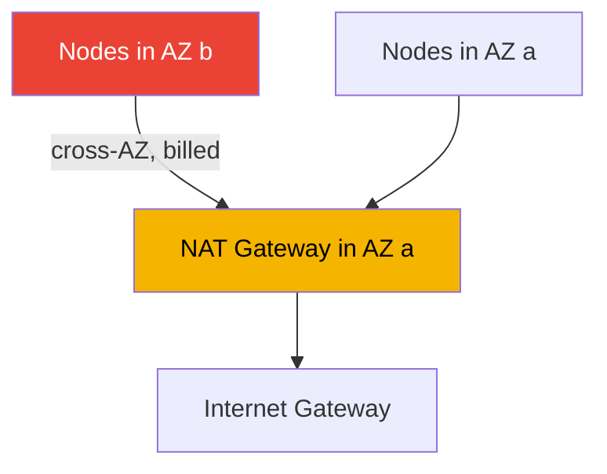
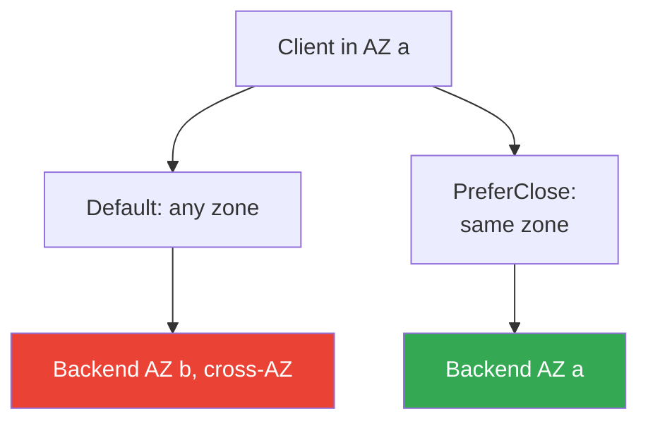

[Русская версия](ru.md) · [Versión en español](es.md) · [Version française](fr.md) · [Deutsche Version](de.md) · [ქართული ვერსია](ge.md) · [繁體中文版](tw.md) · [日本語版](jp.md)
# Chapter 31. Egress and traffic cost: NAT, VPC endpoints, PrivateLink

> **What comes next.** Chapters 26-30 covered cluster ingress and isolation: NLB (Chapter 26), ALB (Chapter
> 27), Gateway API (Chapter 28), DNS and certificates (Chapter 29), NetworkPolicy (Chapter 30). This chapter
> covers the reverse direction: outbound traffic and its cost: NAT Gateway, VPC endpoints, PrivateLink,
> cross-AZ. The fundamentals of VPCs, subnets, and NAT are covered in Part 0 (Chapter 00-3), overall cluster
> cost and Kubecost/OpenCost are in Chapter 43, multi-cluster and multi-account connectivity are in Chapter
> 32, and private S3 access for Mountpoint was mentioned in Chapter 25. This chapter focuses on one thing:
> where EKS pod egress traffic goes and why it produces a bill.

## 31.1. "The cluster works, but data transfer is growing as a separate line item on the bill"

The cluster is assembled correctly: nodes are in private subnets and access the outside world through a NAT
Gateway, as every VPC guide teaches. Workloads are running and there are no incidents. But a month later,
Cost Explorer shows a line item nobody budgeted for:

```
NatGateway-Bytes         ... large amount
DataTransfer-Regional-Bytes  ... comparable amount
NatGateway-Hours         ... noticeable amount
```

These lines are not associated with instances or volumes, are not visible in `kubectl top`, and cannot be
caught by HPA. Their source is pod network traffic itself: every gigabyte passing through a NAT Gateway is
charged for processing, while traffic between Availability Zones is charged for transfer in both directions.
Both are generated quietly:

- pods pull images from ECR: layers reside in S3, and the pull goes outside through NAT;
- an application accesses S3, DynamoDB, or external APIs: all egress goes through NAT;
- a pod in AZ `a` communicates with a pod or database in AZ `b`: this is cross-AZ and is billed;
- CloudWatch Logs, STS for IRSA, EC2 API calls: all of these are outbound bytes.

None of this is "broken." In the cloud, network traffic is a billable resource, and in EKS it is generated
not manually by engineers but automatically by hundreds of pods. Until the egress path is designed (NAT per
AZ, VPC endpoints for traffic to AWS), the data-transfer bill grows silently. Let us break down what it
consists of and what an engineer can control.

## 31.2. NAT Gateway: why it is needed and its cost model

EKS nodes in production reside in private subnets: they have no public IPs and cannot be reached from the
internet. Yet the pods themselves need outbound access: image pulls, calls to external APIs, updates. To let
a private subnet initiate outbound internet connections, a **NAT Gateway**, an AWS-managed address-translation
service, is placed in a public subnet. The `0.0.0.0/0` route from the private subnet leads to NAT, and NAT
leads to the Internet Gateway.

The NAT Gateway cost model consists of two independent parts:

- **Hourly charge** for the NAT Gateway itself: it accrues while the gateway exists, regardless of traffic.
- **Data-processing charge**: for every gigabyte that passes through NAT, in either direction.

The second part is the trap. NAT charges for processing every gigabyte of egress, and when it carries all
outbound cluster traffic - image pulls, AWS API calls, S3 access - volume accumulates rapidly. Moreover,
traffic to AWS services (S3, ECR, DynamoDB) through NAT is charged as ordinary egress, even though these
services reside inside the AWS network and do not need an internet path through NAT. This is the first thing
optimization removes (VPC endpoints, Section 31.3).

### The cross-AZ trap: one NAT for the whole cluster

The main source of unexpected bills is placing NAT gateways incorrectly across Availability Zones. A NAT
Gateway exists in a specific AZ. If you put one NAT in AZ `a` while spreading nodes across three zones, then
traffic from nodes in AZ `b` and `c` first goes **across the zone boundary** to the NAT in `a`, and only then
outward. This cross-AZ hop is billed in addition to NAT processing: you pay twice.



The correct design is **one NAT Gateway for every AZ** that contains nodes, with the private subnet route
pointing to the NAT in its own zone. Then egress does not cross an AZ boundary before leaving the network,
and the cross-AZ charge for this leg disappears. The hourly charge rises (there is now a NAT per zone rather
than one), but the savings from eliminating cross-AZ traffic and risks usually outweigh it. There is another
benefit: failure of one AZ does not leave nodes in other zones without egress.

| NAT design | Cross-AZ egress | Fault tolerance | Hourly charge |
|---|---|---|---|
| One NAT per cluster | yes, for all traffic from other AZs | an AZ failure breaks egress for everyone | minimal |
| A NAT in every AZ | none on the leg to NAT | an AZ failure does not affect others | higher, by number of zones |

## 31.3. VPC endpoints: two types and how they differ

A VPC endpoint is a way to reach an AWS service without going to the internet and without using NAT. Traffic
remains inside the AWS network. There are exactly two types, and they work differently.

**Gateway endpoints.** Supported only for **S3 and DynamoDB**. They are a subnet route-table entry: traffic
to the regional S3/DynamoDB prefixes is routed to the endpoint rather than NAT. Gateway endpoints are
**free**: no hourly charge and no data charge. For EKS, this directly saves money: ECR image-layer pulls go
to S3, and with an S3 gateway endpoint that volume moves from NAT to a free path. Applications that actively
use S3 gain the same benefit.

**Interface endpoints.** They are based on **AWS PrivateLink**. An ENI with a private IP is created in the
subnet, and calls to the service go to it. They support most AWS services (not only S3/DynamoDB). Cost:
**an hourly charge for every endpoint** plus **a data-processing charge**. They cost more than gateway
endpoints, but remove NAT from the path to the service and keep traffic private. With private DNS enabled,
applications continue using public service names without code changes: resolution is redirected to the
endpoint's private IP.

| Property | Gateway endpoint | Interface endpoint |
|---|---|---|
| Foundation | a route-table entry | PrivateLink, ENI in the subnet |
| Services | only S3 and DynamoDB | most AWS services |
| Cost | free | hourly + data charges |
| How it works | route to service prefixes | private IP, private DNS |
| Traffic bypasses NAT | yes | yes |

Both types have one thing in common: traffic to the service does not pass through NAT or leave the AWS
network. They differ in cost and coverage. The rule is simple: always use a gateway endpoint for S3 and
DynamoDB (it is free); use an interface endpoint for other services where NAT needs to be removed or privacy
is required.

## 31.4. Which endpoints matter for EKS

Endpoints are not mandatory for a regular cluster with internet access, but they remove AWS-bound traffic
from paid NAT. They are required for a **private cluster** without outbound access (Chapter 19): without
them, nodes will not register and pods will get neither images nor credentials. AWS specifies the following
set for a private cluster:

| Endpoint | Type | Why |
|---|---|---|
| com.amazonaws.`region`.s3 | gateway | ECR image layers and application access to S3 |
| com.amazonaws.`region`.ecr.api | interface | ECR API, authentication, and metadata |
| com.amazonaws.`region`.ecr.dkr | interface | pulling ECR images themselves |
| com.amazonaws.`region`.sts | interface | STS for IRSA (AssumeRoleWithWebIdentity) |
| com.amazonaws.`region`.eks-auth | interface | getting credentials for EKS Pod Identity |
| com.amazonaws.`region`.ec2 | interface | EC2 API, including node DNS name on EKS-optimized AMIs |
| com.amazonaws.`region`.elasticloadbalancing | interface | AWS Load Balancer Controller operation |
| com.amazonaws.`region`.logs | interface | sending node and pod logs to CloudWatch Logs |

Nuances that are easy to miss:

- **ECR pulls images from S3.** All three are required for a pull: `ecr.api`, `ecr.dkr`, and the `s3`
  gateway. Without the S3 endpoint, ECR authentication succeeds but downloading layers does not.
- **IRSA versus Pod Identity.** IRSA uses `sts` (plus the `oidc-eks` OIDC endpoint to make access to the
  cluster JWKS private); Pod Identity uses `eks-auth`. Which is needed depends on the selected identity
  mechanism (Chapters 16-17).
- **STS is global by default.** Many SDKs call `sts.amazonaws.com`, bypassing the regional endpoint. In a
  private cluster, configure SDKs to use the regional STS endpoint for the region.
- **Private DNS.** Enable private DNS for interface endpoints so workloads continue using public service
  names without changes.

Add `ssm`, `xray`, `autoscaling`, `eks`, and others as needed. The full list of PrivateLink services is in
the documentation. The principle is to enable an endpoint for every AWS service that pods and system
components actually call.

## 31.5. PrivateLink: private access to services

Interface endpoints are a special case of **AWS PrivateLink**, a mechanism for private access to services
through an ENI in your subnet. Beyond access to public AWS services, PrivateLink covers two scenarios:

- **Services in another account or from a vendor.** A provider (SaaS or a neighboring team) publishes its
  service as an **endpoint service**, while the consumer creates an interface endpoint that points to it.
  Traffic travels privately through the AWS network, without internet access, VPC peering, or opening
  networks toward one another. The connection is one-way: the consumer initiates and the provider accepts.
- **Your own services between VPCs and accounts.** You can publish your own service behind an NLB as an
  endpoint service and grant other accounts access without merging their VPCs into a shared network.

For EKS, this matters in two ways. First, pods can privately access vendor external APIs without internet
egress: traffic neither goes through NAT nor leaves AWS. Second, the cluster's own services can be published
externally through an endpoint service. This is a topic of multi-account connectivity, covered in detail in
Chapter 32. For now, it is enough to understand that PrivateLink is the same interface endpoint, except the
target can be a service in another account rather than an AWS service.

## 31.6. Cross-AZ traffic between pods and how to keep it in the zone

The second major source of data transfer after NAT is pod-to-pod traffic across an AZ boundary. By default,
a Service spreads requests across all healthy endpoints without considering zone: a pod in AZ `a` has an
equal chance of reaching a backend in `a`, `b`, or `c`. Every inter-zone request is billed, and this becomes
a noticeable line item for a busy service.

Kubernetes provides a mechanism to keep traffic in its own zone: **topology aware routing**. It is controlled
by the `trafficDistribution` field in a Service specification with the `PreferClose` value: kube-proxy tries
to send a request to an endpoint in the same zone as the client and uses another zone only when no local
endpoints exist. The field became GA in Kubernetes `1.33`; in earlier versions, the annotation
`service.kubernetes.io/topology-mode: Auto` enabled the same logic.

```yaml
apiVersion: v1
kind: Service
metadata:
  name: backend
spec:
  trafficDistribution: PreferClose   # keep traffic in the client's zone
  selector:
    app: backend
  ports:
    - { port: 80, targetPort: 8080 }
```

For local endpoints to exist in every zone at all, spread backend pods across AZs with
`topologySpreadConstraints` using the `topology.kubernetes.io/zone` key. One does not work without the
other: if all backend replicas end up in one zone, `PreferClose` will still send traffic across the boundary.
Load balancers have their own control: **cross-zone load balancing**. When enabled, the LB spreads traffic
evenly across targets in all zones (more even load, but more cross-AZ); when disabled, it keeps traffic in
the arrival zone (cheaper, but load is uneven). The setting depends on the load-balancer type and was covered
in Chapters 26-27.

An important caveat is needed here. Saving cross-AZ traffic **conflicts** with multi-AZ reliability. During
a failure or imbalance in one zone, `PreferClose` will persistently keep traffic local while even one live
endpoint remains, which can create a hot spot. Multi-AZ, PDBs, and topology spread as reliability tools are
covered in Chapter 40; it also sets the boundary beyond which accepting cross-AZ traffic is worthwhile for
resilience. Do not optimize traffic at the expense of availability.



## 31.7. Egress cost structure: what to optimize

Having assembled the picture, let us break cluster data transfer into components. No figures are given: the
important part is the structure and how each component can be reduced.

| Component | What generates it | How to reduce it |
|---|---|---|
| Outbound to the internet | pod egress outward, responses to external clients | image caching, CDN, less unnecessary egress |
| NAT processing | all private-subnet egress through NAT | VPC endpoints for AWS-bound traffic |
| Cross-AZ | pod-to-pod and pod-to-database traffic across a zone boundary | trafficDistribution, topology spread |
| NAT hourly charge | the fact that a NAT Gateway exists | do not create excess NATs, but have enough per AZ |
| Interface endpoints hourly charge | every interface endpoint | only required endpoints; S3/DDB use gateway |

The usual optimization priority is as follows. First, an **S3 gateway endpoint** (free and immediately
removes image pulls and application traffic to S3 from NAT). Then **NAT per zone** instead of one per
cluster, which removes cross-AZ traffic on the egress path. Next, **interface endpoints** for services that
pods use heavily (ECR, logs, sts), where NAT processing costs more than the endpoint's hourly charge. And
in parallel, **trafficDistribution with topology spread** on busy internal services. Assess the effect from
the bill and metrics, not by eye (Chapter 43).

## 31.8. How this is applied in production

- **Deploy one NAT per AZ with nodes.** One NAT per cluster saves pennies on the hourly charge but generates
  cross-AZ for all egress from other zones and creates a single point of failure.
- **Always enable an S3 gateway endpoint.** It is free and immediately removes ECR image pulls and
  application traffic to S3 from paid NAT. Do the same for DynamoDB if it is used.
- **Build a private cluster from the endpoint list.** Before the first pod, prepare ecr.api, ecr.dkr, s3,
  sts or eks-auth, ec2, logs, elasticloadbalancing, and everything workloads call.
- **Move AWS egress off NAT deliberately.** Create interface endpoints for high-traffic services; where NAT
  processing costs more than an endpoint's hourly charge, this is direct savings.
- **Reduce cross-AZ with topology aware routing.** For internal services with large east-west traffic, use
  trafficDistribution PreferClose plus topology spread, while remembering the reliability trade-off.
- **Monitor traffic through the bill and metrics.** NAT CloudWatch metrics (`BytesOutToDestination`,
  `BytesInFromDestination`) and Cost Explorer line items show where data transfer actually flows.

## 31.9. Mini-glossary

- **NAT Gateway**: an AWS-managed address-translation service that gives private subnets outbound internet
  access; billed hourly and per processed gigabyte.
- **cross-AZ traffic**: data transfer between Availability Zones; billed for transfer, usually in both
  directions.
- **VPC endpoint**: a private access point to an AWS service without internet access and without NAT.
- **Gateway endpoint**: a VPC endpoint type for S3 and DynamoDB through a route-table entry; free.
- **Interface endpoint**: a VPC endpoint type based on PrivateLink: an ENI in the subnet, an hourly charge,
  plus a data charge.
- **AWS PrivateLink**: a mechanism for private access to AWS services and services in other accounts through
  an interface endpoint.
- **endpoint service**: publishing your own service (behind an NLB) as a PrivateLink target for consumers in
  other VPCs and accounts.
- **topology aware routing**: preferring endpoints in the client's zone; enabled by the
  `trafficDistribution: PreferClose` field in a Service.
- **cross-zone load balancing**: a load-balancer mode that spreads traffic across targets in all zones; more
  even load, but more cross-AZ traffic.

## 31.10. Chapter summary

- In the cloud, network traffic is a billable resource, and in EKS hundreds of pods generate it
  automatically; data transfer appears as separate bill line items, not in `kubectl top`.
- A NAT Gateway gives private subnets egress and is billed in two ways: hourly plus every processed gigabyte;
  the latter adds up with image-pull volume and AWS API calls.
- The main trap is one NAT per cluster: node traffic from other AZs crosses a zone boundary to the NAT and is
  paid twice. The correct approach is one NAT in every AZ with nodes.
- VPC endpoints keep traffic to AWS services inside the AWS network, bypassing NAT. Gateway endpoints (S3,
  DynamoDB) are free; interface endpoints (PrivateLink) have hourly and data charges but cover almost all
  services.
- A private cluster needs endpoints for s3 (gateway), ecr.api, ecr.dkr, sts or eks-auth, ec2, logs,
  elasticloadbalancing, and others as needed; ECR pulls layers from S3.
- PrivateLink also provides private access to services in other accounts through an endpoint service, without
  internet access or merging VPCs into one network.
- Reduce pod-to-pod cross-AZ traffic with `trafficDistribution: PreferClose` (GA in 1.33) together with
  topology spread; cross-zone load balancing also affects it.
- Traffic savings conflict with multi-AZ reliability: PreferClose can create a hot spot during a zonal
  imbalance; Chapter 40 covers the trade-off.

## 31.11. How this helps in real work

On call, egress rarely appears as an incident: it appears as a bill. When finance brings an increased
`NatGateway-Bytes` or `DataTransfer-Regional-Bytes` line item, the investigation follows a familiar chain:
is there an S3 gateway endpoint (otherwise image pulls and S3 traffic hang off NAT), how many NAT Gateways
are there and how are they spread across zones, and which internal services send east-west traffic across
an AZ boundary? NAT metrics in CloudWatch and Cost Explorer breakdown by usage type show which component is
actually growing, so there is no need to guess.

During planning, make three decisions in advance. How many NATs to have and how to distribute them by zone:
one per AZ is almost always the correct default. Which VPC endpoints to create: for a private cluster, this
is a startup requirement; for a regular cluster, it is a way to move AWS-bound traffic off NAT. And where to
enable topology aware routing, weighing cross-AZ savings against resilience to a zonal imbalance. All three
are tied to overall cluster cost, consolidated in Chapter 43, and the multi-AZ reliability covered in
Chapter 40.

## 31.12. Self-check questions

1. Why does data transfer grow in EKS even though engineers do not move traffic manually, and where is it visible?
2. What two parts make up NAT Gateway cost, and which is usually unexpected?
3. What is the trap of one NAT Gateway per cluster, and why is that traffic paid for twice?
4. How should NAT Gateways be distributed across zones, and what does this provide besides savings?
5. How does a gateway endpoint differ from an interface endpoint in design, coverage, and cost?
6. Why does pulling ECR images also require an S3 gateway endpoint?
7. What set of VPC endpoints does a private EKS cluster without internet access require?
8. Which endpoints are required for IRSA, and which for EKS Pod Identity?
9. What is an endpoint service, and which PrivateLink scenario does it address?
10. How can pod-to-pod traffic be kept in its own zone, and which Service field enables it?
11. Why does `trafficDistribution: PreferClose` not work without topology spread across zones?
12. How does cross-zone load balancing affect the volume of cross-AZ traffic?
13. What is the conflict between saving cross-AZ traffic and multi-AZ reliability?

## Practice

The course lab for this topic: [Lab 117: Traffic and cost: NAT per zone versus one NAT, VPC
endpoints, cross-AZ](../../labs/117/README.MD). In addition, verify the cluster egress path in a live
account. First, check how many NAT Gateways exist and which zones they are in:

```bash
# NAT Gateways and their subnets (the subnet determines the AZ)
aws ec2 describe-nat-gateways \
  --query "NatGateways[].{Id:NatGatewayId,Subnet:SubnetId,State:State}" --output table

# which VPC endpoints already exist in the VPC
aws ec2 describe-vpc-endpoints \
  --query "VpcEndpoints[].{Name:ServiceName,Type:VpcEndpointType,State:State}" --output table
```

Check whether they include an S3 gateway and interfaces for ecr.api/ecr.dkr: if image pulls go through NAT,
they will not be in the list. Then assess how many bytes actually pass through NAT using CloudWatch metrics
in the `AWS/NATGateway` namespace:

```bash
# total outbound bytes through NAT for a day
aws cloudwatch get-metric-statistics --namespace AWS/NATGateway \
  --metric-name BytesOutToDestination --statistics Sum --period 86400 \
  --dimensions Name=NatGatewayId,Value=nat-xxxxxxxx \
  --start-time 2024-01-01T00:00:00Z --end-time 2024-01-02T00:00:00Z
```

Next, in Cost Explorer, group costs by usage type and find `NatGateway-Bytes`, `NatGateway-Hours`, and
`DataTransfer-Regional-Bytes`. These are the optimization targets from Section 31.7. Check whether internal
services have `trafficDistribution` configured and whether their pods are spread across zones using
`topologySpreadConstraints`.

---
[Table of contents](../README.md) · [Chapter 30](../30/en.md) · [Chapter 32](../32/en.md)
