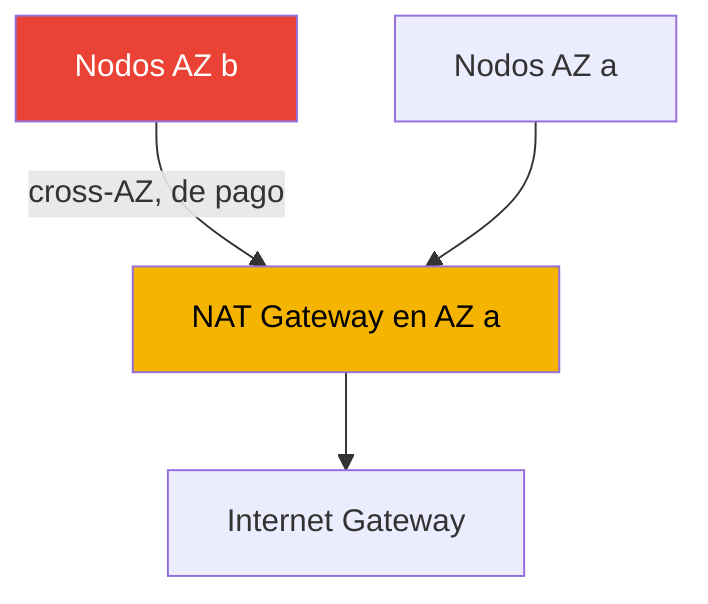
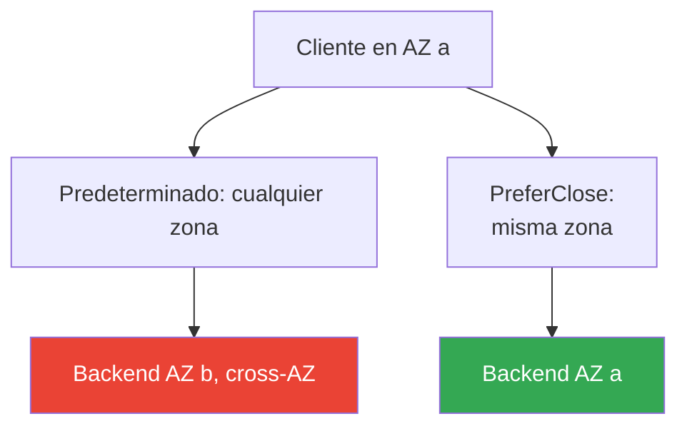

[Eng version](en.md) · [Русская версия](ru.md) · [Version française](fr.md) · [Deutsche Version](de.md) · [ქართული ვერსია](ge.md) · [繁體中文版](tw.md) · [日本語版](jp.md)
# Capítulo 31. Egress y coste del tráfico: NAT, VPC endpoints, PrivateLink

> **Qué sigue.** Los capítulos 26-30 analizaron la entrada al clúster y el aislamiento: NLB (capítulo 26), ALB (capítulo
> 27), Gateway API (capítulo 28), DNS y certificados (capítulo 29), NetworkPolicy (capítulo 30). Aquí va la
> dirección contraria: el tráfico saliente al exterior y su coste: NAT Gateway, VPC endpoints, PrivateLink,
> cross-AZ. La arquitectura básica de VPC, subredes y NAT se presenta en la Parte 0 (capítulo 00-3), el coste
> del clúster en conjunto y Kubecost/OpenCost en el capítulo 43, la conectividad multiclúster y multicuenta
> en el capítulo 32, y el acceso privado a S3 para Mountpoint se mencionó en el capítulo 25. Aquí hay un solo
> tema: a dónde va el tráfico egress de los pods en EKS y por qué genera una factura.

## 31.1. «El clúster funciona, pero data transfer crece como una línea separada en la factura»

El clúster está montado correctamente: nodos en subredes privadas, con salida al exterior mediante NAT Gateway,
como enseña cualquier guía de VPC. Las cargas funcionan, no hay incidentes. Pero al cabo de un mes aparece
una línea que nadie había presupuestado en Cost Explorer:

```
NatGateway-Bytes         ... suma elevada
DataTransfer-Regional-Bytes  ... suma comparable
NatGateway-Hours         ... suma apreciable
```

Estas líneas no están vinculadas a instancias ni a volúmenes, no se ven en `kubectl top` y no se pueden detectar
con HPA. Su origen es el propio tráfico de red de los pods: por cada gigabyte que pasa a través de NAT Gateway,
se cobra el procesamiento, y por el tráfico entre zonas de disponibilidad se cobra la transferencia en ambos
sentidos. Ambos se generan de forma inadvertida:

- los pods descargan imágenes desde ECR: las capas están en S3 y el pull sale a través de NAT;
- la aplicación accede a S3, DynamoDB o API externas: todo el egress pasa por NAT;
- un pod en la AZ `a` se comunica con un pod o una base de datos en la AZ `b`: es cross-AZ y se factura;
- CloudWatch Logs, STS para IRSA, llamadas a la API de EC2: todos son bytes salientes.

Nada de esto está «roto». Simplemente, en la nube el tráfico de red es un recurso de pago, y en EKS no lo
producen los ingenieros manualmente, sino cientos de pods de forma automática. Mientras no se haya diseñado
la ruta de egress (NAT por zona, VPC endpoints para el tráfico hacia AWS), la factura por data transfer crece en
silencio. Veamos de qué se compone y qué puede controlar el ingeniero.

## 31.2. NAT Gateway: para qué sirve y su modelo de costes

Los nodos EKS en producción viven en subredes privadas: no tienen IP públicas y no se puede acceder a ellos
desde Internet. Pero los propios pods necesitan acceso saliente: pull de imágenes, llamadas a API externas,
actualizaciones. Para que una subred privada pueda iniciar conexiones salientes a Internet, se coloca un
**NAT Gateway** en una subred pública, un servicio administrado de AWS de traducción de direcciones. La ruta
`0.0.0.0/0` desde la subred privada lleva al NAT, y el NAT al Internet Gateway.

El modelo de coste de NAT Gateway consta de dos partes independientes:

- **Cargo por hora** por el propio NAT Gateway: se cobra mientras existe, independientemente del tráfico.
- **Cargo por datos procesados**: por cada gigabyte que pasa por el NAT, en cualquier dirección.

La segunda parte es la trampa. NAT cobra por procesar cada gigabyte de egress y, cuando todo el tráfico saliente
del clúster pasa por él, pull de imágenes, llamadas a API de AWS, accesos a S3, el volumen crece rápidamente.
Además, el tráfico a servicios AWS (S3, ECR, DynamoDB) a través de NAT se cobra como egress normal, aunque
estos servicios vivan dentro de la red de AWS y no necesiten una ruta por NAT a Internet. Es lo primero que se
elimina con la optimización (VPC endpoints, sección 31.3).

### La trampa cross-AZ: un NAT para todo el clúster

La principal fuente de facturas inesperadas es una ubicación incorrecta de NAT por zonas. Un NAT Gateway vive
en una AZ concreta. Si se instala un solo NAT en la AZ `a` y los nodos se distribuyen entre tres zonas, el tráfico
de los nodos de las AZ `b` y `c` primero cruza **el límite de zona** hasta el NAT de `a`, y solo después sale al
exterior. Este salto cross-AZ se cobra además del procesamiento de NAT: se paga dos veces.



El esquema correcto es **un NAT Gateway por cada AZ** que tenga nodos, y la ruta de la subred privada lleva al
NAT de su misma zona. Así el egress no cruza el límite de AZ antes de salir al exterior y desaparece el cargo
cross-AZ en ese tramo. El cargo horario aumenta, ya que ahora hay un NAT por zona, pero normalmente lo compensan
el ahorro del cross-AZ eliminado y la reducción de riesgos. Hay otra ventaja: la caída de una AZ no deja sin
egress a los nodos de las demás zonas.

| Esquema NAT | Egress cross-AZ | Tolerancia a fallos | Cargo por hora |
|---|---|---|---|
| Un NAT por clúster | sí, para todo el tráfico de AZ ajenas | la caída de la AZ corta el egress de todos | mínimo |
| Un NAT por cada AZ | no en el tramo hasta NAT | la caída de una AZ no afecta a las demás | mayor, según el número de zonas |

## 31.3. VPC endpoints: dos tipos y cuál es la diferencia

Un VPC endpoint permite llegar a un servicio de AWS sin salir a Internet y evitando NAT. El tráfico se mantiene
dentro de la red de AWS. Hay exactamente dos tipos, y funcionan de manera diferente.

**Gateway endpoints.** Solo se admiten para **S3 y DynamoDB**. Son una entrada en la tabla de rutas de la
subred: el tráfico hacia los prefijos de S3/DynamoDB de la región se dirige al endpoint, no al NAT. Los gateway
endpoints son **gratuitos**: no hay cargo por hora ni por datos. Para EKS es un ahorro directo: el pull de las
capas de imágenes desde ECR va a S3 y, con un gateway endpoint para S3, ese volumen deja NAT y pasa por una
ruta gratuita. Las aplicaciones que usan S3 intensivamente obtienen el mismo beneficio.

**Interface endpoints.** Funcionan sobre **AWS PrivateLink**. Se crea una ENI con IP privada en la subred y las
llamadas al servicio van a ella. Admiten la mayoría de servicios AWS, no solo S3/DynamoDB. Su coste es un
**cargo por hora por cada endpoint** más un **cargo por datos procesados**. Son más caros que gateway, pero
eliminan NAT de la ruta al servicio y mantienen el tráfico privado. Con private DNS habilitado, las aplicaciones
siguen accediendo a los nombres públicos de los servicios sin cambios de código: la resolución se sustituye por
la IP privada del endpoint.

| Propiedad | Gateway endpoint | Interface endpoint |
|---|---|---|
| Base | entrada en la route table | PrivateLink, ENI en la subred |
| Servicios | solo S3 y DynamoDB | mayoría de los servicios AWS |
| Coste | gratuito | por hora + por datos |
| Cómo se logra | ruta a prefijos del servicio | IP privada, private DNS |
| El tráfico evita NAT | sí | sí |

Ambos tipos tienen algo en común: el tráfico al servicio no pasa por NAT ni abandona la red de AWS. La diferencia
está en el precio y la cobertura. La regla es simple: para S3 y DynamoDB, siempre gateway (es gratuito); para
los demás servicios, interface cuando se necesite eliminar NAT o se requiera privacidad.

## 31.4. Qué endpoints son importantes para EKS

Un clúster normal con salida a Internet no necesita endpoints, pero estos eliminan del NAT el tráfico hacia AWS.
Un **clúster privado** sin salida al exterior (capítulo 19) los necesita: sin ellos, los nodos no se registrarán y
los pods no recibirán imágenes ni credentials. El conjunto indicado por AWS para un clúster privado es el
siguiente:

| Endpoint | Tipo | Motivo |
|---|---|---|
| com.amazonaws.`region`.s3 | gateway | capas de imágenes de ECR y acceso de aplicaciones a S3 |
| com.amazonaws.`region`.ecr.api | interface | API de ECR, autenticación y metadatos |
| com.amazonaws.`region`.ecr.dkr | interface | pull de las propias imágenes desde ECR |
| com.amazonaws.`region`.sts | interface | STS para IRSA (AssumeRoleWithWebIdentity) |
| com.amazonaws.`region`.eks-auth | interface | obtención de credentials para EKS Pod Identity |
| com.amazonaws.`region`.ec2 | interface | API de EC2, incluido el nombre DNS del nodo en AMI optimizada para EKS |
| com.amazonaws.`region`.elasticloadbalancing | interface | funcionamiento de AWS Load Balancer Controller |
| com.amazonaws.`region`.logs | interface | envío de logs de nodos y pods a CloudWatch Logs |

Matices que es fácil pasar por alto:

- **ECR descarga imágenes desde S3.** Para el pull se necesitan los tres: `ecr.api`, `ecr.dkr` y el gateway de
  `s3`. Sin el endpoint de S3, la autenticación en ECR funcionará, pero la descarga de capas no.
- **IRSA frente a Pod Identity.** IRSA usa `sts`, más el endpoint OIDC `oidc-eks` para privatizar la consulta a
  JWKS del clúster; Pod Identity usa `eks-auth`. Lo necesario depende del mecanismo de identidad elegido
  (capítulos 16-17).
- **STS es global de forma predeterminada.** Muchos SDK acceden a `sts.amazonaws.com`, evitando el endpoint
  regional. En un clúster privado, el SDK se cambia al endpoint regional de STS de la región.
- **Private DNS.** Para los interface endpoints se habilita private DNS, de modo que las cargas sigan usando los
  nombres públicos de los servicios sin modificaciones.

Además, según la necesidad se usan `ssm`, `xray`, `autoscaling`, `eks` y otros; la lista completa de servicios
con PrivateLink está en la documentación. El principio es habilitar un endpoint para cada servicio AWS al que
realmente acceden los pods y los componentes del sistema.

## 31.5. PrivateLink: acceso privado a servicios

Los interface endpoints son un caso particular de **AWS PrivateLink**, el mecanismo de acceso privado a
servicios mediante una ENI en la subred. PrivateLink cubre dos escenarios además del acceso a los servicios
públicos de AWS:

- **Servicios en otra cuenta o de un proveedor.** El proveedor (SaaS, un equipo vecino) publica su servicio
  como **endpoint service**, y el consumidor crea un interface endpoint que lo señala. El tráfico circula de
  forma privada por la red de AWS, sin salir a Internet, sin VPC peering y sin abrir las redes mutuamente. La
  conexión es unidireccional: el consumidor inicia y el proveedor acepta.
- **Servicios propios entre VPC y cuentas.** Detrás de un NLB se puede publicar un servicio propio como endpoint
  service y conceder acceso a otras cuentas sin unir sus VPC en una red común.

Para EKS esto importa por dos lados. Primero, el acceso privado de los pods a API externas de proveedores sin
egress a Internet: el tráfico no pasa por NAT ni abandona AWS. Segundo, publicar los servicios del propio clúster
hacia fuera mediante endpoint service, un tema de conectividad multicuentas tratado en detalle en el capítulo 32.
Aquí basta comprender que PrivateLink es el mismo interface endpoint, solo que el destino puede no ser un servicio
AWS sino uno de otra cuenta.

## 31.6. Tráfico cross-AZ entre pods y cómo mantenerlo en la zona

La segunda fuente importante de data transfer después de NAT es el tráfico pod a pod a través del límite de AZ.
De forma predeterminada, Service distribuye solicitudes entre todos los endpoint sanos sin considerar la zona: un
pod en la AZ `a` llegará con igual probabilidad a un backend en `a`, `b` o `c`. Cada solicitud interzonal se
factura y, en un servicio con mucha carga, se convierte en una línea notable de la factura.

Kubernetes ofrece un mecanismo para mantener el tráfico en su propia zona: **topology aware routing**. Se controla
con el campo `trafficDistribution` de la especificación de Service con el valor `PreferClose`: kube-proxy intenta
dirigir la solicitud a un endpoint de la misma zona que el cliente y solo va a otra zona si no hay endpoint locales.
El campo llegó a GA en Kubernetes `1.33`; en versiones anteriores, la misma lógica se habilitaba con la anotación
`service.kubernetes.io/topology-mode: Auto`.

```yaml
apiVersion: v1
kind: Service
metadata:
  name: backend
spec:
  trafficDistribution: PreferClose   # mantener el tráfico en la zona del cliente
  selector:
    app: backend
  ports:
    - { port: 80, targetPort: 8080 }
```

Para que haya endpoint locales en cada zona, los pods backend se distribuyen entre las AZ mediante
`topologySpreadConstraints` con la clave `topology.kubernetes.io/zone`. Uno no funciona sin el otro: si todas
las réplicas del backend han quedado en una zona, `PreferClose` seguirá enviando el tráfico a través del límite.
Los balanceadores tienen su propia palanca, **cross-zone load balancing**: habilitada, el LB distribuye de forma
uniforme entre destinos de todas las zonas, lo que equilibra más la carga pero aumenta cross-AZ; deshabilitada,
mantiene el tráfico en la zona de entrada, lo que es más barato pero deja una carga desigual. La configuración
depende del tipo de balanceador y se analizó en los capítulos 26-27.

Aquí hay un matiz importante. El ahorro de tráfico cross-AZ **entra en conflicto** con la fiabilidad multi-AZ.
Ante una caída o desequilibrio en una zona, `PreferClose` mantendrá obstinadamente el tráfico local mientras quede
al menos un endpoint vivo, lo que puede crear un punto caliente. Multi-AZ, PDB y topology spread como herramientas
de fiabilidad se analizan en el capítulo 40; allí también está el límite a partir del cual conviene aceptar tráfico
cross-AZ por resiliencia. No optimice el tráfico en perjuicio de la disponibilidad.



## 31.7. Estructura del coste de egress: qué optimizar

Una vez reunida la imagen completa, dividamos el data transfer del clúster en sus componentes. No se dan cifras:
importan la estructura y cómo reducir cada partida.

| Componente | Qué lo genera | Cómo se reduce |
|---|---|---|
| Salida a Internet | egress de pods al exterior, respuestas a clientes externos | caché de imágenes, CDN, menos egress innecesario |
| Procesamiento en NAT | todo el egress de las subredes privadas mediante NAT | VPC endpoints para el tráfico a AWS |
| Cross-AZ | pod a pod y pod a base de datos a través del límite de zona | trafficDistribution, topology spread |
| NAT por hora | la propia existencia de NAT Gateway | no crear NAT innecesarios, pero sí uno por AZ |
| Interface endpoints por hora | cada interface endpoint | solo los endpoints necesarios, S3/DDB mediante gateway |

La prioridad de optimización suele ser esta. Primero, **gateway endpoint para S3**: es gratuito y elimina de NAT
inmediatamente el pull de imágenes y el tráfico de aplicaciones a S3. Después, **NAT por zonas** en lugar de uno
por clúster, eliminando cross-AZ en la ruta de egress. Luego, **interface endpoints** para los servicios a los que
los pods acceden activamente, ECR, logs, sts, donde el procesamiento de NAT cuesta más que el cargo horario del
endpoint. Y en paralelo, **trafficDistribution con topology spread** en los servicios internos de alta carga. El
efecto debe observarse en la factura y en las métricas, no estimarse a ojo (capítulo 43).

## 31.8. Cómo se aplica en producción

- **Se instala un NAT por cada AZ con nodos.** Un NAT por clúster ahorra poco en el cargo horario y genera
  cross-AZ para todo el egress de las zonas ajenas, además de un punto único de fallo.
- **El gateway endpoint para S3 se habilita siempre.** Es gratuito y elimina de NAT de pago el pull de imágenes
  ECR y el tráfico de aplicaciones a S3. DynamoDB también, si se utiliza.
- **Un clúster privado se construye desde la lista de endpoints.** Antes del primer pod se preparan ecr.api,
  ecr.dkr, s3, sts o eks-auth, ec2, logs, elasticloadbalancing y todo aquello a lo que accedan las cargas.
- **El egress a AWS se saca de NAT conscientemente.** Se instalan interface endpoints para servicios con mucho
  tráfico; cuando el procesamiento de NAT cuesta más que el cargo horario del endpoint, es un ahorro directo.
- **El cross-AZ se reduce con topology aware routing.** En servicios internos con mucho east-west se configura
  trafficDistribution PreferClose junto con topology spread, sin olvidar el equilibrio con la fiabilidad.
- **El tráfico se supervisa mediante la factura y métricas.** Las métricas NAT de CloudWatch (`BytesOutToDestination`,
  `BytesInFromDestination`) y las líneas de Cost Explorer muestran dónde fluye realmente el data transfer.

## 31.9. Miniglosario

- **NAT Gateway**: servicio administrado de AWS de traducción de direcciones que proporciona a subredes privadas
  acceso saliente a Internet; se factura por hora y por gigabytes procesados.
- **tráfico cross-AZ**: transferencia de datos entre zonas de disponibilidad; se factura por la transferencia,
  normalmente en ambos sentidos.
- **VPC endpoint**: punto de acceso privado a un servicio AWS sin salir a Internet ni pasar por NAT.
- **Gateway endpoint**: tipo de VPC endpoint para S3 y DynamoDB mediante una entrada en la route table; es
  gratuito.
- **Interface endpoint**: tipo de VPC endpoint basado en PrivateLink: una ENI en la subred, cargo por hora más
  cargo por datos.
- **AWS PrivateLink**: mecanismo de acceso privado a servicios AWS y a servicios de otras cuentas mediante
  interface endpoint.
- **endpoint service**: publicación de un servicio propio, detrás de NLB, como destino PrivateLink para
  consumidores de otras VPC y cuentas.
- **topology aware routing**: preferencia por endpoint en la zona del cliente; se habilita con el campo
  `trafficDistribution: PreferClose` en Service.
- **cross-zone load balancing**: modo del balanceador que distribuye el tráfico entre destinos de todas las zonas;
  equilibra más la carga, pero aumenta cross-AZ.

## 31.10. Resumen del capítulo

- En la nube, el tráfico de red es un recurso de pago y en EKS cientos de pods lo generan automáticamente; data
  transfer aparece en líneas separadas de la factura, no en `kubectl top`.
- NAT Gateway da egress a las subredes privadas y se factura de dos formas: por hora más cada gigabyte procesado;
  la segunda se acumula con el volumen de pull de imágenes y llamadas a API de AWS.
- La trampa principal es un NAT por clúster: el tráfico de nodos de otras AZ cruza el límite de zona hasta NAT y
  se paga dos veces. Lo correcto es un NAT por cada AZ con nodos.
- Los VPC endpoints mantienen el tráfico a servicios AWS dentro de la red de AWS, evitando NAT. Gateway, S3 y
  DynamoDB, es gratuito; interface, PrivateLink, se cobra por hora y por datos, pero cubre casi todos los
  servicios.
- Un clúster privado necesita endpoints para s3 (gateway), ecr.api, ecr.dkr, sts o eks-auth, ec2, logs,
  elasticloadbalancing y otros según la necesidad; ECR obtiene sus capas de S3.
- PrivateLink también da acceso privado a servicios de otras cuentas mediante endpoint service, sin salir a
  Internet ni unir VPC en una red común.
- El tráfico pod a pod cross-AZ se reduce con `trafficDistribution: PreferClose` (GA en 1.33) junto con topology
  spread; en los balanceadores influye cross-zone load balancing.
- El ahorro de tráfico entra en conflicto con la fiabilidad multi-AZ: PreferClose puede crear un punto caliente
  ante un desequilibrio de zona; el equilibrio se analiza en el capítulo 40.

## 31.11. Cómo ayuda esto en el trabajo real

Durante una guardia, egress rara vez aparece como incidente: aparece como factura. Cuando finanzas informa de un
crecimiento en `NatGateway-Bytes` o `DataTransfer-Regional-Bytes`, el análisis sigue una cadena conocida: si hay
un gateway endpoint para S3, de otro modo el pull de imágenes y el tráfico a S3 están en NAT, cuántos NAT Gateway
hay y cómo se distribuyen entre zonas, y qué servicios internos mueven east-west a través del límite de AZ. Las
métricas NAT de CloudWatch y el desglose de Cost Explorer por usage type muestran qué componente crece realmente,
sin necesidad de adivinar.

Al planificar, se toman tres decisiones por adelantado. Cuántos NAT y cómo distribuirlos por zonas: uno por AZ es
casi siempre el valor predeterminado correcto. Qué conjunto de VPC endpoints usar: para un clúster privado es una
condición de arranque, para uno normal es una forma de sacar de NAT el tráfico a AWS. Y dónde habilitar topology
aware routing, valorando el ahorro cross-AZ frente a la resiliencia ante el desequilibrio de una zona. Las tres se
relacionan con el coste total del clúster, tratado en el capítulo 43, y con la fiabilidad multi-AZ del capítulo 40.

## 31.12. Preguntas de autoevaluación

1. ¿Por qué crece data transfer en EKS aunque los ingenieros no muevan tráfico manualmente y dónde se ve?
2. ¿De qué dos partes consta el coste de NAT Gateway y cuál suele ser inesperada?
3. ¿Cuál es la trampa de un solo NAT Gateway por clúster y por qué ese tráfico se paga dos veces?
4. ¿Cómo se deben distribuir los NAT Gateway por zonas y qué aporta además del ahorro?
5. ¿En qué se diferencia un gateway endpoint de un interface endpoint en arquitectura, cobertura y coste?
6. ¿Por qué el pull de imágenes de ECR también necesita un gateway endpoint para S3?
7. ¿Qué conjunto de VPC endpoints necesita un clúster EKS privado sin salida a Internet?
8. ¿Qué endpoints necesita IRSA y cuáles EKS Pod Identity?
9. ¿Qué es un endpoint service y qué escenario de PrivateLink cubre?
10. ¿Cómo se mantiene el tráfico pod a pod en su propia zona y con qué campo de Service se habilita?
11. ¿Por qué `trafficDistribution: PreferClose` no funciona sin topology spread por zonas?
12. ¿Cómo afecta cross-zone load balancing al volumen de tráfico cross-AZ?
13. ¿Cuál es el conflicto entre el ahorro de tráfico cross-AZ y la fiabilidad multi-AZ?

## Práctica

El laboratorio del curso para este tema: [lab 117: Tráfico y coste: NAT por zonas frente a un NAT, VPC
endpoints, cross-AZ](../../labs/117/README_ES.MD). Además, la ruta de egress del clúster se comprueba en una
cuenta activa. Primero, vea cuántos NAT Gateway hay y en qué zonas se encuentran:

```bash
# NAT Gateway y sus subredes (la AZ se determina por la subred)
aws ec2 describe-nat-gateways \
  --query "NatGateways[].{Id:NatGatewayId,Subnet:SubnetId,State:State}" --output table

# qué VPC endpoints ya se han creado en la VPC
aws ec2 describe-vpc-endpoints \
  --query "VpcEndpoints[].{Name:ServiceName,Type:VpcEndpointType,State:State}" --output table
```

Compruebe si hay un gateway para S3 y un interface para ecr.api/ecr.dkr: si el pull de imágenes pasa por NAT, no
estarán en la lista. A continuación, estime cuántos bytes pasan realmente por NAT mediante las métricas de
CloudWatch en el namespace `AWS/NATGateway`:

```bash
# suma de bytes salientes a través de NAT durante un día
aws cloudwatch get-metric-statistics --namespace AWS/NATGateway \
  --metric-name BytesOutToDestination --statistics Sum --period 86400 \
  --dimensions Name=NatGatewayId,Value=nat-xxxxxxxx \
  --start-time 2024-01-01T00:00:00Z --end-time 2024-01-02T00:00:00Z
```

Después, en Cost Explorer agrupe los costes por usage type y localice las líneas `NatGateway-Bytes`,
`NatGateway-Hours` y `DataTransfer-Regional-Bytes`: son el objeto de optimización de la sección 31.7. Compruebe
en los servicios internos si se ha establecido `trafficDistribution` y si sus pods están distribuidos por zonas
mediante `topologySpreadConstraints`.

---
[Índice](../README_ES.md) · [Capítulo 30](../30/es.md) · [Capítulo 32](../32/es.md)
